+++
title = "Gitops"
date = "2026-05-28T00:01:08+08:00"
draft = false
+++

# tekton

tekton 是一款功能非常强大而灵活的开源的 CI/CD 云原生框架。Tekton 的前身是 Knative 项目的 build-pipeline 项目，这个项目是为了给 build 模块增加 pipeline 的功能，但是随着不同的功能加入到 Knative build 模块中，build 模块越来越变得像一个通用的 CI/CD 系统，于是，索性将 build-pipeline 剥离出 Knative，就变成了现在的 Tekton，而 Tekton 也从此致力于提供全功能、标准化的云原生 CI/CD 解决方案。

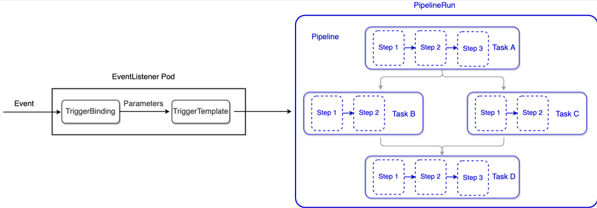

Tekton 为 CI/CD 系统提供了诸多好处：

- 可定制：Tekton 是完全可定制的，具有高度的灵活性，我们可以定义非常详细的构建块目录，供开发人员在各种场景中使用。比较基础的功能，应该是所有 CI/CD 系统都有这个功能。

- 可重复使用：Tekton 是完全可移植的，任何人都可以使用给定的流水线并重用其构建块，可以使得开发人员无需"造轮子"就可以快速构建复杂的流水线。所有工作都运行在 pod 中，对外部系统无依赖，无缝迁移。

- 可扩展：Tekton Catalog是社区驱动的 Tekton 构建块存储库，我们可以使用 Tekton Catalog中定义的组件快速创建新的流水线并扩展现有管道。dockerhub 之于 docker，用于存放 Tekton 自己的模块。

- 标准化：Tekton 在你的 Kubernetes 集群上作为扩展安装和运行，并使用完善的 Kubernetes 资源模型，Tekton 工作负载在 Kubernetes Pod 内执行。

**组件**

tekton pipeline :以crd构建cicd流水线对象。

tekton Triggers：实例化流水线，实现触发流水线和构建工作。

tekton Cli：一个tkn的命令行工具，类似kubectl。

tekton dashboard：一个web图形化界面。方便查看构建日志和编译流程。

tekton catalog：社区提供现成的task和pipeline模板，方便白嫖。

tekton hub：web页面的catalog

tekton operator：方便k8s更新管理tekton。

## 安装

### Pipeline

从 Tekton 0.30 版本开始，需要拥有Kubernetes 版本 1.20 或更高版本的集群

v0.43.2要求k8s必须1.22以上

```bash
curl https://storage.googleapis.com/tekton-releases/pipeline/previous/v0.43.2/release.yaml -o pipeline.yaml
kubectl apply -f pipeline.yaml
```

### Dashboard

```bash
curl https://storage.googleapis.com/tekton-releases/dashboard/previous/v0.31.0/tekton-dashboard-release.yaml -o tekton-dashboard-release.yaml
```

修改文件中的service为nodeport模式，方便web访问

```yaml
vim tekton-dashboard-release.yaml
...
apiVersion: v1
kind: Service
metadata:
  labels:
    app: tekton-dashboard
    app.kubernetes.io/component: dashboard
    app.kubernetes.io/instance: default
    app.kubernetes.io/name: dashboard
    app.kubernetes.io/part-of: tekton-dashboard
    app.kubernetes.io/version: v0.23.0
    dashboard.tekton.dev/release: v0.23.0
    version: v0.23.0
  name: tekton-dashboard
  namespace: tekton-pipelines
spec:
	# 添加此行内容
  type: NodePort
  ports:
    - name: http
      port: 9097
      protocol: TCP
      targetPort: 9097
      # 添加此行内容
      nodePort: 32097
```

### Triggers

```bash
curl https://storage.googleapis.com/tekton-releases/triggers/previous/v0.22.1/release.yaml -o trigger-release.yaml
curl https://storage.googleapis.com/tekton-releases/triggers/previous/v0.22.1/interceptors.yaml -o trigger-interceptors.yaml

```

### CLI

**下载rpm包：**https://github.com/tektoncd/cli/releases

```bash
wget https://github.com/tektoncd/cli/releases/download/v0.29.0/tektoncd-cli-0.29.0_Linux-64bit.rpm
yum -y install tektoncd-cli-0.29.0_Linux-64bit.rpm
```

验证

```bash
tkn version
Client version: 0.29.0
Pipeline version: v0.43.2
Triggers version: v0.22.1
Dashboard version: v0.31.0
```

## crds资源

tekton本身提供了很多的资源类型，需要理解常用的crds资源。

```bash
# kubectl get crd|grep tekton
clusterinterceptors.triggers.tekton.dev               2024-05-23T05:47:56Z
clustertasks.tekton.dev                               2024-05-23T05:46:30Z
clustertriggerbindings.triggers.tekton.dev            2024-05-23T05:47:56Z
customruns.tekton.dev                                 2024-05-23T05:46:30Z
eventlisteners.triggers.tekton.dev                    2024-05-23T05:47:56Z
extensions.dashboard.tekton.dev                       2024-05-23T05:47:41Z
interceptors.triggers.tekton.dev                      2024-05-23T05:47:56Z
pipelineresources.tekton.dev                          2024-05-23T05:46:30Z
pipelineruns.tekton.dev                               2024-05-23T05:46:30Z
pipelines.tekton.dev                                  2024-05-23T05:46:30Z
resolutionrequests.resolution.tekton.dev              2024-05-23T05:46:30Z
runs.tekton.dev                                       2024-05-23T05:46:30Z
taskruns.tekton.dev                                   2024-05-23T05:46:31Z
tasks.tekton.dev                                      2024-05-23T05:46:31Z
triggerbindings.triggers.tekton.dev                   2024-05-23T05:47:57Z
triggers.triggers.tekton.dev                          2024-05-23T05:47:56Z
triggertemplates.triggers.tekton.dev                  2024-05-23T05:47:57Z
verificationpolicies.tekton.dev                       2024-05-23T05:46:31Z

```


## 核心概念

### Task

表示执行命令的一系列有序的步骤，task 里可以定义一系列的 steps，例如编译代码、构建镜像、推送镜像等，每个 step 实际由一个 Pod 执行

也是一个任务执行模板，Task 定义中可以包含变量，Task 在真正执行的时候需要给定变量的具体值。很类似于一个函数的定义，Task 通过 inputs.params 定义需要哪些入参，并且每一个入参还可以指定默认值。

steps 字段表示当前 Task 是有哪些子步骤组成的。每一个步骤具体就是一个镜像的执行，镜像的启动参数可以通过 Task 的入参使用模板语法进行配置。

- args类型的task

```yaml
apiVersion: tekton.dev/v1beta1
kind: Task
metadata:
  name: hello
spec:
  steps:
    - name: hello
      image: ubuntu
      command:
        - echo
      args:
        - "Hello World!"
```

- 调用secret资源

```yaml
apiVersion: tekton.dev/v1beta1
kind: Task
metadata:
  name: env
spec:  
  steps:
  - image: ubuntu
    command: [echo]
    args: ["FOO is $(FOO)"]
    env:
      - name: "FOO"
        valueFrom:
          secretKeyRef:
            name: mysecret
            key: username
```

- 安全上下文

```yaml
apiVersion: tekton.dev/v1beta1
kind: Task
metadata:
  name: securitycontext
spec:  
  steps:
  - image: ubuntu
    command: [id]
    securityContext:
      runAsUser: 2000
```

- imagepull策略

```yaml
apiVersion: tekton.dev/v1beta1
kind: Task
metadata:
  name: imagepullpolicy 
spec:  
  steps:
  - image: ubuntu
    command: [echo]
    args:
    - hello
    imagePullPolicy: IfNotPresent
```

- voluments挂载

```yaml
apiVersion: tekton.dev/v1beta1
kind: Task
metadata:
  name: volumemounts
spec:   
  steps:
  - image: docker:20.10.5
    name: client
    script: |
        #!/usr/bin/env sh
        cat > Dockerfile << EOF
        FROM ubuntu
        RUN apt-get update
        ENTRYPOINT ["echo", "hello"]
        EOF
        docker build -t hello . && docker run hello
        docker images
    volumeMounts:
      - mountPath: /var/run/docker.sock
        name: docker-socket
  volumes:
    - name: docker-socket
      hostPath:
        path: /var/run/docker.sock
        type: Socket
```

- 带env变量

```yaml
apiVersion: tekton.dev/v1beta1
kind: Task
metadata:
  name: env
spec: 
  steps:
  - image: ubuntu
    command: [echo]
    args: ["FOO is $(FOO)"]
    env:
      - name: "FOO"
        value: "baz"
```

- 带params参数

```yaml
apiVersion: tekton.dev/v1beta1
kind: Task
metadata:
  name: params-array
spec:
  params:
  - name: array-param
    type: array
    default:
    - a
    - b
    - c
  - name: someURL
    type: string
  steps:
  - image: ubuntu
    command: [echo]
    args:
    - "$(params.array-param[*])"
    - "$(params.someURL)"
    imagePullPolicy: IfNotPresent
```

### ClusterTask

覆盖整个集群的任务，而不是单一的某一个命名空间，这是和 Task 最大的区别，其他基本上一致的

### TaskRun

Task 定义好以后是不能执行的，就像一个函数定义好以后需要调用才能执行一样。所以需要再定义一个 TaskRun 去执行 Task。TaskRun 主要是负责设置 Task 需要的参数，并通过 taskRef 字段引用要执行的 Task。TaskRun 才真正代表了一次实际的运行，当然你也可以自己手动创建一个 TaskRun，TaskRun 创建出来之后，就会自动触发 Task 描述的构建任务

```yaml
apiVersion: tekton.dev/v1beta1
kind: TaskRun
metadata:
  name: hello-run
spec:
  taskRef:   # 表示调用的哪个task，name和task的name一致。
    name: params-array
  params:    # 给params的task传递变量值
    - name: array-param
      value: 
      - ShenZhen
      - Any
    - name: someURL
      value: "https://github.com/knative-sample"
```

### Pipeline

一个 TaskRun 只能执行一个 Task，当需要编排多个 Task 的时候就需要 Pipeline 。Pipeline 是一个编排 Task 的模板。Pipeline 的 params 声明了执行时需要的入参。 Pipeline 的 spec.tasks 定义了需要编排的 Task。Tasks 是一个数组，数组中的 task 并不是通过数组声明的顺序去执行的，而是通过 runAfter 来声明 task 执行的顺序。Tekton controller 在解析 CRD 的时候会解析 Task 的顺序，然后依据设定的顺序依次去执行。Pipeline 在编排 Task 的时候需要给每一个 Task 传入必须的参数，这些参数的值可以来自 Pipeline 自身的 params。

一组有序的 Task，既是一个或多个 Task、PipelineResource 以及各种定义参数的集合。Pipeline 中的 Task 可以使用之前执行过的 Task 的输出作为它的输入

- 简单执行

```yaml
# 创建一个task资源
apiVersion: tekton.dev/v1beta1
kind: Task
metadata:
  name: hello
spec:
  steps:
    - name: hello
      image: ubuntu
      command:
        - echo
      args:
        - "Hello World!"
        
---
# 创建pipeline去调用task，可以指定多个task
apiVersion: tekton.dev/v1beta1
kind: Pipeline
metadata:
  name: name
spec:
  tasks:
    - name: hello
      taskRef:
        name: hello

```

- 传参

分析这个pipeline中，发现spec中引用了parms变量和2个task，其中username定义成变量形式，用pipelinerun去传参。

```yaml
apiVersion: tekton.dev/v1beta1
kind: Pipeline
metadata:
  name: hello-goodbye
  namespace: default
spec:
  params:
    - name: username
      type: string
  tasks:
    - name: hello
      taskRef:
        kind: Task
        name: hello
    - name: goodbye
      params:
        - name: username
          value: $(params.username)
      runAfter:
        - hello
      taskRef:
        kind: Task
        name: goodbye
```

### PipelineRun

和 Task 一样 Pipeline 定义完成以后也是不能直接执行的，需要 PipelineRun 才能执行 Pipeline。PipelineRun 的主要作用是给 Pipeline 设定必要的入参，并执行 Pipeline。

类似 Task 和 TaskRun 的关系，PipelineRun 也表示某一次实际运行的 pipeline，下发一个 PipelineRun CRD 实例到 Kubernetes 后，同样也会触发一次 pipeline 的构建

```yaml
apiVersion: tekton.dev/v1 
kind: PipelineRun
metadata:                                                                              
  labels:                                                                                               
    tekton.dev/pipeline: hello-goodbye                                                                   
  name: hello-goodbye-run                                                                 
  namespace: default                                                                                     
spec:
  params:
  - name: username
    value: beijing     # 传参的值
  pipelineRef:
    name: hello-goodbye
  taskRunTemplate:
    serviceAccountName: build-sa
  timeouts:
    pipeline: 1h0m0s
  pipelineSpec:
    params:
    - name: username
      type: string
    tasks:
    - name: hello
      taskRef:
        kind: Task
        name: hello
    - name: goodbye
      params:
      - name: username
        value: beijing
      runAfter:
      - hello
      taskRef:
        kind: Task
        name: goodbye
```

### PipelineResource

用于在 Task 之间共享资源。比如我们可以把 git 仓库信息放在 PipelineResource 中。这样所有 Pipeline 就可以共享这份数据了。表示 pipeline 输入资源，比如 github 上的源码，或者 pipeline 输出资源，例如一个容器镜像或者构建生成的 jar 包等。

示例：

可以创建2个pipelineresouce资源，一个叫workspace和my-image。my-images定义了输出镜像的地址和项目组=harbor的地址和仓库。workspace定义了代码的来源地址。然后用一个task去调用这个2个资源。

使用PipelineResource定义一个registry地址

```yaml
apiVersion: tekton.dev/v1alpha1
kind: PipelineResource
metadata:
  name: my-image
spec:
  type: image
  params:
  - name: url
    value: registry.cn-beijing.aliyuncs.com/any/testimage
```

使用PipelineResource定义一个git地址

```yaml
apiVersion: tekton.dev/v1alpha1
kind: PipelineResource
metadata:
  name: workspace
spec:
  type: git
  params:
  - name: url
    value: https://gitee.com/any/test.git
  - name: revision
    value: master
```

调用

```yaml
apiVersion: tekton.dev/v1beta1
kind: Task
metadata:
  name: build-push-kaniko
spec:
  resources:
    inputs:
    - name: workspace  ## input调用git地址
      type: git
    outputs:
    - name: builtImage ## output调用push的仓库地址
      type: image
  params:
    - name: pathToDockerFile
      description: The path to the dockerfile to build
      default: /workspace/workspace/Dockerfile
    - name: pathToContext
      description: The build context used by Kaniko
      default: /workspace/workspace
  steps:
  - name: build-and-push
    image: registry.us-west-1.aliyuncs.com/any/kaniko-executor:latest
    #env:
    #- name: "DOCKER_CONFIG"
    #  value: "/tekton/home/.docker/"
    args:
    - --dockerfile=$(inputs.params.pathToDockerFile)
    - --destination=$(outputs.resources.builtImage.url)
    - --context=$(inputs.params.pathToContext)
    - --oci-layout-path=$(inputs.resources.builtImage.path)
    securityContext:
      runAsUser: 0
    volumeMounts:
      - name: kaniko-secret
        mountPath: /kaniko/.docker/
  volumes:
    - name: kaniko-secret
      secret:
        secretName: registry-secret
        items:
          - key: .dockerconfigjson
            path: config.json
```

例一个pipeline，2个task同时引用了pipelineresouce资源。

```yaml
apiVersion: tekton.dev/v1beta1
kind: Pipeline
metadata:
  name: mypipeline
spec:
  tasks:
  - name: build-app
    taskRef:
      name: build-push-kaniko
    resources:
      inputs:
      - name: workspace
        resource: workspace
      outputs:
      - name: builtImage
        resource: my-image
  - name: deploy-app
    taskRef:
      name: kubectl-deploy
    resources:
      inputs:
      - name: workspace
        resource: workspace
      - name: image
        resource: my-image
        from:
          - build-app
    params:
    - name: script_body
      value: $(params.script_body_pipeline)
  params:
  - name: script_body_pipeline
    type: string
  resources:
    - name: workspace
      type: git
    - name: my-image
      type: image
```

### Trigger

Tekton Trigger是Tekton的一个组件，它可以从各种来源的事件中检测并提取需要信息，然后根据这些信息来运行TaskRun和PipelineRun，还可以将提取出来的信息传递给它们以满足不同的运行要求。

核心组件如下：

- **EventListener**：时间监听器，是外部事件的入口 ，通常需要通过HTTP方式暴露，以便于外部事件推送，比如配置Gitlab的Webhook。
- **Trigger**：指定当EventListener检测到事件发生时会发生什么，它会定义TriggerBinding、TriggerTemplate以及可选的Interceptor。
- **TriggerTemplate**：用于模板化资源，根据传入的参数实例化Tekton对象资源，比如TaskRun、PipelineRun等。
- **TriggerBinding**：用于捕获事件中的字段并将其存储为参数，然后会将参数传递给TriggerTemplate。
- **ClusterTriggerBinding**：和TriggerBinding相似，用于提取事件字段，不过它是集群级别的对象。
- **Interceptor**：拦截器，在TriggerBinding之前运行，用于负载过滤、验证、转换等处理，只有通过拦截器的数据才会传递给TriggerBinding。

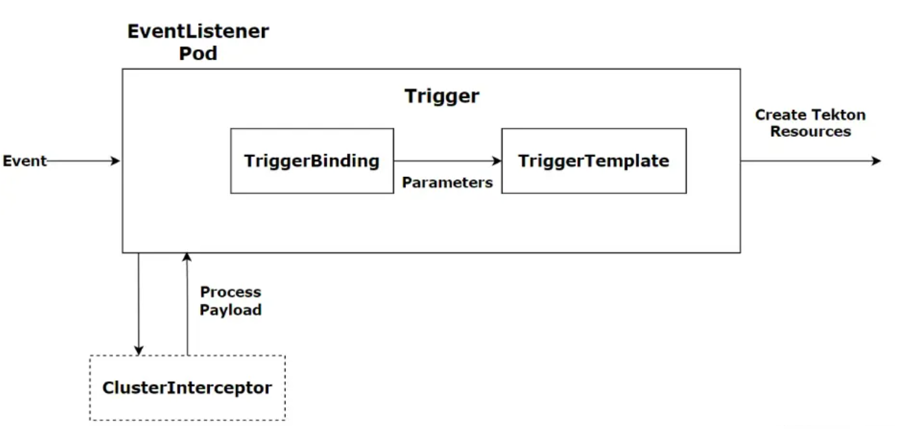

#### TriggerTemplate

可以模块化Tekton资源的资源，可以使传入的参数在资源模板中的任何位置被使用，就好比我们定义了一个对象，这个对象可以接收外部的参数，在对象内部把接收到的参数再传递给Tekton资源对象进行使用。

TriggerTemplate可以内部定义一下task或者pipeline，使其实例化。

```yaml
apiVersion: triggers.tekton.dev/v1beta1 
kind: TriggerTemplate
metadata:
  name: trigger-rd-pipeline-template
spec:
  params:                 # 参数的定义，从外部接收的参数
    - name: gitrevision
      description: The git revision
      default: master
    - name: gitrepositoryurl
      description: The git repository url
    - name: namespace
      description: The namespace to create the resources
      default: tekton-devops-pipeline
    - name: projectname
      description: The project name
    - name: imagetag
      description: The image tag
      default: latest
  resourcetemplates:      # 资源模板，将参数传递给资源模板，实例化一个PipelineRun对象
    - apiVersion: tekton.dev/v1alpha1
      kind: PipelineRun
      metadata:
        name: rd-pipeline-run-$(uid)
        namespace: $(tt.params.namespace)
      spec:
        serviceAccountName: tekton-build-sa
        params: 
        - name: revision
          value: $(tt.params.gitrevision)
        - name: git_url
          value: $(tt.params.gitrepositoryurl)
        - name: imageUrl
          value: registry.cn-hangzhou.aliyuncs.com/coolops/$(tt.params.projectname)
        - name: imageTag
          value: latest
        - name: pathToDockerfile
          value: Dockerfile
        - name: chart_username
          value: xxx
        - name: chart_password
          value: xxx
        - name: app_name
          value: hello-world
        - name: namespace
          value: default
        - name: sonar_username
          value: xxxx
        - name: sonar_password
          value: xxxx
        - name: sonar_url
          value: http://sonarqube.coolops.cn
        pipelineRef:
          name: rd-pipeline
        workspaces:
        - name: rd-repo-pvc
          volumeClaimTemplate:
            spec:
              accessModes:
              - ReadWriteOnce
              storageClassName: local 
              resources:
                requests:
                  storage: 1Gi
        - name: docker-config
          secret:
            secretName: docker-config
        - name: kubernetes-config
          secret:
            secretName: kubernetes-config
```

#### Trigger Binding

校验事件并提取相关字段属性 。

Trigger Template的入参都可以通过PushEvent中获取，PushEvent里的数据需要通过Trigger Binding来绑定。

```yaml
apiVersion: triggers.tekton.dev/v1beta1
kind: TriggerBinding
metadata:
  name: trigger-rd-pipeline-bingding
  namespace: tekton-devops-pipeline
spec:
  params:
    - name: gitrevision
      value: $(body.ref)
    - name: namespace
      value: tekton-devops-pipeline
    - name: gitrepositoryurl
      value: $(body.project.git_http_url)
    - name: projectname
      value: $(body.project.name)


```

#### EventListener

创建好Trigger Template和Trigger Binding，接下来就是创建EventListener，把Template和Binding关联起来。 连接 TriggerBinding 和 TriggerTemplate 到事件接收器，使用从各个 TriggerBinding 中提取的参数来创建 TriggerTemplate 中指定的 resources，同样通过 `interceptor` 字段来指定外部服务对事件属性进行预处理

```yaml
apiVersion: triggers.tekton.dev/v1alpha1
kind: EventListener
metadata:
  name: listener
spec:
  serviceAccountName: tekton-triggers-example-sa
  triggers:
    - name: foo-trig
      bindings:
        - ref: trigger-rd-pipeline-bingding
      template:
        ref: trigger-rd-pipeline-bingding
```

这里的`tekton-triggers-gitlab-sa`是需要手动创建，如下：

```yaml
apiVersion: v1
kind: ServiceAccount
metadata:
  name: tekton-triggers-example-sa
secrets:
- name: gitlab-secret
- name: gitlab-auth
---

kind: ClusterRole
apiVersion: rbac.authorization.k8s.io/v1
metadata:
  name: tekton-triggers-gitlab-minimal
rules:
  # Permissions for every EventListener deployment to function
  - apiGroups: ["triggers.tekton.dev"]
    resources: ["eventlisteners", "triggerbindings", "triggertemplates","clustertriggerbindings", "clusterinterceptors","triggers"]
    verbs: ["get","list","watch"]
  - apiGroups: [""]
    # secrets are only needed for Github/Gitlab interceptors, serviceaccounts only for per trigger authorization
    resources: ["configmaps", "secrets", "serviceaccounts"]
    verbs: ["get", "list", "watch"]
  # Permissions to create resources in associated TriggerTemplates
  - apiGroups: ["tekton.dev"]
    resources: ["pipelineruns", "pipelineresources", "taskruns"]
    verbs: ["create"]
---
apiVersion: rbac.authorization.k8s.io/v1
kind: ClusterRoleBinding
metadata:
  name: tekton-triggers-gitlab-binding
subjects:
  - kind: ServiceAccount
    name: tekton-triggers-gitlab-sa
    namespace: tekton-devops-pipeline
roleRef:
  apiGroup: rbac.authorization.k8s.io
  kind: ClusterRole
  name: tekton-triggers-gitlab-minimal
```

### 授权信息

git 仓库、镜像仓库这些都是需要鉴权才能使用的。所以还需要一种设定鉴权信息的机制。Tekton 本身是 Kubernetes 原生的编排系统。所以可以直接使用 Kubernetes 的 ServiceAccount 机制实现鉴权。
案例：

- 定义gitlab的webhook的Secret Token

```yaml
apiVersion: v1
kind: Secret
metadata:
  name: gitlab-secret
type: Opaque
stringData:
  secretToken: "coolops"
```

当创建完EventListener过后，会在当前namespace下生成一个service和deployment

创建一个ingress将这个service暴漏出去，给gitlab进行访问

```yaml
apiVersion: extensions/v1beta1
kind: Ingress
metadata:
  name: el-trigger-test-eventlistener
spec:
  rules:
  - host: hello-word.webhook.coolops.cn
    http:
      paths:
      - backend:
          serviceName: el-trigger-rd-pipeline-eventlistener 
          servicePort: 8080
```

gitlab配置webhook

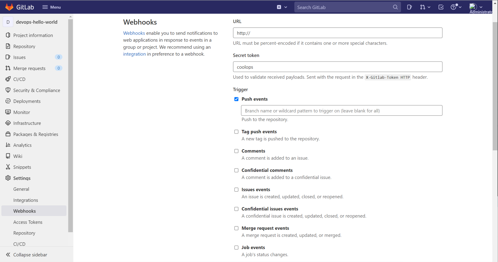

需要的信息都是从Request中获取，需要什么就从Request中取什么，如下：

```json
{
  "object_kind": "push",
  "event_name": "push",
  "before": "77e1901516fc2ee1a47b03bb4bfc63ca02e6b23d",
  "after": "ac84d875c6094b5feebd477809a2021fd745c9df",
  "ref": "refs/heads/master",
  "checkout_sha": "ac84d875c6094b5feebd477809a2021fd745c9df",
  "message": null,
  "user_id": 1,
  "user_name": "Administrator",
  "user_username": "root",
  "user_email": "",
  "user_avatar": "https://www.gravatar.com/avatar/e64c7d89f26bd1972efa854d13d7dd61?s=80&d=identicon",
  "project_id": 2,
  "project": {
    "id": 2,
    "name": "Devops Hello World",
    "description": "",
    "web_url": "http://192.168.205.128/root/devops-hello-world",
    "avatar_url": null,
    "git_ssh_url": "git@192.168.205.128:root/devops-hello-world.git",
    "git_http_url": "http://192.168.205.128/root/devops-hello-world.git",
    "namespace": "Administrator",
    "visibility_level": 0,
    "path_with_namespace": "root/devops-hello-world",
    "default_branch": "master",
    "ci_config_path": null,
    "homepage": "http://192.168.205.128/root/devops-hello-world",
    "url": "git@192.168.205.128:root/devops-hello-world.git",
    "ssh_url": "git@192.168.205.128:root/devops-hello-world.git",
    "http_url": "http://192.168.205.128/root/devops-hello-world.git"
  },
  "commits": [
    {
      "id": "ac84d875c6094b5feebd477809a2021fd745c9df",
      "message": "ceshi ",
      "title": "ceshi ",
      "timestamp": "2022-03-30T08:54:11+00:00",
      "url": "http://192.168.205.128/root/devops-hello-world/-/commit/ac84d875c6094b5feebd477809a2021fd745c9df",
      "author": {
        "name": "coolops",
        "email": "baidjay@163.com"
      },
      "added": [

      ],
      "modified": [
        "Jenkinsfile"
      ],
      "removed": [

      ]
    },
    {
      "id": "cc36ed8cf920d9a3470fda6a28576ba7d29f9c04",
      "message": "ceshi ",
      "title": "ceshi ",
      "timestamp": "2022-03-30T08:52:13+00:00",
      "url": "http://192.168.205.128/root/devops-hello-world/-/commit/cc36ed8cf920d9a3470fda6a28576ba7d29f9c04",
      "author": {
        "name": "coolops",
        "email": "baidjay@163.com"
      },
      "added": [

      ],
      "modified": [
        "Jenkinsfile"
      ],
      "removed": [

      ]
    },
    {
      "id": "77e1901516fc2ee1a47b03bb4bfc63ca02e6b23d",
      "message": "多分支发布",
      "title": "多分支发布",
      "timestamp": "2022-03-30T08:45:11+00:00",
      "url": "http://192.168.205.128/root/devops-hello-world/-/commit/77e1901516fc2ee1a47b03bb4bfc63ca02e6b23d",
      "author": {
        "name": "coolops",
        "email": "baidjay@163.com"
      },
      "added": [

      ],
      "modified": [
        "Jenkinsfile"
      ],
      "removed": [

      ]
    }
  ],
  "total_commits_count": 3,
  "push_options": {
  },
  "repository": {
    "name": "Devops Hello World",
    "url": "git@192.168.205.128:root/devops-hello-world.git",
    "description": "",
    "homepage": "http://192.168.205.128/root/devops-hello-world",
    "git_http_url": "http://192.168.205.128/root/devops-hello-world.git",
    "git_ssh_url": "git@192.168.205.128:root/devops-hello-world.git",
    "visibility_level": 0
  }
}
```

- 定义一个保存镜像仓库鉴权信息的 secret

```yaml
apiVersion: v1
kind: Secret
metadata:
  name: ack-cr-push-secret
  annotations:
    tekton.dev/docker-0: https://registry.cn-hangzhou.aliyuncs.com
type: kubernetes.io/basic-auth
stringData:
  username: <cleartext non-encoded>
  password: <cleartext non-encoded>
```

- 定义 ServiceAccount ，并且使用上面的 secret

```yaml
apiVersion: v1
kind: ServiceAccount
metadata:
  name: pipeline-account
secrets:
- name: ack-cr-push-secret
```

- PipelineRun 中引用 ServiceAccount

```yaml
apiVersion: tekton.dev/v1alpha1
kind: PipelineRun
metadata:
  generateName: tekton-kn-sample-
spec:
  pipelineRef:
    name: build-and-deploy-pipeline
... ...
  serviceAccount: pipeline-account
```

## 执行流程案例

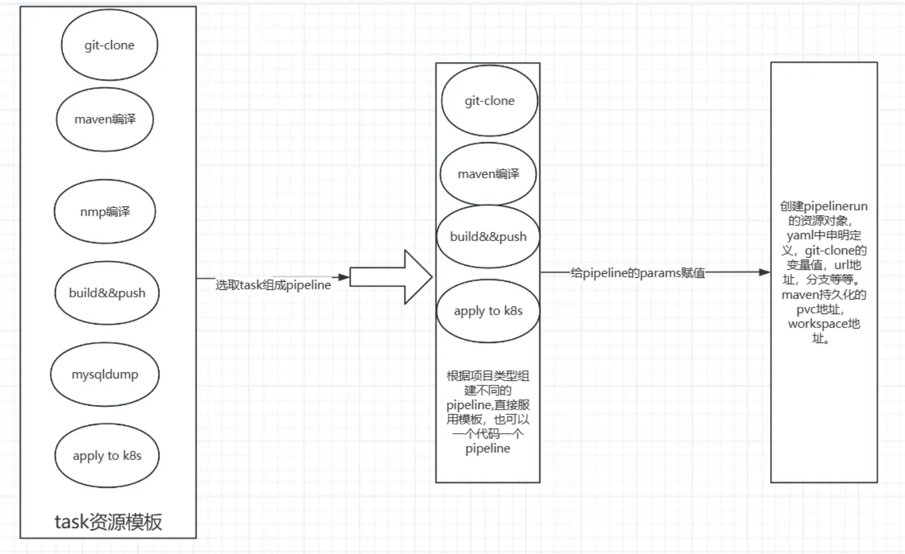

代码地址：demo-giturl=https://gitee.com/mageedu/spring-boot-helloWorld.git

- git-clone

```yaml
apiVersion: tekton.dev/v1beta1
kind: Task
metadata:
  name: git-clone
spec:
  description: Clone the code repository to the workspace.
  params:
    - name: git-repo-url
      type: string
      description: git repository url to clone
    - name: git-revision
      type: string
      description: git revision to checkout (branch, tag, sha, ref)
      default: "master"
  workspaces:
    - name: source
      description: The git repo will be cloned onto the volume backing this workspace
  steps:
    - name: git-clone
      image: alpine/git:v2.36.1
      script: |
        git clone -v $(params.git-repo-url) $(workspaces.source.path)/source
        cd $(workspaces.source.path)/source && git reset --hard $(params.git-revision)
```

- maven-build

```yaml
---
apiVersion: tekton.dev/v1beta1
kind: Task
metadata:
  name:  build-to-package
spec:
  description: build application and package the files to image
  workspaces:
    - name: source
      description: The git repo that cloned onto the volume backing this workspace
  steps:
    - name: build
      image: maven:3.8-openjdk-11-slim
      workingDir: $(workspaces.source.path)/source
      volumeMounts:
        - name: m2
          mountPath: /root/.m2
      script: mvn clean install
  volumes:
    - name: m2
      persistentVolumeClaim:
        claimName: maven-cache
```

- build-image-tag

```yaml
---
apiVersion: tekton.dev/v1beta1
kind: Task
metadata:
  name:  generate-build-id
spec:
  params:
    - name: version
      description: The version of the application
      type: string
  results:
    - name: datetime
      description: The current date and time
    - name: buildId
      description: The build ID
  steps:
    - name: generate-datetime
      image: ikubernetes/admin-box:v1.2
      script: |
        #!/usr/bin/env bash
        datetime=`date +%Y%m%d-%H%M%S`
        echo -n ${datetime} | tee $(results.datetime.path)
    - name: generate-buildid
      image: ikubernetes/admin-box:v1.2
      script: |
        #!/usr/bin/env bash
        buildDatetime=`cat $(results.datetime.path)`
        buildId=$(params.version)-${buildDatetime}
        echo -n ${buildId} | tee $(results.buildId.path)
```

- build&push

```yaml
---
apiVersion: tekton.dev/v1beta1
kind: Task
metadata:
  name: image-build-and-push
spec:
  description: package the application files to image
  params:
    - name: dockerfile
      description: The path to the dockerfile to build (relative to the context)
      default: Dockerfile
    - name: image-url
      description: Url of image repository
    - name: image-tag
      description: Tag to apply to the built image
  workspaces:
    - name: source
    - name: dockerconfig
      mountPath: /kaniko/.docker
  steps:
    - name: image-build-and-push
      image: registry.cn-hangzhou.aliyuncs.com/weiyigeek/kaniko-executor:latest
      securityContext:
        runAsUser: 0
      env:
        - name: DOCKER_CONFIG
          value: /kaniko/.docker
      command:
        - /kaniko/executor
      args:
        - --dockerfile=$(params.dockerfile)
        - --context=$(workspaces.source.path)/source
        - --destination=$(params.image-url):$(params.image-tag)
```

- deploy to k8s

```yaml
apiVersion: tekton.dev/v1beta1
kind: Task
metadata:
  name: deploy-using-kubectl
spec:
  workspaces:
    - name: source
      description: The git repo
  params:
    - name: deploy-config-file
      description: The path to the yaml file to deploy within the git source
    - name: image-url
      description: Image name including repository
    - name: image-tag
      description: Image tag
  steps:
    - name: update-yaml
      image: alpine:3.16
      command: ["sed"]
      args:
        - "-i"
        - "-e"
        - "s@__IMAGE__@$(params.image-url):$(params.image-tag)@g"
        - "$(workspaces.source.path)/source/deploy/$(params.deploy-config-file)"
    - name: run-kubectl
      image: lachlanevenson/k8s-kubectl
      command: ["kubectl"]
      args:
        - "apply"
        - "-f"
        - "$(workspaces.source.path)/source/deploy/$(params.deploy-config-file)"
```

```yaml
apiVersion: tekton.dev/v1beta1
kind: Pipeline
metadata:
  name: source-to-image
spec:
  params:
    - name: git-url
    - name: pathToContext
      description: The path to the build context, used by Kaniko - within the workspace
      default: .
    - name: image-url
      description: Url of image repository
    - name: deploy-config-file
      description: The path to the yaml file to deploy within the git source
      default: all-in-one.yaml
    - name: version
      description: The version of the application
      type: string
      default: "v0.10"
  workspaces:
    - name: codebase
    - name: docker-config
  tasks:
    - name: git-clone
      taskRef:
        name: git-clone
      params:
        - name: git-repo-url
          value: "$(params.git-url)"
      workspaces:
        - name: source
          workspace: codebase
    - name: build-to-package
      taskRef:
        name: build-to-package
      workspaces:
        - name: source
          workspace: codebase
      runAfter:
        - git-clone
    - name: generate-build-id
      taskRef:
        name: generate-build-id
      params:
        - name: version
          value: "$(params.version)"
      runAfter:
        - git-clone
    - name: image-build-and-push
      taskRef:
        name: image-build-and-push
      params:
        - name: image-url
          value: "$(params.image-url)"
        - name: image-tag
          value: "$(tasks.generate-build-id.results.buildId)"
      workspaces:
        - name: source
          workspace: codebase
        - name: dockerconfig
          workspace: docker-config
      runAfter:
        - generate-build-id
        - build-to-package
    - name: deploy-to-cluster
      taskRef:
        name: deploy-using-kubectl
      workspaces:
        - name: source
          workspace: codebase
      params:
        - name: deploy-config-file
          value: $(params.deploy-config-file)
        - name: image-url
          value: $(params.image-url)
        - name: image-tag
          value: "$(tasks.generate-build-id.results.buildId)"
      runAfter:
        - image-build-and-push
```

- sa授权和pvc持久化

```yaml
apiVersion: v1
kind: ServiceAccount
metadata:
  name: helloworld-admin
---                                                                                                                                            
apiVersion: rbac.authorization.k8s.io/v1
kind: ClusterRoleBinding
metadata:
  name: helloworld-admin
roleRef:
  apiGroup: rbac.authorization.k8s.io
  kind: ClusterRole
  name: cluster-admin
subjects:
- kind: ServiceAccount
  name: helloworld-admin
  namespace: default
  
---
apiVersion: v1
kind: PersistentVolumeClaim
metadata:
  name: maven-cache
spec:
  accessModes:
  - ReadWriteMany
  resources:
    requests:
      storage: 1Gi
  storageClassName: nfs
  volumeMode: Filesystem
```

- 创建pipelinerun

```yaml
apiVersion: tekton.dev/v1beta1
kind: PipelineRun
metadata:
  generateName:  java-demo1-
spec:
  serviceAccountName: default
  taskRunSpecs:
    - pipelineTaskName: deploy-to-cluster
      taskServiceAccountName: helloworld-admin
  pipelineRef:
    name: source-to-image
  params:
    - name: git-url
      value: http://10.10.10.45/root/tekton.git
    - name: image-url
      value: 10.10.10.40/tekton/java
    - name: version
      value: v0.2
    - name: git-repo-url
      value: http://10.10.10.45/root/tekton.git
  workspaces:
    - name: codebase
      volumeClaimTemplate:
        spec:
          accessModes:
            - ReadWriteOnce
          resources:
            requests:
              storage: 1Gi
          storageClassName: nfs
    - name: docker-config
      secret:
        secretName: docker-config
```


# ArgoCD

参考至：https://www.yuque.com/coolops/kubernetes/wcn93v#UhkKy

作者：https://www.yuque.com/coolops

## 简介

官方文档：https://argo-cd.readthedocs.io/en/stable/

github地址： https://github.com/argoproj/argo-cd

目前Argo包含多个子项目：

- Argo Workflows：基于容器的任务编排工具。
- Argo CD：基于GitOps声明的持续交付工具。
- Argo Events：事件驱动工具。
- Argo Rollouts：支持金丝雀以及蓝绿发布的应用渐进式发布工具。

Argo CD 是一种开源的持续交付工具，用于自动化和管理应用程序的部署、更新和回滚。它是一个声明式的工具，专为在 Kubernetes 集群中进行应用程序部署而设计。

Argo CD 的主要功能包括：

- **持续交付：**Argo CD 允许用户将应用程序的配置和清单文件定义为 Git 存储库中的声明式资源，从而实现持续交付。它能够自动检测 Git 存储库中的更改，并将这些更改应用于目标 Kubernetes 集群。
- **健康监测和回滚：**Argo CD 能够监测应用程序的健康状态，并在检测到问题时触发回滚操作。这有助于确保应用程序在部署期间和运行时保持稳定和可靠。
- **多环境管理：**Argo CD 支持多个环境（例如开发、测试、生产）的管理。它可以帮助用户在不同环境中进行应用程序的部署和配置管理，并确保这些环境之间的一致性。
- **基于 GitOps 的操作：**Argo CD 采用了 GitOps 的操作模式，即将应用程序的状态和配置定义为 Git 存储库中的声明式资源。这使得团队可以使用版本控制和代码审查等软件工程实践来管理应用程序的生命周期。

Kubernetes 清单文件可以通过以下几种方式指定：

- – kustomize 应用程序
- – helm chart
- – jsonnet 文件
- – YAML/json 清单的普通目录
- – 配置为配置管理插件的任何自定义配置管理工具

ArgoCD原理架构：

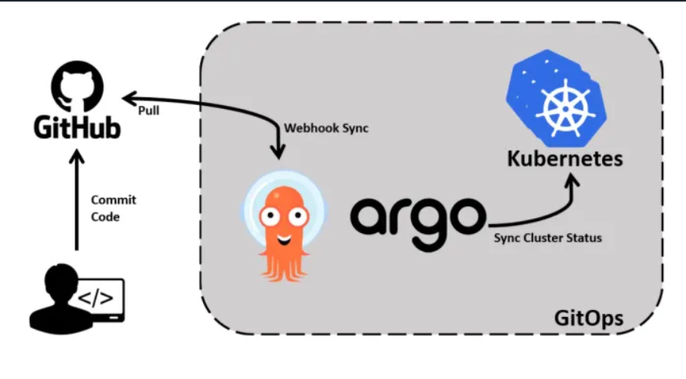

结合整个CICD的架构

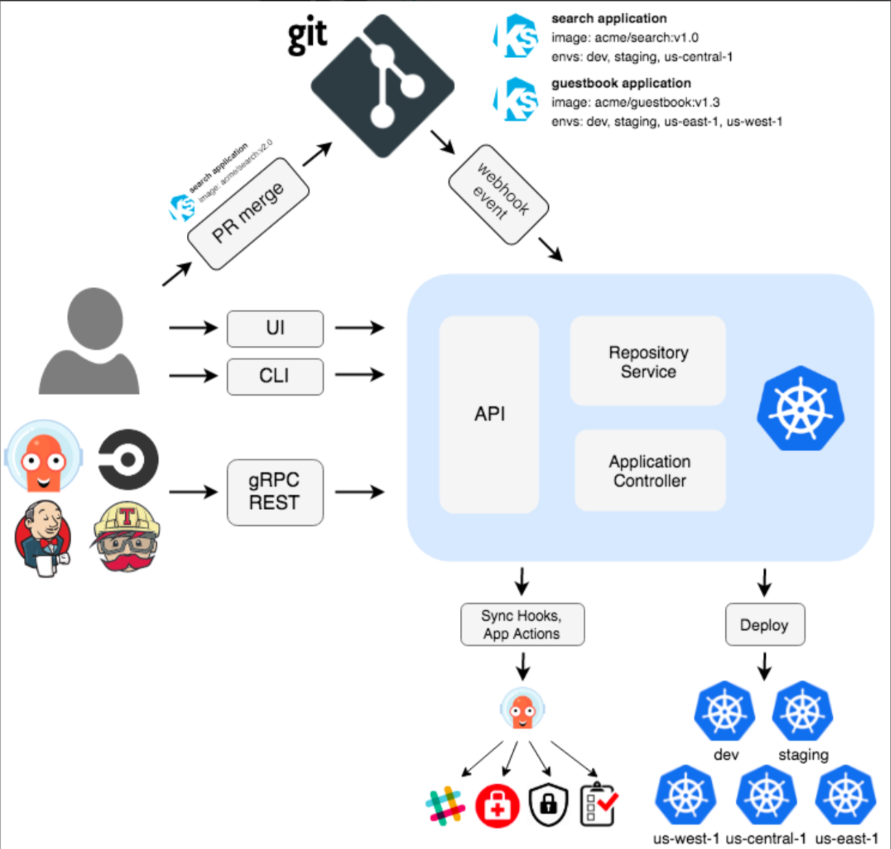

ArgoCD在CICD中的位置

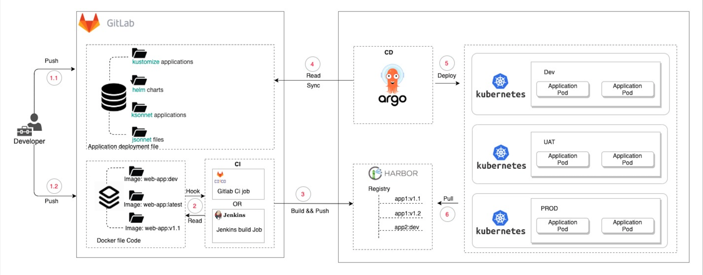

具体执行步骤：

1. 将应用的 Git 仓库分为 Application Deployment file 和 Docker file 两个库。

   Docker file 用于存放应用的核心代码以及 Docker build file，后续将会直接打包成 Docker image

   Application Deployment file 可以 Kustomize、Helm、Ksconnet、Jsonnet 等 多种 Kubernetes 包管理工具来定义；

   以 Helm 为例，Chart 中所使用到的 Image 由 Docker file Code 打包完成后提供；

2. 使用 Jenkins 或 Gitlab 等 CI 工具进行自动化构建打包，并将 Docker image push 到 Harbor 镜像仓库；

3. 使用 Argo CD 部署应用。Argo CD 可以独立于集群之外，并且支持管理多个 Kubernetes 集群。在 Argo CD 上配置好应用部署的相关信息后 Argo CD 便可以正常工作，Argo CD 会自动和代码仓库 Application deployment file 的内容进行校验，当代码仓库中应用属性等信息发生变化时，Argo CD 会自动同步更新 Kubernetes 集群中的应用；应用启动时，会从 Harbor 镜像仓库拉取 Docker image。
   

## 核心组件

- **Argo CD Server (argocd-server)**

  Argo CD 服务器是 Argo CD 的核心组件，负责管理和协调整个系统。它与 Git 存储库进行交互，从中读取应用程序的声明性配置，并将配置与 Kubernetes 环境进行同步。Argo CD 服务器还提供 Web 用户界面和 API，用于管理应用程序和监视其状态。

- **Git Repository (argocd-repo-server)**

  Git 存储库是存储应用程序配置的地方。Argo CD 从配置存储库中获取应用程序的清单文件，并使用它们来部署和管理应用程序。Argo CD 支持多种 Git 存储库的类型，包括公共 Git 存储库（如 GitHub、GitLab 等）和私有 Git 存储库。

- **Application Controller (argocd-application-controller-0)**

  应用程序控制器负责监视应用程序的状态并执行必要的操作以将其与期望状态保持一致。它根据应用程序的配置和状态信息，自动化应用程序的部署和更新，并与 Git 存储库进行同步。

- **Argo CD ApplicationSets (argocd-applicationset-controller)**

  ApplicationSet 控制器。它负责管理和执行 ApplicationSet 对象，用于生成和管理多个应用程序实例。 是"App of Apps"部署模式的演变。它采用了"App of Apps"的理念并将其扩展为更加灵活并处理广泛的用例。ArgoCD ApplicationSets 作为自己的控制器运行，并补充了 Argo CD 应用程序 CRD 的功能。

- **Agro CD Dex (argocd-dex-server)**

  Dex 是一个开源的身份验证和授权工具，Argo CD 可以与 Dex 集成以实现身份验证和授权功能。Dex 可以连接到各种身份提供商（如 LDAP、Active Directory、OAuth 等），以提供灵活的用户身份验证和访问控制机制。

- **Argo CD Notify (argocd-notifications-controller)**

  Argo CD 的通知控制器，用于管理和触发通知事件。它负责在 Argo CD 中监视应用程序的状态变化，并基于预定义的规则和配置触发相应的通知。

- **Argo CD Redis (argocd-redis)**

  用于缓存资源，主要包括: 应用程序配置和状态信息、Git 存储库的访问结果、Git 存储库的访问结果、用户和权限信息等。

**名词解释**

- **Application**：应用，一组由资源清单定义的 K8s 资源，这是一个 CRD 资源对象
- **Application source type**：用来构建应用的工具，如: Git、Helm、Repo、Kustomize、Directory
- **Target state**: 目标状态，指应用程序所需的期望状态，由 Git 存储库中的文件表示
- **Live state**：实时状态，指应用程序实时的状态，比如部署了哪些 Pods 等真实状态
- **Sync status**：同步状态，指实时状态是否与目标状态一致，部署的应用是否与Git(构建工具)中描述一样
- **Sync**：同步指将应用程序迁移到期望目标状态的过程，比如通过对 Kubernetes 集群应用部署变更
- **Sync operation status**：同步操作状态指的是同步是否成功，主要有以下几种状态:
  - Synced,同步完成
  - OutOfSync,不同步
  - Unknown, 未知
  - Syncing, 同步中
  - Error,同步错误，可能应用程序配置错误、权限问题或其他问题导致的
- **Refresh**：刷新是指将 Git 中的最新代码与实时状态进行比较
- **Health**：应用程序的健康状况,主要有以下几种：
  - Healthy：健康
  - Degraded：降级，表示应用程序的某些组件或资源出现了问题，但仍然能够运行。这可能意味着某些功能或服务不可用或性能下降。
  - Progressing：进行中，指应用在部署或更新中
  - Suspended：暂停，指应用程序的同步操作已被暂停，不再进行任何更新
  - Missing：缺失，指表ArgoCD 无法找到应用程序的健康检查结果
- **Tool**：工具指从文件目录创建清单的工具，例如 Kustomize 或 Ksonnet 等


### Application

Application 的职责就是将目标 Kubernetes 集群中的 namespace 与 Git 仓库中声明的期望状态连接起来。

Application 定义了 Kubernetes 资源的来源（Source）和目标（Destination）。

- 来源指的是 Git 仓库中 Kubernetes 资源配置清单所在的位置，可以是原生的 Kubernetes 配置清单，也可以是 Helm Chart 或者 Kustomize 部署清单
- 目标是指资源在 Kubernetes 集群中的部署位置，指定了 Kubernetes 集群中 API Server 的 URL 和相关的 namespace，这样 ArgoCD 就知道将应用部署到哪个集群的哪个 namespace 中。

Application 的配置清单示例：

```yaml
apiVersion: argoproj.io/v1alpha1
kind: Application
metadata:
  name: guestbook
  namespace: argocd
spec:
  project: default
  source:
    repoURL: https://github.com/argoproj/argocd-example-apps.git
    targetRevision: HEAD
    path: guestbook
  destination:
    server: https://kubernetes.default.svc
    namespace: guestbook
    
```

### ArgoCD Project

如果有多个团队，每个团队都要维护大量的应用，就需要用到 Argo CD 的另一个概念：项目（Project）。

Argo CD 中的项目（Project）可以用来对 Application 进行分组，不同的团队使用不同的项目，这样就实现了多租户环境。项目还支持更细粒度的访问权限控制：

- 限制部署内容（受信任的 Git 仓库）；
- 限制目标部署环境（目标集群和 namespace）；
- 限制部署的资源类型（例如 RBAC、CRD、DaemonSets、NetworkPolicy 等）；
- 定义项目角色，为 Application 提供 RBAC（与 OIDC group 或者 JWT 令牌绑定）


## 安装

### server

先需要确定安装的版本
官方文档地址：[https://argo-cd.readthedocs.io](https://argo-cd.readthedocs.io/)，查询与k8s版本对应的Argo CD版本

在github有高可用版本：https://github.com/argoproj/argo-cd/tree/v2.8.0/manifests/ha

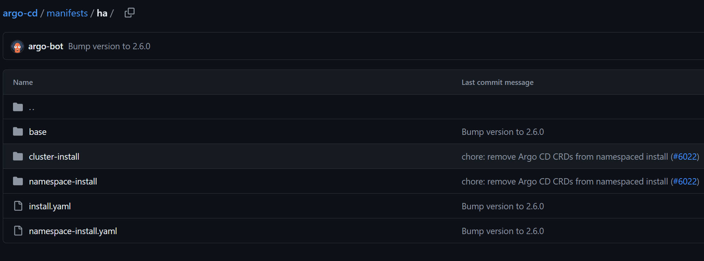

```bash
# 这里安装标准版本
# 创建命名空间
kubectl create namespace argocd
kubectl apply -n argocd -f https://github.com/argoproj/argo-cd/tree/release-2.8/manifests/install.yaml
# 或者
kubectl apply -n argocd -f https://raw.githubusercontent.com/argoproj/argo-cd/v2.8.8/manifests/install.yaml

```

web访问：修改service类型为nodeport模式或者创建ingress

对应的service资源信息：

```yaml
---
apiVersion: v1
kind: Service
metadata:
  labels:
    app.kubernetes.io/component: server
    app.kubernetes.io/name: argocd-server
    app.kubernetes.io/part-of: argocd
  name: argocd-server
spec:
  ports:
  - name: http
    port: 80
    protocol: TCP
    targetPort: 8080
  - name: https
    port: 443
    protocol: TCP
    targetPort: 8080
  selector:
    app.kubernetes.io/name: argocd-server
```

ingress示例

```yaml
apiVersion: networking.k8s.io/v1
kind: Ingress
metadata:
  name: argocd-server-http-ingress
  namespace: argocd
  annotations:
    nginx.ingress.kubernetes.io/force-ssl-redirect: "true"
    nginx.ingress.kubernetes.io/backend-protocol: "HTTPS"
    nginx.ingress.kubernetes.io/ssl-passthrough: "true"
spec:
  ingressClassName: nginx
  rules:
    - http:
        paths:
          - path: /
            pathType: Prefix
            backend:
              service:
                name: argocd-server
                port:
                  name: https
      host: ingress-nginx-controller
  tls:
    - hosts:
        - argocd.tchua.com
      secretName: argocd-secret # do not change, this is provided by Argo CD

```

### 客户端

#### web UI

webUI：默认账号：admin ，初始密码是自动生成，会以明文的形式存储在 Argo CD 安装的命名空间中名为 argocd-initial-admin-secret 的 Secret 对象下的 password 字段下，可以用下面的命令获取：

```bash
kubectl get secret argocd-initial-admin-secret -o jsonpath="{.data.password}" -n argocd | base64 -d
```


登录之后进入界面：

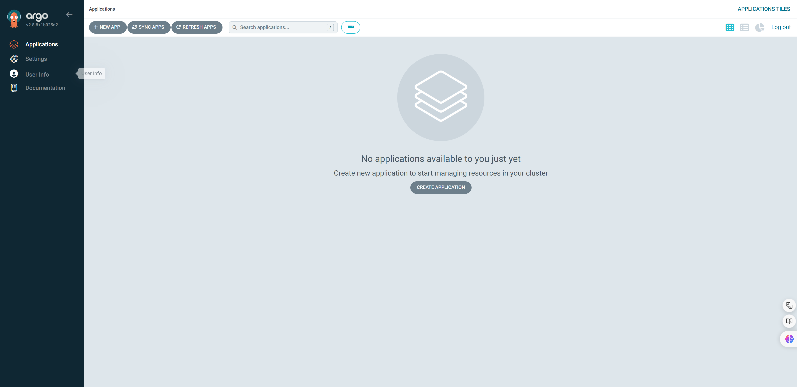

#### CLI工具

Argo CD CLI 是用于管理 Argo CD 的命令行工具。这里不做详细介绍，后面我们主要使用web ui来操作Argo CD。

GitHub：https://github.com/argoproj/argo-cd/releases?page=7

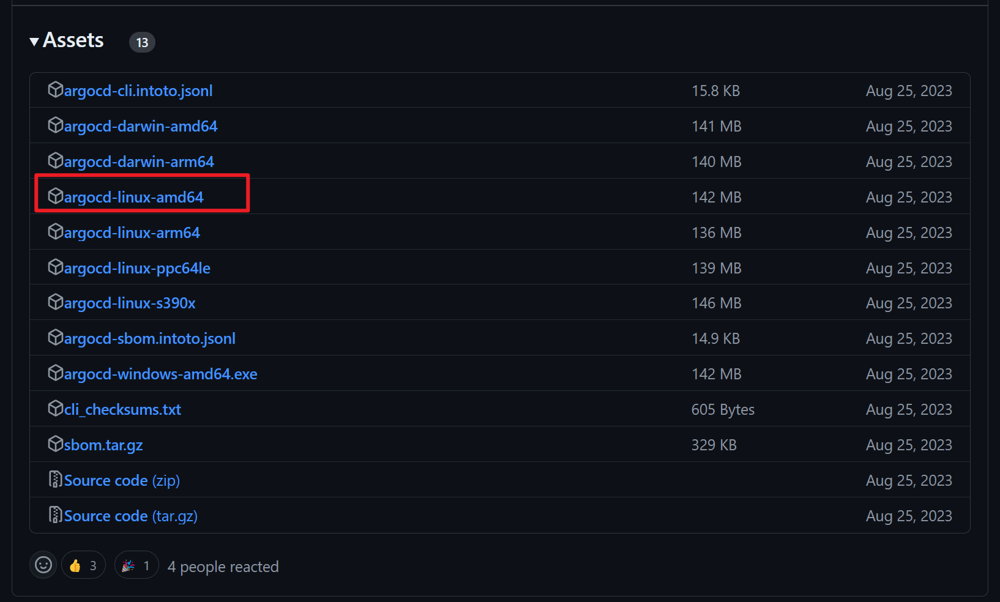

```bash
chmod +x argocd-linux-amd64
mv argocd-linux-amd64 /usr/local/bin/

# 执行命令登录
argocd login argocd.tchua.com
```

**更改密码**

```bash
# 登录
argocd login 192.168.9.30:30906

# 修改密码
argocd account update-password \
   --account admin \
   --current-password argocd-server-5dcc6878cf-75j94 \
   --new-password admin
Password updated
Context '172.17.100.50:32109' updated
```


## 配置使用

- （1）添加仓库地址，Settings → Repositories，点击 `Connect Repo using HTTPS` 按钮：

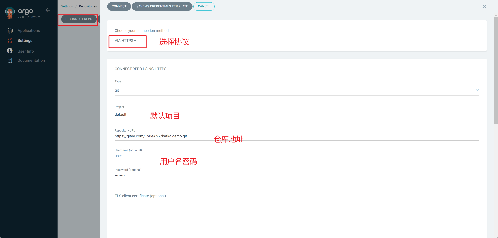

通过验证之后：

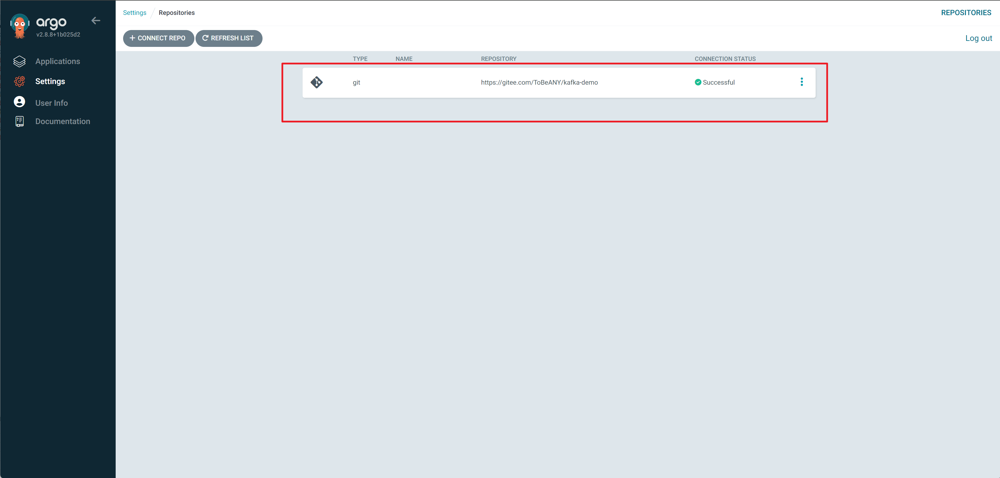

- （2）创建应用

注意：基本配置里面的`Project Name`，这里我们可以根据自己需要创建不同的项目名称，一般来说都会根据不同环境或者不同的项目创建，这里可以对应集群中命名空间，方便后续管理。

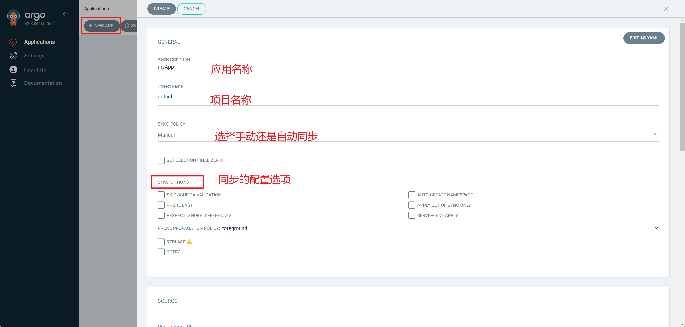

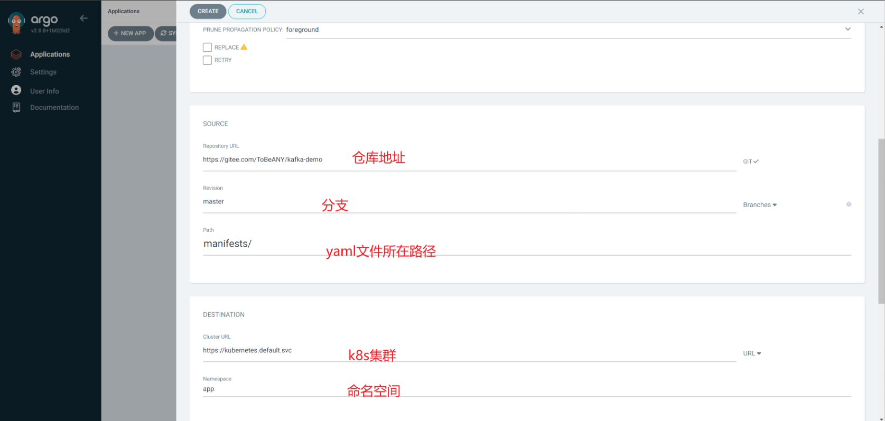

创建成功之后

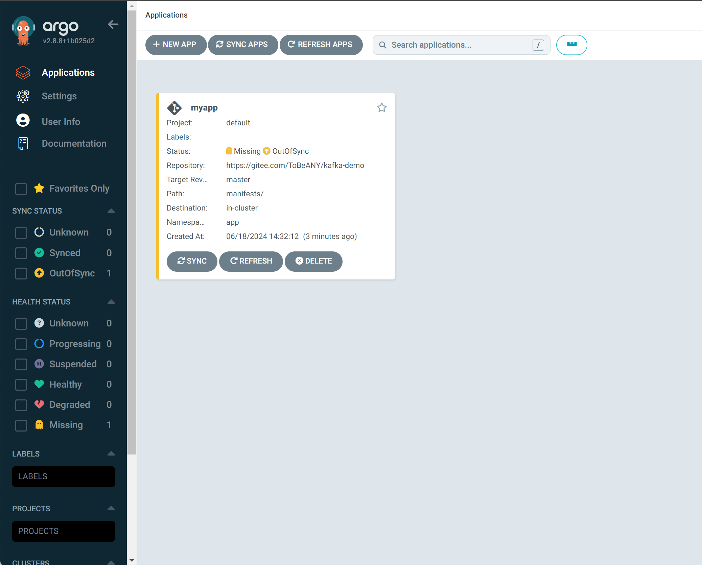

由于当前设置的是手动SYNC，所以需要点以下下面的SYNC进行同步。

可以看执行过程

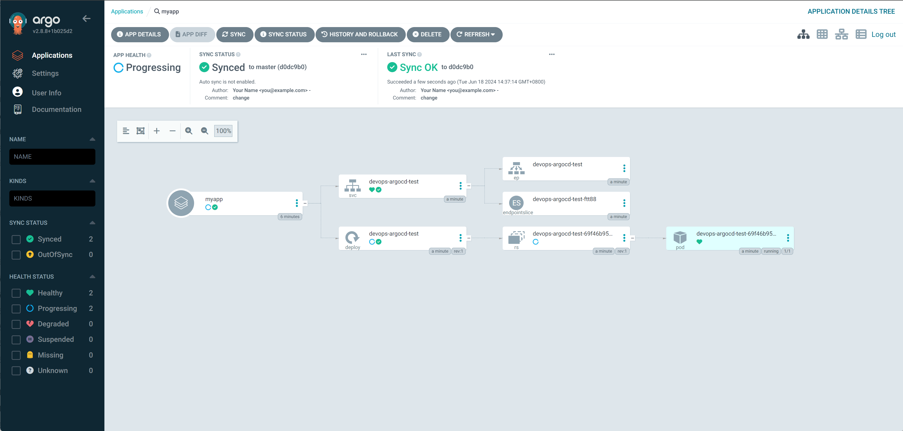

此时，查看pod，可以发现已经创建

```bash
[root@k8s-master01 manifests]# kubectl get po,svc
NAME                                      READY   STATUS    RESTARTS   AGE
pod/devops-argocd-test-69f46b95bd-dlrp6   1/1     Running   0          3m

NAME                         TYPE        CLUSTER-IP       EXTERNAL-IP   PORT(S)          AGE
service/devops-argocd-test   NodePort    10.102.116.144   <none>        8080:32029/TCP   3m1s

```

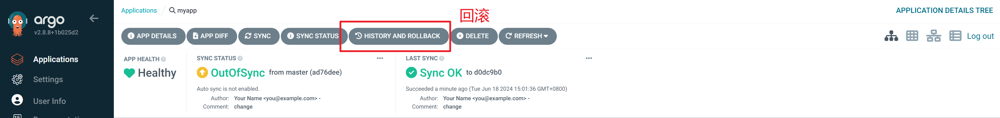

进去可以看到执行历史信息：

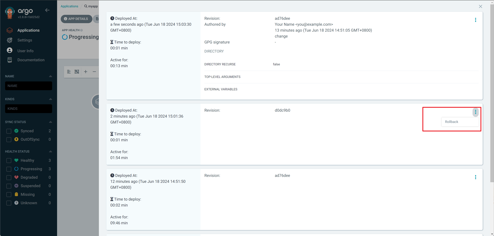

不过这个回滚并不会回改gitlab上的代码。

## 配置webhook

Argo CD每三分钟轮询一次Git存储库，以检测清单的变化。为了消除轮询带来的延迟，可以将API服务器配置为接收Webhook事件。Argo CD支持来自GitHub，GitLab，Bitbucket，Bitbucket Server和Gogs的Git Webhook通知，更多点击[官网](https://argoproj.github.io/argo-cd/operator-manual/webhook/#2-configure-argo-cd-with-the-webhook-secret-optional)。

使用Gitlab作为仓库地址。

（1）创建webhook token

url为argocd的链接地址：http://ip:port/api/webhook

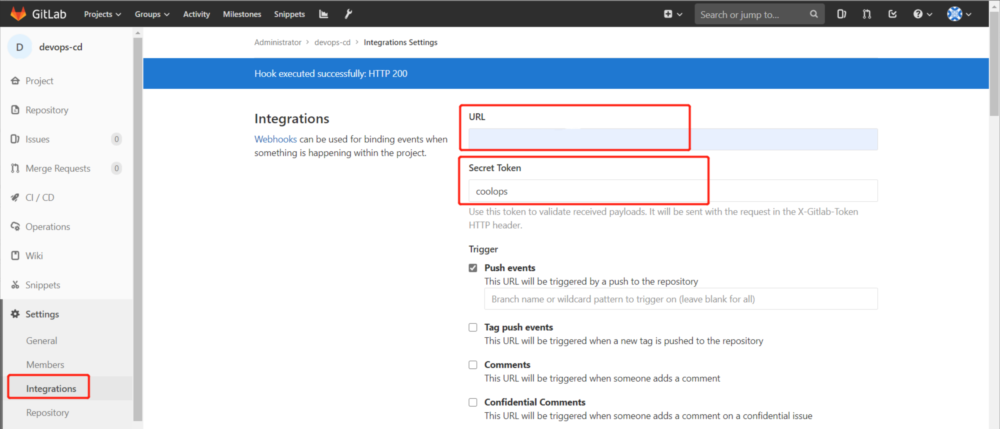

注意：由于集群内部证书是无效证书，所有要把Enabled SSL去掉

然后点击保存，点击测试，看是否链接成功。如果有如下提示则表示webhook配置没问题。

（2）在argocd中配置webhook token

使用`kubectl edit secret argocd-secret -n argocd`命令进行配置：

```yaml
apiVersion: v1
kind: Secret
metadata:
  name: argocd-secret
  namespace: argocd
type: Opaque
data:
...

stringData:					# 添加gitlab webhook的token
  # gitlab webhook secret
  webhook.gitlab.secret: coolops     # 对应gitlab生成的token
```

配置完点击保存会自动生成一个secret

然后可以进行修改gitlab仓库，观察是否一提交，argocd那边就可以响应了。

## 配置监控

集群监控Prometheus是通过Prometheus-operator部署的，所以直接创建两个serviceMonitor即可，如下：

```yaml
apiVersion: monitoring.coreos.com/v1
kind: ServiceMonitor
metadata:
  name: argocd-metrics
  namespace: monitoring
  labels:
    k8s-app: prometheus-operator
spec:
  selector:
    matchLabels:
      app.kubernetes.io/name: argocd-metrics
      app.kubernetes.io/component: metrics
  endpoints:
  - port: metrics
    interval: 30s
    scheme: http
  namespaceSelector:
    matchNames:
    - argocd
---
apiVersion: monitoring.coreos.com/v1
kind: ServiceMonitor
metadata:
  name: argocd-server-metrics
  namespace: monitoring
  labels:
    k8s-app: prometheus-operator
spec:
  selector:
    matchLabels:
      app.kubernetes.io/name: argocd-server-metrics
  endpoints:
  - port: metrics
    interval: 30s
    scheme: http
  namespaceSelector:
    matchNames:
    - argocd
```

然后可以在Prometheus的UI界面查看是否监控成功

然后在Grafana上导入以下[json](https://raw.githubusercontent.com/argoproj/argo-cd/master/examples/dashboard.json)内容，即可在面板查看信息：

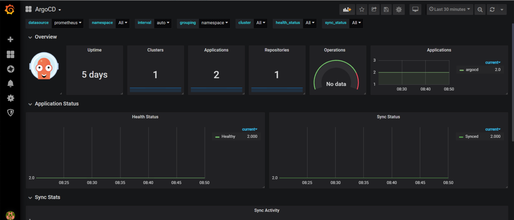


## argo rollouts

[Argo-Rollout](https://links.jianshu.com/go?to=https%3A%2F%2Fargoproj.github.io%2Fargo-rollouts%2F)是一个Kubernetes Controller和对应一系列的CRD，提供更强大的Deployment能力。包括灰度发布、蓝绿部署、更新测试(experimentation)、渐进式交付(progressive delivery)等特性。

支持特性如下：

- 蓝绿色更新策略
- 金丝雀更新策略
- 细粒度，加权流量转移
- 自动回rollback和promotion
- 手动判断
- 可定制的指标查询和业务KPI分析
- 入口控制器集成：NGINX，ALB
- 服务网格集成：Istio，Linkerd，SMI
- Metric provider集成：Prometheus，Wavefront，Kayenta，Web，Kubernetes Jobs

Argo原理和Deployment差不多，只是加强rollout的策略和流量控制。当spec.template发送变化时，Argo-Rollout就会根据spec.strategy进行rollout，通常会产生一个新的ReplicaSet，逐步scale down之前的ReplicaSet的pod数量。

### 安装

按官方文档进行安装，官方地址：https://argoproj.github.io/argo-rollouts/installation/#kubectl-plugin-installation

安装argo-rollouts

```bash
kubectl create namespace argo-rollouts
kubectl apply -n argo-rollouts -f https://raw.githubusercontent.com/argoproj/argo-rollouts/stable/manifests/install.yaml
```

安装argo-rollouts的kubectl plugin

```bash
# 安装argo-rollouts的kubectl plugin
curl -LO https://github.com/argoproj/argo-rollouts/releases/latest/download/kubectl-argo-rollouts-linux-amd64
chmod +x ./kubectl-argo-rollouts-linux-amd64
mv ./kubectl-argo-rollouts-linux-amd64 /usr/local/bin/kubectl-argo-rollouts
```

### 金丝雀发布

灰度发布包含Replica Shifting和Traffic Shifting两个过程。

- Replica Shifting：版本替换
- Traffic Shifting：流量接入

#### Replica Shifting

##### 部署应用

官方例子：https://argoproj.github.io/argo-rollouts/getting-started/

使用官方例子进行演示：

```bash
kubectl apply -f https://raw.githubusercontent.com/argoproj/argo-rollouts/master/docs/getting-started/basic/rollout.yaml
kubectl apply -f https://raw.githubusercontent.com/argoproj/argo-rollouts/master/docs/getting-started/basic/service.yaml
```

rollout.yaml文件内容：

```yaml
kind: Rollout
metadata:
  name: rollouts-demo
spec:
  replicas: 5
  strategy:
    canary:
      steps:
      - setWeight: 20
      - pause: {}
      - setWeight: 40
      - pause: {duration: 10}
      - setWeight: 60
      - pause: {duration: 10}
      - setWeight: 80
      - pause: {duration: 10}
  revisionHistoryLimit: 2
  selector:
    matchLabels:
      app: rollouts-demo
  template:
    metadata:
      labels:
        app: rollouts-demo
    spec:
      containers:
      - name: rollouts-demo
        image: argoproj/rollouts-demo:blue
        ports:
        - name: http
          containerPort: 8080
          protocol: TCP
        resources:
          requests:
            memory: 32Mi
            cpu: 5m
```

可以看到除了`apiVersion`，`kind`以及`strategy`之外，其他和Deployment无异。

`strategy`字段定义的是发布策略，其中：

- setWeight：设置流量的权重
- pause：暂停，如果里面没有跟`duration: 10`则表示需要手动更新，如果跟了表示等待多长时间会自动跟新。

执行上面命令部署后，会在`default`命名空间下创建5个pod，如下：

```bash
[root@k8s-master01 argocd]# kubectl get po 
NAME                                  READY   STATUS    RESTARTS   AGE
rollouts-demo-687d76d795-47c47        1/1     Running   0          112s
rollouts-demo-687d76d795-5k9g2        1/1     Running   0          113s
rollouts-demo-687d76d795-9h26p        1/1     Running   0          113s
rollouts-demo-687d76d795-fl47k        1/1     Running   0          113s
rollouts-demo-687d76d795-ghwjb        1/1     Running   0          112s

```

查看部署状态

```bash
kubectl-argo-rollouts get rollout rollouts-demo
```

```bash
[root@k8s-master01 argocd]# kubectl-argo-rollouts get rollout rollouts-demo
Name:            rollouts-demo
Namespace:       default
Status:          ✔ Healthy
Strategy:        Canary
  Step:          8/8
  SetWeight:     100
  ActualWeight:  100
Images:          argoproj/rollouts-demo:blue (stable)
Replicas:
  Desired:       5
  Current:       5
  Updated:       5
  Ready:         5
  Available:     5

NAME                                       KIND        STATUS     AGE    INFO
⟳ rollouts-demo                            Rollout     ✔ Healthy  2m46s  
└──# revision:1                                                          
   └──⧉ rollouts-demo-687d76d795           ReplicaSet  ✔ Healthy  2m46s  stable
      ├──□ rollouts-demo-687d76d795-5k9g2  Pod         ✔ Running  2m46s  ready:1/1
      ├──□ rollouts-demo-687d76d795-9h26p  Pod         ✔ Running  2m46s  ready:1/1
      ├──□ rollouts-demo-687d76d795-fl47k  Pod         ✔ Running  2m46s  ready:1/1
      ├──□ rollouts-demo-687d76d795-47c47  Pod         ✔ Running  2m45s  ready:1/1
      └──□ rollouts-demo-687d76d795-ghwjb  Pod         ✔ Running  2m45s  ready:1/1
```

可以看到该版本被标记为`stable`，而且STATUS为`healthy`。

还可以在命令后面加一个`--watch`来实时监控服务状态，完整命令为

```bash
kubectl argo rollouts get rollout rollouts-demo --watch
```

**更新应用**

```bash
kubectl argo rollouts set image rollouts-demo rollouts-demo=argoproj/rollouts-demo:yellow
```

更新过后，我们可以通过观察`kubectl argo rollouts get rollout rollouts-demo --watch`服务状态，如下：

```yaml
Name:            rollouts-demo
Namespace:       default
Status:          ॥ Paused
Message:         CanaryPauseStep
Strategy:        Canary
  Step:          1/8
  SetWeight:     20
  ActualWeight:  20
Images:          argoproj/rollouts-demo:blue (stable)
                 argoproj/rollouts-demo:yellow (canary)
Replicas:
  Desired:       5
  Current:       5
  Updated:       1
  Ready:         5
  Available:     5

NAME                                       KIND        STATUS     AGE    INFO
⟳ rollouts-demo                            Rollout     ॥ Paused   7m21s  
├──# revision:2                                                          
│  └──⧉ rollouts-demo-6cf78c66c5           ReplicaSet  ✔ Healthy  98s    canary
│     └──□ rollouts-demo-6cf78c66c5-csjc9  Pod         ✔ Running  97s    ready:1/1
└──# revision:1                                                          
   └──⧉ rollouts-demo-687d76d795           ReplicaSet  ✔ Healthy  7m21s  stable
      ├──□ rollouts-demo-687d76d795-5k9g2  Pod         ✔ Running  7m21s  ready:1/1
      ├──□ rollouts-demo-687d76d795-fl47k  Pod         ✔ Running  7m21s  ready:1/1
      ├──□ rollouts-demo-687d76d795-47c47  Pod         ✔ Running  7m20s  ready:1/1
      └──□ rollouts-demo-687d76d795-ghwjb  Pod         ✔ Running  7m20s  ready:1/1
```

可以看到多了一个`revision:2`，而且该版本被标记为`canary`，而且状态是`Status: Paused`，canary接入流量为20%。

部署之所以处于`Paused`阶段，是因为我们在rollout.yaml中定义了发布第一个版本后会暂停，这时候需要手动接入接下来的更新。

argo rollouts提供了`promote `来进行后续的更新，命令如下：

```bash
kubectl argo rollouts promote rollouts-demo
```

```bash
Name:            rollouts-demo
Namespace:       default
Status:          ◌ Progressing
Message:         more replicas need to be updated
Strategy:        Canary
  Step:          2/8
  SetWeight:     40
  ActualWeight:  25
Images:          argoproj/rollouts-demo:blue (stable)
                 argoproj/rollouts-demo:yellow (canary)
Replicas:
  Desired:       5
  Current:       5
  Updated:       2
  Ready:         4
  Available:     4

NAME                                       KIND        STATUS               AGE    INFO
⟳ rollouts-demo                            Rollout     ◌ Progressing        8m36s  
├──# revision:2                                                                    
│  └──⧉ rollouts-demo-6cf78c66c5           ReplicaSet  ◌ Progressing        2m53s  canary
│     ├──□ rollouts-demo-6cf78c66c5-csjc9  Pod         ✔ Running            2m52s  ready:1/1
│     └──□ rollouts-demo-6cf78c66c5-p9rpl  Pod         ◌ ContainerCreating  5s     ready:0/1
└──# revision:1                                                                    
   └──⧉ rollouts-demo-687d76d795           ReplicaSet  ✔ Healthy            8m36s  stable
      ├──□ rollouts-demo-687d76d795-5k9g2  Pod         ✔ Running            8m36s  ready:1/1
      ├──□ rollouts-demo-687d76d795-fl47k  Pod         ✔ Running            8m36s  ready:1/1
      ├──□ rollouts-demo-687d76d795-47c47  Pod         ✔ Running            8m35s  ready:1/1
      └──□ rollouts-demo-687d76d795-ghwjb  Pod         ◌ Terminating        8m35s  ready:1/1
```

因为后续的更新在pause阶段只暂停10s，所以会依次自动更新完，不需要手动介入，待更新完后整体的状态如下：

```bash
Name:            rollouts-demo
Namespace:       default
Status:          ✔ Healthy
Strategy:        Canary
  Step:          8/8
  SetWeight:     100
  ActualWeight:  100
Images:          argoproj/rollouts-demo:yellow (stable)
Replicas:
  Desired:       5
  Current:       5
  Updated:       5
  Ready:         5
  Available:     5

NAME                                       KIND        STATUS        AGE    INFO
⟳ rollouts-demo                            Rollout     ✔ Healthy     10m    
├──# revision:2                                                             
│  └──⧉ rollouts-demo-6cf78c66c5           ReplicaSet  ✔ Healthy     4m46s  stable
│     ├──□ rollouts-demo-6cf78c66c5-csjc9  Pod         ✔ Running     4m45s  ready:1/1
│     ├──□ rollouts-demo-6cf78c66c5-p9rpl  Pod         ✔ Running     118s   ready:1/1
│     ├──□ rollouts-demo-6cf78c66c5-9gkgp  Pod         ✔ Running     90s    ready:1/1
│     ├──□ rollouts-demo-6cf78c66c5-r4xzx  Pod         ✔ Running     62s    ready:1/1
│     └──□ rollouts-demo-6cf78c66c5-g4jz8  Pod         ✔ Running     32s    ready:1/1
└──# revision:1                                                             
   └──⧉ rollouts-demo-687d76d795           ReplicaSet  • ScaledDown  10m
```

可以看到第一个版本已经下线，第二个版本的状态为`Healthy`，而且镜像被标记为`stable`。

##### 终止更新

如果在更新应用的过程中，最新的应用有问题，需要终止更新，进行如下操作

先使用下面命令发布新版本应用，如下：

```bash
kubectl argo rollouts set image rollouts-demo rollouts-demo=argoproj/rollouts-demo:red
```

然后更新动作会在第一次更新的时候处于`Paused`状态，现在我们可以用`abort`来终止发布，如下：

```bash
kubectl argo rollouts abort rollouts-demo
```

待执行完命令后，可以在watch页面，看到如下信息：

```bash
   └──⧉ rollouts-demo-687d76d795           ReplicaSet  • ScaledDown  14m    
Name:            rollouts-demo
Namespace:       default
Status:          ✖ Degraded
Message:         RolloutAborted: Rollout aborted update to revision 3
Strategy:        Canary
  Step:          0/8
  SetWeight:     0
  ActualWeight:  0
Images:          argoproj/rollouts-demo:yellow (stable)
Replicas:
  Desired:       5
  Current:       5
  Updated:       0
  Ready:         5
  Available:     5

NAME                                       KIND        STATUS        AGE    INFO
⟳ rollouts-demo                            Rollout     ✖ Degraded    14m    
├──# revision:3                                                             
│  └──⧉ rollouts-demo-5747959bdb           ReplicaSet  • ScaledDown  57s    canary
├──# revision:2                                                             
│  └──⧉ rollouts-demo-6cf78c66c5           ReplicaSet  ✔ Healthy     8m51s  stable
│     ├──□ rollouts-demo-6cf78c66c5-csjc9  Pod         ✔ Running     8m50s  ready:1/1
│     ├──□ rollouts-demo-6cf78c66c5-p9rpl  Pod         ✔ Running     6m3s   ready:1/1
│     ├──□ rollouts-demo-6cf78c66c5-9gkgp  Pod         ✔ Running     5m35s  ready:1/1
│     ├──□ rollouts-demo-6cf78c66c5-r4xzx  Pod         ✔ Running     5m7s   ready:1/1
│     └──□ rollouts-demo-6cf78c66c5-qhv5n  Pod         ✔ Running     14s    ready:1/1
└──# revision:1                                                             
   └──⧉ rollouts-demo-687d76d795           ReplicaSet  • ScaledDown  14m  
```

最终新版应用会回退到上一个稳定版本。

但是我们可以看到Status是`Degraded`状态而并非`Healthy`状态，我们有必须要将其变成`Healthy`状态。

最简单的办法就是执行如下命令重新发布当前版本：

```bash
kubectl argo rollouts set image rollouts-demo rollouts-demo=argoproj/rollouts-demo:yellow
```

运行之后变为`healthy`

```bash
Name:            rollouts-demo
Namespace:       default
Status:          ✔ Healthy
Strategy:        Canary
  Step:          8/8
  SetWeight:     100
  ActualWeight:  100
Images:          argoproj/rollouts-demo:yellow (stable)
Replicas:
  Desired:       5
  Current:       5
  Updated:       5
  Ready:         5
  Available:     5

NAME                                       KIND        STATUS        AGE    INFO
⟳ rollouts-demo                            Rollout     ✔ Healthy     16m    
├──# revision:4                                                             
│  └──⧉ rollouts-demo-6cf78c66c5           ReplicaSet  ✔ Healthy     11m    stable
│     ├──□ rollouts-demo-6cf78c66c5-csjc9  Pod         ✔ Running     11m    ready:1/1
│     ├──□ rollouts-demo-6cf78c66c5-p9rpl  Pod         ✔ Running     8m22s  ready:1/1
│     ├──□ rollouts-demo-6cf78c66c5-9gkgp  Pod         ✔ Running     7m54s  ready:1/1
│     ├──□ rollouts-demo-6cf78c66c5-r4xzx  Pod         ✔ Running     7m26s  ready:1/1
│     └──□ rollouts-demo-6cf78c66c5-qhv5n  Pod         ✔ Running     2m33s  ready:1/1
├──# revision:3                                                             
│  └──⧉ rollouts-demo-5747959bdb           ReplicaSet  • ScaledDown  3m16s  
└──# revision:1                                                             
   └──⧉ rollouts-demo-687d76d795           ReplicaSet  • ScaledDown  16m 
```

##### 回退应用

有时候在应用上线过后，有些BUG并没有发现，这时候要回退，argo rollouts有一个`undo`命令，可以进行回退。

比如我们要将版本回退到第一个版本，则执行一下命令：

```bash
kubectl-argo-rollouts undo  rollouts-demo --to-revision=1
```

然后通过watch界面可以看到如下信息：

```bash
Name:            rollouts-demo
Namespace:       default
Status:          ॥ Paused
Message:         CanaryPauseStep
Strategy:        Canary
  Step:          1/8
  SetWeight:     20
  ActualWeight:  20
Images:          argoproj/rollouts-demo:blue (canary)
                 argoproj/rollouts-demo:yellow (stable)
Replicas:
  Desired:       5
  Current:       5
  Updated:       1
  Ready:         5
  Available:     5

NAME                                       KIND        STATUS        AGE    INFO
⟳ rollouts-demo                            Rollout     ॥ Paused      19m    
├──# revision:5                                                             
│  └──⧉ rollouts-demo-687d76d795           ReplicaSet  ✔ Healthy     19m    canary
│     └──□ rollouts-demo-687d76d795-4srhd  Pod         ✔ Running     98s    ready:1/1
├──# revision:4                                                             
│  └──⧉ rollouts-demo-6cf78c66c5           ReplicaSet  ✔ Healthy     14m    stable
│     ├──□ rollouts-demo-6cf78c66c5-csjc9  Pod         ✔ Running     14m    ready:1/1
│     ├──□ rollouts-demo-6cf78c66c5-p9rpl  Pod         ✔ Running     11m    ready:1/1
│     ├──□ rollouts-demo-6cf78c66c5-9gkgp  Pod         ✔ Running     10m    ready:1/1
│     └──□ rollouts-demo-6cf78c66c5-r4xzx  Pod         ✔ Running     10m    ready:1/1
└──# revision:3                                                             
   └──⧉ rollouts-demo-5747959bdb           ReplicaSet  • ScaledDown  6m15s 
```

首先revision为1的版本标记没有，重新创建了一个为5的标记，而且第一步处于暂停状态，然后我们执行`promote`命令继续后续的更新，如下：

```bash
kubectl argo rollouts promote rollouts-demo
```

逐一进行回退之后，结果如下

```bash
Name:            rollouts-demo
Namespace:       default
Status:          ✔ Healthy
Strategy:        Canary
  Step:          8/8
  SetWeight:     100
  ActualWeight:  100
Images:          argoproj/rollouts-demo:blue (stable)
Replicas:
  Desired:       5
  Current:       5
  Updated:       5
  Ready:         5
  Available:     5

NAME                                       KIND        STATUS        AGE    INFO
⟳ rollouts-demo                            Rollout     ✔ Healthy     22m    
├──# revision:5                                                             
│  └──⧉ rollouts-demo-687d76d795           ReplicaSet  ✔ Healthy     22m    stable
│     ├──□ rollouts-demo-687d76d795-4srhd  Pod         ✔ Running     3m55s  ready:1/1
│     ├──□ rollouts-demo-687d76d795-4wvww  Pod         ✔ Running     63s    ready:1/1
│     ├──□ rollouts-demo-687d76d795-zfqkm  Pod         ✔ Running     52s    ready:1/1
│     ├──□ rollouts-demo-687d76d795-t6lls  Pod         ✔ Running     40s    ready:1/1
│     └──□ rollouts-demo-687d76d795-72g8s  Pod         ✔ Running     28s    ready:1/1
├──# revision:4                                                             
│  └──⧉ rollouts-demo-6cf78c66c5           ReplicaSet  • ScaledDown  16m    
└──# revision:3                                                             
   └──⧉ rollouts-demo-5747959bdb           ReplicaSet  • ScaledDown  8m32s
```

从`Images`可以看到回退到我们最初版本为`blue`的镜像了。

#### Traffic Shifting

##### 部署应用

上面的部署并没有接入外部流量，仅仅是在内部使用展示了金丝雀部署过程，下面接入外部流量进行测试。

Argo-Rollout主要集成了**Ingress**和**ServiceMesh**两种流量控制方法。

目前Ingress支持：apiSix、nginx-ingress、kong、Traefik、istio等

使用官方的例子：

包含1个rollout，2个service，1个ingress:

```bash
kubectl apply -f https://raw.githubusercontent.com/argoproj/argo-rollouts/master/docs/getting-started/nginx/rollout.yaml
kubectl apply -f https://raw.githubusercontent.com/argoproj/argo-rollouts/master/docs/getting-started/nginx/services.yaml
kubectl apply -f https://raw.githubusercontent.com/argoproj/argo-rollouts/master/docs/getting-started/nginx/ingress.yaml
```

配置文件分别如下:

rollout.yaml，为了便与测试，将权重改为了50

```yaml
apiVersion: argoproj.io/v1alpha1
kind: Rollout
metadata:
  name: rollouts-demo
spec:
  replicas: 1
  strategy:
    canary:
      canaryService: rollouts-demo-canary		# 定义灰度环境
      stableService: rollouts-demo-stable		# 当前环境
      trafficRouting:
        nginx:
          stableIngress: rollouts-demo-stable			# 要匹配的ingress
      steps:			# 权重配置
      - setWeight: 50
      - pause: {}
  revisionHistoryLimit: 2
  selector:
    matchLabels:
      app: rollouts-demo
  template:
    metadata:
      labels:
        app: rollouts-demo
    spec:
      containers:
      - name: rollouts-demo
        image: argoproj/rollouts-demo:blue
        ports:
        - name: http
          containerPort: 8080
          protocol: TCP
        resources:
          requests:
            memory: 32Mi
            cpu: 5m
```

services.yaml

```yaml
apiVersion: v1
kind: Service
metadata:
  name: rollouts-demo-canary
spec:
  ports:
  - port: 80
    targetPort: http
    protocol: TCP
    name: http
  selector:
    app: rollouts-demo	
    # 暂时没填上pod-template-hash，Argo-Rollout Controller会根据实际的ReplicaSet hash来修改该值
    # rollouts-pod-template-hash: 7bf84f9696

---
apiVersion: v1
kind: Service
metadata:
  name: rollouts-demo-stable
spec:
  ports:
  - port: 80
    targetPort: http
    protocol: TCP
    name: http
  selector:
    app: rollouts-demo				
    # 暂时没填上pod-template-hash，Argo-Rollout Controller会根据实际的ReplicaSet hash来修改该值
    # rollouts-pod-template-hash: 789746c88d
```

ingress.yaml

```yaml
apiVersion: networking.k8s.io/v1beta1
kind: Ingress
metadata:
  name: rollouts-demo-stable
  annotations:
    kubernetes.io/ingress.class: nginx
spec:
  rules:
  - host: rollouts-demo.local
    http:
      paths:
      - path: /
        backend:
          # Reference to a Service name, also specified in the Rollout spec.strategy.canary.stableService field
          serviceName: rollouts-demo-stable
          servicePort: 80
```

从配置文件可以看出Rollout里分别用`canaryService`和`stableService`分别定义了该应用灰度的Service Name(rollouts-demo-canary)和当前版本的Service Name(rollouts-demo-stable)。而且rollouts-demo-canary 和 rollouts-demo-stable的service的内容是一样的。selector中暂时没有填上pod-template-hash，Argo-Rollout Controller会根据实际的ReplicaSet hash来修改该值。

当创建完ingress后，Rollout Controller会根据ingress（` rollouts-demo-stable`）内容，自动创建一个`ingress`作为灰度的流量，名字为`<ROLLOUT-NAME>-<INGRESS-NAME>-canary`，所以这里多了一个ingress（` rollouts-demo-rollouts-demo-stable-canary`），将流量导向Canary Service（`rollouts-demo-canary`）。如下：

```bash
# kubectl get ingress
NAME                                        HOSTS                     ADDRESS   PORTS   AGE
rollouts-demo-rollouts-demo-stable-canary   rollout-demo.coolops.cn             80      9m25s
rollouts-demo-stable                        rollout-demo.coolops.cn             80      4m12s
```

rollouts-demo-rollouts-demo-stable-canary的内容如下：

```yaml
# kubectl get ingress rollouts-demo-rollouts-demo-stable-canary -o yaml
apiVersion: extensions/v1beta1
kind: Ingress
metadata:
  annotations:
    kubernetes.io/ingress.class: nginx
    nginx.ingress.kubernetes.io/canary: "true"
    nginx.ingress.kubernetes.io/canary-weight: "0"
  creationTimestamp: "2023-12-09T02:21:52Z"
  generation: 2
  name: rollouts-demo-rollouts-demo-stable-canary
  namespace: default
  ownerReferences:
  - apiVersion: argoproj.io/v1alpha1
    blockOwnerDeletion: true
    controller: true
    kind: Rollout
    name: rollouts-demo
    uid: 4e74913b-5c89-4275-8f4c-768f23c63c34
  resourceVersion: "15681411"
  selfLink: /apis/extensions/v1beta1/namespaces/default/ingresses/rollouts-demo-rollouts-demo-stable-canary
  uid: bc66dfc4-6e98-419b-a288-f67e1233ef3e
spec:
  rules:
  - host: rollout-demo.coolops.cn
    http:
      paths:
      - backend:
          serviceName: rollouts-demo-canary
          servicePort: 80
        path: /
```

##### 更新应用

```bash
kubectl argo rollouts set image rollouts-demo rollouts-demo=argoproj/rollouts-demo:yellow
```

通过状态窗口可以看到如下信息:

```yaml
Name:            rollouts-demo
Namespace:       default
Status:          ॥ Paused
Message:         CanaryPauseStep
Strategy:        Canary
  Step:          1/2
  SetWeight:     50
  ActualWeight:  50
Images:          argoproj/rollouts-demo:blue (stable)
                 argoproj/rollouts-demo:yellow (canary)
Replicas:
  Desired:       1
  Current:       2
  Updated:       1
  Ready:         2
  Available:     2

NAME                                       KIND        STATUS     AGE    INFO
⟳ rollouts-demo                            Rollout     ॥ Paused   2m13s  
├──# revision:2                                                          
│  └──⧉ rollouts-demo-789746c88d           ReplicaSet  ✔ Healthy  89s    canary
│     └──□ rollouts-demo-789746c88d-spn4s  Pod         ✔ Running  89s    ready:1/1
└──# revision:1                                                          
   └──⧉ rollouts-demo-7bf84f9696           ReplicaSet  ✔ Healthy  2m     stable
      └──□ rollouts-demo-7bf84f9696-7rwkx  Pod         ✔ Running  2m     ready:1/1
```

然后可以看到`rollouts-demo-rollouts-demo-stable-canary`的ingress的annotations中更改了两个参数，如下：

```yaml
# kubectl get ingress rollouts-demo-rollouts-demo-stable-canary -o yaml
apiVersion: extensions/v1beta1
kind: Ingress
metadata:
  annotations:
    kubernetes.io/ingress.class: nginx
    nginx.ingress.kubernetes.io/canary: "true"
    nginx.ingress.kubernetes.io/canary-weight: "50" 		# 更改了灰度流量权重
  creationTimestamp: "2023-12-09T03:01:04Z"
  generation: 1
  name: rollouts-demo-rollouts-demo-stable-canary
  namespace: default
  ownerReferences:
  - apiVersion: argoproj.io/v1alpha1
    blockOwnerDeletion: true
    controller: true
    kind: Rollout
    name: rollouts-demo
    uid: 4d956f2a-9e15-4453-b918-926c4a75f884
  resourceVersion: "15686969"
  selfLink: /apis/extensions/v1beta1/namespaces/default/ingresses/rollouts-demo-rollouts-demo-stable-canary
  uid: c9242819-d088-4fc4-bd4d-8870360fa96e
spec:
  rules:
  - host: rollout-demo.coolops.cn
    http:
      paths:
      - backend:
          serviceName: rollouts-demo-canary
          servicePort: 80
        path: /

```


然后可以通过验证结果来判断是否继续还是终止。

如果继续更新，使用如下命令：

```bash
kubectl argo rollouts promote rollouts-demo
```

如果终止使用如下命令：

```bash
kubectl argo rollouts abort rollouts-demo
```

**蓝绿发布**

Argo-Rollout提供更加强大的Deployment，包含比较适合运维的金丝雀发布和蓝绿发布功能，要使用蓝绿发布，仅需要配置rollout，如下：

```yaml
apiVersion: argoproj.io/v1alpha1
kind: Rollout  # 部署完rollout后就有了这个kind 资源，这个资源和deployment类似也是管理你的副本集的，所以不能像deployment那样在k8s界面看见，只能通过kubectl命令行
metadata:
  name: rollout-bluegreen
  namespace: rollout-test
spec:
  replicas: 2
  strategy:
    blueGreen:  	##蓝绿启用配置
      activeService: rollout-bluegreen-active   	# 生效的服务，需要自己创建建本代码最下面service资源。
      previewService: rollout-bluegreen-preview  	# 配置预览服务，同理需要自己创建
      autoPromotionEnabled: true  					# 是否直接切换，如为true，会在新版本变绿后直接切换到对外服务。
      scaleDownDelayRevisionLimit: 0
      previewReplicaCount: 1  						#新版本的pod数量，设为一个从而控制资源消耗
    rollingUpdate:
      maxUnavailable: 25%
      maxSurge: 25%
    type: RollingUpdate
  template:
    spec:
      terminationGracePeriodSeconds: 30
      containers:
      - resources: #{}
          requests:
            cpu: "1"
            memory: "2Gi"
          limits:
            cpu: "2"
            memory: "2Gi"
        terminationMessagePolicy: File
        imagePullPolicy: Always
        name: rollout-bluegreen
        image: argoproj/rollouts-demo:green #nginx:1.17.1
      schedulerName: default-scheduler
      securityContext: {}
      dnsPolicy: ClusterFirst
      restartPolicy: Always
    metadata:
      labels:
        app: rollout-bluegreen
  selector:
    matchLabels:
      app: rollout-bluegreen
  revisionHistoryLimit: 2
  progressDeadlineSeconds: 600

---
apiVersion: v1
kind: Service
metadata:
  name: rollout-bluegreen-active
  namespace: rollout-test
spec:
  sessionAffinity: None
  selector:
    app: rollout-bluegreen
  ports:
  - protocol: TCP
    port: 80
    targetPort: 8080
  type: LoadBalancer
```

