+++
title = "Jenkins"
date = "2026-05-28T00:01:08+08:00"
draft = false
+++

# 安装环境

Jenkins，原名 Hudson，2011 年改为现在的名字。它是一个开源的实现持续集成的软件工具。

官方网站：https://www.jenkins.io/

## JDK安装

yum安装，检索可用包

```bash
yum search java|grep jdk

yum install java-1.8.0-openjdk
# 默认yum安装java的时候会显示安装的是openjdk1.8 实则实际上只安装了jre
yum install -y java-devel
```

``` bash
# jenkins.war方式启动jenkins
# 下载jenkins.war包之后
#-DJENKINS_HOME:指定工作目录，--httpPort：指定端口
nohup java -DJENKINS_HOME=/opt/jenkins/data -jar jenkins.war --httpPort=8080 --enable-future-java &>jenkins.log 2>&1 &
```

## Jenkins安装

官方文档介绍非常详细：https://www.jenkins.io

安装需求

```bash
机器要求：
256 MB 内存，建议大于 512 MB
10 GB 的硬盘空间（用于 Jenkins 和 Docker 镜像）
需要安装以下软件：
Java 8 ( JRE 或者 JDK 都可以)
# Docker （导航到网站顶部的Get Docker链接以访问适合您平台的Docker下载）
```

- war包安装

下载：https://www.jenkins.io/download/

``` bash
# jenkins.war方式启动jenkins
# 下载jenkins.war包之后
#-DJENKINS_HOME:指定工作目录，--httpPort：指定端口
nohup java -DJENKINS_HOME=/opt/jenkins/data -jar jenkins.war --httpPort=8080 --enable-future-java &>jenkins.log 2>&1 &
```

启动之后直接访问8080端口，初始化后的密码可通过jenkins.log查到，密码文件使用后会自动删除

```bash
# cat jenkins.log
...
Jenkins initial setup is required. An admin user has been created and a password generated.
Please use the following password to proceed to installation:

4e67bbe261da476abdc63c5b51311646

This may also be found at: /opt/jenkins/data/secrets/initialAdminPassword


```

- docker启动

官文：https://www.jenkins.io/zh/doc/book/installing/

```bash
docker run \
  -u root \
  --rm \
  -d \
  -p 8080:8080 \
  -p 50000:50000 \
  -v jenkins-data:/var/jenkins_home \
  -v /var/run/docker.sock:/var/run/docker.sock \
  jenkinsci/blueocean
```

- k8s启动

创建RBAC文件

```yaml
cat > jenkins-rbac.yaml << EOF
apiVersion: v1
kind: ServiceAccount
metadata:
  name: jenkins
  namespace: cicd
---
apiVersion: rbac.authorization.k8s.io/v1
kind: ClusterRole
metadata:
  name: jenkins
rules:
  # 详细写对什么资源有什么操作可以用kubectl explain ClusterRole.rules，也可以授权访问所有k8s资源增删改查
  - apiGroups: [""]
    resources: ["*"]
    verbs: ["*"]
---
apiVersion: rbac.authorization.k8s.io/v1
kind: ClusterRoleBinding
metadata:
  name: jenkins
  namespace: cicd
roleRef:
  apiGroup: rbac.authorization.k8s.io
  kind: ClusterRole
  name: jenkins
subjects:
  - kind: ServiceAccount
    name: jenkins
    namespace: cicd
EOF

```

deployment资源

```yaml
[root@tiaoban cicd]# cat > jenkins-deployment.yaml << EOF
# 先创建一个pv存储数据，也可以是使用nfs或者其他存储方法
apiVersion: v1
kind: PersistentVolumeClaim
metadata:
  name: jenkins-pvc
  namespace: cicd
spec:
  storageClassName: nfs-client
  accessModes:
    - ReadWriteOnce
  resources:
    requests:
      storage: 10Gi
---
# deployment资源
apiVersion: apps/v1
kind: Deployment
metadata:
  name: jenkins
  namespace: cicd
spec:
  selector:
    matchLabels:
      app: jenkins
  replicas: 1
  template:
    metadata:
      labels:
        app: jenkins
    spec:
      serviceAccountName: jenkins
      containers:
        - name: jenkins
          # 官方推荐镜像
          # image: jenkinsci/blueocean:latest
          image: harbor.local.com/cicd/jenkins:2.455
          ports:
            - containerPort: 8080
              name: web
            - containerPort: 50000
              name: slave
          readinessProbe:
            tcpSocket:
              port: web
          livenessProbe:
            httpGet:
              path: /login
              port: web
            timeoutSeconds: 5
          startupProbe:
            httpGet:
              path: /login
              port: web
            initialDelaySeconds: 10 # 初始化时间, 健康检查延迟执行时间
            timeoutSeconds: 2 # 超时时间
            periodSeconds: 3 # 检测间隔
            successThreshold: 1 # 检查成功为 1 次表示就绪
            failureThreshold: 2 # 检测失败 2 次表示未就绪
          resources:
            requests:
              memory: "512Mi"
              cpu: "500m"
            limits:
              memory: "8Gi"
              cpu: "4"
          volumeMounts:
            - name: data
              mountPath: /var/jenkins_home
      securityContext:
        runAsUser: 1000
        runAsGroup: 1000
        fsGroup: 1000
      volumes:
        - name: data
          persistentVolumeClaim:
            claimName: jenkins-pvc
EOF
```

service与ingress

```yaml
cat > jenkins-svc-ing.yaml << EOF
apiVersion: v1
kind: Service
metadata:
  name: jenkins
  namespace: cicd
spec:
  selector:
    app: jenkins
  ports:
    - port: 8080
      targetPort: web
      name: web
    - port: 50000
      targetPort: slave
      name: slave
---
# nginx版本的ingress
apiVersion: networking.k8s.io/v1
kind: Ingress
metadata:
  name: jenkins-ingress
  annotations:
  	kubernetes.io/ingress.class: nginx    # 指定当前使用的ingress-controller的版本类型
spec:
  rules:
  - host: jenkins.local.com
    http:
      paths:
      - path: /
        pathType: Prefix
        backend:   # 注意此处与extensions/v1beta1版本接口配置有所差别
          service:
            name: jenkins
            port:
              number: 8080
EOF

```

```bash
# traefik版本ingress
apiVersion: traefik.containo.us/v1alpha1
kind: IngressRoute
metadata:
  name: jenkins
  namespace: cicd
spec:
  entryPoints:
    - web
  routes:
    - match: Host(`jenkins.local.com`)
      kind: Rule
      services:
        - name: jenkins
          port: 8080
```


# jenkins工具集成

**系统管理 --> 全局工具配置**

前提：安装好安装配置好 JDK、Maven 、Git、sonarqube插件

## 1.Git\gitlab配置

jenkins主机上安装git：yum install -y git

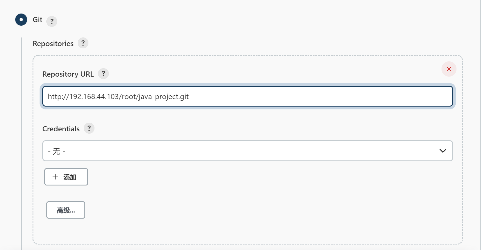

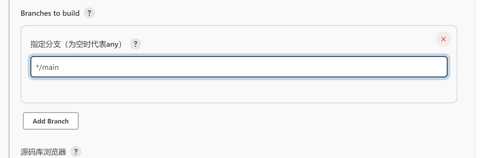

安装gitlab插件

jenkins——>Manage Jenkins——>插件管理——>Plugins，在Jenkins的插件管理中安装GitLab插件

连接配置

- SSH验证

在jenkins容器中生成密钥

```bash
# 执行后一直回车，注意必须是jenkins执行的用户
ssh-keygen -t rsa  

cat ~/.ssh/id_rsa.pub
```

在gitlab中添加ssh密钥信息

依次点击用户——>设置——>ssh密钥，填写密钥信息

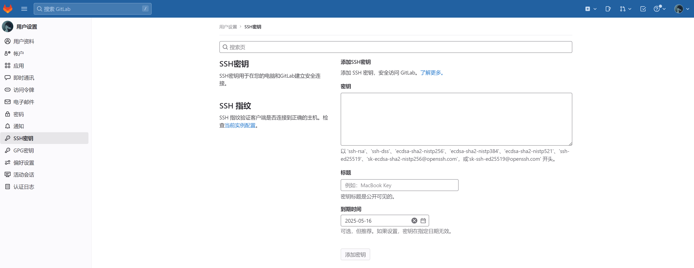

获取jenkins服务器用户名和私钥

```bash
cat ~/.ssh/id_rsa
```

jenkins创建密钥凭据，类型选择ssh username with private key

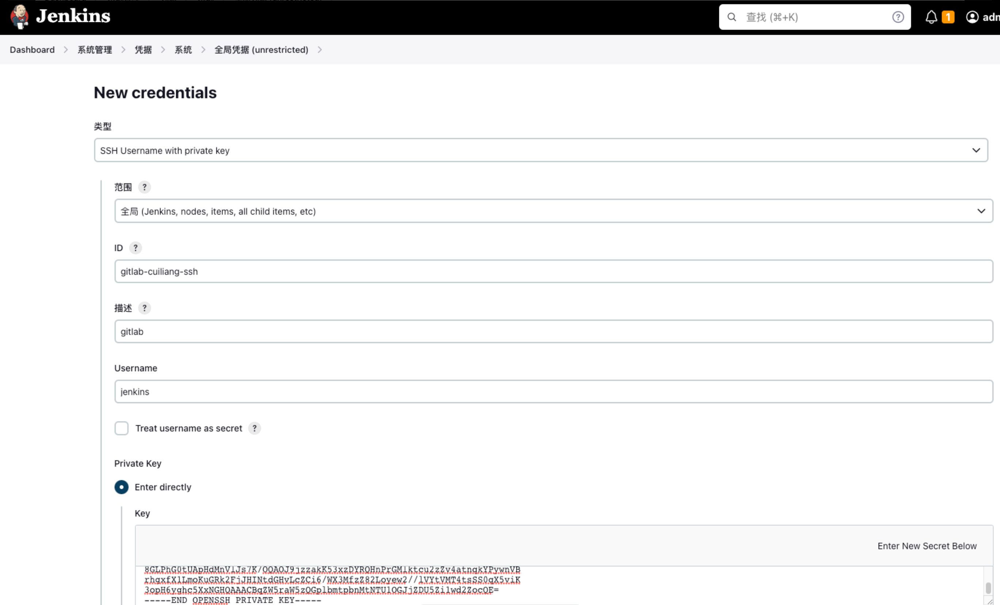

添加源码管理配置

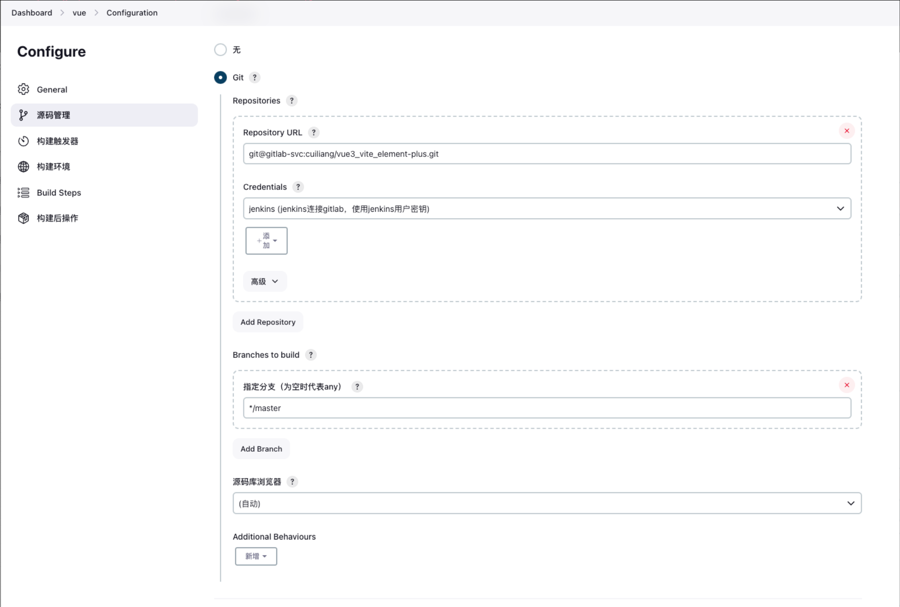

- HTTP/HTTPS验证

在jenkins中添加凭据，账号为gitlab账户和密码。
jenkins——>系统管理——>Credentials——>添加类型为username with password的全局凭据

填写代码仓地址，并选择上面创建的全局凭据

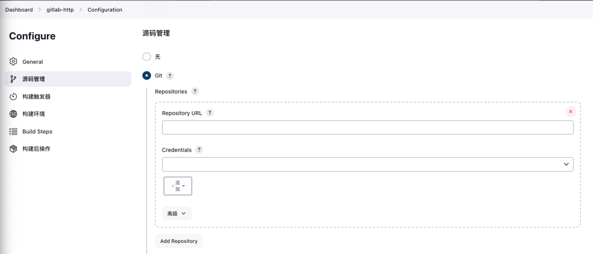

- Access Token验证

登录gitlab，依次点击项目——>设置——>访问令牌。角色设置为guest，授予api权限即可。

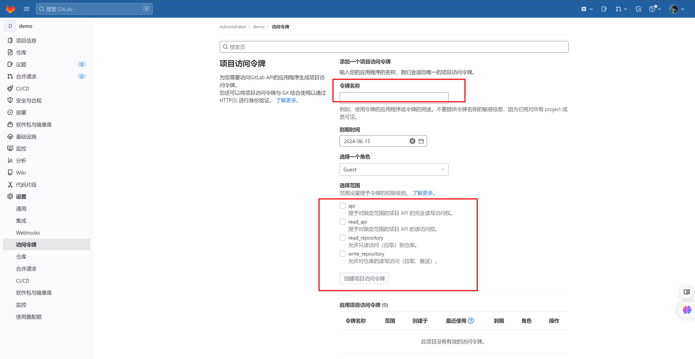

jenkins配置gitlab信息

jenkins——>系统管理——>系统配置，找到gitlab配置区域，
gitlab url填写gitlab的访问地址，然后点击 Test Connection，显示 Success，表示成功。

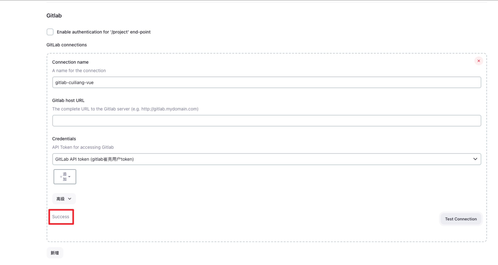

开启webhook配置

配置gitlab策略，使用root用户登录——>管理员——>网络——>出站请求——>允许来自webhook和集成对本地网络的请求

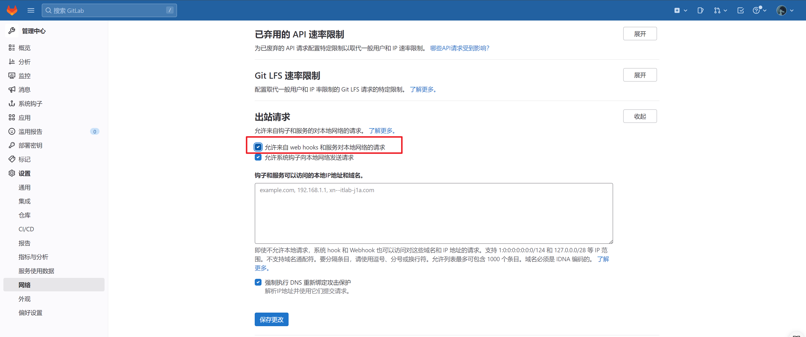

通常在企业实际开发过程中，当代码提交到master分支或者创建tag时，gitlab请求jenkins的webhook地址，完成持续构建和持续部署流程。

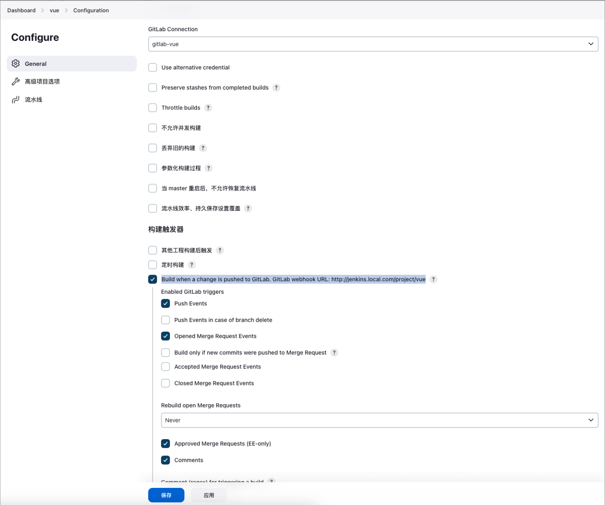

获取jenkins webhook令牌
修改流水线任务，点击`Build when a change is pushed to GitLab`的高级选项，生成令牌。

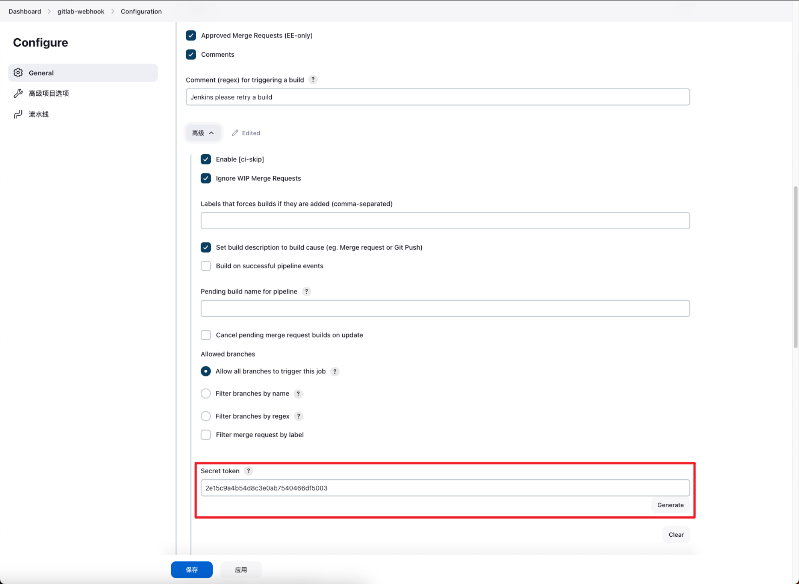

切回gitlab，设置——>webhooks——>填写jenkins生成的webhook地址和令牌。触发来源选择所有分支。
http://192.168.9.20:8080/project/gitlab-webhook

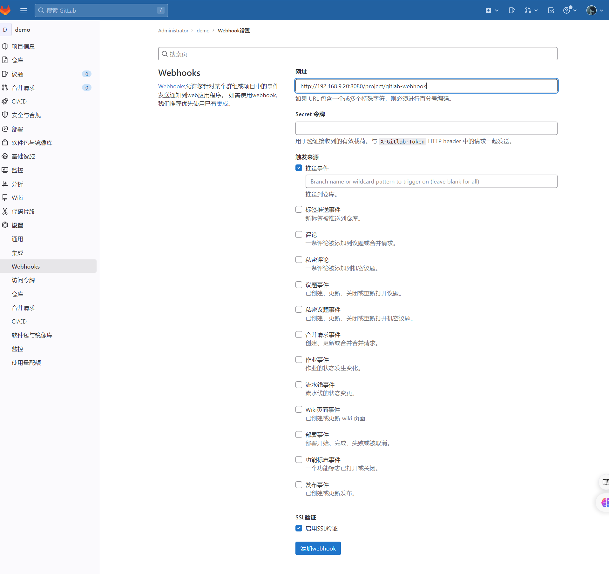

## 2.Maven安装配置

官网：https://maven.apache.org/download.cgi

下载后复制到Jenkins所在服务器解压缩即可

```bash
wget https://dlcdn.apache.org/maven/maven-3/3.9.6/binaries/apache-maven-3.9.6-bin.tar.gz
tar -zxf apache-maven-3.9.6-bin.tar.gz -C /opt
cd /opt && mv apache-maven-3.9.6 maven-3.9.6
```

添加环境变量

```bash
vim ~/.bash_profile

export MAVEN_HOME=/opt/maven-3.9.6
export PATH=$PATH:$HOME/bin:$MAVEN_HOME/bin

source ~/.bash_profile

# 测试
mvn --sersion
```

修改镜像源，配置为国内或者nexus：

`/usr/local/maven/conf/settings.xml`

159行左右

```xml
...
  <mirrors>
    <mirror>
      <!--This sends everything else to /public -->
      <id>nexus</id>
      <mirrorOf>*</mirrorOf> 
      <url>http://maven.aliyun.com/nexus/content/groups/public/</url>
    </mirror>
    <mirror>
      <!--This is used to direct the public snapshots repo in the 
          profile below over to a different nexus group -->
      <id>nexus-public-snapshots</id>
      <mirrorOf>public-snapshots</mirrorOf> 
      <url>http://maven.aliyun.com/nexus/content/repositories/snapshots/</url>
    </mirror>
    <mirror>
      <!--This is used to direct the public snapshots repo in the 
          profile below over to a different nexus group -->
      <id>nexus-public-snapshots1</id>
      <mirrorOf>public-snapshots1</mirrorOf> 
      <url>https://artifacts.alfresco.com/nexus/content/repositories/public/</url>
    </mirror>
  </mirrors>

...
```

**jenkins配置**

Jenkins的系统管理->插件管理->可选插件，查找maven并安装插件

配置

jenkis——>manage jenkins——>tools

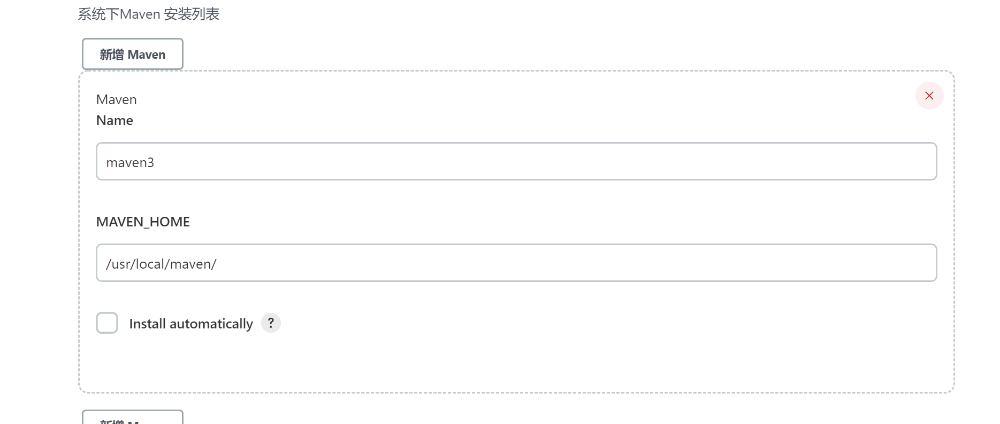

Pom.xml配置

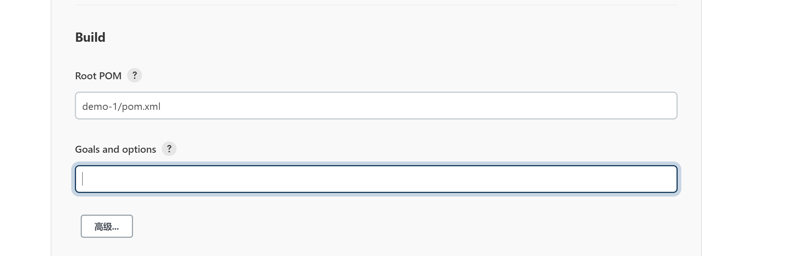

读取pom.xml参数

在执行 Java 项目的流水线时，我们经常要动态获取项目中的属性，很多属性都配置在项目的 pom.xml 中，使用Pipeline Utility Steps 插件提供能够读取 pom.xml 的方法，pipeline如下

```bash
stage('读取pom.xml参数阶段'){
    // 读取 Pom.xml 参数
    pom = readMavenPom file: './pom.xml'
    // 输出读取的参数
    print "${pom.artifactId}"
    print = "${pom.version}"
}
```

pipline配置打包编译代码

```bash
...
        stage('打包编译') {
            steps {
                echo '开始打包编译'
                sh 'mvn clean package'
                echo '打包编译完成'
            }
        }
...
```

## 3.sonarqube安装配置

下载Sonar-scanner：https://www.sonarsource.com/products/sonarqube/downloads/

前提依赖，提前准备好：

- java环境
- 安装PostgreSQL（在7.9版本之后不再支持mysql）

安装PostgreSQL

```bash
# 1、下载源
yum install https://download.postgresql.org/pub/repos/yum/reporpms/EL-7-x86_64/pgdg-redhat-repo-latest.noarch.rpm

# yum安装
yum  -y install postgresql-13


# 2、初始化，-注：后面的‘12’根据版本进行更改
/usr/pgsql-13/bin/postgresql-13-setup initdb

# 3、修postgres用户改密码
passwd postgres

# 4、配置允许远程连接
vim /var/lib/pgsql/13/data/postgresql.conf
...
#listen_addresses = 'localhost'         # what IP address(es) to listen on;
listen_addresses = '*'          # what IP address(es) to listen on;
...

vim /var/lib/pgsql/13/data/pg_hba.conf
...
# "local" is for Unix domain socket connections only
local   all             all                                     peer
# IPv4 local connections:
#host    all             all             127.0.0.1/32            scram-sha-256
host    all             all             0.0.0.0/0            md5
# IPv6 local connections:
host    all             all             ::1/128                 scram-sha-256
# Allow replication connections from localhost, by a user with the
# replication privilege.
local   replication     all                                     peer
host    replication     all             127.0.0.1/32            scram-sha-256
host    replication     all             ::1/128                 scram-sha-256
...

# 5、启动
systemctl enable postgresql-13
systemctl start postgresql-13

# 6、进入数据库
# 先切换到postgres用户
su - postgres
# 进入到数据库
psql -U postgres
 \password

# 测试
postgres=# select version();
                                                 version                                                  
----------------------------------------------------------------------------------------------------------
 PostgreSQL 13.13 on x86_64-pc-linux-gnu, compiled by gcc (GCC) 4.8.5 20150623 (Red Hat 4.8.5-44), 64-bit
(1 row)

```

创建用户和sonarqube库：

```bash
# 创建用户
postgres=# create user sonarqube with password '需要修改的口令';
postgres=# \du
postgres=# alter user sonarqube createrole createdb replication login;

# 创建表
postgres=# create database sonarqube;
postgres=# grant CREATE on DATABASE sonarqube to sonarqube;
```

创建sonarqube数据库schema

切换到sonarqube账号登录到数据库，并执行新建指令：

```bash
# 首先切换到sonarqube用户下（没有就创建）
su - sonarqube

# 登录到sonarqube数据库
sonarqube@qudoor-virtual-machine:~$ psql  sonarqube -U sonarqube -W
Password:
psql (14.5 (Ubuntu 14.5-1.pgdg22.04+1))
Type "help" for help.

# 创建表
sonarqube=> CREATE SCHEMA IF NOT EXISTS sonarqube AUTHORIZATION SESSION_USER;
sonarqube=> \dn
    List of schemas
   Name    |   Owner
-----------+-----------
 public    | postgres
 sonarqube | sonarqube
(2 rows)
```

下载之后上传到linux上解压

```bash
# 先安装解压工具
yum -y install unzip

# 解压，创建软连接
unzip sonarqube-10.3.0.82913.zip
mv sonarqube-10.3.0.82913 /opt/app
ln -s sonarqube-10.3.0.82913 sonarqube

# 创建用户用于启动，必须sonar用于启动，否则报错
groupadd sonar
useradd sonar -g sonar
chown -R sonar.sonar /opt/app/sonarqube


# 添加环境变量
vim ~/.bash_profile

export SONARQUBE_HOME=/opt/app/sonarqube
export PATH=$PATH:$HOME/bin:$SONARQUBE_HOME/bin

source ~/.bash_profile

```

准备好postSql环境，创建sonar数据库

```bash
$ cat sonar.properties
# ---数据库访问链接配置
sonar.jdbc.url=jdbc:postgresql://localhost/sonarqube?currentSchema=sonarqube
sonar.jdbc.username=sonar
sonar.jdbc.password=111111

# ----web地址绑定及访问地址
sonar.web.host=192.168.65.139
sonar.web.context=/sonarqube
sonar.web.port=9000

# ----日志访问路径
sonar.path.logs=/var/log/sonarqube/

# ---es数据保存地址，建议此地址修改到/var/log/data和/var/log/tmp
sonar.path.data=data
sonar.path.temp=temp
# 以上log地址和es的保存地址需要授权访问，chown -R sonarqube：sonarqube  设置的路径

```

启动sonarqube

```bash
./sonar.sh start   #启动
./sonar.sh console #启动过程中查询console打印
./sonar.sh status  #查询状态

```


启动成功之后直接在网页端访问：9000端口（默认）

默认的用户密码：admin/admin

汉化配置：


sonarqube生成token

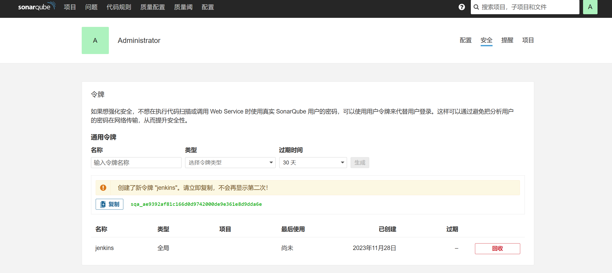

jenkins端配置sonarqube的token

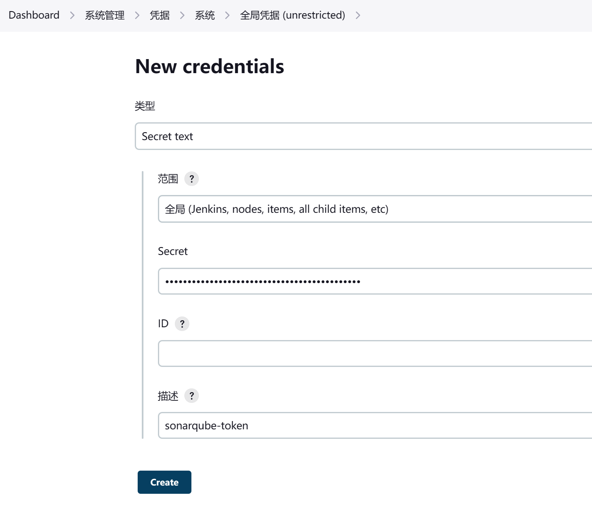

配置sonarqube服务端地址：系统管理 --> Configure System

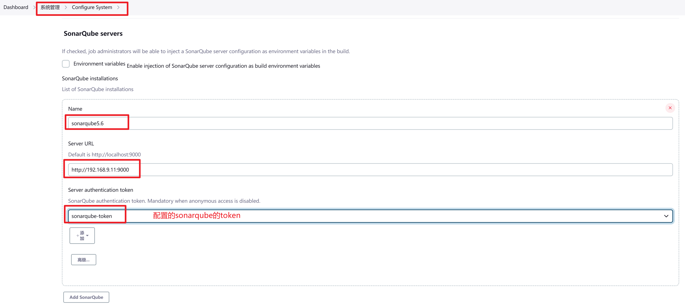

配置sonarscan的家目录：

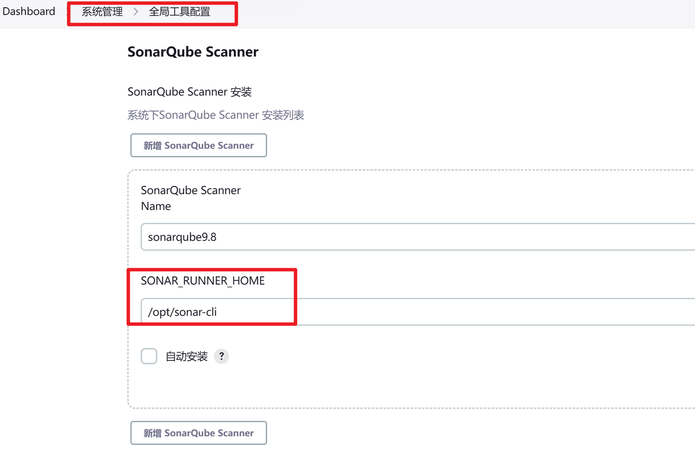

pipline加入SonarQube代码审查阶段

```bash
...
        stage('代码审查') {
            steps {
                echo '开始代码审查'
                script {
                    // 引入SonarQube scanner，名称与jenkins 全局工具SonarQube Scanner的name保持一致
                    def scannerHome = tool 'SonarQube'
                    // 引入SonarQube Server，名称与jenkins 系统配置SonarQube servers的name保持一致
                    withSonarQubeEnv('SonarQube') {
                        sh "${scannerHome}/bin/sonar-scanner"
                    }
                }
                echo '代码审查完成'
            }
        }
...
```

## 4.Harbor配置

安装Docker Pipeline插件

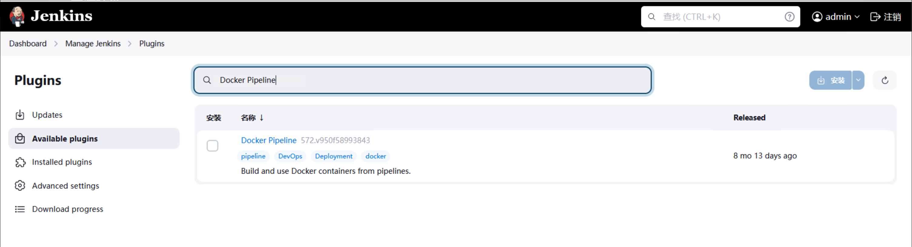

添加Harbor凭证，填写用户名密码

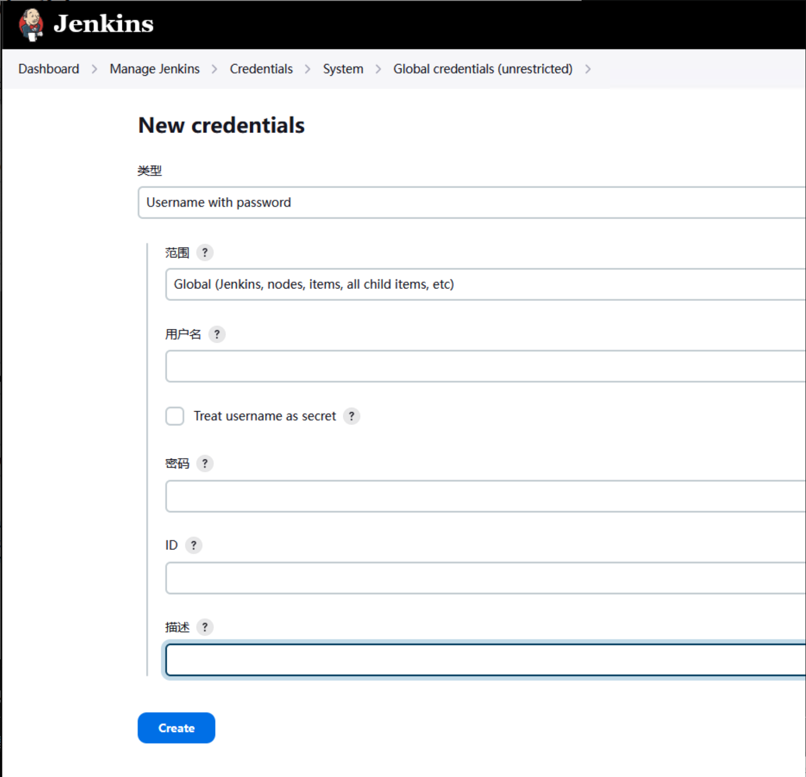

安装Version Number插件

自动给镜像打上tag，所以这里涉及到tag的取名规则，我用了一个Version Number 的插件，它能够获取到当天的年，月，日数据，我可以利用它来为tag进行取名。

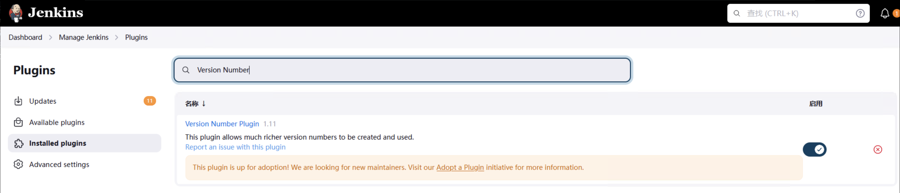

在Jenkins的插件管理中安装Kubernetes插件
jenkins——>系统管理——>插件管理——>avaliable plugins

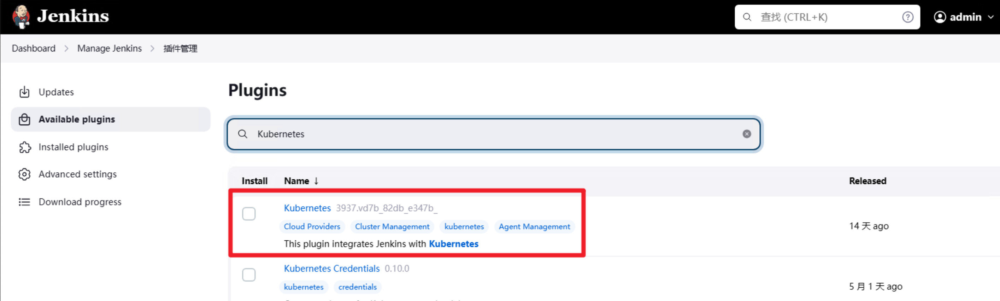

pipline配置如下

```groovy
pipeline {
    agent any
    environment {  
        VERSION = VersionNumber versionPrefix:'prod.', versionNumberString: '${BUILD_DATE_FORMATTED, "yyyyMMdd"}.${BUILDS_TODAY}'
    } 
    stages {
        stage('构建镜像') {
            environment {
                // harbor信息
                HARBOR_CRED = "harbor-demo"
                HARBOR_URL = "xxxx"
                HARBOR_PROJECT = "spring_boot_demo"
                // image信息
                IMAGE_APP = "demo"
                IMAGE_TAG = sh(script: "git rev-parse --short HEAD", returnStdout: true).trim()
                IMAGE_NAME = "${HARBOR_URL}/${HARBOR_PROJECT}/${IMAGE_APP}:${IMAGE_TAG}"
            }
            steps {
                echo '开始构建镜像'
                script {
                    docker.build "${IMAGE_NAME}"
                }
                echo '构建镜像完成'
                echo '开始推送镜像'
                script {
                    docker.withRegistry("https://${HARBOR_URL}", "${HARBOR_CRED}") {
                        docker.image("${IMAGE_NAME}").push()
                    }
                }
                echo '推送镜像完成'
                echo '开始删除镜像'
                script {
                    sh "docker rmi -f ${IMAGE_NAME}"
                }
                echo '删除镜像完成'
            }
        }
    }
}
```

## 5.k8s配置

### jenkins在集群内

如果jenkins在k8s集群中部署，直接创建sa账号，并进行rbac授权即可。

- 创建cloud资源

然后在jenkins——>系统管理——>Clouds——>New cloud——>输入cloud name并勾选类型为kubernetes

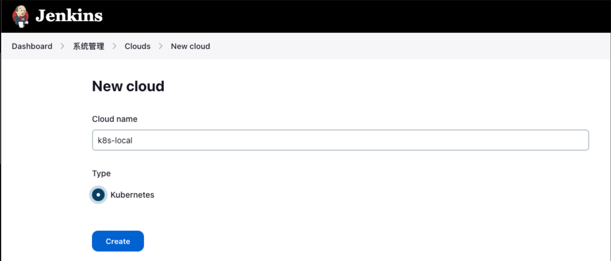

点击kubernetes cloud details填写cloud详细信息

- Kubernetes地址：在集群内部暴露的k8s service名称https://kubernetes.default.svc
- Kubernetes命名空间：jenkins sa所属的名称空间cicd
- Jenkins地址：jenkins svc的名称:8080端口http://jenkins.cicd.svc:8080

配置完成后点击连接测试，显示k8s集群版本，证明配置无误。

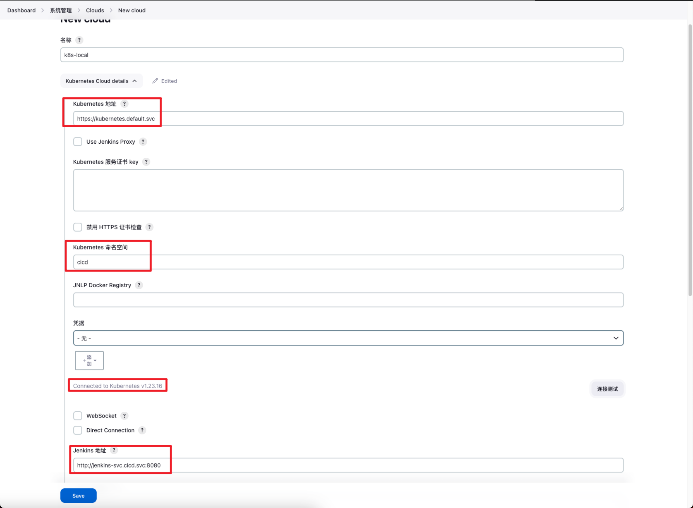

### jenkins在集群外

jenkins部署在k8s集群外，通过二进制或者docker方式部署，如果想要连接k8s集群实现资源自动创建。或者当前jenkins部署在k8s集群A中，需要通过jenkins实现集群B资源的自动创建发布，使用此方式连接。

思路：

jenkins要想连接并操作k8s集群，需要配置授权，请求k8s集群的kube apiserver的请求，可以和kubectl一样利用config文件用作请求的鉴权，默认在~/.kube/config下，也可以单独严格指定权限细节，生成一个jenkins专用的config文件。
在jenkins中能够识别的证书文件为PKCS#12 certificate，因此需要先将kubeconfig文件中的证书转换生成PKCS#12格式的pfx证书文件

#### 生成证书

可以使用yq命令行工具解析yaml，并提取相关的内容，然后通过base 64解码，最后生成文件
安装yq工具，仓库地址：https://github.com/mikefarah/yq

```bash
wget https://github.com/mikefarah/yq/releases/download/v4.34.1/yq_linux_amd64.tar.gz
tar -zxvf yq_linux_amd64.tar.gz 
mv yq_linux_amd64 /usr/bin/yq

```

```bash
certificate-authority-data——>base 64解码——>ca.crt
client-certificate-data——>base 64解码——>client.crt
client-key-data——>base 64解码——>client.key
```

```bash
mkdir -p /opt/jenkins-crt/
yq e '.clusters[0].cluster.certificate-authority-data' /root/.kube/config | base64 -d > /opt/jenkins-crt/ca.crt
yq e '.users[0].user.client-certificate-data' /root/.kube/config | base64 -d > /opt/jenkins-crt/client.crt
yq e '.users[0].user.client-key-data' /root/.kube/config | base64 -d > /opt/jenkins-crt/client.key
```

转换证书

通过openssl进行证书格式的转换，生成Client P12认证文件cert.pfx，输入两次密码并牢记密码。

```bash
 openssl pkcs12 -export -out cert.pfx -inkey client.key -in client.crt -certfile ca.crt
```

#### 导入证书

打开jenkins的web界面，系统管理——>Credentials——>添加全局凭据
凭据的类型选择Certificate，证书上传刚才生成的cert.pfx证书文件，输入通过openssl生成证书文件时输入的密码

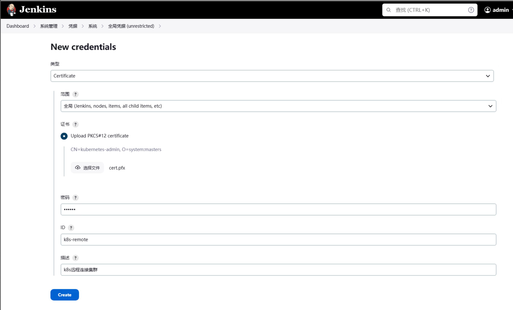

#### 配置远程k8s集群地址

jenkins——>系统管理——>Clouds——>New cloud——>输入cloud name并勾选类型为kubernetes
填写cloud详细信息

```bash
- Kubernetes地址：/root/.kube/config文件中cluster部分中server的内容
- Kubernetes命名空间：/root/.kube/config文件中cluster部分中name的内容
- Jenkins地址：jenkins服务的地址
- kubernetes服务证书key：ca.crt内容
- 凭据：选择刚刚创建的Certificate凭据
```

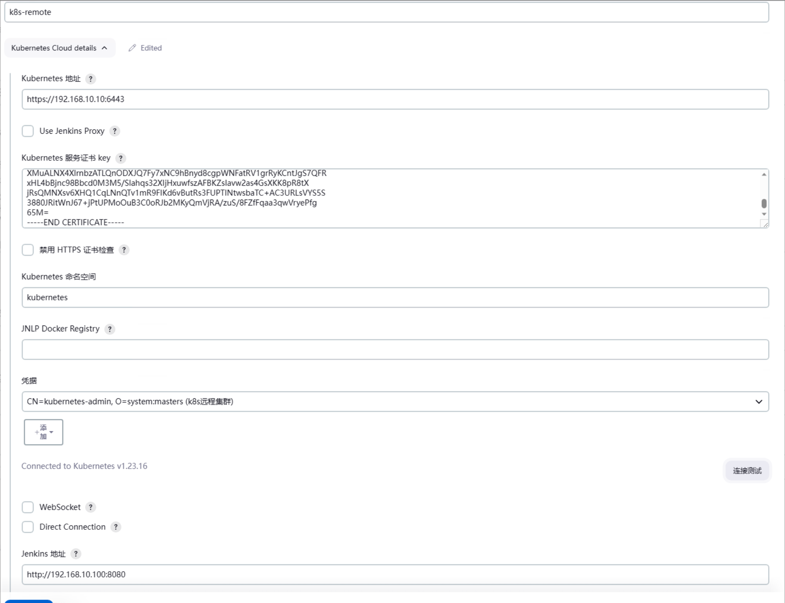

配置完成后点击连接测试，显示k8s集群版本，证明配置无误。

#### 动态slave

目前大多公司都采用 Jenkins 集群来搭建符合需求的 CI/CD 流程，然而传统的 Jenkins Slave 一主多从方式会存在一些痛点，比如：

- 主 Master 发生单点故障时，整个流程都不可用了
- 每个 Slave 的配置环境不一样，来完成不同语言的编译打包等操作，但是这些差异化的配置导致管理起来非常不方便，维护起来也是比较费劲
- 资源分配不均衡，有的 Slave 要运行的 job 出现排队等待，而有的 Slave 处于空闲状态
- 资源有浪费，每台 Slave 可能是物理机或者虚拟机，当 Slave 处于空闲状态时，也不会完全释放掉资源。

正因为上面的这些种种痛点，我们渴望一种更高效更可靠的方式来完成这个 CI/CD 流程，而 Docker虚拟化[容器](https://cloud.tencent.com/product/tke?from_column=20065&from=20065)技术能很好的解决这个痛点，又特别是在 Kubernetes 集群环境下面能够更好来解决上面的问题，下图是基于 Kubernetes 搭建 Jenkins 集群的简单示意图：

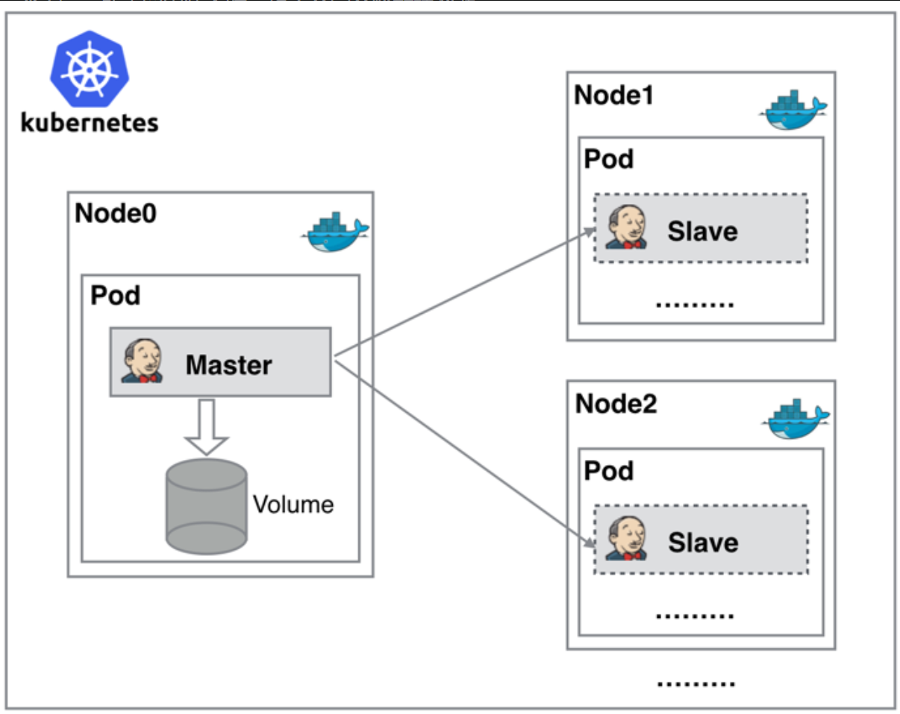

可以看到 Jenkins Master 和 Jenkins Slave 以 Pod 形式运行在 Kubernetes 集群的 Node 上，Master 运行在其中一个节点，并且将其配置数据存储到一个 Volume 上去，Slave 运行在各个节点上，并且它不是一直处于运行状态，它会按照需求动态的创建并自动删除。
这种方式的工作流程大致为：当 Jenkins Master 接受到 Build 请求时，会根据配置的 Label 动态创建一个运行在 Pod 中的 Jenkins Slave 并注册到 Master 上，当运行完 Job 后，这个 Slave 会被注销并且这个 Pod 也会自动删除，恢复到最初状态。

优势：

- 服务高可用，当 Jenkins Master 出现故障时，Kubernetes 会自动创建一个新的 Jenkins Master 容器，并且将 Volume 分配给新创建的容器，保证数据不丢失，从而达到集群服务高可用(这是k8s带来的资源控制器带来的优势)
- 动态伸缩，合理使用资源，每次运行 Job 时，会自动创建一个 Jenkins Slave，Job 完成后，Slave 自动注销并删除容器，资源自动释放，而且 Kubernetes 会根据每个资源的使用情况，动态分配 Slave 到空闲的节点上创建，降低出现因某节点资源利用率高，还排队等待在该节点的情况。
- 扩展性好，当 Kubernetes 集群的资源严重不足而导致 Job 排队等待时，可以很容易的添加一个 Kubernetes Node 到集群中，从而实现扩展。

**配置：**

制作slave镜，slave镜像应该包含以下功能：

- 运行jenkins-agent服务
- 使用kubectl命令操作k8s集群
- 使用nerdctl工具管理container镜像
- 使用buildctl构建container镜像。

构建镜像

```bash
cat >Dockerfile <<EOF
FROM jenkins/inbound-agent:latest-jdk17
COPY kubectl /usr/bin/kubectl
COPY nerdctl /usr/bin/nerdctl
EOF

docker build -t jenkins-agent:v1 . 
```

创建kube-config资源

让slave容器中能够使用 kubectl 工具来访问我们的 Kubernetes 集群，需要将其添加为secret资源，并挂载到pod中

```bash
kubectl create secret generic -n cicd kube-config --from-file=/root/.kube/config
```

节点开启buildkit服务(可选)

container容器运行时仅能运行容器，如果需要在CICD阶段构建镜像，则需要在执行构建镜像的节点手动安装buildkit服务并启用，具体步骤可参考文档：https://www.cuiliangblog.cn/detail/section/167380911。
也可以在slave pod中新增一个container，运行buildkit服务。

配置Pod Template(可选)

配置 Pod Template，就是配置 Jenkins Slave 运行的 Pod 模板，命名空间我们同样是用cicd，Labels设置为jenkins-slave，对于后面执行 Job 的时候需要用到该值，容器名称填写jnlp，这样可以替换默认的agent容器。镜像使用的是刚刚我们制作的slave镜像，加入了 kubectl 等一些实用的工具。
运行命令和命令参数为空。

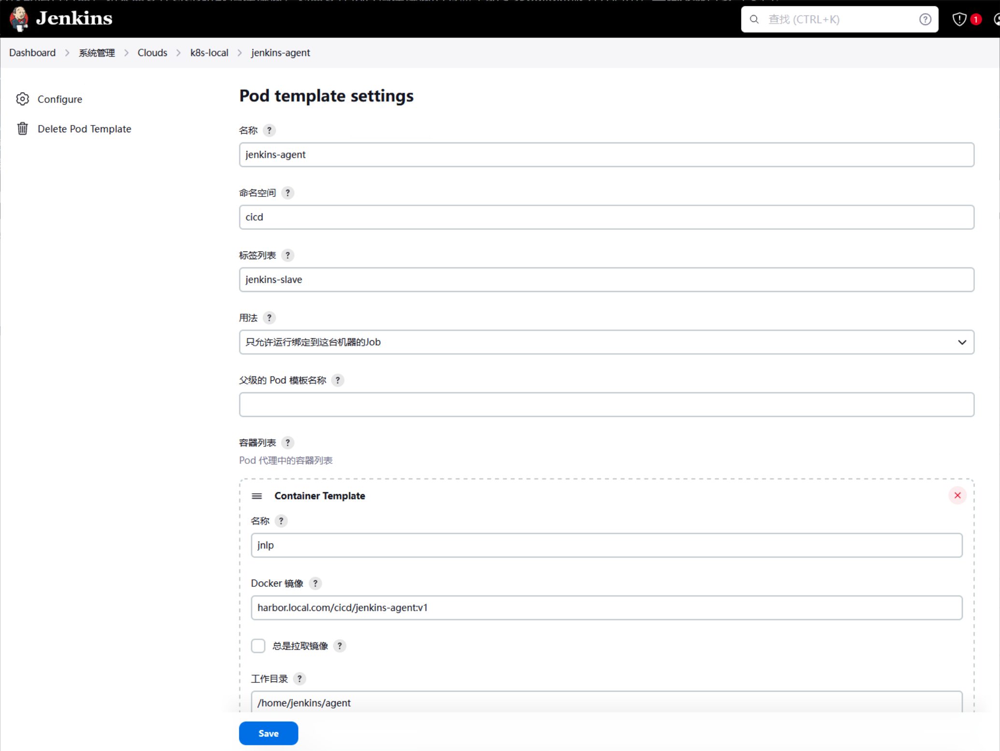

另外需要注意我们这里需要在下面挂载三个目录:

```bash
# docker环境
/var/run/docker.sock # 该文件是用于 Pod 中的容器能够共享宿主机的Container，用于管理container镜像。
/usr/bin/docker    # 
/root/.m2

# container环境：
/run/containerd/containerd.sock # 该文件是用于 Pod 中的容器能够共享宿主机的Container，用于管理container镜像。
/root/.kube   # 将之前创建的kube-config资源挂载到容器的/root/.kube目录下，这样能够在 Pod 的容器中能够使用 kubectl 工具来访问我们的 Kubernetes 集群，方便我们后面在 Slave Pod 部署 Kubernetes 应用
/run/buildkit  # 该文件是用于 Pod 中的容器能够共享buildkit进程，用于构建container镜像。
```

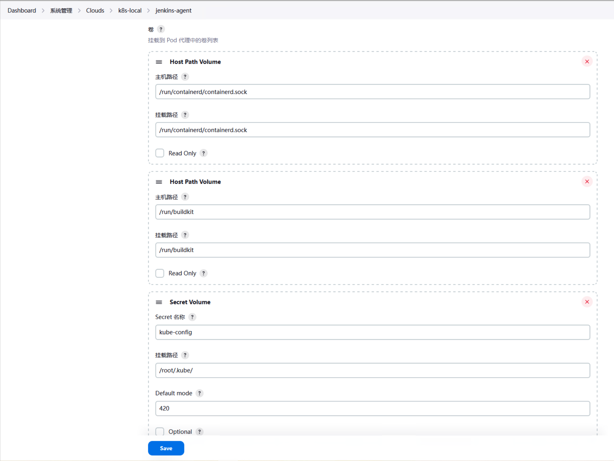

同时指定Service Accoun为之前创建的jenkins（查看k8s安装jenkins章节）

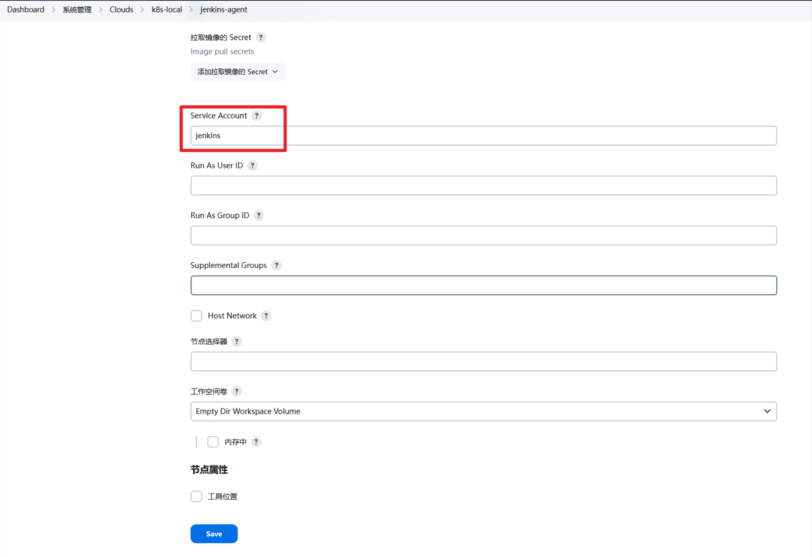


除了在页面配置pod Template外，我们也可以通过pipeline配置。

## 5.publish over ssh 配置

给远程服务器执行命令

1、安装插件

2、系统管理 --》Configure System找到publish over ssh配置添加目标服务器

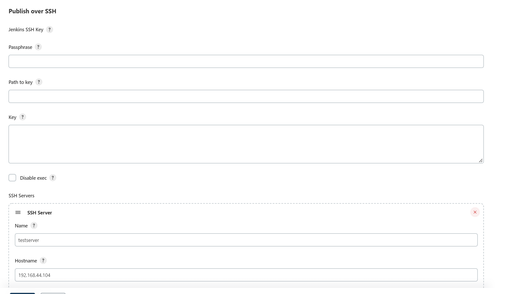

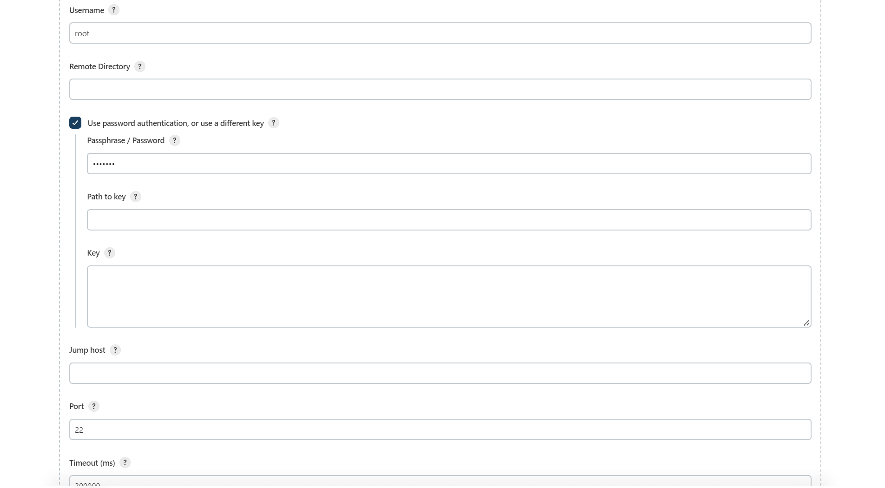 

ssh server

## 6.blue ocean可视化界面

全新的流水线控制ui，可重复执行某阶段代码，插件中心搜索blue ocean安装即可

# 触发任务构建方式

- 快照依赖构建/Build whenever a SNAPSHOT dependency is built
  - 当依赖的快照被构建时执行本job
- 触发远程构建 (例如,使用脚本)
  - 远程调用本job的restapi时执行本job
- job依赖构建/Build after other projects are built
  - 当依赖的job被构建时执行本job
- 定时构建/Build periodically
  - 使用cron表达式定时构建本job
- 向GitHub提交代码时触发Jenkins自动构建/GitHub hook trigger for GITScm polling
  - Github-WebHook出发时构建本job
- 定期检查代码变更/Poll SCM
  - 使用cron表达式定时检查代码变更，变更后构建本job

## 1.触发远程构建

gitlab上改动自动构建

代码改动自动可以使用gitlab的webhook回调钩子调起Jenkins的启动任务接口

在构建触发器中配置接口和token（此触会有硬性条件，就是如果没有登陆过jenkins，在访问请求的时候会弹出登录界面，进行登录，可以配合[Authentication Tokens API](https://plugins.jenkins.io/authentication-tokens)来实现跳过密码登录，方便在其他地方进行请求）

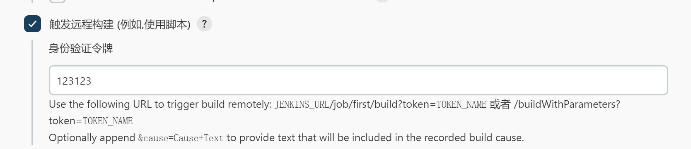

## 2.定时构建

Jenkins cron表达式，不是标准的cron表达式

标准cron：https://crontab.guru

```bash
第一个 * 表示每个小时的第几分钟，取值0~59
H * * * *
H：每小时执行一次

第二颗 * 表示小时，取值0~23
* 15 * * * 表示每天下午3点
* 1 * * *  表示每天凌晨1点

第三颗 * 表示一个月的第几天，取值1~31
* 1 5 * *  表示每月5日凌晨1点

第四颗 * 表示第几月，取值1~12
* 15 5 1 *  表示每年几月执行

第五颗 * 表示一周中的第几天，取值0~7，其中0和7代表的都是周日


“/”：表示每隔多长时间，比如 */10 * * * * 表示 每隔10分钟
“H”：hash散列值，以job名取值，获取到以job名为入参的唯一值，相同名称值也相同，这个偏移量会和实际时间相加，获得一个真实的运行时间
意义在于：不同的项目在不同的时间运行，即使配置的值是一样的，比如 都是`15 * * * * ` ，表示每个小时的第15分钟开始执行任务，那么会造成同一时间内在Jenkins中启动很多job，换成`H/15 * * * *`,那么在首次启动任务时，会有随机值参与进来，有的会在17分钟启动 有的会在19分钟启动，随后的启动时间也是这个值。这样就能错开相同cron值的任务执行了。

H的值也可以设置范围
```

示例

```bash
`H * * * *`表示一小时内的任意时间

`*/10 * * * *`每10分钟

`H/10 * * * *`每10分钟,可能是7,17,27，起始时间hash，步长不变

`45 3 * * 1-6 ` 每个周一至周六，凌晨3点45 执行1次

`45 3-5 * * 1-6 ` 每个周一至周六，凌晨3点45 ，凌晨4点45，凌晨5点45 各执行1次

`H(40-48) 3-5 * * 1-6 ` 在40~48之间取值 其他同上

`45 3-5/2 * * 1-6 ` 每个周一至周六，凌晨3点45 ，凌晨5点45 各执行1次

` 45 0-6/2 * * 1-6 * * 1-6 ` 0点开始，每间隔2小时执行一次 0:45、2:45、4:45
```

## 3.源码变更构建

使用Poll SCM 方式与Build periodically一样

会主动定期检查代码托管服务器上是否有变化，一旦发生变化执行job构建

# agent/slave机制

## 介绍

Jenkins采用Master/Slave架构。Master/Slave相当于Server和agent的概念，Master提供web接口让用户来管理Job和Slave，Job可以运行在Master本机或者被分配到Slave上运行。一个Master可以关联多个Slave用来为不同的Job或相同的Job的不同配置来服务。
Jenkins的Master/Slave机制除了可以并发的执行构建任务，加速构建以外。还可以用于分布式自动化测试，当自动化测试代码非常多或者是需要在多个浏览器上并行的时候，可以把测试代码划分到不同节点上运行，从而加速自动化测试的执行。

**Master：**Jenkins服务器。主要是处理调度构建作业，把构建分发到Slave节点实际执行，监视Slave节点的状态。当然，也并不是说Master节点不能跑任务。构建结果和构建产物最后还是传回到Master节点，比如说在jenkins工作目录下面的workspace内的内容，在Master节点照样是有一份的。
**Slave：**执行机(奴隶机)。执行Master分配的任务，并返回任务的进度和结果。

Jenkins Master/Slave的搭建需要至少两台机器，一台Master节点，一台Slave节点（实际生产中会有多个Slave节点）。

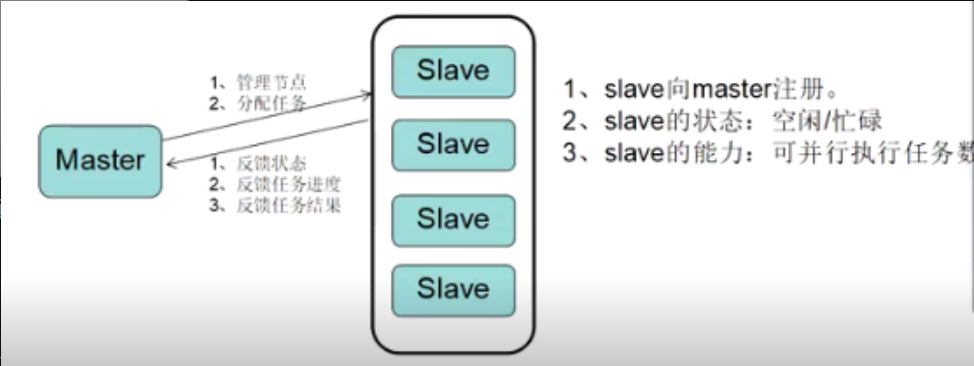


前提：Master和Slave都已经安装JDK

- Master节点上安装和配置Jenkins
- Master节点上新增Slave节点配置，生成Master-Slave通讯文件SlaveAgent
- Slave节点上运行SlaveAgent，通过SlaveAgent实现和Master节点的通讯
- Master节点上管理Jenkins项目，指定Slave调度策略，实现Slave节点的任务分配和结果搜集来源。

Master不需要主动去建立，在安装Jenkins，本机就已经默认为master。
选择“Manage Jenkins”->“Manage Nodes and Clouds”，可以看到Master节点相关信息：

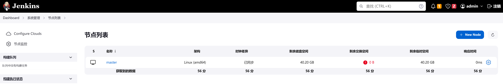

## 添加slave

- 开启tcp代理端口

jenkins web代理是指slave通过jenkins服务端提供的一个tcp端口，与jenkins服务端建立连接，docker版的jenkins默认开启web tcp代理，端口为50000，而自己手动制作的jenkins容器或者在物理机环境部署的jenkins，都需要手动开启web代理端口，如果不开启，slave无法通过web代理的方式与jenkins建立连接。

jenkins web代理的tcp端口不是通过命令启动的而是通过在全局安全设置中配置的，配置成功后会在系统上运行一个指定的端口

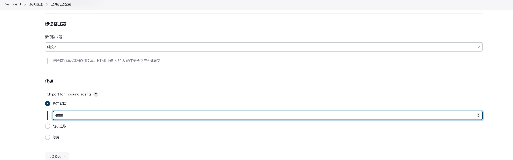


- 添加节点

Jenkins界面选择“系统管理”->“节点管理”->“New Node“

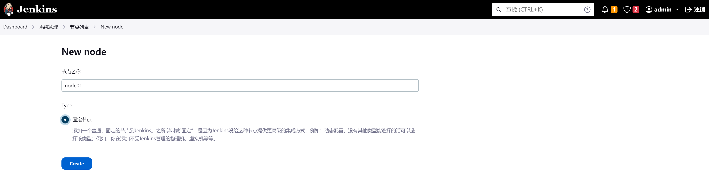

配置agnt信息

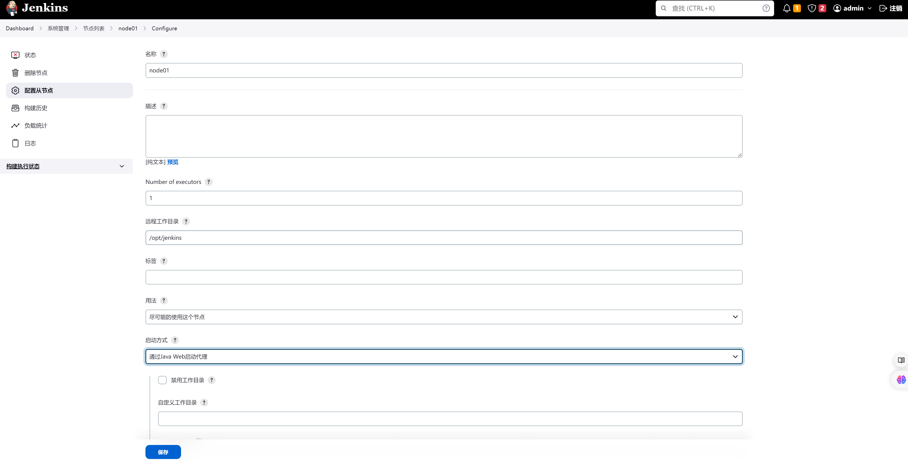

```bash
Number of excutors：允许在这个节点上并发执行任务的数量，即同时可以下发多少个Job到Slave上执行，一般设置为 cpu 支持的线程数。[注：Master Node也可以通过此参数配置Master是否也执行构建任务、还是仅作为Jenkins调度节点]
远程工作目录：用来放工程的文件夹，jenkins master上设置的下载的代码会放到这个工作目录下。
标签：标签，用于实现后续Job调度策略，根据Jobs配置的Label选择Salve Node
用法：支持两种模式：“尽可能使用这个节点”、“只允许运行绑定到这台主机的job”。选择“只允许运行绑定到这台主机的job”，
添加完毕后，在Jenkins主界面，可以看到新添加的Slave Node，但是红叉表示此时的Slave并未与Master建立起联系。
```

安装agent

点击节点信息，根据控制台提示执行安装agent命令

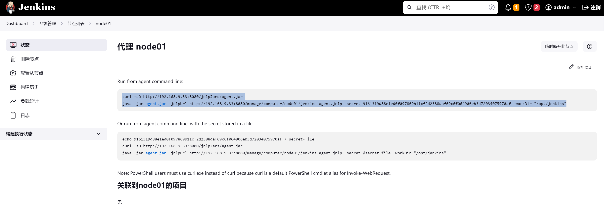

```bash
curl -sO http://192.168.9.33:8080/jnlpJars/agent.jar
java -jar agent.jar -jnlpUrl http://192.168.9.33:8080/manage/computer/node01/jenkins-agent.jnlp -secret 9161319d88e1ed0f097869b11cf2d2388daf69c6f064906eb3d72034075970af -workDir "/opt/jenkins"
```

## 指定slave调度策略

- 自定义项目

创建Job的页面，“General”下勾选“Restric where this project can be run”，填写Label Expression。

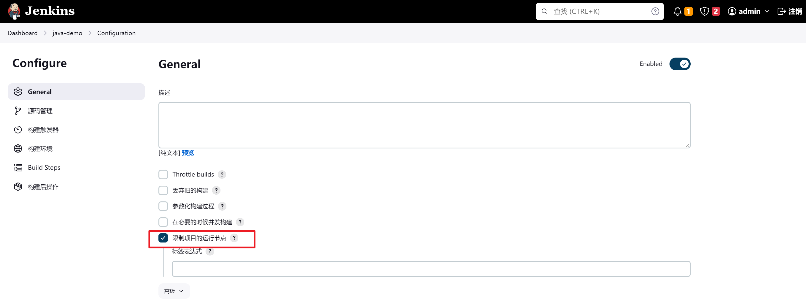

- 流水线项目

指定执行节点，label 指定运行job的节点标签

在agent配置中，any为不指定，由Jenkins自己分配

```bash
pipeline {
    agent {
        node {
            label "jenkins-02"
        }
    }
    
    stages {
        stage('拉取代码') {
            steps {    
                sh """
                    sleep 10              
                   """
                echo '拉取代码完成' 
            }
        }
        stage('执行构建') {
            steps {
                echo '执行构建完成'
            }
        }
    }
    post {
        always {
            echo "完成"
        }
        failure {
            echo "失败"
        }
    }
}

```


# 创建一个maven项目

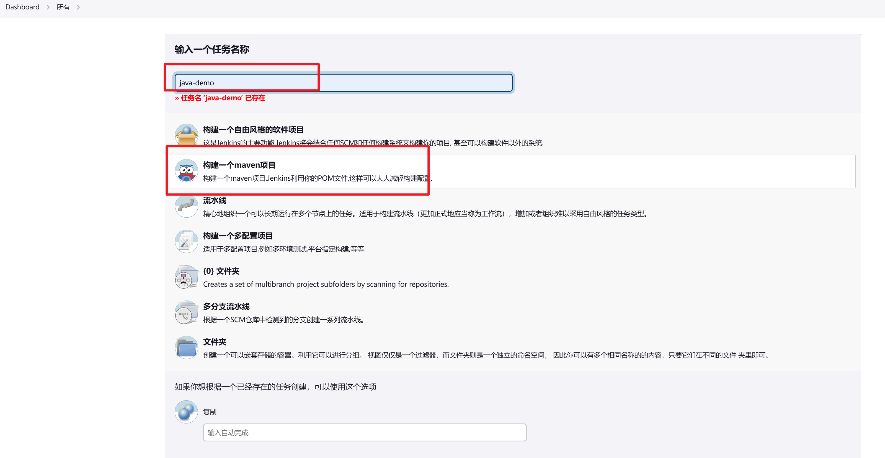

## Git配置（这里以gitee配置为例）

先添加credentials


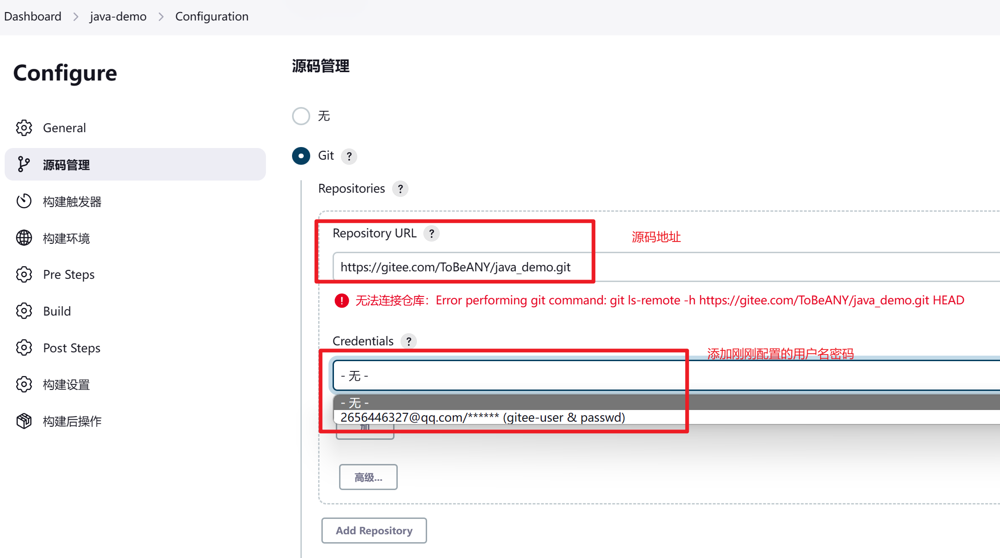


## Pom.xml配置


## 添加over ssh的配置

修改在post steps中添加over ssh的配置

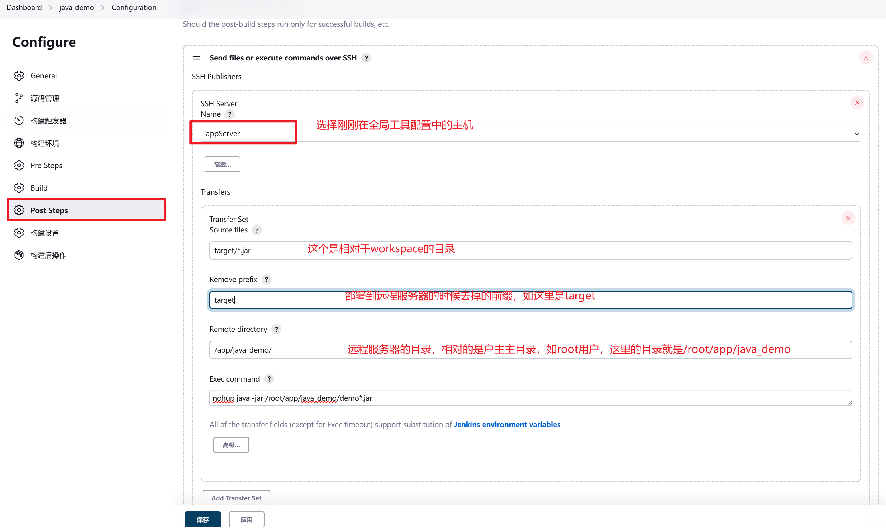

**超时机制**

​		输出命令时一定要注意不要让窗口卡主，不然Jenkins会认为认为一直没完成

**shell的日志输出**

```bash
nohup java -jar /root/xxoo/demo*.jar >mylog.log 2>&1 &
```


运行前清理环境（删除上一个版本的包），配置杀死之前运行的进程

```shell
#!/bin/bash

#删除历史数据
rm -rf xxoo

appname=$1
#获取传入的参数
echo "arg:$1"


#获取正在运行的jar包pid
pid=`ps -ef | grep $1 | grep 'java -jar' | awk '{printf $2}'`

echo $pid

#如果pid为空，提示一下，否则，执行kill命令
if [ -z $pid ];    #使用-z 做空值判断
then
	echo "$appname not started"

else
	kill -9 $pid
	echo "$appname stoping...."
	check=`ps -ef | grep -w $pid | grep java`
	if [ -z $check ];
	then
		echo "$appname pid:$pid is stop"
	else
		echo "$appname stop failed"
	fi
fi

```

# 流水线 pipeline

Jenkins集群/并发构建，集群化构建可以有效提升构建效率，尤其是团队项目比较多或是子项目比较多的时候，可以并发在多台机器上执行构建。

流水线既能作为任务的本身，也能作为Jenkinsfile

使用流水线可以让我们的任务从ui手动操作，转换为代码化，像docker的dockerfile一样，从shell命令到配置文件，更适合大型项目，可以让团队其他开发者同时参与进来，同时也可以编辑开发Jenkinswebui不能完成的更复杂的构建逻辑，作为开发者可读性也更好。

语法

```
pipeline：整条流水线
agent：指定执行器
stages：所有阶段
stage：某一阶段，可有多个
steps：阶段内的每一步，可执行命令
```

**post：**流水线完成后可执行的任务

- always 无论流水线或者阶段的完成状态。
- changed 只有当流水线或者阶段完成状态与之前不同时。
- failure 只有当流水线或者阶段状态为"failure"运行。
- success 只有当流水线或者阶段状态为"success"运行。
- unstable 只有当流水线或者阶段状态为"unstable"运行。例如：测试失败。
- aborted 只有当流水线或者阶段状态为"aborted "运行。例如：手动取消。

**input：**手工干预任务执行

```bash
// 等待用户输入  
input {  
    message "继续吗？"  
    id "continue"  
    submitter "user1,user2", // 可选，限制哪些用户可以提交输入  
    parameters {  
        string(  
            name: 'CONTINUE_PARAM',  
            defaultValue: 'yes',  
            description: '输入yes以继续'  
        )  
    }  
}  
```


### 示例

1、普通java项目

```groovy
pipeline {
    agent any

    tools {
        maven "maven3"
    }
    stages {
        stage("拉取代码") {
            steps {             
                git credentialsId: 'acee6944-dad4-43f2-aa73-635879f0b2a3', url: 'https://gitee.com/ToBeANY/java_demo.git'
                echo '拉取成功'
            }
        }
        
        stage("质量扫描分析") {
            steps {
              // withSonarQubeEnv():括号中的名称是在"系统管理"--"系统配置"--"SonarQubeServer"配置中的⾃定义名称.（这个参数添加后，就可以在Jenkins终端上链接到sonarqube上。）
				withSonarQubeEnv('sonarqube-token') {
				  // sh后⾯的SonarQube命令也可以⽤'+'拼接起来，类似python，也可以直接⼀⾏长命令
				  sh '/opt/sonar-scanner-5.0.1.3006-linux/bin/sonar-scanner -Dsonar.projectName=${JOB_NAME} -Dsonar.projectKey=html -Dsonar.sources=.'
				}	
				// 万⼀发⽣错误，pipeline 将在超时后被终⽌ (这个代码质检返回状态的配置，需要在sonarqube上开启webhook才可⽤)
				timeout(time: 30, unit: 'MINUTES') {
				  // 告诉 Jenkins 等待 SonarQube 返回的分析结果。当 abortPipeline=true，表⽰质量不合格，将 pipeline 状态设置为 UNSTABLE。终⽌后⾯的任务执⾏
				  waitForQualityGate abortPipeline: true
                
                }
            }
        }

        stage("执行构建") {
            steps {
		        sh "mvn --version"
                sh """
                  mvn clean package
                """
                echo '构建完成'
            }
        }
        
        stage("clean test server"){
            steps{
                sh '''
                    whoami
                    ssh -v root@122.9.121.150 -p 9093 "kill -9 `ps -ef|grep java|awk 'NR==1{print $2}'`;rm -f /root/app/java_demo/*.jar;exit;"
                '''
                echo 'clean over!!!'
            }
        }
        
        stage("发送jar包到测试服务器") {
            steps {
                
                sshPublisher(publishers: [sshPublisherDesc(configName: 'appServer', transfers: [sshTransfer(cleanRemote: false, excludes: '', execCommand: 'nohup java -jar app/java_demo/*.jar >app/java_demo/java_demo.log 2>&1 &', execTimeout: 120000, flatten: false, makeEmptyDirs: false, noDefaultExcludes: false, patternSeparator: '[, ]+', remoteDirectory: '/app/java_demo/', remoteDirectorySDF: false, removePrefix: 'target', sourceFiles: 'target/*.jar')], usePromotionTimestamp: false, useWorkspaceInPromotion: false, verbose: false)])               
                echo 'jar send over and up!'
            }
        }
    }

    post {       
        always {            
            echo "完成"       
        }   
        failure {   
            echo "失败"
        }
    }
}
```

2、spring项目

```groovy
pipeline {
    agent any
    environment {
        // 全局变量
        HARBOR_CRED = "harbor-cuiliang-password"
        IMAGE_NAME = ""
        IMAGE_APP = "demo"
    } 
    stages {
        stage('拉取代码') {
            environment {
                // gitlab仓库信息
                GITLAB_CRED = "gitlab-cuiliang-password"
                GITLAB_URL = "http://192.168.10.72/develop/sprint-boot-demo.git"
            }
            steps {
                echo '开始拉取代码'
                checkout scmGit(branches: [[name: '*/main']], extensions: [], userRemoteConfigs: [[credentialsId: "${GITLAB_CRED}", url: "${GITLAB_URL}"]])
                echo '拉取代码完成'
            }
        }

        stage('打包编译') {
            steps {
                echo '开始打包编译'
                sh 'mvn clean package'
                echo '打包编译完成'
            }
        }

        stage('代码审查') {
            environment {
                // SonarQube信息
                SONARQUBE_SCANNER = "SonarQubeScanner"
                SONARQUBE_SERVER = "SonarQubeServer"
            }
            steps{
                echo '开始代码审查'
                script {
                    def scannerHome = tool "${SONARQUBE_SCANNER}"
                    withSonarQubeEnv("${SONARQUBE_SERVER}") {
                        sh "${scannerHome}/bin/sonar-scanner"
                    }
                }
                echo '代码审查完成'
            }
        }

        stage('构建镜像') {
            environment {
                // harbor仓库信息
                HARBOR_URL = "harbor.local.com"
                HARBOR_PROJECT = "spring_boot_demo"
                // 镜像名称
                IMAGE_TAG = sh(script: "git rev-parse --short HEAD", returnStdout: true).trim()
            }
            steps {
                echo '开始构建镜像'
                script {
                    IMAGE_NAME = "${HARBOR_URL}/${HARBOR_PROJECT}/${IMAGE_APP}:${IMAGE_TAG}" 
                    docker.build "${IMAGE_NAME}"
                }
                echo '构建镜像完成'
                echo '开始推送镜像'
                script {
                    docker.withRegistry("https://${HARBOR_URL}", "${HARBOR_CRED}") {
                        docker.image("${IMAGE_NAME}").push()
                    }
                }
                echo '推送镜像完成'
                echo '开始删除镜像'
                script {
                    sh "docker rmi -f ${IMAGE_NAME}"
                }
                echo '删除镜像完成'
            }
        }

        stage('项目部署') {
            environment {
                // 目标主机信息
                HOST_NAME = "springboot1"
            }
            steps {
                echo '开始部署项目'
                // 获取harbor账号密码
                withCredentials([usernamePassword(credentialsId: "${HARBOR_CRED}", passwordVariable: 'HARBOR_PASSWORD', usernameVariable: 'HARBOR_USERNAME')]) {
                    // 执行远程命令
                    sshPublisher(publishers: [sshPublisherDesc(configName: "${HOST_NAME}", transfers: [sshTransfer(
                        cleanRemote: false, excludes: '', execCommand: "sh -x /opt/jenkins/springboot/deployment.sh ${HARBOR_USERNAME} ${HARBOR_PASSWORD} ${IMAGE_NAME} ${IMAGE_APP}", 
                        execTimeout: 120000, flatten: false, makeEmptyDirs: false, noDefaultExcludes: false, patternSeparator: '[, ]+', remoteDirectory: '/opt/jenkins/springboot', 
                        remoteDirectorySDF: false, removePrefix: '', sourceFiles: 'deployment.sh')], usePromotionTimestamp: false, useWorkspaceInPromotion: false, verbose: false
                    )])
                }
                echo '部署项目完成'
            }
        }
    }
}    
```

# 共享目录(ShareLibrary)

取自：https://www.yuque.com/xyy-onlyone/exkgza/gse2qcbqzgouqdnf#d075944f

共享库这并不是一个全新的概念，其实在编程语言Python中，我们可以将Python代码写到一个文件中，当代码数量增加，我们可以将代码打包成模块然后再以import的方式使用此模块中的方法。

在Jenkins中使用Groovy语法，**共享库中存储的每个文件都是一个groovy的类**，**每个文件（类）中包含一个或多个方法。每个方法包含groovy语句块**。可以在Git等版本控制系统中创建一个项目用于存储共享库。共享流水线有助于减少冗余并保持代码整洁。

## 代码仓创建共享库

共享库的目录结构

- src： 类似于java的源码目录，执行流水线时会加载到class路径中。 需要先导入才可以使用

- vars:  存放全局变量脚本，小的功能函数，可以直接加载

- resources： 存放资源文件，类似于配置信息文件

```bash
├── resources
│   └── org
│       └── devops
│           └── config.json
├── src
│   └── org
│       └── devops
│           └── tools.groovy
└── vars
    ├── GetCommitId.groovy
    └── GetHost.groovy
```

在代码仓中创建对应的仓库

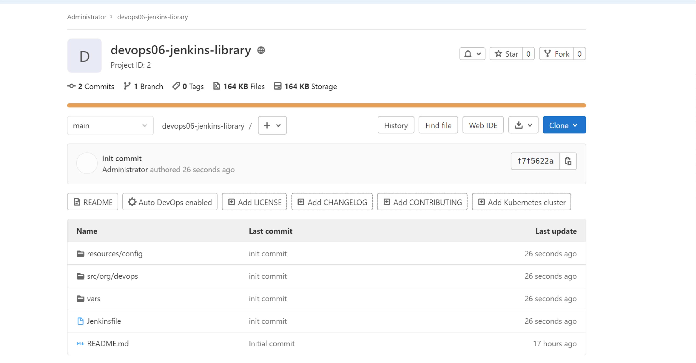

代码示例：

src/org/devops目录下的代码文件

容器构建：build.groovy

```groovy
// 包定义
package org.devops 

// docker容器直接build
def DockerBuild(buildShell){
    sh """
        ${buildShell}
    """
}

```

邮箱发送：sendEmail.groovy

```groovy
package org.devops

//定义邮件内容
def SendEmail(status,emailUser){
    emailext body: """
            <!DOCTYPE html> 
            <html> 
            <head> 
            <meta charset="UTF-8"> 
            </head> 
            <body leftmargin="8" marginwidth="0" topmargin="8" marginheight="4" offset="0"> 
                <table width="95%" cellpadding="0" cellspacing="0" style="font-size: 11pt; font-family: Tahoma, Arial, Helvetica, sans-serif">   
                <tr>
		            本邮件由系统自动发出，无需回复！<br/>
		            各位同事，大家好，以下为${JOB_NAME}项目构建信息</br>
		            <td><font color="#CC0000">构建结果 - ${status}</font></td>
		        </tr>

                    <tr> 
                        <td><br /> 
                            <b><font color="#0B610B">构建信息</font></b> 
                        </td> 
                    </tr> 
                    <tr> 
                        <td> 
                            <ul> 
                                <li>项目名称：${JOB_NAME}</li>         
                                <li>构建编号：${BUILD_ID}</li> 
                                <li>构建状态: ${status} </li>                         
                                <li>项目地址：<a href="${BUILD_URL}">${BUILD_URL}</a></li>    
                                <li>构建日志：<a href="${BUILD_URL}console">${BUILD_URL}console</a></li>   
                            </ul> 
                        </td> 
                    </tr> 
                    <tr>  
                </table> 
            </body> 
            </html>  """,
            subject: "Jenkins-${JOB_NAME}项目构建信息 ",
            to: emailUser
        
}
```

sonarAPI.groovy

```groovy
package ore.devops

// 封装HTTP请求
def HttpReq(requestType,requestUrl,requestBody){
    // 定义sonar api接口
    def sonarServer = "http://sonar.devops.svc.cluster.local:9000/api"
    result = httpRequest authentication: 'sonar-admin-user',
            httpMode: requestType,
            contentType: "APPLICATION_JSON",
            consoleLogResponseBody: true,
            ignoreSslErrors: true,
            requestBody: requestBody,
            url: "${sonarServer}/${requestUrl}"
    return result
}

// 获取soanr项目的状态
def GetSonarStatus(projectName){
    def apiUrl = "project_branches/list?project=${projectName}"
    // 发请求
    response = HttpReq("GET",apiUrl,"")
    // 对返回的文本做JSON解析
    response = readJSON text: """${response.content}"""
    // 获取状态值
    result = response["branches"][0]["status"]["qualityGateStatus"]
    return result
}

// 获取sonar项目，判断项目是否存在
def SearchProject(projectName){
    def apiUrl = "projects/search?projects=${projectName}"
    // 发请求
    response = HttpReq("GET",apiUrl,"")
    println "搜索的结果：${response}"
    // 对返回的文本做JSON解析
    response = readJSON text: """${response.content}"""
    // 获取total字段，该字段如果是0则表示项目不存在,否则表示项目存在
    result = response["paging"]["total"]
    // 对result进行判断
    if (result.toString() == "0"){
        return "false"
    }else{
        return "true"
    }
}

// 创建sonar项目
def CreateProject(projectName){
    def apiUrl = "projects/create?name=${projectName}&project=${projectName}"
    // 发请求
    response = HttpReq("POST",apiUrl,"")
    println(response)
}

// 配置项目质量规则
def ConfigQualityProfiles(projectName,lang,qpname){
    def apiUrl = "qualityprofiles/add_project?language=${lang}&project=${projectName}&qualityProfile=${qpname}"
    // 发请求
    response = HttpReq("POST",apiUrl,"")
    println(response)
}

// 获取质量阈ID
def GetQualityGateId(gateName){
    def apiUrl = "qualitygates/show?name=${gateName}"
    // 发请求
    response = HttpReq("GET",apiUrl,"")
    // 对返回的文本做JSON解析
    response = readJSON text: """${response.content}"""
    // 获取total字段，该字段如果是0则表示项目不存在,否则表示项目存在
    result = response["id"]
    return result
}

// 更新质量阈规则
def ConfigQualityGate(projectKey,gateName){
    // 获取质量阈id
    gateId = GetQualityGateId(gateName)
    apiUrl = "qualitygates/select?projectKey=${projectKey}&gateId=${gateId}"
    // 发请求
    response = HttpReq("POST",apiUrl,"")
    println(response)
}

//获取Sonar质量阈状态
def GetProjectStatus(projectName){
    apiUrl = "project_branches/list?project=${projectName}"
    response = HttpReq("GET",apiUrl,'')
    
    response = readJSON text: """${response.content}"""
    result = response["branches"][0]["status"]["qualityGateStatus"]
    
    //println(response)
    
   return result
}
```

sonarqube.groovy

```groovy
package ore.devops

def SonarScan(projectName,projectDesc,projectPath){
    // sonarScanner安装地址
    def sonarHome = "/opt/sonar-scanner"
    // sonarqube服务端地址
    def sonarServer = "http://sonar.devops.svc.cluster.local:9000/"
    // 以时间戳为版本
    def scanTime = sh returnStdout: true, script: 'date +%Y%m%d%H%m%S'
    scanTime = scanTime - "\n"
    sh """
    ${sonarHome}/bin/sonar-scanner  -Dsonar.host.url=${sonarServer}  \
    -Dsonar.projectKey=${projectName}  \
    -Dsonar.projectName=${projectName}  \
    -Dsonar.projectVersion=${scanTime} \
    -Dsonar.login=admin \
    -Dsonar.password=admin \
    -Dsonar.ws.timeout=30 \
    -Dsonar.projectDescription="${projectDesc}"  \
    -Dsonar.links.homepage=http://www.baidu.com \
    -Dsonar.sources=${projectPath} \
    -Dsonar.sourceEncoding=UTF-8 \
    -Dsonar.java.binaries=target/classes \
    -Dsonar.java.test.binaries=target/test-classes \
    -Dsonar.java.surefire.report=target/surefire-reports -X 

    echo "${projectName}  scan success!"
    """
}
```

tools.groovy

```groovy
package org.devops

//格式化输出
def PrintMes(value,color){
    colors = ['red'   : "\033[40;31m >>>>>>>>>>>${value}<<<<<<<<<<< \033[0m",
              'blue'  : "\033[47;34m ${value} \033[0m",
              'green' : ">>>>>>>>>>${value}>>>>>>>>>>",
              'green1' : "\033[40;32m >>>>>>>>>>>${value}<<<<<<<<<<< \033[0m" ]
    ansiColor('xterm') {
        println(colors[color])
    }
}


// 获取镜像版本
def createVersion() {
	// 定义一个版本号作为当次构建的版本，输出结果 20191210175842_69
    return new Date().format('yyyyMMddHHmmss') + "_${env.BUILD_ID}"
}


// 获取时间
def getTime() {
	// 定义一个版本号作为当次构建的版本，输出结果 20191210175842
    return new Date().format('yyyyMMddHHmmss')
}
```


## jenkins配置共享库

**Jenkins系统配置 -> Global Pipeline Libraries**

为共享库设置一个名称 **mylib** （**自定义，无需与gitlab仓库一致**），**注意这个名称后续在Jenkinsfile中引用**。 

再设置一个默认的版本，这里的版本是**分支的名称**。我默认配置的是`main`版本。（github默认版本必须是main）

**注意：**

- 这里的Name不一定和刚才创建的仓库名称一样，只是一个别名；

- 这里的Default version填的是仓库的分支名称；

- 共享库是可以配置多个的！

**先添加凭证**

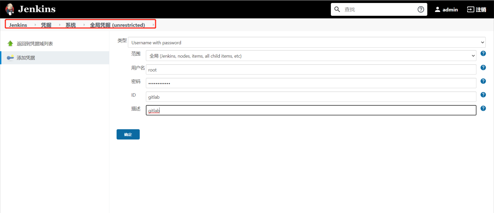

**系统配置里面配置共享库**

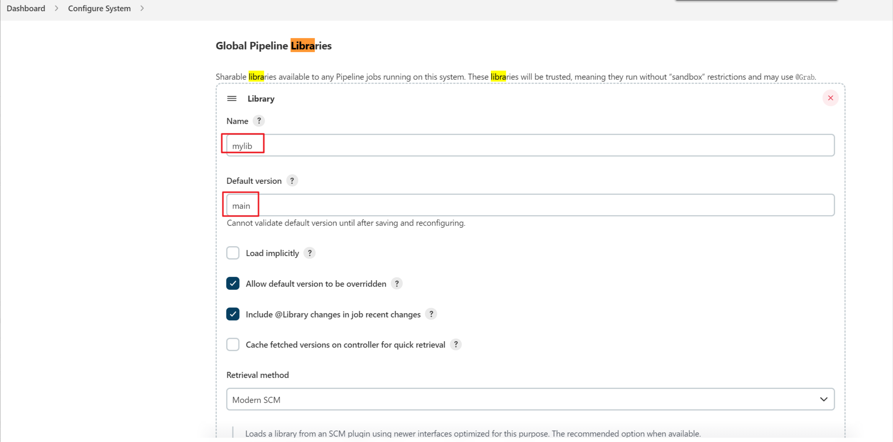

配置**共享库的仓库地址**

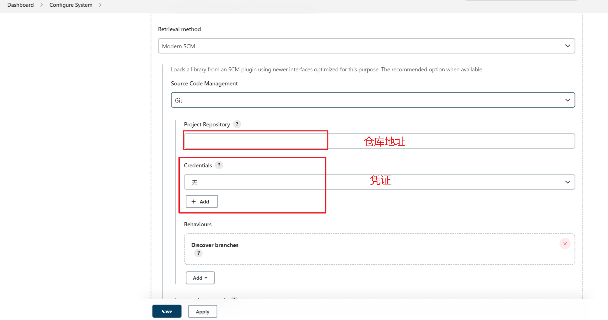

## jenkinsfile加载共享库

```groovy
//jenkinsfile加载上面的mylib共享库
@Libary('mylib') _

// 加载mylib共享库标签(tag)为1.0的版本（@后可以是一个标签（tag）、分支（branch）或提交（commit）的哈希值）
@Libary('mylib@1.0') _ 

// 加载多个共享库：mylib共享库的默认版本，yourlib共享库标签(tag)2.0版本，herlib共享库的release分支
@Libary(['mylib','yourlib@2.0','herlib@release']) _


// 应用共享库中的方法
def tools = new org.devops.tools()
```

**jenkinsfile文件示例:**

```groovy
def labels = "slave-${UUID.randomUUID().toString()}"
// 引用共享库
@Library("jenkins_shareLibrary")

// 应用共享库中的方法
def tools = new org.devops.tools()

pipeline {
    agent {
    kubernetes {
		any
  }
    stages {
        stage('Checkout') {
            steps {
                script{
                	tools.PrintMes("拉代码","green")
                }
            }
        }
        stage('Build') {
            steps {
                container('maven') {
                    script{
                		tools.PrintMes("编译打包","green")
                	}
                }
            }
        }
        stage('Make Image') {
            steps {
                container('docker') {
                    script{
                		tools.PrintMes("构建镜像","green")
                    }
                }
            }
        }
    }
}
```


