+++
title = "基于jenkins+ArgoCD实现Devops"
date = "2026-05-28T00:01:08+08:00"
draft = false
+++

## Jenkins上安装插件

- kubernetes
- AnsiColor
- HTTP Request
- SonarQube Scanner
- Utility Steps
- Email Extension Template
- Gitlab Hook
- Gitlab

## 配置Kubernetes集群信息

在系统管理-->系统配置-->cloud

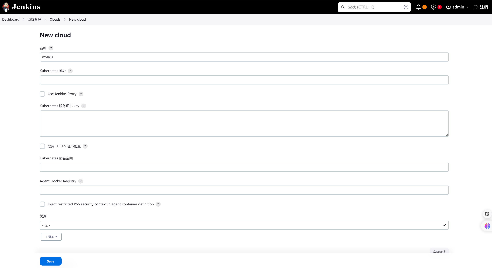

## 配置邮箱地址

系统设置-->系统配置-->Email

（1）设置管理员邮箱

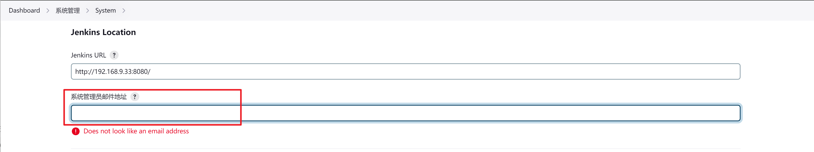

配置SMTP服务

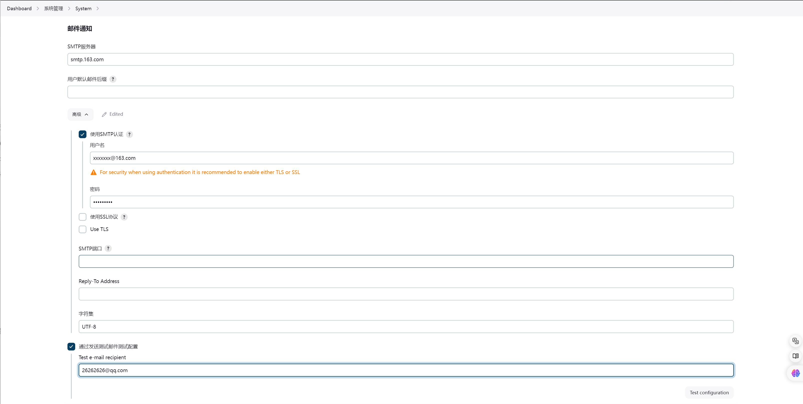

## 创建一个共享库

首先在gitlab上创建一个共享库，这里取名叫shareLibrary，如下：

包含有src/org/devops目录

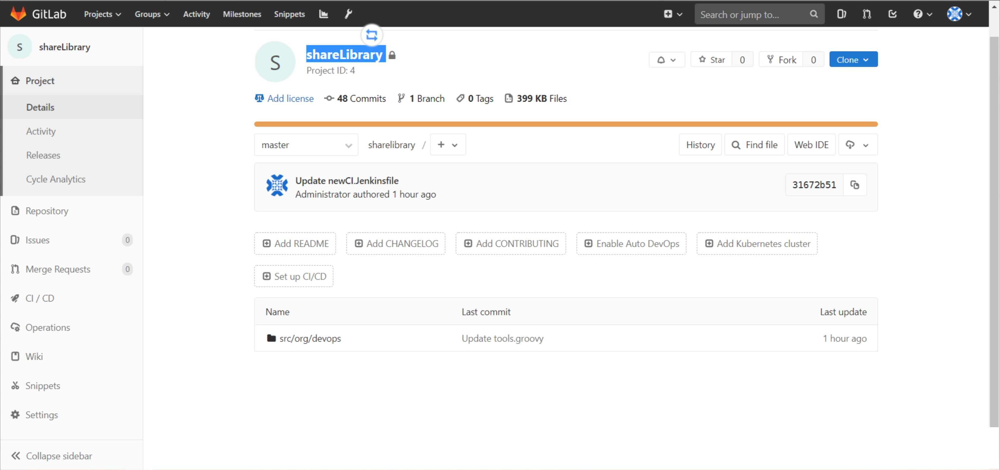

然后在该目录下创建一下groovy文件

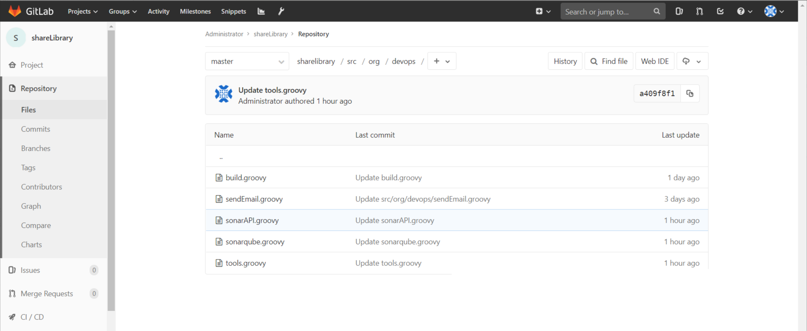

内容分别如下：

### build.groovy

build.groovy

```groovy
package org.devops

// docker容器直接build
def DockerBuild(buildShell){
    sh """
        ${buildShell}
    """
}
```

### sendEmail.groovy

sendEmail.groovy

```groovy
package org.devops

//定义邮件内容
def SendEmail(status,emailUser){
    emailext body: """
            <!DOCTYPE html> 
            <html> 
            <head> 
            <meta charset="UTF-8"> 
            </head> 
            <body leftmargin="8" marginwidth="0" topmargin="8" marginheight="4" offset="0"> 
                <table width="95%" cellpadding="0" cellspacing="0" style="font-size: 11pt; font-family: Tahoma, Arial, Helvetica, sans-serif">   
                <tr>
		            本邮件由系统自动发出，无需回复！<br/>
		            各位同事，大家好，以下为${JOB_NAME}项目构建信息</br>
		            <td><font color="#CC0000">构建结果 - ${status}</font></td>
		        </tr>

                    <tr> 
                        <td><br /> 
                            <b><font color="#0B610B">构建信息</font></b> 
                        </td> 
                    </tr> 
                    <tr> 
                        <td> 
                            <ul> 
                                <li>项目名称：${JOB_NAME}</li>         
                                <li>构建编号：${BUILD_ID}</li> 
                                <li>构建状态: ${status} </li>                         
                                <li>项目地址：<a href="${BUILD_URL}">${BUILD_URL}</a></li>    
                                <li>构建日志：<a href="${BUILD_URL}console">${BUILD_URL}console</a></li>   
                            </ul> 
                        </td> 
                    </tr> 
                    <tr>  
                </table> 
            </body> 
            </html>  """,
            subject: "Jenkins-${JOB_NAME}项目构建信息 ",
            to: emailUser
        
}
```

### sonarAPI.groovy

sonarAPI.groovy

```groovy
package ore.devops

// 封装HTTP请求
def HttpReq(requestType,requestUrl,requestBody){
    // 定义sonar api接口
    def sonarServer = "http://sonar.devops.svc.cluster.local:9000/api"
    result = httpRequest authentication: 'sonar-admin-user',    // 管理sonarqube的用户名和密码凭证
            httpMode: requestType,
            contentType: "APPLICATION_JSON",
            consoleLogResponseBody: true,
            ignoreSslErrors: true,
            requestBody: requestBody,
            url: "${sonarServer}/${requestUrl}"
    return result
}

// 获取soanr项目的状态
def GetSonarStatus(projectName){
    def apiUrl = "project_branches/list?project=${projectName}"
    // 发请求
    response = HttpReq("GET",apiUrl,"")
    // 对返回的文本做JSON解析
    response = readJSON text: """${response.content}"""
    // 获取状态值
    result = response["branches"][0]["status"]["qualityGateStatus"]
    return result
}

// 获取sonar项目，判断项目是否存在
def SearchProject(projectName){
    def apiUrl = "projects/search?projects=${projectName}"
    // 发请求
    response = HttpReq("GET",apiUrl,"")
    println "搜索的结果：${response}"
    // 对返回的文本做JSON解析
    response = readJSON text: """${response.content}"""
    // 获取total字段，该字段如果是0则表示项目不存在,否则表示项目存在
    result = response["paging"]["total"]
    // 对result进行判断
    if (result.toString() == "0"){
        return "false"
    }else{
        return "true"
    }
}

// 创建sonar项目
def CreateProject(projectName){
    def apiUrl = "projects/create?name=${projectName}&project=${projectName}"
    // 发请求
    response = HttpReq("POST",apiUrl,"")
    println(response)
}

// 配置项目质量规则
def ConfigQualityProfiles(projectName,lang,qpname){
    def apiUrl = "qualityprofiles/add_project?language=${lang}&project=${projectName}&qualityProfile=${qpname}"
    // 发请求
    response = HttpReq("POST",apiUrl,"")
    println(response)
}

// 获取质量阈ID
def GetQualityGateId(gateName){
    def apiUrl = "qualitygates/show?name=${gateName}"
    // 发请求
    response = HttpReq("GET",apiUrl,"")
    // 对返回的文本做JSON解析
    response = readJSON text: """${response.content}"""
    // 获取total字段，该字段如果是0则表示项目不存在,否则表示项目存在
    result = response["id"]
    return result
}

// 更新质量阈规则
def ConfigQualityGate(projectKey,gateName){
    // 获取质量阈id
    gateId = GetQualityGateId(gateName)
    apiUrl = "qualitygates/select?projectKey=${projectKey}&gateId=${gateId}"
    // 发请求
    response = HttpReq("POST",apiUrl,"")
    println(response)
}

//获取Sonar质量阈状态
def GetProjectStatus(projectName){
    apiUrl = "project_branches/list?project=${projectName}"
    response = HttpReq("GET",apiUrl,'')
    
    response = readJSON text: """${response.content}"""
    result = response["branches"][0]["status"]["qualityGateStatus"]
    
    //println(response)
    
   return result
}
```

### sonarqube.groovy

sonarqube.groovy

```groovy
package ore.devops

def SonarScan(projectName,projectDesc,projectPath){
    // sonarScanner安装地址
    def sonarHome = "/opt/sonar-scanner"
    // sonarqube服务端地址
    def sonarServer = "http://sonar.devops.svc.cluster.local:9000/"
    // 以时间戳为版本
    def scanTime = sh returnStdout: true, script: 'date +%Y%m%d%H%m%S'
    scanTime = scanTime - "\n"
    sh """
    ${sonarHome}/bin/sonar-scanner  -Dsonar.host.url=${sonarServer}  \
    -Dsonar.projectKey=${projectName}  \
    -Dsonar.projectName=${projectName}  \
    -Dsonar.projectVersion=${scanTime} \
    -Dsonar.login=admin \
    -Dsonar.password=admin \
    -Dsonar.ws.timeout=30 \
    -Dsonar.projectDescription="${projectDesc}"  \
    -Dsonar.links.homepage=http://www.baidu.com \
    -Dsonar.sources=${projectPath} \
    -Dsonar.sourceEncoding=UTF-8 \
    -Dsonar.java.binaries=target/classes \
    -Dsonar.java.test.binaries=target/test-classes \
    -Dsonar.java.surefire.report=target/surefire-reports -X 

    echo "${projectName}  scan success!"
    """
}
```

tools.groovy

```groovy
package org.devops

//格式化输出
def PrintMes(value,color){
    colors = ['red'   : "\033[40;31m >>>>>>>>>>>${value}<<<<<<<<<<< \033[0m",
              'blue'  : "\033[47;34m ${value} \033[0m",
              'green' : ">>>>>>>>>>${value}>>>>>>>>>>",
              'green1' : "\033[40;32m >>>>>>>>>>>${value}<<<<<<<<<<< \033[0m" ]
    ansiColor('xterm') {
        println(colors[color])
    }
}


// 获取镜像版本
def createVersion() {
	// 定义一个版本号作为当次构建的版本，输出结果 20191210175842_69
    return new Date().format('yyyyMMddHHmmss') + "_${env.BUILD_ID}"
}


// 获取时间
def getTime() {
	// 定义一个版本号作为当次构建的版本，输出结果 20191210175842
    return new Date().format('yyyyMMddHHmmss')
}
```

## Jenkins上配置共享库

（1）需要在Jenkins上添加凭证

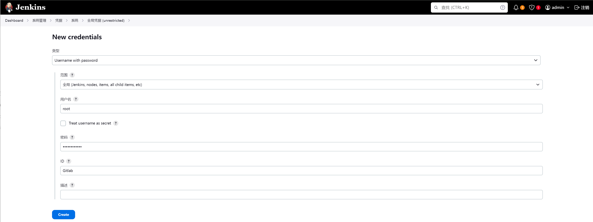

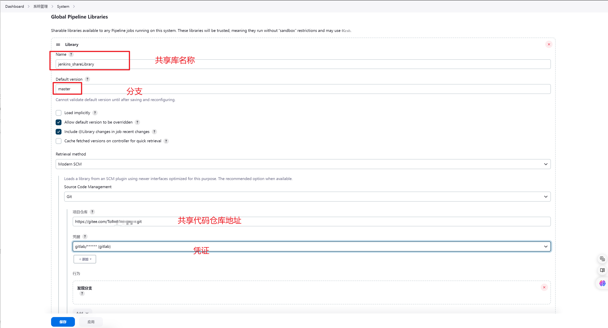

## Gitlab创建YAML管理仓库

创建一个叫devops-cd的共享仓库，用来管理应用的yaml资源文件，然后以应用名创建一个目录，并在目录下创建以下几个文件。如下：

这些是创建应用的k8s应用的资源文件，并包含有kustomization.yaml，使用kustomize工具来对资源文件进行管理

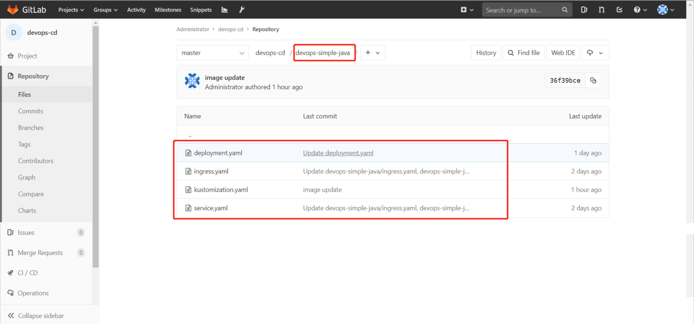

内容分别如下：

- deployment.yaml

```yaml
apiVersion: apps/v1
kind: Deployment
metadata:
  name: the-deployment
  namespace: default
spec:
  replicas: 3
  selector:
    matchLabels:
      deployment: hello
  template:
    metadata:
      labels:
        deployment: hello
    spec:
      containers:
        - args:
            - -jar
            - /opt/myapp.jar
            - --server.port=8080
          command:
            - java
          env:
            - name: HOST_IP
              valueFrom:
                fieldRef:
                  apiVersion: v1
                  fieldPath: status.hostIP
          image: registry.cn-hangzhou.aliyuncs.com/rookieops/myapp:latest
          imagePullPolicy: IfNotPresent
          lifecycle:
            preStop:
              exec:
                command:
                  - /bin/sh
                  - -c
                  - /bin/sleep 30
          livenessProbe:
            failureThreshold: 3
            httpGet:
              path: /hello
              port: 8080
              scheme: HTTP
            initialDelaySeconds: 60
            periodSeconds: 15
            successThreshold: 1
            timeoutSeconds: 1
          name: myapp
          ports:
            - containerPort: 8080
              name: http
              protocol: TCP
          readinessProbe:
            failureThreshold: 3
            httpGet:
              path: /hello
              port: 8080
              scheme: HTTP
            periodSeconds: 15
            successThreshold: 1
            timeoutSeconds: 1
          resources:
            limits:
              cpu: "1"
              memory: 2Gi
            requests:
              cpu: 100m
              memory: 1Gi
          terminationMessagePath: /dev/termination-log
          terminationMessagePolicy: File
      dnsPolicy: ClusterFirstWithHostNet
      imagePullSecrets:
        - name: gitlab-registry
```

- service.yaml

```yaml
kind: Service
apiVersion: v1
metadata:
  name: the-service
  namespace: default
spec:
  selector:
    deployment: hello
  type: NodePort
  ports:
  - protocol: TCP
    port: 8080
    targetPort: 8080
```

- ingress.ymal

```yaml
apiVersion: extensions/v1beta1
kind: Ingress
metadata:
  name: the-ingress 
  namespace: default
spec:
  rules:
    - host: test.coolops.cn 
      http:
        paths:
          - backend:
              serviceName: the-service 
              servicePort: 8080 
            path: /
```

- kustomization.yaml

```yaml
# Example configuration for the webserver
# at https://github.com/monopole/hello
apiVersion: kustomize.config.k8s.io/v1beta1
kind: Kustomization

resources:
- deployment.yaml
- service.yaml
- ingress.yaml

commonLabels:
  app: myapp			# 添加标签

images:					# 更改镜像
- name: registry.cn-hangzhou.aliyuncs.com/rookieops/myapp			
  newTag: "20201127150733_70"
namespace: dev
```

## 编写Jenkinsfile

共享仓库的根目录下创建一个java.Jenkinsfile文件，整个java的Jenkinsfile如下：

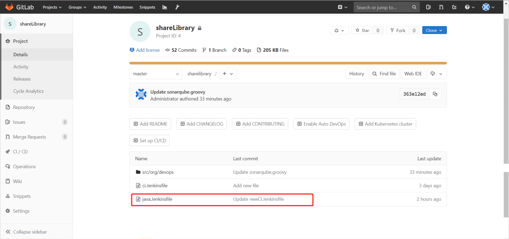

dockerhub是登录镜像仓库的用户名和密码。

ci-devops是管理YAML仓库的用户名和密码。

sonar-admin-user是管理sonarqube的用户名和密码。

```groovy
def labels = "slave-${UUID.randomUUID().toString()}"

// 引用共享库
@Library("jenkins_shareLibrary")

// 应用共享库中的方法
def tools = new org.devops.tools()
def sonarapi = new org.devops.sonarAPI()
def sendEmail = new org.devops.sendEmail()
def build = new org.devops.build()
def sonar = new org.devops.sonarqube()

// 前端传来的变量，在创建jenkins流水线项目的时候传入变量
def gitBranch = env.branch
def gitUrl = env.git_url
def buildShell = env.build_shell
def image = env.image
def dockerRegistryUrl = env.dockerRegistryUrl
def devops_cd_git = env.devops_cd_git
def toEmailUser = env.toEmailUser

pipeline {
    agent {
    kubernetes {          // 使用k8s启一个jenkins的pod进行执行任务
        label labels
      yaml """
apiVersion: v1
kind: Pod
metadata:
  labels:
    some-label: some-label-value
spec:
  volumes:
  - name: docker-sock
    hostPath:
      path: /var/run/docker.sock
      type: ''
  - name: maven-cache
    persistentVolumeClaim:
      claimName: maven-cache-pvc
  containers:
  - name: jnlp
    image: registry.cn-hangzhou.aliyuncs.com/rookieops/inbound-agent:4.3-4
  - name: maven
    image: registry.cn-hangzhou.aliyuncs.com/rookieops/maven:3.5.0-alpine
    command:
    - cat
    tty: true
    volumeMounts:
    - name: maven-cache
      mountPath: /root/.m2
  - name: docker
    image: registry.cn-hangzhou.aliyuncs.com/rookieops/docker:19.03.11
    command:
    - cat
    tty: true
    volumeMounts:
    - name: docker-sock
      mountPath: /var/run/docker.sock
  - name: sonar-scanner
    image: registry.cn-hangzhou.aliyuncs.com/rookieops/sonar-scanner:latest
    command:
    - cat
    tty: true
  - name: kustomize
    image: registry.cn-hangzhou.aliyuncs.com/rookieops/kustomize:v3.8.1
    command:
    - cat
    tty: true
"""
    }
  }

    environment{
        auth = 'joker'
    }

    options {
		timestamps()	// 日志会有时间
		skipDefaultCheckout()	// 删除隐式checkout scm语句
		disableConcurrentBuilds()	//禁止并行
		timeout(time:1,unit:'HOURS') //设置流水线超时时间
	}


    stages {
        // 拉取代码
        stage('GetCode') {
            steps {
                checkout([$class: 'GitSCM', branches: [[name: "${gitBranch}"]],
                    doGenerateSubmoduleConfigurations: false,
                    extensions: [],
                    submoduleCfg: [],
                    userRemoteConfigs: [[credentialsId: '83d2e934-75c9-48fe-9703-b48e2feff4d8', url: "${gitUrl}"]]])
                }
            }

        // 单元测试和编译打包
        stage('Build&Test') {
            steps {
                container('maven') {
                    script{
                        tools.PrintMes("编译打包","blue")
                        build.DockerBuild("${buildShell}")
                    }
                }
            }
        }
        // 代码扫描
        stage('CodeScanner') {
            steps {
                container('sonar-scanner') {
                    script {
                        tools.PrintMes("代码扫描","green")
                        tools.PrintMes("搜索项目","green")
                        result = sonarapi.SearchProject("${JOB_NAME}")
                        println(result)

                        if (result == "false"){
                            println("${JOB_NAME}---项目不存在,准备创建项目---> ${JOB_NAME}！")
                            sonarapi.CreateProject("${JOB_NAME}")
                        } else {
                            println("${JOB_NAME}---项目已存在！")
                        }

                        tools.PrintMes("代码扫描","green")
                        sonar.SonarScan("${JOB_NAME}","${JOB_NAME}","src")

                        sleep 10
                        tools.PrintMes("获取扫描结果","green")
                        result = sonarapi.GetProjectStatus("${JOB_NAME}")

                        println(result)
                        if (result.toString() == "ERROR"){
                            toemail.Email("代码质量阈错误！请及时修复！",userEmail)
                            error " 代码质量阈错误！请及时修复！"

                        } else {
                            println(result)
                        }
                    }
                }
            }
        }
        // 构建镜像
        stage('BuildImage') {
            steps {
                withCredentials([[$class: 'UsernamePasswordMultiBinding',
                credentialsId: 'dockerhub',       // dockerhub的凭证（用户名/密码）
                usernameVariable: 'DOCKER_HUB_USER',
                passwordVariable: 'DOCKER_HUB_PASSWORD']]) {
                    container('docker') {
                        script{
                            tools.PrintMes("构建镜像","green")
                            imageTag = tools.createVersion()
                            sh """
                            docker login ${dockerRegistryUrl} -u ${DOCKER_HUB_USER} -p ${DOCKER_HUB_PASSWORD}
                            docker build -t ${image}:${imageTag} .
                            docker push ${image}:${imageTag}
                            docker rmi ${image}:${imageTag}
                            """
                        }
                    }
                }
            }
        }
        // 部署，先更改yaml资源文件配置然后提交至yaml仓库目录
        stage('Deploy') {
            steps {
                 withCredentials([[$class: 'UsernamePasswordMultiBinding',
                credentialsId: 'ci-devops',				// 管理YAML仓库的凭证（用户名/密码）
                usernameVariable: 'DEVOPS_USER',
                passwordVariable: 'DEVOPS_PASSWORD']]){
                    container('kustomize') {
                        script{
                            APP_DIR="${JOB_NAME}".split("_")[0]
                            sh """
                            git remote set-url origin http://${DEVOPS_USER}:${DEVOPS_PASSWORD}@${devops_cd_git}
                            git config --global user.name "Administrator"
                            git config --global user.email "coolops@163.com"
                            git clone http://${DEVOPS_USER}:${DEVOPS_PASSWORD}@${devops_cd_git} /opt/devops-cd
                            cd /opt/devops-cd
                            git pull
                            cd /opt/devops-cd/${APP_DIR}
                            kustomize edit set image ${image}:${imageTag}	// 更改yaml文件的镜像
                            git commit -am 'image update'
                            git push origin master
                            """
                        }
                    }
                }
            }
        }
        // 接口测试
        stage('InterfaceTest') {
            steps{
                sh 'echo "接口测试"'
            }
        }
    }
    // 构建后的操作
	post {
		success {
			script{
				println("success:只有构建成功才会执行")
				currentBuild.description += "\n构建成功！"
				// deploy.AnsibleDeploy("${deployHosts}","-m ping")
				sendEmail.SendEmail("构建成功",toEmailUser)
				// dingmes.SendDingTalk("构建成功 ✅")
			}
		}
		failure {
			script{
				println("failure:只有构建失败才会执行")
				currentBuild.description += "\n构建失败!"
				sendEmail.SendEmail("构建失败",toEmailUser)
				// dingmes.SendDingTalk("构建失败 ❌")
			}
		}
		aborted {
			script{
				println("aborted:只有取消构建才会执行")
				currentBuild.description += "\n构建取消!"
				sendEmail.SendEmail("取消构建",toEmailUser)
				// dingmes.SendDingTalk("构建失败 ❌","暂停或中断")
			}
		}
	}
}

```

## 在Jenkins上配置项目

在Jenkins上新建一个流水线项目

然后添加以下参数化构建，对应jenkinsfile文件中的变量。

```bash
git_url					# 代码仓库地址
branch             	  	# 代码分支
build_shell				# 镜像构建命令
image					# 镜像
dockerRegistryUrl		# 镜像仓库地址
devops_cd_git			# yaml资源的仓库地址
toEmailUser				# 目标邮箱
```

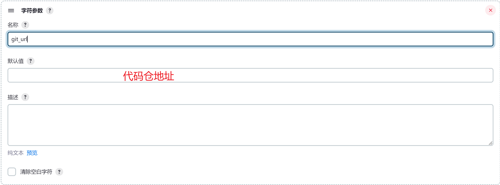

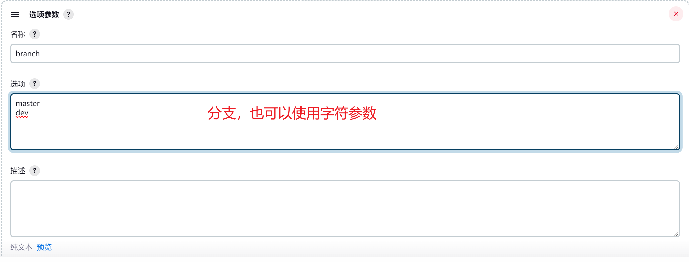

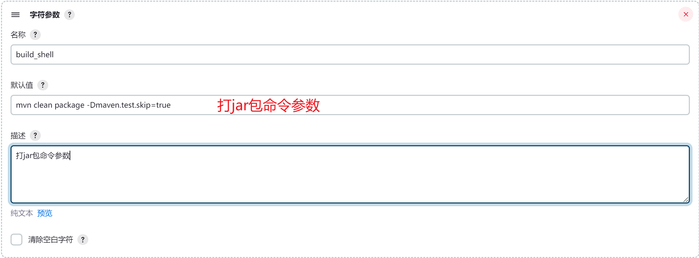

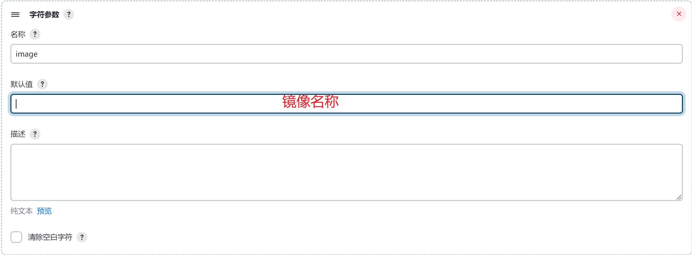

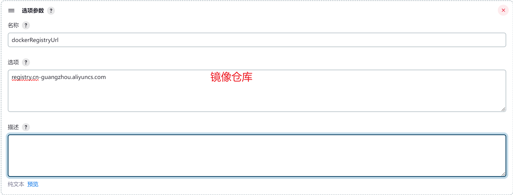

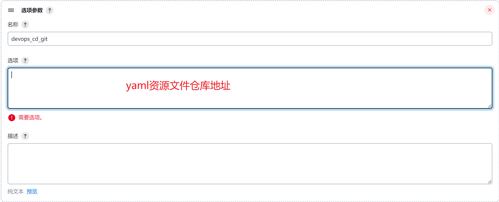

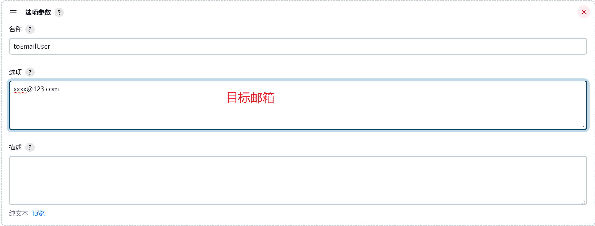

然后在流水线处配置Pipeline from SCM


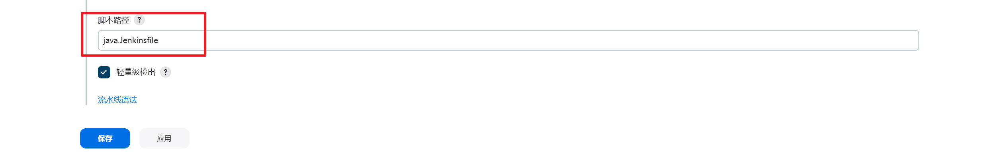

## 在Argocd上配置CD流程

在argocd上添加代码仓库，如下：

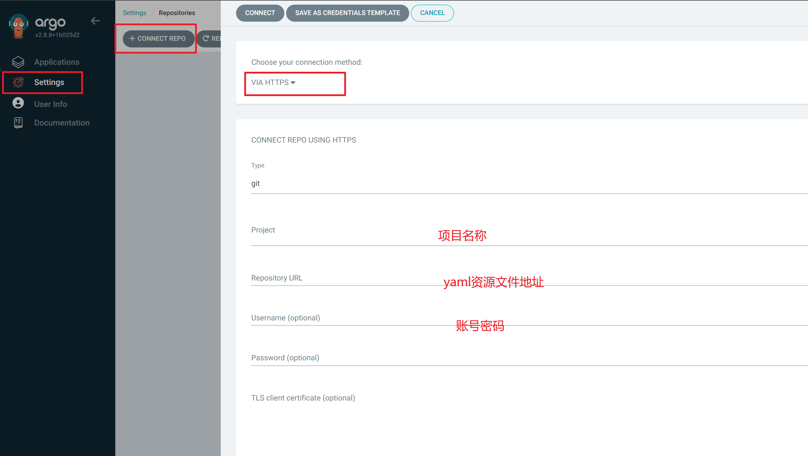

创建应用

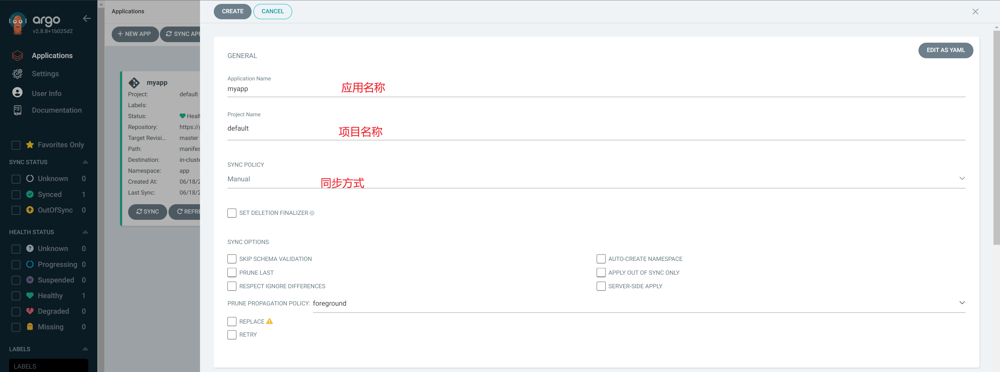

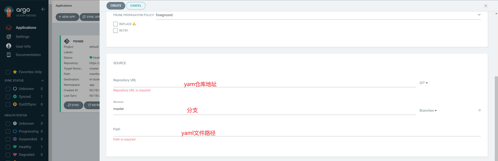

点击创建后，就点击`SYNC`触发同步，进行部署了

