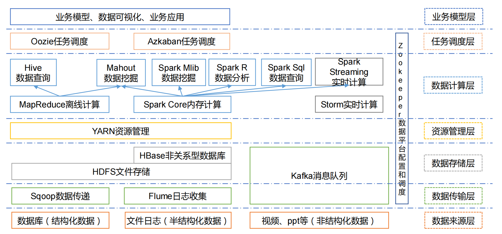
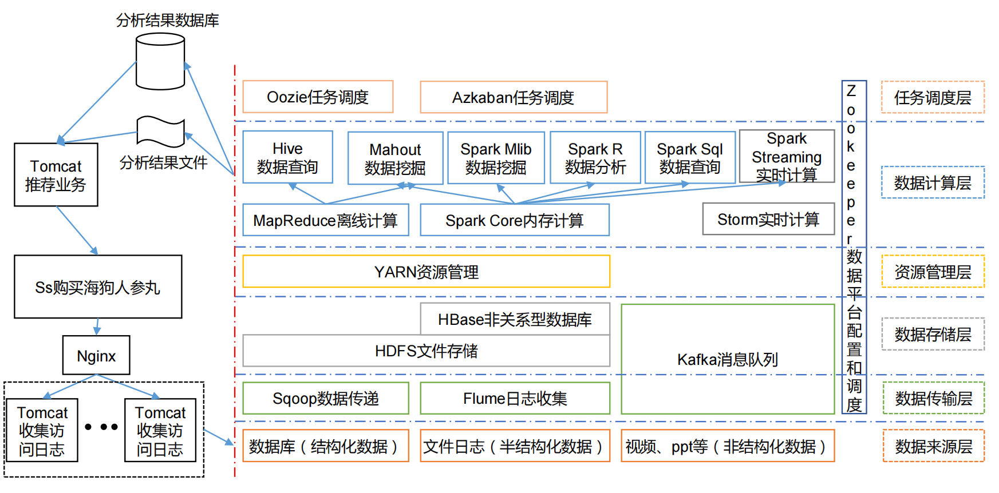
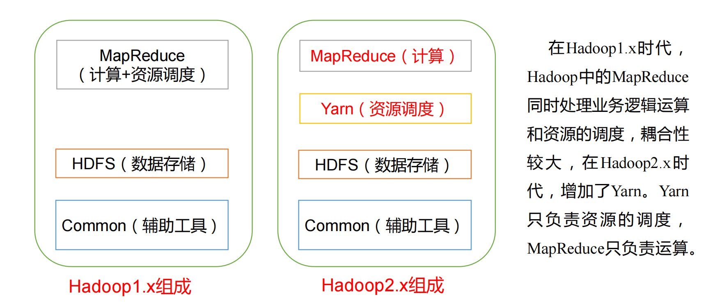
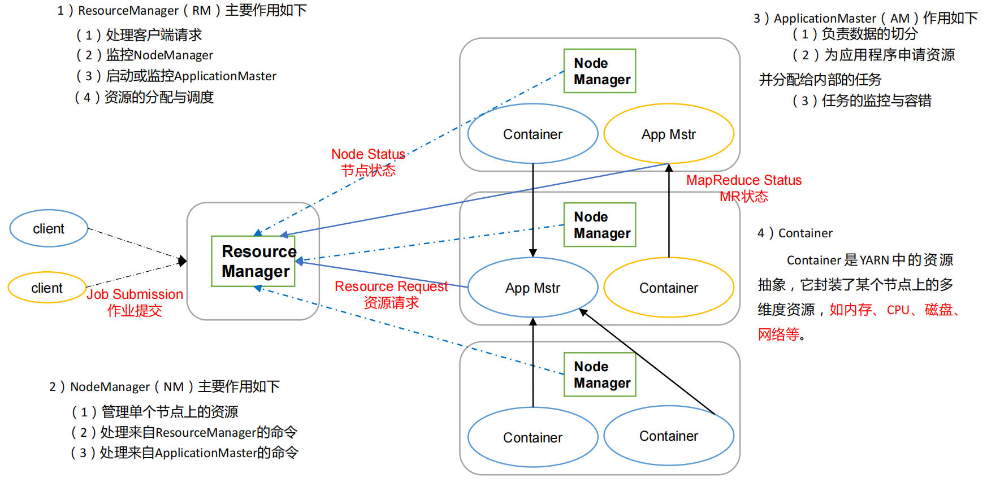
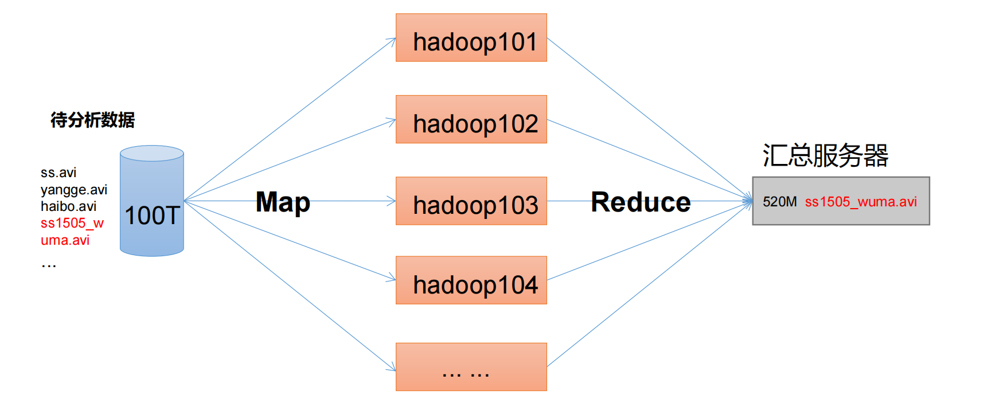

+++
title = "Hadooop"
date = "2026-05-28T00:01:08+08:00"
draft = false
+++

# 大数据技术栈



**1）Sqoop：**Sqoop 是一款开源的工具，主要用于在 Hadoop、Hive 与传统的数据库(MySql)间进行数据的传递，可以将一个关系型数据库（例如 ：MySQL，Oracle 等）中的数据导进到Hadoop 的 HDFS 中，也可以将 HDFS 的数据导进到关系型数据库中。

**2）Flume：**Flume 是 Cloudera 提供的一个高可用的，高可靠的，分布式的海量日志采集、聚合和传输的系统，Flume 支持在日志系统中定制各类数据发送方，用于收集数据；同时，Flume提供对数据进行简单处理，并写到各种数据接受方（可定制）的能力。

**3）Kafka：**Kafka 是一种高吞吐量的分布式发布订阅消息系统，有如下特性：

​	（1）通过 O(1)的磁盘数据结构提供消息的持久化，这种结构对于即使数以 TB 的消息存储也能够保持长时间的稳定性能。

​	（2）高吞吐量：即使是非常普通的硬件 Kafka 也可以支持每秒数百万的消息。

​	（3）支持通过 Kafka 服务器和消费机集群来分区消息。

​	（4）支持 Hadoop 并行数据加载。

**4）Storm：**Storm 用于“连续计算”，对数据流做连续查询，在计算时就将结果以流的形式输出给用户。

**5）Spark：**Spark 是当前最流行的开源大数据内存计算框架。可以基于 Hadoop 上存储的大数据进行计算。

**6）Oozie：**Oozie 是一个管理 Hdoop 作业（job）的工作流程调度管理系统。

**7）Hbase：**HBase 是一个分布式的、面向列的开源数据库。HBase 不同于一般的关系数据库，它是一个适合于非结构化数据存储的数据库。

**8）Hive：**Hive 是基于 Hadoop 的一个数据仓库工具，可以将结构化的数据文件映射为一张数据库表，并提供简单的 SQL 查询功能，可以将 SQL 语句转换为 MapReduce 任务进行运行。 其优点是学习成本低，可以通过类 SQL 语句快速实现简单的 MapReduce 统计，不必

开发专门的 MapReduce 应用，十分适合数据仓库的统计分析。

**10）R 语言：**R 是用于统计分析、绘图的语言和操作环境。R 是属于 GNU 系统的一个自由、免费、源代码开放的软件，它是一个用于统计计算和统计制图的优秀工具。

**11）Mahout：**Apache Mahout 是个可扩展的机器学习和数据挖掘库。

**12）ZooKeeper：**Zookeeper 是 Google 的 Chubby 一个开源的实现。它是一个针对大型分布式系统的可靠协调系统，提供的功能包括：配置维护、名字服务、 分布式同步、组服务等。ZooKeeper 的目标就是封装好复杂易出错的关键服务，将简单易用的接口和性能高效、功能稳定的系统提供给用户。


**项目框架实例：**




# Hadoop介绍

**Hadoop 三大发行版本：**

Hadoop 官方网站：http://hadoop.apache.org/

​	**Apache** ：版本最原始（最基础）的版本，对于入门学习最好。

​		官网地址：http://hadoop.apache.org/releases.html

​		下载地址：https://archive.apache.org/dist/hadoop/common/

​	**Cloudera** ：在大型互联网企业中用的较多。

​	CDH 是 Cloudera 的 Hadoop 发行版，完全开源，比 Apache Hadoop 在兼容性，安全性，稳定性上有所增强。

​	Cloudera Manager 是集群的软件分发及管理监控平台，可以在几个小时内部署好一个 Hadoop 集群，并对集群的节点及服务进行实时监控。Cloudera Support 即是对 Hadoop 的技术支持。

​	Cloudera 的标价为每年每个节点 4000 美元。Cloudera 开发并贡献了可实时处理大数据的 Impala 项目。

​		官网地址：https://www.cloudera.com/downloads/cdh/5-10-0.html

​		下载地址：http://archive-primary.cloudera.com/cdh5/cdh/5/

​	**Hortonworks**： 文档较好。

​	Hortonworks 的主打产品是 Hortonworks Data Platform（HDP），也同样是 100%开源的产品，HDP 除常见的项目外还包括了 Ambari，一款开源的安装和管理系统。

​	HCatalog，一个元数据管理系统，HCatalog 现已集成到 Facebook 开源的 Hive 中。Hortonworks 的 Stinger 开创性的极大的优化了 Hive 项目。Hortonworks 为入门提供了一个非常好的，易于使用的沙盒。

​	Hortonworks 开发了很多增强特性并提交至核心主干，这使得 Apache Hadoop 能够在包括 Window Server 和 Windows Azure 在内的 Microsoft Windows 平台上本地运行。定价

以集群为基础，每 10 个节点每年为 12500 美元。


## Hadoop优势

​	1）高可靠性：Hadoop底层维护多个数据副本，所以即使Hadoop某个计算元素或存储出现故障，也不会导致数据的丢失。

​	2）高扩展性：在集群间分配任务数据，可方便的扩展数以千计的节点。

​	3）高效性：在MapReduce的思想下，Hadoop是并行工作的，以加快任务处理速度。

​	4）高容错性：能够自动将失败的任务重新分配。

## Hadoop组成




### HDFS

HDFS（Hadoop Distributed File System）架构概述：

​	1）NameNode（nn）：存储文件的元数据，如文件名，文件目录结构，文件属性（生成时间、副本数、

文件权限），以及每个文件的块列表和块所在的DataNode等。

​	2）DataNode(dn)：在本地文件系统存储文件块数据，以及块数据的校验和。

​	3）Secondary NameNode(2nn)：用来监控HDFS状态的辅助后台程序，每隔一段时间获取HDFS元数据的快照。

### **YARN**



###  **MapReduce**

MapReduce 将计算过程分为两个阶段：Map 和 Reduce

​	1）Map 阶段并行处理输入数据

​	2）Reduce 阶段对 Map 结果进行汇总




# Hadoop环境搭建

1、下载tar包，并解压

​	https://archive.apache.org/dist/hadoop/common/

```bash
tar -zxvf hadoop-3.2.3.tar.gz
```

依赖java环境，先安装好jdk

配置 hadoop环境变量，编辑**/etc/profile**文件

```bash
export JAVA_HOME=/opt/jdk1.8.0_281
export CLASSPATH=.:$JAVA_HOME/lib:$JAVA_HOME/jre/lib
export HADOOP_HOME=/opt/hadoop-3.2.3
export PATH=$PATH:$JAVA_HOME/bin:$JAVA_HOME/jre/bin:$HADOOP_HOME/bin:$HADOOP_HOME/sbin

export HDFS_NAMENODE_USER=root
export HDFS_DATANODE_USER=root
export HDFS_ZKFC_USER=root
export HDFS_JOURNALNODE_USER=root
export HDFS_SECONDARYNAMENODE_USER=root
export YARN_RESOURCEMANAGER_USER=root
export YARN_NODEMANAGER_USER=root

```

编辑 **hadoop/etc/hadoop/hadoop-env.sh**，配置 **JAVA_HOME**

```bash
# The java implementation to use.
export JAVA_HOME=/opt/jdk1.8.0_281

```

测试hadoop是否安装成功

```bash
hadoop version

```

**hadoop目录结构**

（1）bin 目录：存放对 Hadoop 相关服务（HDFS,YARN）进行操作的脚本

（2）etc 目录：Hadoop 的配置文件目录，存放 Hadoop 的配置文件

（3）lib 目录：存放 Hadoop 的本地库（对数据进行压缩解压缩功能）

（4）sbin 目录：存放启动或停止 Hadoop 相关服务的脚本

（5）share 目录：存放 Hadoop 的依赖 jar 包、文档、和官方案例


## 运行模式

Hadoop 运行模式包括：本地模式、伪分布式模式以及完全分布式模式。

### 本地模式


