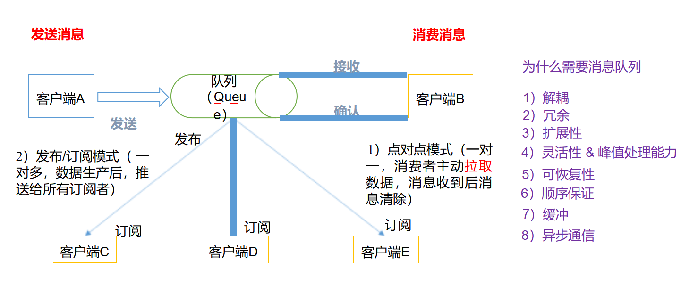
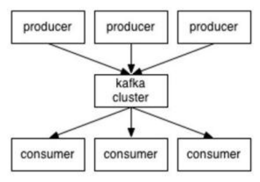
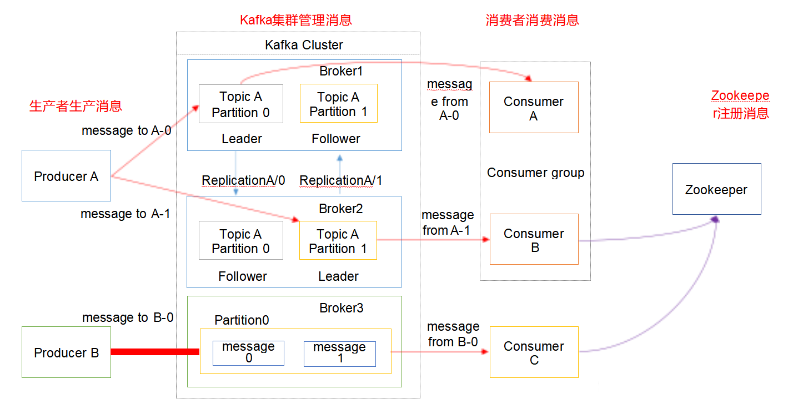
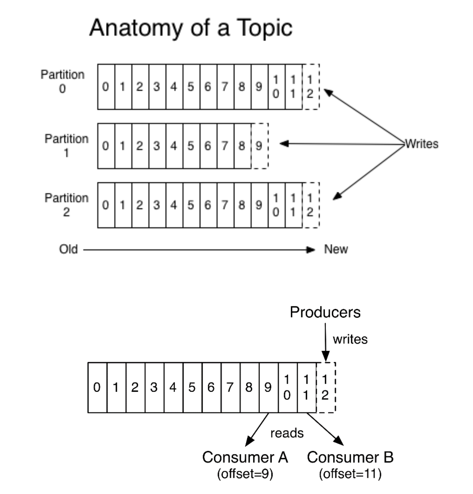
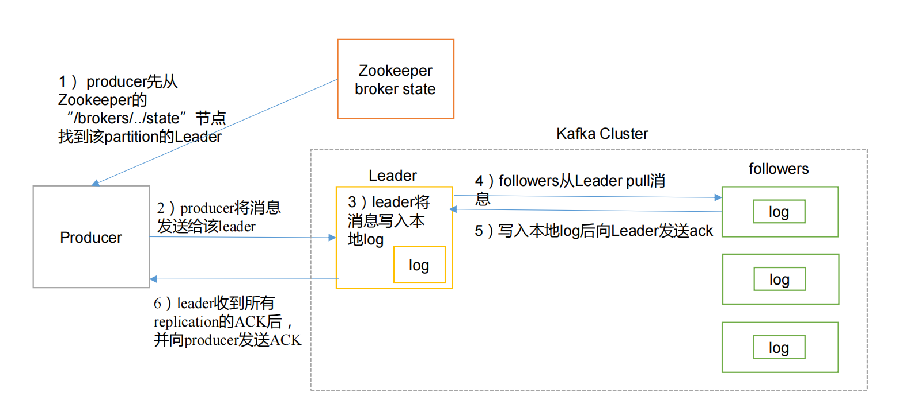
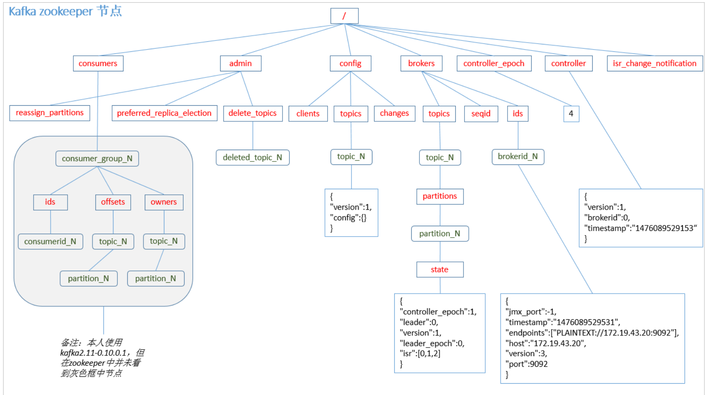
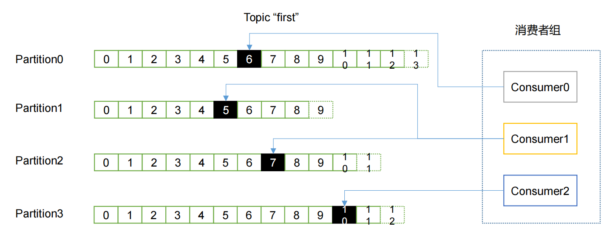

+++
title = "kafka"
date = "2026-05-28T00:01:08+08:00"
draft = false
+++

# 消息队列介绍



**（1）点对点模式（一对一，消费者主动拉取数据， 消息收到后消息清除）**

​	点对点模型通常是一个基于拉取或者轮询的消息传送模型，这种模型从队列中请求信息， 而不是将消息推送到客户端。这个模型的特点是发送到队列的消息被一个且只有一个接收者

接收处理， 即使有多个消息监听者也是如此。

**（2）发布/订阅模式（一对多， 数据生产后， 推送给所有订阅者）**

​	发布订阅模型则是一个基于推送的消息传送模型。发布订阅模型可以有多种不同的订阅 者， 临时订阅者只在主动监听主题时才接收消息， 而持久订阅者则监听主题的所有消息，即

使当前订阅者不可用，处于离线状态。


**消息队列作用：**

**1）解耦：**

​	允许你独立的扩展或修改两边的处理过程，只要确保它们遵守同样的接口约束。

**2）冗余：**

​	消息队列把数据进行持久化直到它们已经被完全处理，通过这一方式规避了数据丢失风 险。许多消息队列所采用的"插入-获取-删除"范式中，在把一个消息从队列中删除之前，需 要你的处理系统明确的指出该消息已经被处理完毕，从而确保你的数据被安全的保存直到你使用完毕。

**3）扩展性：**

​	因为消息队列解耦了你的处理过程，所以增大消息入队和处理的频率是很容易的， 只要另外增加处理过程即可。

**4）灵活性 & 峰值处理能力：**

​	在访问量剧增的情况下， 应用仍然需要继续发挥作用，但是这样的突发流量并不常见。 如果为以能处理这类峰值访问为标准来投入资源随时待命无疑是巨大的浪费。使用消息队列能够使关键组件顶住突发的访问压力，而不会因为突发的超负荷的请求而完全崩溃。

**5）可恢复性：**

​	系统的一部分组件失效时，不会影响到整个系统。消息队列降低了进程间的耦合度，所以即使一个处理消息的进程挂掉，加入队列中的消息仍然可以在系统恢复后被处理。

**6）顺序保证：**

​	在大多使用场景下， 数据处理的顺序都很重要。大部分消息队列本来就是排序的，并且能保证数据会按照特定的顺序来处理。（Kafka 保证一个 Partition 内的消息的有序性）

**7）缓冲：**

​	有助于控制和优化数据流经过系统的速度，解决生产消息和消费消息的处理速度不一致的情况。

**8）异步通信：**

​	很多时候，用户不想也不需要立即处理消息。消息队列提供了异步处理机制，允许用户 把一个消息放入队列，但并不立即处理它。想向队列中放入多少消息就放多少， 然后在需要的时候再去处理它们。


# kafka

## 介绍&架构

​	Apache  Kafka 是一个开源消息系统， 由 Scala 写成。是由 Apache 软件基金会开发的一个开源消息系统项目。Kafka 最初是由 LinkedIn  公司开发，并于 2011 年初开源。2012 年 10  月从 Apache Incubator 毕业。该项目的目标是为处理实时数据提供一个统一、高通量、低等待的平台。

​	Kafka是一个分布式消息队列。 Kafka  对消息保存时根据 Topic 进行归类，发送消息 者称为 Producer，消息接受者称为 Consumer，此外 kafka 集群有多个 kafka 实例组成，每个实例(server)称为 broker。无论是 kafka 集群， 还是 consumer 都依赖于 **zookeeper**集群保存一些 meta 信息，来保证系统可用性。

架构

​	



## **相关名词概念**

- **生产者和消费者（producer和consumer）**

​	消息的发送者叫 Producer，消息的使用者和接受者是 Consumer。生产者采用推（push）模式将消息发布到broker，每条消息都被追加（append）到分区（patition）中，属于顺序写磁盘（顺序写磁盘效率比随机写内存要高，保障kafka吞吐率）。消费者采用拉取（pull）方式获取消息并进一步处理，消费者自己记录消费状态，每个消费者互相独立地顺序读取每个分区的消息。

- **Consumer Group（CG）**

​	消费者组，由多个 consumer 组成。消费者组内每个消费者负责消费不同分区的数据，一个分区只能由一个组内消费者消费；消费者组之间互不 影响。所有的消费者都属于某个消费者组，即消费者组是逻辑上的一个订阅者。 

- **broker**

​	一台 Kafka 服务器就是一个 broker。一个集群由多个 broker 组成。一个 broker 可以容纳多个 topic。

- **主题（topic）**

​	可以理解为一个队列，生产者和消费者面向的都是一个 topic，一个 topic 里保存的是同一类消息，相当于对消息的分类，每个 producer 将消息发送到 kafka 中，都需要指明要存的 topic 是哪个，也就是指明这个消息属于哪一类。

- **分区（partition）**

​	为了实现扩展性，一个非常大的 topic 可以分布到多个 broker（即服务器）上，一个 topic 可以分为多个 partition，每个 topic 都可以分成多个 partition，每个 partition 是一个有序的队列，每个 partition 在存储层面是 append log 文件。任何发布到此 partition 的消息都会被直接追加到 log 文件的尾部。kafka基于文件进行存储，当文件内容大到一定程度时，很容易达到单个磁盘的上限，因此，采用分区的办法，一个分区对应一个文件，这样就可以将数据分别存储到不同的server上去，另外这样做也可以负载均衡，容纳更多的消费者。

- **偏移量（Offset）**

​	一个分区对应一个磁盘上的文件，而消息在文件中的位置就称为 offset（偏移量），offset 为一个 long 型数字，它可以唯一标记一条消息。由于kafka 并没有提供其他额外的索引机制来存储 offset，文件只能顺序的读写，所以在kafka中几乎不允许对消息进行“随机读写”。例如你想找位于 2049 的位置，只要找到 2048.kafka 的文件即可。当然 the first offset 就是 00000000000.kafka。

- **副本（replication）**

​	kafka 还可以配置 partitions 需要备份的个数(replicas),每个 partition 将会被备份到多台机器上,以提高可用性，备份的数量可以通过配置文件指定。同一个partition可能会有多个replication（对应 server.properties 配置中的 default.replication.factor=N）。没有replication的情况下，一旦broker 宕机，其上所有 patition 的数据都不可被消费，同时producer也不能再将数据存于其上的patition。

这种冗余备份的方式在分布式系统中是很常见的，那么既然有副本，就涉及到对同一个文件的多个备份如何进行管理和调度。kafka 采取的方案是：每个 partition 选举一个 server 作为“leader”，由 leader 负责所有对该分区的读写，其他 server 作为 follower 只需要简单的与 leader 同步，保持跟进即可。如果原来的 leader 失效，会重新选举由其他的 follower 来成为新的 leader。

至于如何选取 leader，Kafka 使用 ZK 在 Broker 中选出一个 Controller，用于 Partition 分配和 Leader 选举。另外，这里我们可以看到，实际上作为 leader 的 server 承担了该分区所有的读写请求，因此其压力是比较大的，从整体考虑，从多少个 partition 就意味着会有多少个leader，kafka 会将 leader 分散到不同的 broker 上，确保整体的负载均衡。

​	Leader：每个分区多个副本的“主”，生产者发送数据的对象，以及消费者消费数 据的对象都是 Leader。 

​	Follower：每个分区多个副本中的“从”，实时从 Leader 中同步数据，保持和 Leader 数据的同步。Leader 发生故障时，某个 Follower 会成为新的 Leader。

- **OSR（Out     of-Sync Replicas）**

即与Leader数据不一致的副本列表。

- **ISR**

​	In-sync Replicas（副本同步列表）。ISR中的副本都是与Leader数据一致的副本，不在ISR中的Follower副本是与Leader数据不一致的。Leader副本天然就在 ISR 中，但ISR不只是Follower副本集合，是一个动态调整的集合，由Leader负责维护。如果一个follower的同步时间过长（大于阈值，大概是30s），就会被ISR剔除。

- **AR（Assigned     Replicas）**

​	即已分配的副本列表，是指某个Partition的所有副本。AR = ISR + OSR

## 安装部署

### 集群安装

准备三台机器

1、安装JDK

```bash
# 三台服务都要配置
# 1 下载jdk-8u281-linux-x64
# 2 解压
tar -xf jdk-8u281-linux-x64.tar.gz -C /usr/local/ mv /usr/local/jdk-8u281-linux-x64 /usr/local/java8 

# 3 配置环境变量 
vim /etc/profile 
JAVA_HOME=/usr/local/java8 exportPATH=$JAVA_HOME/bin:$PATH
# 4 生效环境变量配置
source/etc/profile 
# 5 测试
javajava -version 

```

2、安装kafka

下载kafka_2.13-2.7.1.tgz

```bash
# 解压
tar -xf kafka_2.13-2.7.1.tgz -C /usr/local/ mv /usr/local/kafka_2.13-2.7.1 /usr/local/kafka mkdir -p /usr/local/kafka/logs  # 创建文件保存kafka日志
```

修改server.properties配置文件

```bash
vim /opt/kafka/config/server.properties
# ---------------------------------------->
# kafka1的配置如下：broker.id=0# id不能重复，必须唯一
listeners=PLAINTEXT://:9092
advertised.listeners=PLAINTEXT://kafka1:9092  # 与域名解析处相同
num.network.threads=3
num.io.threads=8
socket.send.buffer.bytes=102400
socket.receive.buffer.bytes=102400
socket.request.max.bytes=104857600
log.dirs=/usr/local/kafka/logs  # 目录必须存在
num.partitions=3
num.recovery.threads.per.data.dir=1
offsets.topic.replication.factor=1
transaction.state.log.replication.factor=1
transaction.state.log.min.isr=1
log.retention.hours=168
log.segment.bytes=1073741824
log.retention.check.interval.ms=300000
# 本文zookeeper与kafka搭在同一台服务器，域名解析相同
zookeeper.connect=kafka1:2181,kafka2:2181,kafka3:2181
# 若zookeeper与kafka分开搭建配置示例如下
# zookeeper.connect=zk01:2181,zk02:2181,zk03:2181
zookeeper.connection.timeout.ms=12000
group.initial.rebalance.delay.ms=0
group.max.session.timeout.ms=300000
group.min.session.timeout.ms=6000
auto.create.topics.enable=true
delete.topics.enable=true

# ---------------------------------------->
# kafka2的配置如下：
broker.id=1  # 注意唯一
listeners=PLAINTEXT://:9092
advertised.listeners=PLAINTEXT://kafka2:9092 # 与域名解析处相同
num.network.threads=3
num.io.threads=8
socket.send.buffer.bytes=102400
socket.receive.buffer.bytes=102400
socket.request.max.bytes=104857600
log.dirs=/usr/local/kafka/logs  # 目录必须存在
num.partitions=3
num.recovery.threads.per.data.dir=1
offsets.topic.replication.factor=1
transaction.state.log.replication.factor=1
transaction.state.log.min.isr=1
log.retention.hours=168
log.segment.bytes=1073741824
log.retention.check.interval.ms=300000
zookeeper.connect=kafka1:2181,kafka2:2181,kafka3:2181  # 配置zookeeper及端口
zookeeper.connection.timeout.ms=12000
group.initial.rebalance.delay.ms=0
group.max.session.timeout.ms=300000
group.min.session.timeout.ms=6000
auto.create.topics.enable=true
delete.topics.enable=true

# ---------------------------------------->
# kafka3的配置如下：
broker.id=2 # 注意唯一
listeners=PLAINTEXT://:9092
advertised.listeners=PLAINTEXT://kafka3:9092 # 与域名解析处相同
num.network.threads=3
num.io.threads=8
socket.send.buffer.bytes=102400
socket.receive.buffer.bytes=102400
socket.request.max.bytes=104857600
log.dirs=/usr/local/kafka/logs  # 目录必须存在
num.partitions=3
num.recovery.threads.per.data.dir=1
offsets.topic.replication.factor=1
transaction.state.log.replication.factor=1
transaction.state.log.min.isr=1
log.retention.hours=168
log.segment.bytes=1073741824
log.retention.check.interval.ms=300000
zookeeper.connect=kafka1:2181,kafka2:2181,kafka3:2181  # 配置zookeeper及端口
zookeeper.connection.timeout.ms=12000
group.initial.rebalance.delay.ms=0
group.max.session.timeout.ms=300000
group.min.session.timeout.ms=6000
auto.create.topics.enable=true
delete.topics.enable=true


##########################
# 补充kafka内网外网访问配置
# 内网监听名称，这个注释想要解开
inter.broker.listener.name=INTERNAL
 
# 内网监听规则，第一个是内网，第二个是外网，注意端口不一样，同时想要服务器入网打开9092和9094端口，端口可以自己定义
listeners=INTERNAL://127.0.0.1:9092,EXTERNAL://10.0.0.18:9094
 
# 活动监听规则，或者说开放的规则，第一个是内网，第二个是外网，10.0.0.20这个是外网ip，根据自己情况修改
advertised.listeners=INTERNAL://127.0.0.1:9092,EXTERNAL://10.0.0.18:9094
 
# 监听安全协议映射，直接翻译了，英文不好，这个很关键，可以解释上面所有的配置，这个映射内在就是对外打开的监听和内网的对应关系，可以看出最终走的还是内网监听
listener.security.protocol.map=INTERNAL:PLAINTEXT,EXTERNAL:PLAINTEXT
 
# 只能通过访问127.0.0.1:9092或者10.0.0.18:9094访问kafka
```

配置环境变量

```bash
JAVA_HOME=/usr/local/java8
ZK_HOME=/usr/local/zookeeper
KFK_HOME=/usr/local/kafka
export PATH=$JAVA_HOME/bin:$ZK_HOME/bin:$KFK_HOME/bin:$PATH

```

启动

```bash
启动kafka
kafka-server-start.sh -daemon /usr/local/kafka/config/server.properties
# 检查java进程
ps -ef | grep kafka

# 检查端口
netstat -antp |grep 9092

# 停止kafka
kafka-server-stop.sh

# 6 systemd管理kafka
# vim /etc/systemd/system/kafka.service
[Unit]
Description=kafka server
Requires=zookeeper.service
After=zookeeper.service

[Service]
Type=simple
User=root
Environment=JAVA_HOME=/usr/local/java
ExecStart=/bin/sh -c '/usr/local/kafka/bin/kafka-server-start.sh /usr/local/kafka/config/server.properties'
ExecStop=/bin/sh -c '/usr/local/kafka/bin/kafka-server-stop.sh'
Restart=on-failure
RestartSec=2s
SuccessExitStatus=0  143
[Install]
WantedBy=multi-user.target

# :wq 保存退出 
```

```bash
# 验证操作,注意操作前必须先停止已经启动的kafka
systemctl daemon-reload
systemctl enable kafka.service 
systemctl start kafka.service 
systemctl status kafka.service
 
```


### 命令操作

```bash
# cd /usr/local/kafka/bin

# 1 创建带分区副本的主题topic
	kafka-topics.sh --bootstrap-server 10.0.0.14:9092 --create --topic test2021 --partitions 2 --replication-factor 3
# 也可以：--broker-list 10.14.1.162:9093,10.14.3.156:9093,10.14.0.151:9093

# 2 查看当前服务有多少主题
	kafka-topics.sh --zookeeper kafka1:2181 --list

	# 2.1 查询所有Topic列表
		kafka-topics.sh --bootstrap-server kafka1:9092 --list --exclude-internal
	
	# 2.2 查询匹配Topic列表(正则表达式)
		kafka-topics.sh --bootstrap-server kafka1:9092 --list --exclude-internal --topic "test2021.*"


# 3 查看主题
	# 3.1 查看单个主题topic详细信息
		kafka-topics.sh --bootstrap-server 10.0.0.14:9092 --describe --topic test2021
		Topic: test2021 PartitionCount: 2       ReplicationFactor: 3    Configs: segment.bytes=1073741824
	        Topic: test2021 Partition: 0    Leader: 1       Replicas: 1,0,2 Isr: 1,0,2
	        Topic: test2021 Partition: 1    Leader: 0       Replicas: 0,2,1 Isr: 0,2,1
	
	# 3.2 批量查询Topic详细信息(正则表达式匹配,下面是查询所有Topic)
		kafka-topics.sh  --bootstrap-server kafka1:9092 --describe --topic ".*?" --exclude-internal
		Topic: test2021 PartitionCount: 2       ReplicationFactor: 3    Configs: segment.bytes=1073741824
		        Topic: test2021 Partition: 0    Leader: 1       Replicas: 1,2,0 Isr: 1,2,0
		        Topic: test2021 Partition: 1    Leader: 0       Replicas: 0,1,2 Isr: 0,1,2


# 4 增加指定topic的分区数量-单个扩容
	kafka-topics.sh --bootstrap-server 10.0.0.14:9092 --alter --topic test2021 --partitions 3

	# 4.1 批量扩容-将所有正则表达式匹配到的Topic分区扩容到4个 ".*?" 正则表达式的意思是匹配所有; 可按需匹配
		kafka-topics.sh  --bootstrap-server 10.0.0.14:9092 --alter --topic ".*?" --partitions 4


# 5 启动生产端发送消息-kafka1操作生产信息
	kafka-console-producer.sh --bootstrap-server 10.0.0.14:9092 --topic test2021

	# 5.1 生产无key消息
		kafka-console-producer.sh --bootstrap-server kafka1:9092 --topic test2021 --producer.config /usr/local/kafka/config/producer.properties

	# 5.2 生产有key消息 加上属性--property parse.key=true
	# 默认消息key与消息value间使用“Tab键”进行分隔，所以消息key以及value中切勿使用转义字符(\t)
		kafka-console-producer.sh --bootstrap-server kafka1:9092 --topic test --producer.config /usr/local/kafka/config/producer.properties  --property parse.key=true


# 6 启动消费端接收消息-kafka2操作消费信息
	kafka-console-consumer.sh --bootstrap-server 10.0.0.14:9092 --topic test2021

	# 6.1 新客户端从头消费--from-beginning (注意这里是新客户端,如果之前已经消费过了是不会从头消费的)
	# 下面没有指定客户端名称,所以每次执行都是新客户端都会从头消费
		kafka-console-consumer.sh --bootstrap-server kafka1:9092 --topic test2021 --from-beginning

		# 6.2 正则表达式匹配topic进行消费--whitelist  
		# 消费所有的topic
			kafka-console-consumer.sh --bootstrap-server kafka1:9092 --whitelist '.*'
		
		# 消费所有的topic，并且还从头消费
			kafka-console-consumer.sh --bootstrap-server kafka1:9092 --whitelist '.*' --from-beginning

		# 6.3 显示key进行消费--property print.key=true
			kafka-console-consumer.sh --bootstrap-server kafka1:9092 --topic test2021 --property print.key=true

		# 6.4 指定分区消费--partition 指定起始偏移量消费--offset
			kafka-console-consumer.sh --bootstrap-server kafka1:9092 --topic test2021 --partition 0 --offset 100

		# 6.5 给客户端命名--group
		# 注意给客户端命名之后,如果之前有过消费，那么--from-beginning就不会再从头消费了
			kafka-console-consumer.sh --bootstrap-server kafka1:9092 --topic test2021 --group test-group

		# 6.6 添加客户端属性--consumer-property
			# 这个参数也可以给客户端添加属性,但是注意 不能多个地方配置同一个属性,他们是互斥的;
			# 比如在下面的基础上还加上属性--group test-group 那肯定不行
				kafka-console-consumer.sh --bootstrap-server kafka1:9092 --topic test2021 --consumer-property group.id=test-consumer-group
			
		# 6.7 添加客户端属性--consumer.config
			# 跟--consumer-property 一样的性质,都是添加客户端的属性,不过这里是指定一个文件,把属性写在文件里面, 
			# --consumer-property 的优先级大于 --consumer.config
				kafka-console-consumer.sh --bootstrap-server kafka1:9092 --topic test2021 --consumer.config config/consumer.properties
			# 所有消费组成员信息
				sh bin/kafka-consumer-groups.sh --describe --all-groups --members --bootstrap-server xxx:9090
			# 指定消费组成员信息
				sh bin/kafka-consumer-groups.sh --describe --members --group test2_consumer_group --bootstrap-server xxxx:9090
			# 消费者组管理 kafka-consumer-groups.sh


# 7 查看消费者列表--list
	kafka-consumer-groups.sh --bootstrap-server kafka1:9092 --list
	# 先调用MetadataRequest拿到所有在线Broker列表
	# 再给每个Broker发送ListGroupsRequest请求获取 消费者组数据

	# 7.1 查看消费者组详情--describe
	# 7.1.1 查看消费组详情--group 或 --all-groups
		# 查看指定消费组详情--group
			kafka-consumer-groups.sh --bootstrap-server kafka1:9092 --describe --group test_consumer_group
	
	# 7.1.2 查看所有消费组详情--all-groups
		kafka-consumer-groups.sh --bootstrap-server kafka1:9092 --describe --all-groups
	# 查看该消费组 消费的所有Topic、及所在分区、最新消费offset、Log最新数据offset、Lag还未消费数量、消费者ID等等信息
	
	# 7.2查询消费者成员信息--members
		# 7.2.1 所有消费组成员信息
			kafka-consumer-groups.sh --bootstrap-server kafka1:9092 --describe --all-groups --members
		
		# 7.2.2 指定消费组成员信息
			kafka-consumer-groups.sh --bootstrap-server kafka1:9092 --describe --members --group test_consumer_group 
		
		# 7.3 查询消费者状态信息--state
		# 7.3.1 所有消费组状态信息
			kafka-consumer-groups.sh --bootstrap-server kafka1:9092 --describe --all-groups --state 
		
		# 7.3.2 指定消费组状态信息
			kafka-consumer-groups.sh --bootstrap-server kafka1:9092 --describe --state --group test_consumer_group 
		
		# 7.4 删除消费者组--delete
			# 7.4.1 删除指定消费组--group
				kafka-consumer-groups.sh --bootstrap-server kafka1:9092 --delete --group test_consumer_group 
		
			# 7.4.2 删除所有消费组--all-groups
				kafka-consumer-groups.sh --bootstrap-server kafka1:9092 --delete --all-groups 
	
	# PS: 想要删除消费组前提是这个消费组的所有客户端都停止消费/不在线才能够成功删除;否则会报下面异常
	Error: Deletion of some consumer groups failed:
	* Group 'test_consumer_group' could not be deleted due to: java.util.concurrent.ExecutionException: org.apache.kafka.common.errors.GroupNotEmptyException: The group is not empty.


# 8 持续批量推送消息-kafka-verifiable-producer.sh
	# 8.1 单次发送100条消息--max-messages 100
	# 一共要推送多少条，默认为-1，-1表示一直推送到进程关闭为止
		kafka-verifiable-producer.sh --bootstrap-server kafka1:9092 --topic test2021  --max-messages 100
	
	# 8.2 每秒发送最大吞吐量不超过消息 --throughput 100
		# 推送消息时的吞吐量，单位messages/sec。默认为-1，表示没有限制
			kafka-verifiable-producer.sh --bootstrap-server kafka1:9092 --topic test2021  --throughput 100
	
	# 8.3 发送的消息体带前缀--value-prefix
		kafka-verifiable-producer.sh --bootstrap-server kafka1:9092 --topic test2021  --value-prefix 666
		# 注意--value-prefix 666必须是整数,发送的消息体的格式是加上一个 点号. 例如： 666.
		# 其他参数：
			--producer.config CONFIG_FILE 指定producer的配置文件
			--acks ACKS 每次推送消息的ack值，默认是-1


# 9 持续批量拉取消息kafka-verifiable-consumer
	# 持续消费
		kafka-verifiable-consumer.sh --bootstrap-server kafka1:9092 --group-id test_consumer  --topic test2021
	
	# 单次最大消费100条消息--max-messages 100
		kafka-verifiable-consumer.sh --bootstrap-server kafka1:9092 --group-id test_consumer  --topic test2021 --max-messages 100


# 10 生产者压力测试kafka-producer-perf-test.sh

	# 10.1 发送1024条消息[--num-records 1024]并且每条消息大小为1KB[--record-size 1024]最大吞吐量每秒10000条--throughput 10000
		kafka-producer-perf-test.sh --producer-props bootstrap.servers=kafka1:9092 --topic test2021 --num-records 1024 --throughput 10000  --record-size 1024
	
	# 10.2 用指定消息文件--payload-file发送100条消息最大吞吐量每秒100条--throughput 100
	# 先配置好消息文件message.txt
	# 然后执行命令   发送的消息会从message.txt里面随机选择; 注意这里我们没有用参数--payload-delimeter指定分隔符，默认分隔符是\n换行
		kafka-producer-perf-test.sh --producer-props bootstrap.servers=kafka1:9092 --topic test2021 --num-records 100 --throughput 100  --payload-file /usr/local/kafka/config/message.txt


# 11 消费者压力测试kafka-consumer-perf-test.sh
	# 消费100条消息--messages 100
	kafka-consumer-perf-test.sh --bootstrap-server kafka1:9092 -topic test2021  --messages 100


# 12 删除单个topic
	kafka-topics.sh --bootstrap-server 10.0.0.14:9092 --delete --topic test2021
	# 支持正则表达式匹配Topic来进行删除,只需要将topic 用双引号包裹起来
	# 例如: 删除以create_topic_byhand_zk为开头的topic;
		kafka-topics.sh --bootstrap-server 10.0.0.14:9092 --delete --topic "create_topic_byhand_zk.*"
		.  :  表示任意匹配除换行符 \n 之外的任何单字符。要匹配 . ，请使用 . 
		.*.:  匹配前面的子表达式零次或多次。要匹配 * 字符，请使用 *
		.* :  任意字符
	
	# 12.1  批量删除所有Topic (慎用) ".*?" 正则表达式的意思是匹配所有; 可按需匹配
		kafka-topics.sh --bootstrap-server 10.0.0.14:9092 --delete --topic ".*?"


# 13 查询kafka版本信息
	kafka-configs.sh --describe --bootstrap-server kafka1:9092 --version

```

### zookeeper安装

集群：三台服务器

```bash
# 1 下载zookeeper安装包注意是bin包 如apache-zookeeper-3.7.0-bin.tar.gz
 
# 2 解压
tar -xf apache-zookeeper-3.7.0-bin.tar.gz /usr/local/    mv /usr/local/apache-zookeeper-3.7.0-bin /usr/local/zookeeper
# 3 配置环境变量
vim ~/.bash_profile
JAVA_HOME=/usr/local/java8
ZK_HOME=/usr/local/zookeeper exportPATH=$JAVA_HOME/bin:$ZK_HOME/bin:$PATH
 
# 4 生效环境变量source/etc/profile # 5 修改zookeeper配置文件
cd/usr/local/zookeeper
mkdir -p data logs   
# 创建文件夹，后面配置要用到
cd/usr/local/zookeeper/config   
mv zoo_example.cfg zoo.cfg   # 重命名

```

配置文件

```bash
# 5 编辑配置文件 
vim zoo.cfg 

tickTime=2000
initLimit=10
syncLimit=5
dataDir=/opt/zookeeper/data   # 目录必须存在，也以默认
dataLogDir=/opt/zookeeper/logs  # 目录必须存在，也以默认
clientPort=2181
# 推荐使用 域名:端口方式 ，方便热更新主机地址无需重启zookeeper
server.1=kafka1:2888:3888   # 注意要提前配置好DNS域名解析，客户端连接端口是2888，用于集群节点之间通信的端口是3888。
server.2=kafka2:2888:3888 server.3=kafka3:2888:3888 autopurge.purgeInterval=12
max_session_timeout=40000
min_session_timeout=4000 

```

```bash
# 6 创建myid文件，每个服务器上的myid内容都不同，且需要保证和自己的zoo.cfg配置文件中"server.id=host:port:port"的id值一致，id的范围是1~255
[root@kafka1 ~]# echo "1" > /usr/local/zookeeper/data/myid
[root@kafka2 ~]# echo "2" > /usr/local/zookeeper/data/myid 
[root@kafka3 ~]# echo "3" > /usr/local/zookeeper/data/myid 
 
# 7 启动
zookeeperzkServer.sh start # 启动，注意因为前面配置了环境变量，所以直接启动，如果没有配置环境变量必须使用全路径启动 
/usr/local/zookeeper/bin/zkServer.sh startps -ef |grep zookeeper # 查看zookeeper进程
netstat -antp |egrep "2888|3888" # 检查端口
zkServer.sh status # 查看zookeeper状态# 
 
# 配置systemd管理zookeeper（看需要）  
vim /etc/systemd/system/zookeeper.service # 编辑启动服务文件[Unit]Description=zookeeper server

Requires=network.target remote-fs.target After=network.target remote-fs.target
[Service]Type=forking User=root Environment=JAVA_HOME=/usr/local/java ExecStart=/bin/sh -c '/usr/local/zookeeper/bin/zkServer.sh start /usr/local/zookeeper/conf/zoo.cfg'ExecStop=/usr/local/zookeeper/bin/zkServer.sh stop Restart=on-failure RestartSec=2s [Install]WantedBy=multi-user.target

 
/opt/zookeeper/bin/zkServer.sh stop # 必须先停止zookeeper服务，否则下面的操作会失败
systemctl daemon-reload  # 重载配置
systemctl enable zookeeper.service  # 设置zookeeper开机启动
systemctl start zookeeper.service  # 启动
systemctl status zookeeper.service  # 查看zookeeper运行状态

```


```
补充：在一个Zookeeper集群中，有两个关键概念：Leader和Follower。
 
Leader：每个时刻只有一个节点被选举为Leader。Leader节点负责处理所有的写请求（例如：创建、更新、删除操作）和客户端的读请求。Leader节点还负责协调集群中的各个节点，确保数据的一致性。Leader节点与所有的Follower节点保持连接，并将写请求广播给它们，等待大多数节点（Quorum）的确认。
 
Follower：Follower节点负责和Leader节点保持数据同步。它们会接收Leader节点发送过来的写请求，并将这些写请求同步到本地的数据存储。Follower节点不参与写操作的投票，它们只是被动地同步Leader节点的数据。Follower节点也可以处理客户端的读请求，但读请求通常由Leader处理，以提高效率。
 
在一个Zookeeper集群中，一般需要一个奇数个节点来确保选举时有法定人数（Quorum），例如3个、5个或7个节点。这样，集群就可以容忍一个或多个节点的故障，保持服务的可用性。当一个节点宕机时，剩余的节点会重新选举出新的Leader，确保集群的高可用性。
 
选主的过程是自动的，当集群中的节点启动或者发生故障时，它们会相互通信，进行Leader的选举。选举的过程是通过争取法定人数的投票来实现的。如果某个节点无法与其他节点通信，或者与集群中的大多数节点失去联系，它将不再参与选主，集群中的其他节点会继续选举新的Leader。
```


## 消息生产过程

### 写入方式

​	producer 采用推（push）模式将消息发布到 broker，每条消息都被追加（append）到分区（patition）中，属于顺序写磁盘（顺序写磁盘效率比随机写内存要高，保障 kafka 吞吐率）。

分区**（Partition）**：

​	消息发送时都被发送到一个 topic，其本质就是一个目录，而 topic 是由一些 Partition Logs(分区日志)组成，其组织结构如下图所示：



每个 Partition 中的消息都是有序的，生产的消息被不断追加到 Partition log 上，其中的每一个消息都被赋予了一个唯一的 **offset** 值。

**1）分区的原因**

​	（1）方便在集群中扩展，每个 Partition 可以通过调整以适应它所在的机器，而一个 topic又可以有多个 Partition 组成，因此整个集群就可以适应任意大小的数据了；

​	（2）可以提高并发，因为可以以 Partition 为单位读写了。

**2）分区的原则**

​	（1）指定了 patition，则直接使用；

​	（2）未指定 patition 但指定 key，通过对 key 的 value 进行 hash 出一个 patition；

​	（3）patition 和 key 都未指定，使用轮询选出一个 patition。

 **副本（Replication）**

​	同 一 个 partition 可 能 会 有 多 个 replication （ 对 应 server.properties 配 置 中 的default.replication.factor=N）。没有 replication 的情况下，一旦 broker 宕机，其上所有 patition 的数据都不可被消费，同时 producer 也不能再将数据存于其上的 patition。引入 replication之后，同一个 partition 可能会有多个 replication，而这时需要在这些 replication 之间选出一个 leader，producer 和 consumer 只与这个 leader 交互，其它 replication 作为 follower 从 leader 中复制数据。


### 写入流程

producer写入消息流程：

​	

1）producer 先从 zookeeper 的 "/brokers/.../state"节点找到该 partition 的 leader

2）producer 将消息发送给该 leader

3）leader 将消息写入本地 log

4）followers 从 leader pull 消息，写入本地 log 后向 leader 发送 ACK

5）leader 收到所有 ISR 中的 replication 的 ACK 后，增加 HW（high watermark，最后 commit 的 offset）并向 producer 发送 ACK


### **Broker** **保存消息**

#### 存储方式

物理上把 topic 分成一个或多个 patition（对应 server.properties 中的 num.partitions=3 配置），每个 patition 物理上对应一个文件夹（该文件夹存储该 patition 的所有消息和索引文件）如下：

```bash
$ ll
drwxrwxr-x. 2 atguigu atguigu 4096 8 月 6 14:37 first-0
drwxrwxr-x. 2 atguigu atguigu 4096 8 月 6 14:35 first-1
drwxrwxr-x. 2 atguigu atguigu 4096 8 月 6 14:37 first-2
$ cd first-0
$ ll
-rw-rw-r--. 1 atguigu atguigu 10485760 8 月 6 14:33 00000000000000000000.index
-rw-rw-r--. 1 atguigu atguigu 219 8 月 6 15:07 00000000000000000000.log
-rw-rw-r--. 1 atguigu atguigu 10485756 8 月 6 14:33 00000000000000000000.timeindex
-rw-rw-r--. 1 atguigu atguigu 8 8 月 6 14:37 leader-epoch-checkpoint
```

#### 存储策略

无论消息是否被消费，kafka 都会保留所有消息。有两种策略可以删除旧数据：

​	1）基于时间：log.retention.hours=168

​	2）基于大小：log.retention.bytes=1073741824

需要注意的是，因为 Kafka 读取特定消息的时间复杂度为 O(1)，即与文件大小无关，所以这里删除过期文件与提高 Kafka 性能无关。

#### zookeeper存储结构

注意：producer 不在 zk 中注册，消费者在 zk 中注册。




## 消息消费过程

kafka 提供了两套 consumer API：高级 Consumer API 和低级 Consumer API。

### 高级API

**1）高级 API 优点**

​	高级 API 写起来简单

​	不需要自行去管理 offset，系统通过 zookeeper 自行管理。

​	不需要管理分区，副本等情况，.系统自动管理。

​	消费者断线会自动根据上一次记录在 zookeeper 中的 offset 去接着获取数据（默认设置1 分钟更新一下 zookeeper 中存的 offset）

​	可以使用 group 来区分对同一个 topic 的不同程序访问分离开来（不同的 group 记录不同的 offset，这样不同程序读取同一个 topic 才不会因为 offset 互相影响）

**2）高级 API 缺点**

​	不能自行控制 offset（对于某些特殊需求来说）

​	不能细化控制如分区、副本、zk 等

### 低级API

1）低级 API 优点

​	能够让开发者自己控制 offset，想从哪里读取就从哪里读取。

​	自行控制连接分区，对分区自定义进行负载均衡

​	对 zookeeper 的依赖性降低（如：offset 不一定非要靠 zk 存储，自行存储 offset 即可，比如存在文件或者内存中）

2）低级 API 缺点

​	太过复杂，需要自行控制 offset，连接哪个分区，找到分区 leader 等。

### 消费者组

​	消费者是以 **consumer group** 消费者组的方式工作，由一个或者多个消费者组成一个组，共同消费一个 topic。每个分区在同一时间只能由 group 中的一个消费者读取，但是多个 group可以同时消费这个 partition。

​	如下图，有一个由三个消费者组成的 group，有一个消费者读取主题中的两个分区，另外两个分别读取一个分区。某个消费者读取某个分区，也可以叫做某个消费者是某个分区的拥有者。在这种情况下，消费者可以通过水平扩展的方式同时读取大量的消息。另外，如果一个消费者失败了，那么其他的 group 成员会自动负载均衡读取之前失败的消费者读取的分区。



### 消费方式

consumer 采用 pull（拉）模式从 broker 中读取数据。

push（推）模式很难适应消费速率不同的消费者，因为消息发送速率是由 broker 决定的。它的目标是尽可能以最快速度传递消息，但是这样很容易造成 consumer 来不及处理消息，典型的表现就是拒绝服务以及网络拥塞。而 pull 模式则可以根据 consumer 的消费能力以适当的速率消费消息。对于 Kafka 而言，pull 模式更合适，它可简化 broker 的设计，consumer 可自主控制消费消息的速率，同时 consumer 可以自己控制消费方式——即可批量消费也可逐条消费，同时还能选择不同的提交方式从而实现不同的传输语义。

pull 模式不足之处是，如果 kafka 没有数据，消费者可能会陷入循环中，一直等待数据到达。为了避免这种情况，我们在我们的拉请求中有参数，允许消费者请求在等待数据到达的“长轮询”中进行阻塞（并且可选地等待到给定的字节数，以确保大的传输大小）。

##### 消费者组案例

1）需求：测试同一个消费者组中的消费者，同一时刻只能有一个消费者消费。

2）案例实操

（1）在 hadoop102、hadoop103 上修改/opt/module/kafka/config/consumer.properties 配置文件中的 group.id 属性为任意组名。

```bash
vi consumer.properties
group.id=atguigu
```


## 安全

官网说明：https://kafka.apache.org/documentation/#security_sasl_kerberos_brokerconfig

### kerberos认证

客户端连接：在***.properties 配置文件中配置

```yaml
sasl.jaas.config=com.sun.security.auth.module.Krb5LoginModule required \
    useKeyTab=true \
    storeKey=true  \
    #useTicketCache=true \              # 对于命令行实用程序，如kafka控制台使用者或kafka主机生产者，kinit可以与“useTicketCache=true”一起使用
    keyTab="/etc/security/keytabs/kafka_client.keytab" \      # 指定.keytab的位置，一般绝对路径
    principal="kafka-client-1@EXAMPLE.COM";    # 根据服务端的配置信息来配置


security.protocol=SASL_PLAINTEXT (or SASL_SSL)
sasl.mechanism=GSSAPI  
sasl.kerberos.service.name=kafka         # #这个指定kerberos的域名，不是主机的ip地址
```

客户端的JAAS配置也可以指定为JVM参数，类似于这里描述的代理。客户端使用名为KafkaClient的登录部分。此选项只允许一个用户连接JVM中的所有客户端连接。确保启动kafka客户端的操作系统用户能够读取在JAAS配置中配置的键选项卡。在命令脚本中的倒数第二行添加

```bash
export -Djava.security.krb5.conf=/etc/kafka/krb5.conf
```


### logstash+kafka+ SASL认证

logstash配置文件

```conf
input {
 kafka {
    bootstrap_servers => "10.14.1.162:9093"
    security_protocol => "SASL_SSL"
    sasl_mechanism => "SCRAM-SHA-512"
    sasl_jaas_config => "org.apache.kafka.common.security.scram.ScramLoginModule required username='weizhen'  password='weizhen@kafka99';"
    ssl_truststore_location => "/opt/logstash-7.13.2/config/client.jks"
    ssl_truststore_password => "dms@kafka"
    topics => ["topic-zpa-test"]
    group_id => "test-consumer-group"
    ssl_endpoint_identification_algorithm => ""
    }
}

```


华为云文档参照-参数说明如下：

- bootstrap_servers：Kafka实例的“内网连接地址”/“公网连接地址”
- group_id：消费组的名称
- topics：Topic名称
- auto_offset_reset：指定消费者的消费策略，本文以earliest为例
- sasl_mechanism：SASL认证机制
- sasl_jaas_config：SASL jaas的配置文件，根据实际情况修改SASL用户名和密码
- security_protocol：Kafka实例的安全协议
- ssl_truststore_location：SSL证书的存放位置
- ssl_truststore_password：服务器证书密码，**不可更改****，需要保持为dms@kafka**。
- ssl_endpoint_identification_algorithm：证书域名校验开关，为空则表示关闭。**这里需要保持关闭状态，必须设置为空**。


## 集群之间数据同步：

先安装客户端工具：

根据自己当前的集群版本，安装对应的版本

```bash
wget https://archive.apache.org/dist/kafka/3.3.1/kafka_2.12-3.3.1.tgz

tar -zxvf kafka_2.12-3.3.1.tgz
```


### 方式1：MM1

核心参数就两个：消费者和生产者的配置文件，原理就是，一边消费，一边生产，适合只需要同步某一些topic场景

进入到config配置文件目录，修改消费者配置文件：consumer.properties

```conf
# kafka集群的连接配置信息
bootstrap.servers=10.14.1.162:9093,10.14.3.156:9093,10.14.0.151:9093
# 偏移量
auto.offset.reset=earliest
# 按照轮询的方式将分区分配给消费者。该策略会轮流将新的分区分配给不同的消费者，以实现相对均匀的负载分配。
partition.assignment.strategy=org.apache.kafka.clients.consumer.RoundRobinAssignor
# 消费者组信息，可修改
group.id=mm1-consumer
sasl.jaas.config=org.apache.kafka.common.security.scram.ScramLoginModule required \
username="weizhen" \
password="weizhen@kafka99";        
sasl.mechanism=SCRAM-SHA-512
security.protocol=SASL_SSL
ssl.truststore.location=/opt/kafka_2.12-3.3.1/cert/cluster-A/client.jks
ssl.truststore.password=dms@kafka
ssl.endpoint.identification.algorithm=

```


生产者配置文件：

```conf
bootstrap.servers=10.14.2.24:9093,10.14.0.53:9093,10.14.0.14:9093
sasl.jaas.config=org.apache.kafka.common.security.scram.ScramLoginModule required \
username="weizhen" \
password="weizhen@kafka99";        
sasl.mechanism=SCRAM-SHA-512
security.protocol=SASL_SSL
ssl.truststore.location=/opt/kafka_2.12-3.3.1/cert/cluster-B/client.jks
ssl.truststore.password=dms@kafka
ssl.endpoint.identification.algorithm=

# 指定生产者要求（broker）的写入确认级别：0：生产者不等待确认（性能最高，但可能导致数据丢失）；1：生产者在主副本写入成功时得到确认；all（或-1）：所有副本都必须成功写入，生产者才会得到确认（最安全，但性能最低）
acks=-1
# 生产者在发送批处理之前等待更多记录的时间，以便更多的记录可以聚合在一起发送，从而提高效率
longer.ms=10
# 指定在将记录发送到服务器之前可以累积的未发送记录的大小（以字节为单位）。
batch.size=10000
# 重试次数
retries=3
```


执行命令：

```bash
# 注意：使用 kafka-mirror-maker.sh 脚本执行
./bin/kafka-mirror-maker.sh --consumer.config ./config/MM1/consumer.properties --producer.config ./config/MM1/producer.properties --offset.commit.interval.ms 5000 --num.streams 2 --whitelist "topic-zpa-test"

# –consumer.config：消费端相关配置文件
# –producer.config：生产端相关配置文件
# –num.streams： consumer的线程数
# –num.producers： producer的线程数
# –blacklist，–whitelist：同步topic的黑白名单，符合java正则表达式形式

```


### 方式2：MM2

集群之间同步所有相关的配置信息

有四种运行MM2的方法：

As a dedicated MirrorMaker cluster.（作为专用的MirrorMaker群集）
As a Connector in a distributed Connect cluster.（作为分布式Connect群集中的连接器）
As a standalone Connect worker.（作为独立的Connect工作者）
In legacy mode using existing MirrorMaker scripts.（在旧模式下，使用现有的MirrorMaker脚本。）


需要注意的是：开启同步之后，两集群都会自动生成相关的一些topic，而且replication.policy.class 默认为：DefaultReplicationPolicy，这个策略会把同步至目标集群的topic都加上一个源集群别名的前缀，比如源集群别名为A，topic为：bi-log，该topic同步到目标集群后会变成：A.bi-log。官方解释，就是为了避免双向同步的场景出现死循环。


本文介绍第一种：作为专用的MirrorMaker群集

配置文件：connect-mirror-maker.properties

```conf
# specify any number of cluster aliases
clusters = A, B

# for e.g. "A_host1:9092, A_host2:9092, A_host3:9092"
A.bootstrap.servers =10.14.1.162:9093,10.14.3.156:9093,10.14.0.151:9093
A.security.protocol=SASL_SSL
A.sasl.mechanism=PLAIN
A.sasl.jaas.config=org.apache.kafka.common.security.plain.PlainLoginModule required \
username="weizhen" \
password="weizhen@kafka99";
A.ssl.truststore.location=/opt/kafka_2.12-3.3.1/cert/cluster-A/client.jks
A.ssl.truststore.password=dms@kafka
A.ssl.endpoint.identification.algorithm=

B.bootstrap.servers =10.14.2.24:9093,10.14.0.53:9093,10.14.0.14:9093
B.security.protocol=SASL_SSL
B.sasl.mechanism=PLAIN
B.sasl.jaas.config=org.apache.kafka.common.security.plain.PlainLoginModule required \
username="weizhen" \
password="weizhen@kafka99";
B.ssl.truststore.location=/opt/kafka_2.12-3.3.1/cert/cluster-B/client.jks
B.ssl.truststore.password=dms@kafka
B.ssl.endpoint.identification.algorithm=

# 指定数据同步方向，可以单向同步也可互相同步
A->B.enabled = true

# 指定同步的Topic，支持正则匹配，默认复制全部Topic，如："foo-.*"
A->B.topics = zpa

# 打开以下两个配置则表示A、B两个集群互相复制同步
#B->A.enabled = false
#B->A.topics = .*

# 设置副本个数，如果是要同步多个Topic且副本数各不相同，建议先创建同名同副本数的Topic再启动MirrorMaker
replication.factor=3

############################# Internal Topic Settings  #############################
# The replication factor for mm2 internal topics "heartbeats", "B.checkpoints.internal" and
# "mm2-offset-syncs.B.internal"
# For anything other than development testing, a value greater than 1 is recommended to ensure availability such as 3.
# 测试环境可以为1，生产环境建议以下配置大于1，比如设为3
checkpoints.topic.replication.factor=3
heartbeats.topic.replication.factor=3
offset-syncs.topic.replication.factor=3

# The replication factor for connect internal topics "mm2-configs.B.internal", "mm2-offsets.B.internal" and
# "mm2-status.B.internal"
# For anything other than development testing, a value greater than 1 is recommended to ensure availability such as 3.
# 测试环境可以为1，生产环境建议以下配置大于1，比如设为3
offset.storage.replication.factor=3
status.storage.replication.factor=3
config.storage.replication.factor=3

# customize as needed
# replication.policy.separator = _
# sync.topic.acls.enabled = false
# emit.heartbeats.interval.seconds = 5

```


执行命令：

```bash
#!/bin/bash
exec ./connect-mirror-maker.sh MM2.properties >log/mm2.log 2>&1 &

```


