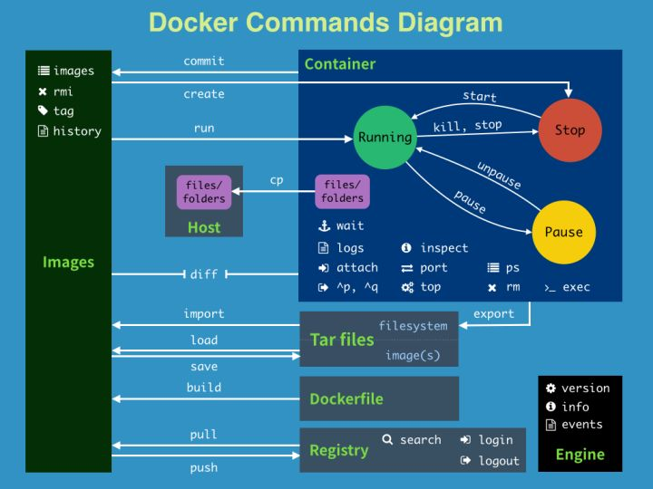

+++
title = "安装使用"
date = "2026-05-28T00:01:08+08:00"
draft = false
+++

# 介绍

## Docker的世界

介绍docker的前世今生，了解docker的实现原理，以Django项目为例，带大家如何编写最佳的Dockerfile构建镜像。通过本章的学习，大家会知道docker的概念及基本操作，并学会构建自己的业务镜像，并通过抓包的方式掌握Docker最常用的bridge网络模式的通信。

## 认识docker

- 轻量、高效的虚拟化

  Docker 公司位于旧金山,原名dotCloud，底层利用了Linux容器技术（在操作系统中实现资源隔离与限制）。为了方便创建和管理这些容器，dotCloud 开发了一套内部工具，之后被命名为“Docker”。Docker就是这样诞生的。

  （思考为啥要用Linux容器技术？）

  

Hypervisor： 一种运行在基础物理服务器和操作系统之间的中间软件层，可允许多个操作系统和应用共享硬件 。常见的VMware的 Workstation 、ESXi、微软的Hyper-V或者思杰的XenServer。

Container Runtime：通过Linux内核虚拟化能力管理多个容器，多个容器共享一套操作系统内核。因此摘掉了内核占用的空间及运行所需要的耗时，使得容器极其轻量与快速。

- 软件交付过程中的环境依赖

  

### 知识点

- 可以把应用程序代码及运行依赖环境打包成镜像，作为交付介质，在各环境部署

- 可以将镜像（image）启动成为容器(container)，并且提供多容器的生命周期进行管理（启、停、删）

- container容器之间相互隔离，且每个容器可以设置资源限额

- 提供轻量级虚拟化功能，容器就是在宿主机中的一个个的虚拟的空间，彼此相互隔离，完全独立

- CS架构的软件产品

  

### 版本管理

- Docker 引擎主要有两个版本：企业版（EE）和社区版（CE）
- 每个季度(1-3,4-6,7-9,10-12)，企业版和社区版都会发布一个稳定版本(Stable)。社区版本会提供 4 个月的支持，而企业版本会提供 12 个月的支持
- 每个月社区版还会通过 Edge 方式发布月度版
- 从 2017 年第一季度开始，Docker 版本号遵循 YY.MM-xx 格式，类似于 Ubuntu 等项目。例如，2018 年 6 月第一次发布的社区版本为 18.06.0-ce


### 发展史

13年成立，15年开始，迎来了飞速发展。


Docker 1.8之前，使用[LXC](https://linuxcontainers.org/fr/lxc/introduction/)，Docker在上层做了封装， 把LXC复杂的容器创建与使用方式简化为自己的一套命令体系。 

之后，为了实现跨平台等复杂的场景，Docker抽出了libcontainer项目，把对namespace、cgroup的操作封装在libcontainer项目里，支持不同的平台类型。

2015年6月，Docker牵头成立了 OCI（Open Container Initiative开放容器计划）组织，这个组织的目的是建立起一个围绕容器的通用标准 。 容器格式标准是一种不受上层结构绑定的协议，即不限于某种特定操作系统、硬件、CPU架构、公有云等 ， 允许任何人在遵循该标准的情况下开发应用容器技术，这使得容器技术有了一个更广阔的发展空间。

OCI成立后，libcontainer 交给OCI组织来维护，但是libcontainer中只包含了与kernel交互的库，因此基于libcontainer项目，后面又加入了一个CLI工具，并且项目改名为runC (https://github.com/opencontainers/runc )， 目前runC已经成为一个功能强大的runtime工具。

Docker也做了架构调整。将容器运行时相关的程序从docker daemon剥离出来，形成了**containerd**。containerd向上为Docker Daemon提供了`gRPC接口`，使得Docker Daemon屏蔽下面的结构变化，确保原有接口向下兼容。向下通过`containerd-shim`结合`runC`，使得引擎可以独立升级，避免之前Docker Daemon升级会导致所有容器不可用的问题。

 


也就是说

- runC（libcontainer）是符合OCI标准的一个实现，与底层系统交互
- containerd是实现了OCI之上的容器的高级功能，比如镜像管理、容器执行的调用等
- Dockerd目前是最上层与CLI交互的进程，接收cli的请求并与containerd协作

### 小结

1. 为了解决软件交付过程中的环境依赖，同时提供一种更加轻量的虚拟化技术，Docker出现了

2. Docker是一种CS架构的软件产品，可以把代码及依赖打包成镜像，作为交付介质，并且把镜像启动成为容器，提供容器生命周期的管理

3. docker-ce，每季度发布stable版本。18.06，18.09，19.03

4. 发展至今，docker已经通过制定OCI标准对最初的项目做了拆分，其中runC和containerd是docker的核心项目，理解docker整个请求的流程，对我们深入理解docker有很大的帮助

5. 三大核心要素：镜像(Image)、容器(Container)、仓库(Registry)

   （先整体看下流程，再逐个演示）

   ###### 镜像（Image）

   打包了业务代码及运行环境的包，是静态的文件，不能直接对外提供服务。

   ###### 容器（Container）

   镜像的运行时，可以对外提供服务。本质上讲是利用namespace和cgroup等技术在宿主机中创建的独立的虚拟空间。

   ###### 仓库（Registry）

   - 公有仓库，Docker Hub，阿里，网易...
   - 私有仓库，企业内部搭建
     - Docker Registry，Docker官方提供的镜像仓库存储服务
     - Harbor, 是Docker Registry的更高级封装，它除了提供友好的Web UI界面，角色和用户权限管理，用户操作审计等功能 
   - 镜像访问地址形式 registry.devops.com/demo/hello:latest,若没有前面的url地址，则默认寻找Docker Hub中的镜像，若没有tag标签，则使用latest作为标签
   - 公有的仓库中，一般存在这么几类镜像
     - 操作系统基础镜像（centos，ubuntu，suse，alpine）
     - 中间件（nginx，redis，mysql，tomcat）
     - 语言编译环境（python，java，golang）
     - 业务镜像（django-demo...）




# 安装

安装 Docker Engine-Community 版本

配置网卡转发

```bash
## 配置网卡转发,看值是否为1
$ sysctl -a |grep -w net.ipv4.ip_forward
net.ipv4.ip_forward = 1

## 若未配置，需要执行如下
$ cat <<EOF >  /etc/sysctl.d/docker.conf
net.bridge.bridge-nf-call-ip6tables = 1
net.bridge.bridge-nf-call-iptables = 1
net.ipv4.ip_forward=1
EOF
$ sysctl -p /etc/sysctl.d/docker.conf
```

安装所需的软件包。yum-utils 提供了 yum-config-manager ，并且 device mapper 存储驱动程序需要 device-mapper-persistent-data 和 lvm2。

``` bash
yum install -y yum-utils device-mapper-persistent-data lvm2
```

设置安装源

阿里云源：

``` bash
yum-config-manager \
    --add-repo \
    https://mirrors.aliyun.com/docker-ce/linux/centos/docker-ce.repo
```

清华源：

```bash
yum-config-manager \
    --add-repo \
    https://mirrors.tuna.tsinghua.edu.cn/docker-ce/linux/centos/docker-ce.repo
```


查看docker版本

```bash
yum list docker-ce --showduplicates | sort -r
```

安装

``` bash
# 指定版本，通过其完整的软件包名称安装特定版本，该软件包名称是软件包名称（docker-ce）加上版本字符串（第二列），从第一个冒号（:）一直到第一个连字符，并用连字符（-）分隔。例如：docker-ce-18.09.1。
yum install -y docker-ce-<VERSION_STRING> docker-ce-cli-<VERSION_STRING>
```

配置加速源

```bash
## 配置源加速
## https://cr.console.aliyun.com/cn-hangzhou/instances/mirrors
mkdir -p /etc/docker
cat << EOF >/etc/docker/daemon.json
{
  "registry-mirrors" : [
    "https://bn6ijjfd.mirror.aliyuncs.com",
  ]
}
EOF
```

启动

``` bash
systemctl start docker
systemctl enable docker
```


删除容器、镜像、配置文件等：

``` bash
rm -rf /var/lib/docker
```


# docker命令

``` bash
docker search 镜像名
docker search --filter=STARS=9000 mysql 搜索 STARS >9000的 mysql 镜像

docker pull 镜像名:tag

docker run 镜像名:Tag
# 参数：
	-p 映射端口: 8080:8080
	-v 挂载目录: /
	-e 设置环境变量：MYSQL_ROOT_PASSWORD=123456
# -it 表示 与容器进行交互式启动 -d 表示可后台运行容器 （守护式运行）  --name 给要运行的容器 起的名字  /bin/bash  交互路径
docker run -it -d --name 要取的别名 镜像名:Tag /bin/bash 

# 查看镜像
docker images 

# 查看运行中的容器
docker ps
# 查看所有容器
docker ps -a
# 只查看获取容器id
docker ps -qa

# 删除容器
docker rm 容器id
# 删除全部容器
docker rm `docker ps -qa`

#删除镜像，删除多个就直接在后面加上即可
# 参数 -f：表示强制删除，会删除正在运行中的容器镜像
docker rmi 镜像名/镜像ID
#删除全部镜像  -a 意思为显示全部, -q 意思为只显示ID
docker rmi $(docker images -aq)

# 杀死容器
docker kill 容器id
# 删除全部容器
docker kill `docker ps -qa`

# 打包镜像
docker save 镜像名/镜像ID -o 镜像保存在哪个位置与名字

# 加载镜像
docker load -i 镜像保存文件位置

# 保存更新镜像
docker commit -m="提交信息" -a="作者信息" 容器名/容器ID 提交后的镜像名:Tag

# 打标签
docker tag SOURCE_IMAGE[:TAG] TARGET_IMAGE[:TAG]

# 如果省略TAG 则会为镜像默认打上latest TAG
docker tag aaa bbb
# 上方操作等于 docker tag aaa:latest bbb:test

# 查看docker工作目录
sudo docker info | grep "Docker Root Dir"
	
#查看磁盘占用情况
du -hs /var/lib/docker/ 

# 查看容器信息资源
docker top
docker inspect
docker info

# docker create ：创建一个新的容器但不启动它
docker create [OPTIONS] IMAGE [COMMAND] [ARG...]
```

docker run命令参数

```bash
-a stdin: 指定标准输入输出内容类型，可选 STDIN/STDOUT/STDERR 三项；

-d: 后台运行容器，并返回容器ID；

-i: 以交互模式运行容器，通常与 -t 同时使用；

-P: 随机端口映射，容器内部端口随机映射到主机的端口

-p: 指定端口映射，格式为：主机(宿主)端口:容器端口

-t: 为容器重新分配一个伪输入终端，通常与 -i 同时使用；

--name="nginx-lb": 为容器指定一个名称；

--dns 8.8.8.8: 指定容器使用的DNS服务器，默认和宿主一致；

--dns-search example.com: 指定容器DNS搜索域名，默认和宿主一致；

-h "mars": 指定容器的hostname；

-e username="ritchie": 设置环境变量；

--env-file=[]: 从指定文件读入环境变量；

--cpuset="0-2" or --cpuset="0,1,2": 绑定容器到指定CPU运行；

-m :设置容器使用内存最大值；

--net="bridge": 指定容器的网络连接类型，支持 bridge/host/none/container: 四种类型；

--link=[]: 添加链接到另一个容器；

--expose=[]: 开放一个端口或一组端口；

--volume , -v: 绑定一个卷，/path/on/host:/path/in/container，如果主机目录为空，挂载后容器中的文件将会在主机目录中创建一个拷贝，以后对主机目录的修改不会影响容器中的文件。 
```


# Dockerfile

```bash
dockerfile 支持自定义容器的初始命令
 
dockerfile文件指令：
  FROM 这个镜像的妈妈是谁？（指定基础镜像）
  MAINTAINER 告诉别人，谁负责养它？（指定维护者信息，可以没有）
  LABLE 描述，标签
  COPY 复制文件（不会解压）rootfs.tar.gz ，当是目录时会把目录下的所有文件以及子目录复制到容器对应目录下
  ADD 给它点创业资金（会自动解压tar） 制作docker基础的系统镜像，还能从远端拷贝
  ENV 环境变量 
  ENTRYPOINT 容器启动后执行的命令（无法被替换，启容器的时候指定的命令，会被当成参数）
  CMD 奔跑吧，兄弟！（指定容器启动后的要干的事情）（容易被替换，最后一条才生效，启动容器时带有命令，此时会被覆盖）
  RUN 你想让它干啥（在命令前面加上RUN即可）
  WORKDIR 我是cd,今天刚化了妆（设置当前工作目录，即进入容器之后便直接在该目录下）
  VOLUME 给它一个存放行李的地方（设置卷，挂载主机目录）
  EXPOSE 它要打开的门是啥（指定对外的端口）(-P 随机端口)
  
  ARG 构建参数，与 ENV 作用一致。不过作用域不一样。ARG 设置的环境变量仅对 Dockerfile 内有效，也就是说只有 docker build 的过程中有效，构建好的镜像内不存在此环境变量。
	构建命令 docker build 中可以用 --build-arg <参数名>=<值> 来覆盖。
	USER 用于指定执行后续命令的用户和用户组，这边只是切换后续命令执行的用户（用户和用户组必须提前已经存在）。
```


示例：

```bash

#基础镜像
FROM centos:7.6.1810
 
#maintainer 维护者信息
LABEL maintainer='zhen@123.com'
 
#RUN 执行命令，容器镜像是分层的，执行run的时候可以把多个命令拼接起来，减少镜像层数，减少镜像大小
RUN curl -o /etc/yum.repos.d/CentOS-Base.repo http://mirrors.aliyun.com/repo/Centos-7.repo && \
curl -o /etc/yum.repos.d/repel.repo http://mirrors.aliyun.com/repo/repel.repo && \
yum makecache && yum install -y python36 python3-devel python3-pip gcc pcre-devel zlib-devel make net-tools openssl openssl-devel
 
COPY tengine-2.3.0.tar.gz /opt
copy /dir /opt/
 
ADD tengine-2.3.0.tar.gz /opt
 
RUN cd /opt/tengine-2.3.0 && ./configure --prefix=/usr/local/nginx && make && make install && ln -s /usr/local/nginx/sbin/nginx /usr/bin/nginx
 
EXPOSE 8080
CMD sh xx.sh 或者 CMD ["sh","xx.sh"]

```

# docker compose

Compose 是用于定义和运行多容器 Docker 应用程序的工具。通过 Compose，您可以使用 YML 文件来配置应用程序需要的所有服务。然后，使用一个命令，就可以从 YML 文件配置中创建并启动所有服务。


Compose 使用的三个步骤：

- 使用 Dockerfile 定义应用程序的环境。
- 使用 docker-compose.yml 定义构成应用程序的服务，这样它们可以在隔离环境中一起运行。
- 最后，执行 docker-compose up 命令来启动并运行整个应用程序。

## 安装

方式一：yum 安装

```bash
yum install epel-release -y
#（需要epel源）
yum install docker-compose -y 

```

方式二：二进制

``` bash
# 要安装其他版本的 Compose，请替换 v2.2.2。
curl -L "https://github.com/docker/compose/releases/download/v2.2.2/docker-compose-$(uname -s)-$(uname -m)" -o /usr/local/bin/docker-compose
```

```bash
Docker Compose 存放在 GitHub，不太稳定。
可以也通过执行下面的命令，高速安装 Docker Compose。

curl -L https://get.daocloud.io/docker/compose/releases/download/v2.4.1/docker-compose-`uname -s`-`uname -m` > /usr/local/bin/docker-compose
```

```bash
# 将可执行权限应用于二进制文件
chmod +x /usr/local/bin/docker-compose

# 创建软链
ln -s /usr/local/bin/docker-compose /usr/bin/docker-compose

# 测试安装
$ docker-compose version

```


## yaml 文件

**version：**指定本 yml 依从的 compose 哪个版本制定的


**build:** 指定为构建镜像上下文路径，例如 webapp 服务，dockerfile文件路径为：./dir/Dockerfile ，可配置为

```yaml
version: "3"
services:
  webapp:
    build: ./dir
```

或者，作为具有在上下文指定的路径的对象，以及可选的 Dockerfile 和 args：

``` yaml
version: "3"
services:
  webapp:
    build:
      context: ./dir
      dockerfile: Dockerfile-alternate
      args:
        buildno: 1
      labels:
        - "com.example.description=Accounting webapp"
        - "com.example.department=Finance"
        - "com.example.label-with-empty-value"
      target: prod
```

参数解释：

- context：上下文路径。
- dockerfile：指定构建镜像的 Dockerfile 文件名。
- args：添加构建参数，这是只能在构建过程中访问的环境变量。
- labels：设置构建镜像的标签。
- target：多层构建，可以指定构建哪一层。


**command：**覆盖容器启动的默认命令。

```bash
command: ["bundle", "exec", "thin", "-p", "3000"]
```


**container_name：**指定自定义容器名称，而不是生成的默认名称。

```bash 
container_name: my-web-container
```


**depends_on**：设置依赖关系。

- docker-compose up ：以依赖性顺序启动服务。在以下示例中，先启动 db 和 redis ，才会启动 web。
- docker-compose up SERVICE ：自动包含 SERVICE 的依赖项。在以下示例中，docker-compose up web 还将创建并启动 db 和 redis。
- docker-compose stop ：按依赖关系顺序停止服务。在以下示例中，web 在 db 和 redis 之前停止。

```yaml
version: "3"
services:
  web:
    build: .
    depends_on:
      - db
      - redis
  redis:
    image: redis
  db:
    image: postgres
```

注意：web 服务不会等待 redis db 完全启动 之后才启动。

**entrypoint：**覆盖容器默认的 entrypoint。

**env_file：**从文件添加环境变量。可以是单个值或列表的多个值。

```yaml
env_file: .env

# 列表形式
env_file:
  - ./common.env
  - ./apps/web.env
  - /opt/secrets.env
```

**environment**：添加环境变量。您可以使用数组或字典、任何布尔值，布尔值需要用引号引起来，以确保 YML 解析器不会将其转换为 True 或 False。

```yaml
environment:
  RACK_ENV: development
  SHOW: 'true'
```

**expose：**暴露端口，但不映射到宿主机，只被连接的服务访问。

仅可以指定内部端口为参数：

```yaml
expose:
 - "3000"
 - "8000"
```

**image：**指定容器运行的镜像。以下格式都可以：

```yaml
image: redis
image: ubuntu:14.04
image: tutum/influxdb
image: example-registry.com:4000/postgresql
image: a4bc65fd # 镜像id
```

**volumes：**将主机的数据卷或着文件挂载到容器里。

```bash
version: "3.7"
services:
  db:
    image: postgres:latest
    volumes:
      - "/localhost/postgres.sock:/var/run/postgres/postgres.sock"
      - "/localhost/data:/var/lib/postgresql/data"
```


示例：

``` yaml
# yaml 配置实例
version: '3'
services:
  web:
    build: .
    ports:
    - "5000:5000"
    volumes:
    - .:/code
    - logvolume01:/var/log
    links:
    - redis
  redis:
    image: redis
volumes:
  logvolume01: {}
```


## 命令

```bash
# 启动 
docker-compose up 
# 后台启动 
docker-compose up -d
# 停掉并删除 
docker-compose down
 
# 关闭某一个 
docker stop [容器]
# 开启某一个 
docker start [容器]
# 重启 
docker restart [容器]
# 注意后面不指定表示全部
```


