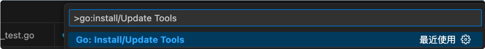
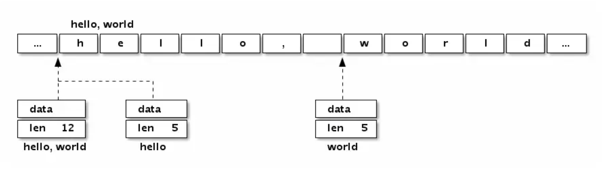
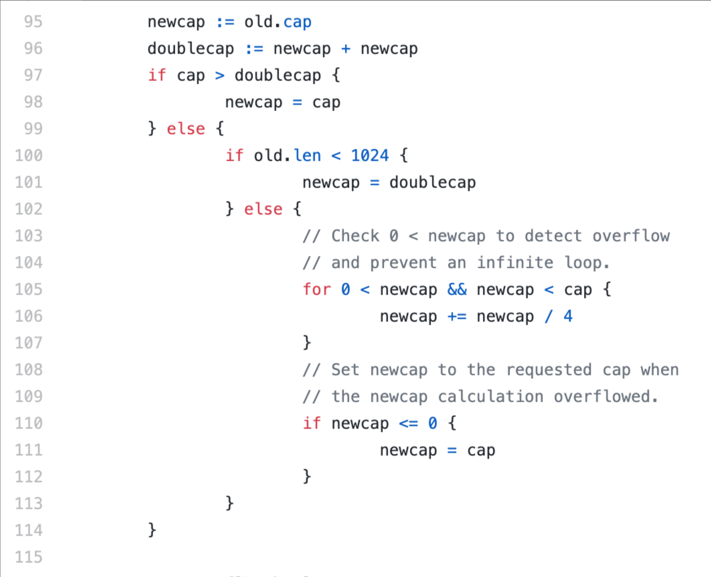

+++
title = "基础"
date = "2026-05-28T00:01:08+08:00"
draft = false
+++

# 一、安装&配置

推荐安装包的方式安装Go，Go的官方 https://golang.org/dl/

二进制包安装，官方release 地址 https://go.dev/doc/devel/release

二进制包就是已经编译好的包。去官方下载当前开发机所使用的系统

直接下载安装即可，不必多说

## 配置

需了解三个环境变量，分别是GOROOT、GOPATH，GOPROXY

- **GOROOT**

Go 语言安装根目录的路径，也就是GO语言的安装路径,官方推荐的目录地址一般在GOROOT="/usr/local/go"

在 GO 1.10 之前，我们需要视不同安装方式决定是否手动配置。比如源码编译安装，安装时会有默认设置。而采用二进制包安装，在windows系统中，推荐安装位置为C:\GO，在Linux、freeBSD、OS X系统，推荐安装在/usr/local/go下。如果要自定义安装位置，必须手动设置GOROOT。如果采用系统方式安装，这一切已经帮我们处理好了。

关于这个话题，推荐阅读：you-dont-need-to-set-goroot和分析源码安装go的过程。

在 GO 1.10 及以后，这个变量已经不用我们设置了，它会根据go工具集的位置，即相对go tool的位置来动态决定GOROOT的值。说简单点，其实就是go命令决定GOROOT的位置。

关于这个话题，推荐阅读：[use os.Executable to find GOROOT](https://go-review.googlesource.com/c/go/+/42533/) 和 [github go issues 25002](http://blog.studygolang.com/2013/01/分析源码安装go的过程/)。

- **GOPROXY**

由于众所周知的原因，国内无法使用一些谷歌的库，需要设置代理，具体国内设置网站 https://goproxy.io/

最终执行 go env 命令会看到如下环境变量

```bash
go env -w GO111MODULE=on
go env -w GOPROXY=https://goproxy.cn,direct
```

- **GOPATH**

GOPATH是用户自定义的工作区，我们通常开发项目代码都会放在GOPATH的工作区中，在go 1.8之前，该变量必须手动设置。go 1.8及之后，如果没有设置，默认在$HOME/go目录下，即你的用户目录中的go目录下。它应包含3个子目录：`src`目录、`pkg`目录、`bin`目录

1. `src` ：这个目录是你开发程序的主目录，所有的源码都是放在这个目录下面进行开发。通常的做法是一个目录为一个独立的项目。例如 `$GOPATH/src/hello`就表示 hello 这个应用/包。因此，每当开发一个新项目时，都需要在 `$GOPATH/src/`下新建一个文件夹用作开发。当你在引用其他包的时候，Go 程序也会以 `$GOPATH/src/`目录作为根目录进行查找。当然了， src 目录允许存在多级目录，例如在 src 下面新建了目录 `$GOPATH/src/github.com/baxiang/hello`，那么这个包路径就是 github.com/golang/`baxiang`/hello，包名称为最后一个目录 hello。。
2. `pkg`：用于存放通过`go install`命令安装后的代码包的归档文件（（archive file，也就是以“.a”为扩展名的文件））
3. `bin`：一般通过执行`go install`命令完成安装后，保存由Go命令源码文件生成的可执行文件（executable file）

相当于是需要创建一个工作目录，目录下面包含src，pkg，bin，真实的项目创建在src下，例如：

```bash
goProject
  |-- bin
  |-- pkg
  |-- src
    |-- project1
      |--- ...
    |-- project2
      |--- ...
    |-- project3
      |--- ...
```


对于>=1.13版本的go，可以直接使用go env -w 设置环境变量

```bash
go env -w GOPATH=$HOME/go
```

重置命令

```bash
unset GOPROXY
```

查看当前设置的环境变量参数

```bash
go env
```

## 开发IDE

jetbrains公司开发的，收费软件，但是目前个人感觉非常棒的的Go开发IDEA

下载地址：https://www.jetbrains.com/go/

VSCODE

下载地址：https://code.visualstudio.com/

需要安装go开发的插件


需要安装 go 的工具包。在 vscode 中，输入快捷键：command(ctrl) + shift + p，或者是F1 在弹出的窗口中，输入：go:install/Update Tools，回车后，选择所有插件(勾一下全选)




# 二、基础语法

## 1. 变量

使用一个名词来代表一块内存地址，该内存地址存放的数据类型由定义变量时声明的类型确定，变量意味着存放的数据是可以被修改的。

### var完整声明

 使用var关键字是Go最基本的定义变量方式，变量名称开头是一个字母( Unicode 中的字符即可)或下划线，后面可以跟任意数量的字符 、数字和下划线，并区分大小写 。如x和X是不同的变量名称 。变量的命名规则遵循骆驼命名法，即首个单词小写，每个新单词的首字母大写

```bash
var 变量名称 数据类型 [ = 变量初始值]

var 变量名1, 变量名2 <变量类型> = 初始值1,初始值2
```

Go语言在声明变量时将变量的类型放在变量的名称之后，例如声明了一个 int 类型的变量，名字为 age的变量如下所示：

```bash
var age int // 变量声明
```

注意 ：GO声明的变量就会立即分配内存空间，也就意味着会被默认初始化值

如果一个变量未被赋值，Go 会自动地将其初始化，赋值该变量类型的零值（Zero Value)。上面的声明是没有对age变量赋值，int 类型默认值是0， 因此age就被赋值为 0。

```go
package main
import "fmt"
func main() {
    var age int // 变量声明
    fmt.Println("my age is", age)
    age = 1 // 赋值
    fmt.Println("my age is", age)
    age = 2 // 赋值
    fmt.Println("my new age is", age)
}
```

输出：

```bash
my age is  0  
my age is 1  
my new age is 2
```

### 类型推断（Type Inference）

如果变量有初始值，那么 Go 能够自动推断具有初始值的变量的类型。因此，如果变量有初始值，就可以在变量声明中省略 `type`。

如果变量声明的语法是 var name = initialvalue，Go 能够根据初始值自动推断变量的类型。

在下面的例子中，你可以看到在第 6 行，我们省略了变量 `age` 的 `int` 类型，Go 依然推断出了它是 int 类型。

```go
package main

import "fmt"

func main() {
    var age = 9 // 可以推断类型
    fmt.Println("my age is", age)
}
```

声明变量的同时可以给定初始值

```yaml
var 变量名称 变量类型 = 变量初始化值
```

```go
package main

import "fmt"

func main() {
    var age int = 29 // 声明变量并初始化
    fmt.Println("my age is", age)
}
```

### **:=简短**声明

Go支持一种用了 **:=** 声明变量的形式，称为**短变量声明**（Short Hand Declaration）

不过短变量声明有限制，否则无法编译通过

1. 只能用来定义变量，同时会显式初始化。
2. 只能类型推断，不能提供数据类型。
3. 那就是它适用于函数 / 方法内部或是 if、for 和 switch 的初始化语句中。

```go
package main

import "fmt"

func main() {  
    name, age := "xiang", 18 // 简短声明
    fmt.Println("my name is", name, "age is", age)
}
```

简短声明的语法要求 := 操作符的左边至少有一个变量是尚未声明的。下面的程序中a,b 已经被声明 所以再次声明ab是错误的

```go
package main
import "fmt"

func main() {  
    a, b := 2, 3 // 声明a和b
    fmt.Println("a is", a, "b is", b)
    a, b := 4, 5 // 错误，没有尚未声明的变量
}
```

变量可以被函数返回值时进行赋值。下面程序中

```go
package main

import (
	"fmt"
	"math"
)

func main() {
	a, b := 1.0, 2
	c := math.Min(a, float64(b))
	fmt.Println("minimum value = ", c)   //输出：minimum value =  1
}
```

同时要区分好简短声明的是变量只能在函数内部使用，下面的a 分为全局和本地变量 需要分清楚

```go
package main

import "fmt"

var a int

func foo() (int, int) {
	return 10, 20
}

func bar() {
	fmt.Printf("global a = %d\n", a)
}

func main() {
	a, _ := foo()
	fmt.Printf("local a = %d\n", a)
	bar()
}

```

### _忽略变量

_（下划线）是个特殊的变量名，任何赋予它的值都会被丢弃。在这个例子中，我们将值2赋予b，并同时丢弃1：

```go
_, b := 1, 2
```

- 包导入 

  主要是调用init 函数（比如数据库驱动的注册）

```go
import (
_ "github.com/mydemo/dbdriver"
)
```

- 返回值 

  主要是忽略某个值

```go
_,err := callFunc()
```

- 类型约定 
  比如判断某个struct是否实现接口的方法 
  比如判断 type T是否实现了I,用作类型断言，如果T没有实现借口I，则编译错误.

```go
type T struct{}
var _ I = T{}

// 其中 I为interface
```

## 2. 常量

关键字 `**const**` 被用于表示常量，常量用于存储不会改变的数据，常量中的数据类型只可以是布尔型、数字型（整数型、浮点型和复数）和字符串型。常量存储在程序的只读段里（.rodanat section)

```go
const identifier [type] = value
```

常量不能再重新赋值为其他的值

```go
const a = 55 // 允许
    a = 89       // 不允许重新赋值
```

常量的值会在编译的时候确定。因为函数调用发生在运行时，所以不能将函数的返回值赋值给常量。

```go
package main

import (  
    "fmt"
    "math"
)

func main() {  
    fmt.Println("Hello, playground")
    var a = math.Sqrt(4)   // 允许
    const b = math.Sqrt(4) // 不允许
}

//在上面的程序中，因为 a 是变量，因此我们可以将函数 math.Sqrt(4) 的返回值赋值给它（我们将在单独的地方详细讨论函数）。
//b 是一个常量，它的值需要在编译的时候就确定。函数 math.Sqrt(4) 只会在运行的时候计算，因此 const b = math.Sqrt(4) 将会抛出错误 error main.go:11: const initializer math.Sqrt(4) is not a constant)
```

### 枚举

常量还可以用作枚举, 如下数字 0、1 和 2 分别代表未知性别、女性和男性

```go
const (
	Unknown = 0
	Female = 1
	Male = 2
)
```

### iota

**iota** 是一个特殊的预声明标识符，在英语中，"iota" 的读音是 /aɪˈoʊ.tə/，其中 "i" 发音为 "ai"，"ota" 发音接近 "o-ta"。iota只能在 **const** 声明中使用，表示连续的整数常量。在每一个新的 **const** 块中，**iota** 的值都从0开始，并在块中的每一行自动递增， iota常用来表示自增的枚举变量，专门用来初始化常量。

```go
const (
	x = iota // x == 0
	y  // y == 1
	z  // z == 2
	w //w ==3
)
func main() {
	fmt.Println(x,y,z,w)
}
```

也可以在 **iota** 中使用一些计算来为常量赋值：

```go
const (
    A = iota * 2  // 0
    B             // 2
    C             // 4
)

```

**iota** 经常与位操作组合使用，以创建位掩码或枚举标志：

```go
const (
    FlagA = 1 << iota  // 1 (2^0)
    FlagB              // 2 (2^1)
    FlagC              // 4 (2^2)
)
```

可以使用空白标识符 **_** 来跳过某些 **iota** 值。例如

```go
const (
    A = iota  // 0
    _          // 1, skipped
    B          // 2
)

```

在单行中声明多个常量，**iota** 值不会增加，直到下一行

```go
const (
    A, B = iota, iota + 10  // A=0, B=10
    C, D                     // C=1, D=11
)

```

## 3. 标准输入&输出

Go 语言的 `fmt` 包提供了丰富的输入和输出功能，允许你使用简单的方式进行标准输入和输出操作。通过 `fmt.Print`、`fmt.Println` 和 `fmt.Printf` 进行打印，以及通过 `fmt.Scan`**、**`fmt.Scanln` 和 `fmt.Scanf` 读取输入，你可以轻松控制你的程序与用户的交互。

- 标准输出 

**fmt.Println** 在打印完所有的参数后，不会有自动添加换行符操作

```go
import "fmt"

func main() {
	fmt.Print("hello")
	fmt.Print("golang")
}
```

**fmt.Println** 在打印完所有的参数后，会自动在结尾添加一个换行符。

```go
import "fmt"

func main() {
    fmt.Println("Hello, World!") // 打印字符串
    fmt.Println(42)              // 打印整数
    fmt.Println(3.14)            // 打印浮点数
}
```

**fmt.Printf** 允许你使用格式化字符串来控制输出的格式。你可以使用 `%v` 作为通用占位符来打印各种类型的值。也可以使用其他具体的占位符，例如 `%d` 用于整数、`%f` 用于浮点数、`%s` 用于字符串等。

```go
import "fmt"

func main() {
    fmt.Printf("String: %s, Integer: %d, Float: %.2f\n", "Go", 42, 3.14)
}
```

- 标准输入

**fmt.Scan**用于从标准输入读取空白符分隔的值。`fmt.Scan` 会在读取完所有的值后等待换行符。

**fmt.Scanln** 也是从从标准输入读取空白符分隔的值，在读取每个值后会等待换行符:

```go
import "fmt"

func main() {
    var a int
    var b string
    fmt.Print("Enter an integer and a string: ")
    fmt.Scan(&a, &b)
    fmt.Printf("You entered: %d and %s\n", a, b)
}
```

**fmt.Scanf** 允许你使用格式化字符串来控制输入的格式。例如：

```go
import "fmt"

func main() {
    var a int
    var b string
    fmt.Print("Enter an integer and a string: ")
    fmt.Scanf("%d %s", &a, &b)
    fmt.Printf("You entered: %d and %s\n", a, b)
}
```

# 三、基本数据类型

## 1. 字符串

在 Golang 中，字符串是字节的集合。

```go
package main

import (  
    "fmt"
)

func main() {  
    first := "Naveen"
    last := "Ramanathan"
    name := first +" "+ last
    fmt.Println("My name is",name)
}
```

## 2. 数字

### 有符号整型

| 类型  | 描述                 | 大小  | 范围                                      |
| ----- | -------------------- | ----- | ----------------------------------------- |
| int8  | 表示 8 位有符号整型  | 8 位  | -128～127                                 |
| int16 | 表示 16 位有符号整型 | 16 位 | -32768～32767                             |
| int32 | 表示 32 位有符号整型 | 32 位 | -2147483648～2147483647                   |
| int64 | 表示 64 位有符号整型 | 64 位 | -9223372036854775808～9223372036854775807 |

在 Printf 方法中，使用 **%T** 格式说明符（Format Specifier），可以打印出变量的类型。Go 的 [unsafe](https://golang.org/pkg/unsafe/) 包提供了一个 [Sizeof](https://golang.org/pkg/unsafe/#Sizeof) 函数，该函数接收变量并返回它的字节大小。*unsafe* 包应该小心使用，因为使用 unsafe 包可能会带来可移植性问题。

下面程序会输出变量 a 和 b 的类型和大小。格式说明符 `%T` 用于打印类型，而 `%d` 用于打印字节大小。

```go
package main

import (  
    "fmt"
    "unsafe"
)

func main() {  
    var a int = 89
    b := 95
    fmt.Println("value of a is", a, "and b is", b)
    fmt.Printf("type of a is %T, size of a is %d", a, unsafe.Sizeof(a)) // a 的类型和大小
    fmt.Printf("\ntype of b is %T, size of b is %d", b, unsafe.Sizeof(b)) // b 的类型和大小
}
```

输出

```go
value of a is 89 and b is 95  
type of a is int, size of a is 4  
type of b is int, size of b is 4

// 从上面的输出，我们可以推断出 a 和 b 为 int 类型，且大小都是 32 位（4 字节）。如果你在 64 位系统上运行上面的代码，会有不同的输出。在 64 位系统下，a 和 b 会占用 64 位（8 字节）的大小。
```

### 无符号整型

| 类型       | 描述                                           | 大小                                             | 范围                                                         |
| ---------- | ---------------------------------------------- | ------------------------------------------------ | ------------------------------------------------------------ |
| **uint8**  | 表示 8 位无符号整型                            | 8 位                                             | 0～255                                                       |
| **uint16** | 表示 16 位无符号整型                           | 16 位                                            | 0～65535                                                     |
| **uint32** | 32 位无符号整型                                | 32                                               | 0～4294967295                                                |
| **uint64** | 64 位无符号整型                                | 64 位                                            | 0～18446744073709551615                                      |
| **uint**   | 根据不同的底层平台，表示 32 或 64 位无符号整型 | 在 32 位系统下是 32 位，而在 64 位系统下是 64 位 | 在 32 位系统下是 0～4294967295，而在 64 位系统是 0～18446744073709551615。 |

### 浮点型

**float32**：32 位浮点数
**float64**：64 位浮点数

```go
package main

import (  
    "fmt"
)

func main() {  
    a, b := 5.67, 8.97
    fmt.Printf("type of a %T b %T\n", a, b)
    sum := a + b
    diff := a - b
    fmt.Println("sum", sum, "diff", diff)

    no1, no2 := 56, 89
    fmt.Println("sum", no1+no2, "diff", no1-no2)
}
```

输出

```go
type of a float64 b float64  
sum 14.64 diff -3.3000000000000007  
sum 145 diff -33

// 在这里，a 和 b 的类型为 float64（float64 是浮点数的默认类型）。我们把 a 和 b 的和赋值给变量 sum，把 b 和 a 的差赋值给 diff，接下来打印 sum 和 diff。no1 和 no2 也进行了相同的计算。
```

注意：浮点数字面量被自动类型推断为 float64类型。

### 复数类型

**complex64**：实部和虚部都是 float32 类型的的复数。
**complex128**：实部和虚部都是 float64 类型的的复数。

内建函数 [**complex**](https://golang.org/pkg/builtin/#complex) 用于创建一个包含实部和虚部的复数。complex 函数的定义如下：

```go
func complex(r, i FloatType) ComplexType
```

该函数的参数分别是实部和虚部，并返回一个复数类型。实部和虚部应该是相同类型，也就是 float32 或 float64。如果实部和虚部都是 float32 类型，则函数会返回一个 complex64 类型的复数。如果实部和虚部都是 float64 类型，则函数会返回一个 complex128 类型的复数。

还可以使用简短语法来创建复数：

```go
c := 6 + 7i
```

简单示例：

```go
package main

import (  
    "fmt"
)

func main() {  
    c1 := complex(5, 7)
    c2 := 8 + 27i
    cadd := c1 + c2
    fmt.Println("sum:", cadd)
    cmul := c1 * c2
    fmt.Println("product:", cmul)
}
```

输出

```go
sum: (13+34i)  
product: (-149+191i)

// 在上面的程序里，c1 和 c2 是两个复数。c1的实部为 5，虚部为 7。c2 的实部为8，虚部为 27。c1 和 c2 的和赋值给 cadd ，而 c1 和 c2 的乘积赋值给 cmul
```

### 其他数字

**byte** 是 uint8 的别名。
**rune** 是 int32 的别名。

## 3. 布尔

布尔类型关键字是 bool，布尔类型只有2个值分别为 true 或者 false。

```go
func main() {
    a:= true
    b:= false
    fmt.Println(a)
    fmt.Println(b)
    c:=a&&b
    fmt.Println(c)
    d:=a||b
    fmt.Println(d)
}
```

输出

```go
true
false
false
true

// a 赋值为 true，b 赋值为 false。c 赋值为 a && b。仅当 a 和 b 都为 true 时，操作符 && 才返回 true。因此，在这里 c 为 false。当 a 或者 b 为 true 时，操作符 || 返回 true。在这里，由于 a 为 true，因此 d 也为 true。
```

数字类型和bool类型不能相互转换，这个可能跟一些语言不太一样，需要特别注意

```go
var a bool
a = 1


// 上面的语句执行会出现如下错误提示
 cannot use 1 (type int) as type bool in assignment
```

## 4. 类型转换

Go 有着非常严格的强类型特征。Go 没有自动类型提升或类型转换。我们通过一个例子说明这意味着什么。

```go
package main

import (  
    "fmt"
)

func main() {  
    i := 55      //int
    j := 67.8    //float64
    sum := i + j //不允许 int + float64
    fmt.Println(sum)
}
```

上面的代码在 C 语言中是完全合法的，然而在 Go 中，却是行不通的。i 的类型是 int ，而 j 的类型是 float64 ，我们正试图把两个不同类型的数相加，Go 不允许这样的操作。如果运行程序，你会得到 `main.go:10: invalid operation: i + j (mismatched types int and float64)`。

要修复这个错误，i 和 j 应该是相同的类型。在这里，我们把 j 转换为 int 类型。把 v 转换为 T 类型的语法是 T(v)。

```go
package main

import (  
    "fmt"
)

func main() {  
    i := 55      //int
    j := 67.8    //float64
    sum := i + int(j) //j is converted to int
    fmt.Println(sum)
}
```

现在，当你运行上面的程序时，会看见输出 `122`。

赋值的情况也是如此。把一个变量赋值给另一个不同类型的变量，需要显式的类型转换。下面程序说明了这一点。

```go
package main

import (  
    "fmt"
)

func main() {  
    i := 10
    var j float64 = float64(i) // i 转换为 float64 类型，接下来赋值给 j。如果不进行类型转换，当你试图把 i 赋值给 j 时，编译器会抛出错误。
    fmt.Println("j", j)
}
```

## 5. 零值zero value

零值并非是空值，而是一种“变量未填充前”的默认值

| 数据类型 | 默认值 |
| -------- | ------ |
| 整型     | 0      |
| 浮点型   | 0      |
| 字符串型 | ""     |
| 布尔型   | false  |

```go
var i int
var a float32
var b float64
var isMarried bool
var name string
fmt.Printf("i=%v,a=%v,b=%v,isMarried=%v,name=%v",i,a,b,isMarried,name)
```

## 6. 引用和值类型

引用类型的修改可以影响到任何引用到它的变量。

基本类型因为是拷贝的值，并且在对他进行操作的时候，生成的也是新创建的值

| 类型     | 范围                       |
| -------- | -------------------------- |
| 引用类型 | 切片，字典，通道，函数     |
| 值类型   | 数组，基本数据类型，结构体 |

## 7. 全局和局部变量

golang中允许全局变量与局部变量名称可以相同，:= 短变量声明声明的是局部变量DB，var DB *gorm.DB 在函数外部声明的是全局变量，在下面例子中 局部的DB会屏蔽全部的DB，局部DB的赋值不代表全局的DB被赋值。

```go
var DB *gorm.DB

func InitGorm() error{
	var err error
	dsn := "root:123456@tcp(127.0.0.1:3306)/test?charset=utf8mb4&parseTime=True&loc=Local"
	DB, err = gorm.Open(mysql.Open(dsn), &gorm.Config{})
    
	return err
}
```

# 四、流程控制

## if分支控制

if后面的条件判断子句不需要用小括号括起来 。

if后面可以带一个简单的初始化语句，并以分号分割，该简单语句声明 的变量的作用域是整if语句块，包括后面的else if和 else分支。 

**注意：**go不支持三元操作符(三目运算符)，示例：

```go
 "a > b ? a : b"
```

- 单分支控制

```go
if 布尔表达式 {
	/* 在布尔表达式为 true 时执行 */
}
```

- 双分支控制

```go
if 布尔表达式{
    
}else{
    
}
```

- 多分支控制

```go
if 条件表达式1{
    
}else if 条件表达式2 {
    
}else{
    
}
```

## switch控制

`switch` 语句是 Go 中的另一个常用控制结构，case按照从上往下的顺序进行求值，直到找到匹配的项。因此可以将多个if…else语句改写成一个switch…case语句。

go语言中case与case之间是独立的代码块，不需要通过break语句跳出当前case代码块以避免执行到下一行。

- **基本的 `switch` 用法**

在最基本的形式中，`switch` 对一个值进行判断，并与各个 `case` 进行匹配。

```go
fruit := "apple"
switch fruit {
case "banana":
    fmt.Println("This is a banana.")
case "apple":
    fmt.Println("This is an apple.")  // 输出: "This is an apple."
case "orange":
    fmt.Println("This is an orange.")
default:
    fmt.Println("This is some other fruit.")
}
```

- **多值 `case`**

一个 `case` 可以包含多个匹配值。

```go
number := 3
switch number {
case 1, 2, 3, 4:
    fmt.Println("The number is between 1 and 4.")  // 输出: "The number is between 1 and 4."
case 5, 6, 7:
    fmt.Println("The number is between 5 and 7.")
}
```

- **使用表达式**

`case` 后可以跟一个条件表达式，而不是只是一个值。

```go
number := 5
switch {
case number < 5:
    fmt.Println("The number is less than 5.")
case number == 5:
    fmt.Println("The number is 5.")  // 输出: "The number is 5."
case number > 5:
    fmt.Println("The number is greater than 5.")
}
```

- **使用 `fallthrough`**

默认情况下，每个 `case` 块结束后，`switch` 语句就会退出。但是，使用 `fallthrough` 语句可以强制执行紧随其后的下一个 `case` 语句，不进行判断。

```go
fruit := "banana"
switch fruit {
case "banana":
    fmt.Println("This is a banana.")
    fallthrough
case "apple":
    fmt.Println("This is an apple.")  // 由于前一个 case 使用了 fallthrough，这里也会执行
}
```

- **`switch`初始化语句**

在 `switch` 中可以包含一个初始化语句。

```go
switch fruit := "mango"; fruit {
case "banana":
    fmt.Println("This is a banana.")
case "apple":
    fmt.Println("This is an apple.")
case "mango":
    fmt.Println("This is a mango.")  // 输出: "This is a mango."
}
```

- **类型判断**

用 `switch` 来判断变量的类型，使用 `.(type)`。

```go
var value interface{}
value = "hello"

switch v := value.(type) {
case string:
    fmt.Printf("The value is a string: %s\n", v)
case int:
    fmt.Println("The value is an integer.")
default:
    fmt.Println("The value is of another type.")
}
```

## for循环控制

Go 语言仅支持一种循环语句， 即 for语句

**注意：go中语言没有while和do while**

### **基础形式**

```go
// for 初始化; 条件; 后置操作 {
for i := 0; i < 10; i++ {
    fmt.Println(i)
}

/*
初始化：只会在循环开始时执行一次，通常用于声明并初始化控制变量。
条件：在每次循环迭代之前都会检查这个条件。如果条件为 **true**，则执行循环体；否则，终止循环。
后置操作：在循环体执行完后，每次迭代都会执行。通常用于更新控制变量。
*/
```

### **只有条件的循环**

省略 **初始化** 和 **后置操作,**类似 的 while 循环语句 

```go
x := 0
for x < 10 {
    fmt.Println(x)
    x++
}

```

### **无限循环**

类似  while (1)死循环语句

```go
for {
    fmt.Println("This will print forever!")
}
```

### **range**

for 循环还支持 range 关键字，可以用来遍历数组、切片、字符串、映射或通道。

```go
numbers := []int{1, 2, 3, 4, 5}
for index, value := range numbers {
    fmt.Printf("Index: %d, Value: %d\n", index, value)
}
```

## 标签和跳转

Go语言使用标签（Lable）来标识一个语句的位置，用于 goto 、break、 continue 语句的跳转，标签的语法是：

goto语句本身就是做跳转用的，而break和continue是配合for使用的。所以goto的使用不限于for，

通常与条件语句配合使用 在for循环中break和continue可以配合标签使用。

### goto

用于函数的内部的跳转，需要配合标签一起使用，goto语句可以无条件地转移到过程中指定的行。通常与条件语句配合使用。可用来实现条件转移， 构成循环，跳出循环体等功能。

在结构化程序设计中一般不主张使用goto语句， 以免造成程序流程的混乱。

goto对应(标签)既可以定义在for循环前面，也可以定义在for循环后面，当跳转到标签地方时，继续执行标签下面的代码。

```go
package main

import "fmt"

func main() {
	var a =0
	for ;a<5;a++{
		if a>3{
			goto Loop
		}
		fmt.Printf("for ...%d\n",a)
	}
Loop:           //放在for后边
	fmt.Printf("loop ...%d\n",a)
}

```

输出：

```go
for...0
for...1
for...2
for...3
loop...4
```

放在前面一直死循环

```go
package main

import "fmt"

func main() {
	var a =0
Loop:           //放在for前面 一直死循环
	fmt.Printf("loop ...%d\n",a)
	for ;a<5;a++{
		if a>3{
			goto Loop
		}
		fmt.Printf("for ...%d\n",a)
	}
}
```

注意：goto语句与标签之间不能有变量声明，否则编译错误。

错误示例：

```go
func foo(){
	goto flag
	var s = "hello world"
	fmt.Println(s)
flag:
	s = "hello golang"
	fmt.Println(s)
}
```

### break

break标签能用于循环，跳出后不再执行标签对应的循环体

```go
package main

import "fmt"

func main() {
	for i := 0; i <= 2; i++ {
		for j := 1; j <= 3; j++ {
			if j == 2 {
				break
			}
			fmt.Printf("%d+%d=%d\n", i, j, i+j)
		}
	}
}
```

输出：

```go
0+1=1
1+1=2
2+1=3
```

break只是跳出了第一层for循环，使用标签后跳出到指定的标签,break只能跳出到之前，如果将Loop标签放在后边则会报错

```go
package main

import "fmt"

func main() {
	var a =0
	for ;a<5;a++{
		if a>3{
			goto Loop
		}
		fmt.Printf("for ...%d\n",a)
	}
Loop:           //放在for后边
	fmt.Printf("loop ...%d\n",a)
}

```

### continue

```go
package main

import (
	"fmt"
)

func main() {
	FirstNames := []string{"张", "李", "王"}
	LastNames := []string{"三", "四", "五"}
	for i, firstName := range FirstNames {
		for j, lastName := range LastNames {
			if i == 1 && j==1 {   // 同时满足
				continue  // 继续循环
			}
			fmt.Printf("%d-%d:%s%s\n",i,j, firstName, lastName)
		}
	}
}
```

输出：

```go
0-0:张三
0-1:张四
0-2:张五
1-0:李三
1-2:李五
2-0:王三
2-1:王四
2-2:王五
```

```go
package main

import (
	"fmt"
)

func main() {
	FirstNames := []string{"张", "李", "王"}
	LastNames := []string{"三", "四", "五"}
	Loop:
	for i, firstName := range FirstNames {
		for j, lastName := range LastNames {
			if i == 1 && j==1 {
				continue Loop
			}
			fmt.Printf("%d-%d:%s%s\n",i,j, firstName, lastName)
		}
	}
}
```

输出：

```go
0-0:张三
0-1:张四
0-2:张五
1-0:李三
2-0:王三
2-1:王四
2-2:王五
```

# 五、字符串

字符串是用一对**双引号"或反引号``(键盘数字1的左边键)**括起来定义，

```go
str :="string test"

aStr := `another string`
```

反引号（`）定义多行字符串。

```go
s := `
Hello
World
`
```

## 不可变性

注意字符串一旦赋值了，字符串是不可以修改的。

```go
str :="hello"
str[0] = 's'

//执行会报错：
cannot assign to str[0]
```

如果需要修改字符串内容，可以把字符串转换成[]byte类型

```go
package main

import "fmt"

func main() {
	str :="hello"
	a :=[]byte(str)
	a[0] = 's'
	fmt.Println(str)
	fmt.Println(string(a))
}

// 输出
hello
sello
```

字符串转换为切片 `[]byte(s)`要慎用，尤其是当数据量较大时(每转换一次都需复制内容) 

## byte&rune

Go语言默认的字符编码就是UTF-8类型的,**byte**、**rune** 和字符串都与文本和字符的处理密切相关.

1. byte
   byte 是 uint8 的别名，用于处理 8 位数据。
   当我们说到 ASCII 字符时，每个字符都可以用一个 byte 来表示。
2. rune
   rune 是 int32 的别名，设计为表示一个 Unicode 代码点。
   它可以表示 ASCII 字符和其他 Unicode 字符（例如中文、日文、特殊字符等）。
3. string
   在 Go 中，字符串是一个不可变的字符序列。
   内部地，字符串存储为一个字节切片（[]byte），但对于非 ASCII 字符，字符串可能会使用多个字节来存储一个字符


它们之间的关系：

1. 当我们处理完全由 ASCII 字符组成的字符串时，每个字符都对应一个 **byte**。
2. 对于包含 Unicode 字符的字符串，一个字符可能需要 1 到 4 个字节来存储。在这种情况下，使用 **rune** 来迭代和处理字符串中的字符通常更为合适。
3. Go 提供了工具和方法将字符串与其字节和符文表示形式进行转换。例如，可以直接将字符串转换为 **[]byte** 或 **[]rune**。

```go
s := "Hello, 世界"

// 将字符串转为字节切片
byteSlice := []byte(s)

// 将字符串转为 rune 切片
runeSlice := []rune(s)

fmt.Println(len(s))         // 12, 因为 "世界" 中的每个字符都占用3个字节
fmt.Println(len(byteSlice)) // 12
fmt.Println(len(runeSlice)) // 8, 因为 "世界" 只是两个字符

// 迭代字符串中的每一个 Unicode 字符
for _, r := range s {
    fmt.Printf("%c ", r)
}

```

## 字符串操作

- 包含

```go
Contains(s, substr string) bool   		//包含子字符串
ContainsAny(s, chars string) bool  		//任意点码值是否s中出现
ContainsRune(s string, r rune) bool  	//r unicode值是否s中出现
Count(s, sep string) int   			//sep 子字符串出现的次数
EqualFold(s, t string) bool   		//比较字符串相等忽略大小写
HasPrefix(s, prefix string) bool 	//是否有前缀
HasSuffix(s, suffix string) bool 	//是否有后缀
```

```go
fmt.Println(strings.Contains("seafood", "foo"))		//true
fmt.Println(strings.Contains("seafood", "bar"))		//false
fmt.Println(strings.Contains("seafood", ""))		//true
fmt.Println(strings.Contains("", ""))				//true

fmt.Println(strings.ContainsAny("test",""))			//false
fmt.Println(strings.ContainsAny("test","tr"))		//true

fmt.Println(strings.Count("test", "t"))				//2
```

- 位置

```go
Index(s, sep string) int  						// 返回第一个sep在s中的下标
IndexAny(s, chars string) int  					// 返回chars中unicode码点在s中第一个所在的下标
IndexFunc(s string, f func(rune) bool) int 		// 返回s 中unicode码点满足函数f的下标
IndexByte(s string, c byte) int 		//返回第一个c byte在s中出现的下标
IndexRune(s string, r rune) int 		//返回第一个r unicode在s中出现的下标
LastIndex(s, sep string) int            //返回最后一个seq在s中的下标
LastIndexAny(s, chars string) int		//返回chars中unicode码点在s中最后一个所在的下标
LastIndexFunc(s string, f func(rune)bool)int    //
```

- 过滤

```go
Trim(s string, cutset string) string 		//从两端过滤包含cutset中码点值
TrimFunc(s string, f func(rune) bool)string		//从两端过滤满足f的码点值
TrimSpace(s string) string 		//从两端过滤空白字符和空格
TrimLeft(s, string, cutset s string) string
TrimLeftFunc(s string, f func(rune) bool)string
TrimRight(s, string, cutset s string) string
TrimRightFunc(s string, f func(rune) bool)string
```

- 替换

```go
Map(mapping func(rune) rune, s string) string 	//根据mapping函数替换里面每个rune
NewReplacer(oldnew …string) 					//创建一个替换器对象
Replace(s, old, new string, n int) string 		//把old 替换为new
```

- 大小写

```go
Title(s string) string 		//对s中每一个单词进行标题首字母大写
ToTitle(s string) string  	//得到s的标题格式
ToLower(s string) string  	//得到小写
ToLowerSpeical(case unicode.SpecialCase, s string) string 	//针对特殊的编码格式小写
ToUpper(s string) string
ToUpperSpeical(case unicode.SpecialCase, s string) string
```

- 分割

```go
Fields(s string) []string  		//对字符串按空白进行分割
FieldsFunc(s string, f func(rune) bool)  //对满足f的函数进行切割
Split(s, sep string) []string  		//以sep对字符串s进行分割
SplitN(s, sep string, n int)[] string 	//以sep对字符串s进行分割成几部分
SplitAfter(s, sep string) [] string 
SplitAfterN(s, sep string, n int)[] string
TrimPrefix(s, prefix string) string 	//去掉前缀
TrimSuffix(s, suffix string) string  	//去掉后缀
```

- 合并

```go
Join(a []string, sep string) string			//用分割符sep合并a
NewReader(s string) *Reader 				//创建一个字符串对象
Repeat(s string, count int) string 			//新生成一个s重复几次的字符串
```

- 转换

字符串转化的函数在strconv中，如下也只是列出一些常用的：
Append 系列函数将整数等转换为字符串后，添加到现有的字节数组中。

```go
package main

import (
	"fmt"
	"strconv"
)

func main() {
	str := make([]byte, 0, 100)
	str = strconv.AppendInt(str, 4567, 10)
	str = strconv.AppendBool(str, false)
	str = strconv.AppendQuote(str, "abcdefg")
	str = strconv.AppendQuoteRune(str, '单')
	fmt.Println(string(str))
}

// 输出：
4567false"abcdefg"'单'
```

Format 系列函数把其他类型的转换为字符串

```go
package main

import (
	"fmt"
	"strconv"
)

func main() {
	a := strconv.FormatBool(false)
	b := strconv.FormatFloat(123.23, 'g', 12, 64)
	c := strconv.FormatInt(1234, 10)
	d := strconv.FormatUint(12345, 10)
	e := strconv.Itoa(1023)
	fmt.Println(a, b, c, d, e)
}

// 输出：
false 123.23 1234 12345 1023
```

Parse 系列函数把字符串转换为其他类型

```go
package main

import (
	"fmt"
	"strconv"
)
func checkError(e error){
	if e != nil{
		fmt.Println(e)
	}
}
func main() {
	a, err := strconv.ParseBool("false")
	checkError(err)
	b, err := strconv.ParseFloat("123.23", 64)
	checkError(err)
	c, err := strconv.ParseInt("1234", 10, 64)
	checkError(err)
	d, err := strconv.ParseUint("12345", 10, 64)
	checkError(err)
	e, err := strconv.Atoi("1023")
	checkError(err)
	fmt.Println(a, b, c, d, e)
}

//输出：
false 123.23 1234 12345 1023
```

- 遍历

range 在字符串中迭代 unicode 编码。第一个返回值是rune 的起始字节位置，然后第二个是 rune 自己。

```go
for index,value := range "123ABCabc"{
    fmt.Println(index,value)
}
```

## 格式化

- 通用占位符

| 占位符 | 说明                            | 举例                  | 输出                        |
| ------ | ------------------------------- | --------------------- | --------------------------- |
| %v     | 相应值的默认格式。              | Printf("%v", people)  | {zhangsan}，                |
| %+v    | 打印结构体时，会添加字段名      | Printf("%+v", people) | {Name:zhangsan}             |
| %#v    | 相应值的Go语法表示              | Printf("#v", people)  | main.Human{Name:"zhangsan"} |
| %T     | 相应值的类型的Go语法表示        | Printf("%T", people)  | main.Human                  |
| %%     | 字面上的百分号，并非值的占位符  | Printf("%%")          | %                           |
| %p     | 指针地址，十六进制表示，前缀 0x | Printf("%p", &people) | 0x4f57f0                    |

- 字节切片

| 占位符 | 说明                                   | 举例                           | 输出         |
| ------ | -------------------------------------- | ------------------------------ | ------------ |
| %s     | 输出字符串表示（string类型或[]byte)    | Printf("%s", []byte("Go语言")) | Go语言       |
| %q     | 双引号围绕的字符串，由Go语法安全地转义 | Printf("%q", "Go语言")         | "Go语言"     |
| %x     | 十六进制，小写字母，每字节两个字符     | Printf("%x", "golang")         | 676f6c616e67 |
| %X     | 十六进制，大写字母，每字节两个字符     | Printf("%X", "golang")         | 676F6C616E67 |

- 数字

| 占位符 | 说明                                                  | 举例                     | 输出                                                         |
| ------ | ----------------------------------------------------- | ------------------------ | ------------------------------------------------------------ |
| %b     | 二进制表示                                            | Printf("%b", 5)          | 101                                                          |
| %c     | 相应Unicode码点所表示的字符                           | Printf("%c", 0x4E2D)     | 中                                                           |
| %d     | 十进制表示                                            | Printf("%d", 0x12)       | 18                                                           |
| %o     | 八进制表示                                            | Printf("%d", 10)         | 12                                                           |
| %q     | 单引号围绕的字符字面值，由Go语法安全地转义            | Printf("%q", 0x4E2D)     | '中'                                                         |
| %x     | 十六进制表示，字母形式为小写 a-f                      | Printf("%x", 13)         | d                                                            |
| %X     | 十六进制表示，字母形式为大写 A-F                      | Printf("%x", 13)         | D                                                            |
| %U     | Unicode格式：U+1234，等同于 "U+%04X"                  | Printf("%U", 0x4E2D)     | U+4E2D%b    无小数部分的，指数为二的幂的科学计数法，与 strconv.FormatFloat 的 'b' 转换格式一致。例如 -123456p-78 |
| %e     | 科学计数法，例如 -1234.456e+78                        | Printf("%e", 10.2)       | 1.020000e+01                                                 |
| %E     | 科学计数法，例如 -1234.456E+78                        | Printf("%e", 10.2)       | 1.020000E+01                                                 |
| %f     | 有小数点而无指数，例如 123.456                        | Printf("%f", 10.2)       | 10.200000                                                    |
| %g     | 根据情况选择 %e 或 %f 以产生更紧凑的（无末尾的0）输出 | Printf("%g", 10.20)      | 10.2                                                         |
| %G     | 根据情况选择 %E 或 %f 以产生更紧凑的（无末尾的0）输出 | Printf("%G", 10.20+2i) ( | 10.2+2i)                                                     |

- 底层结构

符串的底层结构在`reflect.StringHeader`中定义：

```go
//runtime/string .go
type StringHeader struct {
    Data uintptr
    Len  int
}
```

字符串结构由两个信息组成：第一个是字符串指向的底层字节数组，第二个是字符串的字节的长度。字符串其实是一个结构体，因此字符串的赋值操作也就是`reflect.StringHeader`结构体的复制过程，并不会涉及底层字节数组的复制。在前面数组一节提到的`[2]string`字符串数组对应的底层结构和`[2]reflect.StringHeader`对应的底层结构是一样的，可以将字符串数组看作一个结构体数组。

我们可以看看字符串“Hello, world”本身对应的内存结构：



# 六、数组

## 定义

数组是一个由固定长度的元素类型相同组成的有序集合，一个数组由零或者多个元素组成。其中n是数组长度， elementType是数组元素类型。

```go
[n]elmentType
```

数组，尽管数组看上去似乎足够灵活，但是它们具有固定长度的限制，不可能增加数组的长度。这就要用到**切片**。

1. 数组是同一类型元素的集合，因此存储的数据类似必须是相同的
2. 数组是有固定长度的，因此需要初始化数组时声明长度。
3. 长度一样且每个元素的类型和值也一样的数组，才能相等。
4. 数组属于值类型的，即将一个数组赋值给另外一个数组的时候，实际上就是将整个数组拷贝一份。


- 默认定义数组

数组的声明需要存储元素的长度值和存储数据的类型。其表示形式为 `[n]T`。`n` 表示数组中元素的长度值，`T` 代表每个元素的类型，数组的长度在声明的时候一定要给定，而数组一旦声明，其长度和类型都不能改变。

```go
var <数组名称> [<数组长度>]<元素类型>
```

```go
// 声明了一个长度为 3 的整型数组。数组中的所有元素都被自动赋值为数组类型的零值。
// a 是一个整型数组，因此 a 的所有元素都被赋值为 0，即 int 型的零值：[0 0 0]
var a [3]int 
```

- 指定元素定义

初始化元素通过大括号包裹起来。

```go
var <数组名称> = [<数组长度>]<元素类型>{元素1,元素2,...}
```

```go
a := [3]int{1, 2, 5} 
```

在简略声明中，不需要将数组中所有的元素赋值。

```go
// 声明一个长度为 3 的数组，但只提供了一个值 10，剩下的 2 个元素自动赋值为 0：[10 0 0]
a := [3]int{10} 
```

- 省略号

数组的长度可以使用省略号 `...` 代替，这个并不是代表可以省略数组长度的声明，编译器会自动计算数组长度，它的长度值等于当前数组初始化元素的个数。

```go
a := [...]int{12, 78, 50} 
```

- 索引定义

```go
[<数组长度>]<元素类型>{索引1:元素1,索引2:元素2,…}
```

```go
const (
	FIRST int = iota
	SECOND
	THIRD
	FOURTH
)

func main() {
    arr :=[4]string{FIRST:"1",SECOND:"2",THIRD:"3",FOURTH:"4"}
    fmt.Println(arr)
}
//输出[1 2 3 4]
```

## 比较

同样类型的数组是可以相互赋值的，相同类型的数组必须是长度一样，并且每个元素的类型也一样的数组，因此数组的大小是类型的一部分。因此 `[5]int` 和 `[25]int` 是不同类型。

```go
package main

func main() {
    a := [3]int{5, 78, 8}
    var b [5]int
    b = a 
}

//类型 [3]int 的变量赋给类型为 [5]int 的变量，这是不允许的，因此编译器将抛出错误 main.go:6: cannot use a (type [3]int) as type [5]int in assignment。
```

## 值类型

注意Go 中的数组是值类型而不是引用类型。

- 数组赋值

当数组赋值给一个新的变量时，该变量会得到一个原始数组的一个副本。如果对新变量进行更改，则不会影响原始数组。

```go
package main

import "fmt"

func main() {
    a := [...]string{"USA", "China", "India", "Germany", "France"}
    b := a 
    b[0] = "Singapore"
    fmt.Println("a is ", a)
    fmt.Println("b is ", b) 
}
```

```go
// 输出
// a 的副本被赋给 b。在第 8 行中，b 的第一个元素改为 Singapore。这不会在原始数组 a 中反映出来
a is  [USA China India Germany France]
b is  [Singapore China India Germany France]
```

- 函数参数传递

当数组作为参数传递给函数时，它们是按值传递，而原始数组保持不变。

```go
package main

import "fmt"

func main() {
	array := [3]int{1:2}
	modify(array)
    fmt.Println("current list：",array)
}

func modify(a [3]int){
	a[1] =3
	fmt.Println("modify list：",a)
}
```

```go
// 输出
modify list： [0 3 0]
current list： [0 2 0]
```


传递数组的指针，可以实现修改数组值的

```go
package main

import "fmt"

func main() {
	array := [3]int{1:2}
	modify(&array)        // 取地址
	fmt.Println("current list：",array)
}

func modify(a *[3]int){   // 传指针
	a[1] =3
	fmt.Println("modify list：",*a)
}
```

```go
// 输出
modify list： [0 3 0]
current list： [0 3 0]
```


## 长度

通过将数组作为参数传递给 `len` 函数，可以得到数组的长度。

```go
package main

import "fmt"

func main() {
    a := [...]float64{67.7, 89.8, 21, 78}
    fmt.Println("length of a is",len(a))
}
```

```go
//输出
length of a is 4
```

## 迭代

`for` 循环可用于遍历数组中的元素。

```go
package main

import "fmt"

func main() {
    a := [...]float64{67.7, 89.8, 21, 78}
    for i := 0; i < len(a); i++ { // looping from 0 to the length of the array
        fmt.Printf("%d th element of a is %.2f\n", i, a[i])
    }
}
```

```go
// 输出
// for循环遍历数组中的元素，从索引0到 len(a)-1
0 th element of a is 67.70  
1 th element of a is 89.80  
2 th element of a is 21.00  
3 th element of a is 78.00
```

Go 提供了一种更好、更简洁的方法，通过使用 `for` 循环的 **range** 方法来遍历数组。`range` 返回索引和该索引处的值。让我们使用 range 重写上面的代码。我们还可以获取数组中所有元素的总和。

```go
package main

import "fmt"

func main() {
    a := [...]float64{67.7, 89.8, 21, 78}
    sum := float64(0)
    for i, v := range a {     //range 返回下标和对应的值，如果只取值并忽略索引，则可用 _ 空白标识符替换索引来执行
        fmt.Printf("%d the element of a is %.2f\n", i, v)
        sum += v
    }
    fmt.Println("\nsum of all elements of a",sum)
}
```

```go
//输出
0 the element of a is 67.70
1 the element of a is 89.80
2 the element of a is 21.00
3 the element of a is 78.00

sum of all elements of a 256.5
```

## 多维数组

Go 语言可以创建多维数组

```go
package main

import (
    "fmt"
)

func printarray(a [3][2]string) {
    for _, v1 := range a {    // 使用两个 range 循环来打印二维数组的内容
        for _, v2 := range v1 {
            fmt.Printf("%s ", v2)
        }
        fmt.Printf("\n")
    }
}

func main() {
    a := [3][2]string{
        {"lion", "tiger"},
        {"cat", "dog"},
        {"pigeon", "peacock"}, // 此处逗号不能省略，省略则会报错
    }
    printarray(a)
    var b [3][2]string   // 声明一个二维数组
    b[0][0] = "apple"
    b[0][1] = "samsung"
    b[1][0] = "microsoft"
    b[1][1] = "google"
    b[2][0] = "AT&T"
    b[2][1] = "T-Mobile"
    fmt.Printf("\n")
    printarray(b)
}
```

```go
//输出
lion tiger
cat dog
pigeon peacock

apple samsung
microsoft google
AT&T T-Mobile
```

# 七、切片(Slice)

## 切片与数组

slice 源码地址：https://github.com/golang/go/blob/master/src/runtime/slice.go，带有 T 类型元素的切片由 `[]T` 表示，其中T代表slice中元素的类型。切片在内部可由一个结构体类型表示，形式如下：

```go
type slice struct {
	array unsafe.Pointer
	len   int
	cap   int
}
```

可见一个slice由三个部分构成：指针、长度和容量。其中：

1. array 指针指向第一个slice元素对应的底层数组元素的地址。
2. len长度对应slice中元素的数目；
3. cap容量一般是从slice的开始位置到底层数组的结尾位置。长度值不能超过容量值。

切片可以看做是对数组的封装，每个切片的底层数组结构中一定包含一个数组

**切片与数组的关系：**

1. 切片不是数组，但是切片底层指向数组，可以理解为切片是对数组的封装
2. 切片本身长度是变化的，因此不可比较，而数组的长度是固定不变的，是可以进行比较的
3. 切片是变长数组的替代方案，可以关联到指向的底层数组的局部或者全部
4. 切片是引用传递（传递指针地址)，而数组是值传递（拷贝值）
5. 切片可以直接创建，引用其他切片或数组创建
6. 多个不同切片之间可以共享底层的数据，如果多个切片指向相同的底层数组，其中一个值的修改会影响所有的切片

## 声明&创建

- **声明切片**

```go
[]<元素类型>{元素1, 元素2, …}

c := []int{6, 7, 8}
```

- **make创建**

`make`函数时，需要传入一个参数，指定切片的长度，下例子中我们使用的时5，这时候切片的容量也是5。当然我们也可以单独指定切片的容量。`make([]int, 5, 10) `表示长度是5，容量是10。

**切片的容量必须>=长度**，不能创建长度大于容量的切片。

```go
// 内置函数make创建 slice
s1 := make([]int, 5)  		//长度和容量都是 5
s2 := make([]int, 5, 10)  	//长度是5，容量是10，此时只能访问5个元素，剩下的五个元素需切片扩充后才能访问
fmt.Println(cap(s1),s2)
```

- **基于数组或切片创建**

基于现有的切片或者数组创建，使用`[i:j]`这样的操作符即可，表示以`i`索引开始，到`j`索引结束,截取原数组或者切片，创建而成的新切片，新切片的值包含原切片的`i`索引，但是不包含`j`索引。（注意：`i`和`j`都不能超过原切片或者数组的索引，`i`如果省略，默认是0；`j`如果省略默认是原数组或者切片的长度）

**特别注意：**新的切片和原数组或原切片共用的是一个底层数组，所以当修改的时候，底层数组的值就会被改变，所以原切片的值也就改变。但是原有的切片发生了扩容，底层数组被重新创建 ，就和原来的切片没有任何关系了，此时新切片不管如何改变都不会影响到原切片。

```go
slice :=[]int{1,2,3,4,5}
slice1 := slice[:]		// 值等于slice
slice2 := slice[0:]		// 值等于slice
slice3 := slice[3:5]		// 值为[4 5]
```

改变切片值：

```go
package main

import "fmt"

func main() {
	slice := []int{1, 2, 3, 4, 5}
	newSlice := slice[1:3]
	newSlice[0] = 10
    fmt.Println(slice)         //原切片值改变： [1 10 3 4 5]
	fmt.Println(newSlice)	   // [10 3]
    
    // 扩充slice
    slice = slice.append(s,6)
    newSlice[1] = 20
    fmt.Println(slice)        // [1 10 3 4 5 6]
	fmt.Println(newSlice)     // [10 20]
}
```

还有一种3个索引的方法，第3个用来限定新切片的容量，其用法为`slice[i:j:k]`。k不能超过原切片的最大索引值`j-i` 表示长度，`k-i`表示容量

**len(长度)和cap(容量)**

当使用make函数初始化切片的是，如果不指定切片的容量，那么切片的长度就是切片的容量。

切片的长度是切片中的元素数。切片的容量是从创建切片索引开始的底层数组中元素数。

对于底层数组容量是k的切片s[i:j]来说，长度：j-i，容量:k-i，s[1:3],长度就是3-1=2，容量是5-1=4

```go
func main() {
	var x []int
	c := 0
	for i := 0; i < 100000; i++ {
		x = append(x, i)
		if c!= cap(x){
			c =cap(x)
			fmt.Printf("index=%d cap=%d\n", i+1, c)
		}
	}
}
```

执行的结果,容量每次扩容是2倍，当容量达到1024时 会变成1.25,也就是每次按当前大小1/4增长,但是不一定是扩大1.25，会做内存对齐

扩容源码：



## 增删改

- **增加**

使用 `append` 函数可以将新元素追加到切片上，可以直接在切片尾部追加元素，当切片新长度没有超过切片的容量的时，使用append函数追加数据不会创建新的底层数组，但是会造成新增加的数据覆盖原来底层索引位置的数据。

```go
// append函数的定义
func append（s[]T，x ... T）[]T
```

```go
package main

import (
    "fmt"
)

func main() {
	str := []string{"a", "b", "c"}
	fmt.Println("strs:", str, " length:", len(str), "capacity:", cap(str))
    
	str = append(str, "d")
	fmt.Println("strs:", str, " length:", len(str), " capacity:", cap(str))
}
```

```go
// 输出
// str 的容量最初是 3。在第 10 行，我们给 str 添加了一个新的元素，并把 append(str, "d") 返回的切片赋值给 str。现在 str 的容量翻了一番，变成了 6。
strs: [a b c]  length: 3 capacity: 3
strs: [a b c d]  length: 4  capacity: 6
```

切片添加切片，使用 `...`运算符将一个切片添加到另一个切片。

特别需要注意的是如果新切片的长度未超过源切片的容量，则返回源切片，如果追加后的新切片长度超过源切片的容量，则会返回全新的切片。

```go
package main

import (
    "fmt"
)

func main() {
    veggies := []string{"potatoes", "tomatoes", "brinjal"}
    fruits := []string{"oranges", "apples"}
    food := append(veggies, fruits...)  // 添加切片
    fmt.Println(food)   // [potatoes tomatoes brinjal oranges apples]
}
```

append 增加的元素是插入尾部，如果需要讲=将元素插入到首部，可以通过一种取巧的方式实现，因为append增加元素的也可以是切片，切片增加切片的方式。

```go
slice := []int{1, 2, 3}  
// 将元素4,5,6插入到slice的前面
slice = append([]int{4, 5, 6}, slice...)  
// 输出：[4 5 6 1 2 3]

```


- **删除**

删除第一个

```go
slice := []int{1, 2, 3, 4, 5}
slice = slice[1:]
fmt.Println(slice)  // 输出: [2 3 4 5]
```

删除最后一个

```go
slice = []int{1, 2, 3, 4, 5}
slice = slice[:len(slice)-1]
fmt.Println(slice)  // 输出: [1 2 3 4]
```

删除切片中间的元素

删除索引 `i` 的元素：

```go
i := 2
slice = []int{1, 2, 3, 4, 5}
slice = append(slice[:i], slice[i+1:]...)
fmt.Println(slice)  // 输出: [1 2 4 5]
```

**注意事项:**

**内存泄漏**：使用上面的方法删除中间元素可能会导致原始数组中的某些引用类型的值（如指针、切片、映射、通道等）产生内存泄漏。这是因为切片底层的数组仍然保有这些值的引用。为避免这种情况，你应该在删除元素之前将它们设为零值。

```go
slice[i] = 0  // 对于 int 类型
slice = append(slice[:i], slice[i+1:]...)
```

**修改切片时影响其他引用**：因为切片是对底层数组的引用，对一个切片的修改可能影响到其他引用相同底层数组的切片。如果这是一个问题，你应该考虑复制切片，而不是修改原始切片。

- **改**

```go
// 直接使用下标索引进行赋值
slice[i] = xx
```


## nil与空切片

nil slice表示数组不存在，empty slice表示集合为空。对slice为空的判断建议len函数

```go
var s []int         //nil值
var t = []int{}     //空值
a,_:= json.Marshal(s)
fmt.Println(string(a))
b,_:=json.Marshal(t)
fmt.Println(string(b))
```

需要注意的是分别对nil和空slice做json序列化是不同的， nil slice会变成null，empty是[]

```go
null
[]
```

## 切片的函数传递

切片包含长度、容量和指向数组第零个元素的指针。当切片传递给函数时，即使它通过值传递，指针变量也将引用相同的底层数组。因此，当切片作为参数传递给函数时，函数内所做的更改也会在函数外可见。

```go
package main

import "fmt"

func main() {
    s:= []int{1:1}
    fmt.Printf("current slice point:%p\n" ,&s)
    fmt.Println("slice before function",s)
    modify(s)
    fmt.Println("slice after function",s)
}

func modify(s []int) {
    fmt.Printf("function slice point:%p\n" ,&s)
    s[1] = 2
}
```

```go
// 输出
// 结果中，两个切片的地址不一样，可确认切片在函数间传递是复制的。而我们修改一个索引的值后，发现原切片的值也被修改了，说明它们共用一个底层数组
current slice point:0xc00000c060
slice before function [0 1]
function slice point:0xc00000c0a0
slice after function [0 2]
```

## 多维切片

类似于数组，切片可以有多个维度。

```go
package main

import (
    "fmt"
)

func main() {  
    pls := [][]string {
        {"C", "C++"},
        {"JavaScript"},
        {"Go", "Rust"},
    }
    for _, v1 := range pls {
        for _, v2 := range v1 {
            fmt.Printf("%s ", v2)
        }
        fmt.Printf("\n")
    }
}
```

```go
// 输出
C C++  
JavaScript  
Go Rust
```

## copy
切片持有对底层数组的引用。只要切片在内存中，数组就不能被垃圾回收。在内存管理方面，这是需要注意的。让我们假设我们有一个非常大的数组，我们只想处理它的一小部分。然后，我们由这个数组创建一个切片，并开始处理切片。这里需要重点注意的是，在切片引用时数组仍然存在内存中。 一种解决方法是使用copy 函数来生成一个切片的副本。这样我们可以使用新的切片，原始数组可以被垃圾回收。

```go
//copy函数
func copy(dst，src[]T)int
```

```go
package main

import (
    "fmt"
)

func main() {
    s1 :=[]int{1,2,3,4,5}
    fmt.Println("s1",s1)              // s1 [1 2 3 4 5]
    s2 := make([]int,len(s1))     
    fmt.Println("s2",s2)         	 // s2 [0 0 0 0 0]
    copy(s2,s1)
    fmt.Println("s2",s2)             // s2 [1 2 3 4 5]

    s3 :=make([]int,len(s1)-2)
    copy(s3,s1);
    fmt.Println("s3",s3) 			// s3 [1 2 3]
    s4 :=make([]int,len(s1)-1)
    copy(s4[1:3],s1[2:4]);
    fmt.Println("s4",s4)			// s4 [0 3 4 0]
}
```

## 清空切片

how-do-you-clear-a-slice-in-go: https://stackoverflow.com/questions/16971741/how-do-you-clear-a-slice-in-go

```go
// 将数组置为nil
slice = nil
```

示例

```go
package main

import (
    "fmt"
)

func dump(letters []string) {
    fmt.Println("letters = ", letters)
    fmt.Printf("len:%d, cap:%d",len(letters), cap(letters))
    for i := range letters {
        fmt.Println(i, letters[i])
    }
}

func main() {
    letters := []string{"a", "b", "c", "d"}
    dump(letters)
    // 清空数组
    letters = nil
    dump(letters)
    // 添加新元素
    letters = append(letters, "e")
    dump(letters)
}
```

```go
// 输出
letters =  [a b c d]
len:4, cap:4
0 a
1 b
2 c
3 d
letters =  []
len:0, cap:0
letters =  [e]
len:1, cap:1
0 e
```

# 八、map

map声明语法为**map[K]V**，其中K和V分别对应key和value。map中所有的key都有相同的类型，所有的value也有着相同的类型，但是key和value之间可以是不同的数据类型。
map中的K对应的key必须是支持==比较运算符的数据类型，比如 整数，浮点数，指针，数组，结构体，接口等。 而不能是 函数，字典，切片这些类型，可以通过测试key是否相等来判断是否已经存在。

## 声明&创建

```go
var variable_name map[key_type]value_type
```

注意：声明map类型是不会分配内存的。初始化需要make，才会分配内存。

**make函数**

内置的make函数可以创建一个map：

```go
//map_variable := make(map[key_data_type]value_data_type)
ages := make(map[string]int) // mapping from strings to ints
```

**map字面量**

我们也可以用map字面值的语法创建map，同时进行数据的初始化

```go
ages := map[string]int{
    "alice":   31,
    "charlie": 34,
}
```

## map操作

- 查

Map中的元素通过key对应的下标语法访问：

```go
ages["alice"] = 32
fmt.Println(ages["alice"]) // "32"
```

当从一个 map 中取值时，可选的第二返回值表示这个键是在这个 map 中。这可以用来消除键不存在和键有零值，像 0 或者 "" 而产生的歧义。第一个返回值是键的值；第二个返回值标记这个键是否存在。

```go
package main

import "fmt"

func main() {
	m := map[string]int{"one": 1}
	if v,ok := m["one"];ok{
		fmt.Println("key one  exist",v)
	}
	if v,ok := m["two"];!ok {
		fmt.Println("key two  not exist",v)
	}
}
```

```go
// 输出
// 如果只对m["two"]只获取第一个值，就会导致我们不知道是真的存在一个为零值的键值对呢，还是说这个键值对就不存在
key one  exist 1
key two  not exist 0
```

- 删除

delete函数可以删除元素：

```go
delete(ages, "alice") // 删除键：ages["alice"]
```

- 遍历

使用range风格的for循环实现

```go
package main

import "fmt"

func main() {
	scores := map[string]int{"chinese": 102, "math": 136, "english": 115}

	for k, v := range scores {
		fmt.Printf("key: %s, value: %d\n", k, v)
	}

	for k := range scores {
		fmt.Printf("key: %s\n", k)
	}

	for _, v := range scores {
		fmt.Printf("value: %d\n", v)
	}
}

```

range对Go语言的map做遍历访问时，每次遍历map的返回的结果可能都不相同，如果需要按照顺序遍历key/value对，可以先对key进行排序，具体的实现方式可以使用sort包的Strings函数对字符串slice进行排序。

```go
import (
    "fmt"
    "sort"
)

func main() {
    m := make(map[string]string)
    m["hello"] = "echo hello"
    m["world"] = "echo world"
    m["go"] = "echo go"
    m["is"] = "echo is"
    m["cool"] = "echo cool"
	
    // 先把map中的key取出来放到一个数组当中
    sorted_keys := make([]string, 0)
    for k, _ := range m {
        sorted_keys = append(sorted_keys, k)
    }
	// 对存在数组中的key进行排序
   sort.Strings(sorted_keys)  
	// 根据排序后的key，取对应map的值
    for _, k := range sorted_keys {
        fmt.Printf("k=%v, v=%v\n", k, m[k])
    }
}
}
```

## 函数传递

**map是引用类型**，函数间传递Map不会拷贝一个该Map的副本，如果一个函数对Map做了修改，那么这个Map的所有引用，都会感知到这个修改。

```go
package main

import "fmt"

func main() {
	m := map[string]int{"one": 1}
	fmt.Println("key one before ",m["one"])
	modifyMap(m)
	fmt.Println("key one after ",m["one"])
}

func modifyMap(m map[string]int) {
	m["one"] = 2
}
```

```go
// 输出
key one before  1
key one after  2
```

## 并发map

github：https://github.com/orcaman/concurrent-map


# 九、函数

函数的声明以关键词 func开始 。

函数名和参数列表一起构成了函数签名。

参数列表定义在 `(` 和 `)` 之间，声明一个参数的语法采用 **参数名** **参数类型** 的方式，任意多个参数采用类似 `(parameter1 type, parameter2 type) 即(参数1 参数1的类型,参数2 参数2的类型)`的形式指定。参数是可选的，即函数可以不包含参数。参数就像一个占位符，这是参数被称为形参，当函数被调用时，将具体的值传递给参数，这个值被称为实际参数。

Go函数支持多返回值。 函数可以有返回值也可以没有。如果一个函数在声明时，包含返回值列表，该函数必须以 return语句结尾。

声明语法如下：

```go
func 函数名称( [参数列表] ) ([返回值列表])
{
    执行语句
}
```

简单展示：

```go
package main

import (
	"errors"
	"fmt"
)

// 定义一个函数，传参a,b为int, symbol 为字符串，返回值有两个，一是int类型，二是error
func operation(a,b int,symbol string)(result int,err error){
	switch symbol {
	case "+":
		return a+b, nil
	case "-":
		return a-b, nil
	case "*":
		return a*b, nil
	case "/":
		if b==0 {
			return 0,errors.New("division by zero")   //函数返回值
		}
		return a/b, nil
	}
	return 0,errors.New("unsupported symbol:"+symbol)	//函数返回值
}

func main() {
	r,_:=operation(2,3,"+")
	fmt.Println(r)
}
```

## 函数调用

如果函数和调用不在同一个包(package)内，需要先通过import关键字将包引入–`import "fmt"`。函数Println()就属于包fmt。与其他语言不同的是在Go语言中函数名字的大小写不仅仅是风格，更直接体现了该函数的是私有函数还是公有函数。

函数名首字母小写为private（私有），大写为public（公有）。

```go
package utiles

func Max(a,b int )(m int){
	if a>b {
		return a
	}
	return b
}
```

Max 函数如果被其他包调用 首字母需要大写

```go
import (
    "utiles"
    "fmt"
)

func min(a ,b int) (m int){
    if a>b {
        return b
    }
    return a
}

func main(){
    r := utiles.Max(2,4)
    d := min(2,4)
    fmt.Println(r,d)
}
```

## 变量

- 全局变量

定义在函数外部的变量即为全局变量，该变量在程序的整个生命周期都有效，函数中可以访问到全局变量。

该变量的定义必须有关键字`var`

```go
package main

import "fmt"

// 定义一个全局变量
var a = 99

func main() {
	fmt.Println(a) // 输出：99
}
```

- 局部变量

**注意**：如果局部变量与全局变量重名，那么局部变量得优先级高于全局变量。

在Go语言中，有两种局部变量：

- 定义在函数内，函数内都可以使用；

  ```go
  package main
  
  import "fmt"
  
  // 定义一个函数
  func f1() {
  	b := 200    // 定义一个局部变量
  	fmt.Println(b)
  }
  
  func main() {
  	// 调用函数
  	f1()
  }
  ```

- 只在函数内某个代码块中使用，代码块执行完，该变量就失效了；

  ```go
  package main
  
  import "fmt"
  
  // 定义一个全局变量
  var a = 100
  
  // 定义一个函数
  func f2() {
  	if a := 19; a > 10 {
  		fmt.Println(a)		// 输出19，局部变量与全局变量重名，局部变量得优先级高于全局变量
  	} else {
  		fmt.Println("No BB")
  	}
  }
  func main() {
  	fmt.Println(a) 	// 输出：100
  	f2()			// 调用函数	
  }
  ```

## 函数参数

| 传值类型 | 说明                                                         |
| -------- | ------------------------------------------------------------ |
| 值传递   | 调用函数时，将实际参数复制一份传递到函数中，这样在函数中如果对参数进行修改，将不会影响到实际参数。 |
| 引用传递 | 调用函数时，将实际参数复制一份传递到函数中，这样在函数中如果对参数进行修改，将不会影响到实际参数。 |

```go
import (
"fmt"

)
func changeValue(a string){
     a = "new value"
}

// 使用指针传参
func change(a *string){
    *a = "new value2"
}

func main() {
    a := "old value"
    changeValue(a)
    fmt.Println(a)
    change(&a)
    fmt.Println(a)
}
```

```go
// 输出
old value     
new value2
```

## 不定/可变参数

Go函数支持不定数量的参数的。为了做到这点，首先需要定义函数使其接受变参，类型"...type"本质上是一个数组切片，也就是[]type

```go
// arg ...type告诉Go这个函数接受不定数量的参数。在下面的例子中参数的类型全部是int。在函数体中，变量arg是一个int的slice。在参数赋值时可以不用用一个一个的赋值，可以直接传递一个数组或者切片，特别注意的是在参数后加上“…”即可。
func funcName(arg ...type) {
}
```

```go
package main

import "fmt"

func min(a ...int) int {
	if len(a) == 0 {
		return 0
	}
	min := a[0]
	for _, v := range a {
		if min > v {
			min = v
		}
	}
	return min
}

func main() {
	n := min(17, 12, 5, 9, 8)
	fmt.Println(n)
	arr := []int{26, 17, 35, 6, 18}
	r := min(arr...)
	fmt.Println(r)
	m := min(arr[:3]...)
	fmt.Println(m)
}
```

```go
// 输出：
5
6
17
```

如果函数的参数类型不一致需要使用`interface{}`

```go
import (
    "fmt"
    "reflect"
)

func diffType(args ...interface{}){
    for _, arg :=range args {
        fmt.Println(arg, reflect.TypeOf(arg))
    }
}

func main() {
    diffType("test",1,12.5,[5]byte{1,3,4})
}
```

```go
// 输出
test string
1 int
12.5 float64
[1 3 4 0 0] [5]uint8
```

## 返回值

- 多值返回

Go 语言支持一个函数可以有多个返回值，定义多值返回的返回参数列表时要使用"()"包裹

```go
import (
	"fmt"
)
func swap(a string,b string)(string,string){
	return b,a;
}

func main() {
	a,b :=swap("abc","def")
	fmt.Println(a,b)
}
```

如果调用方调用了一个具有多返回值的方法，但是却不想关心其中的某个返回值，用一个下划线 **_** 来忽略这个返回值。如同一个占位符号，如果我们只关注第一个返回值则可以写成：

```go
// 只获取第一个返回值
a, _ := swap("hello", "world")
// 只获取第二个返回值
_, a := swap("hello", "world")
```

- 命名返回值

从函数中可以返回一个命名值。一旦命名了返回值，可以认为这些值在函数第一行就被声明为变量了。命名返回值作为结果形参（result parameters）被初始化为相应类型的零值，当需要返回的时候，我们只需要一条简单的不带参数的return语句。

```go


func getResult(input int) (a int, b int) {
    a = 2 * input
    b = 3 * input
    return      // 函数中的 return 语句没有显式返回任何值。由于a 和 b 在函数声明中指定为返回值, 因此当遇到 return 语句时, 它们将自动从函数返回。
}

func main() {
    n,m:= getResult(2);
    fmt.Print(n,m)
}
```

## 匿名函数

在Go语言中，函数内部不能再像之前那样定义标准的函数了，只能定义匿名函数。所谓的匿名函数就是没有函数名的函数。如下：

```go
func(参数)(返回值){
    函数体
}
```

由于匿名函数没有函数名，所以不能像普通函数那样调用。要运行匿名函数有以下两种方式。

- 第一种，用一个变量去接收匿名函数，然后通过变量来调用函数。如下：

```go
package main

import "fmt"

func main() {
	// 定义一个匿名函数，用变量去接收
	f1 := func(x, y int) int {
		return x + y
	}
	// 通过变量去调用执行函数
	ret := f1(1, 2)
	fmt.Println(ret)
}
```

- 第二种，自动执行匿名函数。如下：

```go
package main

import "fmt"

func main() {
	// 定义一个匿名函数自动执行
	func(x, y int) {
		fmt.Println(x + y)
	}(1, 2)
}
```

如果这个匿名函数有返回值，而且要接收这个返回值，我们依然要用一个变量去接收它，如下：

```go
package main

import "fmt"

func main() {
	// 定义一个匿名函数自动执行
	ret := func(x, y int) int {
		return x + y
	}(10, 20)
	fmt.Println(ret)
}
```

## 函数式编程

特征：函数是一等公民：参数，变量，返回值都可以是函数。

不可变性：不能有状态，只有常量和函数

函数只能有一个参数

```go
func Sum() func(x int) int{
	result := 0
	return func(x int) int {
		result +=x
		return result
	}
}

func main() {
	a := Sum()   // 调用Sum函数，并将返回的函数赋值给a 
	str := strings.Builder{}	// 创建一个strings.Builder对象，用于高效地构建字符串
	str.WriteString("0")		// 初始字符串设置为"0" 
	for i :=1;i<=10;i++{
		str.WriteString("+"+strconv.Itoa(i))	// 将"+i"添加到字符串中，其中i是循环变量
		fmt.Printf("%s=%d\n",str.String(),a(i))	// 打印字符串和a(i)的返回值
	}
}
```

### 函数签名

函数签名是一种定义函数参数和返回值的方式。在 Go 中，一个函数签名由参数列表和返回值列表组成，函数签名可以理解成一个函数去掉函数名，只有参数名，函数体的形式。	

```go
func add(a,b int) int{
	return a+b
}

func main() {
	fmt.Printf("%T\n",add)
}
```

```go
// add函数签名是 (x int, y int) int，其中包括两个参数和一个返回值，都是整数类型。打印结果如下
func(int, int) int
```

### 定义函数类型

具有特定签名的函数可以定义一个类型,使用**type**定义函数类型，可以提高代码的可读性

```go
// 定义了一个myFunc类型，它是一个函数类型，它接收两个int参数并返回一个int类型的返回值。
type myFunc func(int,int) int
```

凡是满足这类条件的函数都是`myFunc`类型的函数，比如下面的`add`和`sub` 函数都是`myFunc`类型的函数：

```go
func add(x, y int) int {
	return x + y
}

func sub(x, y int) int {
	return x - y
}
```

那么就可以把`add`和`sub` 赋值给`myFunc`的变量，如下：
```go
package main

import "fmt"

func sum(x, y int) int {
	return x + y
}

func sub(x, y int) int {
	return x - y
}
func main() {
	type myFunc func(int, int) int
	var test myFunc			// 通过该函数类型来声明变量
	test = sum				// 进行赋值操作，赋值的变量须满足该类型的条件
	fmt.Println(test(1, 2))
}
```

使用函数类型作为返回值类型

```go
type BinaryOp func(int, int) int

func multiply(a int, b int) BinaryOp {      // 定义改函数类型作为返回值类型
    return func(x int, y int) int {
        return x * y
    }
}

var op BinaryOp = multiply(2, 3)
result := op(2, 3) // 结果为 6

```

### 函数作为参数

函数作为参数

```go
func Add(x, y int) int {
    return x + y
}

func Sub(x, y int) int {
    return x - y
}

// 定义一个新的类型 CalcFunc，是一个函数类型，表示接受两个 int 参数并返回一个 int 的函数
type CalcFunc func(x, y int) int  

// 这个函数接受两个整数 x 和 y，及一个 CalcFunc 类型的函数 calcFunc。它调用 calcFunc 函数，并传入 x 和 y 作为参数，然后返回结果。
func Operation(x, y int, calcFunc CalcFunc) int {
    return calcFunc(x, y)
}

func main() {
    sum := Operation(1, 2, Add)
    difference := Operation(1, 2, Sub)
    fmt.Println(sum,difference)
}
```

### 函数作为返回值

使用匿名函数作为返回值

```go
// 第一种写法
func add(x, y int) func() int {
    f := func() int {
        return x + y
    }
    return f
}

// 第二种写法
func add(x, y int) func() int {
    return func() int {
        return x + y
    }
}
```

```go
func getOperator(op string) func(int, int) int {
    if op == "add" {
        return func(a int, b int) int {
            return a + b
        }
    }
    return nil
}

adder := getOperator("add")
result := adder(5, 3) // 结果为 8

```

### 闭包

闭包是由函数及其相关引用环境组合而成的实体，一般通过在匿名函数中引用外部函数的局部变量或包全局变量构成。

闭包=函数+引用环境

闭包对闭包外的环境引入是直接引用，编译器检测到闭包，会将闭包引用的外部变量分配到堆上 。

如果函数返回的闭包引用了该函数的局部变量( 参数或函数内部变量)，则：

- 多次调用该函数，返回的多个闭包所引用的外部变量是多个副本，原因是每次调用函数都会为局部变量分配内存 。 

```go
package main

import (
	"fmt"
)

func foo()func (b int) int{
	var a int			// 定义一个局部变量a
	return func(b int) int {
		fmt.Println(&a,a)
		a +=b
		return a
	}
}

func main() {
	f :=foo()
	fmt.Println(f(1))
	fmt.Println(f(1))
	g := foo()
	fmt.Println(g(1))
	fmt.Println(g(1))
}


```

```go
// 输出
0xc000092008 0
1
0xc000092008 1
2
0xc000092030 0
1
0xc000092030 1
2
```

- 用一个闭包函数多次，如果该闭包修改了其引用的外部变量，则每一次调用该闭包对该外部变量都有影响，因为闭包函数共享外部引用。

```go
package main

import (
	"fmt"
)

var a int 		// 定义一个全局变量a

func foo()func (b int) int{
	return func(b int) int {
		fmt.Println(&a,a)
		a +=b
		return a
	}
}

func main() {
	f :=foo()
	fmt.Println(f(1))
	fmt.Println(f(1))
	g := foo()
	fmt.Println(g(1))
	fmt.Println(g(1))
}

```

```go
// 如果函数返回的闭包引用的是全局变量 a，则多次调用该函数返回的多个闭包引用的都是同一个a。 每次闭包调用都会影响全局变量a的值。执行结果如下:
0x1193980 0
1
0x1193980 1
2
0x1193980 2
3
0x1193980 3
4
```

## 内置函数

| 内置函数       | 介绍                                                         |
| -------------- | ------------------------------------------------------------ |
| close          | 主要用来关闭channel                                          |
| len            | 用来求长度，比如string、array、slice、map、channel           |
| new            | 用来分配内存，主要用来分配值类型，比如int、struct。返回的是指针 |
| make           | 用来分配内存，主要用来分配引用类型，比如chan、map、slice     |
| append         | 用来追加元素到数组、slice中                                  |
| panic和recover | 用来做错误处理                                               |

## 递归函数

递归函数就是自己调用自己。常用的比如计算斐波拉契，阶乘等等。

例子：假如有n层台阶，一次可以走1个，也可以走2个，请问有几种走法

```go
package main

import "fmt"
func taijie(n uint) uint {
	if n == 1 {
		return 1
	}
	if n == 2 {
		return 2
	}
	return taijie(n-1) + taijie(n-2)
}

func main() {
	ret := taijie(5)
	fmt.Println(ret)
}
```

# 十、struct

## 结构体定义

### 基本结构体

Go语言中的基础数据类型可以表示一些事物的基本属性，但是当我们想表达一个事物的全部或部分属性时，这时候再用单一的基本数据类型明显就无法满足需求了，Go语言提供了一种自定义数据类型，可以封装多个基本数据类型，这种数据类型叫结构体，英文名称`struct`。

结构体是一种自定义类型，是不同数据的几何体，struct是值类型，通常用来定义一个抽象的数据对象，结构体里的字段可以是任意类型，包括结构体、函数、接口；

**Go语言中通过`struct`来实现面向对象。**

```go
type 结构体类型名 struct {
    字段名   字段类型
    字段名   字段类型
    ...
}
```

其中：

- 类型名：标识自定义结构体的名称，在同一个包内不能重复。
- 字段名：表示结构体字段名。结构体中的字段名必须唯一。
- 字段类型：表示结构体字段的具体类型。

### **匿名结构体**

在定义一些临时数据结构的时候可以用匿名结构体，和基本结构体相比，匿名结构体是用`var`来声明匿名结构体。

基本语法如下：

```go
var 类型名 struct{
    字段名 字段类型
    字段名 字段类型
}
```

## **实例化**

只有当结构体实例化时，才会真正地分配内存。也就是必须实例化后才能使用结构体的字段。

结构体本身也是一种类型，我们可以像声明内置类型一样使用`var`关键字声明结构体类型。

```go
var 结构体实例 结构体类型
```

### 基本实例化

```go
package main

import "fmt"

type person struct {
	name string
	age  int
}

func main() {
	var joker person		// 结构体实例化
	joker.name = "Joker"    //通过.来访问结构体的字段（成员变量）,例如joker.name和joker.age等。
	joker.age = 18
	fmt.Println(joker)
}
```

### 实例化为指针类型

可以通过new关键字对结构体进行实例化，得到的是结构体的地址。如下：

```go
package main

import "fmt"

type person struct {
	name string
	age  int
}

func main() {
	var p2 = new(person)	// 结构体实例化为一个指针类型
	fmt.Printf("%T\n", p2) 	// 输出的是内存地址：*main.Person
}
```

指针类型的结构体依然是用`.`来访问结构体的成员，如下：

```go
package main

import "fmt"

type person struct {
	name string
	age  int
}

func main() {
	var a1 = new(person)		// 结构体实例化
	fmt.Printf("%T\n", p2) 		// *main.Person
	a1.name = "any"
	a1.age = 20
	fmt.Printf("%v\n", a1) 		// &{any 20}
	fmt.Println(*a1)       		// {any 20}
}
```

取结构体的地址除了使用`new`方法外还可以使用`&`。如下：

```go
package main

import "fmt"

type person struct {
	name string
	age  int
}

func main() {
    var a1 = &{person}		// 结构体实例化
	fmt.Printf("%T\n", p2) 		// *main.Person
	a1.name = "any"
	a1.age = 20
	fmt.Printf("%v\n", a1) 		// &{any 20}
	fmt.Println(*a1)       		// {any 20}
}
```

## 结构体初始化

### 基本初始化

使用键值对对结构体进行初始化时，键对应结构体的字段，值对应该字段的初始值。如下：

```go
// 结构体实例化
p5 := person{
    name: "张三",
    age:  18,
}
fm
```

也可以对结构体指针进行键值对初始化，如下：

```go
p6 := &person{
    name: "李四",
    age:  99,
}
```

如果某些键值对不需要，我们可以省略，该键值对就会是默认零值。

### 使用值的列表初始化

初始化结构体的时候可以简写，也就是初始化的时候不写键，直接写值。

```go
package main

import "fmt"

type person struct {
	name string
	age  int
}

func main() {
	// 结构体实例化
	p8 := person{
		"小红",
		23,
	}
	fmt.Printf("p8:%#v\n", p8) //p8:main.person{name:"小红", age:23}
}
```

使用这种格式初始化时，需要注意：

1. 必须初始化结构体的所有字段。
2. 初始值的填充顺序必须与字段在结构体中的声明顺序一致。
3. 该方式不能和键值初始化方式混用。


## 结构体内存布局

结构体在内存中是占用一块连续得内存，我们这里以`int8`类型为例，因为`int8`类型在内存中刚好占一个字节。

如下定义一个结构体，然后打印其内存指针。

```go
package main

import "fmt"

// 定义一个全是int8类型得结构体
type memTest struct {
	a int8
	b int8
	c int8
	d int8
}

func main() {
	// 初始化结构体
	s := memTest{1, 2, 3, 4}
	fmt.Printf("s.a:%p\n", &s.a) //s.a:0xc000064068
	fmt.Printf("s.b:%p\n", &s.b) //s.b:0xc000064069
	fmt.Printf("s.c:%p\n", &s.c) //s.c:0xc00006406a
	fmt.Printf("s.d:%p\n", &s.d) //s.d:0xc00006406b
}
```

## 构造函数

Go语言的结构体没有构造函数，可以自己实现。 

例如，下方的代码就实现了一个`person`的构造函数。 因为`struct`是值类型，如果结构体比较复杂的话，值拷贝性能开销会比较大，所以该构造函数返回的是结构体指针类型。

```go
package main

import "fmt"

type person struct {
	name string
	age  int
}

func newPersion(name string, age int) *person {
	return &person{
		name: name,
		age:  age,
	}
}

func main() {
	// 调用构造函数
	p9 := newPersion("小乖乖", 20)      // 构造函数的命名规则：约定成俗是`new`+`结构体名`
	fmt.Printf("p9:%#v\n", p9)
}
```


- 按照field:value的方式初始化，不需要按照struct中的变量名称顺序

  ```go
  m :=User{ID:2,Age:18,Name:"wang"}
  ```

- 按照顺序提供初始化值，不需要显示说明struct中的变量名称，但是必须按照顺序

  ```go
  u :=User{1,"xiang",28}
  ```

- 通过New创建实例

  ```go
  k := new(User)
     k.ID = 3
     k.Name ="li"
     k.Age = 30
  ```


## 成员方法

方法和函数的主要区别在方法是有实例接收参数的receiver，编译器以此来确定方法所属的类型。定义成员方法的格式如下：

```go
func (变量名 类名称) 函数名（参数列表） （返回类型列表）

func (r ReceiverType) funcName(parameters) (results)
```

在方法内改变实例的属性的时候，必须使用指针做为方法的接收者。

```go
package main

import "fmt"

type StudentFun struct {
	name string
	age  int
	score  float32
}
func (s StudentFun) updateAge(age int){
	s.age = age
}
func (s *StudentFun) updateScore(score float32){
	s.score = score
}

func main() {
	s := StudentFun{"li", 21, 100}
	fmt.Println(fmt.Sprintf("before:%v", s))
	s.updateAge(18)
	s.updateScore(60)
	fmt.Println(fmt.Sprintf("update:%v", s))
}

```

