+++
title = "istio"
date = "2026-05-28T00:01:08+08:00"
draft = false
+++

# 概念介绍

## 服务网格(Service Mesh)与istio

**三大服务模式：**

- **集中式代理模式：**

​	例如：nginx

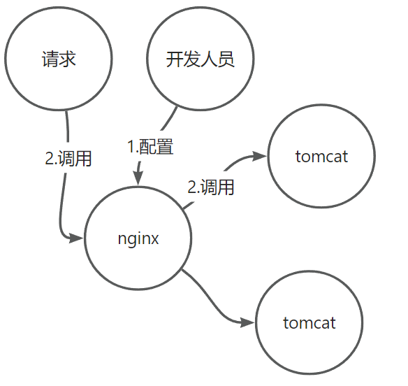


- **嵌入式代理模式**

​	例如：eureka-client

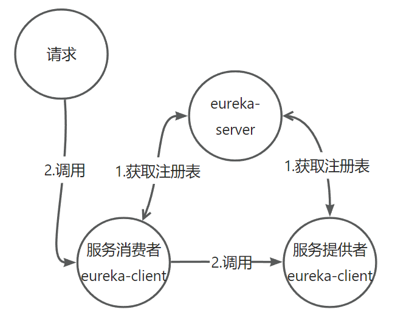

​	特点：

​		1、代码侵入，需引入jar包

​		2、绑定了语言

​		3、需基础架构组开发二方库


- 主机独立进程模式

  ServiceMesh

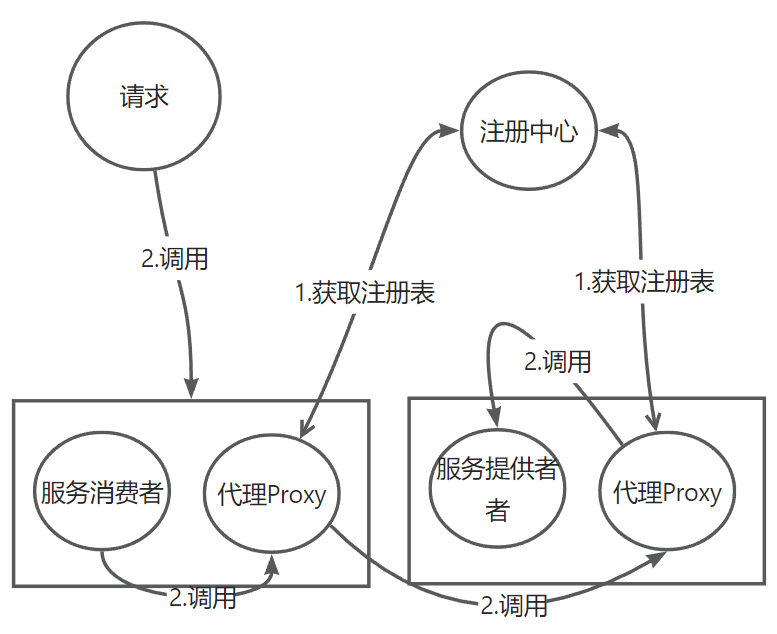

​	特点：

​		1、将服务注册与发现、负载均衡的逻辑沉淀到底层（与原来的服务进程脱钩，沉淀到进程中。SideCar模式）

​		2、服务间的调用通过 **代理Proxy** 进行调用


​	Service Mesh 的中文译为“服务网格”，是一个用于处理服务和服务之间通信的基础设施层，它负责为构建复杂的云原生应用传递可靠的网络请求，并为服务通信实现了微服务所需的基本组件功能，例如服务发现、负载均衡、监控、流量管理、访问控制等。在实践中，服务网格通常实现为一组和应用程序部署在一起的轻量级的网络代理，但对应用程序来说是透明的。

蓝色：SideCar，绿色：应用app

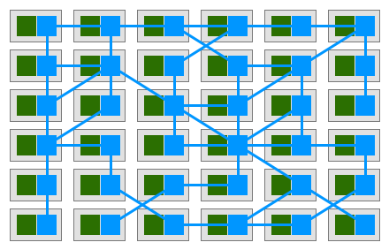

Service Mesh有四大特点：

- 治理能力独立（Sidecar）
- 应用程序无感知
- 服务通信的基础设施层
- 解耦应用程序的重试/超时、监控、追踪和服务发现

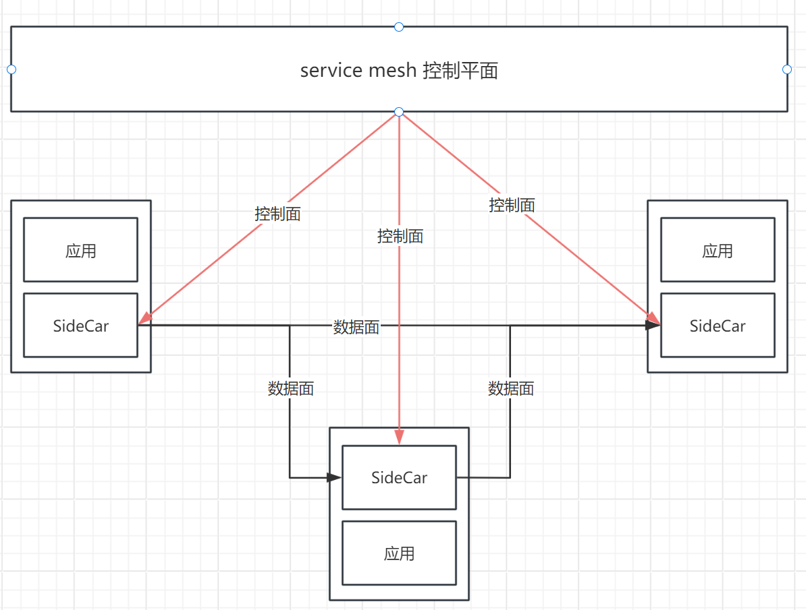

​	Service Mesh将业务模块和服务治理分开。控制面和数据面分离，应用在部署的时候，每个应用附带一个Side Car，这个Side Car是拦截每一个应用对外请求的。同时控制面的服务治理策略下到Side Car中具体的执行，即使业务模块升级和服务治理的升级也能互不影响，还能动态调整服务治理的规则和策略

服务治理的特点：

1、微服务治理与业务逻辑解耦：把大部分SDK能力从应用中剥离出来，并拆解为独立进程，以 sidecar 的模式进行部署。

2、异构系统的统一治理：方便多语言的实施，解锁升级带来的困难。

3、价值：

​	1）可观察性：服务网格捕获诸如来源、目的地、协议、URL、状态码、延迟、持续时间等线路数据；

​	2）流量控制：为服务提供智能路由、超时重试、熔断、故障注入、流量镜像等各种控制能力。

​	3）安全性高：服务的认证、服务间通讯的加密、安全相关策略的强制执行；

​	4）健壮性：支持故障注入，对于容灾和故障演练等健壮性检验帮助巨大。


**istio**

官网地址：https://istio.io/	

​	Istio由Google、IBM和Lyft在2017年5月合作推出，初始设计目标是在Kubernetes的基础上，以非侵入的方式为运行在集群中的微服务提供流量管理、安全加固、服务监控和策略管理等功能。有助于降低部署的复杂性，并减轻开发团队的压力。

​	Isito是Service Mesh的产品化落地，是目前最受欢迎的服务网格，功能丰富、成熟度高。它对Service Mesh完全支持，架构清晰，拆分数据面、控制面；拥有通信、安全、控制、观察等功能，实现开放，且插件化，多种可选实现。Istio可结合K8S使用，K8S提供服务生命周期的管理，Istio在K8S之上通过服务治理的整体的功能的实现。

主要有以下特点

- 连接（Connect）

   	- 流量管理
	- 负载均衡
   	- 灰度发布 

- 安全（Secure）

   	- 认证
   	- 鉴权
   
- 控制（Control）

   	- 限流
   	- ACL 
   
- 观察（Observe）

  	- 监控
	
	- 调用链

## 微服务与服务网格

**微服务-SpringCloud**（SpringCloud方式对代码是侵入式的；pom.xml；）

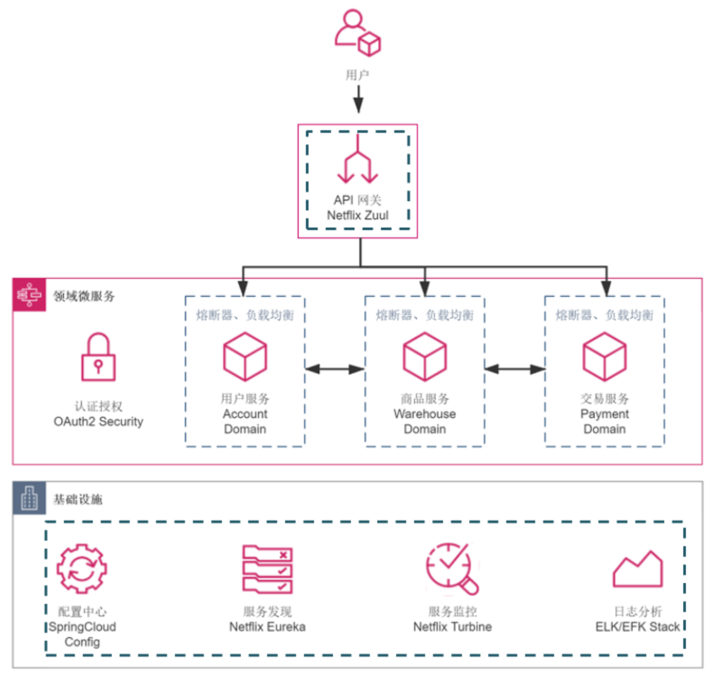

**容器编排（SpringCloud on Kubernetes）**

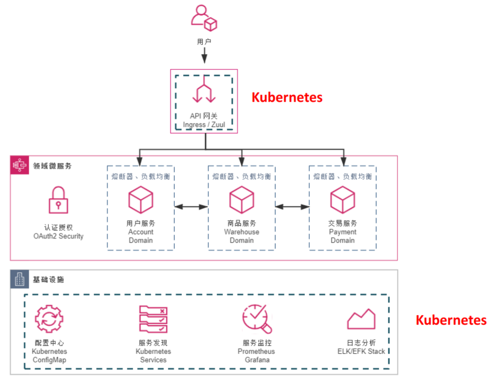

**结合服务网格（SpringCloud on Kubernetes & Istio）**

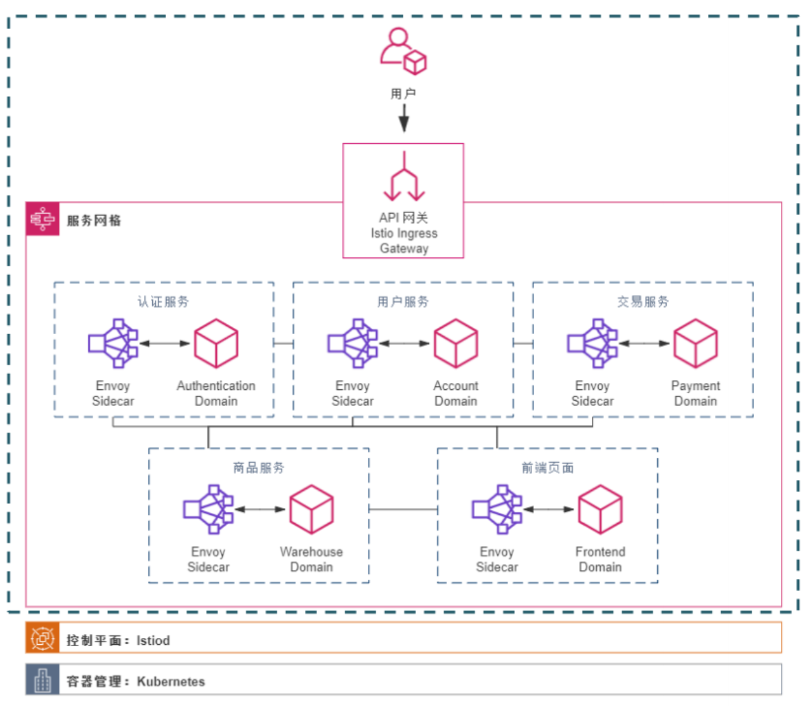

简单对比下 Spring Cloud 与服务网格的区别：

| 能力           | Spring Cloud 生态系统                                        | Service Mesh 生态系统                                        |
| -------------- | ------------------------------------------------------------ | ------------------------------------------------------------ |
| 服务注册与发现 | 开发简单方便，仅需一个简单的注解，支持多种注册中心。对开发人员来说，很容易在本地环境下完成编码和调试。 | **基于 K8s 的服务机制，并提供自己的注册中心。**开发人员需要理解 Kubernetes，而开发环境的设置并不容易。 |
| 故障容忍性     | `Resilience4j` 的官方整合提供了完整的故障容忍机制。但服务需要与 SDK 整合。 | 通过使用 sidecar 架构，它是一个非侵入式的故障容忍机制，对服务完全透明。 |
| 可观察性       | Spring Cloud 内置，例如 spring micro-meter、Zipkin 等。所有服务内部的指标、追踪和日志都可以轻松收集，对开发者完全透明。 | 通过 sidecar 机制，它可以监控进出通信。没有可观察的服务内部，服务追踪可能是不完整的。 |
| 流量调度       | Spring Cloud 仅有非常基础的流量调度，例如，它基于 Ribbon 的负载均衡（从上一版本中删除）。 | 更多的流量调度方案，如金丝雀部署、蓝绿部署都可以轻松完成。   |


## 架构与组件

Istio 在 1.5 版本开始，已经弃用了 Mixer，因此也就不再支持基于 Mixer 的 Quota 方式进行限流。从 Istio 1.5 版本开始，推荐使用 Envoy 原生的限流功能，或者使用其他的第三方限流插件。

目前 Envoy 支持种限流：全局和本地。

1. 全局限流依赖于外部 限流服务，envoy会通过 rpc 的方式进行调用限流服务，限流服务负责响应该请求是否被处理。
2. 本地限流粒度是每个服务，用于限制每个服务的请求速率。基于每个Envoy进程（sidecar）配置，即每个注入了Envoy代理的Pod。相比全局限流来说，本地限流的配置更简单，不需要额外的组件。

**全局限流**

全局限流的配置涉及两个部分：Envoy 的 rate_limits过滤器 和 限流服务的配置。

- rate_limits 过滤器中包含 actions 列表。Envoy 会尝试将每个请求与 rate_limits 过滤器中的每个 action 进行匹配。每个 action 会生成一个 descriptor 描述符。描述符是与 action 对应的一组描述符条目。每个描述符条目是一个键值对，通常表示为"descriptor-key-1": "descriptor-value-1"、"descriptor-key-2": "descriptor-value-2"等形式。相关配置参数 ：https://www.envoyproxy.io/docs/envoy/latest/configuration/http/http_filters/rate_limit_filter#config-http-filters-rate-limit

- 限流服务的配置则能够匹配每个请求所产生的描述符条目。针对特定的一组描述符条目，限流服务的配置能够指定其对应的请求速率限制。限流服务通过与Redis缓存交互来决定是否对请求进行限流，并将限流决策响应给Envoy代理。

**本地限流**

- 基于每个Envoy进程配置，即每个注入了Envoy代理的Pod。相比全局限流来说，本地限流的配置更简单，不需要额外的组件。**本地限流的优先级高于全局限流**，当同时使用本地速率限制器和全局速率限制器时，首先应用本地速率限制器进行限制，如果未达到本地速率限制，则应用全局速率限制器进行限制。示例场景如下：
- 假设本地限流对特定客户端IP的请求限制为每分钟50个请求，全局请求限制数为每分钟60个请求。客户端发送超过50个请求，则本地限流将拒绝该请求，即使全局限流尚未达到限制。
- 假设本地限流对特定客户端IP的请求限制为每分钟50个请求，全局请求限制数为每分钟40个请求。客户端发送超过40个请求，虽然未达到本地限流，但是已达到全局限流，因此该请求被拒绝。
- 本地限流如果有多个副本，则每个副本都有各自的速率限制器，也就是说如果您在一个副本上被限流，在另一个副本上可能不会被限流。

1.5版本之后的架构：

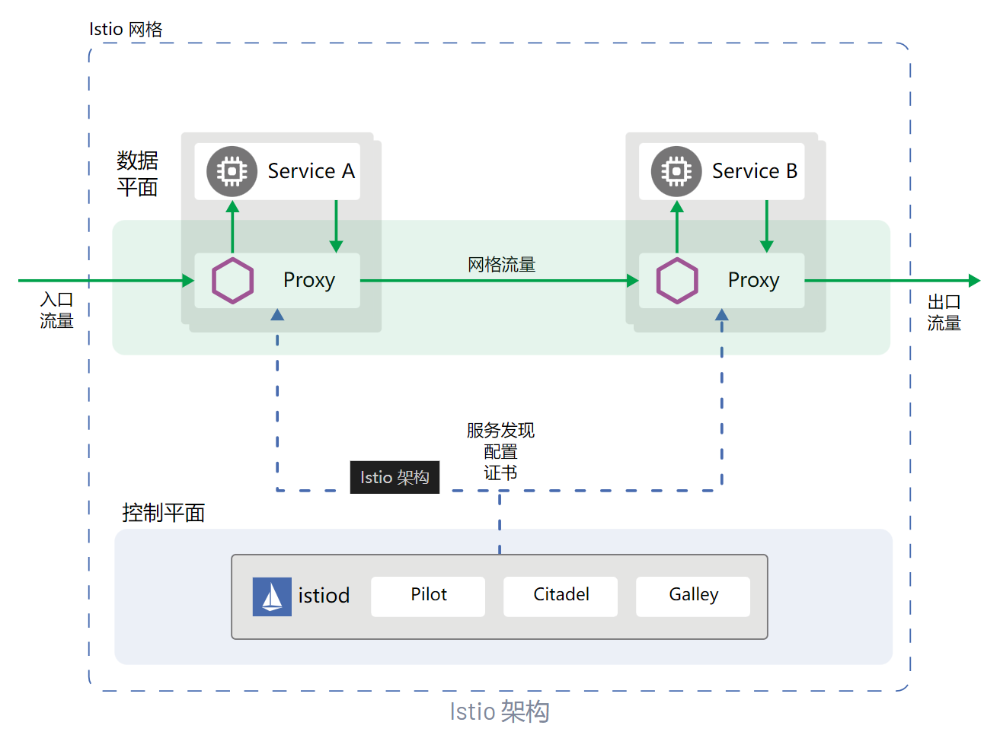

Istio = Istiod（控制平面）+ Envoy(为istio数据层面事实上的一个标准)

**控制平面：**主要包括Pilot、Citadel、Galley组件，主要功能是通过配置和管理Sidecar代理来进行流量控制，完成配置分发、服务发现、流量路由、授权鉴权等功能，以达到对数据平面的统一管理。控制平面不会直接解析请求数据包，通常提供 API 或者命令行工具可用于配置版本化管理，便于持续集成和部署。

**数据平面：**由一组和业务服务成对出现的Sidecar代理（Envoy）构成，这些代理以 Sidecar 的形式和应用服务一起部署，主要功能是接管服务的进出流量，负责协调和控制应用服务之间的所有网络通信。每一个 Sidecar 会接管**进入和离开**服务的流量，并配合控制平面完成流量控制等方面的功能。

总结一下，Service Mesh 具有的优点：

- 屏蔽分布式系统通信的复杂性（负载均衡、服务发现、认证授权、监控追踪、流量控制等等），服务只用关注业务逻辑

- 真正的语言无关，服务可以用任何语言编写，只需和 Service Mesh 通信即可

- 对应用透明，Service Mesh 组件可以单独升级


当然，Service Mesh 目前也面临一些挑战：

- Service Mesh 组件以代理模式计算并转发请求，一定程度上会降低通信系统性能，并增加系统资源开销

- Service Mesh 组件接管了网络流量，因此服务的整体稳定性依赖于 Service Mesh，同时额外引入的大量 Service Mesh 服务实例的运维和管理也是一个挑战


### Istiod

控制平面组件，具有服务发现、配置分发、证书配置的能力

Istiod 采用 YAML 编写的高级规则，并将其转换为 Envoy 的可操作配置。然后，它把这个配置传播给网格中的所有 sidecar。Istiod 内部的 Pilot 组件抽象出特定平台的服务发现机制（Kubernetes、Consul 或 VM），并将其转换为 sidecar 可以使用的标准格式。

#### Pliot

pliot是istio实现流量管理的组件，主要作用是配置和管理envoy代理

- pliot会将控制流量行为的路由规则转换为envoy的配置，并广播到envoy

- pliot可以把服务发现机制抽象出来转换成API分发给envoy，使envoy具有服务发现功能

主要任务有两个：

1. 从平台获取服务信息，完成服务发现
2. 获取istio各项配置，转换成envoy可读的格式分发下去

​        pliot不涉及业务逻辑层，而是作为一个适配器，如果有不同类型的配置格式，都可以转换成envoy可读的格式，避免了后期接入其他格式的配置而需要修改envoy。只需要修改pliot即可

#### Citadel

是个安全服务的组件，主要负责密钥和证书的管理。可以提供服务间和终端用户的身份认证，可以加密服务网格中的流量

#### Galley

是pilot中适配底层平台的功能独立的组件

是istio的配置管理组件，负责配置的获取，处理，分发。通过mcp（网格配置协议）与其他组件进行通信

负责将其余的Istio组件从底层平台（例如k8s）获取用户配置的细节隔离开来，从而将Pilot与底层平台进行解耦


### Envoy

​	Istio 使用 [Envoy](https://www.envoyproxy.io/) 代理的扩展版本。Envoy 是用 C++ 开发的高性能代理，用于协调服务网格中所有服务的入站和出站流量。Envoy 代理是唯一与数据平面流量交互的 Istio 组件。（envoy和nginx有点相似，可以用envoy代替nginx。但目前大多数公司常见服务选择用的更多的还是nginx）

Envoy 代理被部署为服务的 Sidecar，这种 Sidecar 部署允许 Istio 可以执行策略决策，并提取丰富的遥测数据， 接着将这些数据发送到监视系统以提供有关整个网格行为的信息。Sidecar 代理模型还允许您向现有的部署添加 Istio 功能，而不需要重新设计架构或重写代码。在逻辑上为服务增加了 Envoy 的许多内置特性：

- 动态服务发现
- 负载均衡
- TLS 终端
- HTTP/2 与 gRPC 代理
- 熔断器
- 健康检查
- 基于百分比流量分割的分阶段发布
- 故障注入
- 丰富的指标

​	

由 Envoy 代理启用的一些 Istio 的功能和任务包括：

- 流量控制功能：通过丰富的 HTTP、gRPC、WebSocket 和 TCP 流量路由规则来执行细粒度的流量控制。
- 网络弹性特性：重试设置、故障转移、熔断器和故障注入。
- 安全性和身份认证特性：执行安全性策略，并强制实行通过配置 API 定义的访问控制和速率限制。
- 基于 WebAssembly 的可插拔扩展模型，允许通过自定义策略执行和生成网格流量的遥测。


#### 核心能力

- **非侵入架构:** Envoy 是一个独立的进程，设计为伴随每个应用程序服务一起运行。所有 Envoy 实例形成一个透明的通信网格，每个应用程序通过 `localhost` 发送和接收消息，不需要知道网络拓扑。对服务的实现语言也完全无感知，这种模式也被称为 `Sidecar` 模式。

- **L3/L4 过滤器架构:**  Envoy 的核心是一个 L3/L4 层的网络代理。可插拔的过滤器链机制允许编写不同的 TCP/UDP 代理任务的过滤器，并将其插入到主服务器中。而且已经内置支持了各种任务的过滤器，例如原始 TCP 代理、UDP 代理、HTTP 代理、TLS 客户端证书身份验证、Redis、MongoDB、Postgres 等。

- **HTTP L7 过滤器架构:**  HTTP 是现代应用程序架构的关键组件，因此 Envoy 支持了一个额外的 HTTP L7 过滤器层。HTTP 过滤器可以被插入到 HTTP 连接管理子系统中，执行不同的任务，如缓存、速率限制、路由/转发、嗅探 Amazon 的 DynamoDB 等。

- **顶级的 HTTP/2 支持:**  在 HTTP 模式下运行时，Envoy 同时支持 HTTP/1.1 和 HTTP/2。Envoy 可以作为透明的 HTTP/1.1 到 HTTP/2 双向代理运行。这意味着可以连接任何组合的 HTTP/1.1 和 HTTP/2 客户端与目标服务器。*推荐的服务到服务配置在所有 Envoy 之间使用 HTTP/2 创建持久连接网格，请求和响应可以在该连接上进行多路复用。*

- **HTTP/3 支持（目前处于 alpha 版）:** 从 Envoy 1.19.0 版本开始，Envoy 现在支持上游和下游的 HTTP/3，而且可以在任何方向上进行 HTTP/1.1、HTTP/2 和 HTTP/3 之间的转换。

- **HTTP L7 路由:** 在 HTTP 模式下运行时，Envoy 支持路由子系统，该子系统能够根据路径、权限、内容类型、运行时值等路由和重定向请求。在使用 Envoy 作为前端/边缘代理时，此功能非常有用，但在构建服务到服务的网格时也可以利用它。`（似于nginx里的location）`

- **gRPC 支持:** gRPC 是 Google 的一个 RPC 框架，使用 HTTP/2 或更高版本作为底层多路复用传输。Envoy 支持用作 gRPC 请求和响应的路由和负载均衡基础所需的所有 HTTP/2 功能，这两个系统非常互补。

- **服务发现和动态配置:** Envoy 可以选择使用一组分层的动态配置 API 来进行集中管理。这些层向 Envoy 提供了关于后端集群中的主机、后端集群自身、HTTP 路由、监听套接字和加密材料的动态更新。对于更简单的部署，可以通过 DNS 解析（甚至完全跳过）来完成后端主机发现，并且进一步的层可以由静态配置文件替代。

  `这个服务发现和动态配置功能是envoy有别于nginx的一个重要能力。nginx不具备这个能力。对Nginx，如果你改了一个配置就要做一次nginx -s reload操作。如果配置比较大，或者应用服务比较多的话，那么nginx频繁去做reload，其性能还是有很大的一个损耗的。envoy不会，它原生就具有这个动态配置的能力。你修改过后，它就可以自动生效了`

- **健康检查:** 构建 Envoy 网格的推荐方法是将服务发现视为最终一致的过程。Envoy 包含一个健康检查子系统，可以选择对上游服务集群执行主动健康检查。然后，Envoy 使用服务发现和健康检查信息的结合来确定健康的负载均衡目标。Envoy 还通过异常值检测子系统支持被动健康检查。`(有点类似于k8s里的service endpoints。)`

- **高级负载均衡:** 分布式系统中不同组件之间的负载均衡是一个复杂的问题。由于 **Envoy 是一个独立的代理**而不是库，因此可以独立实现高级负载均衡以供任何应用程序访问。目前 Envoy 支持自动重试、熔断、通过外部速率限制服务进行全局速率限制、异常检测等。

- **前端/边缘代理支持:** 在边缘使用相同的软件有很大的好处（可观察性、管理、相同的服务发现和负载均衡算法等）。 Envoy 的功能集使其非常适合作为大多数现代 Web 应用程序用例的边缘代理。这包括 **TLS 终止**、HTTP/1.1、HTTP/2 和 HTTP/3 支持以及 HTTP L7 路由。

- **最佳的可观测性:** 如上所述，Envoy 的主要目标是使网络透明化。但是，问题在网络层面和应用层面都可能会出现。Envoy 为所有子系统提供了强大的统计支持。目前支持的统计数据输出端是 `statsd`（以及兼容的提供程序），但是接入其他不同的统计数据输出端并不困难。统计数据也可以通过管理端口进行查看，Envoy 还支持通过第三方提供者进行分布式跟踪。


#### 常用术语

在介绍 Envoy 架构之前，有必要先介绍一些常用的术语定义，这些术语贯穿整个 Envoy 的架构设计。

- **Host(主机):** 能够进行网络通信的实体（手机、服务器等上的应用程序）。在 Envoy 中主机是逻辑网络应用程序。一个物理硬件可能运行多个主机，只要每个主机可以独立进行寻址。

- **Downstream(下游):** 下游主机连接到 Envoy，发送请求并接收响应。 （类似客户端）

- **Upstream(上游):** 上游主机接收来自 Envoy 的连接和请求并返回响应。（类似服务端）

- **Listener(侦听器):** 侦听器是一个带有名称的网络位置（例如端口、unix domain socket 等），下游客户端可以连接到该位置。Envoy 暴露一个或多个监听器，供下游主机连接。

- **Cluster(集群):** 一个集群是一组逻辑上相似的上游主机，Envoy 连接到这些主机。Envoy 通过**服务发现**来发现集群的成员。它还可以通过**主动健康检查**来确定集群成员的健康状况。Envoy 根据**负载均衡策略**确定将请求路由到哪个集群成员。

- **Mesh(网格):** 一组主机协同工作，提供一致的网络拓扑结构。在这里 `Envoy Mesh` 是指一组 Envoy 代理，它们构成了由多种不同服务和应用程序平台组成的分布式系统的消息传递基础。

- **Runtime configuration(运行时配置):** 与 Envoy 一起部署的**实时配置系统**。可以更改配置设置，影响操作而无需重新启动 Envoy 或更改主要配置。


#### 架构设计

Envoy 采用单进程多线程架构。一个独立的 `primary` 线程负责控制各种零散的协调任务，而一些 `worker` 线程则负责执行监听、过滤和转发任务。一旦侦听器接受连接，该连接就会将其生命周期绑定到一个单独的 `worker` 线程。这使得 Envoy 的大部分工作基本上是单线程来处理的，只有少量更复杂的代码处理工作线程之间的协调。

通常情况下 Envoy 实现了 100% 非阻塞。对于大多数工作负载，我们建议将 `worker` 线程的数量配置为机器上的硬件线程数量。

整体架构：

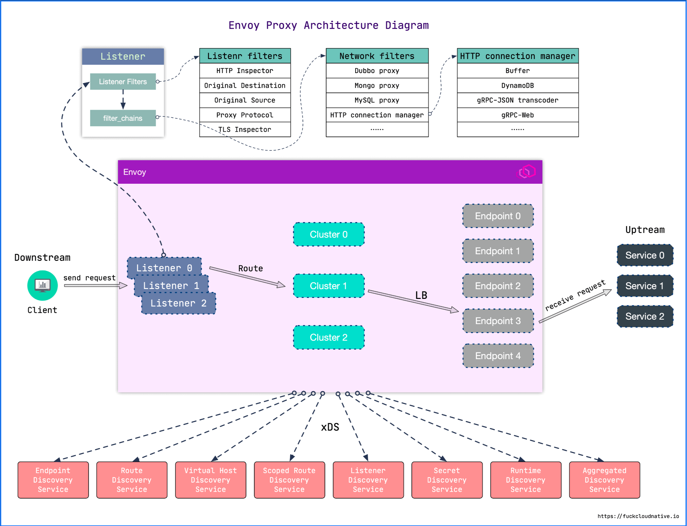

Envoy 进程中运行着一系列 Inbound/Outbound 监听器（Listener），Inbound 代理入站流量，Outbound 代理出站流量。Listener 的核心就是过滤器链（FilterChain），**链中每个过滤器都能够控制流量的处理流程**。

Envoy 接收到请求后，会先走 `FilterChain`，通过各种 L3/L4/L7 Filter 对请求进行处理，然后再路由到指定的集群，并通过负载均衡获取一个目标地址，最后再转发出去。

其中每一个环节可以静态配置，也可以动态服务发现，也就是所谓的 `xDS`，这里的 `x` 是一个代词，是 `lds`、`rds`、`cds`、`eds`、`sds` 的总称，即服务发现，后 2 个字母 `ds` 就是 `discovery service`。


# 安装

Istio 提供了 Helm、Operator 和 istioctl 三种安装方式，其中 istioctl 也是基于 Operator 模式安装，在其基础上根据应用场景提供了许多预定制的功能，有助于防止安装错误，可以在预定制的基础上，通过`--set`参数覆盖任何的预定制安装配置。

**单集群**

这里使用官方推荐的istioctl方式进行安装，官方：https://istio.io/latest/zh/docs/setup/install/istioctl/

## 前置条件

- 初始化 [平台安装环境](https://istio.io/latest/zh/docs/setup/platform-setup/)。例如，Kind 环境，需要提前安装 Docker，创建至少2个节点的 Kubernetes 集群；
- 检查 [Pod 和 服务的要求](https://istio.io/latest/zh/docs/ops/deployment/requirements/)。例如，服务的端口号不能和 Sidecar 的端口（150XX）冲突，不能使用 `1337`用户运行应用等；

## 下载istio

```bash
# 下载最新版
$ curl -L https://istio.io/downloadIstio | sh -

# 可以指定环境变更，来下载指定版本 和 CPU架构的版本
$ curl -L https://istio.io/downloadIstio | ISTIO_VERSION=1.16.2 TARGET_ARCH=x86_64 sh -
```

```bash
# 转到 Istio 安装包目录
cd istio-1.16.2
# 安装目录包含：
# samples/：示例应用程序；
# bin/：istioctl 客户端二进制文件；

# 将 istioctl客户端添加到PATH环境变量
export PATH=$PWD/bin:$PATH
```

```bash
# 查看版本
$ istioctl version
client version: 1.14.3

# 查看配置档
$ istioctl profile list
Istio configuration profiles:
    default
    demo
    empty
    external
    minimal
    openshift
    preview
    remote

```

```bash
default：根据 IstioOperator API 的默认设置来启用组件。 建议用于生产部署和多集群网格 中的主集群。您可以运行 istioctl profile dump 命令来查看默认设置。
demo：这一配置具有适度的资源需求，旨在展示 Istio 的功能。 它适合运行 Bookinfo 应用程序和相关任务。 这是通过快速开始指导安装的配置。
remote：用于配置一个从集群， 这个从集群由外部控制平面管理， 或者由多集群网格的 主集群中的控制平面管理。
empty：不部署任何内容。可以作为自定义配置的基本配置文件。
preview：预览文件包含的功能都属于实验性阶段。该配置文件是为了探索 Istio 的新功能。 确保稳定性、安全性和性能（使用风险需自负）。
ambient：Ambient 配置文件旨在帮助您开始使用 Ambient Mesh。
```

## 安装 demo 配置档

```shell
$ istioctl install --set profile=demo -y
```

通过`profile`选项安装不同的配置档。

## 安装 `default` 配置档

```shell
$ istioctl install
```

上面命令默认使用`default`配置档。可以通过`--set`参数配置各种选项来修改默认安装，比如，要启用访问日志：

```shell
$ istioctl install --set meshConfig.accessLogFile=/dev/stdout
```

也可以使用`-f`传递一个配置文件来覆盖默认的安装配置，在生产环境推荐使用配置文件的方式。下面使用配置文件的形式和`--set`的效果是等价的：

```shell
$ cat <<EOF > ./my-config.yaml
apiVersion: install.istio.io/v1alpha1
kind: IstioOperator
spec:
  meshConfig:
    accessLogFile: /dev/stdout
EOF
$ istioctl install -f my-config.yaml
```

完整的安装配置选项可参考 IstioOperator API：https://istio.io/latest/zh/docs/reference/config/istio.operator.v1alpha1/


## 检查安装状态

Istio 所有组件默认安装在`istio-system`命名空间中。

```shell
$ kubectl get deployment -n istio-system
NAME                                   READY   UP-TO-DATE   AVAILABLE   AGE
deployment.apps/istio-egressgateway    1/1     1            1           19h
deployment.apps/istio-ingressgateway   1/1     1            1           19h
deployment.apps/istiod                 1/1     1            1           19h

● istio-egressgateway：负责处理出站流量；
● istio-ingressgateway：负责处理入站流量；
● istiod：负责服务发现、管理配置 和 TLS 证书；
```

安装完成后，istioctl 会将安装的状态信息保存到 IstioOperator 对象的一个名为`installed-state`的实例中，通过该对象可以确认 Istio 都安装了什么。

```shell
# 文件较大，这里不展示，可自行查看
$ kubectl get istiooperators.install.istio.io -n istio-system installed-state -oyaml
```

注意：istioctl 命令 依赖 installed-state CR 用于执行检查任务，不能删除。

## 卸载 

```shell
$ istioctl uninstall --purge

# uninstall 命令默认不会移除 istio-system 命名空间
$ kubectl delete namespace istio-system
```

可选的 `--purge` 参数将移除所有 Istio 资源，包括可能被其他 Istio 控制平面共享的、集群范围的资源。

## 初试

istio 支持自动注入和手动注入两种方式：

- 手动注入：可以使用 `istioctl kube-inject`手动给 deploy 注入，会修改对应的 deploy 的配置（init containers，images 等）；
- 自动注入：给要注入的 namespace 打标：`kubectl label namespace default istio-inhection=enabled`，之后任何创建在该 NS 下的 pod 会自动注入 sidecar。自动注入通过 k8s Admission webhook 实现，监听到 create pod 的操作 k8s API server 的行为之后，会自动执行 inject 逻辑。

自动注入：

```shell
# 给命名空间打标签，这里用default
kubectl label namespace default istio-inhection=enabled
```

```bash
# 快速启动一个测试容器，包含有各种测试命令，ping，curl
kubectl run client-$RANDOM --image=ikubernetes/admin-box:v1.2 --restart=Never -it --rm --command -- /bin/bash

# 启动之后可以看到启动了一个pod，里面有两个容器
kubectl get po
NAME           READY   STATUS    RESTARTS   AGE
client-14273   2/2     Running   0          37s

```


# 部署 Bookinfo 应用

安装官方提供的一个非常经典的 [Bookinfo 应用示例](https://github.com/istio/istio/tree/master/samples/bookinfo/)，这个示例部署了一个用于演示多种 Istio 特性的应用，该应用由四个单独的微服务构成。 这个应用模仿在线书店的一个分类，显示一本书的信息。页面上会显示一本书的描述，书籍的细节（ISBN、页数等），以及关于这本书的一些评论。

Bookinfo 应用分为四个独立的微服务：

- **productpage**：这个微服务会调用 **details** 和 **reviews** 两个微服务，用来生成页面。使用 **Python** 开发。
- **details**：这个微服务中包含了书籍的信息。使用 **Ruby** 开发。
- **reviews**：这个微服务中包含了书籍相关的评论。它还会调用 **ratings** 微服务。使用 **Java** 开发。
- **ratings**：这个微服务中包含了由书籍评价组成的 **评级** 信息。使用 **NodeJS** 开发。

**reviews** 微服务有 **3** 个版本：

- v1 版本 **不会** 调用 **ratings** 服务。
- v2 版本 **会** 调用 **ratings** 服务，并使用 1 到 5 个**黑色星形**图标来显示评分信息。
- v3 版本 **会** 调用 **ratings** 服务，并使用 1 到 5 个**红色星形**图标来显示评分信息。

架构：

Bookinfo 应用中的几个微服务是由不同的语言编写的。 这些服务对 Istio 并无依赖，但是构成了一个有代表性的服务网格的例子：它由多个服务、多个语言构成，并且 reviews 服务具有多个版本。

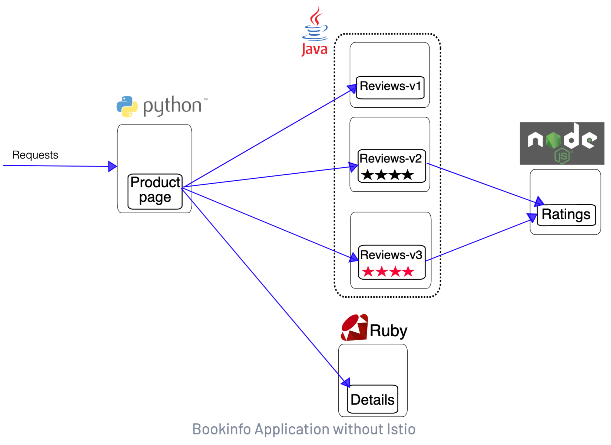


部署：

进入 Istio 安装目录。为 `default` 命名空间打上标签`istio-injection=enabled`，由 Istio 自动为该命名空间的 Pod 注入 Sidecar。

```bash
kubectl label namespace default istio-injection=enabled

# 安装bookinfo，有的镜像比较大需要等一段时间
kubectl apply -f samples/bookinfo/platform/kube/bookinfo.yaml
```

如果安装 Istio 时禁用了自动注入 Sidecar 的功能，可以使用 `istioctl kube-inject`命令手动注入：

```
kubectl apply -f <(istioctl kube-inject -f samples/bookinfo/platform/kube/bookinfo.yaml)
```

部署完成之后，查看资源

```bash
$ kubectl get po,svc 
NAME                                  READY   STATUS    RESTARTS   AGE
pod/details-v1-7f4669bdd9-tcnkw       2/2     Running   0          47m
pod/productpage-v1-5586c4d4ff-rmghs   2/2     Running   0          47m
pod/ratings-v1-6cf6bc7c85-stqxp       2/2     Running   0          47m
pod/reviews-v1-7598cc9867-777th       2/2     Running   0          47m
pod/reviews-v2-6bdd859457-87rkn       2/2     Running   0          47m
pod/reviews-v3-6c98f9d7d7-fg4dl       2/2     Running   0          47m

NAME                  TYPE        CLUSTER-IP       EXTERNAL-IP   PORT(S)    AGE
service/details       ClusterIP   10.105.124.133   <none>        9080/TCP   47m
service/kubernetes    ClusterIP   10.96.0.1        <none>        443/TCP    23d
service/productpage   ClusterIP   10.96.211.111    <none>        9080/TCP   47m
service/ratings       ClusterIP   10.107.54.41     <none>        9080/TCP   47m
service/reviews       ClusterIP   10.104.223.154   <none>        9080/TCP   47m

```

确认 Bookinfo 应用是否运行正常

在其中一个 Pod 中用 curl 命令对应用发送请求，例如：从 `ratings`服务向`productpage`服务发送请求：

```bash
$ kubectl exec -it $(kubectl get pod -l app=ratings -o jsonpath='{.items[0].metadata.name}') -c ratings -- curl productpage:9080/productpage | grep -o "<title>.*</title>"
<title>Simple Bookstore App</title>
```

更改名为productpage的svc的模式为nodeport，然后直接访问对应的端口：http://192.168.9.30:30991/productpage

```bash
# kubectl get svc
NAME          TYPE        CLUSTER-IP       EXTERNAL-IP   PORT(S)          AGE
details       ClusterIP   10.105.124.133   <none>        9080/TCP         3h8m
kubernetes    ClusterIP   10.96.0.1        <none>        443/TCP          23d
productpage   NodePort    10.96.211.111    <none>        9080:30991/TCP   3h8m
ratings       ClusterIP   10.107.54.41     <none>        9080/TCP         3h8m
reviews       ClusterIP   10.104.223.154   <none>        9080/TCP         3h8m
```


# 流量治理

Istio 的流量路由规则可以轻松地控制服务之间的流量和 API 调用。Istio 简化了服务级别属性(如**断路器、超时和重试**)的配置，并使设置重要任务(如 **A/B 测试**、**canary** 部署和基于百分比的**流量分割**的分阶段部署)变得容易。 它还提供了开箱即用的**故障恢复**特性，帮助您的应用程序更健壮地应对依赖服务或网络的故障。


## 网关Gateway与VirtualService

外部流量访问流向

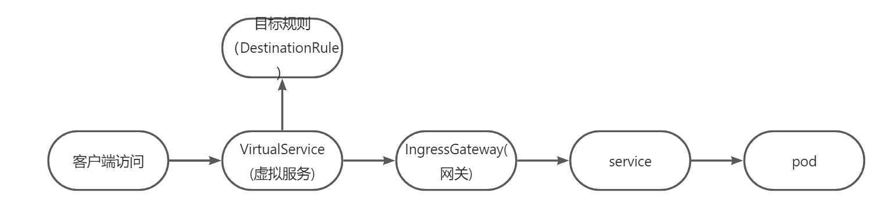

内部访问外部流向

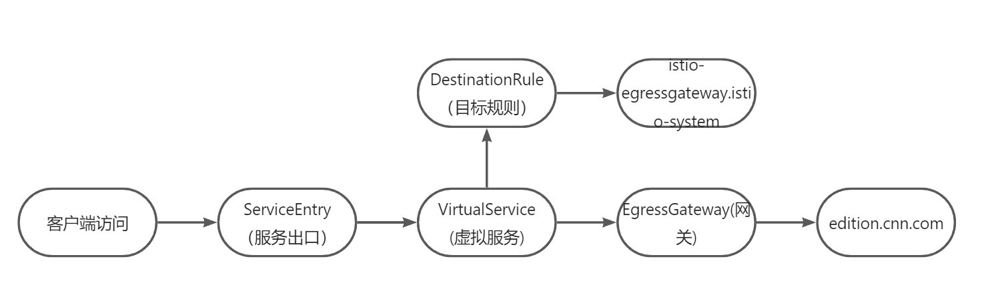

流量入口出口

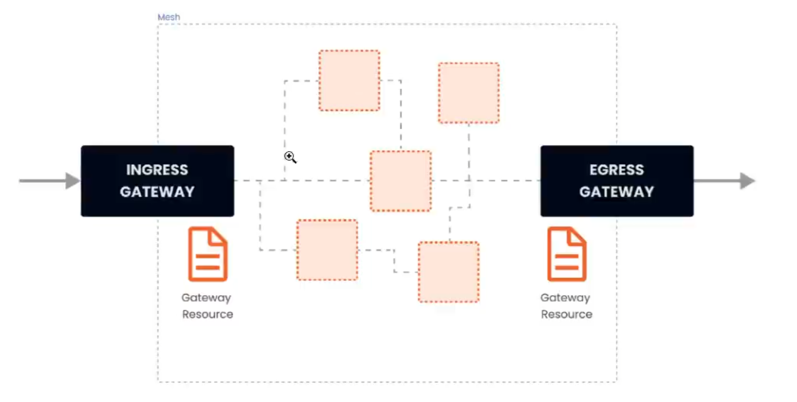

流量路由

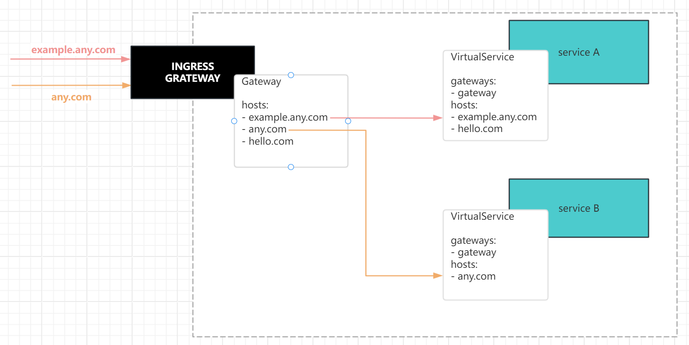


以Bookinfo 应用为例，部署到网关中，以便外部可以通过浏览器访问。

```bash
# 部署网关，文件位置：/samples/bookinfo/networking/
$ kubectl apply -f /opt/istio-1.14.3/samples/bookinfo/networking/bookinfo-gateway.yaml

# 确认部署结果，可以看到生成一个gateway与virtualservice
$ kubectl get gw
[root@k8s-master1 networking]# kubectl get gw,vs
NAME                                           AGE
gateway.networking.istio.io/bookinfo-gateway   13s

NAME                                             GATEWAYS               HOSTS             AGE
virtualservice.networking.istio.io/bookinfo      ["bookinfo-gateway"]   ["*"]             13s

```

bookinfo-gateway.yaml文件看详细信息

```bash
$ cat /opt/istio-1.14.3/samples/bookinfo/networking/bookinfo-gateway.yaml
apiVersion: networking.istio.io/v1alpha3
kind: Gateway   # 创建了一个Gateway网关资源
metadata:
  name: bookinfo-gateway
spec:
  selector:
    istio: ingressgateway # 使用的istio 默认的 controller
  servers:
  - port:
      number: 80
      name: http
      protocol: HTTP
    hosts:
    - "*"            # 指定的域名或者ip
---
apiVersion: networking.istio.io/v1alpha3
kind: VirtualService   # 对应创建了一个VirtualService
metadata:
  name: bookinfo
spec:
  hosts:            # 定义路由规则关联的一组hosts，可以是带有通配符的DNS或IP，也可以是service(跨命名空间要写全)
  - "*"
  gateways:
  - bookinfo-gateway      # 流量来源于哪个网关，可以是多个
  http:
  - match:         # 匹配规则
    - uri:
        exact: /productpage
    - uri:
        prefix: /static
    - uri:
        exact: /login
    - uri:
        exact: /logout
    - uri:
        prefix: /api/v1/products
    route:                      # 路由目标
    - destination:
        host: productpage       # 对应bookinfo的的svc
        port:
          number: 9080
       	# subset: v1            # 配置路由策略将流量转发到不同版本的subet上，应用于灰度发布
      # weight: 80              # 流量路由的权重
```

获取网关访问URL

查看istio-system的svc：istio-ingressgateway的状态

```bash
kubectl get svc -n istio-system
NAME                   TYPE           CLUSTER-IP       EXTERNAL-IP   PORT(S)                                                                      AGE
istio-egressgateway    ClusterIP      10.99.111.212    <none>        80/TCP,443/TCP                                                               22h
istio-ingressgateway   LoadBalancer   10.105.241.112   <pending>     15021:30629/TCP,80:31330/TCP,443:30085/TCP,31400:32249/TCP,15443:32453/TCP   22h
istiod                 ClusterIP      10.109.222.195   <none>        15010/TCP,15012/TCP,443/TCP,15014/TCP                                        22h

```

Istio 网关本质是通过 LoadBalancer 类型的 Service 通过一个”公网“IP对外暴露绑定到 Gateway 的服务，istio ingress Service 接收到请求后，根据路由规则，将请求转发到后端的 Pod 服务中。

如果EXTERNAL-IP字段是pending状态，表示本地没有负载均衡器ip（公有云服务器才有）则：

官网都有说明：https://istio.io/v1.14/docs/setup/getting-started/

```bash
# 获取到流量入口端口，这里就是31330
export INGRESS_PORT=$(kubectl -n istio-system get service istio-ingressgateway -o jsonpath='{.spec.ports[?(@.name=="http2")].nodePort}')
export SECURE_INGRESS_PORT=$(kubectl -n istio-system get service istio-ingressgateway -o jsonpath='{.spec.ports[?(@.name=="https")].nodePort}')

# 获取工作节点ip
export INGRESS_HOST=$(kubectl get po -l istio=ingressgateway -n istio-system -o jsonpath='{.items[0].status.hostIP}')
```

如果有EXTERNAL-IP字段，则：

```bash
# 获取端口
export INGRESS_PORT=$(kubectl -n istio-system get service istio-ingressgateway -o jsonpath='{.spec.ports[?(@.name=="http2")].port}')
export SECURE_INGRESS_PORT=$(kubectl -n istio-system get service istio-ingressgateway -o jsonpath='{.spec.ports[?(@.name=="https")].port}')

# 获取到worker node的ip
export INGRESS_HOST=$(kubectl -n istio-system get service istio-ingressgateway -o jsonpath='{.status.loadBalancer.ingress[0].ip}')
```

往下继续，拼接查看访问的地址端口

```bash
export GATEWAY_URL=$INGRESS_HOST:$INGRESS_PORT
echo "$GATEWAY_URL"
echo "http://$GATEWAY_URL/productpage"
```

然后在浏览器访问即可

如果刷新几次应用的页面，就会看到 **productpage** 页面中会随机展示 **reviews** 服务的不同版本的效果（**红色**、**黑色**的星形或者**没有**显示）。**reviews** 服务出现这种情况是因为我们还没有使用 Istio 来控制版本的路由。


## **DestinationRule**

DestinationRule 对象是 VirtualService 路由生效后，配置应用与请求的策略集，用来将 VirtualService 中指定的 subset 与对应的 Pod 关联起来。

可以将VirtualService视为将流量如何路由到给定目标地址， 然后使用目标规则来配置该目标的流量。在评估虚拟服务路由规则之后， 目标规则将应用于流量的“真实”目标地址。

配置示例解释：

```yaml
apiVersion: networking.istio.io/v1alpha3
kind: DestinationRule         # 定义DestinationRule 资源
metadata:
  name: reviews
spec:
  host: my_svc       # 配置的service名称，如是跨空间需写全地址
  subsets:           # 定义服务的版本，可通过标签键值对匹配服务中的Endpoints
  - name: v1         # 对应VirtualService中配置的subset: v1
    labels:          # 匹配标签
      version: v1
  - name: v2
    labels:
      version: v2
  - name: v3
    labels:
      version: v3
```

### 负载均衡器配置(loadBalancer)

配置示例：

```yaml
apiVersion: networking.istio.io/v1alpha3
kind: DestinationRule         # 定义DestinationRule 资源
metadata:
  name: my_name
spec:
  host: my_svc       # 配置的service名称，如是跨空间需写全地址
  trafficPolicy:   # 流量策略：负载均衡(loadBalancer)、连接池(connectionPool)、健康检查(outlierDeletion)、TLS策略
    loadBalancer:  # 负载均衡
      simple: RANDOM   # 随机算法
  subsets:           # 定义服务的版本，可通过标签键值对匹配服务中的Endpoints
  - name: v1         # 对应VirtualService中配置的subset: v1
    labels:
      version: v1
  - name: v2
    labels:
      version: v2
  - name: v3
    labels:
      version: v3
```

有两类：simple，consistentHash

**simple字段**：提供的负载均衡算法如下

- ROUND_ROBIN：轮询算法，如果未指定，则默认采用这种算法。
- LEAST_CONN：最少连接算法，算法实现是从两个随机选择的服务后端选择一个活动请求数较少 的后端实例。
- RANDOM：从可用的健康实例中随机选择一个。
- PASSTHROUGH：直接转发连接到客户端连接的目标地址，即没有做负载均衡。

**consistentHash字段**：一致性hash，并根据 HTTP 头、cookies 或其他请求属性提供会话亲和性。

- httpHeaderName:：基于Header.
- httpCookie：基于Cookie。
- useSourcelp：基于源IP计算哈希值。
- minimumRingSize：哈希环上虚拟节点数的最小值，节点数越多则负载均衡越精细。

```yaml
......
spec:
  host: my_svc       # 配置的service名称，如是跨空间需写全地址
  trafficPolicy:   # 流量策略：负载均衡(loadBalancer)、连接池(connectionPool)、健康检查(outlierDelection)、TLS策略
    loadBalancer:
      consistentHash:  # 负载均衡
        httpCookie:    # 基于cookie做hash
          name: location   
          ttl: 4s
......
```


### 连接池配置(connectionPool)

可以在 TCP 和 HTTP 层面应用于上游服务的每个主机，我们可以用它们来控制连接量

**TCP连接池配置**

- maxConnections:上游服务的所有实例建立的最大连接数，默认是 1024，属于 TCP层的配置，对于 HTTP，只用于 HTTP/1.1，因为 HTTP/2对每个主机都使用单个连接。
- connectTimeout:TCP连接超时，表示主机网络连接超时，可以改善因调用服务变慢导致整个链路E变慢的情况。

- tcpKeepalive:设置TCP keepalives，是lstio1.1新支持的配置，定期给对端发送一个keepalive的探测包，判断连接是否可用。

  ```yaml
  ......
  spec:
    host: my_svc       # 配置的service名称，如是跨空间需写全地址
    trafficPolicy:
      connectionPool:
        tcp:
          maxConnections: 50
          connectTimeout: 50ms
          tcpKeepalive:   # 探针
            probes: 5s   
            time: 3600
            tnterval: 60s    
  ......
  ```

**HTTP连接池配置**

- http1MaxPendingRequests：最大等待 HTTP 请求数，默认值是 1024，只适用于HTTP/1.1的服务，因为 HTTP/2 协议的请求在到来时会立即复用连接，不会在连接池等待。
- http2MaxRequests：最大请求数，默认是1024。只适用于HTTP/2服务，因为HTTP/1.1使用最大连接数maxConnections即可，表示上游服务的所有实例处理的最大请求数
- maxRequestsPerConnection：每个连接的最大请求数。HTTP/1.1和HTTP/2连接池都遵循此参数。如果没有设置，则没有限制。设置为1时表示每个连接只处理一个请求，也就是禁用了Keep-alive
- maxRetries：最大重试次数，默认是3，表示服务可以执行的最大重试次数。如果调用端因为偶尔抖动导致请求直接失败，则可能会带来业务损失，一般建议配置重试，若重试成功则可正常返回数据，只不过比原来响应得慢一点，但重试次数太多会影响性能，要谨使用。idleTimeout:空闲超时，定义在多长时间内没有活动请求则关闭连接。

http可以和tcp配置使用，示例:

```yaml
......
spec:
  host: my_svc       # 配置的service名称，如是跨空间需写全地址
  trafficPolicy:
    connectionPool:
      tcp:
        maxConnections: 80     # 配置最大80个连接
        connectTimeout: 25ms   # 连接超时时间
      http:
        http2MaxRequests: 800    # 只允许最多有800个并发请求
        maxRequestsPerConnection: 10  # 每个连接的请求数不超过10个
......
```


### 异常点检测(outlierDelection)

异常点检测是一个断路器的实现，它跟踪上游服务中每个主机(Pod)的状态。如果一个主机开始返回5xx HTTP 错误，它就会在预定的时间内被从负载均衡池中弹出。对于 TCP 服务，Envoy 将连接超时或失败计算为错误。

两种健康检查:

- 主动型的健康检查：定期探测目标服务实例，根据应答来判断服务实例的健康状态。如负载均衡器中的健康检查
- 被动型的健康检查：通过实际的访问情况来找出不健康的实例，如isito中的异常点检查

异常实例检查相关的配置:

- consecutiveErrors：实例被驱逐前的连续错误次数，默认是 5。对于 HTTP 服务，返回 502、503 和504 的请求会被认为异常;对于 TCP 服务，连接超时或者连接错误事件会被认为异常。
- interval：驱逐的时间间隔，默认值为10秒，要求大于1毫秒，单位可以是时、分、毫秒。
- baseEjectionTime：最小驱逐时间。一个实例被驱逐的时间等于这个最小驱逐时间乘以驱逐的次数。这样一个因多次异常被驱逐的实例，被驱逐的时间会越来越长。默认值为30秒，要求大于1毫秒，单 位可以是时、分、毫秒。
- maxEjectionPercent：指负载均衡池中可以被驱逐的故障实例的最大比例，默认是10%，设置这个值是为了避免太多的服务实例被驱逐导致服务整体能力下降。
- minHealthPercent:最小健康实例比例，是lstio 1.1新增的配置。当负载均衡池中的健康实例数的 例大于这个比例时，异常点检查机制可用;当可用实例数的比例小于这个比例时，异常点检查功能将被禁用，所有服务实例不管被认定为健康还是不健康，都可以接收请求。参数的默认值为50%

下面举一个例子：设置了 800 个并发的 HTTP2 请求(http2MaxRequests)的限制，每个连接不超过10个请求(maxRequestsPerConnection) 到该服务。每5分钟扫描一次上游主机(Pod)(interval)，如果其中任何一个主机连续失败10次(contracticalErrors)，Envoy 会将其弹出 10 分钟(baseEjectionTime)。

```yaml
......
  trafficPolicy:
    connectionPool:
      http:
        http2MaxRequests: 800    # 只允许最多有800个并发请求
        maxRequestsPerConnection: 10   # 每个连接的请求数不超过10个
      outlierDelection:
        consecutiveErrors: 10     # 连续失败10次
        interval: 5m              # 每5分钟扫描一次
        baseEjectionTime: 10m     # 将其弹出 10 分钟(baseEjectionTime)
......
```


### 端口流量策略(port)

在端口上配置流量策略，且端口上流量策略会覆盖全局的流量策略。关于配置方法与TrafficPolicy没有大差别，一个关键的差别字段就是 port。

示例：

```yaml
......
spec:
  host: my_svc       # 配置的service名称，如是跨空间需写全地址
  trafficPolicy:
    connectionPool:
      tcp:
        maxConnections: 50
    portLevelSettings:
    - port:
        number: 80
      loadBalancer:
        simple: LEAST_CONN
      connectionPool:
        tcp:
          maxConnections: 50
    - port:
        number: 8080
      loadBalancer:
        simple: ROUND_ROBIN
```


### 服务子集(Subset)

Subset，定义服务的子集。

属性:

- name：Subset的名字，为必选字段。通过VirtualService引用的就是这个名字
- labels：Subset上的标签，通过一组标签定义了属于这个Subset的服务实例。比如最常用的标识服务版本的Version标签。
- trafficPolicy：应用到这个Subset上的流量策略。

示例：

```yaml
apiVersion: networking.istio.io/v1alpha3
kind: DestinationRule
metadata:
  name: my_name
spec:
  host: my_svc
  subsets:
  - name: v1
    labels:
      version: v1
    trafficPolicy:
      tcp:
        maxConnections: 50       # 给一个特定的subset配置的d
```


### TLS设置(tls)

包含任何与上游服务连接的TLS相关设置。下面是一个使用提供的证书配置mTLS的例子：
mtls: 双向认证，客户机和服务器都通过证书颁发机构彼此验证身份

```yaml
......
  trafficPolicy:
    tls:
      mode: MUTUAL
      clientCertificate: /etc/certs/cert.pem
      privateKey: /etc/certs/key.pem
      caCertificate: /etc/certs/ca.pem
......
```

由同一个 root ca 生成两套证书，即客户端证书和服务端证书。客户端使用 https 访问服务端时，双方会交换证书，并进行认证，认证通过方可通信。

其他支持的 TLS 模式有 DISABLE(没有 TLS 连接)，SIMPLE(在上游端点发起 TLS 连接)，以及ISTIO MUTUAL(与MUTUAL 类似，使用Istio 的 mTLS 证书)。


## 流量限流熔断

​	**熔断**是创建弹性微服务应用程序的重要模式，熔断能够使应用程序具备应对来自故障、潜在峰值和其他未知网络因素影响的能力。服务熔断是应对微服务雪崩效应的一种链路保护机制，类似股市、保险丝。微服务之间的数据交互是通过远程调用来完成的，服务 A 调用服务 B，服务 B 调用服务 C，某一时间链路上对服务 C 的调用响应时间过长或者服务 C 不可用，随着时间的增长，对服务 C 的调用也越来越多，然后服务 C 崩溃了，但是链路调用还在，对服务 B 的调用也在持续增多，然后服务 B 崩溃，随之 A 也崩溃，导致**雪崩效应**。

​	服务熔断是应对雪崩效应的一种微服务链路保护机制。例如在高压电路中，如果某个地方的电压过高，熔断器就会熔断，对电路进行保护。同样，在微服务架构中，熔断机制也是起着类似的作用。当调用链路的某个微服务不可用或者响应时间太长时，会进行服务熔断，不再有该节点微服务的调用，快速返回错误的响应信息。当检测到该节点微服务调用响应正常后，恢复调用链路。

​	服务熔断的作用类似于我们家用的保险丝，当某服务出现不可用或响应超时的情况时，为了防止整个系统出现雪崩，暂时停止对该服务的调用。在 Spring Cloud 框架里，熔断机制通过 `Hystrix`实现，`Hystrix` 会监控微服务间调用的状况，当失败的调用到一定阈值，缺省是 5 秒内 20 次调用失败，就会启动熔断机制。

​	Istio 也有对熔断的支持，无需对代码进行任何更改就可以为应用增加熔断和限流功能。Istio 中熔断和限流在 `DestinationRule` 的 CRD 资源的 `TrafficPolicy` 中设置，一般设置**连接池（`ConnectionPool`）限流方式**和**异常检测（`outlierDetection`）熔断**方式。两者各自配置部分参数，其中参数有可能存在对方的功能，并没有很严格的区分出来，如主要进行限流设置的 `ConnectionPool` 中的 `maxPendingRequests` 参数，最大等待请求数，如果超过则也会暂时的熔断。

配置示例：

设置 TCP 的连接池大小为 100 个连接，有 800 个并发的 HTTP2 请求(http2MaxRequests)的限制，每个连接不超过10个请求(maxRequestsPerConnection) 到该服务。每5分钟扫描一次上游主机(Pod)(interval)，如果其中任何一个主机连续失败10次(contracticalErrors)，Envoy 会将其弹出 10 分钟(baseEjectionTime)。

```yaml
apiVersion: networking.istio.io/v1alpha3
kind: DestinationRule         # 定义DestinationRule 资源
metadata:
  name: my_name
spec:
  host: my_svc       # 配置的service名称，如是跨空间需写全地址
  trafficPolicy:
    connectionPool:
    tcp:
        maxConnections: 100
      http:
        http2MaxRequests: 800    # 只允许最多有800个并发请求
        maxRequestsPerConnection: 10   # 每个连接的请求数不超过10个
      outlierDelection:
        consecutiveErrors: 10     # 连续失败10次
        interval: 5m              # 每5分钟扫描一次
        baseEjectionTime: 10m     # 将其弹出 10 分钟(baseEjectionTime)
```


## 流量路由案例

### 基于版本路由

安装 Bookinfo 应用时，部署了每个应用的所有版本。实现版本路由的功能，可以在 VirtualService 中通过subset指定访问服务的版本，即服务的一个子集。

基于Bookinfo 应用，将每个服务的流量全部路由到 v1 版本

- 先创建DestinationRule资源，指定要路由的目标

```bash
# kubectl apply -f  samples/bookinfo/networking/destination-rule-all.yaml
destinationrule.networking.istio.io/productpage created
destinationrule.networking.istio.io/reviews created
destinationrule.networking.istio.io/ratings created
destinationrule.networking.istio.io/details created

# kubectl get dr
NAME          HOST          AGE
details       details       48s
productpage   productpage   48s
ratings       ratings       48s
reviews       reviews       48s
```

```yaml
# cat samples/bookinfo/networking/destination-rule-all.yaml
apiVersion: networking.istio.io/v1alpha3
kind: DestinationRule
metadata:
  name: productpage
spec:
  host: productpage
  subsets:
  - name: v1
    labels:
      version: v1
---
apiVersion: networking.istio.io/v1alpha3
kind: DestinationRule
metadata:
  name: reviews
spec:
  host: reviews
  subsets:
  - name: v1
    labels:
      version: v1
  - name: v2
    labels:
      version: v2
  - name: v3
    labels:
      version: v3
---
apiVersion: networking.istio.io/v1alpha3
kind: DestinationRule
metadata:
  name: ratings
spec:
  host: ratings
  subsets:
  - name: v1
    labels:
      version: v1
  - name: v2
    labels:
      version: v2
  - name: v2-mysql
    labels:
      version: v2-mysql
  - name: v2-mysql-vm
    labels:
      version: v2-mysql-vm
---
apiVersion: networking.istio.io/v1alpha3
kind: DestinationRule
metadata:
  name: details
spec:
  host: details
  subsets:
  - name: v1
    labels:
      version: v1
  - name: v2
    labels:
      version: v2
---
```

- 创建virtual-service

```bash
# yaml文件路径在安装路径的/samples/bookinfo/networking/路径下
# 创建virtual-service资源
$ kubectl apply -f samples/bookinfo/networking/virtual-service-all-v1.yaml 
virtualservice.networking.istio.io/productpage created
virtualservice.networking.istio.io/reviews created
virtualservice.networking.istio.io/ratings created
virtualservice.networking.istio.io/details created
```

```shell
$ cat samples/bookinfo/networking/virtual-service-all-v1.yaml 
apiVersion: networking.istio.io/v1alpha3
kind: VirtualService
metadata:
  name: productpage
spec:
  hosts:
  - productpage
  http:
  - route:
    - destination:
        host: productpage
        subset: v1
---
apiVersion: networking.istio.io/v1alpha3
kind: VirtualService
metadata:
  name: reviews
spec:
  hosts:
  - reviews
  http:
  - route:
    - destination:
        host: reviews
        subset: v1
---
apiVersion: networking.istio.io/v1alpha3
kind: VirtualService
metadata:
  name: ratings
spec:
  hosts:
  - ratings
  http:
  - route:
    - destination:
        host: ratings
        subset: v1
---
apiVersion: networking.istio.io/v1alpha3
kind: VirtualService
metadata:
  name: details
spec:
  hosts:
  - details
  http:
  - route:
    - destination:
        host: details
        subset: v1
```

此时刷新/productpage页面，将一直都是v1版本


### 基于权重路由

添加virtualservice

规则定义了 80% 的对 Reviews 的流量会落入 v1 这个 subset，就是没有 Ratings 的这个服务，20% 会落入 v2 带黑色 Ratings 的这个服务

```yaml
# cat samples/bookinfo/networking/virtual-service-reviews-80-20.yaml
apiVersion: networking.istio.io/v1alpha3
kind: VirtualService
metadata:
  name: reviews
spec:
  hosts:
    - reviews
  http:
  - route:
    - destination:
        host: reviews  
        subset: v1
      weight: 80      # 权重配置
    - destination:
        host: reviews
        subset: v2
      weight: 20      # 权重配置

```


### 基于身份路由

将特定用户的所有流量路由到服务的特定版本。例如，将来自名为`jason`用户的所有流量路由到 `reivews`服务的 `v2` 版本。

Istio 对用户身份没有任何特殊的内置机制。在 Bookinfo 应用中，`productpage`服务在所有到`reviews`服务的 HTTP 请求中都增了一个自定义的`end-user`请求头，在路由规则中根据该 HTTP 请求头将流量路由到 reviews 服务的 v2 版本。

基于Bookinfo应用示例：

```yaml
cat samplesbookinfo/networking/virtual-service-reviews-test-v2.yaml
apiVersion: networking.istio.io/v1alpha3
kind: VirtualService
metadata:
  name: reviews
spec:
  hosts:
    - reviews
  http:
  - match:
    - headers:           # 添加请求头
        end-user:
          exact: jason
    route:               # 路由至V2版本
    - destination:
        host: reviews
        subset: v2
  - route:
    - destination:
        host: reviews
        subset: v1

# 使用match属性配置匹配请求头中的参数，如果HTTP 请求中包含end-user头，且值为jason，则将流量路由到 route定义的reviews 服务的subset: v2中，即 v2 版本。
```


### HTTP重写-重定向-重试

重写：通过HTTP重写可以将请求转发给目标服务器前修改HTTP请求中指定部分的内容，用户不可见

重定向：从一个URL重定向到另外一个URL，例如：在线网站网址变了，可以通过重定向，在用户输入老地址时跳转到新地址

示例配置：

```yaml
apiVersion: networking.istio.io/v1alpha3
kind: VirtualService   # 对应创建了一个VirtualService
metadata:
  name: any
spec:
  hosts:            # 定义路由规则关联的一组hosts，可以是带有通配符的DNS或IP，也可以是service(跨命名空间要写全)
  - "any"
  http:
  - match:         # 匹配规则
    - uri:
        prefix: /api/v1/products
    rewrite:                    # 重写url
    	uri: /products
    redirect:                   # 重定向
    	uri: /example
    	authority: new-example
    route:                      # 路由目标
    - destination:
        host: productpage       # 对应bookinfo的的svc
        port:
          number: 9080
```

重试：定义请求失败时的重试策略(重试次数、超时、重试条件等)

- attempts：必选字段，定义重试的次数
- perTryTimeout： 每次重试超时时间，单位可以是ms、s、h
- RetryOn：重试条件，可以多个，以逗号分隔
  - 5xx:  在上游服务返回5xx应答码，或者在没有返回时重试
  - gateway-eIror:  类似于5xx异常，只对502、503和504应答码进行重试。
  - connect-failure:  在链接上游服务失败时重试
  - retriable-4xx:  在上游服务返回可重试的4xx应答码时执行重试
  - refused-stream:  在上游服务使用REFUSED STREAM错误码重置时执行重试
  - cancelled:  qRPC应答的Header中状态码是canceled时执行重试
  - deadline-exceeded:  在gRPC应答的Header中状态码是deadline-exceeded时执行重试
  - internal:  在gRPC应答的Header中状态码是internal时执行重试0。
  - resource-exhausted:  在qRPC应答的Header中状态码是resource-exhausted时执行重试
  - unavailable:  在qRPC应答的Header中状态码是unavailable时执行重试。

```yaml
apiVersion: networking.istio.io/v1alpha3
kind: VirtualService   # 对应创建了一个VirtualService
metadata:
  name: any
spec:
  hosts:            # 定义路由规则关联的一组hosts，可以是带有通配符的DNS或IP，也可以是service(跨命名空间要写全)
  - "any"
  http:
  - match:         # 匹配规则
    - uri:
        prefix: /api/v1/products 
	retries:       # 重试配置
		attempts: 3
		perTryTimeout: 3s
		RetryOn: 5xx,connect-failure
    route:                      # 路由目标
    - destination:
        host: productpage       # 对应bookinfo的的svc
        port:
          number: 9080
```

### HTTP流量镜像(mirror)

流量镜像，也称为影子流量，是一个以尽可能低的风险为生产带来变化的强大的功能。镜像会将实时流量的副本发送到镜像服务。镜像流量发生在主服务的关键请求路径之外。

示例：

```yaml
apiVersion: networking.istio.io/v1alpha3
kind: VirtualService
metadata:
  name: reviews
spec:
  hosts:
    - reviews
  http:
  - route:
    - destination:
        host: reviews
        subset: v1
      weight: 100
    mirror:            # 镜像路由目标配置
        host: reviews
        subset: v2
```


### HTTP故障注入

HTTPFaultlnjection通过delay和abort两个字段设置延时和中止两种故障，分别表示：**Proxy延迟转发HTTP请求**和**中止HTTP请求**。

**1、Proxy延迟转发HTTP请求**

延迟故障注入HTTPFaultlnjection中的延迟故障使用HTTPFaultInjection.Delay 类型描述延时故障，表示在发送请求前进行一段延时，模拟网络、远端服务负载均衡等各种原因导致的失败，主要是如下两个字段:

- fixedDelay：一个必选字段，表示延迟时间，单位可以是毫秒、秒、分钟和小时，要求至少大于1毫秒
- percentage：配置的延迟故障作用在多少的比例的请求上，通过这种方式可以只让部分请求发生故障。

示例：在productpage服务v1版本上的1.5%的请求产生10秒的延时

```yaml
......
    route:                      # 路由目标
    - destination:
        host: productpage       
        subset: v1
    fault:                 # 故障注入配置
      delay:               # 延迟转发
        percentage:
          value: 1.5       # 流量百分比：1.5%
        fixedDelay: 10s    # 延迟时间，单位s

```

**2、中止HTTP请求**

请求中止故障注入HTTPFaultInjection 使用HTTPFaultInjection.Abort 描述中止故障，模拟服务端异常，给调用的客户端返回预先定义的错误状态码，主要有以下两个字段:

- httpStatus：是一个必选字段，表示中止的HTTP状态码
- percentage：配置中止故障作用在多少比例的请求上，通过这种方式可以只让部分请求发生故障，用法通延迟故障

示例：让productpage服务v1版本上1.5%的请求返回“500”代码

```yaml
......
    route:                      # 路由目标
    - destination:
        host: productpage       
        subset: v1
    fault:                      # 故障注入配置
      abort:                    # 终止
        percentage:
          value: 1.5            # 流量百分比：1.5%
        httpStatus: 10s         # 中止的HTTP状态码

```


### HTTP跨域资源共享(CorsPolicy)

当一个资源向该资源所在服务器的不同的域发起请求时，就会产生一个跨域的HTTP请求。出于安全考虑浏览器会限制从脚本发起的跨域HTTP请求。通过跨域资源共享CORS(Cross Origin Resource Sharing)机制可允许web应用服务器进行跨域访问控制，使跨域数据传递安全进行。在实现上是在HTTP Header中追加一些额外的信息来通知浏览器准许以上访问。

在 VirtualService 中可以对满足条件的请求配置跨域资源共享。有allowOrigin、allowMethods.allowHeader、exposeHeader、maxAge、allowCredentials，其实都是被转化为 Access-Control-* 的Header。

如下所示，允许源自news.com的GET方法的请求的访问:

```yaml
......
  http:
  - route:
    - destination:
        host: reviews
      corsPolicy:
        allowOrigin:
        - news.com      # 允许的源url
        allowMethods:   # 允许的请求方法
        - Get
        maxAge: "2d"    # 
```


# 可观察性

## 网格可视化Kiali

[Kiali](https://kiali.io/) 是具有服务网格配置和验证功能的 Istio 可观察性的控制台。通过监视流量来推断拓扑和错误报告，它可以帮助您了解服务网格的结构和运行状态。Kiali 提供了详细的的指标并与 Grafana 进行基础集成，可以用于高级查询。通过与 [Jaeger](https://istio.io/latest/zh/docs/ops/integrations/jaeger) 来提供分布式链路追踪功能。

- yaml安装，在istio安装目录下的/samples/addons/

```bash
kubectl apply -f ${ISTIO_HOME}/samples/addons/kiali.yaml
```

- 使用 Helm Chart 安装

```bash
$ helm install \
  --namespace istio-system \
  --set auth.strategy="anonymous" \
  --repo https://kiali.org/helm-charts \
  kiali-server \
  kiali-server
```

```bash
$ istioctl dashboard kiali --address 0.0.0.0
http://0.0.0.0:20001/kiali
Failed to open browser; open http://0.0.0.0:20001/kiali in your browser.
```

通过浏览请求`http://<node ip>:20001/kiali`访问 kiali Web UI。

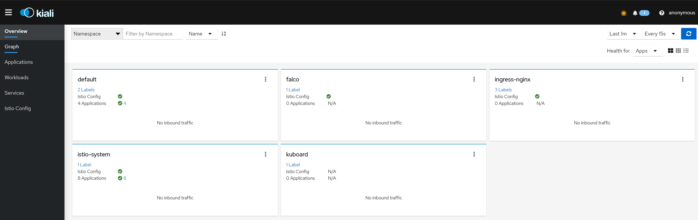


## 分布式追踪

### zipkin

官方文档：https://preliminary.istio.io/latest/zh/docs/tasks/observability/distributed-tracing/zipkin/

默认链路数据会发送到zipkin

```bash
# yaml文件在安装目录下的：samples/addons/extras
# 没有安装的可直接安装
kubectl apply -f samples/addons/extras/zipkin.yaml
```

```bash
# 测试或者临时访问
istioctl dashboard zipkin
```

在web页面的搜索面板中，点击 `+` 号，从第一个下拉列表中选择 `serviceName`， 从第二个下拉列表中选择 `productpage.default`，再点击搜索图标：


### SkyWalking

istio官方文档：https://istio.io/v1.17/zh/docs/tasks/observability/distributed-tracing/skywalking/

skywalking官方文档：https://skywalking.apache.org/zh/how-to-use-skywalking-for-distributed-tracing-in-istio/

Istio 基于 Envoy 的分布式追踪功能记录了服务之间调用链路信息（traceid 和 spanid等），可以很方便的和 SkyWalking、zipkin、jaeger等三方追踪服务集成。核心原理是通过代理将服务间调用的追踪 Span 发送到分布式追踪服务，由这些追踪服务实现调用链路存储、聚合和查询的功能。

SkyWalking是一个专门设计用于微服务、 云原生和容器等架构的应用性能监控 (APM) 系统。SkyWalking 是可观测性的一站式解决方案， 不仅具有像 Jaeger 和 Zipkin 的分布式追踪能力，像 Prometheus 和 Grafana 的指标能力，像 Kiali 的日志记录能力，还能将可观测性扩展到许多其他场景， 例如将日志与链路关联，收集系统事件并将事件与指标关联，基于 eBPF 的服务性能分析等。

**传递追踪上下文**

应用程序需要将 Span 通过 HTTP 请求头，将 Span 传递给上游服务（调用目标），才能把一个调用链中的 Trace 中的多个 Span 加入到链中。不同的追踪后端服务，需要提供的追踪请求头元信息不同，下面是一个汇总：

1. 全局 - 所有应用程序必须转发的请求头

   - x-request-id：这是 Envoy 专用的请求头，用于对日志和追踪进行一致的采样。

2. Zipkin、Jaeger、Stackdriver 和 OpenCensus Agent 

   - x-b3-traceid
   - x-b3-spanid

   - x-b3-parentspanid

   - x-b3-sampled

   - x-b3-flags

3. Datadog：对于许多语言和框架而言，这些转发由 Datadog 客户端库自动处理。

   - x-datadog-trace-id

   - x-datadog-parent-id

   - x-datadog-sampling-priority

4. Lightstep

   - x-ot-span-context

5. Stackdriver 和 OpenCensus Agent

   - grpc-trace-bin：标准的 grpc 追踪头。

   - traceparent：追踪所用的 W3C 追踪上下文标准。受所有 OpenCensus、OpenTelemetry 和日益增加的 Jaeger 客户端库所支持。

   - x-cloud-trace-context：由 Google Cloud 产品 API 使用。


**配置追踪后端 - SkyWalking**

- 安装SkyWalking服务

官网：https://istio.io/latest/zh/docs/ops/integrations/skywalking/#installation

```bash
# 在istio安装目录下的/samples/addons/ （好像是1.17版本后才配有skywalking的yaml文件）
kubectl apply -f samples/addons/extras/skywalking.yaml
```

将追踪后端服务作为扩展程序配置到 Istio。

- 如果是使用了 `IstioOperator` CR 来安装 Istio，需要将追踪后端服务作为扩展程序配置到 Istio。

  默认链路数据不会发送到 SkyWalking

```bash
# 展示配置档的信息
istioctl profile dump demo
```

```bash
# 找到IstioOperator资源的yaml文件并进行修改
# kubectl get IstioOperator -n istio-system 
NAME              REVISION   STATUS   AGE
installed-state                       14h

# kubectl edit io installed-state -n istio-system
# 找到meshConfig配置段并添加一下配置内容
    defaultProviders:
      tracing:
      - "skywalking"
    enableTracing: true
    extensionProviders:
    - name: "skywalking"
      skywalking:
        service: tracing.istio-system.svc.cluster.local
        port: 11800

```

或者是在初步安装的时候配置：

采用此配置来安装 Istio 时，将使用 SkyWalking Agent 作为默认的追踪器， 链路数据会被发送到 SkyWalking 后端

```bash
cat > ./my-config.yaml <<EOF
apiVersion: install.istio.io/v1alpha1
kind: IstioOperator
spec:
  meshConfig:
    defaultProviders:
      tracing:
      - "skywalking"
    enableTracing: true
    extensionProviders:
    - name: "skywalking"
      skywalking:
        service: tracing.istio-system.svc.cluster.local
        port: 11800
EOF

$ istioctl install -f my-config.yaml
```

所有追踪后端部署后，默认会在 istio-system 命名空间部署一个`tracing`服务，指向追踪后端的 Pod 。

- 修改追踪默认采样率。()

在默认的配置文件中，采样率为 1%， 使用 [Telemetry API](https://istio.io/latest/zh/docs/tasks/observability/telemetry/) 将其提高到 100%：

```bash
kubectl apply -f - <<EOF
apiVersion: telemetry.istio.io/v1alpha1
kind: Telemetry
metadata:
  name: mesh-default
  namespace: istio-system
spec:
  tracing:
  - randomSamplingPercentage: 100.00
EOF

```

- 访问 SkyWalking Dashboard。

```shell
istioctl dashboard skywalking
```

- 在web进入管理端ui可以看到链路

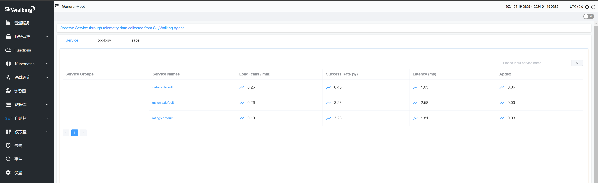

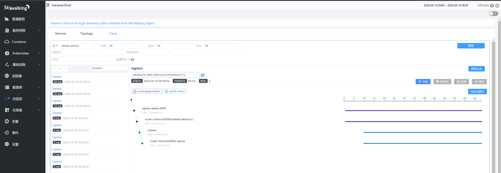


# 运维实战

参考文档：https://www.zhaohuabing.com/istio-guide/docs/
