+++
title = "traefik"
date = "2026-05-28T00:01:08+08:00"
draft = false
+++

参考博客：https://www.cuiliangblog.cn/detail/section/94663774

# 简介

Traefik是一个为了让部署微服务更加便捷而诞生的现代HTTP反向代理、负载均衡工具。 它支持多种后台 (Docker, Swarm, Kubernetes, Marathon, Mesos, Consul, Etcd, Zookeeper, BoltDB, Rest API, file…) 来自动化、动态的应用它的配置文件设置。

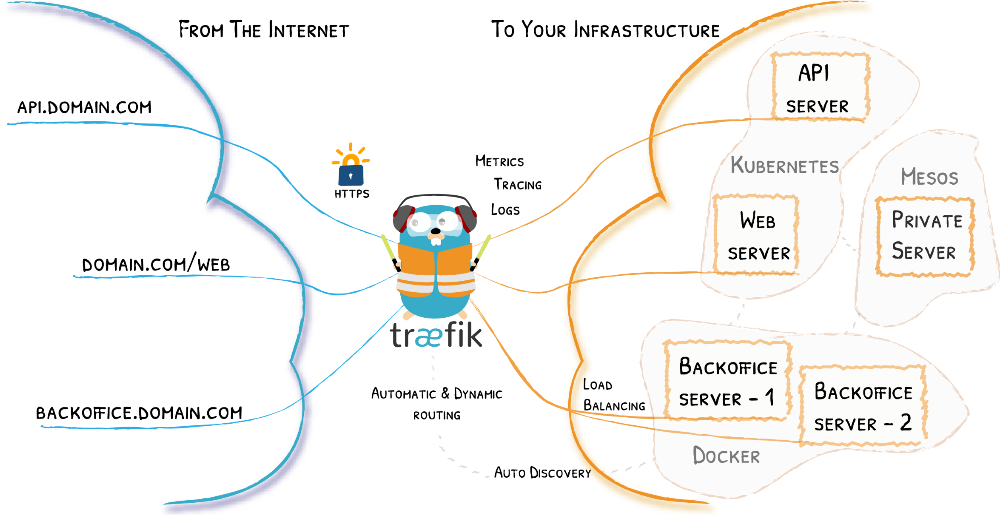

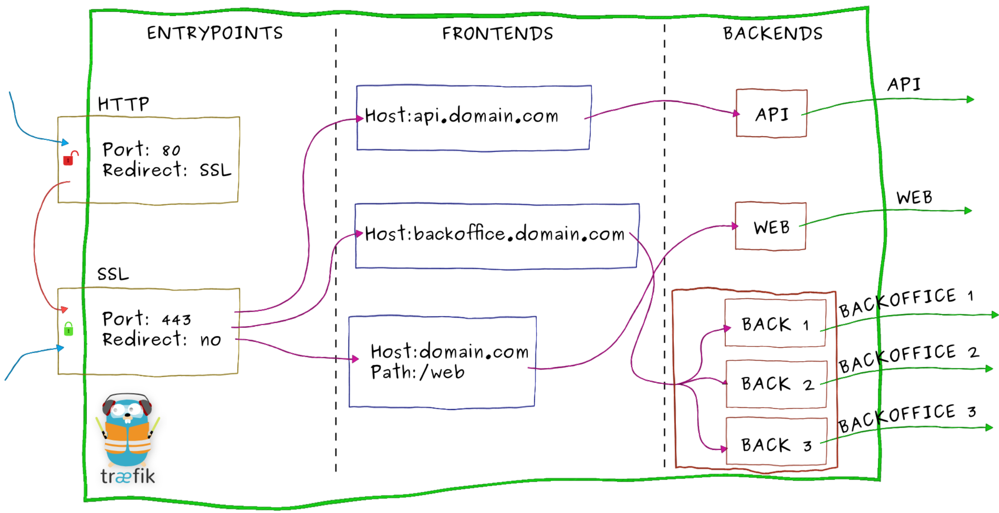

## 组件

- `Providers`：用来自动发现平台上的服务，可以是编排工具、容器引擎云提供商或者键值存储。Traefik通过查询Providers的API来查询路由的相关信息，一旦检测到变化，就会动态的更新路由。
- `Entrypoints`：监听传入的流量，是网络的入口点，定义了接受请求的端口(HTTP或者TCP)
- `Routers`：分析请求(host,path,headers,SSL等)，负责将传入的请求连接到可以处理这些请求的服务上去。
- `Middlewares`：中间件，用来修改请求或根据请求来做出判断，中间件被附件到路由上，可在请求发送到服务之前调整请求的。
- `Service`：将请求转发给应用，负责配置如何最终将处理传入请求的实际服务，Traefik的Service介于Middlewares与Kubernetes Service之间，可以实现加权负载、流量复制等功能。


## Nginx-Ingress和traefik区别

**traefik组件与nginx类比**

| 组件名      | 功能                       | nginx相同概念                                  |
| ----------- | -------------------------- | ---------------------------------------------- |
| Providers   | 监听路由信息变化，更新路由 | 修改nginx配置，并reload。                      |
| Entrypoints | 网络入口，监听传入的流量   | 配置文件listen指定监听端口                     |
| Routers     | 分析传入的请求，匹配规则   | 配置文件server_name + location                 |
| Middlewares | 中间件，修改请求或响应     | location配置段中添加的缓存、压缩、请求头等配置 |
| Service     | 请求转发                   | http配置段中的upstream                         |

​	k8s 是通过一个又一个的 controller 来负责监控、维护集群状态。Ingress Controller 就是监控 Ingress 路由规则的一个变化，然后跟 k8s 的资源操作入口 api-server 进行通信交互。K8s 并没有自带 Ingress Controller，它只是一种标准，具体实现有多种，需要自己单独安装，常用的是 Nginx Ingress Controller 和 Traefik Ingress Controller。

​	Ingress Controller 收到请求，匹配 Ingress 转发规则，匹配到了就转发到后端 Service，而 Service 可能代表的后端 Pod 有多个，选出一个转发到那个 Pod，最终由那个 Pod 处理请求。

**Ingress-Controller ：**为了能跟 kubernetes 交互，然后写入nginx 配置，最后reload。使用nginx作为前端负载均衡，通过ingress controller不断的和kubernetes api交互，实时获取后端service，pod等的变化，然后动态更新nginx配置，并刷新使配置生效，达到服务发现的目的。 

**traefik：**traefik本身设计的就能够实时跟kubernetes api交互，感知后端service，pod等的变化，自动更新配置并重载。


**Nginx和Traefik横比**

|                  | Nginx Ingress                                | Traefik ingress                                 |
| ---------------- | -------------------------------------------- | ----------------------------------------------- |
| **协议**         | http/https、http2、grpc、tcp/udp             | http/https、http2、grpc、tcp、tcp+tls           |
| **路由匹配**     | host、path                                   | host、path、headers、query、path prefix、method |
| **命名空间支持** | -                                            | 共用或指定命名空间                              |
| **部署策略**     | -                                            | 金丝雀部署、蓝绿部署、灰度部署                  |
| **upstream探测** | 重试、超时、心跳探测                         | 重试、超时、心跳探测、熔断                      |
| **负载均衡算法** | RR、会话保持、最小连接、最短时间、一致性hash | WRR、动态RR、会话保持                           |
| **优点**         | 简单易用，易接入                             | Golang编写，部署容易，支持众多的后端，内置WebUI |
| **缺点**         | 没有解决nginx reload，插件多，但是扩展性能差 | 性能略逊于NGINX，但强于HAProxy                  |

**traefik优点**

- 不需要安装其他依赖，使用 GO 语言编译可执行文件
- 支持多种后台，如 Docker, Swarm mode, Kubernetes, Marathon, Consul, Etcd, Rancher, Amazon ECS 等等
- 支持 REST API
- 配置文件热重载，可自动监听配置改动、发现新服务，并自动更新无需人工重启
- 支持熔断、限流功能
- 支持轮训、负载均衡
- 提供简洁的 UI 界面
- 支持 Websocket, HTTP/2, GRPC
- 自动更新 HTTPS 证书
- 支持高可用集群模式


# 安装部署

**必要条件**

Kubernetes版本1.14+
Helm版本3+

## helm安装

```bash
# 添加repo
helm repo add traefik https://helm.traefik.io/traefik
# 更新repo仓库资源
helm repo update
# 查看repo仓库traefik
helm search repo traefik
NAME                 	CHART VERSION	APP VERSION	DESCRIPTION                                       
aliyun/traefik       	1.24.1       	1.5.3      	A Traefik based Kubernetes ingress controller w...
traefik/traefik      	27.0.2       	v2.11.2    	A Traefik based Kubernetes ingress controller     
traefik/traefik-hub  	4.2.0        	v2.11.0    	Traefik Hub Ingress Controller                    
traefik/traefik-mesh 	4.1.1        	v1.4.8     	Traefik Mesh - Simpler Service Mesh               
traefik/traefikee    	3.4.0        	v2.11.0    	Traefik Enterprise is a unified cloud-native ne...
traefik1/traefik     	27.0.2       	v2.11.2    	A Traefik based Kubernetes ingress controller     
traefik1/traefik-hub 	4.2.0        	v2.11.0    	Traefik Hub Ingress Controller                    
traefik1/traefik-mesh	4.1.1        	v1.4.8     	Traefik Mesh - Simpler Service Mesh               
traefik1/traefikee   	3.4.0        	v2.11.0    	Traefik Enterprise is a unified cloud-native ne...
traefik/maesh        	2.1.2        	v1.3.2     	Maesh - Simpler Service Mesh                      
traefik1/maesh       	2.1.2        	v1.3.2     	Maesh - Simpler Service Mesh                  

# 创建traefik名称空间
kubectl create ns traefik
# 拉取helm包
helm pull traefik/traefik --untar
# 修改配置
cd traefik/
[root@k8s-master1 traefik]# vim values.yaml 
# 1、禁用helm中渲染的dashboard
# Create an IngressRoute for the dashboard
ingressRoute:
  dashboard:
    enabled: false  # 禁用helm中渲染的dashboard，traefik默认使用LoadBalancer暴露服务配置较为麻烦

# 2、修改port模式
# Configure ports
ports:
  traefik:
    port: 9000
    hostPort: 9000 # 使用 hostport 模式
  web:
    port: 8000
    hostPort: 8000  # 使用 hostport 模式
  websecure:
    port: 8443
    hostPort: 8443  # 使用 hostport 模式

# 3、关闭service
# Options for the main traefik service, where the entrypoints traffic comes
# from.
service:  # 使用 hostport 模式就不需要Service了
  enabled: false

# 4、修改日志级别
# Logs
# https://docs.traefik.io/observability/logs/
logs:
  general:
    level: DEBUG

# 5、添加容忍
tolerations:   # (去掉大括号)kubeadm 安装的集群默认情况下master是有污点，需要容忍这个污点才可以部署
- key: "node-role.kubernetes.io/master"
  operator: "Equal"
  effect: "NoSchedule"

# 6、固定到某一节点（可选）
nodeSelector:   # (去掉中括号)固定到master1节点（该节点才可以访问外网）
  kubernetes.io/hostname: "k8s-master1"
  
```

```bash
# 安装
[root@k8s-master1 traefik]# helm install traefik -n traefik . -f values.yaml
NAME: traefik
LAST DEPLOYED: Wed Apr 24 16:52:53 2024
NAMESPACE: traefik
STATUS: deployed
REVISION: 1
TEST SUITE: None
NOTES:
Traefik Proxy v2.11.2 has been deployed successfully on traefik namespace !

# 查看helm列表
[root@k8s-master1 traefik]# helm list -n traefik
NAME   	NAMESPACE	REVISION	UPDATED                                	STATUS  	CHART         	APP VERSION
traefik	traefik  	1       	2024-04-24 16:56:34.977156435 +0800 CST	deployed	traefik-27.0.2	v2.11.2 

# 查看pod资源信息
[root@k8s-master traefik]# kubectl get pod -n traefik 
NAME                       READY   STATUS    RESTARTS   AGE
traefik-57d88cb699-tflvk   1/1     Running   0          65s

```

配置域名访问dashboard服务

```yaml
cat >dashboard.yaml <<EOF
apiVersion: traefik.containo.us/v1alpha1
kind: IngressRoute
metadata:
  name: dashboard
  namespace: traefik
spec:
  entryPoints:
    - web
  routes:
    - match: Host(`traefik.any.com`)
      kind: Rule
      services:
        - name: api@internal
          kind: TraefikService
EOF

kubectl apply -f dashboard.yaml

```


## YAML自定义

helm虽然实现了一键安装部署，但是查看helm包的value.yaml配置发现总共有500多行配置，当需要修改配置项或者对traefik做一下自定义配置时，并不灵活。如果只是使用traefik的基础功能，推荐使用helm部署。如果想深入研究使用traefik的话，推荐使用自定义方式部署。

**当前环境：**

k8s版本：v1.23.6
traefik版本：2.9.6
其中master节点充当边缘节点，安装两块网卡，eth0：k8s集群内网ip eth1公网ip
官方文档：https://doc.traefik.io/traefik/providers/kubernetes-crd/
官方示例文件：https://github.com/traefik/traefik/blob/master/docs/content/user-guides/crd-acme/index.md(示例文件仅提供最基本的配置，且所有配置项通过args传参，仅供参考，并不推荐用于生产)

- 创建CRD资源

```bash
wget https://raw.githubusercontent.com/traefik/traefik/v2.9/docs/content/reference/dynamic-configuration/kubernetes-crd-definition-v1.yml
kubectl apply -f kubernetes-crd-definition-v1.yml 

# 查看crd资源
kubectl get crd
```

- 创建RBAC资源

```bash
wget https://raw.githubusercontent.com/traefik/traefik/v2.9/docs/content/reference/dynamic-configuration/kubernetes-crd-rbac.yml

kubectl apply -f kubernetes-crd-rbac.yml 
# 查看
kubectl get clusterrole | grep traefik
kubectl get clusterrolebinding | grep traefik

```

创建SA资源并绑定角色

查看kubernetes-crd-rbac.yml资源清单可知，官方的配置文件为我们创建了一个名为traefik-ingress-controller的角色，并在default名称空间创建了一个traefik-ingress-controller的sa账号与其绑定。但是在traefik名称空间下的资源并不能直接使用，我们可以修改traefik-ingress-controller的名称空间，或者在traefik名称空间建立一个sa账号并绑定角色使用。在尽量不修改官方配置的前提下，我们创建sa账号并绑定角色。

```yaml
cat >traefik-sa.yaml <<EOF
apiVersion: v1
kind: Namespace
metadata:
  name: traefik
---
apiVersion: v1
kind: ServiceAccount
metadata:
  namespace: traefik
  name: traefik-ingress-controller
---
apiVersion: rbac.authorization.k8s.io/v1
kind: ClusterRoleBinding
metadata:
  name: traefik-ingress-controller
roleRef:
  apiGroup: rbac.authorization.k8s.io
  kind: ClusterRole
  name: traefik-ingress-controller
subjects:
  - kind: ServiceAccount
    name: traefik-ingress-controller
    namespace: traefik
EOF

kubectl apply -f traefik-sa.yaml 

kubectl get sa -n traefik
kubectl get clusterrolebinding | grep traefik

```

- 创建traefik配置文件

在 Traefik 中有三种方式定义静态配置：在配置文件中、在命令行参数中、通过环境变量传递，由于 Traefik 配置很多，通过 CLI 定义不是很方便，一般时候选择将其配置选项放到配置文件中，然后存入 ConfigMap，将其挂入 traefik 中。参考文档：https://doc.traefik.io/traefik/getting-started/configuration-overview/

```yaml
cat >traefik-config.yaml <<EOF
apiVersion: v1
kind: ConfigMap
metadata:
  name: traefik-config
  namespace: traefik
data:
  traefik.yaml: |-
    global:
      checkNewVersion: false    # 周期性的检查是否有新版本发布
      sendAnonymousUsage: false # 周期性的匿名发送使用统计信息
    serversTransport:
      insecureSkipVerify: true  # Traefik忽略验证代理服务的TLS证书
    api:
      insecure: true            # 允许HTTP 方式访问API
      dashboard: true           # 启用Dashboard
      debug: false              # 启用Debug调试模式
    metrics:
      prometheus:               # 配置Prometheus监控指标数据，并使用默认配置
        addRoutersLabels: true  # 添加routers metrics
        entryPoint: "metrics"   # 指定metrics监听地址
    entryPoints:
      web:
        address: ":8000"          # 配置80端口，并设置入口名称为web
        forwardedHeaders: 
          insecure: true        # 信任所有的forward headers
      websecure:
        address: ":443"         # 配置443端口，并设置入口名称为 websecure
        forwardedHeaders: 
          insecure: true
      traefik:
        address: ":9000"        # 配置9000端口，并设置入口名称为 dashboard
      metrics:
        address: ":9100"        # 配置9100端口，作为metrics收集入口
      tcpep:
        address: ":9200"        # 配置9200端口，作为tcp入口
      udpep:
        address: ":9300/udp"    # 配置9300端口，作为udp入口
    providers:
      kubernetesCRD:            # 启用Kubernetes CRD方式来配置路由规则
        ingressClass: ""        # 指定traefik的ingressClass名称
        allowCrossNamespace: true   #允许跨namespace
        allowEmptyServices: true    #允许空endpoints的service
    log:
      filePath: "/etc/traefik/logs/traefik.log" # 设置调试日志文件存储路径，如果为空则输出到控制台
      level: "DEBUG"            # 设置调试日志级别
      format: "common"          # 设置调试日志格式
    accessLog:
      filePath: "/etc/traefik/logs/access.log" # 设置访问日志文件存储路径，如果为空则输出到控制台
      format: "common"          # 设置访问调试日志格式
      bufferingSize: 0          # 设置访问日志缓存行数
      filters:
        # statusCodes: ["200"]  # 设置只保留指定状态码范围内的访问日志
        retryAttempts: true     # 设置代理访问重试失败时，保留访问日志
        minDuration: 20         # 设置保留请求时间超过指定持续时间的访问日志
      fields:                   # 设置访问日志中的字段是否保留（keep保留、drop不保留）
        defaultMode: keep       # 设置默认保留访问日志字段
        names:                  # 针对访问日志特别字段特别配置保留模式
          ClientUsername: drop
          StartUTC: drop        # 禁用日志timestamp使用UTC
        headers:                # 设置Header中字段是否保留
          defaultMode: keep     # 设置默认保留Header中字段
          names:                # 针对Header中特别字段特别配置保留模式
            # User-Agent: redact# 可以针对指定agent
            Authorization: drop
            Content-Type: keep
EOF

kubectl apply -f traefik-config.yaml
kubectl get configmaps -n traefik 

```

- 节点设置label标签

> 模拟实际生产环境，假设集群中master节点安装两块网卡充当边缘节点，需要提前给master节点设置 Label，这样当程序部署时 Pod 会自动调度到设置 Label 的节点上。

master节点网络信息如下：

| 网卡名称 | ip             | 用途                 |
| -------- | -------------- | -------------------- |
| ens33    | 192.168.9.30   | k8s集群内部ip        |
| ens160   | 192.168.22.232 | 公网ip，用于外部访问 |

给master节点设置标签
```bash
kubectl label nodes k8s-master1 IngressProxy=true
```

- Deployment部署traefik

使用DeamonSet或者Deployment均可部署，此处使用Deployment方式部署 Traefik，副本数设置为1，调度至IngressProxy=true的那台master边缘节点，并使用host网络模式，提高网络入口的网络性能

```yaml
cat >traefik-deployment.yaml <<EOF
apiVersion: apps/v1
kind: Deployment
metadata:
  name: traefik
  namespace: traefik
  labels:
    app: traefik
spec:
  replicas: 1   # 副本数为1，因为集群只设置一台master为边缘节点
  selector:
    matchLabels:
      app: traefik
  template:
    metadata:
      name: traefik
      labels:
        app: traefik
    spec:
      serviceAccountName: traefik-ingress-controller
      terminationGracePeriodSeconds: 1
      containers:
      - name: traefik
        image: traefik:v2.9
        env:
        - name: KUBERNETES_SERVICE_HOST       # 手动指定k8s api,避免网络组件不稳定。
          value: "192.168.10.10"
        - name: KUBERNETES_SERVICE_PORT_HTTPS # API server端口
          value: "6443"
        - name: KUBERNETES_SERVICE_PORT       # API server端口
          value: "6443"
        - name: TZ                            # 指定时区
          value: "Asia/Shanghai"
        ports:
          - name: web
            containerPort: 8000
            hostPort: 8000                    # 将容器端口绑定所在服务器的 8000 端口
          - name: websecure
            containerPort: 443
            hostPort: 443                     # 将容器端口绑定所在服务器的 443 端口
          - name: admin
            containerPort: 9000               # Traefik Dashboard 端口
          - name: metrics
            containerPort: 9100               # metrics端口
          - name: tcpep
            containerPort: 9200               # tcp端口
          - name: udpep
            containerPort: 9300               # udp端口
        securityContext:                      # 只开放网络权限  
          capabilities:
            drop:
              - ALL
            add:
              - NET_BIND_SERVICE
        args:
          - --configfile=/etc/traefik/config/traefik.yaml
        volumeMounts:
        - mountPath: /etc/traefik/config
          name: config
        - mountPath: /etc/traefik/logs
          name: logdir
        - mountPath: /etc/localtime
          name: timezone
          readOnly: true
        resources:
          requests:
            memory: "5Mi"
            cpu: "10m" 
          limits:
            memory: "256Mi"
            cpu: "1000m"
      volumes:
        - name: config                         # traefik配置文件
          configMap:
            name: traefik-config 
        - name: logdir                         # traefik日志目录
          hostPath:
            path: /var/log/traefik
            type: "DirectoryOrCreate"
        - name: timezone                       #挂载时区文件
          hostPath:
            path: /etc/localtime
            type: File
      tolerations:                             # 设置容忍所有污点，防止节点被设置污点
        - operator: "Exists"
      hostNetwork: true                        # 开启host网络，提高网络入口的网络性能
      dnsPolicy: ClusterFirstWithHostNet       # 满足使用HostNetwork同时使用k8sDNS作为Pod预设DNS的配置。
      nodeSelector:                            # 设置node筛选器，在特定label的节点上启动
        IngressProxy: "true"                   # 调度至IngressProxy: "true"的节点
EOF

kubectl apply -f traefik-deployment.yaml 
kubectl get pod -n traefik 

```

- 创建service资源

```yaml
cat >traefik-svc.yaml <<EOF
apiVersion: v1
kind: Service
metadata:
  name: traefik
  namespace: traefik
spec:
  type: NodePort    ## 官网示例为LoadBalancer,为方便演示，此处改为NodePort
  selector:
    app: traefik
  ports:
    - name: web
      protocol: TCP
      port: 8000
      targetPort: 8000
    - name: websecure
      protocol: TCP
      port: 443
      targetPort: 443
    - name: admin
      protocol: TCP
      port: 9000
      targetPort: 9000
    - name: metrics
      protocol: TCP
      port: 9100
      targetPort: 9100
    - name: tcpep
      protocol: TCP
      port: 9200
      targetPort: 9200
    - name: udpep
      protocol: UDP
      port: 9300
      targetPort: 9300
EOF

kubectl apply -f traefik-svc.yaml 
kubectl get svc -n traefik 

```

NodePort方式访问dashboard

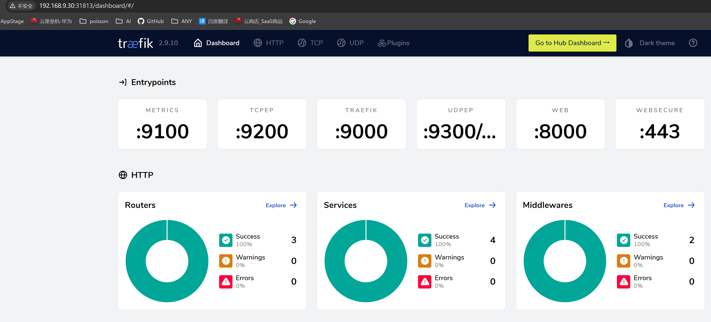

- dashboard配置http域名访问

> Traefik 应用已经部署完成，treafik的Dashboard为svc类型是NodePort，接下来配置域名规则，模拟外部用户通过公网IP访问dashboard应用

Traefik创建路由规则有多种方式，比如：

- 原生Ingress写法
- 使用CRD IngressRoute方式
- 使用GatewayAPI的方式

​	相较于原生Ingress写法，ingressRoute是2.1以后新增功能，简单来说，他们都支持路径(path)路由和域名(host)HTTP路由，以及HTTPS配置，区别在于IngressRoute需要定义CRD扩展，但是它支持了TCP、UDP路由以及中间件等新特性，强烈推荐使用ingressRoute，GatewayAPI方式后续再详细介绍。

创建 Traefik Dashboard 路由资源

```bash
cat >traefik-dashboard-ingress.yaml <<EOF
apiVersion: traefik.containo.us/v1alpha1
kind: IngressRoute
metadata:
  name: dashboard
  namespace: traefik
spec:
  entryPoints:
    - web
  routes:
    - match: Host(`traefik.any.com`)
      kind: Rule
      services:
        - name: api@internal
          kind: TraefikService
          namespace: traefik
EOF

kubectl apply -f traefik-dashboard-ingress.yaml 
kubectl get ingressroute -n traefik

```

配置 Hosts，客户端通过域名访问服务

域名+端口访问dashboard

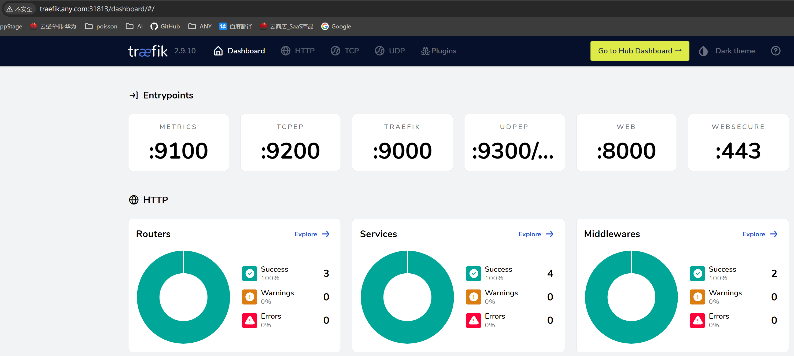


## 其他配置

- **强制使用TLS v1.2+**

> 如今，TLS v1.0 和 v1.1 因为存在安全问题，现在已被弃用。为了保障系统安全，所有入口路由都应该强制使用TLS v1.2 或更高版本。

参考文档：https://doc.traefik.io/traefik/user-guides/crd-acme/#force-tls-v12

```bash
cat >traefik-tlsoption.yml <<EOF
apiVersion: traefik.containo.us/v1alpha1
kind: TLSOption
metadata:
  name: default
  namespace: traefik
spec:
  minVersion: VersionTLS12
  cipherSuites:
    - TLS_ECDHE_RSA_WITH_AES_256_GCM_SHA384   # TLS 1.2
    - TLS_ECDHE_RSA_WITH_CHACHA20_POLY1305    # TLS 1.2
    - TLS_AES_256_GCM_SHA384                  # TLS 1.3
    - TLS_CHACHA20_POLY1305_SHA256            # TLS 1.3
  curvePreferences:
    - CurveP521
    - CurveP384
  sniStrict: true
EOF

kubectl apply -f traefik-tlsoption.yml

```

- **日志轮换**

> 官方并没有日志轮换的功能，但是traefik收到USR1信号后会重建日志文件，因此可以通过logrotate实现日志轮换

参考文档：https://doc.traefik.io/traefik/observability/logs/

在/etc/logrotate.d创建下traefik目录

```bash
mkdir -p /etc/logrotate.d/traefik
cat >/etc/logrotate.d/traefik/traefikLogrotate <<EOF
/data/traefik/logs/*.log {
  daily
  rotate 15
  missingok
  notifempty
  compress
  dateext
  dateyesterday
  dateformat .%Y-%m-%d
  create 0644 root root
  postrotate
   docker kill --signal="USR1" $(docker ps | grep traefik |grep -v pause| awk '{print $1}')
  endscript
 }
```

添加定时任务

```bash
sudo echo "0 0 * * * /usr/sbin/logrotate -f /etc/logrotate.d/traefik/traefikLogrotate >/dev/null 2>&1" > /etc/crontab
```


## 多控制器

有的业务场景下可能需要在一个集群中部署多个 traefik，例如：避免单个traefik配置规则过多导致加载处理缓慢。每个namespace部署一个traefik。或者traefik生产与测试环境区分等场景，需要不同的实例控制不同的 IngressRoute 资源对象，要实现该功能有两种方法：

- **1. 通过 annotations 注解筛选**

参考文档：https://doc.traefik.io/traefik/providers/kubernetes-crd/#ingressclass

首先在traefik配置文件中的providers下增加Ingressclass参数，指定具体的值。

配置如下：

```yaml
kind: ConfigMap
apiVersion: v1
metadata:
  name: traefik-config
  namespace: traefik
data:
  traefik.yaml: |-
    global:
      checkNewVersion: false    # 周期性的检查是否有新版本发布
      sendAnonymousUsage: false # 周期性的匿名发送使用统计信息
......
    providers:
      kubernetesCRD:            # 启用Kubernetes CRD方式来配置路由规则
        ingressClass: "traefik-v2.8"       # 指定traefik的ingressClass实例名称
        allowCrossNamespace: true   #允许跨namespace
        allowEmptyServices: true    #允许空endpoints的service
......
```

接下来在IngressRoute 资源对象中的annotations参数中添加 kubernetes.io/ingress.class: traefik-v2.8即可

```yaml
apiVersion: traefik.containo.us/v1alpha1
kind: IngressRoute
metadata:
  name: dashboard
  namespace: traefik
  annotations:
    kubernetes.io/ingress.class: traefik-v2.8 #  因为静态配置文件指定了ingressclass，所以这里的annotations 要指定，否则访问会404
spec:
  entryPoints:
    - web
  routes:
    - match: Host(`traefik.any.com`)
      kind: Rule
      services:
        - name: api@internal
          kind: TraefikService
          namespace: traefik
```

- **2、通过标签选择器进行过滤**

参考文档：https://doc.traefik.io/traefik/providers/kubernetes-crd/#labelselector

首先在traefik配置文件中的providers下增加labelSelector参数，指定具体的标签键值。
```yaml
kind: ConfigMap
apiVersion: v1
metadata:
  name: traefik-config
  namespace: traefik
data:
  traefik.yaml: |-
    global:
      checkNewVersion: false    # 周期性的检查是否有新版本发布
      sendAnonymousUsage: false # 周期性的匿名发送使用统计信息
......
    providers:
      kubernetesCRD:            # 启用Kubernetes CRD方式来配置路由规则
        # ingressClass: "traefik-v2.8"       # 指定traefik的ingressClass实例名称
        labelSelector: "app=traefik-v2.8" # 通过标签选择器指定traefik标签
        allowCrossNamespace: true   #允许跨namespace
        allowEmptyServices: true    #允许空endpoints的service
......
```

然后在 IngressRoute 资源对象中添加labels标签选择器，选择app: traefik-v2.8这个标签

```yaml
apiVersion: traefik.containo.us/v1alpha1
kind: IngressRoute
metadata:
  name: dashboard
  labels:     # 通过标签选择器，该IngressRoute资源由配置了app=traefik-v2.8的traefik处理
    app: traefik-v2.8
spec:
  entryPoints:
    - web
  routes:
    - match: Host(`traefik.any.com`)
      kind: Rule
      services:
        - name: api@internal
          kind: TraefikService
          namespace: traefik
```

## **Traefik CRD**

traefik通过自定义资源实现了对traefik资源的创建和管理，支持的crd资源类型如下所示：
参考文档：https://doc.traefik.io/traefik/routing/providers/kubernetes-crd/

| kind                                                         | 功能                        |
| ------------------------------------------------------------ | --------------------------- |
| [IngressRoute](https://doc.traefik.io/traefik/routing/providers/kubernetes-crd/#kind-ingressroute) | HTTP路由配置                |
| [Middleware](https://doc.traefik.io/traefik/routing/providers/kubernetes-crd/#kind-middleware) | HTTP中间件配置              |
| [TraefikService](https://doc.traefik.io/traefik/routing/providers/kubernetes-crd/#kind-traefikservice) | HTTP负载均衡/流量复制配置   |
| [IngressRouteTCP](https://doc.traefik.io/traefik/routing/providers/kubernetes-crd/#kind-ingressroutetcp) | TCP路由配置                 |
| [MiddlewareTCP](https://doc.traefik.io/traefik/routing/providers/kubernetes-crd/#kind-middlewaretcp) | TCP中间件配置               |
| [IngressRouteUDP](https://doc.traefik.io/traefik/routing/providers/kubernetes-crd/#kind-ingressrouteudp) | UDP路由配置                 |
| [TLSOptions](https://doc.traefik.io/traefik/routing/providers/kubernetes-crd/#kind-tlsoption) | TLS连接参数配置             |
| [TLSStores](https://doc.traefik.io/traefik/routing/providers/kubernetes-crd/#kind-tlsstore) | TLS存储配置                 |
| [ServersTransport](https://doc.traefik.io/traefik/routing/providers/kubernetes-crd/#kind-serverstransport) | traefik与后端之间的传输配置 |

# 功能

## 路由(IngressRoute)

官方文档：https://doc.traefik.io/traefik/routing/overview/

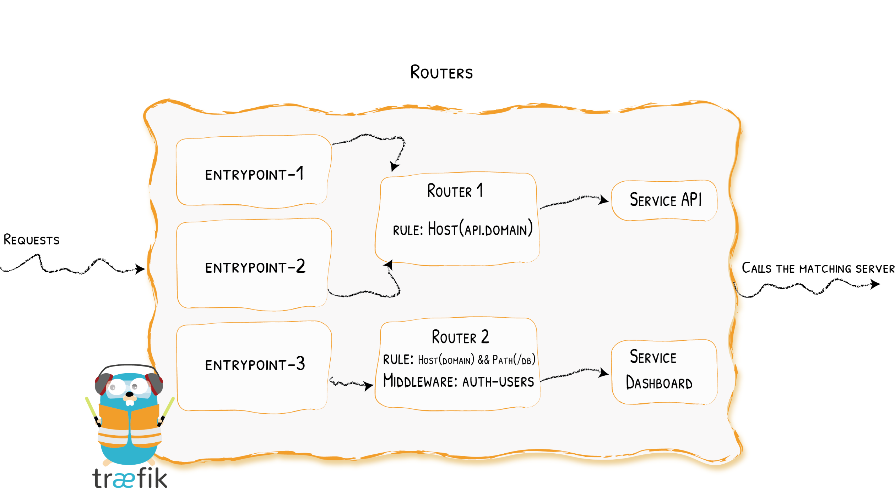


当启动Traefik时，需要定义entrypoints，然后通过entrypoints的路由来分析传入的请求，来查看他们是否是一组规则匹配，如果匹配，则路由可能将请求通过一系列的转换过来在发送到服务上去。

### 匹配规则

traefik支持的匹配规则:

| 规则                                                         | 描述                                                         |
| ------------------------------------------------------------ | ------------------------------------------------------------ |
| Headers(`key`, `value`)                                      | 检查headers中是否有一个键为key值为value的键值对              |
| HeadersRegexp(`key`, `regexp`)                               | 检查headers中是否有一个键位key值为正则表达式匹配的键值对     |
| Host(`example.com`, …)                                       | 检查请求的域名是否包含在特定的域名中                         |
| HostRegexp(`example.com`, `{subdomain:[a-z]+}.example.com`, …) | 检查请求的域名是否包含在特定的正则表达式域名中               |
| Method(`GET`, …)                                             | 检查请求方法是否为给定的methods(GET、POST、PUT、DELETE、PATCH)中 |
| Path(`/path`, `/articles/{cat:[a-z]+}/{id:[0-9]+}`, …)       | 匹配特定的请求路径，它接受一系列文字和正则表达式路径         |
| PathPrefix(`/products/`, `/articles/{cat:[a-z]+}/{id:[0-9]+}`) | 匹配特定的前缀路径，它接受一系列文字和正则表达式前缀路径     |
| Query(`foo=bar`, `bar=baz`)                                  | 匹配查询字符串参数，接受key=value的键值对                    |
| ClientIP(`10.0.0.0/16`, `::1`)                               | 如果请求客户端 IP 是给定的 IP/CIDR 之一，则匹配。它接受 IPv4、IPv6 和网段格式。 |

### 路由配置(ingressRoute)

#### **HTTP域名路由**

创建ingressrouter规则文件

```yaml
apiVersion: traefik.containo.us/v1alpha1
kind: IngressRoute
metadata:
  name: myapp1
spec:
  entryPoints:
  - web     # 监听 web 这个入口点
  routes:
  - match: Host(`myapp1.any.com`)   # 域名
    kind: Rule
    services:
      - name: myapp1  # 与svc的name一致
        port: 80      # 与svc的port一致
```

#### **HTTPS域名路由(手动生成证书)**

公网服务的话，可以在云厂商那里购买证书。内部服务的话，就直接用 openssl 来创建一个自签名的证书即可，要注意证书文件名称必须是 tls.crt 和 tls.key。接下来演示自签证书的配置。

创建自签证书

```bash
openssl req -x509 -nodes -days 365 -newkey rsa:2048 -keyout tls.key -out tls.crt -subj "/CN=myapp2.test.com"
```

```bash
req: openssl 的一个子命令，用于处理证书请求（Certificate Signing Requests, CSRs）。
-x509: 这个选项指示 req 子命令直接生成一个自签名的证书，而不是生成一个证书请求。
-nodes: 私钥不应该被加密，生成的私钥文件（tls.key）不会受到密码保护。
-days 365: 这个选项设置证书的有效期为 365 天。
-newkey rsa:2048: 生成一个新的 RSA 私钥，密钥长度为 2048 位。
-keyout tls.key: 指定私钥的输出文件名： tls.key。
-out tls.crt: 指定自签名证书的输出文件名：tls.crt。
-subj "/CN=myapp2.test.com": 设置证书的主题（Subject），用于标识服务的域名。/CN=myapp2.test.com 指定了证书的通用名称（Common Name）为 myapp2.test.com
```

创建IngressRouter规则文件

```yaml
apiVersion: traefik.containo.us/v1alpha1
kind: IngressRoute
metadata:
  name: myapp2
spec:
  entryPoints:
    - websecure                    # 监听 websecure 这个入口点，也就是通过 443 端口来访问
  routes:
  - match: Host(`myapp2.any.com`)
    kind: Rule
    services:
    - name: myapp2
      port: 80
  tls:
    secretName: myapp2-tls         # 指定tls证书名称
```

#### **HTTPS域名路由(自动生成证书)**

官方文档：https://doc.traefik.io/traefik-enterprise/tls/acme/

​	Traefik除了使用自有证书外，还支持在创建ingress资源时自动请求Let’s Encrypt生成证书，并且在证书过期前30天自动续订证书。
要使用Let’s Encrypt自动生成证书，需要使用ACME。需要在静态配置中定义 “证书解析器”，Traefik负责从ACME服务器中检索证书。然后，每个 "路由器 "被配置为启用TLS，并通过tls.certresolver配置选项与一个证书解析器关联。
​	如果使用tlsChallenge，则要求Let’s Encrypt到 Traefik 443 端口必须是可达的。如果使用httpChallenge，则要求Let’s Encrypt到 Traefik 80端口必须是可达的。如果使用dnsChallenge，只需要配置上 DNS 解析服务商的 API 访问密钥即可校验。

**tlsChallenge/httpChallenge**
	使用tlsChallenge或者httpChallenge的前提条件是traefik所在节点可以正常访问Let’s Encrypt网站，国内网络可能访问存在异常，并且配置的ingress域名已经设置了dns的A记录解析，指向traefik所在的节点公网IP地址才可以，否则申请成功证书后无法通过验证。

修改traefik配置文件，新增certificatesResolvers配置

```yaml
kind: ConfigMap
apiVersion: v1
metadata:
  name: traefik-config
  namespace: traefik
data:
  traefik.yaml: |-
    global:
      checkNewVersion: false    # 周期性的检查是否有新版本发布
      sendAnonymousUsage: false # 周期性的匿名发送使用统计信息
......
      udpep:
        address: ":9300/udp"    ## 配置9300端口，作为udp入口
        
    # 新增certificatesResolvers配置
    certificatesResolvers:      ## 开启ACME自动续签证书
      sample:
        acme:
          email: 1554382111@qq.com  # 邮箱配置
          storage: /etc/traefik/acme/acme.json    # 保存 ACME 证书的位置
          # tlsChallenge: {}            # tlsChallenge模式续签
          httpChallenge:
            entryPoint: web             # httpChallenge模式续签
            
    providers:
      kubernetesCRD:            # 启用Kubernetes CRD方式来配置路由规则
......
```

修改traefik的deployment资源文件，挂载acme目录存储ACME证书信息

如下图所示配置：

```yaml
# traefik-deployment.yaml
apiVersion: v1
kind: ServiceAccount
metadata:
  namespace: default
  name: traefik-ingress-controller
---
apiVersion: apps/v1
kind: Deployment
metadata:
  name: traefik-ingress-controller
  namespace: default
  labels:
    app: traefik
spec:
  replicas: 1   #副本数为1，因为集群只设置一台master为边缘节点
......
        volumeMounts:
		...
        # 新增挂载
        - mountPath: /etc/traefik/acme
          name: acme
      volumes:
		...
		# 新增挂载目录配置
        - name: acme                           # 自动续签证书文件
          hostPath:
            path: /data/traefik/acme
            type: "DirectoryOrCreate"
            
      tolerations:                             ## 设置容忍所有污点，防止节点被设置污点
        - operator: "Exists"
      hostNetwork: true                        ## 开启host网络，提高网络入口的网络性能
      nodeSelector:                            ## 设置node筛选器，在特定label的节点上启动
        IngressProxy: "true"                   ## 调度至IngressProxy: "true"的节点
......
```

配置IngressRouter规则

```yaml
apiVersion: traefik.containo.us/v1alpha1
kind: IngressRoute
metadata:
  name: myapp2
spec:
  entryPoints:
    - websecure                    # 监听 websecure 这个入口点，也就是通过 443 端口来访问
  routes:
  - match: Host(`myapp2.any.cn`) # 必须是真实存在的域名，且配置了dns解析记录，指向traefik节点所在的公网IP
    kind: Rule
    services:
    - name: myapp2
      port: 80
  tls:
    certResolver: sample         # 使用自动生成证书，名字与traefik配置中的certificatesResolvers名称一致
```

**dnsChallenge**
dns 校验方式可以生成通配符的证书，只需要配置上 DNS 解析服务商的 API 访问密钥即可校验。每个厂商的配置都略有差异，此处以阿里云为例，其他厂商的配置请查看文档https://go-acme.github.io/lego/dns/

修改traefik配置文件，新增dnsChallenge配置

```yaml
kind: ConfigMap
apiVersion: v1
metadata:
  name: traefik-config
  namespace: traefik
data:
  traefik.yaml: |-
    global:
      checkNewVersion: false    # 周期性的检查是否有新版本发布
      sendAnonymousUsage: false # 周期性的匿名发送使用统计信息
......
      udpep:
        address: ":9300/udp"    ## 配置9300端口，作为udp入口
        
    # 新增certificatesResolvers配置
    certificatesResolvers:      ## 开启ACME自动续签证书
      sample:
        acme:
          email: 1554382111@qq.com  # 邮箱配置
          storage: /etc/traefik/acme/acme.json    # 保存 ACME 证书的位置
          # tlsChallenge: {}            # tlsChallenge模式续签
          # httpChallenge:
          #   entryPoint: web             # httpChallenge模式续签
          dnsChallenge:                   # dns模式续签证书
            provider: alidns              # 云厂商编号       
            delayBeforeCheck: 0           # ACME 验证之前，会验证 TXT 记录。设定延迟验证时间(以秒为单位)
            
    providers:
      kubernetesCRD:            # 启用Kubernetes CRD方式来配置路由规则
......
```

登录阿里云后台获取ALICLOUD_ACCESS_KEY、ALICLOUD_SECRET_KEY、ALICLOUD_REGION_ID信息
创建Secret 对象存放密钥信息，记得填写base64编码后的值

```yaml
apiVersion: v1
kind: Secret
metadata:
  name: alidns-secret
type: Opaque
data:
  ALICLOUD_ACCESS_KEY: XXX
  ALICLOUD_SECRET_KEY: XXX
	ALICLOUD_REGION_ID: XXX
```

修改traefik的deployment资源清单，添加密钥env变量

```yaml
# traefik-deployment.yaml
apiVersion: v1
kind: ServiceAccount
metadata:
  namespace: default
  name: traefik-ingress-controller
---
apiVersion: apps/v1
kind: Deployment
metadata:
  name: traefik-ingress-controller
  namespace: default
  labels:
    app: traefik
spec:
  replicas: 1   #副本数为1，因为集群只设置一台master为边缘节点
......
      containers:
      - name: traefik
        image: traefik:v2.8.7
      	env:
        - name: KUBERNETES_SERVICE_HOST       # 手动指定k8s api,避免网络组件不稳定。
          value: "192.168.10.10"
        - name: KUBERNETES_SERVICE_PORT_HTTPS # API server端口
          value: "6443"
        - name: KUBERNETES_SERVICE_PORT       # API server端口
          value: "6443"
        - name: TZ                            # 指定时区
          value: "Asia/Shanghai"
        # 新增变量
        - name: ALICLOUD_ACCESS_KEY           # 阿里云AK
          valueFrom:
            secretKeyRef:
              name: alidns-secret
              key: ALICLOUD_ACCESS_KEY
        - name: ALICLOUD_SECRET_KEY           # 阿里云SK
          valueFrom:
            secretKeyRef:
              name: alidns-secret
              key: ALICLOUD_SECRET_KEY
        - name: ALICLOUD_REGION_ID            # 阿里云资源区域编号
          valueFrom:
            secretKeyRef:
              name: alidns-secret
              key: ALICLOUD_REGION_ID
......
```

修改ingressrouter配置

```yaml
apiVersion: traefik.containo.us/v1alpha1
kind: IngressRoute
metadata:
  name: myapp2
spec:
  entryPoints:
    - websecure                    # 监听 websecure 这个入口点，也就是通过 443 端口来访问
  routes:
  - match: Host(`myapp2.any.cn`)
    kind: Rule
    services:
    - name: myapp2
      port: 80
  tls:
    certResolver: sample         # 使用自动生成证书，名字与traefik的certificatesResolvers名称一致
    domains:
    - main: "*.cuiliangblog.cn"  # 不指定的话，默认申请Host域名，可以指定申请通配符域名
```

然后在阿里云DNS上做解析，重新创建ingress资源时即可触发申请证书。

常见错误处理:

| 日志关键词                                                   | 原因                                                         | 解决方案                                     |
| ------------------------------------------------------------ | ------------------------------------------------------------ | -------------------------------------------- |
| net/http: timeout awaiting response headers                          <br />connect: connection refused | traefik所在节点无法访问Let’s Encrypt申请证书                 | 使用工具加速                                 |
| acme: error :400/403                                         | 申请的域名DNS解析记录为配置，或者配置地址不正确，指向了其他IP | 更改DNS解析配置，指向traefik节点所在的公网IP |
| acme: error : 429                                            | 失败次数过多，每个小时只允许请求5次                          | 换账号/域名/IP重试或者等一个小时后再试       |

### 路由配置(ingressRoute TCP)

#### TCP路由(不带TLS证书)

以redis为例子（安装一个简单的redis）

```yaml
# redis.yaml
apiVersion: apps/v1
kind: Deployment
metadata:
  name: redis
spec:
  selector:
    matchLabels:
      app: redis
  template:
    metadata:
      labels:
        app: redis
    spec:
      containers:
      - name: redis
        image: redis:latest
        resources:
          limits:
            memory: "128Mi"
            cpu: "500m"
        ports:
        - containerPort: 6379
          protocol: TCP
---
apiVersion: v1
kind: Service
metadata:
  name: redis
spec:
  selector:
    app: redis
  ports:
  - port: 6379
    targetPort: 6379
```

创建IngressRouter进行对外暴露

```yaml
apiVersion: traefik.containo.us/v1alpha1
kind: IngressRouteTCP
metadata:
  name: redis
spec:
  entryPoints:
    - tcpep			     # 指定入口点为tcp端口
  routes:
  - match: HostSNI(`*`)  # 由于Traefik中使用TCP路由配置需要SNI，而SNI又是依赖TLS的，所以我们需要配置证书才行，如果没有证书的话，我们可以使用通配符*(适配ip的)进行配置
    services:
    - name: redis
      port: 6379
```

集群外部客户端配置hosts解析（域名可以随意填写，只要能解析到traefik所在节点即可，例如：`192.168.9.30 redis.any.com`），然后通过redis-cli工具访问redis，记得指定tcpep的端口。

```bash
$ redis-cli -h redis.any.com -p 9200
```

如果需要再添加其他tcp路由，需要修改traefik的配置，新增entryPoints端口

#### TCP路由(带TLS证书)

为了安全要求，tcp传输也需要使用TLS证书加密，redis从6.0开始支持了tls证书通信。

创建证书

```bash
mkdir redis-ssl && cd redis-ssl/
# 使用openssl创建自签证书文件
openssl genrsa -out ca.key 4096
openssl req -x509 -new -nodes -sha256 -key ca.key -days 3650 -subj '/O=Redis Test/CN=Certificate Authority' -out ca.crt
openssl genrsa -out redis.key 2048
openssl req -new -sha256 -key redis.key -subj '/O=Redis Test/CN=Server' | openssl x509 -req -sha256 -CA ca.crt -CAkey ca.key -CAserial ca.txt -CAcreateserial -days 365 -out redis.crt
openssl dhparam -out redis.dh 2048

```

查看目录下已经生成了对应的证书文件

```bash
[root@k8s-master1 redis-ssl]# ll
总用量 24
-rw-r--r-- 1 root root 1895 4月  25 08:34 ca.crt
-rw------- 1 root root 3243 4月  25 08:34 ca.key
-rw-r--r-- 1 root root   41 4月  25 08:35 ca.txt
-rw-r--r-- 1 root root 1407 4月  25 08:35 redis.crt
-rw-r--r-- 1 root root  424 4月  25 08:35 redis.dh
-rw------- 1 root root 1679 4月  25 08:34 redis.key
```

创建secret资源，使用tls类型，包含redis.crt和redis.key

```bash
kubectl create secret tls redis-tls --key=redis.key --cert=redis.crt

kubectl describe secrets redis-tls 

```

创建secret资源，使用generic类型，包含ca.crt

```bash
kubectl create secret generic redis-ca --from-file=ca.crt=ca.crt

kubectl describe secrets redis-ca 

```

修改redis配置，启用tls证书，并挂载证书文件

```yaml
apiVersion: v1
kind: ConfigMap
metadata:
  name: redis
  labels:
    app: redis
data:
  redis.conf : |-    # 新增Cm配置
    port 0
    tls-port 6379
    tls-cert-file   /etc/tls/tls.crt
    tls-key-file   /etc/tls/tls.key
    tls-ca-cert-file   /etc/ca/ca.crt
---
apiVersion: apps/v1
kind: Deployment
metadata:
  name: redis
spec:
  selector:
    matchLabels:
      app: redis
  template:
    metadata:
      labels:
        app: redis
    spec:
      containers:
      - name: redis
        image: redis:latest
        resources:
          limits:
            memory: "128Mi"
            cpu: "500m"
        ports:
        - containerPort: 6379
          protocol: TCP
        volumeMounts:
          - name: config   # 挂载到redis中
            mountPath: /etc/redis
          - name: tls
            mountPath: /etc/tls   # 挂载证书
          - name: ca
            mountPath: /etc/ca    # 挂载ca文件
        args:
        - /etc/redis/redis.conf
      volumes:
        - name:  config   # 挂载指定CM
          configMap:
            name: redis
        - name: tls       # 指定证书secret
          secret:
            secretName: redis-tls
        - name: ca
          secret:
            secretName: redis-ca
---
apiVersion: v1
kind: Service
metadata:
  name: redis
spec:
  selector:
    app: redis
  ports:
  - port: 6379
    targetPort: 6379
```

修改后重建redis

创建IngressRouter资源，指定域名和证书

```yaml
apiVersion: traefik.containo.us/v1alpha1
kind: IngressRouteTCP
metadata:
  name: redis
spec:
  entryPoints:
    - tcpep
  routes:
  - match: HostSNI(`redis.any.com`)
    services:
    - name: redis
      port: 6379
  tls:
    secretName: redis-tls
```

注意：需要编译安装redis-cli 6.0以上版本，并在编译时开启TLS，之前版本不支持tls

```bash
yum install openssl openssl-devel -y
wget http://download.redis.io/redis-stable.tar.gz
tar xvzf redis-stable.tar.gz
cd redis-stable
make redis-cli BUILD_TLS=yes MALLOC=libc
cp src/redis-cli /usr/local/bin/
```

客户端添加hosts记录`192.168.9.30 redis.any.com`，直接访问redis，直接报错

```bash
[root@tiaoban src]# ./src/redis-cli -h redis.test.com -p 9200

127.0.0.1:6379> set key 1
Error: Connection reset by peer
```

```bash
[root@tiaoban src]# ./redis-cli -h redis.test.com -p 9200 --tls --cert /tmp/redis-ssl/redis.crt --key /tmp/redis-ssl/redis.key --cacert /tmp/redis-ssl/ca.crt
redis.test.com:9200> set key 1
OK
```

### 路由配置(IngressRouteUDP)

UDP路由

创建IngressRouter资源，代理UDP应用，需要注意的是UDP资源访问时直接通过公网ip+dup的entryPoints端口即可，不需要配置域名

配置示例：

```yaml
# cat rsyslog-ingress.yaml 
apiVersion: traefik.containo.us/v1alpha1
kind: IngressRouteUDP
metadata:
  name: rsyslog
spec:
  entryPoints:
    - udpep
  routes:
  - services:
    - name: rsyslog
      port: 514
```

### 负载均衡配置

traefik可以对http、TCP、UDP实现负载均衡，根据需求创建IngressRoute/IngressRouteTCP/IngressRouteUDP即可，此以http为例。

http路由多个k8s service配置，创建IngressRouter资源，配置域名为myapp.test.com，请求流量均摊到两个k8s的service上。

```yaml
cat >myapp-ingress.yaml <<EOF
apiVersion: traefik.containo.us/v1alpha1
kind: IngressRoute
metadata:
  name: myapp
  namespace: app
spec:
  entryPoints:
    - web
  routes:
  - match: Host(`myapp.any.com`)
    kind: Rule
    services:
    - name: myapp1
      namespace: app
      port: 80 
    - name: myapp2
      namespace: app
      port: 80
EOF

kubectl apply -f myapp-ingress.yaml 

```

访问测试，就可发现依次循环响应myapp1和myapp2的内容


## 中间件(middleware)

 官方文档：https://doc.traefik.io/traefik/middlewares/overview/

Traefik Middlewares 是一个处于路由和后端服务之前的中间件，在外部流量进入 Traefik，且路由规则匹配成功后，将流量发送到对应的后端服务前，先将其发给中间件进行一系列处理（类似于过滤器链 Filter，进行一系列处理）。

例如，添加 Header 头信息、鉴权、流量转发、处理访问路径前缀、IP 白名单等等，经过一个或者多个中间件处理完成后，再发送给后端服务，这个就是中间件的作用。

Traefik内置了很多不同功能的Middleware，主要是针对HTTP和TCP。


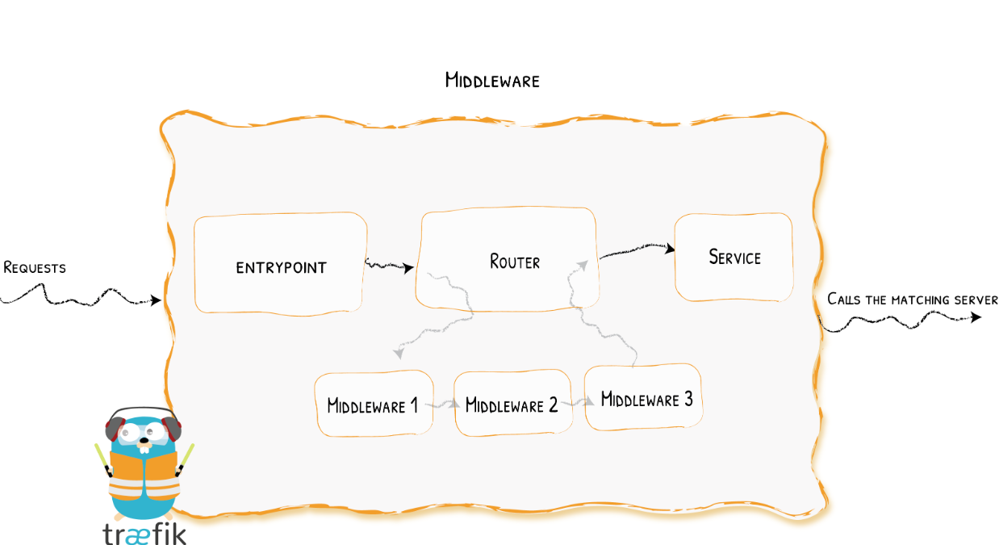


### 重定向

redirectScheme的更多用法查看官方文档https://doc.traefik.io/traefik/middlewares/http/redirectscheme/

- https的ingressRoute

```yaml
# cat https-ingress.yaml
apiVersion: traefik.containo.us/v1alpha1
kind: IngressRoute
metadata:
  name: myapp2-tls
spec:
  entryPoints:
  - websecure
  routes:
  - match: Host(`myapp2.any.com`)
    kind: Rule
    services:
    - name: myapp2
      port: 80 
  tls:
    secretName: myapp2-tls         # 指定tls证书名称

```

- 定义一个强制将http请求跳转到https的中间件

```yaml
# cat https-middleware.yaml 
apiVersion: traefik.containo.us/v1alpha1
kind: Middleware
metadata:
  name: redirect-https-middleware
spec:
  redirectScheme:
    scheme: https

```

- http的ingressRoute，并使用上面定义的中间件

```yaml
# cat http-ingress.yaml 
apiVersion: traefik.containo.us/v1alpha1
kind: IngressRoute
metadata:
  name: myapp2
spec:
  entryPoints:
  - web
  routes:
  - match: Host(`myapp2.any.com`)
    kind: Rule
    services:
    - name: myapp2
      port: 80
    middlewares:     # 指定使用RedirectScheme中间件，完成http强制跳转至https
    - name: redirect-https-middleware    # 定义的中间名称

```

### 去除请求路径前缀

官方文档：https://doc.traefik.io/traefik/middlewares/http/stripprefix/

有这样一个需求，当访问`http://myapp.test.com/v1`时，流量调度至myapp1。当访问`http://myapp.test.com/v2`时，流量调度至myapp2。

这种需求是非常常见的，在NGINX中，我们可以配置多个Location来定制规则，使用Traefik也可以这么做。但是定制不同的前缀后，由于应用本身并没有这些前缀，导致请求返回404，这时候我们就需要对请求的path进行处理。

- 定义去除前缀的中间件: stripPrefix，指定将请求路径中的v1、v2去除。

``` yaml
# cat prefix-url-middleware.yaml 
apiVersion: traefik.containo.us/v1alpha1
kind: Middleware
metadata:
  name: prefix-url-middleware
spec:
  stripPrefix:
    prefixes:
      - /v1
      - /v2

```

- 创建ingressRoute，添加使用刚刚定义的prefix-url-middleware中间件

```yaml
# cat myapp-ingress.yaml 
apiVersion: traefik.containo.us/v1alpha1
kind: IngressRoute
metadata:
  name: myapp
spec:
  entryPoints:
  - web
  routes:
  - match: Host(`myapp.any.com`) && PathPrefix(`/v1`)
    kind: Rule
    services:
    - name: myapp1
      port: 80 
    middlewares:     # 引用中间件
    - name: prefix-url-middleware
  - match: Host(`myapp.any.com`) && PathPrefix(`/v2`)
    kind: Rule
    services:
    - name: myapp2
      port: 80 
    middlewares:      # 引用中间件
    - name: prefix-url-middleware

# 如果不加中间件，进行访问测试http://myapp.test.com/v1，虽然traefik配置无误，但假设因为myapp1应用并没有v1这个路径，页面会返回404页面
```

加中间件之前，查看traefik的dashboard

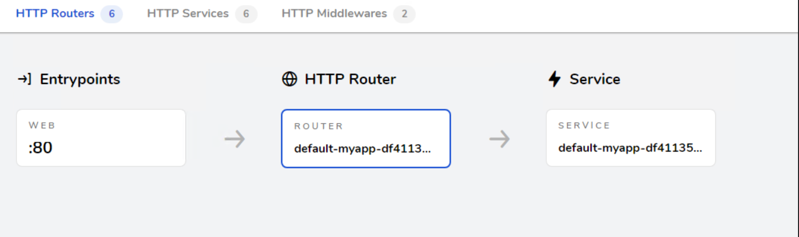

加中间件之后

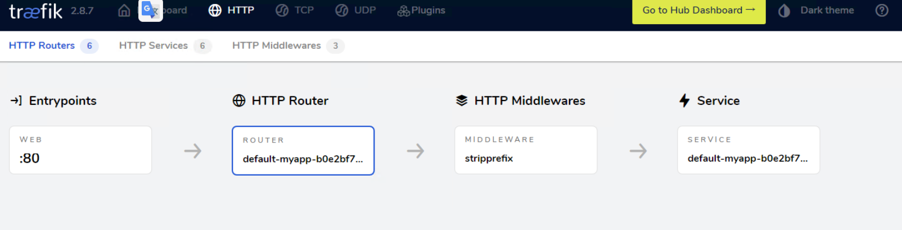


### 添加IP白名单

官方文档：https://doc.traefik.io/traefik/middlewares/http/ipwhitelist/

为提高安全性，通常情况下一些管理员界面会设置ip访问白名单，只希望个别用户可以访问，例如访问traefik的dashboard的url，这时候就可以使用Traefik中的ipWhiteList中间件来完成。

- 定义IP访问白名单的中间件ipWhiteList，指定可以访问的ip列表

```yaml
# cat ip-white-middleware.yaml 
apiVersion: traefik.containo.us/v1alpha1
kind: Middleware
metadata:
  name: ip-white-list-middleware
spec:
  ipWhiteList:        # 允许的ip列表
    sourceRange:
      - 127.0.0.1/32    
      - 192.168.93.1

```

在ingressRoute中添加ip白名单中间件，例如dashboard-ingress

```bash
# cat dashboard-ingress.yaml 
apiVersion: traefik.containo.us/v1alpha1
kind: IngressRoute
metadata:
  name: dashboard
spec:
  entryPoints:
    - web
  routes:
    - match: Host(`traefik.any.com`)
      kind: Rule
      services:
      - name: api@internal
        kind: TraefikService
      middlewares:            # 引用中间件,引用之后，就只能对应放开的ip进行访问
      - name: ip-white-list-middleware

```

### 基础用户认证

官方文档：https://doc.traefik.io/traefik/middlewares/http/basicauth/

通常企业安全要求规范除了要对管理员页面限制访问ip外，还需要添加账号密码认证，而traefik默认没有提供账号密码认证功能，此时就可以通过BasicAuth中间件完成用户认证，只有认证通过的授权用户才可以访问页面。


使用basicAuth认证需要使用htpasswd工具生成密码文件

先安装httpd软件包

```bash
yum install -y httpd
```

使用htpasswd工具设置用户名密码，生成密钥文件

```bash
# 生成密钥文件
htpasswd -bc basic-auth-secret any 123
```

将生成的basic-auth-secret密码文件创建成secret

```bash
kubectl create secret generic basic-auth --from-file=basic-auth-secret
```

创建basicAuth中间件，指定使用刚刚创建的secret资源。

```yaml
# cat basic-auth-middleware.yaml
apiVersion: traefik.containo.us/v1alpha1
kind: Middleware
metadata:
  name: basic-auth-middleware
spec:
  basicAuth:
    secret: basic-auth

```

修改ingressRoute，添加basicAuth中间件，示例：dashboard-ingress

```yaml
# cat dashboard-ingress.yaml 
apiVersion: traefik.containo.us/v1alpha1
kind: IngressRoute
metadata:
  name: dashboard
spec:
  entryPoints:
    - web
  routes:
    - match: Host(`traefik.any.com`)
      kind: Rule
      services:
      - name: api@internal
        kind: TraefikService
      middlewares:        # 引用中间件
      - name: basic-auth-middleware
```

此时再进行客户端访问验证，刷新页面后，弹出用户登录认证页面。


### 修改请求/响应头信息

官方文档https://doc.traefik.io/traefik/middlewares/http/headers/

为了提高业务的安全性，安全团队会定期进行漏洞扫描，其中有些web漏洞就需要通过修改响应头处理，traefik的Headers中间件不仅可以修改返回客户端的响应头信息，还能修改反向代理后端service服务的请求头信息。


例如对`https://myapp2.any.com`提高安全策略，强制启用HSTS
HSTS：即HTTP严格传输安全响应头，收到该响应头的浏览器会在 63072000s（约 2 年）的时间内，只要访问该网站，即使输入的是 http，浏览器会自动跳转到 https。（HSTS 是浏览器端的跳转，之前的HTTP 重定向到 HTTPS是服务器端的跳转）

定义响应头中间件Headers，指定响应内容中添加Strict-Transport-Security配置。

```yaml
# cat hsts-header-middleware.yaml 
apiVersion: traefik.containo.us/v1alpha1
kind: Middleware
metadata:
  name: hsts-header-middleware
spec:
  headers:
    customResponseHeaders:
      Strict-Transport-Security: 'max-age=63072000'

```

 ingressRoute添加中间件

```yaml
# cat myapp2-ingress.yaml 
apiVersion: traefik.containo.us/v1alpha1
kind: IngressRoute
metadata:
  name: myapp2-tls
spec:
  entryPoints:
  - web
  - websecure
  routes:
  - match: Host(`myapp2.test.com`)
    kind: Rule
    services:
    - name: myapp2
      port: 80 
    middlewares:                  # 引用中间件
      - name: hsts-header-middleware
  tls:
    secretName: myapp2-tls         # 指定tls证书名称

```

客户端访问验证，查看响应头信息，就会出现如下信息

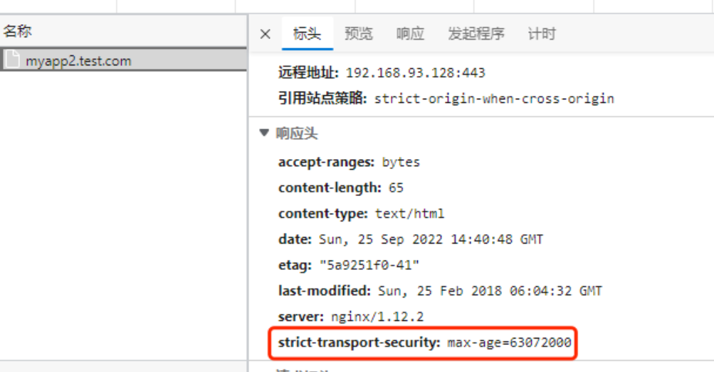


### 限流

官方文档：https://doc.traefik.io/traefik/middlewares/http/ratelimit/

在实际生产环境中，流量限制也是经常用到的，它可以用作安全目的，比如可以减慢暴力密码破解的速率。通过将传入请求的速率限制为真实用户的典型值，并标识目标URL地址(通过日志)，还可以用来抵御 DDOS 攻击。更常见的情况，该功能被用来保护下游应用服务器不被同时太多用户请求所压垮。

定义限流中间件RateLimit

示例：指定1s内请求数平均值不大于10个，高峰最大值不大于50个。

```yaml
# cat rate-limit-middleware.yaml 
apiVersion: traefik.containo.us/v1alpha1
kind: Middleware
metadata:
  name: rate-limit-middleware
spec:
  rateLimit:
    burst: 10          # 任意小的时间段内允许通过的最大请求数，默认1
    average: 50        # 给定源允许的最大速率（默认以每秒请求数为单位），默认为0，没有速率限制

```

ingressRoute引用，就可达到限流效果

```yaml
# cat myapp1-ingress.yaml 
apiVersion: traefik.containo.us/v1alpha1
kind: IngressRoute
metadata:
  name: myapp1
spec:
  entryPoints:
  - web
  routes:
  - match: Host(`myapp1.any.com`)
    kind: Rule
    services:
    - name: myapp1  
      port: 80   
    middlewares:
      - name: rate-limit-middleware
```


### 熔断

官方文档https://doc.traefik.io/traefik/middlewares/http/circuitbreaker/


服务熔断的作用类似于我们家用的保险丝，当某服务出现不可用或响应超时的情况时，为了防止整个系统出现雪崩，暂时停止对该服务的调用。
**熔断器三种状态**

- Closed：关闭状态，所有请求都正常访问。
- Open：打开状态，所有请求都会被降级。traefik会对请求情况计数，当一定时间内失败请求百分比达到阈值，则触发熔断，断路器会完全打开。
- Recovering：半开恢复状态，open状态不是永久的，打开后会进入休眠时间。随后断路器会自动进入半开状态。此时会释放部分请求通过，若这些请求都是健康的，则会完全关闭断路器，否则继续保持打开，再次进行休眠计时

**服务熔断原理(断路器的原理)**
统计用户在指定的时间范围（默认10s）之内的请求总数达到指定的数量之后，如果不健康的请求(超时、异常)占总请求数量的百分比（50%）达到了指定的阈值之后，就会触发熔断。触发熔断，断路器就会打开(open),此时所有请求都不能通过。在5s之后，断路器会恢复到半开状态(half open)，会允许少量请求通过，如果这些请求都是健康的，那么断路器会回到关闭状态(close).如果这些请求还是失败的请求,断路器还是恢复到打开的状态(open).
**traefik支持的触发器**

- NetworkErrorRatio：网络错误率
- ResponseCodeRatio：状态代码比率
- LatencyAtQuantileMS：分位数的延迟（以毫秒为单位）

定义熔断中间件circuitBreaker，示例：指定50% 的请求比例响应时间大于 1MS 时熔断。

```yaml
# cat circuit-breaker-middleware.yaml 
apiVersion: traefik.containo.us/v1alpha1
kind: Middleware
metadata:
  name: circuit-breaker-middleware
spec:
  circuitBreaker:
    expression: LatencyAtQuantileMS(50.0) > 1
```

ingressRoute引用

```yaml
# cat myapp1-ingress.yaml 
apiVersion: traefik.containo.us/v1alpha1
kind: IngressRoute
metadata:
  name: myapp1
spec:
  entryPoints:
  - web
  routes:
  - match: Host(`myapp1.any.com`)
    kind: Rule
    services:
    - name: myapp1  
      port: 80   
    middlewares:
      - name: circuit-breaker-middleware
```


### 自定义错误页面

官方文档：https://doc.traefik.io/traefik/middlewares/http/errorpages/

在实际的业务中，肯定会存在4XX 5XX相关的错误异常，如果每个应用都开发一个单独的错误页，无疑大大增加了开发成本，traefik同样也支持自定义错误页，但是需要注意的是，错误页面不是有traefik存储处理，而是通过定义中间件，将错误的请求重定向到其他的页面

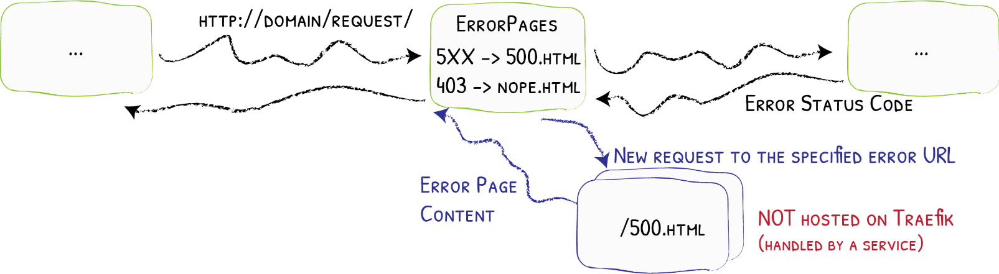

定义errorpages中间件

示例：

```yaml
# cat error-middleware.yaml 
apiVersion: traefik.containo.us/v1alpha1
kind: Middleware
metadata:
  name: errors5
spec:
  errors:
    status:
      - "500-599"
    # query: /{status}.html   # 可以为每个页面定义一个状态码，也可以指定5XX使用统一页面返回
    query : /                 # 指定返回myapp2的请求路径
    service:
      name: myapp2
      port: 80
---
apiVersion: traefik.containo.us/v1alpha1
kind: Middleware
metadata:
  name: errors4
spec:
  errors:
    status:
      - "400-499"
    # query: /{status}.html   # 可以为每个页面定义一个状态码，也可以指定5XX使用统一页面返回
    query : /                 # 指定返回myapp1的请求路径
    service:
      name: myapp1
      port: 80
```

ingressRoute引用示例：

```yaml
# cat flask-ingress.yaml
apiVersion: traefik.containo.us/v1alpha1
kind: IngressRoute
metadata:
  name: flask
spec:
  entryPoints:
  - web
  routes:
  - match: Host(`flask.any.com`)
    kind: Rule
    services:
    - name: flask  
      port: 5000
    middlewares:
      - name: errors4
      - name: errors5
```


### 数据压缩

官方文档：https://doc.traefik.io/traefik/middlewares/http/compress/


有时候客户端和服务器之间会传输比较大的报文数据，这时候就占用较大的网络带宽和时长。为了节省带宽，加速报文的响应速速，可以将传输的报文数据先进行压缩，然后再进行传输，traefik也同样支持数据压缩。

traefik默认只对大于1024字节，且请求标头包含`Accept-Encoding gzip`的资源进行压缩。可以指定排除特定类型不启用压缩或者根据内容大小来决定是否压缩。

创建compress中间件，使用默认配置策略

```yaml
# cat compress.yaml 
apiVersion: traefik.containo.us/v1alpha1
kind: Middleware
metadata:
  name: compress
spec:
  compress: {}
```

ingressrouter资源示例，指定数据压缩中间件

```yaml
# cat flask-ingress.yaml 
apiVersion: traefik.containo.us/v1alpha1
kind: IngressRoute
metadata:
  name: flask
spec:
  entryPoints:
  - web
  routes:
  - match: Host(`flask.any.com`)
    kind: Rule
    services:
    - name: flask  
      port: 5000
    middlewares:
      - name: compress
```


## 服务(TraefikService)

官方文档：https://doc.traefik.io/traefik/routing/providers/kubernetes-crd/#kind-traefikservice

traefik的路由规则就可以实现4层和7层的基本负载均衡操作，使用`IngressRoute / IngressRouteTCP / IngressRouteUDP`资源即可。但是如果想要实现加权轮询、流量复制等高级操作，traefik抽象出了一个TraefikService资源。

此时整体流量走向为：外部流量先通过entryPoints端口进入traefik，然后由`IngressRoute / IngressRouteTCP / IngressRouteUDP`匹配后进入TraefikService，在这一层实现加权轮循和流量复制，最后将请求转发至kubernetes的service。
除此之外traefik还支持7层的粘性会话、健康检查、传递请求头、响应转发、故障转移等操作。

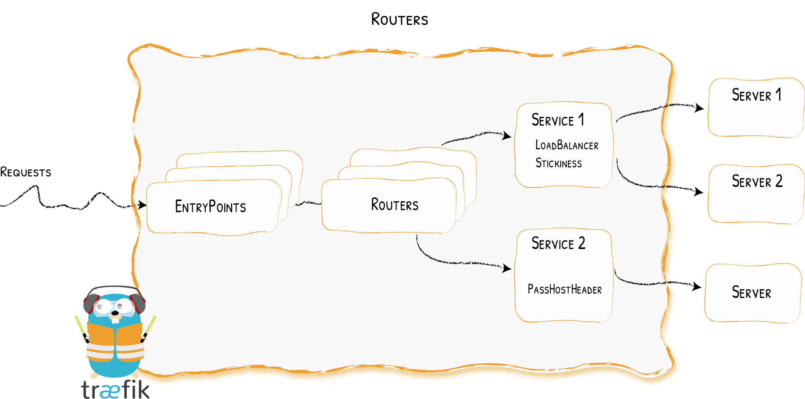

### 加权轮询(灰度发布)

官方文档：https://doc.traefik.io/traefik/routing/services/#weighted-round-robin-service

灰度发布也会称为金丝雀发布（Canary），主要就是让一部分测试的服务也参与到线上去，经过测试观察看是否符合上线要求，在traefik中，通过调整生产与测试服务的权重，实现灰度发布的功能。

- 创建TraefikService资源，名称与IngressRouter的TraefikService保持一致，services后端填写kubernetes的service，并指定权重。

```yaml
# cat myapp-traefikService.yaml 
apiVersion: traefik.containo.us/v1alpha1
kind: TraefikService
metadata:
  name: wrr
  namespace: app
spec:
  weighted:
    services:
      - name: myapp1
        port: 80
        weight: 1
      - name: myapp2
        port: 80
        weight: 2

```

- 创建IngressRouter资源，注意此时后端service配置TraefikService。

```yaml
# cat myapp-ingress.yaml 
apiVersion: traefik.containo.us/v1alpha1
kind: IngressRoute
metadata:
  name: myapp
  namespace: app
spec:
  entryPoints:
    - web
  routes:
  - match: Host(`myapp.any.com`)
    kind: Rule
    services:                     # 加权轮循时，后端service不再是k8s的service，而是traefik的TraefikService
    - name: wrr                   # TraefikService名称
      namespace: app
      kind: TraefikService
```

- 

### 流量镜像(流量复制)

官方文档：https://doc.traefik.io/traefik/routing/services/#mirroring-service

traefik还支持镜像复制功能，是一种可以将流入流量复制并同时将其发送给其他服务的方法，镜像服务可以获得给定百分比的请求同时也会忽略这部分请求的响应，在实际生产中主要用于测试场景以及问题复现bug定位。

- 创建TraefikService资源，名称与IngressRouter的TraefikService保持一致，services后端填写kubernetes的service，并设置复制流量比例。

```yaml
# cat myapp-traefikService.yaml 
apiVersion: traefik.containo.us/v1alpha1
kind: TraefikService
metadata:
  name: mirror
  namespace: default
spec:
  mirroring:      # 所有流量全部请求到k8s的myapp1
    name: myapp1
    port: 80
    mirrors:      # 同时复制60%的请求到k8s的myapp2  
    - name: myapp2
      port: 80
      percent: 60
```

- 创建IngressRouter资源，此时后端service配置TraefikService

```yaml
# cat myapp-ingress.yaml 
apiVersion: traefik.containo.us/v1alpha1
kind: IngressRoute
metadata:
  name: myapp
  namespace: app
spec:
  entryPoints:
    - web
  routes:
  - match: Host(`myapp.any.com`)
    kind: Rule
    services:                     # 流量复制时，后端service不再是k8s的service，而是traefik的TraefikService
    - name: mirror   
      namespace: app
      kind: TraefikService
```


### 粘性会话(会话保持)

官方文档：https://doc.traefik.io/traefik/routing/services/#servers

使用traefik的负载均衡时，默认情况下轮循多个k8s的service服务，如果用户对同一内容的多次请求，可能被转发到了不同的后端服务器。假设用户发出请求被分配至服务器A，保存了一些信息在session中，该用户再次发送请求被分配到服务器B，要用之前保存的信息，若服务器A和B之间没有session粘滞，那么服务器B就拿不到之前的信息，这样会导致一些问题。traefik同样也支持粘性会话，可以让用户在一次会话周期内的所有请求始终转发到一台特定的后端服务器上。

- 创建TraefikService资源，名称与IngressRouter的TraefikService保持一致，services后端填写kubernetes的service，并指定权重。

```yaml
# cat myapp-traefikService.yaml 
apiVersion: traefik.containo.us/v1alpha1
kind: TraefikService
metadata:
  name: wrr
  namespace: app
spec:
  weighted:
    services:
      - name: myapp1
        kind: Service
        port: 80
        weight: 1
      - name: myapp2
        kind: Service
        weight: 2
        port: 80
    sticky:                 # 开启粘性会话
      cookie:               # 基于cookie区分客户端
        name: lvl1          # 指定客户端请求时，包含的cookie名称
```

- 创建IngressRouter资源，配置域名为myapp.test.com，注意此时后端service配置TraefikService。

```yaml
# cat myapp-ingress.yaml 
apiVersion: traefik.containo.us/v1alpha1
kind: IngressRoute
metadata:
  name: myapp
  namespace: app
spec:
  entryPoints:
    - web
  routes:
  - match: Host(`myapp.any.com`)
    kind: Rule
    services:             # 粘性会话依赖加权轮循，后端service不再是k8s的service，而是traefik的TraefikService
    - name: wrr  
      namespace: app
      kind: TraefikService

```

### 跳过后端证书验证

某些后端服务，例如kube-dashboard、Kibana，在后端服务中已配置了tls证书，如果直接使用HTTPS路由时，会出现https双向验证报错，在traefik日志会有如下信息：

```bash
x509: cannot validate certificate for 10.30.0.163 because it doesn't contain any IP SANs
```

可以通过TraefikService方式跳过证书验证，解决上述问题

```yaml
apiVersion: traefik.containo.us/v1alpha1
kind: ServersTransport
metadata:
  name: dashboard-transport
  namespace: kubernetes-dashboard
spec:
  serverName: "dashboard.any.com" # 与域名保持一致
  insecureSkipVerify: true # 跳过后端服务证书验证
  
---
apiVersion: traefik.containo.us/v1alpha1
kind: IngressRoute
metadata:
  name: dashboard
  namespace: kubernetes-dashboard
spec:
  entryPoints:
  - websecure
  routes:
  - match: Host(`dashboard.any.com`) # 域名
    kind: Rule
    services:
      - name: kubernetes-dashboard  # 与svc的name一致
        port: 443      # 与svc的port一致
        serversTransport: dashboard-transport # 与ServersTransport的name保持一致
  tls:
    secretName: dashboard-tls       # 指定tls证书名称
```


## 插件

直接博客：https://www.cuiliangblog.cn/detail/section/95918573

在traefik2.3版本上线了插件支持功能，Traefik 虽然已经内置了很多中间件，可以满足我们大部分的日常需求，但是在实际工作中，用户仍然还是有自定义中间件的需求，为解决这个问题，推出了traefik插件功能，他允许开发人员向traefik添加更多的新功能。

在traefik2.3-2.7版本期间，插件的管理使用是通过Traefik Pilot，它可以集中管理在任何环境中运行的所有 Traefik 实例。它通过统一的仪表板提供对 Traefik 实例的观察性和控制，可提供详细的网络指标、服务器监控和安全通知。Traefik Pilot 还为自定义中间件插件托管了一个公共插件中心，支持流量整形、流量 QoS、流量速率限制等。但在traefik2.8以后的版本，弃用了Traefik Pilot，直接访问插件社区即可：https://plugins.traefik.io/plugins。原本的流量整形、流量 QoS、流量速率等功能由traefik hub实现。与内置的中间件不同，插件是动态加载的，并由嵌入式解释器执行。无需编译二进制文件，所有插件都是100%跨平台的，使它们易于开发并与更广泛的Traefik社区共享。


