+++
title = "Loki"
date = "2026-05-28T00:01:08+08:00"
draft = false
+++

# 简介

Loki的第一个稳定版本于2019年11月19日发布，是 Grafana Labs 团队最新的开源项目，是一个水平可扩展，高可用性，多租户的日志聚合系统。Loki 是专门用于聚集日志数据，重点是高可用性和可伸缩性。与竞争对手不同的是，它确实易于安装且资源效率极高。

github地址：[**https://github.com/grafana/loki/**](https://github.com/grafana/loki/) 

Loki 的架构非常简单，使用了和 Prometheus 一样的标签来作为索引，也就是说，你通过这些标签既可以查询日志的内容也可以查询到监控的数据，不但减少了两种查询之间的切换成本，也极大地降低了日志索引的存储。Loki 将使用与 Prometheus 相同的服务发现和标签重新标记库，编写了 pormtail，在 Kubernetes 中 promtail 以 DaemonSet 方式运行在每个节点中，通过 Kubernetes API 等到日志的正确元数据，并将它们发送到 Loki。

## 架构

1. promtail：首选代理，负责收集日志并将其发送给 loki （也还支持Fluentbit，Fluentd，Vector，Logstash和Grafana Agent）
2. loki：主服务器，负责存储日志和处理查询。
3. Grafana：于 UI 展示。

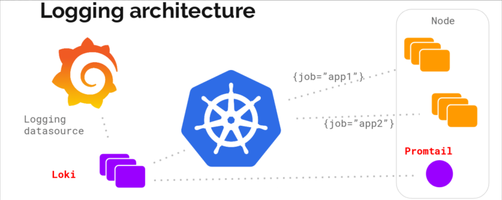

## 存储架构

日志的存储架构：

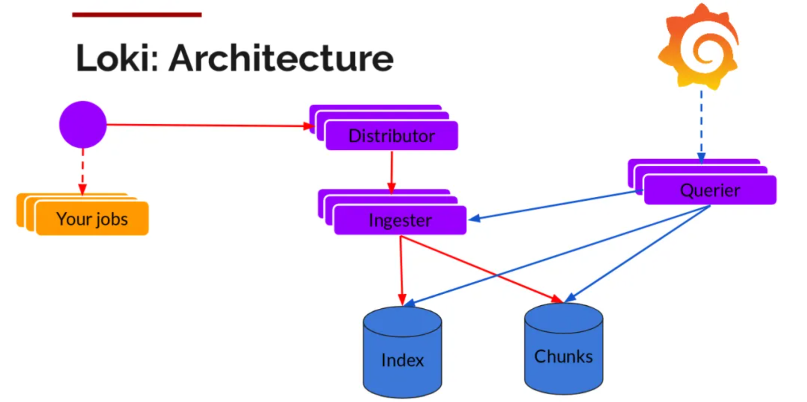

## 写日志

loki 进程包含 四种角色

- querier 查询器
- ingester 日志存储器
- query-frontend 前置查询器
- distributor 写入分发器

日志数据的写主要依托的是Distributor和Ingester两个组件，整体的流程如下：

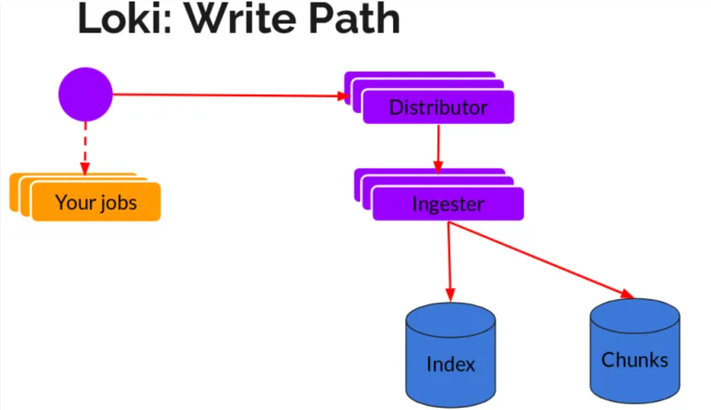

**Distributor**

一旦promtail收集日志并将其发送给loki，Distributor就是第一个接收日志的组件。由于日志的写入量可能很大，所以不能在它们传入时将它们写入数据库。这会毁掉数据库。需要批处理和压缩数据。

Loki通过构建压缩数据块来实现这一点，在日志进入时对其进行gzip操作，组件ingester是一个有状态的组件，负责构建和刷新chunck，当chunk达到一定的数量或者时间后，刷新到存储中去。每个流的日志对应一个ingester，当日志到达Distributor后，根据元数据和hash算法计算出应该到哪个ingester上面。此外，为了冗余和弹性，将其复制n（默认情况下为3）次。

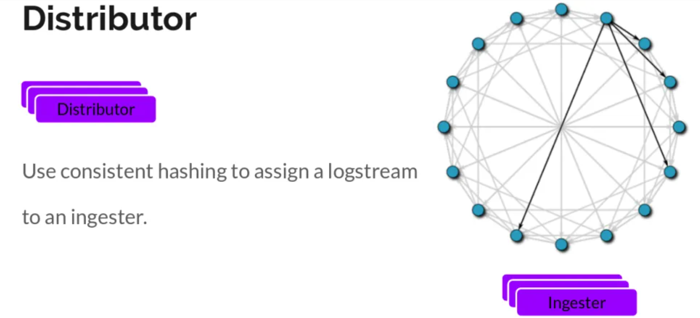

**Ingester**

Ingester接收到日志并开始构建chunk：

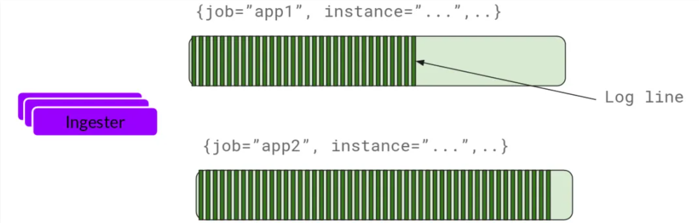

将日志进行压缩并附加到chunk上面。一旦chunk“填满”（数据达到一定数量或者过了一定期限），ingester将其刷新到数据库。对块和索引使用单独的数据库，因为它们存储的数据类型不同。刷新一个chunk之后，ingester然后创建一个新的空chunk并将新条目添加到该chunk中。

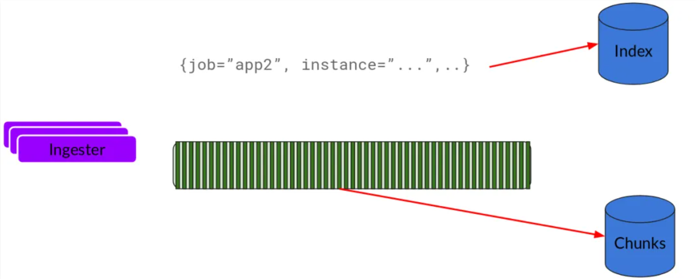

## 读日志

**Querier**

读取，由Querier负责给定一个时间范围和标签选择器，Querier查看索引以确定哪些块匹配，并通过greps将结果显示出来。它还从Ingester获取尚未刷新的最新数据。对于每个查询，一个查询器将为您显示所有相关日志。实现了查询并行化，提供分布式grep，使即使是大型查询也是足够的。

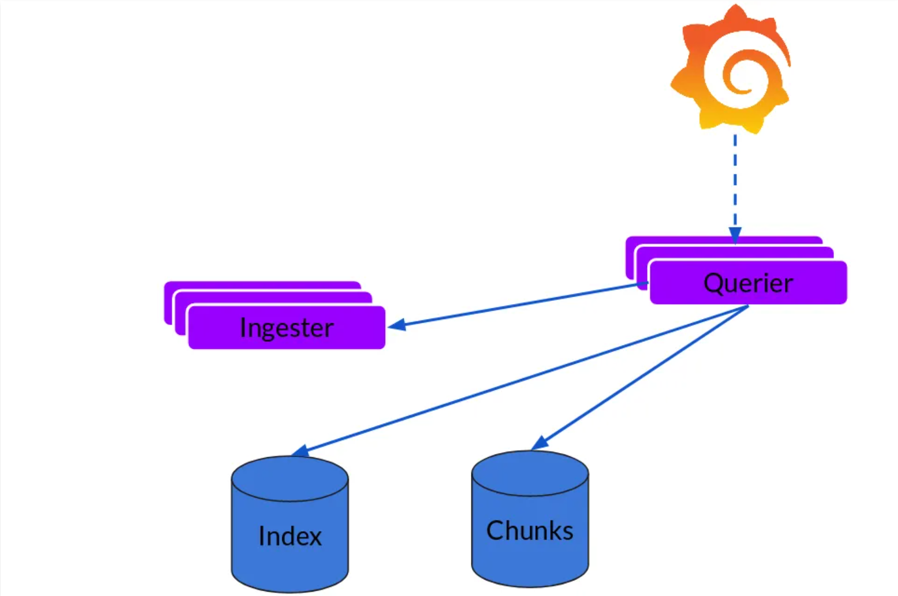

## 可扩展性

Loki的索引存储可以是cassandra/bigtable/dynamodb，而chuncks可以是各种对象存储，Querier和Distributor都是无状态的组件。对于ingester他虽然是有状态的但是，当新的节点加入或者减少，整节点间的chunk会重新分配，已适应新的散列环。而Loki底层存储的实现Cortex已经 在实际的生产中投入使用多年了。

## 优缺点

优点

- Loki的架构非常简单，使用了和prometheus一样的标签来作为索引，通过这些标签既可以查询日志的内容也可以查询到监控的数据，不但减少了两种查询之间的切换成本，也极大地降低了日志索引的存储。

- 与ELK相比，消耗的成本更低，具有成本效益。

- 在日志的收集以及可视化上可以连用grafana，实现在日志上的筛选以及查看上下行的功能。

缺点：

- 技术比较新颖，相对应的论坛不是非常活跃。

- 功能单一，只针对日志的查看，筛选有好的表现，对于数据的处理以及清洗没有ELK强大，同时与ELK相比，对于后期，ELK可以连用各种技术进行日志的大数据处理，但是loki不行。
- 

## 对比

与其他日志聚合系统相比，Loki 具有下面的一些特性：

- 不对日志进行全文索引。通过存储压缩非结构化日志和仅索引元数据，Loki 操作起来会更简单，更省成本。
- 通过使用与 Prometheus 相同的标签记录流对日志进行索引和分组，这使得日志的扩展和操作效率更高，能对接 alertmanager。
- 特别适合储存 Kubernetes Pod 日志；诸如 Pod 标签之类的元数据会被自动删除和编入索引。
- 受 Grafana 原生支持，避免 kibana 和 grafana 来回切换。

# 安装

官网：https://grafana.com/docs/loki/latest/setup/install/

## 服务端

Loki存储的数据为有状态的，安装时候推荐使用StatefulSet，创建loki.yaml文件：

这里使用pv作为存储，也可使用其他

```yaml
cat >loki.yaml EOF
apiVersion: v1
kind: ServiceAccount
metadata:
  name: loki
  namespace: logging
---
apiVersion: rbac.authorization.k8s.io/v1
kind: Role
metadata:
  name: loki
  namespace: logging
rules:
- apiGroups:
  - extensions
  resourceNames:
  - loki
  resources:
  - podsecuritypolicies
  verbs:
  - use
---
apiVersion: rbac.authorization.k8s.io/v1
kind: RoleBinding
metadata:
  name: loki
  namespace: logging
roleRef:
  apiGroup: rbac.authorization.k8s.io
  kind: Role
  name: loki
subjects:
- kind: ServiceAccount
  name: loki
---
apiVersion: v1
kind: ConfigMap
metadata:
  name: loki
  namespace: logging
  labels:
    app: loki
data:
  loki.yaml: |
    auth_enabled: false
    ingester:
      chunk_idle_period: 3m
      chunk_block_size: 262144
      chunk_retain_period: 1m
      max_transfer_retries: 0
      lifecycler:
        ring:
          kvstore:
            store: inmemory
          replication_factor: 1
    limits_config:
      enforce_metric_name: false
      reject_old_samples: true
      reject_old_samples_max_age: 168h
    schema_config:
      configs:
      - from: "2022-05-15"
        store: boltdb-shipper
        object_store: filesystem
        schema: v11
        index:
          prefix: index_
          period: 24h
    server:
      http_listen_port: 3100
    storage_config:
      boltdb_shipper:
        active_index_directory: /data/loki/boltdb-shipper-active
        cache_location: /data/loki/boltdb-shipper-cache
        cache_ttl: 24h
        shared_store: filesystem
      filesystem:
        directory: /data/loki/chunks
    chunk_store_config:
      max_look_back_period: 0s
    table_manager:
      retention_deletes_enabled: true
      retention_period: 48h
    compactor:
      working_directory: /data/loki/boltdb-shipper-compactor
      shared_store: filesystem
---
apiVersion: apps/v1
kind: StatefulSet
metadata:
  name: loki
  namespace: logging
  labels:
    app: loki
spec:
  podManagementPolicy: OrderedReady
  replicas: 1
  selector:
    matchLabels:
      app: loki
  serviceName: loki
  updateStrategy:
    type: RollingUpdate
  template:
    metadata:
      labels:
        app: loki
    spec:
      serviceAccountName: loki
      securityContext:
          fsGroup: 10001
          runAsGroup: 10001
          runAsNonRoot: true
          runAsUser: 10001
      initContainers: []
      containers:
        - name: loki
          image: grafana/loki:2.3.0
          imagePullPolicy: IfNotPresent
          args:
            - -config.file=/etc/loki/loki.yaml
          volumeMounts:
            - name: config
              mountPath: /etc/loki
            - name: loki-storage
              mountPath: /data
          ports:
            - name: http-metrics
              containerPort: 3100
              protocol: TCP
          livenessProbe:
            httpGet: 
              path: /ready
              port: http-metrics
              scheme: HTTP
            initialDelaySeconds: 45
            timeoutSeconds: 1
            periodSeconds: 10
            successThreshold: 1
            failureThreshold: 3
          readinessProbe:
            httpGet: 
              path: /ready
              port: http-metrics
              scheme: HTTP
            initialDelaySeconds: 45
            timeoutSeconds: 1
            periodSeconds: 10
            successThreshold: 1
            failureThreshold: 3
          securityContext:
            readOnlyRootFilesystem: true
      terminationGracePeriodSeconds: 4800
      imagePullSecrets:
        - name: your-secret
      volumes:
        - name: config
          configMap:
            defaultMode: 420
            name: loki
  volumeClaimTemplates:
    - metadata:
        name: loki-storage
        labels:
          app: loki
      spec:
        accessModes:
          - ReadWriteOnce
        resources:
          requests:
            storage: 3Gi
        volumeMode: Filesystem
---
apiVersion: v1
kind: Service
metadata:
  name: loki
  namespace: logging
  labels:
    app: loki
spec:
  type: ClusterIP
  ports:
    - port: 3100
      protocol: TCP
      name: http-metrics
      targetPort: http-metrics
  selector:
    app: loki
---
apiVersion: v1
kind: Service
metadata:
  name: loki-outer
  namespace: logging
  labels:
    app: loki
spec:
  type: NodePort
  ports:
    - port: 3100
      protocol: TCP
      name: http-metrics
      targetPort: http-metrics
      nodePort: 32537
  selector:
    app: loki
---
apiVersion: v1
kind: PersistentVolume
metadata:
  name: loki-storage
spec:
  capacity:
    storage: 5Gi
  nfs:
    server: yourIP
    path: /data/loki
  accessModes:
    - ReadWriteOnce
  persistentVolumeReclaimPolicy: Retain
  volumeMode: Filesystem
EOF

```

## Promtail

官网：https://grafana.com/docs/loki/latest/send-data/promtail/installation/

​	promtail，类似于tail，它只监听新增日志，不会像filebeat一样，读取日志所有内容，这是和filebeat的一个区别

​	Promtail的主要作用是进行日志采集，每个K8s宿主机上所存储的docker容器及日志存储是独立的，和Host绑定，为了可以采集到所有节点Node的数据，官方推荐Promatail使用DaemonSet安装，创建loki-promtail.yml文件，文件内容如下：

```yaml
cat >loki-promtail.yml EOF
apiVersion: v1
kind: ServiceAccount
metadata:
  name: loki-promtail
  labels:
    app: promtail
  namespace: logging
---
kind: ClusterRole
apiVersion: rbac.authorization.k8s.io/v1
metadata:
  labels:
    app: promtail
  name: promtail-clusterrole
  namespace: logging
rules:
- apiGroups: [""]
  resources:
  - nodes
  - nodes/proxy
  - services
  - endpoints
  - pods
  verbs: ["get", "watch", "list"]
---
kind: ClusterRoleBinding
apiVersion: rbac.authorization.k8s.io/v1
metadata:
  name: promtail-clusterrolebinding
  labels:
    app: promtail
  namespace: logging
subjects:
  - kind: ServiceAccount
    name: loki-promtail
    namespace: logging
roleRef:
  kind: ClusterRole
  name: promtail-clusterrole
  apiGroup: rbac.authorization.k8s.io
---
apiVersion: v1
kind: ConfigMap
metadata:
  name: loki-promtail
  namespace: logging
  labels:
    app: promtail
data:
  promtail.yaml: |2-
        client:
          backoff_config:
            max_period: 5m
            max_retries: 10
            min_period: 500ms
          batchsize: 1048576
          batchwait: 1s
          external_labels: {}
          timeout: 10s
        positions:
          filename: /run/promtail/positions.yaml
        server:
          http_listen_port: 3101
        target_config:
          sync_period: 10s
        scrape_configs:
        - job_name: kubernetes-pods-name
          pipeline_stages:
            - docker: {}
          kubernetes_sd_configs:
          - role: pod
          relabel_configs:
          - source_labels:
            - __meta_kubernetes_pod_label_name
            target_label: __service__
          - source_labels:
            - __meta_kubernetes_pod_node_name
            target_label: __host__
          - action: drop
            regex: ''
            source_labels:
            - __service__
          - action: labelmap
            regex: __meta_kubernetes_pod_label_(.+)
          - action: replace
            replacement: $1
            separator: /
            source_labels:
            - __meta_kubernetes_namespace
            - __service__
            target_label: job
          - action: replace
            source_labels:
            - __meta_kubernetes_namespace
            target_label: namespace
          - action: replace
            source_labels:
            - __meta_kubernetes_pod_name
            target_label: pod
          - action: replace
            source_labels:
            - __meta_kubernetes_pod_container_name
            target_label: container
          - replacement: /var/log/pods/$1/**/*.log
            separator: _
            source_labels:
            - namespace
            - pod
            - __meta_kubernetes_pod_uid
            target_label: __path__
        - job_name: kubernetes-pods-app
          pipeline_stages:
            - docker: {}
          kubernetes_sd_configs:
          - role: pod
          relabel_configs:
          - action: drop
            regex: .+
            source_labels:
            - __meta_kubernetes_pod_label_name
          - source_labels:
            - __meta_kubernetes_pod_label_app
            target_label: __service__
          - source_labels:
            - __meta_kubernetes_pod_node_name
            target_label: __host__
          - action: drop
            regex: ''
            source_labels:
            - __service__
          - action: labelmap
            regex: __meta_kubernetes_pod_label_(.+)
          - action: replace
            replacement: $1
            separator: /
            source_labels:
            - __meta_kubernetes_namespace
            - __service__
            target_label: job
          - action: replace
            source_labels:
            - __meta_kubernetes_namespace
            target_label: namespace
          - action: replace
            source_labels:
            - __meta_kubernetes_pod_name
            target_label: pod
          - action: replace
            source_labels:
            - __meta_kubernetes_pod_container_name
            target_label: container
          - replacement: /var/log/pods/$1/**/*.log
            separator: _
            source_labels:
            - namespace
            - pod
            - __meta_kubernetes_pod_uid
            target_label: __path__
        - job_name: kubernetes-pods-direct-controllers
          pipeline_stages:
            - docker: {}
          kubernetes_sd_configs:
          - role: pod
          relabel_configs:
          - action: drop
            regex: .+
            separator: ''
            source_labels:
            - __meta_kubernetes_pod_label_name
            - __meta_kubernetes_pod_label_app
          - action: drop
            regex: '[0-9a-z-.]+-[0-9a-f]{8,10}'
            source_labels:
            - __meta_kubernetes_pod_controller_name
          - source_labels:
            - __meta_kubernetes_pod_controller_name
            target_label: __service__
          - source_labels:
            - __meta_kubernetes_pod_node_name
            target_label: __host__
          - action: drop
            regex: ''
            source_labels:
            - __service__
          - action: labelmap
            regex: __meta_kubernetes_pod_label_(.+)
          - action: replace
            replacement: $1
            separator: /
            source_labels:
            - __meta_kubernetes_namespace
            - __service__
            target_label: job
          - action: replace
            source_labels:
            - __meta_kubernetes_namespace
            target_label: namespace
          - action: replace
            source_labels:
            - __meta_kubernetes_pod_name
            target_label: pod
          - action: replace
            source_labels:
            - __meta_kubernetes_pod_container_name
            target_label: container
          - replacement: /var/log/pods/$1/**/*.log
            separator: _
            source_labels:
            - namespace
            - pod
            - __meta_kubernetes_pod_uid
            target_label: __path__
        - job_name: kubernetes-pods-indirect-controller
          pipeline_stages:
            - docker: {}
          kubernetes_sd_configs:
          - role: pod
          relabel_configs:
          - action: drop
            regex: .+
            separator: ''
            source_labels:
            - __meta_kubernetes_pod_label_name
            - __meta_kubernetes_pod_label_app
          - action: keep
            regex: '[0-9a-z-.]+-[0-9a-f]{8,10}'
            source_labels:
            - __meta_kubernetes_pod_controller_name
          - action: replace
            regex: '([0-9a-z-.]+)-[0-9a-f]{8,10}'
            source_labels:
            - __meta_kubernetes_pod_controller_name
            target_label: __service__
          - source_labels:
            - __meta_kubernetes_pod_node_name
            target_label: __host__
          - action: drop
            regex: ''
            source_labels:
            - __service__
          - action: labelmap
            regex: __meta_kubernetes_pod_label_(.+)
          - action: replace
            replacement: $1
            separator: /
            source_labels:
            - __meta_kubernetes_namespace
            - __service__
            target_label: job
          - action: replace
            source_labels:
            - __meta_kubernetes_namespace
            target_label: namespace
          - action: replace
            source_labels:
            - __meta_kubernetes_pod_name
            target_label: pod
          - action: replace
            source_labels:
            - __meta_kubernetes_pod_container_name
            target_label: container
          - replacement: /var/log/pods/$1/**/*.log
            separator: _
            source_labels:
            - namespace
            - pod
            - __meta_kubernetes_pod_uid
            target_label: __path__
        - job_name: kubernetes-pods-static
          pipeline_stages:
            - docker: {}
          kubernetes_sd_configs:
          - role: pod
          relabel_configs:
          - action: drop
            regex: ''
            source_labels:
            - __meta_kubernetes_pod_annotation_kubernetes_io_config_mirror
          - action: replace
            source_labels:
            - __meta_kubernetes_pod_label_component
            target_label: __service__
          - source_labels:
            - __meta_kubernetes_pod_node_name
            target_label: __host__
          - action: drop
            regex: ''
            source_labels:
            - __service__
          - action: labelmap
            regex: __meta_kubernetes_pod_label_(.+)
          - action: replace
            replacement: $1
            separator: /
            source_labels:
            - __meta_kubernetes_namespace
            - __service__
            target_label: job
          - action: replace
            source_labels:
            - __meta_kubernetes_namespace
            target_label: namespace
          - action: replace
            source_labels:
            - __meta_kubernetes_pod_name
            target_label: pod
          - action: replace
            source_labels:
            - __meta_kubernetes_pod_container_name
            target_label: container
          - replacement: /var/log/pods/$1/**/*.log
            separator: _
            source_labels:
            - namespace
            - pod
            - __meta_kubernetes_pod_uid
            target_label: __path__
---
apiVersion: apps/v1
kind: DaemonSet
metadata:
  name: loki-promtail
  namespace: logging
  labels:
    app: promtail
spec:
  selector:
    matchLabels:
      app: promtail
  updateStrategy:
    rollingUpdate:
      maxUnavailable: 1
    type: RollingUpdate
  template:
    metadata:
      labels:
        app: promtail
    spec:
      serviceAccountName: loki-promtail
      containers:
        - name: promtail
          image: grafana/promtail:2.3.0
          imagePullPolicy: IfNotPresent
          args: 
          - -config.file=/etc/promtail/promtail.yaml
          - -client.url=http://loki:3100/loki/api/v1/push
          env: 
          - name: HOSTNAME
            valueFrom: 
              fieldRef: 
                apiVersion: v1
                fieldPath: spec.nodeName
          volumeMounts:
          - mountPath: /etc/promtail
            name: config
          - mountPath: /run/promtail
            name: run
          - mountPath: /var/lib/docker/containers
            name: docker
            readOnly: true
          - mountPath: /var/log/pods
            name: pods
            readOnly: true
          ports:
          - containerPort: 3101
            name: http-metrics
            protocol: TCP
          securityContext:
            readOnlyRootFilesystem: true
            runAsGroup: 0
            runAsUser: 0
          readinessProbe:
            failureThreshold: 5
            httpGet:
              path: /ready
              port: http-metrics
              scheme: HTTP
            initialDelaySeconds: 10
            periodSeconds: 10
            successThreshold: 1
            timeoutSeconds: 1
      imagePullSecrets:
        - name: your-secret
      tolerations:
      - effect: NoSchedule
        key: node-role.kubernetes.io/master
        operator: Exists
      volumes:
        - name: config
          configMap:
            defaultMode: 420
            name: loki-promtail
        - name: run
          hostPath:
            path: /run/promtail
            type: ""
        - name: docker
          hostPath:
            path: /var/lib/docker/containers
        - name: pods
          hostPath:
            path: /var/log/pods
EOF

```

配置解释

```bash
● promtail通过scrape_configs部分配置收集日志的相关信息，以测试配置文件为例：
● job_name  用来区分日志组
● static_configs  收集日志的静态配置
● targets  收集日志的节点，这个参数其实是在自动发现的时候使用的
● labels  定义一个要收集的日志文件和一组可选的附加标签
● job  标签名称，在grafana索引的时候用到的标签名称
● __path__  定义日志收集的文件或路径，支持正则
```

使用Promtail核心操作在于两步

- 挂载k8s节点宿主机到容器内目录，这一步需要注意Docker的工作目录，默认为`/var/lib/docker/`，如果修改了，在挂载目录时需要同步修改。k8s 1.14之前版本为`/var/log/pods/<pod_uid>/<container_name>/<num>.log`，1.14 or later: `/var/log/pods/<namespace>_<pod_name>_<pod_uid>/<container_name>/<num>.log`。其中num为容器重启的次数，使用ls -l命令查看会发现/var/log/pods/中的日志文件为软链接/var/lib/docker/中的文件，因此在挂载时后需要注意。

- 日志文件路径匹配，在进行relabel_configs配置时需要结合容器中的实际地址进行标签设置。

```yaml
- action: replace
            source_labels:
            - __meta_kubernetes_pod_container_name
            target_label: container
          - replacement: /var/log/pods/$1/**/*.log
            separator: _
            source_labels:
            - namespace
            - pod
            - __meta_kubernetes_pod_uid
            target_label: __path__
```

当遇到__path__时会将replacement替换为具体的文件路径，$1表示取source_labels中的第一个参数，在此对应namespace，这里的namespace已经进行了替换，会被拼接为实际的值。

## granfana

安装略

配置

登录后，在设置——数据源中，选择添加数据源，下来列表中直接选择Loki即可

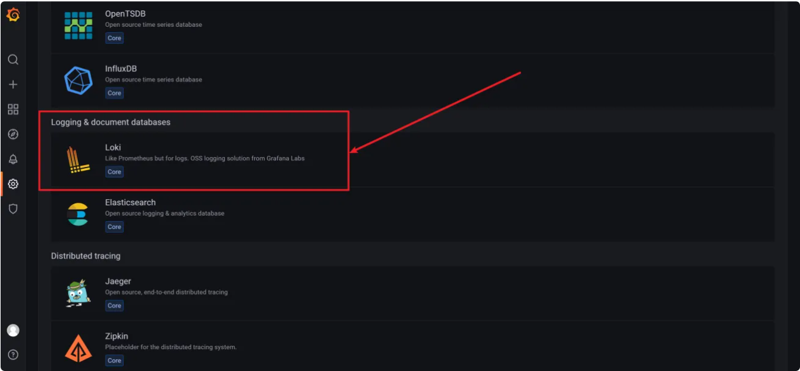

接着配置数据源，只需要修改URL即可，其他可以根据自己的需要

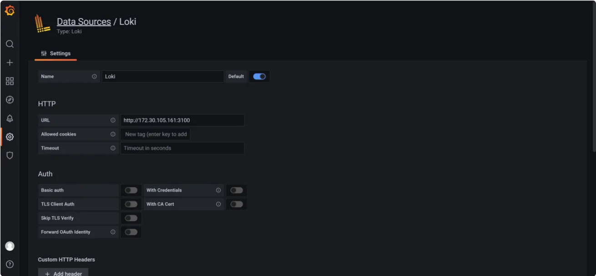

因为这里loki是没有做认证的，所以这里不需要认证配置，直接填写loki的地址即可，保存完成后，在Explore中查看日志

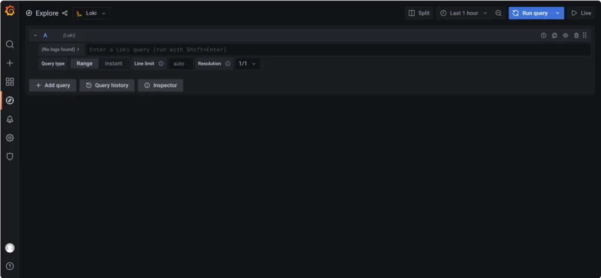

这里支持LogQL语法，默认情况下，如果不添加规则，是没有日志展示的，在Log browser中添加query，根据在promtail中定义的label

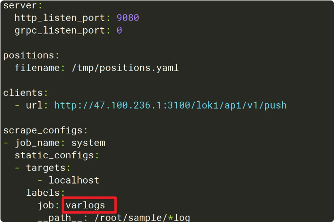

比如promtail的job是varlogs，这里填写`{job="varlogs"}`，然后run query

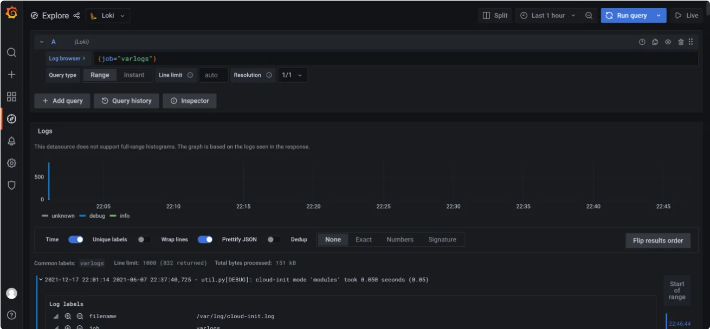

就可以看到varlogs的日志，日志界面很清爽，保留了日志原有的样子，通过颜色区分日志级别，这里info是绿色，error是红色，可以很直观的看到日志的类别，也可以通过点击日志级别，只展示该级别的日志

# LogQL 语法

**选择器**

对于查询表达式的标签部分，将放在`{}`中，多个标签表达式用逗号分隔：

```json
{app="mysql",name="mysql-backup"}
```

支持的符号有：

- =：完全相同。
- !=：不平等。
- =~：正则表达式匹配。
- !~：不要正则表达式匹配。

**过滤表达式**

编写日志流选择器后，可以通过编写搜索表达式进一步过滤结果。搜索表达式可以文本或正则表达式。

如：

- `{job="mysql"} |= "error"`
- `{name="kafka"} |~ "tsdb-ops.*io:2003"`
- `{instance=~"kafka-[23]",name="kafka"} != kafka.server:type=ReplicaManager`

支持多个过滤：

- `{job="mysql"} |= "error" !="timeout"`

目前支持的操作符：

- |= line包含字符串。
- != line不包含字符串。
- |~ line匹配正则表达式。
- !~ line与正则表达式不匹配。

表达式遵循https://github.com/google/re2/wiki/Syntax语法。