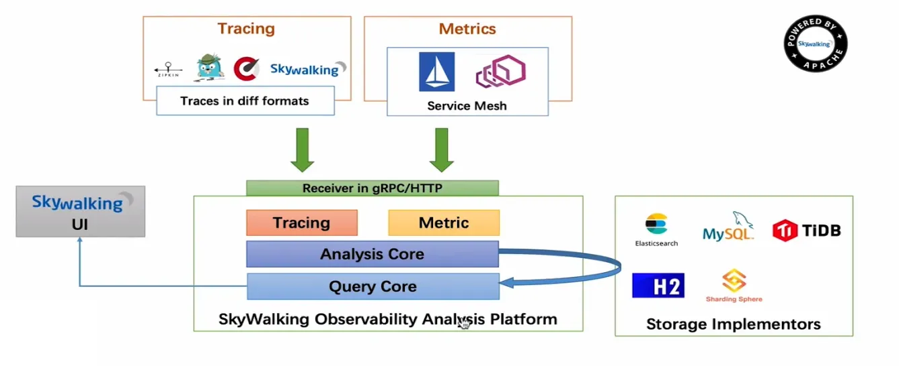
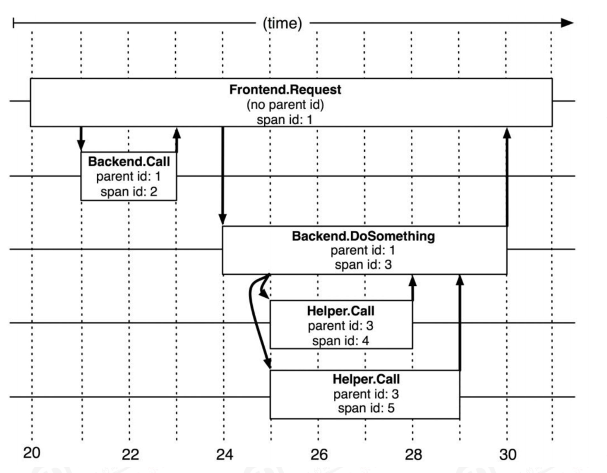
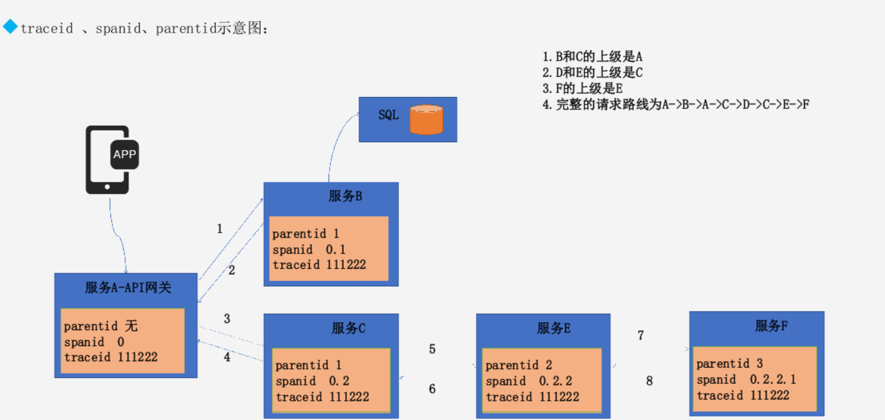
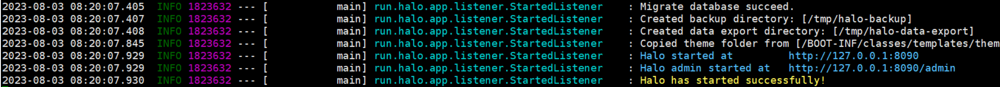

+++
title = "skywalking"
date = "2026-05-28T00:01:08+08:00"
draft = false
+++

# 简介

官网地址：https://skywalking.apache.org/

Skywalking是分布式系统的应用程序性能监视工具，专为微服务，云原生架构和基于容器（Docker，K8S,Mesos）架构而设计，它是一款优秀的APM（Application Performance Management）工具，包括了分布式追踪，性能指标分析和服务依赖分析等。

SkyWalking 的核心是数据分析和度量结果的存储平台，通过 HTTP 或 gRPC 方式向 SkyWalking Collecter 提交分析和度量数据，SkyWalking Collecter 对数据进行分析和聚合，存储到 Elasticsearch、MySQL、TiDB 等其一即可，最后我们可以通过 SkyWalking UI 的可视化界面对最终的结果进行查看。

Skywalking 支持从多个来源和多种格式收集数据：多种语言的 Skywalking Agent 、Zipkin v1/v2 、Istio 勘测、Envoy 度量等数据格式。



特性

- 多种监控手段，语言探针和service mesh
- 多语言自动探针，Java，.NET Core和Node.JS
- 轻量高效，不需要大数据
- 模块化，UI、存储、集群管理多种机制可选
- 支持告警
- 优秀的可视化方案

基于dapper或类似的跟踪系统，可以跟随客户的完整请求流程，从前端服务接受客户请求开始到全部后端服务处理完成并经过前端给客户端返回数据，将完整请求链路经过的每一个服务信息的耗时都进行收集并进行统一存储和展示、方便运维人员快速定位问题。

**skywalking 功能:**

- 实现从请求跟踪、指标收集和日志记录的完整信息记录。

- 多语言自动探针，支持Java、GO、Python、PHP、NodeJS、LUA、Rust等客户端。

- 内置服务网格可观察性，支持从Istio+Envoy Service Mesh收集和分析数据。

- 模块化架构，存储、集群管理、使用插件集合都可以进行自由选择。

- 支持告警。

- 优秀的可视化效果

  

# 数据采集方法

- 黑盒法(black-box):

​	黑盒法无需任何侵入性代码，它的优势在于无需修改代码，缺点在于记录不是很准确，且需要大量数据才能够推导出服务间的关系。

- 标记法(annotation-based):

​	标记法需要为每个请求打标记，并通过一个全局标识符将请求途径的所有服务信息串联，复盘整个链路。标记法记录准确，但它的缺点也很明显，需要将标记代码注入到每个服务中。

- 跟踪树和span:

​	Span 代表系统中具有开始时间和执行时长的请求跨度，Span之间通过嵌套或者顺序排列建立逻辑因果关系。在Dapper跟踪树结构中，树节点是整个架构的基本单元，是请求从前端到后端不同应用之间层级机构，而每一个节点又是对span的引用，节点之间的连线表示的span和它的父span之间的关系。

​	在图中说明了span在一个大的跟踪过程中是什么样的，Dapper记录了span名称，以及每个span的ID和父ID，以重建在一次追踪过程中不同span之间的关系，如果一个span没有父ID被称为root span，所有span都挂在一个特定的跟踪上，也共用一个跟踪id（traceId在 图中未示出），所有这些ID用全局唯一的64位整数标示，在一个典型的Dapper跟踪中，我们希望为每一个RPC对应到一个单一的span上，而且每一个额外的组件层都对应一个跟踪树型结构的层级。



​	任何一个span可以包含来自不同的主机信息，这些也要记录下来，事实上每一个RPC span可以包含客户端和服务器两个过程的注释，使得链接两个主机的span会成为图中所说的span，由于客户端和服务器上的时间戳来自不同的主机，还必须考虑到时间偏差，在分析工具就利用了时间偏差，即RPC客户端发送一个请求之后，服务器端才能接收到，对于响应也是一样的（服务器先响应，然后客户端才能接收到这个响应），这样一来，服务器端的RPC就有一个时间戳的一个开始和结束，然后就可以计算出时间损耗。

**traceid 、spanid、parentid**

spanid 跨节点就会变化 可以前后进行排序
parentid 在同一层级是一样的。parentid越小层级越高



如图可见：

1. 第一次请求 没有parnetid spanid为0（新产生）traceid跟踪id新产生且同一请求不会变化；
2. 当服务向后转发B时，parentid会加1，表示次请求向后转发过一次，也表示自己是之后转发服务的上游服务，spanid变成0.1；
3. 而服务向后转发c时，由于都是从服务A转发，层级与服务B相同，因此parentid也是1，而spanid为0.2表示与服务B同级切在服务B之后转发；
4. 而服务E是由服务C转发，因此parentid加一，spanid为0.2.2表示是服务c的下一层级；
5. 服务F与服务E同理；

Dapper应用场景：

- 性能分析：开发人员针对请求延迟的目标进行跟踪，并对容易优化的地方进行定位。
- 正确性分析：发现一些只读请求应该是访问从库但是却访问了主库等类似业务场景。
- 理解系统：全局优化系统，理解每个查询的整体代价。
- 测试新版本：发现新版本的bug和性能问题。
- 解决依赖关系：找到服务之间的依赖关系。


# skywalking 组件

## 组件介绍

- OAP平台(Observability Analysis Platform，可观测性分析平台)或OAP Server，它是一个高度组件化的轻量级分析程序，由兼容各种探针Receiver、流式分析内核和查询内核三部分构成。
- 探针：基于无侵入式的收集，并通过HTTP或者gRPC方式发送数据到OAP Server。
- 存储实现(Storage Implementors)，SkyWalking OAP Server支持多种存储实现并且提供了标准接口，可支持不同的存储后端。支持的存储有elasticsearch、h2、mysql、tidb、influxdb、postgresql等
- UI模块(SkyWalking)，通过标准的GraphQL(Facebook在2012年开源)协议进行统计数据查询和展示 。

## 设计模式

- 面向协议设计：面向协议设计是SkyWalking从5.x开始严格遵守的首要设计原则，组件之间使用标准的协议进行数据交互。
- 协议有探针协议和查询协议

## 探针协议

- 探针上报协议：协议包括语言探针的注册、Metrics数据上报、Tracing数据据上报等标准，Java、Go等探针都需要严格遵守此协议的标准。
- 探针交互协议：因为分布式追踪环境，探针间需要借助HTTP Header、MQ Header在应用之间进行通信和交互，探针交互协议就定义了交互的数据格式。
- Service Mesh协议：是SkyWalking对Service Mesh抽象的专有协议，任何Mesh类的服务都可以通过此协议直接上传指标数据，用于计算服务的指标数据和绘制拓扑图。
- 第三方协议： 对大型的第三方开源项目 尤其是Service Mesh核心平台Istio和Envoy,提供核心协议适配，支持针对Istio+Envoy Service Mesh进行无缝对接

## 数据查询协议

- 元数据查询：查询在SkyWalking注册的服务、服务实例、Endpoint等元数据信息。
- 拓扑关系查询：查询全局、或者单个服务、Endpoint的拓扑图及依赖关系。
- Metrics指标查询： 查询指标数据。
- 聚合指标查询：区间范围均值查询及Top N排名数据查询等。
- Trace查询：追踪数据的明细查询。
- 告警查询：基于表达式，判断指标数据是否超出阈值。


# k8s部署

## oap server

使用es进行存储数据，先搭建es：

es.yaml

```yaml
apiVersion: apps/v1
# 设置控制器
kind: StatefulSet
metadata:
  name: es-cluster
  namespace: psw002-test
spec:
  # 必须设置
  serviceName: es-cluster-svc
  # 设置副本数
  replicas: 3
  # 设置选择器
  selector:
    # 设置标签
    matchLabels:
      app: es-net-data
  template:
    metadata:
      # 此处必须要与上面的matchLabels相同
      labels: 
        app: es-net-data
    spec:
      #pod亲和性
      affinity:
        #定义 Pod 反亲和性
        podAntiAffinity:
          #规定了在调度 Pod 时必须满足的条件。这里指定了一个标签选择器，要求 Pod 不应该与具有特定标签的其他 Pod 在同一节点上调度
          requiredDuringSchedulingIgnoredDuringExecution:
              # 选择器用于匹配其他 Pod 的标签
            - labelSelector:
                # 匹配表达式数组，这里使用了一个匹配 app 标签的表达式
                matchExpressions:
                  - key: "app"       
                    operator: In
                    values:
                      - es-net-data
              topologyKey: "kubernetes.io/hostname"
      #serviceAccountName: nfs-client-provisoner
      # 初始化容器
      # 初始化容器的作用是在应用容器启动之前做准备工作，每个init容器都必须在下一个启动之前成功完成
      initContainers:
        - name: increase-vm-max-map
          image: busybox:1.32
          command: ["sysctl", "-w", "vm.max_map_count=262144"]
          securityContext:
            privileged: true
        - name: increase-fd-ulimit
          image: busybox:1.32
          command: ["sh", "-c", "ulimit -n 65536"]
          securityContext:
            privileged: true
      # 初始化容器结束后，才能继续创建下面的容器
      containers:
        - name: es-container
          image: swr.cn-south-1.myhuaweicloud.com/psw002-test/elasticsearch:v8.9.1
          ports:
            # 容器内端口
            - name: rest
              containerPort: 9200
              protocol: TCP
          # 限制CPU数量
          resources:
            limits:
              cpu: 1000m
            requests:
              cpu: 100m
          # 设置挂载目录
          volumeMounts:
            - name: es-data
              mountPath: /usr/share/elasticsearch/data
 
          # 设置环境变量
          env:
            # 自定义集群名
            - name: cluster.name
              value: k8s-es
            # 定义节点名，使用metadata.name名称
            - name: node.name
              valueFrom:
                fieldRef:
                  fieldPath: metadata.name
              # 添加以下配置，根据需要选择启用或禁用安全性以及 SSL 8.x版本需要
            - name: xpack.security.enabled
              value: "false"
          
            - name: discovery.seed_providers
              value: "file"
            - name: discovery.seed_hosts
              value: "es-cluster-0.es-cluster-svc.psw002-test.svc.cluster.local,es-cluster-1.es-cluster-svc.psw002-test.svc.cluster.local,es-cluster-2.es-cluster-svc.psw002-test.svc.cluster.local"
            # 初始化集群时，ES从中选出master节点
            - name: cluster.initial_master_nodes
              # 对应metadata.name名称加编号，编号从0开始
              value: "es-cluster-0,es-cluster-1,es-cluster-2"
            #- name: discovery.zen.ping.unicast.hosts   # 参数在8.x被移除
            #  value: "es-cluster-0,es-cluster-1,es-cluster-2"
            # 发现节点的地址，discovery.seed_hosts的值应包括所有master候选节点
            # 如果discovery.seed_hosts的值是一个域名，且该域名解析到多个IP地址，那么es将处理其所有解析的IP地址。
            #- name: discovery.seed_hosts
            #  value: "es-cluster-svc"
 
            # 配置内存
            - name: ES_JAVA_OPTS
              value: "-Xms1g -Xmx1g"
            - name: network.host
              value: "0.0.0.0"
 
  volumeClaimTemplates:
    - metadata:
        # 对应容器中volumeMounts.name
        name: es-data
        labels:
          app: es-volume
      spec:
        # 存储卷可以被单个节点读写
        accessModes: [ "ReadWriteOnce" ]
        # 对应es-nfs-storage-class.yaml中的metadata.name
        storageClassName: managed-nfs-storage 
        # 申请资源的大小
        resources:
          requests:
            storage: 10Gi
---
apiVersion: v1
kind: Service
metadata:
  name: es-cluster-svc
  namespace: psw002-test
spec:
  selector:
    # 注意一定要与"es-cluster.yaml"中spec.selector.matchLabels相同
    app: es-net-data
 
  # 设置服务类型
  type: NodePort
  ports:
    - name: rest
      # 服务端口
      port: 9200
      # 应用端口（Pod端口）
      targetPort: 9200
      # 映射到主机的端口，端口范围是30000~32767

```


skywalking-oap.yaml

```yaml
apiVersion: apps/v1
kind: Deployment
metadata:
  name: skywalking-oap
  namespace: psw002-test
  labels:
    app: skywalking-oap
spec:
  replicas: 1
  selector:
    matchLabels:
      app: skywalking-oap
  template:
    metadata:
      labels:
        app: skywalking-oap
    spec:
      containers:
        - name: skywalking-oap
          image: swr.cn-south-1.myhuaweicloud.com/psw002-test/skywalking-oap-server:v9.5.0  ##镜像
          imagePullPolicy: Always ##如果存在就不拉去取
          ports:
            - containerPort: 11800
              name: grpc
            - containerPort: 12800
              name: rest
          resources:
            limits:
              cpu: 500m
              memory: 2Gi
            requests:
              cpu: 500m
              memory: 2Gi
          env:
            - name: SW_STORAGE
              value: elasticsearch  ##存储方式
            - name: SW_STORAGE_ES_CLUSTER_NODES
              value: es-cluster-svc:9200 ##es地址，通过service的方式进行访问
---
apiVersion: v1
kind: Service
metadata:
  name: skywalking-oap-svc
  namespace: psw002-test
  labels:
    service: skywalking-oap
spec:
  ports:
    - port: 12800
      name: rest
    - port: 11800
      name: grpc
  selector:
    app: skywalking-oap

```

## ui web端

```yaml
apiVersion: apps/v1
kind: Deployment
metadata:
  name: skywalking-oap
  namespace: psw002-test
  labels:
    app: skywalking-oap
spec:
  replicas: 1
  selector:
    matchLabels:
      app: skywalking-oap
  template:
    metadata:
      labels:
        app: skywalking-oap
    spec:
      containers:
        - name: skywalking-oap
          image: swr.cn-south-1.myhuaweicloud.com/psw002-test/skywalking-oap-server:v9.5.0  ##镜像
          imagePullPolicy: Always ##如果存在就不拉去取
          ports:
            - containerPort: 11800
              name: grpc
            - containerPort: 12800
              name: rest
          resources:
            limits:
              cpu: 500m
              memory: 2Gi
            requests:
              cpu: 500m
              memory: 2Gi
          env:
            - name: SW_STORAGE
              value: elasticsearch  ##存储方式
            - name: SW_STORAGE_ES_CLUSTER_NODES
              value: es-cluster-svc:9200 ##es地址
---
apiVersion: v1
kind: Service
metadata:
  name: skywalking-oap-svc
  namespace: psw002-test
  labels:
    service: skywalking-oap
spec:
  ports:
    - port: 12800
      name: rest
    - port: 11800
      name: grpc
  selector:
    app: skywalking-oap

[root@wz-ecs-jenkins skywalking]# cat skywalking-ui.yaml 
apiVersion: apps/v1
kind: Deployment
metadata:
  name: skywalking-ui
  namespace: psw002-test
  labels:
    app: skywalking-ui
spec:
  replicas: 8
  selector:
    matchLabels:
      app: skywalking-ui
  template:
    metadata:
      labels:
        app: skywalking-ui
    spec:
      containers:
        - name: skywalking-ui
          #image: swr.cn-south-1.myhuaweicloud.com/psw002-test/skywalking-ui:v9.5.0
          image: apache/skywalking-ui:9.5.0
          ports:
            - containerPort: 8080
              name: page
          env:
            - name: SW_OAP_ADDRESS
              value: skywalking-oap-svc:12800 ##skywalking-oap监听端口
---
apiVersion: v1
kind: Service
metadata:
  name: skywalking-ui
  namespace: psw002-test
  labels:
    service: skywalking-ui
spec:
  ports:
    - port: 8080
      targetPort: 8080
      name: page
      nodePort: 30201
  type: NodePort
  selector:
    app: skywalking-ui

```

## **Java Agent**

下载链接：https://archive.apache.org/dist/skywalking/java-agent/

```bash
wget https://archive.apache.org/dist/skywalking/java-agent/8.8.0/apache-skywalking-java-agent-8.8.0.tgz
tar xf apache-skywalking-java-agent-8.8.0.tgz
```

```bash
# 修改配置文件
cd skywalking-agent/config
vim agent.config
# The agent namespace
agent.namespace=${SW_AGENT_NAMESPACE:java}  #自定义namespace，类似于项目名称
# The service name in UI
agent.service_name=${SW_AGENT_NAME:dubbo}  #自定义service 名称，类似于具体某个微服务的服务名称
# Backend service addresses.
collector.backend_service=${SW_AGENT_COLLECTOR_BACKEND_SERVICES:192.168.9.30:11800}  #指定skywalking地址:gRPC数据端口
```

启动的时候指定链路追踪，启动jar程序的时候前面指定即可

```bash
# java -javaagent:/usr/local/skywalking-agent/skywalking-agent.jar -jar xxxx.jar 
```


### 简单监控一个java程序

依赖jdk11环境，需提前安装

```bash
wget https://dl.halo.run/release/halo-1.6.1.jar
java -javaagent:./skywalking-agent.jar -jar /apps/halo-1.6.1.jar

```

启动之后可以看到启动成功



然后访问对应端口，创建一篇简单博客，之后可在skywalking中看到数据

### 结合k8s

#### 1.打包镜像

skywalking 实现收集kubernetes环境dubbo微服务链路跟踪案例：https://www.cnblogs.com/punchlinux/p/17198488.html

skywalking 实现收集基于虚拟机环境 dubbo微服务链路跟踪案例：https://www.cnblogs.com/punchlinux/p/17198379.html

```bash
# 将已配置好的agent打包
tar zcf skywalking-agent.tar.gz skywalking-agent
```

创建dockerfile，打包镜像

```bash
cat >Dockerfile <<EOF
 
#Dubbo provider
FROM harbor.cncf.net/baseimages/jdk:11.0.17

RUN mkdir -p /usr/local/app
ADD dubbo-server.jar  /usr/local/app &&\
ADD skywalking-agent.tar.gz /usr/local/app &&\   # 注意是将已经更改配置好了的agent重新打的包上传，会自动解压
WORKDIR /usr/local/app
 
CMD ["java -javaagent:./skywalking-agent.jar -jar /apps/halo-1.6.1.jar"]
EOF

```

```bash
# 创建镜像
nerdctl build -t harbor.cncf.net/project/halo:v1
# 可以上传到harbor
nerdctl push harbor.cncf.net/project/halo:v1
```

配置k8s yaml文件

```yaml
cat >app.yaml <<EOF 
kind: Deployment
apiVersion: apps/v1
metadata:
  labels:
    app: halo
  name: halo-deployment
  namespace: test
spec:
  replicas: 3
  selector:
    matchLabels:
      app: halo
  template:
    metadata:
      labels:
        app: halo
    spec:
      containers:
      - name: halo-container
        image: harbor.cncf.net/project/halo:v1 
        imagePullPolicy: IfNotPresent
        ports:
        - containerPort: 8080
          protocol: TCP
          name: http
 
---
kind: Service
apiVersion: v1
metadata:
  labels:
    app: halo
  name: halo-svc
  namespace: test
spec:
  type: NodePort
  ports:
  - name: http
    port: 8080
    protocol: TCP
    targetPort: 8080
    nodePort: 38800
  selector:
    app: halo 
EOF

```

检查启动正常之后，在skywalking查看链路情况

#### 2.initContainer

以若依项目的auth模块为例

```yaml
apiVersion: apps/v1
kind: Deployment
metadata:
  name: ruoyi-auth
  namespace: dev
  labels:
    app: ruoyi-auth
spec:
  replicas: 1
  selector:
    matchLabels:
      app: ruoyi-auth
  strategy:
    rollingUpdate:
      maxSurge: 70%
      maxUnavailable: 30%
    type: RollingUpdate
  template:
    metadata:
      labels:
        app: ruoyi-auth
    spec:
      terminationGracePeriodSeconds: 60
      initContainers:
        - name: agent-container
          image: apache/skywalking-java-agent:8.9.0-alpine
          env:
            - name: SW_LOGGING_LEVEL
              value: ERROR
            - name: SW_AGENT_TRACE_IGNORE_PATH
              value: '/actuator/**'
          volumeMounts:
            - mountPath: /agent
              name: skywalking-agent
          command: ["/bin/sh"]
          args: ["-c","cp -R /skywalking/agent /agent/ "]
          resources:
            requests:
              cpu: 0.2
              memory: 200Mi
            limits:
              cpu: 0.2
              memory: 200Mi
      volumes:
        - name: skywalking-agent
          emptyDir: {}
          
      containers:
        - name: ruoyi-auth
          image: registry.cn-beijing.aliyuncs.com/kubesre03/ruoyi-auth:v3.0
          imagePullPolicy: IfNotPresent
          ports:
            - containerPort: 8090
          env:
            - name: JAVA_SERVICE_NAME
              valueFrom:
                fieldRef:
                  fieldPath: metadata.labels['app']
            - name: JAVA_SERVICE_NAMESPACE
              valueFrom:
                fieldRef:
                  fieldPath: metadata.namespace
            - name: NACOS_SERVICE_NAME
              value: nacos-headless
            - name: NACOS_NAMESPACE
              value: public
            - name: JAVA_TOOL_OPTIONS
              value: "-javaagent:/skywalking-agent/agent/skywalking-agent.jar"
            - name: SW_AGENT_COLLECTOR_BACKEND_SERVICES
              value: oap-svc.skywalking.svc.cluster.local:11800
            - name: SW_AGENT_NAME
              valueFrom:
                fieldRef:
                  fieldPath: metadata.labels['app']
          ### 启动探针
          startupProbe:
            httpGet:
              port: 8090
              path: /actuator/health/ping
            initialDelaySeconds: 300
            failureThreshold: 30
            periodSeconds: 30
          ### 就绪探针
          readinessProbe:
            httpGet:
              port: 8090
              path: /actuator/health/ping
            initialDelaySeconds: 30  # 第一次执行探针前等待的时间
            periodSeconds: 30  # 每隔多少秒执行一次
            failureThreshold: 5
          ### 存活探针
          livenessProbe:
            httpGet:
              port: 8090
              path: /actuator/health/ping
            initialDelaySeconds: 30
            periodSeconds: 30
            failureThreshold: 3
            timeoutSeconds: 5
          resources:
            requests:
              cpu: 0.3
              memory: 800Mi
            limits:
              cpu: 0.3
              memory: 800Mi
          lifecycle:
            preStop:
              exec:
                command: ["/bin/sh","-c","/data/down-nacos.sh"]
          volumeMounts:
            - mountPath: /skywalking-agent
              name: skywalking-agent

```

