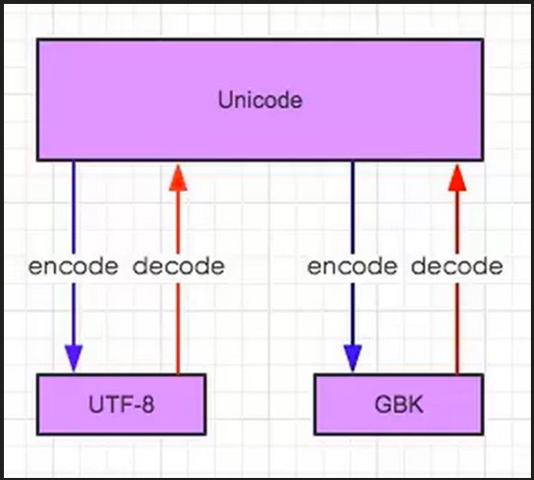
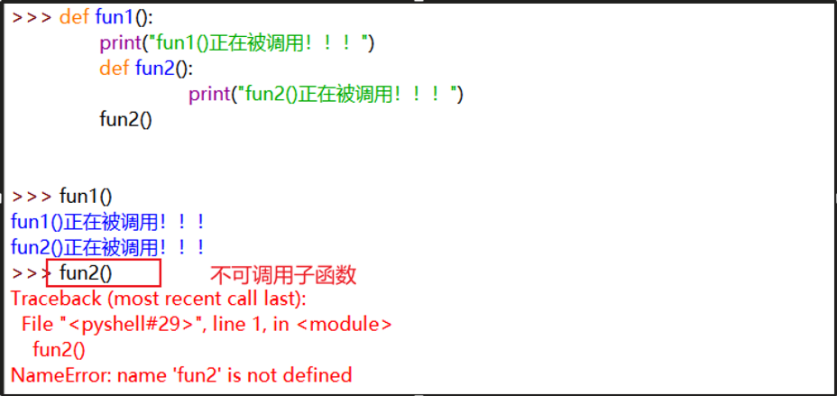
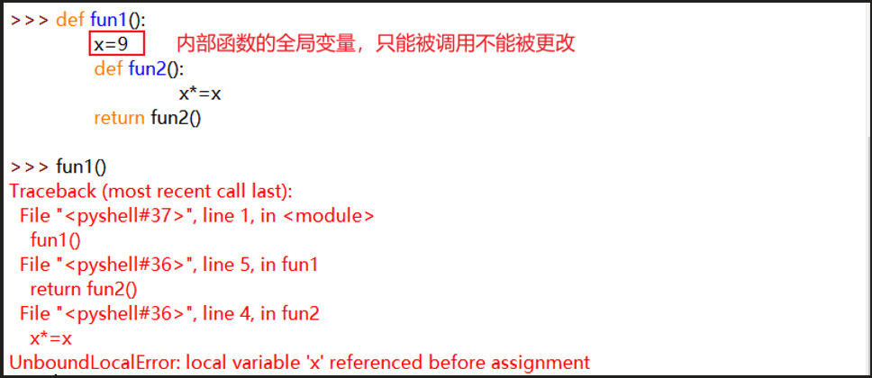
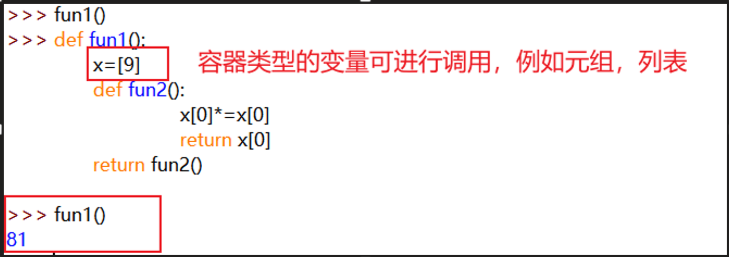
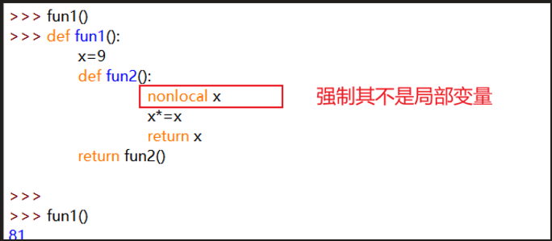
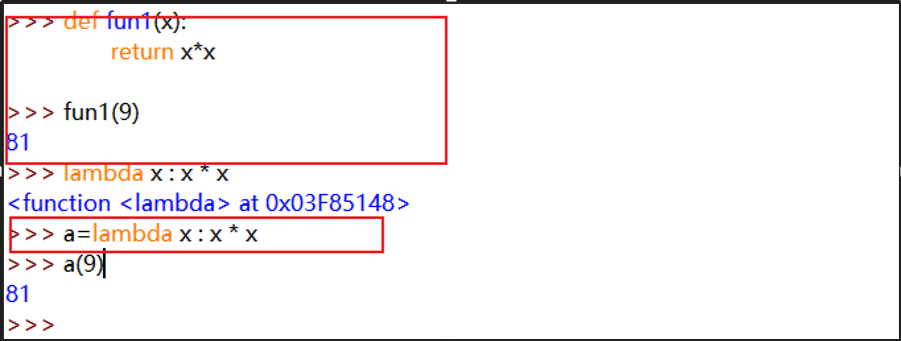

+++
title = "基础"
date = "2026-05-28T00:01:08+08:00"
draft = false
+++

# 编码

decode：解码

encode：编码

utf-8是unicode的扩展字符集，utf-8可以显示unicode字符集



**python2中使用的默认编码是ASCII**

使用默认的ASCII编码解码为unicode然后编码为utf-8:

str.decode().encode("utf-8")

UTF-8转GBK：编码为utf-8的字符先解码为Unicode，然后再编码为gbk

str.decode("utf-8").encode("gbk")

GBK转UTF-8:

str.decode("gbk").encode("utf-8")

 

**python3中使用的默认编码是Unicode**

在文件头声明的编码是文件的编码，代码中实际的编码还是Unicode

可以直接进行编码：

str.encode()


# 字符串(str)

| `方法    `                                 | `含义`                                                       |
| ------------------------------------------ | ------------------------------------------------------------ |
| format(*args, **kwargs)                    | 返回一个格式化的新字符串；使用位置参数（args）和关键字参数（kwargs）进行替换<br />**位置参数**：占位符 `{}` 会按照它们在字符串中出现的顺序来填充值。<br />>>> "Hello, {}!".format("ANY")<br/>'Hello, ANY!'   <br/>**关键字参数**：使用关键字参数，你可以通过指定参数的名称来填充值<br />>>> "Hello, {name}!".format(name="ANY")<br/>'Hello, ANY!'<br />**索引和多个参数：**可以使用索引来指定参数的位置，或者一次性传递多个参数。<br />>>> "{0}{2}{1}".format("a","b","c")<br/>'acb'<br /><br />**高级用法**<br />':'   号后面带填充的字符，只能是一个字符，不指定则默认是用空格填充。<br /> '<'    强制字符串在可用空间内左对齐（默认）<br /> '>'    强制字符串在可用空间内右对齐 <br />'='    强制将填充放置在符号（如果有）之后但在数字之前的位置（这适用于以 “+000000120” 的      形式打印字符串） <br />'^'    强制字符串在可用空间内居中<br />**格式化数字：**格式化数字<br />>>> "保留两位小数：{:.2f}".format(3.14159)<br/>'保留两位小数：3.14'<br />>>> "带符号保留两位小数：{:+.2f}".format(3.14159)<br/>'保留两位小数：+3.14'<br />>>> "显示百分比: {:.2%}".format(0.99)<br/>'显示百分比: 99.00%'<br />>>> "指数记法: {:.2e}".format(1000000)<br/>'指数记法: 1.00e+06'<br />>>> "逗号分隔: {:,}".format(1000000)<br/>'逗号分隔: 1,000,000'<br />对齐文本：指定文本的对齐方式<br />>>> "数字前补零 (填充左边, 宽度为2): {:0>2d}".format(9)<br/>'数字前补零 (填充左边, 宽度为2): 09' |
| capitalize()                               | 返回一个首字母大写版本的新字符串（新字符串的首字母变为大写，其它字母变为小写） |
| casefold()                                 | 返回一个小写版本的新字符串（新字符串的所有字母变为小写）     |
| center(width,  fillchar=' ')               | 返回一个字符居中的新字符串（width <= 字符串长度，新字符串 = 原字符串；width > 字符串宽度，所有字符居中，左右使用 fillchar 参数指定的字符填充） |
| count(sub[,  start[, end]])                | 返回 sub 在字符串中不重叠的出现次数，可选参数 start 和 end 用于指定起始和结束位置 |
| encode(encoding='utf-8',  errors='strict') | 以 encoding 参数指定的编码格式对字符串进行编码。errors 参数指定编码出现错误时的解决方案：默认的 'strict' 表示如果出错，将抛出一个 UnicodeEncodeError 的异常。其它可用的参数值是 'ignore'，'replace' 和 'xmlcharrefreplace' |
| endswith(suffix[,  start[, end]])          | 如果字符串是以 suffix 指定的子字符串为结尾，那么返回 True，否则返回 False；可选参数 start 和 end 用于指定起始和结束位置；suffix 参数允许以元组的形式提供多个子字符串 |
| expandtabs([tabsize=8])                    | 返回一个使用空格替换制表符的新字符串，如果没有指定 tabsize 参数，那么默认 1 个制表符 = 8 个空格 |
| find(sub[,  start[, end]])                 | 在字符串中查找 sub 子字符串，返回匹配的最低索引值；可选参数 start 和 end 用于指定起始和结束位置；如果未能匹配子字符串，返回 -1 |
| index(sub[,  start[, end]])                | 在字符串中查找 sub 子字符串，返回匹配的最低索引值；可选参数 start 和 end 用于指定起始和结束位置；如果未能匹配子字符串，抛出 ValueError 异常 |
| split(sep, maxsplit=-1)                    | 将字符串进行分割，并将结果以列表的形式返回；sep 参数指定一个字符串作为分隔的依据，默认是任意空白字符；maxsplit 参数用于指定分割的次数（注意：分割 2 次的结果是 3 份），默认是不限制 |
| `splitlines(keepends=False)    `           | `将字符串按行分割，并将结果以列表的形式返回；keepends 参数指定是否包含换行符，True 是包含，False 是不包含` |
| startswith(prefix[,  start[, end]])        | 如果存在 prefix 参数指定的前缀子字符串，则返回 True，否则返回 False；可选参数 start 和 end 用于指定起始和结束位置；prefix 参数允许以元组的形式提供多个子字符串 |
| strip(chars=None)                          | 返回一个去除左右两侧空白字符的新字符串；通过 chars 参数可以指定将要去除的字符串 |
| swapcase()                                 | 返回一个大小写字母翻转的新字符串                             |
| title()                                    | 返回标题化（所有的单词都是以大写开始，其余字母均小写）的字符串。 |
| translate(table)                           | 返回一个根据 table 参数转换后的新字符串；table 参数应该提供一个转换规则（可以由 str.maketrans('a', 'b') 进行定制，例如 "FishC".translate(str.maketrans("FC",  "15")) -> '1ish5'） |
| upper()                                    | 返回一个所有英文字母都转换成大写后的新字符串                 |
| zfill(width)                               | 返回一个左侧用 0 填充的新字符串（width <= 字符串长度，新字符串 = 原字符串；width > 字符串宽度，所有字符右对齐，左侧使用 0 进行填充） |
| isalnum()                                  | 如果字符串中至少有一个字符并且所有字符都是字母或数字则返回 True，否则返回 False |
| isalpha()                                  | 如果字符串中至少有一个字符并且所有字符都是字母（注1）则返回 True，否则返回 False |
| isascii()                                  | 如果字符串中所有字符都是 ASCII 则返回 True，否则返回 False；ASCII 字符编码范围是 U+0000 ~ U+007F，空字符串也是 ASCII |
| isdecimal()                                | 如果字符串中至少有一个字符并且所有字符都是十进制数字则返回 True，否则返回 False |
| isdigit()                                  | 如果字符串中至少有一个字符并且所有字符都是数字则返回 True，否则返回 False |
| isidentifier()                             | 如果字符串是一个合法的 Python 标识符则返回 True，否则返回 False；调用 keyword.iskeyword(s) 可以检测字符串是否一个保留标识符（比如 "if" 或  "for"） |
| islower()                                  | 如果字符串中至少包含一个区分大小写的英文字母，并且这些字母都是小写，则返回 True，否则返回 False |
| isnumeric()                                | 如果字符串中至少有一个字符并且所有字符都是数字则返回 True，否则返回 False |
| isprintable()                              | 如果字符串是可以打印的内容则返回 True，否则返回 False        |
| isspace()                                  | 如果字符串中至少有一个字符并且所有字符都是空格，则返回 True，否则返回 False |
| istitle()                                  | 如果字符串是标题化字符串（所有的单词都是以大写开始，其余字母均小写）则返回 True，否则返回 False |
| isupper()                                  | 如果字符串中至少包含一个区分大小写的英文字母，并且这些字母都是大写，则返回 True，否则返回 False |
| join(iterable)                             | 连接多个字符串并返回一个新字符串；以调用该方法的字符串作为分隔符，插入到 iterable 参数指定的每个字符串的中间；  例如：'^'.join(["F", "i",  "sh", "C"]) -> 'F^i^sh^C' |
| ljust(width,  fillchar=' ')                | 返回一个字符左对齐的新字符串（width <= 字符串长度，新字符串 = 原字符串；width > 字符串宽度，所有字符左对齐，右侧使用 fillchar 参数指定的字符填充） |
| lower()                                    | 返回一个所有英文字母都转换成小写后的新字符串                 |
| lstrip(chars=None)                         | 返回一个去除左侧空白字符的新字符串；通过 chars 参数可以指定将要去除的字符串 |
| partition(sep)                             | 在字符串中搜索 sep 参数指定的分隔符，如果找到，返回一个 3 元组 ('在sep前面的部分', 'sep', '在sep后面的部分')；如果未找到，则返回 ('原字符串', '', '') |
| removeprefix(prefix)                       | 如果存在 prefix 参数指定的前缀子字符串，则返回一个将该前缀去除后的新字符串；如果不存在，则返回一个原字符串的拷贝 |
| removesuffix(suffix)                       | 如果存在 suffix 参数指定的后缀子字符串，则返回一个将该后缀去除后的新字符串；如果不存在，则返回一个原字符串的拷贝 |
| replace(old,  new, count=-1)               | 返回一个将所有 old 参数指定的子字符串替换为 new 的新字符串；  ount  参数指定替换的次数，默认是 -1，表示替换全部 |
| rfind(sub[,  start[, end]])                | 在字符串中自右向左查找 sub 子字符串，返回匹配的最高索引值；可选参数 start 和 end 用于指定起始和结束位置；如果未能匹配子字符串，返回 -1 |
| rindex(sub[,  start[, end]])               | 在字符串中自右向左查找 sub 子字符串，返回匹配的最高索引值；可选参数 start 和 end 用于指定起始和结束位置；如果未能匹配子字符串，抛出 ValueError 异常 |
| rjust(width,  fillchar=' ')                | 返回一个字符右对齐的新字符串（width <= 字符串长度，新字符串 = 原字符串；width > 字符串宽度，所有字符右对齐，左侧使用 fillchar 参数指定的字符填充） |
| rpartition(sep)                            | 在字符串中自右向左搜索sep参数指定的分隔符，如果找到，返回一个 3 元组 ('在sep前面的部分', 'sep', '在sep后面的部分')；如果未找到，则返回 ('', '', '原字符串') |
| rsplit(sep=None,  maxsplit=-1)             | 将字符串自右向左进行分割，并将结果以列表的形式返回；sep 参数指定一个字符串作为分隔的依据，默认是任意空白字符；maxsplit 参数用于指定分割的次数（注意：分割 2 次的结果是 3 份），默认是不限制 |
| rstrip(chars=None)                         | 返回一个去除右侧空白字符的新字符串；通过 chars 参数可以指定将要去除的字符串 |


# 列表(list)

| 功能 （list为具体列表）      | 解释                                                         |
| ---------------------------- | ------------------------------------------------------------ |
| list.index("xxx")            | 指定开始和结束位置：index(x,start,end)                       |
| list.append()                | 增：在列表末尾添加新值                                       |
| list.remove()                | 删：删除某个值（第一次匹配）                                 |
| list[n]=xxx                  | 改：修改某个值：list[n]=xxx  范围修改:list[n:]=x,y,z…        |
| list[n]                      | 查：查找某个值 ：list[n]  0-第n个：list[0:n]  第n个往后：list[n:] |
| list.insert(n,x)             | 插：某个位置插入某个值                                       |
| list.sort()                  | 小到大排序（改变源列表顺序，而使用sorted()函数只是对结果进行排序） |
| list.sorted(x, reverse=True) | 大到小排序                                                   |
| list.reverse()               | 反向排序（改变源列表顺序，而使用reversed()函数只是对结果进行排序） |
| list.count()                 | 统计某个值的次数                                             |
| list.copy()                  | 正常使用（浅拷贝）<br />导入copy模块: import copy  <br />浅拷贝：copy.copy(list)——存在嵌套时，引用子列表<br />深拷贝：copy.deepcopy(list)——存在嵌套时，实现全部拷贝复制 |
| enumerate(list)              | 获取index下标以及对应的值 ，返回的是一个对象，可使用list、dict、tuple进行转换 <br />>>> any = ["a","b","c"]<br/>>>> enumerate(any)<br/><enumerate object at 0x000001C68FFD8C18><br/>>>> list(enumerate(any))<br/>[(0, 'a'), (1, 'b'), (2, 'c')]<br />>>> dict(enumerate(any))<br/>{0: 'a', 1: 'b', 2: 'c'}<br />>>> tuple(enumerate(any))<br/>((0, 'a'), (1, 'b'), (2, 'c')) |
| all(list)                    | 判断迭代对象中所有值是否都为真，真返回True，否返回False<br />>>> b=[1,2,5,4,3]<br/>>>> all(b)<br/>True<br />>>> a=[0,1,2,5,4,3]<br/>>>> all(a)<br/>False |
| any(list)                    | 判断迭代对象中所有值是否有一个为真，真返回True，否返回False<br />>>> a = [0,0,0]<br/>>>> any(a)<br/>False<br/>>>> b = [0,1]<br/>>>> any(b)<br/>True |
| zip(list1, list2, ...)       | 创建一个聚合多个可迭代对象的迭代器，它会将作为参数传入的每一个可迭代对象的每一个元素依次组成元组，即第i个元组包含来自每个参数的第i个元素，不过这个取最短列表的长度，其他list多余的会丢弃，不想丢弃，需要依赖**itertools**模块<br />>>> x=[1,2,3]<br />>>> y=[2,4,6]<br/>>>> zip(x,y)<br/><zip object at 0x000001C68FFE7548><br/>>>> list(zip(x,y))<br/>[(2, 2), (4, 4), (6, 6)]<br/>>>> dict(zip(x,y))<br/>{2: 2, 4: 4, 6: 6}<br/>>>> tuple(zip(x,y))<br/>((2, 2), (4, 4), (6, 6))<br /><br />>>> x=[1,2,3]<br />>>> y=[2,4,6,7]<br/>>>> list(zip(x,y))<br/>[(2, 2), (4, 4), (6, 6)]<br /><br />**不丢弃任何字符**<br />>>> x=[1,2,3]<br />>>> y=[2,4,6,7]<br/>>>> import itertools<br />>>> list(itertools.zip_longest(x,y))<br/>[(2, 2), (4, 4), (6, 6), (None, 7)] |
| map(func, list1,...)         | 根据提供的函数对指定的迭代器对象的每个元素进行运算，并将返回运算结果的迭代器<br />>>> a=[1,2,3]<br/>>>> b=[4,5,6]<br/>>>> c=[7,8,9]<br />>>> list(map(max, a,b,c))<br />[7, 8, 9] |
| filter()                     | 根据提供的函数对指定的可迭代对象的每个元素进行运算，并将运算结果为真的元素，以迭代器的形式返回<br />>>> list(filter(str.islower, "Any"))<br/>['n', 'y'] |
| reduce()                     | 列表内函数进行运算<br />已经不是内置方法，需要进行导入：from functools import reduce<br />>>> from functools import reduce<br/>>>> l = [1,2,3,4,5,6,7,8,9]<br />>>> print(reduce(lambda x,y : x+y, l))<br/>45                   #此时res的值为列表内所有元素相加，也可以在后面加上一个基数参数，表示在此加上 |

列表推导式

```bash
>>> x = [i + 1 for i in [1,2,3]]
>>> x
[2, 3, 4]

>>> x = [[1,2,3],
				 [4,5,6],
				 [7,8,9]]
>>> diag = [x[j][i] for i in range(len(x)) for j in range(len(x)) ]
>>> diag
[1, 4, 7, 2, 5, 8, 3, 6, 9]
>>> diag = [x[i][j] for i in range(len(x)) for j in range(len(x)) ]
>>> diag
[1, 2, 3, 4, 5, 6, 7, 8, 9]
```


# 元组(tuple)

python的元组与列表类似，不同之处是元组（tuple）是一种不可变（immutable）的数据结构，一旦创建，就不能增加、删除或修改其中的元素。元组的主要用途是存储一系列的值，并且这些值在元组的生命周期内不会改变。

元组使用小括号()，列表使用中括号[]


# 字典(dict)

集合的创建方式：

```bash
 a = {'刘备':'1', '关羽':'2', '张飞':'3'}

 b = dict(刘备='1', 关羽='2', 张飞='3')

 c = dict([("刘备", "1"), ("关羽", "2"), ("张飞", "3")])

d =  dict({"刘备":"1", "关羽":"2", "张飞":"3"})

e =  dict({"刘备":"1", "关羽":"2"}, 张飞="3")

f =  dict(zip(["刘备", "关羽", "张飞"], ["1", "2", "3"]))
```

方法

| 方法                               | 解释                                                         |
| ---------------------------------- | ------------------------------------------------------------ |
| dict.fromkeys(interable[, values]) | 指定可迭代对象interable创造一个字典并且初始化为values参数指定的值<br />默认空值<br />>>> dict.fromkeys("any")<br/>{'a': None, 'n': None, 'y': None}<br />赋值：<br />>>> dict.fromkeys("any",99)<br/>{'a': 99, 'n': 99, 'y': 99}<br /> |
| dict.pop(key[,default])            | 删除某个key键值，如果没有默认输出为default；                 |
| dict.popitem()                     | python3.7之后阔以使用删除最后一个键值对(3.7之前顺序没有保障) |
| del                                | 指定删除一个键值<br />删除某个值：del dict['xxx']<br />删除字典：del dict |
| dict.clear()                       | 清空字典                                                     |
| dict.update(key="abc")             | 在字典中更新键值对，如果没有对应的键则会进行新增<br />>>> x = {"a":1, "b":2, "c":3}<br/>>>> print(x.update(c=9))<br/>{'a': 1, 'b': 2, 'c': 9} |
| dict.get(key[,default])            | 查找一个键的键值，如不存在则返回默认值default                |
| dict.setdefault(key[,default])     | 查找一个键，如不存在则直接赋其默认值default，并且存到字典中  |
| dict.items()                       | 返回键值对迭代器对象                                         |
| dict.keys()                        | 返回key的迭代器对象                                          |
| dict.values()                      | 返回value的迭代器对象                                        |
| iter()<br />next()                 | iter()：迭代器<br />next()：取迭代器的值<br />>>> x<br/>{'a': 1, 'b': 2, 'c': 9}<br/>>>> iter = iter(x)<br/>>>> next(iter)<br/>'a'<br/>>>> next(iter)<br/>'b'<br/>>>> next(iter)<br/>'c' |

# 集合(set)

唯一性

无序性

创建空集合使用set()，不能用{}，这个是创建空字典

| 方法                          | 解释                                                         |
| ----------------------------- | ------------------------------------------------------------ |
| s.add(x)                      | 添加元素，可以多个，逗号分隔，如果元素已存在，则不进行任何操作 |
| s.update(x)                   | 添加元素，且参数可以是列表，元组，字典等                     |
| s.remove(x)                   | 移除元素，元素不存在会报错                                   |
| s.discard(x)                  | 移除元素，元素不存在不会报错                                 |
| s.pop()                       | 随机删除一个元素（对集合先进行无序排列，然后删除左起第一个元素，如果集合为空，则抛出 KeyError 异常） |
| len(s)                        | 计算集合元素个数                                             |
| s.clear()                     | 清空集合                                                     |
| s.copy()                      | 浅拷贝                                                       |
| s.isdisjoint(other)           | 如果 s  集合中没有与 other 容器存在共同的元素，那么返回 True，否则返回 False |
| s.issubset(other)             | 如果 s  集合是 other 容器的子集（注1），那么返回 True，否则返回 False |
| s.issuperset(other)           | 如果 s  集合是 other 容器的超集（注2），那么返回 True，否则返回 False |
| s.union(*others)              | 返回一个新集合，其内容是  s 集合与 others 容器的并集（注3）  |
| s.intersection(*others)       | 返回一个新集合，其内容是  s 集合与 others 容器的交集（注4）  |
| s.difference(*others)         | 返回一个新集合，其内容是存在于  s 集合中，但不存在于 others 容器中的元素（注5） |
| s.symmetric_difference(other) | 回一个新集合，其内容是排除掉  s 集合和 other 容器中共有的元素后，剩余的所有元素 |

# 变量

作用域：局部、全局

在函数内部声明的变量属于局部作用域，仅在函数体内部可见。

全局作用域中声明的变量可以在整个代码文件中访问，包括函数内部。

当需要在函数内部修改全局变量时，需要使用`global`关键字，以明确指示要操作的是全局变量。

```python
global_variable = "I am global"

def modify_global_variable():
    global global_variable
    global_variable = "Modified global"
    print(global_variable)

# 调用修改函数
modify_global_variable()

# 在函数外查看修改后的全局变量
print(global_variable)
```

**闭包中的作用域**

闭包是函数和其引用环境的组合。在闭包中，可以访问包含函数外部的变量。


# 函数

传可变参数：`**agrs&&**kwargs`（`**args`必须位于`**kwargs`之前）

**args：可变参数，格式化存储在一个元组中，长度没有限制，必须位于普通参数和默认参数之后（格式：str1，str2）；

**kwargs：可变参数，格式化存储在一个字典中，必须位于参数列表的最后面（格式：str1=“”，str2=“”）；

- **高阶函数：**

1、把一个函数名（函数的内存地址）当作实参传给另外一个函数；

2、返回值中包含函数名（不改变函数原来的调用方式）；

```python
def test1():
  pass

def test2(func):
  func()
  pass
		
test2(test1)
```

```python
def test1():
  print("in the test1")

  def test2(func):
    print(func) #直接打印函数的内存地址
    return func #返回func函数的内存地址

test1 = test2(test1)   #将函数test2的返回值赋值给test1，相当于覆盖掉原函数test1变量的值
test1()  #重新调用函数test1
```

- **嵌套函数**

函数中行调用函数



内嵌函数：函数内中的变量只能被调用而不能被更改





使用nonlocal进行重定义



- **匿名函数**

lamda：匿名函数（不需要定义函数）



# 装饰器&闭包

**闭包**：内部函数中引用了外部作用域的变量

```python
def outer():
    n = 9
    def inner():
        print(n)
    return inner

f = outer()
f()   # 打印10
```

**装饰器**：装饰器 =》 高阶函数 + 嵌套函数

装饰器作用就是修改其他函数的功能

应用场景:

1、收集函数的操作或错误日志记录。

2、验证函数的使用权限。

3、计算函数的运行时间。

4、在ORM/DB模型操作时，通过属性方法动态地获取关联的数据。

5、函数数据的缓存。

6、定制函数的输入和输出（序列化和反序列化）。


给函数增加功能，但是不改变原函数的方法，不改变原函数的调用方式；

```python
import time
def timer(func):
  def deco():   #函数的嵌套
    start_time = time.time()
    func()   #调用传入的函数内存地址：func
    stop_time = time.time()
  return deco     #返回deco函数的内存地址

@timer     #调用装饰器，相当于：test1 = timer(test1)  将timer函数返回的内嵌函数deco的内存地址复制给test1
def test1():   #原函数
  print("in the test1")
		
test1() #原函数的调用（此时相当于把deco函数的内存地址赋值给test1变量，调用实际函数是test2，增加了计时的功能）
```

**传参:**

- 固定参数

实现一个加法器

```python
import time

def showtime(f):
    def inner(x, y):
        start_time = time.time()
        f(x,y)
        stop_time = time.time()
        print(stop_time - start_time)
    return inner

@showtime
def my_sum(a, b):
    print("a+b={}").format(a+b)
```

- 不定参数：

```python
import time
def timer(func):
  def deco(*arg,**kwargs):   #函数的嵌套，使用可变参数：*args，**kwargs
    start_time = time.time()
    func(*arg,**kwargs)   #调用传入的函数内存地址：func
    stop_time = time.time()
  return deco    #返回deco函数的内存地址

@timer     #调用装饰器，相当于：test1 = timer(test1)  将timer函数返回的内嵌函数deco的内存地址复制给test1
def test1():   #原函数
  print("in the test1")
		
test1(str) #原函数的调用（此时相当于把deco函数的内存地址赋值给test1变量，调用实际函数是deco，增加了计时的功能）
```

**多个装饰器的使用**

多个装饰器的装饰过程：由内到外的一个装饰过程，先执行内部的装饰器，在执行外部的装饰器。

```python
def make_div(func):
    print('make_div装饰器执行了')
    def inner():
        result = '<div>' + func() + '</div>'
        return result
    return inner

def make_p(func):
    print('make_p装饰器执行了')
    def inner():
        result = '<p>' + func() + '</p>'
        return result
    return inner

# 原理剖析：content = make_div(make_p(content))
# 分布拆解：content = make_p(content)，内部装饰器完成，content = make_p.inner
#          content = make_div(make_p.inner)
@make_div
@make_p
def content():
    return '人生苦短，我用python'
c = content()

print(c)
make_p装饰器执行了
make_div装饰器执行了
<div><p>人生苦短，我用python</p></div>
```

**类装饰器**

类装饰器：使用类装饰已有函数

示例1：

```python
class MyDecorator(object):
    def __init__(self, func):
        self.__func = func
    # 实现__call__方法，表示对象是一个可调用对象，可以像调用函数一样进行调用
    def __call__(self, *args, **kwargs):
        # 对已有函数进行封装
        print('马上就下班')
        self.__func()

@MyDecorator  # @MyDecorator => show = MyDecorator(show)
def show():
    print('快要下雪啦')

# 执行show，就相当于执行MyDecorator类创建的实例对象，show() => 对象()
show()
马上就下班
快要下雪啦
```

示例2：

```python
import time
from functools import wraps

class printLogs(obj):
    def __init__(self, flag):
        self.flag = flag
    
    def __call__(self, func):
        @wraps(func)
        def inner(*args):
            start_time = time.time()
            f(*args)
            stop_time = time.time()
            print(stop_time - start_time)
            if self.flag == "true":
                print('日志记录')
    	return inner
        
@printLogs('true')				# 表示打印日志
def test1():
    print("tets1...")

@printLogs('false')				# 表示不打印日志
def test2():
    print("tets2...")
```

**@wraps 装饰器**

当使用装饰器时，装饰后的函数实际上是包装器函数（wrapper function），而不是原来的函数。这会导致一些问题，例如：

1. 原函数的名称和文档字符串（docstring）被包装器函数覆盖。
2. 原函数的属性（如`__name__`和`__doc__`）丢失。

为了解决这些问题，Python提供了`functools.wraps`装饰器，它可以保留原函数的元数据。

```python
from functools import wraps

def my_decorator(func):
    @wraps(func)
    def wrapper(*args, **kwargs):
        print("Something is happening before the function is called.")
        result = func(*args, **kwargs)
        print("Something is happening after the function is called.")
        return result
    return wrapper

@my_decorator
def say_hello():
    #This is the docstring of say_hello function
    print("Hello!")

print(say_hello.__name__)  # 输出: say_hello
print(say_hello.__doc__)   # 输出: This is the docstring of say_hello function.
```


# 迭代器

一个可以记住遍历位置的对象

迭代器对象从集合的第一个元素开始访问，知道所有的元素别访问完结束，只往前不会退后

**可迭代对象与迭代器：**

​		可迭代对象可以重复使用，而迭代器是一次性的

迭代器有两个基本方法：

iter(): 迭代器

next(): 取迭代器的值，直到迭代完毕

```python
>>> list=[1,2,3,4]
>>> it = iter(list)    # 创建迭代器对象
>>> print (next(it))   # 输出迭代器的下一个元素
1
>>> print (next(it))
2
>>>for x in it:
    print (x, end=" ")
1 2 3 4
```

使用next函数：

```python
#!/usr/bin/python3
import sys         # 引入 sys 模块
 
list=[1,2,3,4]
it = iter(list)    # 创建迭代器对象
 
while True:
    try:
        print (next(it))
    except StopIteration:
        sys.exit()
```

输出

```python
1
2
3
4
```

- **类当中的迭代器：**

把一个类作为一个迭代器使用需要在类中实现两个方法 `__iter__`() 与` __next__()` 。

如果你已经了解的面向对象编程，就知道类都有一个构造函数，Python 的构造函数为 `__init__()`, 它会在对象初始化的时候执行。

`__iter__()` 方法返回一个特殊的迭代器对象， 这个迭代器对象实现了 `__next__()` 方法并通过 StopIteration 异常标识迭代的完成。

__`next__()` 方法（Python 2 里是 next()）会返回下一个迭代器对象

```python
# 创建一个返回数字的迭代器，初始值为 1，逐步递增 1：
class MyNumbers:
  def __iter__(self):
    self.a = 1
    return self
 
  def __next__(self):
    x = self.a
    self.a += 1
    return x
 
myclass = MyNumbers()
myiter = iter(myclass)
 
print(next(myiter))
print(next(myiter))
print(next(myiter))
print(next(myiter))
print(next(myiter))
```

输出

```python
1
2
3
4
5
```

# 生成器

使用了yield的函数被称之为生成器（gennerator）

与普通函数不同，生成器是一个返回迭代器的函数，只能用于迭代操作，更简单的生成器就是一个迭代器，在调用生成器的过程中，每次遇到yield时，函数会暂停并保存当前所有的运行信息，返回yield的值，并在下一次执行**next()**方法时，从当前位置继续运行。直到再次遇到 **yield** 语句。这样，生成器函数可以逐步产生值，而不需要一次性计算并返回所有结果。

生成器函数的优势是它们可以按需生成值，避免一次性生成大量数据并占用大量内存。此外，生成器还可以与其他迭代工具（如for循环）无缝配合使用，提供简洁和高效的迭代方式。

调用一个生成器函数，返回的是一个迭代器对象

```python
def countdown(n):
    while n > 0:
        yield n
        n -= 1
 
# 创建生成器对象
generator = countdown(5)
 
# 通过迭代生成器获取值
print(next(generator))  # 输出: 5
print(next(generator))  # 输出: 4
print(next(generator))  # 输出: 3
 
# 使用 for 循环迭代生成器
for value in generator:
    print(value)  # 输出: 2 1
```

yield 实现斐波那契数列：

```python
#!/usr/bin/python3
import sys
 
def fibonacci(n): # 生成器函数 - 斐波那契
    a, b, counter = 0, 1, 0
    while True:
        if (counter > n): 
            return
        yield a
        a, b = b, a + b
        counter += 1
f = fibonacci(10) # f 是一个迭代器，由生成器返回生成
 
while True:
    try:
        print (next(f), end=" ")
    except StopIteration:
        sys.exit()
```

输出

```python
0 1 1 2 3 5 8 13 21 34 55
```

# 深浅copy

可变数据类型：list、dict、set

不可变数据类型：数字、string、tuple

浅拷贝和深拷贝是创建对象副本的两种不同方式。浅拷贝会创建一个新对象，并将原始对象的值复制到新对象中。但是，如果原始对象的值包含对其他对象的引用（如列表中的列表或字典中的字典），则浅拷贝只会复制这些引用的地址，而不是所引用的对象本身。因此，通过浅拷贝得到的新对象中的这些引用仍然指向原始对象中的相应对象。而深拷贝则会递归地复制原始对象及其所有子对象，从而创建一个完全独立的新对象树。

赋值与copy区别：

当进行赋值操作（`=`）时，只是在创建一个新的变量名，它指向了原始对象在内存中的同一位置。如果原始对象是可变的（如列表、字典等），那么通过新变量名对对象所做的任何修改都会影响到原始对象，因为它们实际上是同一个对象。如果原始对象是不可变的，赋值时实际上是创建了新的对象，改变新对象的值（实际上是不可变的，所以不能直接改变）不会影响原始对象。

**浅拷贝**

使用copy中的copy()方法实现：

- 对于不可变数据类型，浅copy仅仅是地址指向，不会开辟新的空间；
- 对于可变类型，浅拷贝会开辟新的空间（仅仅是顶层开辟新空间，里层不会变）

- 浅拷贝后，如果改变的是原始数据中的可变数值类型，拷贝后对象的值也会受影响，如果改变的是原始数据中的不可变数值类型，拷贝后对象的值不受影响；

```python
>>> import copy 
>>> list1=[1,2,3] 
>>> list2 = copy.copy(list1)
>>> list1[0] = 100
>>> list2
[1, 2, 3]
>>> dict1={"name":"any","age":99}    
>>> dict2 = copy.copy(dict1) 
>>> dict1["age"] = 88 
>>> dict2
{'name': 'any', 'age': 99}
```


**深拷贝**

使用后copy中的deepcopy()方法实现：

- 克隆了一份，完全复制
- 经过深拷贝之后，原始对象与新拷贝的对象是完全独立的

# 类对象


## 元类(Metaclass)

对象是类的实例，而类是type的实例：

1. 对象是类的实例
2. 类是type的实例

类就是创建对象的模板，而type又是创建类的模板，可以通过type创建自己想要的类。

类的实例化过程：

在对象被创建的时候调用类方法:`__new__`，负责创建一个实例对象，。`__new__`方法在返回一个实例之后，会自动的调用`__init__`方法，对实例进行初始化。如果`__new__`方法不返回值，或者返回的不是实例，那么它就不会自动的去调用`__init__`方法。

`__init__ `方法负责将该实例对象进行初始化，在对象被创建之后调用该方法，在`__new__`方法创建出一个实例后对实例属性进行初始化。`__init__`方法可以没有返回值。

`__call__`方法其实和类的创建过程和实例化没有多大关系了，定义了`__call__`方法才能被使用函数的方式执行。

```python
# 例如：
class A(object):
    def __call__(self):
        print "__call__ be called"

a = A()
a()
#输出
#__call__ be called 
```

如果将创建实例的过程比作建一个房子。

- 那么class就是一个房屋的设计图，他规定了这个房子有几个房间，每个人房间的大小朝向等。这个设计图就是累的结构
- `__new__`就是一个房屋的框架，每个具体的房屋都需要先搭好框架后才能进行专修，当然现有了房屋设计才能有具体的房屋框架出来。这个就是从类到类实例的创建。
- `__init__`就是装修房子的过程，对房屋的墙面和地板等颜色材质的丰富就是它该做的事情，当然先有具体的房子框架出来才能进行装饰了。这个就是实例属性的初始化，它是在`__new__`出一个实例后才能初始化。
- `__call__`就是房子的电话，有了固定电话，才能被打电话嘛（就是通过括号的方式像函数一样执行）。

```python
#coding:utf-8
class Foo(object):
    def __new__(cls, *args, **kwargs):
        #__new__是一个类方法，在对象创建的时候调用
        print "excute __new__"
        return super(Foo,cls).__new__(cls,*args,**kwargs)


    def __init__(self,value):
        #__init__是一个实例方法，在对象创建后调用，对实例属性做初始化
        print "excute __init"
        self.value = value


f1 = Foo(1)
print f1.value
f2 = Foo(2)
print f2.value

#输出=========：
excute __new__
excute __init
1
excute __new__
excute __init
2
#==========可以看出new方法在init方法之前执行
```

子类如果重写`__new__`方法，一般依然要调用父类的`__new__`方法。

```python
class Child(Foo):
    def __new__(cls, *args, **kwargs):        
        return suyper(Child, cls).__new__(cls, *args, **kwargs)
```

必须注意的是，类的`__new__`方法之后，必须生成本类的实例才能自动调用本类的`__init__`方法进行初始化，否则不会自动调用`__init__`.

```python
class Foo(object):
    def __init__(self, *args, **kwargs):
        print "Foo __init__"
    def __new__(cls, *args, **kwargs):
        return object.__new__(Stranger, *args, **kwargs)

class Stranger(object):
    def __init__(self,name):
        print "class Stranger's __init__ be called"
        self.name = name

foo = Foo("test")
print type(foo) 	#<class '__main__.Stranger'>
print foo.name 		#AttributeError: 'Stranger' object has no attribute 'name'

#说明：如果new方法返回的不是本类的实例，那么本类（Foo）的init和生成的类(Stranger)的init都不会被调用
```

使用type创建类：

定义一个 Hello 的 class：

```python
class Hello(object):
	def hello(self, name='world'):
		print('Hello, %s.' % name)
```

当 Python 解释器载入 hello 模块时，就会依次执行该模块的所有语句，执行结果就是动态创建出一个 Hello 的 class对象。

`type()`函数既可以查看一个类型或变量的类型，也可以根据参数创建出新的类型，比如上面那段类的定义本质上就是：

```python
def hello(self, name='world'):
    print('Hello, %s.' % name)
Hello = type('Hello', (object,), dict(hello=hello))
```

`type()`函数创建class 对象，依次传入 3 个参数：

- class 类的名称；
- 继承的父类集合，注意 Python 支持多重继承，如果只有一个父类，别忘了 tuple 的单元素写法；
- class 的方法名称与函数绑定以及字段名称与对应的值，这里把函数 fn 绑定到方法名 hello 上。

使用示例：

下面定义一个class M，M是A的元类，A为M的object。而a又是A的object。在通过M创建A的时候，此时会依次运行M的`__new__()`方法和`__init__()`方法。
在一般的类中，是只会运行`__new__()`方法的，除非没有`__new__()`方法，则会运行`__init__()`方法。
这个时候我们可以通过重写M中的`__new__()`方法和`__init__()`方法来做一些自定义操作。
在metaclass里定义的`__init__()`方法，这个方法是在通过元类创建出类后调用的。

```python
from icecream import ic
import random

class M(type):
    def __new__(mcs, *args, **kwargs):
        print(mcs, args, kwargs)
        return type.__new__(mcs, *args, **kwargs)

    def __init__(cls, *args, **kwargs):
        print(cls, args, kwargs)
        cls.random_id = random.randint(0, 100)
        return type.__init__(cls, *args, **kwargs)

      
class A(metaclass=M):
    pass

ic(A.random_id)


# 输出
<class ‘main.M’> (‘A’, (), {‘module’: ‘main’, ‘qualname’: ‘A’}) {}
<class ‘main.A’> (‘A’, (), {‘module’: ‘main’, ‘qualname’: ‘A’}) {}
15:38:07|> A.random_id: 27
```

在metaclass里还可以继续定义`__call__()`方法，这个方法是在通过元类创建出类后，再通过该类实例化时调用的。
注意：普通的类中，在通过该类的实例化对象调用后才会运行`__call__()`方法。

```python
class M(type):
    def __new__(mcs, *args, **kwargs):
        print(mcs, args, kwargs)
        return type.__new__(mcs, *args, **kwargs)

    def __call__(cls, *args, **kwargs):
        print('call')
				return type.__call__(cls, *args, **kwargs)

class A(metaclass=M):
    pass

a = A()

# 输出
<class ‘main.M’> (‘A’, (), {‘module’: ‘main’, ‘qualname’: ‘A’}) {}
call
```

