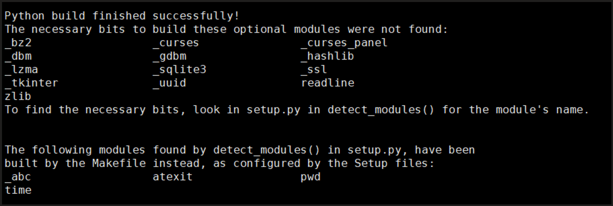

+++
title = "安装"
date = "2026-05-28T00:01:08+08:00"
draft = false
+++

# 安装

1、下载tar包：wget https://www.python.org/ftp/python/3.9.9/Python-3.9.9.tgz

2、解压：tar xvf Python-3.9.9.tgz

3、安装依赖：

   yum install -y libffi-devel readline-devel sqlite-devel bzip2-devel openssl-devel libdbi-devel

不安装的话make会报错：



4、生成编译文件，指定安装路径：

./configure --prefix=/usr/local/python3

然后编译：

make && make install 

 

5、添加软链接

ln -fs ./usr/local/pithon3/bin/python3 python

ln -fs ./usr/local/pithon3/bin/pip pip

 

6、pip更换源：

阿里云 https://mirrors.aliyun.com/pypi/simple/

豆瓣 https://pypi.douban.com/simple/

清华大学 https://pypi.tuna.tsinghua.edu.cn/simple/

中国科学技术大学 https://pypi.mirrors.ustc.edu.cn/simple/

```bash
pip config list
pip config set global.index-url https://mirrors.aliyun.com/pypi/simple/
```

# 虚拟环境

```bash
python虚拟环境：
安装virtualenv：pip3 install virtualenv
创建env：
切换到需要创建环境的目录：
virtualenv '环境名称' --python=xxx
 
然后切换到新建的虚拟环境的scripts目录激活环境：
activate '环境'
 
退出环境
deactivate '环境'
 
 
virtualenvwrapper 虚拟环境管理工具(管理virtualenv)
安装virtualenvwrapper
 
#使用哪个环境安装就是用哪个环境下的pip
pip install virtualenvwrapper
 
添加环境变量：vim ~/.bash_profile
 
#虚拟环境的创建目录
export WORKON_HOME=$HOME/database/python37/virtualenv 
#项目文件所在目录                                          
export PROJECT_HOME=$HOME/database/project    
#python解释器所在位置                                            
export VIRTUALENVWRAPPER_PYTHON=$HOME/database/python37/bin/python3.7 
 
# 指定virtualenvwrapper命令路径，一般在当前安装的python环境的bin下
source /home/any/database/python37/bin
 
#加载环境变量
source ~/.bash_profile
 
 
常用命令：
```

- 创建虚拟环境：mkvirtualenv env_name (创建成功后会默认进入该新创建的虚拟环境)
- 进入虚拟环境：workon env_name
- 退出虚拟环境：deactivate
- 删除虚拟环境：rmvirtualenv env_name
- 显示当前存在的虚拟环境：workon