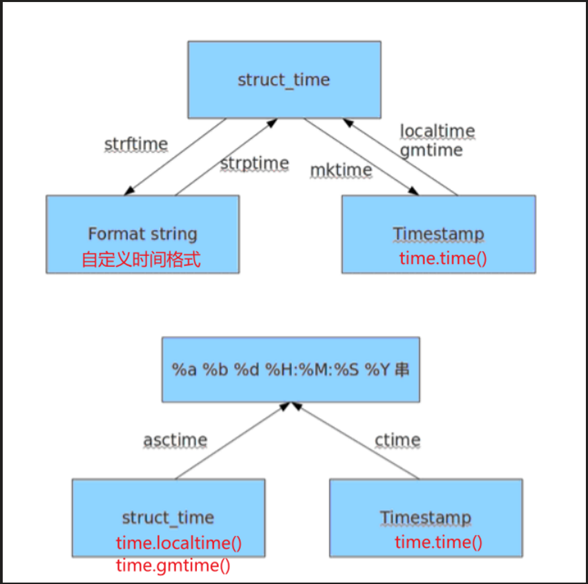
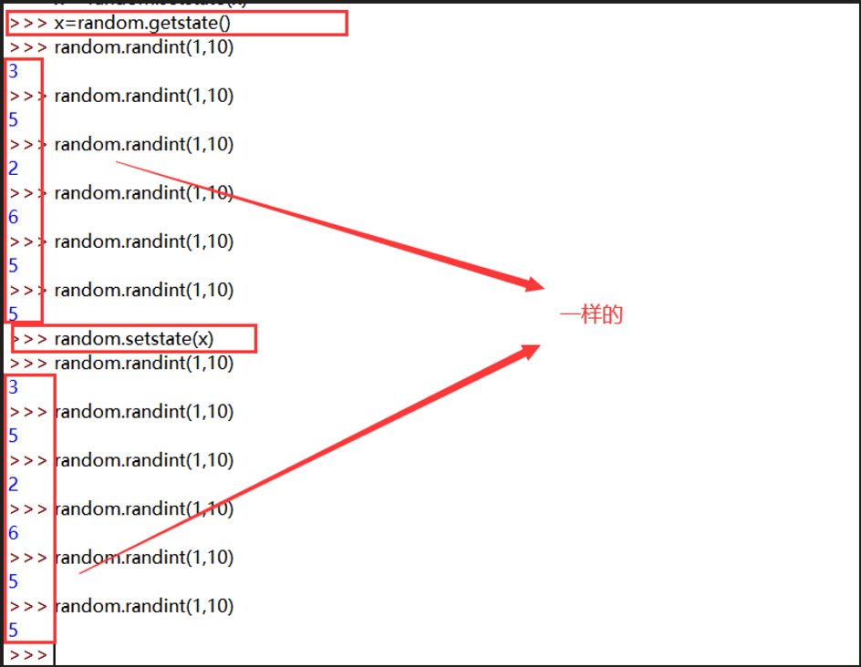
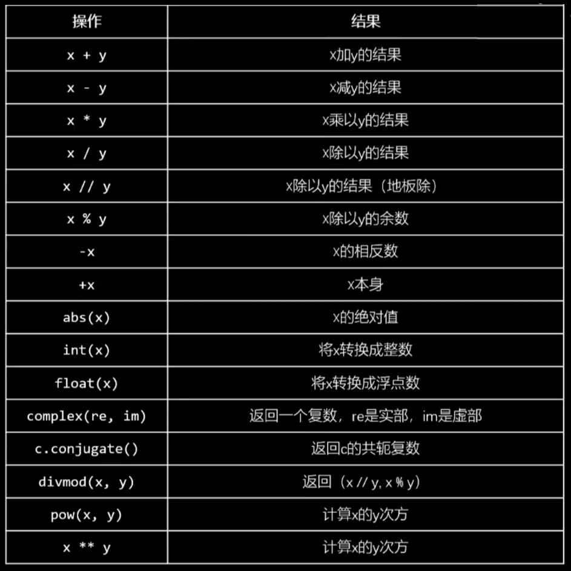
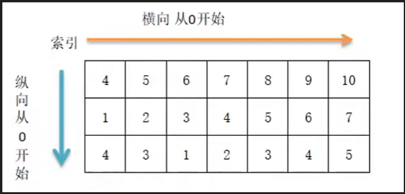
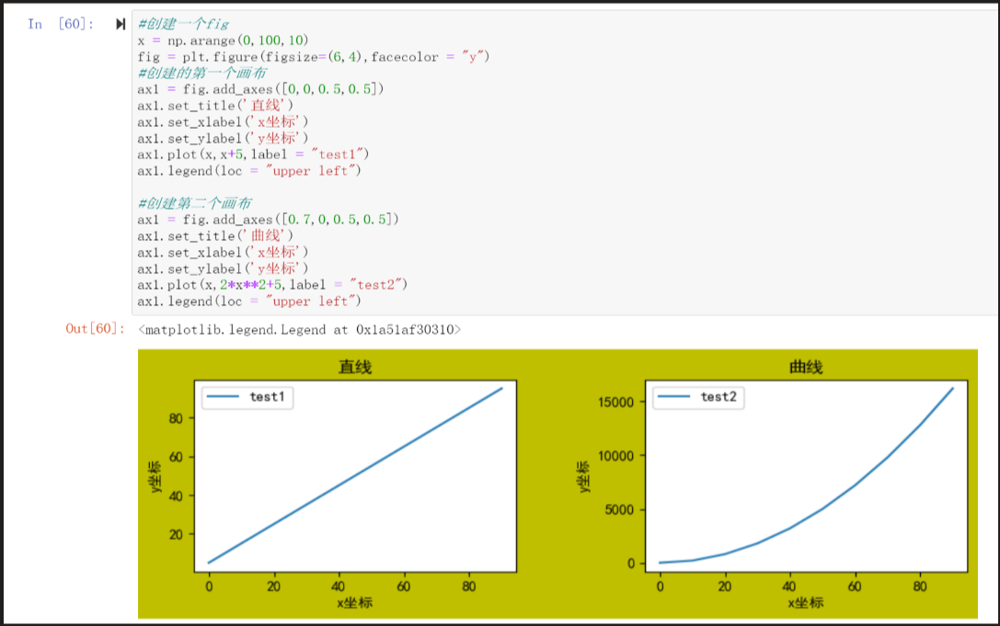
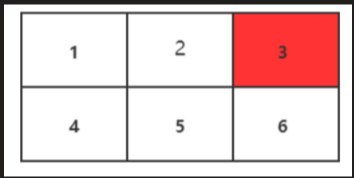

+++
title = "模块合集"
date = "2026-05-28T00:01:08+08:00"
draft = false
+++

 # 内置模块

## os

| 模块                                                         | 解释                                                         |
| ------------------------------------------------------------ | ------------------------------------------------------------ |
| os.getcwd()                                                  | 获取当前工作目录，即当前python脚本工作的目录路径             |
| os.chdir("dirname")                                          | 改变当前脚本工作目录；相当于shell下cd                        |
| os.curdir                                                    | 返回当前目录:  ('.')                                         |
| os.pardir                                                    | 获取当前目录的父目录字符串名：('..')                         |
| os.mkdir(path)                                               | 创建单层目录，如该目录已存在抛出异常                         |
| os.mkdirs('di1/dir2')                                        | 递归创建多层目录，如该目录已存在抛出异常，注意：'E:\\a\\b'和'E:\\a\\c'并不会冲突 |
| os.removedirs('dir1')                                        | 若目录为空，则删除，并递归到上一级目录，如若也为空，则删除，依此类推 |
| os.rmdir('dirname')                                          | 删除单级空目录，若目录不为空则无法删除，报错；相当于shell中rmdir  dirname |
| os.listdir('dirname')                                        | 列出指定目录下的所有文件和子目录，包括隐藏文件，并以列表方式打印 |
| os.remove()                                                  | 删除一个文件                                                 |
| os.rename("oldname","newname")                               | 重命名文件/目录                                              |
| os.stat('path/filename')                                     | 获取文件信息（大小，修改时间等）/目录信息                    |
| os.sep                                                       | 输出操作系统特定的路径分隔符，win下为"\\",Linux下为"/"       |
| os.linesep                                                   | 输出当前平台使用的行终止符，win下为"\t\n",Linux下为"\n"      |
| os.pathsep                                                   | 输出用于分割文件路径的字符串  win下为;,Linux下为:            |
| os.name                                                      | 输出字符串指示当前使用平台。win->'nt';  Linux->'posix'  指代当前使用的操作系统（包括：'posix', 'nt', 'mac', 'os2', 'ce', 'java'） |
| os.system("bash  command")                                   | 运行shell命令，直接显示                                      |
| os.popen("bash  command).read()                              | 运行shell命令，获取执行结果                                  |
| os.environ                                                   | 获取系统环境变量                                             |
|                                                              |                                                              |
| **os.path**                                                  |                                                              |
| os.path.exists(path)                                         | 如果path存在，返回True；如果path不存在，返回False            |
| os.path.basename(path)                                       | 去掉目录路径，单独返回文件名                                 |
| os.path.dirname(path)                                        | 去掉文件名，单独返回目录路径                                 |
| os.path.abspath(__file__)   os.path.realpath(__file__)  (os.path.realpath()) | 返回path规范化的绝对路径  os.path.split(path) 将path分割成目录和文件名二元组返回 |
| os.path.isfile(path)                                         | 如果path是一个存在的文件，返回True。否则返回False            |
| os.path.isdir(path)                                          | 如果path是一个存在的目录，则返回True。否则返回False          |
| os.path.isabs(path)                                          | 如果path是绝对路径，返回True                                 |
| os.path.samefile(path1,  paht2)                              | 判断path1和path2两个路径是否指向同一个文件                   |
| os.path.ismount(path)                                        | 判断指定路径是否存在且是一个挂载点                           |
| os.path.join(path1[,  path2[, ...]])                         | 将多个路径组合后返回，第一个绝对路径之前的参数将被忽略       |
| os.path.getatime(path)                                       | 返回path所指向的文件或者目录的最后访问时间                   |
| os.path.getmtime(path)                                       | 返回path所指向的文件或者目录的最后修改时间                   |
| os.path.getsize(path)                                        | 返回path的大小                                               |


## sys

| 方法         | 解释                                                   |
| ------------ | ------------------------------------------------------ |
| sys.argv     | 命令行参数List，第一个元素是程序本身路径               |
| sys.exit(n)  | 退出程序，正常退出时exit(0)                            |
| sys.version  | 获取Python解释程序的版本信息                           |
| sys.maxint   | 最大的Int值                                            |
| sys.path     | 返回模块的搜索路径，初始化时使用PYTHONPATH环境变量的值 |
| sys.platform | 返回操作系统平台名称                                   |


## time

时间转换：

- timestamp时间戳，时间戳表示的是从1970年1月1日00:00:00开始按秒计算的偏移量
- struct_time时间元组，共有九个元素组。
- format time 格式化时间，已格式化的结构使时间更具可读性。包括自定义格式和固定格式。



**time模块：**

**获取时间戳及时间元组：**

| 模块             | 解释                                                         |
| ---------------- | ------------------------------------------------------------ |
| time.time()      | 当前时间的时间戳<br />>>> time.time()<br/>1710054979.3779705 |
| time.localtime() | 将时间戳转换为当地时间的时间元组，默认为当前时间<br />>>> time.localtime()<br/>time.struct_time(tm_year=2024, tm_mon=3, tm_mday=10, tm_hour=15, tm_min=16, tm_sec=57, tm_wday=6, tm_yday=70, tm_isdst=0) |
| time.gmtime()    | 将时间戳转换为UTC时间的时间元组，默认为当前时间<br />>>> time.gmtime()<br/>time.struct_time(tm_year=2024, tm_mon=3, tm_mday=10, tm_hour=7, tm_min=17, tm_sec=25, tm_wday=6, tm_yday=70, tm_isdst=0) |
| time.mktime(t)   | 将时间元组转换为当地时间戳<br />>>> time.mktime(time.localtime())<br/>1710055967.0 |
| sleep(secs)      | 休眠secs秒                                                   |

**时间元组格式化显示：**

| 模块                                                         | 解释                                                         |
| ------------------------------------------------------------ | ------------------------------------------------------------ |
| time.asctime(time.localtime())<br />time.ctime(time.localtime()) | 返回当前时间的格式为：<br />>>> time.asctime(time.localtime())<br/>'Sun Mar 10 15:18:56 2024'<br />>>> time.ctime()<br/>'Sun Mar 10 15:20:12 2024'<br />>>> time.asctime()<br/>'Sun Mar 10 15:20:41 2024' |
| time.strftime("%Y-%m-%d %H:%M:%S", time.localtime())         | 将时间元组转换为格式化字符串<br />>>> time.strftime("%Y-%m-%d %H:%M:%S", time.localtime())<br/>'2024-03-10 15:22:28' |
| time.strptime('2024-03-10 15:22:28', "%Y-%m-%d %H:%M:%S")    | 将字符串时间转为时间元组<br />>>> time.strptime('2024-03-10 15:22:28',  "%Y-%m-%d %H:%M:%S")<br/>time.struct_time(tm_year=2024, tm_mon=3, tm_mday=10, tm_hour=15, tm_min=22, tm_sec=28, tm_wday=6, tm_yday=70, tm_isdst=-1) |


## datetime

datetime模块：（重新封装了time模块）

**datetime.datetime**

```bash
# 导入
from datetime import datetime
```

- 返回当前日期和时间的`datetime`对象

```python
>>> from datetime import datetime
>>> datetime.now()
datetime.datetime(2024, 3, 10, 15, 48, 24, 335725)
>>> print(datetime.now())
2024-03-10 16:02:49.627443

>>> datetime.today()
datetime.datetime(2024, 3, 10, 15, 49, 3, 176431)
>>> print(datetime.today())
2024-03-10 16:03:31.398895
```

- 根据给定时间戳返回一个date对象

```python
>>> datetime.fromtimestamp(time.time())
datetime.datetime(2024, 3, 10, 15, 51, 28, 631988)
```

- 格式化日期和时间

```python
>>> datetime.now().strftime("%Y-%m-%d %H:%M:%S")
'2024-03-10 15:54:01'

# 显示到微秒
>>> datetime.now().strftime('%Y-%m-%d %H:%M:%S.%f')
'2024-03-10 16:06:41.748416'
# 显示到前三位微秒
>>> datetime.now().strftime('%Y-%m-%d %H:%M:%S.%f2')[:23]
'2024-03-10 16:06:41.748'
>>> datetime.now().strftime('%Y-%m-%d %H:%M:%S.%f2')[:-4]
'2024-03-10 16:06:41.748'

```

- 解析字符串为datetime对象

```python
>>> datetime.strptime('2024-03-10 15:54:01', "%Y-%m-%d %H:%M:%S")
datetime.datetime(2024, 3, 10, 15, 54, 1)
```


**datetime.date**

```bash
# 导入
from datetime import date
```

- 获取当前日期

```python
>>> date.today()
datetime.date(2024, 3, 10)
```

- 从时间戳创建date对象

```python
>>> date.fromtimestamp(time.time())
datetime.date(2024, 3, 10)
```

- 格式化日期

```python
>>> date.today().strftime("%Y-%m-%d")
'2024-03-10'
```


**当时间中带有时区的时候转为timestamp格式**

时间格式为：

```python
2024-03-09T17:01:07+08:00
```

需要借助第三方依赖包进行解析：dateutils,  pytz

dateytils模块功能：

- 解析不同格式的日期字符串。
- 进行复杂的日期和时间计算。
- 处理时区。

pytz模块：用于时区的转换

```python
pip3 install dateutils pytz
```

```python
import pytz
from dateutil import parser

dt_obj = parser.parse('2024-03-09T17:01:07+08:00')
date_time = dt_obj.astimezone(pytz.utc)
timestamp = date_time.timestamp()

print(date_time) 
2024-03-09 09:01:07+00:00
print(timestamp )  
1709974867.0
```

**timestamp转换为带时区时间日期格式：**

```python
from datetime import datetime  
import pytz 

utc_datetime = datetime.datetime.utcfromtimestamp(1709974867.0)
# 将UTC datetime对象转换为特定的时区（这里是Asia/Shanghai，即+08:00）  
tz = pytz.timezone('Asia/Shanghai')  
local_datetime = utc_datetime.replace(tzinfo=pytz.utc).astimezone(tz) 
print(local_datetime) 
2024-03-09 17:01:07+08:00

# 格式化日期时间字符串  
formatted_datetime = local_datetime.strftime('%Y-%m-%dT%H:%M:%S%z') 
print(formatted_datetime)                                                    
2024-03-09T17:01:07+0800
```


## json & pickle

**json****：可用于多种不同语言之间的数据传输**

| 解释                                                         | 模块                |
| ------------------------------------------------------------ | ------------------- |
| 将 Python 对象编码成 JSON 字符串（序列化）  可选参数：  ensure_ascii=False：可以识别中文，  indent=4：是间隔4个空格显示 | json.dumps(dict)    |
| 将 Python对象dict编码成 json 字符串，并自动写入到fp文件对象中（序列化） | json.dump(dict, fp) |
| 将已编码的 JSON 字符串转换为 Python 数据类型（反序列化），res为文件对象：res = f.read() | json.load(res)      |
| 将 json 字符串转换成 Python 数据类型，不需要再单独读此文件，前者的参数是一个文件对象（反序列化） | json.loads(dict)    |


**pickle****：支持**python**所有的数据类型，但是只能用于**python**对象的持久化及**python**程序之间的数据传输

**用法与json的一样**


## random

| 方法                                                        | 描述                                                         |
| ----------------------------------------------------------- | ------------------------------------------------------------ |
| seed(x)                                                     | 初始化随机数生成器  ,其中x可以是任意数字，比如10，那么每次调用生成的随机数将会是同一个。 |
| getstate()                                                  | 返回捕获生成器当前内部状态的对象。                           |
| setstate()                                                  | state  应该是从之前调用 getstate() 获得的，并且 setstate() 将生成器的内部状态恢复到 getstate() 被调用时的状态。 |
| getrandbits(k)                                              | 返回具有  k 个随机比特位的非负 Python 整数。 此方法随 MersenneTwister 生成器一起提供，其他一些生成器也可能将其作为 API  的可选部分提供。 在可能的情况下，getrandbits() 会启用 randrange() 来处理任意大的区间。 |
| randrange()                                                 | 从  range(start, stop, step) 返回一个随机选择的元素。        |
| randint(a,  b)                                              | 返回随机整数  N 满足 a <= N <= b。                           |
| choice(seq)                                                 | 从非空序列  seq 返回一个随机元素。 如果 seq 为空，则引发 IndexError。 |
| choices(population,  weights=None, *,cum_weights=None, k=1) | 从  population 中选择替换，返回大小为 k 的元素列表。 如果 population 为空，则引发 IndexError。 |
| shuffle(x[,  random])                                       | 将序列 x  随机打乱位置。                                     |
| sample(population,  k, *, counts=None)                      | 返回从总体序列或集合中选择的唯一元素的  k 长度列表。 用于无重复的随机抽样。 |
| random()                                                    | 返回  [0.0, 1.0) 范围内的下一个随机浮点数。                  |
| uniform()                                                   | 返回一个随机浮点数  N ，当 a <= b 时 a <= N <= b ，当 b < a 时 b <= N <= a 。 |
| triangular(low,  high, mode)                                | 返回一个随机浮点数  N ，使得 low <= N <= high 并在这些边界之间使用指定的 mode 。 low 和 high 边界默认为零和一。 mode  参数默认为边界之间的中点，给出对称分布。 |
| betavariate(alpha,  beta)                                   | Beta  分布。 参数的条件是 alpha > 0 和 beta > 0。 返回值的范围介于 0 和 1 之间。 |
| expovariate(lambd)                                          | 指数分布。  lambd 是 1.0 除以所需的平均值，它应该是非零的。  |
| gammavariate()                                              | Gamma  分布（ 不是伽马函数） 参数的条件是 alpha > 0 和 beta > 0。 |
| gauss(mu,  sigma)                                           | 正态分布，也称高斯分布。  mu 为平均值，而 sigma 为标准差。 此函数要稍快于下面所定义的 normalvariate() 函数。 |
| lognormvariate(mu,  sigma)                                  | 对数正态分布。  如果你采用这个分布的自然对数，你将得到一个正态分布，平均值为 mu 和标准差为 sigma 。 mu 可以是任何值，sigma 必须大于零。 |
| normalvariate(mu,  sigma)                                   | 正态分布。  mu 是平均值，sigma 是标准差。                    |
| vonmisesvariate(mu,  kappa)                                 | 冯·米塞斯分布。  mu 是平均角度，以弧度表示，介于0和 2*pi 之间，kappa 是浓度参数，必须大于或等于零。 如果 kappa 等于零，则该分布在 0 到 2*pi  的范围内减小到均匀的随机角度。 |
| paretovariate(alpha)                                        | 帕累托分布。  alpha 是形状参数。                             |
| weibullvariate(alpha,  beta)                                | 威布尔分布。 alpha 是比例参数，beta 是形状参数。             |

例子：

```python
import random

# 默认种子，两次结果不一样
>>> random.seed()
>>> print ("使用默认种子生成随机数：", random.random())
使用默认种子生成随机数： 0.28274868281977394
>>> random.seed()
>>> print ("使用默认种子生成随机数：", random.random())
使用默认种子生成随机数： 0.28721895634640415

# 10整数种子两次的随机结果一样	
>>> random.seed(10)
>>> print ("使用整数10种子生成随机数：", random.random())
使用整数10种子生成随机数： 0.5714025946899135
>>> random.seed(10)
>>> print ("使用整数10种子生成随机数：", random.random())
使用整数10种子生成随机数： 0.5714025946899135

>>> random.seed("hello",2)
>>> print ("使用字符串种子生成随机数：", random.random())
使用字符串种子生成随机数： 0.3537754404730722
>>> random.seed("hello",2)
>>> print ("使用字符串种子生成随机数：", random.random())
使用字符串种子生成随机数： 0.3537754404730722
```


**random：伪随机数**

生成x-y中的随机数：random.ranint(x,y)

```python
>>> random.randint(1,100)
72

>>> random.randint(1,100)
35

>>> random.randint(1,100)
23
```

随机数种子：random.ranstate()，random.setstate()

复现随机数



decimal：十进制

```python
x=decimal.Decimal('0.1')

y=decimal.decimal('0.5')
```

复数：x+yj

实部：x.real

虚部：yj.




## file

```python
fp = open(file, mode='r') 
…
 
whit open(file, mode='r') as fp:
   …..
```

 

注意：

```python
使用python的时候经常会遇到文本的编码与解码问题，其中很常见的一种解码错误如题目所示，下面介绍该错误的解决方法，将‘gbk’换成‘utf-8’也适用。 
（1）首先在打开文本的时候，设置其编码格式，如：open(‘1.txt’,encoding=’gbk’)； 
（2）若（1）不能解决，可能是文本中出现的一些特殊符号超出了gbk的编码范围，可以选择编码范围更广的‘gb18030’，如：open(‘1.txt’,encoding=’gb18030’)； 
（3）若（2）仍不能解决，说明文中出现了连‘gb18030’也无法编码的字符，可以使用‘ignore’属性进行忽略，如：open(‘1.txt’,encoding=’gb18030’，errors=‘ignore’)； 
（4）还有一种常见解决方法为open(‘1.txt’).read().decode(‘gb18030’,’ignore’)
```

 

| **模式** | **描述**                                                     |
| -------- | ------------------------------------------------------------ |
| t        | 文本模式 (默认)。                                            |
| x        | 写模式，新建一个文件，如果该文件已存在则会报错。             |
| b        | 二进制模式。                                                 |
| +        | 打开一个文件进行更新(可读可写)。                             |
| U        | 通用换行模式（不推荐）。                                     |
| r        | 以只读方式打开文件。文件的指针将会放在文件的开头。这是默认模式。 |
| rb       | 以二进制格式打开一个文件用于只读。文件指针将会放在文件的开头。这是默认模式。一般用于非文本文件如图片等。 |
| r+       | 打开一个文件用于读写。文件指针将会放在文件的开头。           |
| rb+      | 以二进制格式打开一个文件用于读写。文件指针将会放在文件的开头。一般用于非文本文件如图片等。 |
| w        | 打开一个文件只用于写入。如果该文件已存在则打开文件，并从开头开始编辑，即原有内容会被删除。如果该文件不存在，创建新文件。 |
| wb       | 以二进制格式打开一个文件只用于写入。如果该文件已存在则打开文件，并从开头开始编辑，即原有内容会被删除。如果该文件不存在，创建新文件。一般用于非文本文件如图片等。 |
| w+       | 打开一个文件用于读写。如果该文件已存在则打开文件，并从开头开始编辑，即原有内容会被删除。如果该文件不存在，创建新文件。 |
| wb+      | 以二进制格式打开一个文件用于读写。如果该文件已存在则打开文件，并从开头开始编辑，即原有内容会被删除。如果该文件不存在，创建新文件。一般用于非文本文件如图片等。 |
| a        | 打开一个文件用于追加。如果该文件已存在，文件指针将会放在文件的结尾。也就是说，新的内容将会被写入到已有内容之后。如果该文件不存在，创建新文件进行写入。 |
| ab       | 以二进制格式打开一个文件用于追加。如果该文件已存在，文件指针将会放在文件的结尾。也就是说，新的内容将会被写入到已有内容之后。如果该文件不存在，创建新文件进行写入。 |
| a+       | 打开一个文件用于读写。如果该文件已存在，文件指针将会放在文件的结尾。文件打开时会是追加模式。如果该文件不存在，创建新文件用于读写。 |
| ab+      | 以二进制格式打开一个文件用于追加。如果该文件已存在，文件指针将会放在文件的结尾。如果该文件不存在，创建新文件用于读写。 |

 方法的使用：

| `1`  | `file.close()`  `关闭文件。关闭后文件不能再进行读写操作。`   |
| ---- | ------------------------------------------------------------ |
| `2`  | `file.flush()`  `刷新文件内部缓冲，直接把内部缓冲区的数据立刻写入文件, 而不是被动的等待输出缓冲区写入。` |
| `3`  | `file.fileno()`  `返回一个整型的文件描述符(file descriptor FD 整型),  可以用在如os模块的read方法等一些底层操作上。` |
| `4`  | `file.isatty()`  `如果文件连接到一个终端设备返回 True，否则返回 False。` |
| `5`  | `file.next()`  `返回文件下一行。`                            |
| `6`  | `file.read([size])`  `从文件读取指定的字节数（字符串格式），如果未给定或为负则读取所有。` |
| `7`  | `file.readline([size])`  `每次读取整行，包括 "\n" 字符。`  `可以使用for循环来读取指定的行数：`  `for i in  range(100):`  `f.readline()` |
| `8`  | `file.readlines([sizeint])`  `读取所有行并返回列表格式，若给定sizeint>0，则是设置一次读多少字节，这是为了减轻读取压力。` |
| `9`  | `file.seek(offset[,  whence])`  `设置文件当前位置`           |
| `10` | `file.tell()`  `返回文件当前位置。`                          |
| `11` | `file.truncate([size])`  `截取文件，截取的字节通过size指定，默认为当前文件位置。` |
| `12` | `file.write(str)`  `将字符串写入文件，返回的是写入的字符长度。` |
| `13` | `file.writelines(sequence)`  `向文件写入一个序列字符串列表，如果需要换行则要自己加入每行的换行符。` |

 ##re

正则表达式：

| 规则             | 案例                                                         |
| ---------------- | ------------------------------------------------------------ |
| 匹配指定的字符   | /code/g                                                      |
| 匹配字符组及多个 | [Pp]thon  [Pp]th[Oo][Nn]                                     |
| 区间             | [0-9]、[a-z]、[A-Z]、[0-9a-zA-Z]  快捷：  \w：与任意单词字符匹配，任意单词字符表示 [A-Z]、 [a-z]、[0-9]、_（取反：\W）  \d：（digit）与任意数字匹配（取反：\D） |
| 转译             | \                                                            |
| 取反             | [^]                                                          |
| 空白             | \s                                                           |
| 边界字符         | \bcode\b                                                     |
| 开始结束         | ^-----$                                                      |
| 任意字符         | .（不能匹配换行符\n）                                        |
| 可选字符         | ？：匹配前一个字符零次或者多次  a？：匹配a一次或者多次  .？：匹配任意字符 |
| 重复匹配         | 在一个字符组后加上{N} 就可以表示在它之前的字符组出现N次      |
| 重复区间         | {M,N}，M是下界而，N是上界（优先取N个，如取消此优先需在表达式后加上：?） |
| 开闭区间         | +：匹配1个到无数个，等价于{1,}  *：代表0个到无数个，等价于{0,} |
| 分组             | ()，用来捕获数据，从匹配好的数据当中提取关键的数据           |
| 或者             | \|：分组中使用                                               |
| 非捕获组         | (?:code) ，不捕获数据，还能使用分组的功能                    |
| 分组的回溯引用   | \N：可以引用编号为N的分组  (a)(b)(c) \3\2\1 ：\3表示(c)，\2表示(b)，\1表示(a) |
|                  |                                                              |
| 先行断言         | 正向先行断言：(?=code)，是指某个位置向右看，code所在位置右侧必须能匹配code（不存在顺序的约束）   反向先行断言：(?!code)，保证右边不能出现code   |
| 后行断言         | 正向后向断言：(?<=code)，指在某个位置向左看，表示所在位置左侧必须能匹配code   反向后行断言：(?<!code)，指在某个位置向左看，表示所在位置左侧不能匹配code  |


re模块

| 模块                               | 描述                                                         |
| ---------------------------------- | ------------------------------------------------------------ |
| findall('字符or表达式',string)     | 找出所有符合条件的内容，支持正则表达式                       |
| split(pattern,string)              | 字符串分割，pattern：分隔符                                  |
| sub(pattern,  repl, string, count) | 替换字符串中的内容  pasttern：被替换字符  repl：替换目标字符  string：字符串  count：次数，默认为0：全部替换 |
| match(pattern,  string,flags)      | 尝试从字符串的起始位置匹配一个模式，如果不是起始位置匹配成功的话，match() 就返回 none  **pattern**：匹配的正则表达式 ； **string**：要匹配的字符串；  **flags**：标志位，用于控制正则表达式的匹配方式，如：是否区分大小写，多行匹配等等 。也还可以使用匹配对象来获取表达式  group(num=0)：匹配的整个表达式的字符串，group()  可以一次输入多个组号，在这种情况下它将返回一个包含那些组所对应值的元组。  groups()：回一个包含所有小组字符串的元组，从  1 到 所含的小组号。 |
| seach()                            | 扫描整个字符串并返回第一个成功的匹配  。**pattern**：匹配的正则表达式  **string**：要匹配的字符串。  **flags**：标志位，用于控制正则表达式的匹配方式，如：是否区分大小写，多行匹配等等。     也还可以使用匹配对象来获取表达式  group(num=0)：匹配的整个表达式的字符串，group()  可以一次输入多个组号，在这种情况下它将返回一个包含那些组所对应值的元组。  groups()：回一个包含所有小组字符串的元组，从  1 到 所含的小组号。 |
| compile(pattern[,  flags])         | 编译正则表达式，生成一个正则表达式（ Pattern ）对象，供 match() 和 search() 这两个函数使用  **pattern**  : 一个字符串形式的正则表达式  **flags**  : 可选，表示匹配模式，比如忽略大小写，多行模式等，具体参数为：     re.I  忽略大小写  re.L  表示特殊字符集 \w, \W, \b, \B, \s, \S 依赖于当前环境  re.M  多行模式  re.S  即为 . 并且包括换行符在内的任意字符（. 不包括换行符）  re.U  表示特殊字符集 \w, \W, \b, \B, \d, \D, \s, \S 依赖于 Unicode 字符属性数据库  re.X  为了增加可读性，忽略空格和 # 后面的注释 |

re.match：只匹配字符串的开始，如果字符串开始不符合正则表达式，则匹配失败，函数返回None；而re.search匹配整个字符串，直到找到一个匹配。

 ## sort

 

对序列（列表、元组、字典、集合、还包括字符串）进行排序,返回一个排好序的列表。

```python
list = sorted(iterable, key=None, reverse=False) 
 
iterable：表示指定的序列，
key：参数可以自定义排序规则(可选)；
reverse：参数指定以升序（False，默认）还是降序（True）进行排序（可选）。
```

```python
传入key值示例：
1、列表：
chars=['http://c.biancheng.net',\
    'http://c.biancheng.net/python/',\
    'http://c.biancheng.net/shell/',\
    'http://c.biancheng.net/java/',\
    'http://c.biancheng.net/golang/']
 
#自定义按照字符串长度排序
print(sorted(chars, key = lambda x:len(x)))
 
2、字典
list1 = [{'name':'a'，'age':20}，{'name':'b'，'age':30}，{'name':'c'，'age':25}]
 
#按age由大到小排序
sorted(list1，key = lambda x:x['age']，reverse = True)
```


## filter & map & reduce

filter(func, seq)：为过滤函数，此函数的执行原理为将func作用于seq中的每一个元素，返回符合func筛选条件的元素的集合。

示例：

```
list1=range(1,31)
#筛选能同时被3，4整除的数
list(filter(lambda x:x%3==0 and x%4==0,list1))   #因为filter返回iteror，用list显示结果
```

map(func, seq)：可以简单的理解为对seq中的每一个元素做加减乘除等某种运算，并返回每个运算的结果，即seq的元素数量是不变的。

示例：

```
list = range(1,11)     #1到10的序列
 
list(map(lambda x:x%2==0,list2))
# [False, True, False, True, False, True, False, True, False, True]
 
list(map(lambda x:x*2,list2))   #每个元素乘2
[2, 4, 6, 8, 10, 12, 14, 16, 18, 20]
```

reduce(func, seq)：先对集合中的第 1、2 个元素进行func操作，得到的结果再与第三个数据用 func 函数运算，直到最后得到一个结果（使用的lambda函数需要两个参数，它主要用于告诉我们如何将两个元素组合成起来）。

需要导入模块：from functools import reduce

示例：

```python
from functools import reduce
 
list = range(1, 11)     #1到10的序列
reduce(lambda a,b:a+b, list)     #对序列list2中的元素做累加运算
55
 
```

相同点：

​	1、filter、map、reduce三个函数都是将func作用于seq中的元素。

​	2、filter和map都是func作用每个元素，返回的是iteror。

 

不同点：

​	1、filter是func作用每个元素并且筛选结果为true的元素，map是将每一个被func作用的结果都输出。

​	2、reduce则是先对集合中的第 1、2 个元素进行func操作，得到的结果再与第三个数据用 func 函数运算，直到最后得到一个结果。


## log

参考： https://www.cnblogs.com/hls-code/p/14776516.html

**模块：**

​		1、logging：自带，不用安装

​		2、loguru：第三方库，需要安装

导入：

``` python
from loguru import logger
```

级别：

| 级别：权重   | 详情         |
| ------------ | ------------ |
| DEBUG：10    | 调试信息     |
| INFO：20     | 主要信息     |
| WARNING：30  | 警告信息     |
| ERROR：40    | 错误信息     |
| CRITICAL：50 | 严重错误信息 |

默认等级是WARNING，只有高于默认等级以上的级别才会打印到控制台。

 

模块方法（保存到文件）：

| `logger.debug()`      | 打印调试信息                                                 |
| --------------------- | ------------------------------------------------------------ |
| `logger.info()`       | 打印主要信息                                                 |
| `logger.warning()`    | 打印警告信息                                                 |
| `logger.error()`      | 打印错误信息                                                 |
| `logger.critical()`   | 打印严重错误信息                                             |
| `loger.basicConfig()` | 配置控制日志输出的格式及方式  参数：  filename: 指定日志文件名  filemode: 和file函数意义相同，指定日志文件的打开模式，'w'或'a'  format: 指定输出的格式和内容，format可以输出很多有用信息，如上例所示:    %(levelno)s:   打印日志级别的数值      %(levelname)s:   打印日志级别名称      %(pathname)s:    打印当前执行程序的路径，其实就是sys.argv[0]      %(filename)s:   打印当前执行程序名      %(funcName)s:   打印日志的当前函数    %(lineno)d:   打印日志的当前行号    %(asctime)s:   打印日志的时间    %(thread)d:   打印线程ID    %(threadName)s:  打印线程名称    %(process)d:   打印进程ID    %(message)s:   打印日志信息  datefmt:    指定时间格式，同time.strftime()  level:      设置日志级别，默认为logging.WARNING【高于该日志级别才会打印到控制台上】  stream:    指定将日志的输出流，可以指定输出到sys.stderr,sys.stdout或者文件，默认输出到sys.stderr，当stream和filename同时指定时，stream被忽略 |
|                       |                                                              |

控制在监控台打印：

使用Handler及Formatter方法：

几种Handler类型：

```python
logging.StreamHandler(默认):   日志输出到流，可以是sys.stderr、sys.stdout或者文件
logging.FileHandler:       日志输出到文件
logging.handlers.RotatingFileHandler  日志输出到文件，基于文件大小滚动存储日志
logging.handlers.TimedRotatingFileHandler  日志输出到文件，基于时间周期滚动存储日志
logging.handlers.SocketHandler:   远程输出日志到TCP/IP sockets
logging.handlers.DatagramHandler:   远程输出日志到UDP sockets
logging.handlers.SMTPHandler:     远程输出日志到邮件地址
logging.handlers.SysLogHandler:   日志输出到syslog
logging.handlers.NTEventLogHandler: 远程输出日志到Windows NT/2000/XP的事件日志
logging.handlers.MemoryHandler:   日志输出到内存中的制定buffer
logging.handlers.HTTPHandler:     通过"GET"或"POST"远程输出到HTTP服务器
```


例子：

1、同时将日志输出到控制台以及文件中：

```python
import logging
#设置一个basicConfig只能输出到一个Handler
logging.basicConfig(level=logging.DEBUG,
        format='%(asctime)s %(filename)s[line:%(lineno)d] %(levelname)s %(message)s',
        datefmt='%a, %d %b %Y %H:%M:%S',
        filename='myapp.log',
        filemode='w')
 
#定义一个StreamHandler，将INFO级别或更高的日志信息打印到标准错误，并将其添加到当前的日志处理对象#
console = logging.StreamHandler()
console.setLevel(logging.INFO)
formatter = logging.Formatter('%(name)-12s: %(levelname)-8s %(message)s')
console.setFormatter(formatter)
logging.getLogger('').addHandler(console)
 
#输出到文件的log级别为debug，输出到stream的log级别为info
logging.debug('This is debug message')
logging.info('This is info message')
logging.warning('This is warning message')
```


## multiprocessing

进程模块使用，用于创建并行处理（即多个进程同时执行）的应用程序。它可以让你充分利用多核处理器的能力，从而加快计算密集型任务的速度。`multiprocessing` 模块提供了一系列工具和功能，包括进程管理、进程间通信、同步机制以及共享内存等

示例1：

```python
#导入进程模块
from multiprocessing import processing
 
def func(val1, …):
…
#创建进程对象
p = Processing(task = func,args=(process_name, val1, …))   # args:进程名以及传参 
 
#启动进程
p.start()
 
#等待子进程结束之后再继续往下执行主进程
p.join()
```

 示例2：多个子进程进行等待

```python
#导入进程模块
from multiprocessing import processing

def func(val1, …):
…

p_list = [] #存进程对象
#创建多个进程对象
for i in range(1,3): 
p = Processing(target = func,args=("子进程%s" % i, val1, …))   
#启动进程
p.start()

for p in p_list:
#等待子进程结束之后再继续往下执行主进程
p.join()
```


## importlib

```python
# 模块:importlib
import importlib
res = 'myfile.b'
ret = importlib.import_module(res) # 相当于：from myfile import b
# 该方法最小只能到py文件名
print(ret)
 
from myfile import b
print(b)
```


# 第三方模块

 ## csv

1.说明：

```
1) 默认读写用逗号做分隔符(delimiter),双引号作引用符(quotechar)
2) 用writer写数据None被写成空字符串,浮点型调用repr()转化成字符串。非字符串型数据被str()成字符串存储。
3) open函数
  import locale
  
   locale.getpreferredencoding()# 查看本地编码'cp936'
  open('some.csv', newline='', encoding='utf-8')
   # 使用系统默认编码将文件解码为unicode可使用不同的编码解码文件
newline：去除多余的换行
```

 

| 参数                           | 说明                                                         |
| ------------------------------ | ------------------------------------------------------------ |
| `delimiter      `              | `用于分隔字段的单字符字符串。默认为","`                      |
| `lineterminator      `         | `用于写操作的行结束符，默认为“'\r\n ' 。读操作将忽略此选项，它能认出跨平台的行结束符` |
| `quotechar      `              | `用于带有特殊字符（如分隔符）的字段的引用符号。默认为' " '`  |
| `quoting      `                | `引用约定。可选值包括csv.QUOTE _ ALL (引用用所有字段）`  <br />  `csv.QUOTE_MINIMAL（引用如分隔符之类特殊字符的字段）默认`  <br /> `csv.QUOTE_NONNUMERIC  `  <br />  `csv.QUOTE_NON  （不引用）` |
| `skipinitialspace      `       | `忽略分隔符后面的空白符。默认为False`                        |
| `doublequote      `    `     ` | `如何处理字段内的引用符号。如果为True ，则双写。`            |
| `escapechar    `    `     `    | `用于对分隔符进行转义的字符串（如quoting=csv.QUOTE_NONE默认禁用` |

V1：

读写操作：


```python
# 实例1.1：读取CSV文件的最简单示例：
with open('some.csv', newline='') as f:
   reader = csv.reader(f)
   for row in reader:print(row)
 
# 实例1.2：相应的最简单的写作示例是：
import csv
with open('some.csv', 'w', newline='') as f:
   writer = csv.writer(f)
   writer.writerows(someiterable)
```

V2：
使用参数：

```python
# 实例2.1：写数据
with open('test_csv_data.csv', 'w', newline='') as f:
   writer = csv.writer(f, delimiter=' ',quotechar='|', quoting=csv.QUOTE_MINIMAL)
   writer.writerow(['My name is','Tom', 'Bob', 'Jim', 'May'])
   writer.writerow(['Color is', 'red', 'yellow green','blue'])
 
# 实例2.2：读数据
with open('test_csv_data.csv', newline='') as f:
   spamreader = csv.reader(f, delimiter=' ', quotechar='|')
   for row in spamreader:
     print(', '.join(row))
 
# My name is, Tom, Bob, Jim, May
# Color is, red, yellow green, blue
```

V3：

```python
# 实例3.1：写入csv文件
with open('csv_test.csv', 'w',newline='') as f:# 如不指定newline='',有时则每写入一行将有一空行被写入
   writer = csv.writer(f)
   writer.writerow(['name', 'age', 'tel'])  # 写入一行用writerow
 
data = [('Tom', '25', '1367890900'), ('Jim', '18', '1367890800')]
writer.writerows(data)             # 多行用writerows
 
  
# 实例3.2：读取
with open('csv_test.csv', encoding='utf-8') as f:
   csv_reader = csv.reader(f)
   for row in csv_reader:
     print(row)
 
# ['name', 'age', 'tel']
# ['Tom', '25', '1367890900']
# ['Jim', '18', '1367890800'] 
 
  
# 实例使用：dialect
f=open('test_csv_data.csv', newline='')
spamreader = csv.reader(f, delimiter=' ', quotechar='|')
spamreader.dialect,spamreader.line_num
 
dialect=spamreader.dialect
 
dialect.delimiter    #分隔字段的单字符字符串            #' '
dialect.doublequote   #如何处理字段内的引用符号。如果为True ，则双写  #1
dialect.escapechar    #用于对分隔符进行转义的字符串=None禁用     #
dialect.lineterminator #用于写操作的行结束符           # '\r\n'
dialect.quotechar    #用于带有特殊字符(如分隔符)的字段的引用符号 #'|'
dialect.quoting     #引用约定 # 0
dialect.skipinitialspace#忽略分隔符后面的空白符。默认为False    # 0
dialect.strict     #如何处理字段内的引用符号         # 0 
 
  
# 实例：引用约定
# 使用备用格式读取文件 
with open('test_csv_data.csv', 'w', newline='') as f:
  writer = csv.writer(f, delimiter=' ',quotechar='|', quoting=csv.QUOTE_NONE,escapechar='$')
  writer.writerow(['name is','age', 'weight', 'remark'])
  writer.writerow(['Tom', 25, 31.2,'$te|st'])
  writer.writerow(['Jim', 35, 42.8,'$test$st'])
```

 

## argparse && fire

**argparse**：

用于命令项选项与参数解析的模块，通过在程序中定义好我们需要的参数，argparse 将会从 sys.argv 中解析出这些参数，并自动生成帮助和使用信息。

执行python文件时传参：

```python
python test.py 参数1 参数2 …
```

```python
# 导入包
import argparse

# 创建参数对象
parse = ArgumentParser()
# 调用方法往参数对象中添加参数
parse.add_argument()
# 使用解析添加参数的参数对象，获得解析对象；程序的其他部分需要使用命令行参数时，用解析对象.参数获取。
args = parse_args()

```

parse.add_Argument()的参数说明：

| 第一或第二个参数 | 参数名                                                       |
| ---------------- | ------------------------------------------------------------ |
| defalut          | 默认值                                                       |
| type             | 参数类型（list, str, tuple, set, dict）                      |
| nargs            | 传入参数的个数，‘+’表示至少一个参数                          |
| metavar          | 清楚帮助信息中的参数名信息。-h显示usage 明中的参数名称，对于必选参数默认就是参数名称，对于可选参数默认是全大写的参数名称。这里通过设置为空一律不显示。 |

传入一个参数：

```python
parse.add_Argument( 'test', default=2, type=int,  help="Input an num" )
```

传入多个参数：

```python
parse.add_Argument( 'test' , type=int, nargs='+'  , help="Input an num" )
```


**位置参数：**

​		在命令行中传入参数时候，传入的参数的先后顺序不同，运行结果往往会不同，这是因为采用了位置参数；

**必选参数：**

​		当通过设置required=True后，无论参数是否是可选参数，都必须输入。

**可选参数：**

​		通过在参数名前加--，设置为可选参数。如果未输入，则使用default默认值（若未设置default，则会默认赋值None）。

例如：

```python
parse.add_Argument('--test', default=2, type=int,  help="Input an num" )
# 调用：
python test.py --test = 9
```

 ```python
 # 加引用名：
 parse.add_Argument( ‘-t’,  '--test',  default=2, type=int,  help="Input an num" )
 
 # 调用：
 python test.py --t = 9
 ```


**fire：**

示例1：

```python
import fire
 
def add(first_number, second_number):
  return first_number + second_number
 
if __name__ == '__main__':
  fire.Fire()
 
# 命令行执行：
python3 demo.py - add 3 4  或者  python3 demo.py - add --first_number=3 --second_number=4
```

示例2：

```python
import fire
 
def add(first_number, second_number):
  return first_number + second_number
 
def subtract(first_number, second_number):
  return first_number - second_number
 
def multiply(first_number, second_number):
  return first_number * second_number
 
def divide(first_number, second_number):
  return first_number / second_number
 
if __name__ == '__main__':
  fire.Fire()
```

命令行执行：

```bash
python3 demo.py - multiply 4 5  或者  python3 demo.py - multiply --first_number=4 --second_number=5
```

示例3：链式调用

```python
import fire
 
class Calculator(object):
  def __init__(self, init_number):
    self.init_number = init_number
    self.result = self.init_number
 
  def __str__(self):
    return str(self.result)
 
  def add(self, number):
    self.result = self.result + number
    return self
 
  def subtract(self, number):
    self.result = self.result - number
    return self
 
  def multiply(self, number):
    self.result = self.result * number
    return self
 
  def divide(self, number):
    self.result = self.result / number
    return self
 
  def to_integer(self):
    self.result = int(self.result)
    return self
 
if __name__ == '__main__':
  fire.Fire(Calculator)
```

命令执行：

```bash
python3 main.py --init_number=8 - add 4 - multiply 3

python3 main.py --init_number=8 - add 4 - divide 2

python3 main.py --init_number=8 - add 4 - divide 2 - to_integer
```


## difflib 

用来进行序列的差异化比较，它能够比对文件并生成差异结果文本或者html格式的差异化

| 模块                                                         | 描述                                                         |
| ------------------------------------------------------------ | ------------------------------------------------------------ |
| Differ()                                                     | 以文本格式显示结果  结果显示：   '- '  第1个序列中出现   '+ '  第2个序列中出现   '   '   两行相同   '? '  增量差异  '^'    字符差异 |
| HtmlDiff()                                                   | 将比较结果存到html文件中，该文件显示具有行间和行内更改突出的文本的逐行比较 |
| context_diff()                                               | 返回一个差异文本行的生成器                                   |
| make_file(fromlines, tolines [, fromdesc][, todesc][, context][, numlines]) | fromdesc和todesc：用于指定从/到文件列标题字符串（默认为空字符串）  context和numlines：以True当背景的差异将被显示，否则默认为False可显示完整的文件。numlines默认为5。 |

 

## subprocess

subprocess是python内置的模块，这个模块中的Popen可以查看用户输入的命令行是否存在

如果存在，把内容写入到stdout管道中

如果不存在，把信息写入到stderr管道

需要注意的是，这个模块的返回结果只能让开发者看一次，如果想多次查看，需要在第一次输出的时候，把所有信息写入到变量中。

| 函数                              | 描述                                                         |
| --------------------------------- | ------------------------------------------------------------ |
| `subprocess.run()`                | Python  3.5中新增的函数。执行指定的命令，等待命令执行完成后返回一个包含执行结果的CompletedProcess类的实例。 |
| `subprocess.call()`               | 执行指定的命令，返回命令执行状态，其功能类似于os.system(cmd)。 |
| `subprocess.check_call()    `     | Python  2.5中新增的函数。  执行指定的命令，如果执行成功则返回状态码，否则抛出异常。其功能等价于subprocess.run(…,  check=True)。 |
| `subprocess.check_output()`       | Python  2.7中新增的的函数。执行指定的命令，如果执行状态码为0则返回命令执行结果，否则抛出异常。 |
| `subprocess.getoutput(cmd)`       | 接收字符串格式的命令，执行命令并返回执行结果，其功能类似于os.popen(cmd).read()和commands.getoutput(cmd)。 |
| `subprocess.getstatusoutput(cmd)` | 执行cmd命令，返回一个元组(命令执行状态, 命令执行结果输出)，其功能类似于commands.getstatusoutput()。 |

参数及说明

```python
subprocess.run(args, *, stdin=None, input=None, stdout=None, stderr=None, shell=False, timeout=None, check=False, universal_newlines=False)
 
subprocess.call(args, *, stdin=None, stdout=None, stderr=None, shell=False, timeout=None)
 
subprocess.check_call(args, *, stdin=None, stdout=None, stderr=None, shell=False, timeout=None)
 
subprocess.check_output(args, *, stdin=None, stderr=None, shell=False, universal_newlines=False, timeout=None)
 
subprocess.getstatusoutput(cmd)
 
subprocess.getoutput(cmd)
```

 

| 模块                       | 描述                                                         |
| -------------------------- | ------------------------------------------------------------ |
| args                       | 要执行的shell命令，默认应该是一个字符串序列，如[‘df’, ‘-Th’]或(‘df’, ‘-Th’)，也可以是一个字符串，如’df -Th’，但是此时需要把shell参数的值置为True。 |
| shell                      | 如果shell为True，那么指定的命令将通过shell执行。如果我们需要访问某些shell的特性，如管道、文件名通配符、环境变量扩展功能，这将是非常有用的。当然，python本身也提供了许多类似shell的特性的实现，如glob、fnmatch、os.walk()、os.path.expandvars()、os.expanduser()和shutil等。 |
| check                      | 如果check参数的值是True，且执行命令的进程以非0状态码退出，则会抛出一个CalledProcessError的异常，且该异常对象会包含 参数、退出状态码、以及stdout和stderr(如果它们有被捕获的话)。 |
| stdout, stderr，     input | 该参数是传递给Popen.communicate()，通常该参数的值必须是一个字节序列，如果universal_newlines=True，则其值应该是一个字符串。        run()函数默认不会捕获命令执行结果的正常输出和错误输出，如果我们向获取这些内容需要传递subprocess.PIPE，然后可以通过返回的CompletedProcess类实例的stdout和stderr属性或捕获相应的内容；  call()和check_call()函数返回的是命令执行的状态码，而不是CompletedProcess类实例，所以对于它们而言，stdout和stderr不适合赋值为subprocess.PIPE；  check_output()函数默认就会返回命令执行结果，所以不用设置stdout的值，如果我们希望在结果中捕获错误信息，可以执行stderr=subprocess.STDOUT。 |
| universal_newlines：       | 该参数影响的是输入与输出的数据格式，比如它的值默认为False，此时stdout和stderr的输出是字节序列；当该参数的值设置为True时，stdout和stderr的输出是字符串。 |

 

## paramiko

基于Python实现的SSH远程安全连接，支持认证及秘钥方式。可以实现远程命令执行、文件传输、中间SSH代理功能，相当于Pexpect，封装的层次更高，更贴近SSH协议的功能。paramiko是第三方模块，需要进行安装后使用。

安装

```bash
pip install paramiko
```


**ssh连接例子：**

```python
import paramiko
 
#创建SSH对象
ssh=paramiko.SSHClient()
#允许不在know_hosts文件中的主机
ssh.set_missing_host_key_policy(paramiko.AutoAddPolicy)
#连接服务器
ssh.connect(hostname='10.0.0.2',port=22,username='root',password='123456')
#执行命令
stdin,stdout,stderr=ssh.exec_command('free-m')
#获取命令执行结果，结果为byte类型
resoult=stdout.read()
print(resoult.decode())
```

 **文件传输例子：**

```python
importparamiko
 
importos
print(os.getcwd())
#创建连接
transport=paramiko.Transport(('10.0.0.2',22))
transport.connect(username='root',password='123456')
#定义sftp连接
sftp=paramiko.SFTPClient.from_transport(transport)
#将test.py上传到服务器/temp/test.py
sftp.put("ssh.py","/root/temp/test.py")
#将服务器的文件下载到本地
sftp.get("/root/temp/test.py","ssh.py")
 
#创建目录
sftp.mkdir("/root/test","0755")
 
#删除目录
sftp.rmdir("path")
 
#重命名
sftp.rename("/home/old_name.txt","/home/new_name.txt")
 
#打印文件信息
print(sftp.stat("/home/testfile.sh"))
 
#打印目录列表
print(sftp.listdir("/home"))
 
sftp.close()
 
```

## pustil

psutil是一个开源切跨平台的库，其提供了便利的函数用来获取才做系统的信息，比如CPU，内存，磁盘，网络等。此外，psutil还可以用来进行进程管理，包括判断进程是否存在、获取进程列表、获取进程详细信息等。而且psutil还提供了许多命令行工具提供的功能

包括：ps，top，lsof，netstat，ifconfig， who，df，kill，free，nice，ionice，iostat，iotop，uptime，pidof，tty，taskset，pmap

(Works with Python versions from 2.6 to 3.X.)

CPU相关：

| 函数                       | 描述                                                         |
| -------------------------- | ------------------------------------------------------------ |
| psutil.cpu_count()         | cpu_count(,[logical]):默认返回逻辑CPU的个数,当设置logical的参数为False时，返回物理CPU的个数。 |
| psutil.cpu_percent()       | cpu_percent(,[percpu],[interval])：返回CPU的利用率,percpu为True时显示所有物理核心的利用率,interval不为0时,则阻塞时显示interval执行的时间内的平均利用率 |
| psutil.cpu_times()         | cpu_times(,[percpu])：以命名元组(namedtuple)的形式返回cpu的时间花费,percpu=True表示获取每个CPU的时间花费 |
| psutil.cpu_times_percent() | cpu_times_percent(,[percpu])：功能和cpu_times大致相同，看字面意思就能知道，该函数返回的是耗时比例。 |
| psutil.cpu_stats()         | cpu_stats()以命名元组的形式返回CPU的统计信息，包括上下文切换，中断，软中断和系统调用次数。 |
| psutil.cpu_freq()          | cpu_freq([percpu])：返回cpu频率                              |

Memory内存相关：

| 模块             | 描述                                                         |
| ---------------- | ------------------------------------------------------------ |
| virtual_memory() | 以命名元组的形式返回内存使用情况，包括总内存，可用内存，内存利用率，buffer和cache等。单位为字节。 |
| swap_memory()    | 以命名元组的形式返回swap/memory使用情况，包含swap中页的换入和换出。 |

Disk相关：

| 模块                      | 描述                                                         |
| ------------------------- | ------------------------------------------------------------ |
| psutil.disk_io_counters() | disk_io_counters([perdisk])：以命名元组的形式返回磁盘io统计信息(汇总的)，包括读、写的次数，读、写的字节数等。当perdisk的值为True，则分别列出单个磁盘的统计信息(字典：key为磁盘名称，value为统计的namedtuple)。 |
| psutil.disk_partitions()  | disk_partitions([all=False])：以命名元组的形式返回所有已挂载的磁盘，包含磁盘名称，挂载点，文件系统类型等信息。当all等于True时，返回包含/proc等特殊文件系统的挂载信息 |
| psutil.disk_usage()       | disk_usage(path)：以命名元组的形式返回path所在磁盘的使用情况，包括磁盘的容量、已经使用的磁盘容量、磁盘的空间利用率等。 |

NetWork相关：

| 模块                            | 描述                                                         |
| ------------------------------- | ------------------------------------------------------------ |
| psutil.net_io_counter([pernic]) | 以命名元组的形式返回当前系统中每块网卡的网络io统计信息，包括收发字节数，收发包的数量、出错的情况和删包情况。当pernic为True时，则列出所有网卡的统计信息。 |
| psutil.net_connections([kind])  | 以列表的形式返回每个网络连接的详细信息(namedtuple)。命名元组包含fd,  family, type, laddr, raddr, status, pid等信息。kind表示过滤的连接类型，支持的值如下：(默认为inet) |
| psutil.net_if_addrs()           | 以字典的形式返回网卡的配置信息，包括IP地址和mac地址、子网掩码和广播地址。 |
| psutil.net_if_stats()           | 返回网卡的详细信息，包括是否启动、通信类型、传输速度与mtu。  |
| psutil.users()                  | 以命名元组的方式返回当前登陆用户的信息，包括用户名，登陆时间，终端，与主机信息 |
| psutil.boot_time()              | 以时间戳的形式返回系统的启动时间                             |

进程管理：

| 模块                  | 描述                                                         |
| --------------------- | ------------------------------------------------------------ |
| psutil.pids()         | 以列表的形式返回当前正在运行的进程                           |
| psutil.pid_exists(1)  | 判断给点定的pid是否存在                                      |
| psutil.process_iter() | 迭代当前正在运行的进程，返回的是每个进程的Process对象        |
| psutil.Process()      | 对进程进行封装，可以使用该类的方法获取进行的详细信息，或者给进程发送信号。     进程相关信息的方法：  `name：获取进程的名称`  `cmdline：获取启动进程的命令行参数`  `create_time：获取进程的创建时间(时间戳格式)`  `num_fds：进程打开的文件个数`  `num_threads：进程的子进程个数`  `is_running：判断进程是否正在运行`  `send_signal：给进程发送信号，类似与os.kill等`  `kill：发送SIGKILL信号结束进程`  `terminate：发送SIGTEAM信号结束进程` |

 

## pymysql

 1、先连接数据库创建数据库实例实例：

| 模块                   | 描述                                                         |
| ---------------------- | ------------------------------------------------------------ |
| db = pymysql.connect() | 创建mysql连接：    <br />host = '',     <br />port = , <br />user = '',  <br />passwd = '',  <br />database = ''  <br />charset  = "" |

2、创建游标对象：

| 模块                                            | 描述                                                |
| ----------------------------------------------- | --------------------------------------------------- |
| cursor = db.cursor()                            | 创建游标对象，执行sql后得到得结果数据以元组形式返回 |
| cursor =  db.cursor(pymysql.cursors.DictCursor) | 创建游标对象，执行sql后得到得结果数据以字典形式返回 |

3、执行sql语句：

| 模块                  | 描述        |
| --------------------- | ----------- |
| cursor.execute('sql') | 执行SQL语句 |

4、获取结果：

| 莫夸                       | 描述                                                  |
| -------------------------- | ----------------------------------------------------- |
| data = cursor.fetchone()   | 获取单条数据                                          |
| data = cusor.fetchall()    | 获取全部数据                                          |
| data = cursor.fetchmany(n) | 获取第n条数据                                         |
| row = curosor.rowcount()   | 这是一个只读属性，并返回执行execute()方法后影响的行数 |

其他

| 模块              | 描述       |
| ----------------- | ---------- |
| cursor.rollback() | 回滚       |
| curosr.commint()  | 提交事务   |
| db.close()        | 关闭数据库 |


## configparser

读写文件信息模块(.ini，.ora)

在python2中是：ConfigParser

python2：

import ConfigParser

python3 :

import configparser

 

| 模块                                                         | 描述                      |
| ------------------------------------------------------------ | ------------------------- |
| python2:  cfg =  ConfigParser.ConfigParser()  <br />  python3:  cfg =  ponfigparser.ConfigParser() | 实例化                    |
| cfg.read(path)                                               | 读取文件                  |
| cfg.sections()                                               | 获取所有标题title：[test] |
| cfg.options('tiitle')                                        | 获取标题下所有的项        |
| cfg.get('title','option')                                    | 获取某个标签下某项的值    |
| cfg.has_section('title')                                     | 判断是否存在title         |
| cfg.has_opstion('title','option')                            | 判断是否存在某项值        |

示例：

```
import ConfigParser
 
config = ConfigParser.ConfigParser()
config.read('./mysql.ini')
selection = config.sections()
print(selection)
options = config.options('mysql')
print(options)
for i in options:
print(config.get('mysql',i))
 
```

## email

\#常用的三个模块：

```
from email.mime.text import MIMEText       #文本邮件对象
from email.mime.image import MIMEImage    #作为附件的图片对象
from email.mime.multipart import MIMEMultipart  #带有附件的邮箱实例
 
1、#发送普通的文本邮件：
```

\#需要使用smtplib库，来进行邮箱的连接

import smtplib

\#发送文本邮件

```
from email.mime.text import MIMEText
#图片为附件的邮件
from email.mime.image import MIMEImage
#带有附件的邮件
from email.mime.multipart import MIMEMultipart
 
send_acc = '2656446327@qq.com'
rev_acc = 'weizhenANY@163.com'
 
#---编写一篇文本邮件---#
#文本内容，也可以写html格式
text = "Hello，this is python_email test!"
#html内容
#text = """
```

<p>xx系统测试结果说明：</p>

<p><a href="http://www.baidu.com">本次测试通过，点击即可查看详细信息</a></p>

```
"""
#设置文本格式:第一个参数：文本内容，第二个参数：文本格式(文本内容：plain，html内容：html)，第三个参数：设置编码
msg = MIMEText(text, "plain", "utf-8")
#邮件主题
msg['Subject'] = "From python_email to test"
#发件人
msg['From'] = send_acc
#收件人
msg['To'] = rev_acc
 
#---发送邮件---#
#定义smtp对象，第一个参数：smtp服务器（常用的邮箱服务器：163：smtp.163.com），第二个参数：端口(一般默认465)
smtp = smtplib.SMTP_SSL('smtp.qq.com', port = 465)
#使用用户名及授权码登录
smtp.login(send_acc, 'gchalhiehgqneajg')
#发送邮件，三个参数：发件人、收件人、as_string()是将msg(MIMEText或MIMEMultipart对象)变为str
smtp.sendmail(send_acc, rev_acc, msg.as_string())
#退出
smtp.quit()
 
```

\#带附件邮件

```
#需要使用smtplib库，来进行邮箱的连接
import smtplib
#文本邮件
from email.mime.text import MIMEText
#图片为附件的邮件
from email.mime.image import MIMEImage
#带有附件的邮件
from email.mime.multipart import MIMEMultipart
 
send_acc = '2656446327@qq.com'
rev_acc = 'weizhenANY@163.com'
 
#编写一篇文本邮件：
#文本内容
text = """
```

    <p>超级牛逼的python测试结果说明：</p>
    
    <p><a href="http://www.baidu.com">本次测试通过，点击即可查看详细信息</a></p>"""

```python
 
#创建带附件的邮件实例
msg = MIMEMultipart()
#邮件主题
msg['Subject'] = "From python_email to test"
msg['From'] = send_acc
msg['To'] = rev_acc
 
#设置文本格式:第一个参数：文本内容，第二个参数：文本格式，第三个参数：设置编码
msg.attach(MIMEText(text, "html", "utf-8"))
 
#构造附件：传输文件或者图片
txt = MIMEText(open('a.py', 'rb').read(), 'base64', 'utf-8')
txt['Content-type'] = '/application/octet-stream'
#如果不加下面代码，收件方收不到附件，这也可以重命名当前文件的名称（这里使用原名）
txt['Content-Disposition'] = 'attachment; filename="a.py"'
msg.attach(txt)
 
/*
#或者使用如下方法构造图片附件
img = MIMEImage(open('test.png', 'rb').read())
img.add_header('Content-ID', '<image1>')
#如果不加下面代码，收件方收文件是bin文件，这也可以重命名当前文件的名称（这里使用原名）
img['Content-Disposition'] = 'attachment; filename="test.png"'
msg.attach(img)
*/
 
#发送邮件
#定义smtp对象，第一个参数：smtp服务器，第二个参数：端口
smtp = smtplib.SMTP_SSL('smtp.qq.com', port = 465)
#使用用户名及授权码登录
smtp.login(send_acc, 'gchalhiehgqneajg')
#发送邮件，三个参数：发件人、收件人、as_string()是将msg(MIMEText或MIMEMultipart对象)变为str
smtp.sendmail(send_acc, rev_acc, msg.as_string())
print("发送邮件成功！")
#退出
smtp.quit()
```

 

## numpy

在线代码编辑器：

Anaconda 自带有jupyter模块

打开：去到指定目录下cmd，然后执行jupyter notebook

 

numpy方法模块：import numpy as np

| 模块                                                      | 描述                                                         |
| --------------------------------------------------------- | ------------------------------------------------------------ |
| np.array(object[,dtype,  copy, ndim, subok])              | 创建数组，列表转为数组  object：一个数列  dtype：数组的数据类型  copy：默认True，是否被可被复制  ndim：默认False，类型为bool值，True：使用object内部数据类型，False：使用object数组数据类型 |
| np.zeros(shape  [,dtype])                                 | 生成长度为shape的全0序列  shape：数组形状                    |
| np.ones(shape  [,dtype])                                  | 生成长度为n的全·1序列                                        |
|                                                           |                                                              |
| np.arange(start,  stop,step,dtype )                       | 生成整数序列，数组：起始，结束，步长，类型                   |
| np.linspace(start  , stop [,num,endpoint,retstep, dtype]) | 等差数列：  start：起始  stop：结束  num：等份，默认50  endpoint：True：包含stop值，False：不好含  retstep：True时，生成的数组显示等份之间的间隔  dtype：数据类型 |
| np.logspace(start  , stop [,num,endpoint,base, dtype])    | 等差数列：  start：起始  stop：结束  num：等份，默认50  endpoint：True：包含stop值，False：不好含  base：对数log的底数，默认10  dtype：数据类型 |
|                                                           |                                                              |


数组（ndarray）的属性：

| 模块       | 描述                                 |
| ---------- | ------------------------------------ |
| ndim()     | 数组轴的数量或维度的数量             |
| shape()    | 数组的维度，对于矩阵n行m列           |
| size()     | 数组元素的总个数，相当于shape中的n*m |
| dtype()    | 元素类型                             |
| itemsize() | 对象中每个元素的大小，以字节为单位   |

 

数组（ndarray）的方法：

| 模块                                                     | 描述                                                         |
| -------------------------------------------------------- | ------------------------------------------------------------ |
| reshape()                                                | 返回调度后的副本，不会改变原ndarray  reshape(x,y)：x行y列的数组  reshape(x,n,y)：x行中每行有n行y列的数组 |
| resize(arr, shape)                                       | 返回指定形状的新数组  如果新数组大与原数组，则新数组则填充 arr 数组的重复副本 |
| resize(shape,refcheck=False)                             | 修改原数组,不会返回数据,如果维度不够,会使用0补齐             |
| append(arr, values, axis=None)                           | 在数组的末尾加上一个值，返回一个1维数组     arr：要输入的数组   values：要插入的值；       axis：默认为 None，返回的是一维数组；当 axis =0 时，追加的值会被添加到行，而列数保持不变，若 axis=1 则添加到列 |
| insert(arr, obj, values, ,axis)                          | 表示沿指定的轴，在给定索引值的前一个位置插入相应的值，如果没有提供轴，则输入数组被展开为一维数组。     arr：要输入的数组   obj：表示索引值，在该索引值之前插入       values 值；   values：要插入的值；   axis：指定的轴，0：行，1：列，如果未提供，则输入数组会被展开为一维数组。 |
| delete(arr, obj , axis)                                  | 该方法表示从输入数组中删除指定的子数组，并返回一个新数组。它与  insert() 函数相似，若不提供 axis 参数，则输入数组被展开为一维数组。      arr：要输入的数组；   obj：整数或者整数数组，表示要被删除数组元素或者子数组；   axis：沿着哪条轴删除子数组，0：行，1：列。 |
| argwhere(arr)                                            | 返回数组中非 0 元素的索引，若是多维数组则返回行、列索引组成的索引坐标。 |
| unique(arr, return_index, return_inverse, return_counts) | 删除数组中重复的元素，返回的新数组以小到大形式排序；     arr：输入数组，若是多维数组则以一维数组形式展开；   return_index：默认False，如果为 True，则返回新数组元素在原数组中的位置（索引）；   return_inverse：默认False，如果为 True，则返回原数组元素在新数组中的位置（索引）；   return_counts：默认False，如果为 True，则返回去重后的数组元素在原数组中出现的次数。 |
| sort(arr, axis, kind, order)                             | 对数组进行排序，小到大，返回一个数组副本     a：要排序的数组；   axis：沿着指定轴进行排序，如果没有指定       axis，默认在最后一个轴上排序， 0 ：按列排序，1 ：按行排序；   kind：默认为       quicksort（快速排序）；   order：若数组设置了字段，则       order 表示要排序的字段。 |
| argsort(arr)                                             | 沿着指定的轴，对输入数组的元素值进行排序，并返回排序后的元素索引数组。 |

 

切片和索引：



 

与list的切片操作是一样的

| 模块                            | 描述                                                         |
| ------------------------------- | ------------------------------------------------------------ |
| 切片参数：[start : stop : step] | []                                                           |
| 省略号(所有行or列)：…           | [..,1] ，[1,..]                                              |
| 布尔数组索引                    | 筛选指定条件的元素：  1、[x>n]、[x<n]  2、[(x>n)  & (x<n)] 、[(x<n) \|  (x<n)]  使用True或者False创建数组，删选对应的行和列（两个一维布尔数组中True的个数需要相等）  row = np.array[True,False,True]  colnmu  = np.array[False,True,False,True]  x[row,colnmu] |
| 广播机制                        | 对不同形状(shape)的数组进行数值计算的方式，  对数组的算术运算通常在相应的元素上进行。     将两个数组的维度大小右对齐，然后比较对应维度上的数值，   如果数值相等或其中有一个为1或者为空，则能进行广播运算，输出的维度大小为取数值大的数值。否则不能进行数组运算。   ![10  20  30  10  20  30  10  20  30  2  2  2  10  20  30  11  21  31  12  22  32 ](data:image/png;base64,iVBORw0KGgoAAAANSUhEUgAABCQAAAGVCAIAAACpWrcpAAAAAXNSR0IArs4c6QAAAARnQU1BAACxjwv8YQUAAAAJcEhZcwAAGdYAABnWARjRyu0AAP+lSURBVHhe7P11gBzXme6PNzNODzMz84xwRLZljBMnDsNms3eT7+7du3vv//v/3mySe+8vG7DDDtiOLcu2JItnpGFm5u6BZmb4PVXVVuTEdgwaqzo6H41Gre7q7nOqzvu+z1NwihuLxTgEAoFAIBAIBAKBcK/hxf8lEAgEAoFAIBAIhHsKMRsEAoFAIBAIBALhQCBmg0AgEAgEAoFAIBwIxGwQCAQCgUAgEAiEA4GYDQKBQCAQCAQCgXAgELNBIBAIBAKBQCAQDgRiNggEAoFAIBAIBMKBQMwGgUAgEAgEAoFAOBCI2SAQCAQCgUAgEAgHAjEbBAKBQCAQCAQC4UAgZoNAIBAIBAKBQCAcCMRsEAgEAoFAIBAIhAOBmA0CgUAgEAgEAoFwIBCzQSAQCAQCgUAgEA4EYjYIBAKBQCAQCATCgUDMBoFAIBAIBAKBQDgQiNkgEAgEAoFAIBAIBwIxGwQCgUAgEAgEAuFAIGaDQCAQCAQCgUAgHAjEbBAIBAKBQCAQCIQDgZgNAoFAIBAIBAKBcCAQs0EgEAgEAoFAIBAOBGI2CAQCgUAgEAgEwoFAzAaBQCAQCAQCgUA4EIjZIBAIBAKBQCAQCAcCMRsEAoFAIBAIBALhQCBmg0AgEAgEAoFAIBwIxGwQCAQCgUAgEAiEA4GYDQKBQCAQCAQCgXAgELNBIBAIBAKBQCAQDgRiNggEAoFAIBAIBMKBQMwGgUAgEAgEAoFAOBC4sVgs/pBAIBAIBAKBQDhg/D6f0+UymYwmk4kT41BalMtTKhUpKSlCoRD/Nxr3HQ5HlMPTajTZOdkKuVwikcTfTEg0iNkgEAgEAoFAIHxyWK3W7e2t6anpmZnpaCRKSVEeLzMzq7q6Si6TxWLRqcnJzc1NmI2i4uIjRw5lpKdrtdr4mwmJBjEbBAKBQCAQCIRPjp0dw8zMzLWrV29cvxYJR6JRmA1Bbn5ec3OTUi7jxKKDAwPLK6sRLr+lpfWLX3y2tLgkIyM9/mZCokHMBoFAILAUJj/jdyQSwW/mv4DL5fJ4PD6fjwfMMwQCgZBAbGxsDA8Pnnv1VfyEQ+FoJMbhC7Oys2tra+QyCScWmRgbX9/YivAEXV0n/vmfv1NbXZ2bmxN/8wcDCTP6NvGn6OSJzIn8yTxmnmTAYu+VaZnHzJP3EOa7APO98Wffyd0NBkx3ANOi9+oL2yBmg0AgEFgKk5+DwaDX6wmFQpEIVTK5HC5fIBCLRXK5nKmCBAKBkFi8q9mQyGRqlVKArBaN2O1Oj9ePJ7tOfESzAQXv9/sDgQBS6NtalysQCORymUgkQvL8M4GOJZFpwxQR/BevQsdLJGiU7C8XviegVUjsaJ7P54uEw38px5k2oAEAj+Ex0EgGvIhWoS9oIV4C8fewEmI2CAQCgaUgP6O67O/vz8xMmc1mr8eLhM3nC5QqdXZOdnV1lVKhiC9KIBAIicO7mg16Hz6Hy4nCbEQisSj0KV/0kc2Gx+3e2FjX6/W7u7uhcASfBuGu1agrK6syMzOUSuWf7azZ2THMzc5YLFan041GINPKZNK8vLzq6mrGb8SXu3egk1arZXdnd2lp0W63R+lLV+6CKxSJ4CUqyssrKsqFQqHf79ve2tbr8WPgcHkyuaKutiYvLxcvHUTz7iHEbBAIBAJLgdMIh8MTE+O/+sUv5uZm9/f2ozGuUCzJyc07fOTwV7/8JZTM+KIEAoGQOHwCZmNvb+/alcu9t28PDQ15fIEIkqeAX1hY8MUvfrG1tSUnJ4ea9uouhgYHfvvrX80tLG5vG2JcnlgiTk1JPnHixNe+9jWdTicSieLL3TtCodDiwsLQ0OC5V/64trYGR4QeU72mDmBzeZSdkCclJX32s888+7nPSqVSu812q/vmrdu3e3t7uXxhclr6N7/x9VMnT8AL/Vlf2AYxGywiFo1GolGDQb8wP+92ewLBwJ+bXC4PNrcgPz8rKyspSSsWi+MvHAChUHBzYxNG32y2BIJBNATjXiqVlJWV4dsx6AUCARbzej0Ou2NxcX6PlkHMaYPJybrU1FREMoKE+bQDwmq1mIymrc1Ni9USxVD+0+qiDimihYjA3Lzc8rKyzc2N9bU1t8eDdZikS87OysrPz2P5ngACAWYD1Wh4aPCHP/x/kxOTO4YdRJlIIs0vKDp16uS3//EfcnKy44seGExcbW9tIS95vF4/ffgez/CoWMdLVOBR1fFP8UdFH0CZLC8vy8zIQBi6XS6Lxby5ubW/vx/lcHXJyRXlZbqkJLlcHn8TgUD4a3i9XrfbtbS4aDAYEHV/qnhUKDIRSMcej5uZkYnkAFHh8Xi2t7ecTtdf7DTnikRiuUJRXFRYWlISf5LDcbvdZrNZr9826PXUjvY/xfVd0N+Rnp6OAPf7vBaz2WQ2Ox0OpgEcLq+gsKC0pFgmkyNJWCyW3Z0dlGDqXCZkClpAQx4Eg/6NjfXXz5+/y2wIqEMPXKornBh1yTiVWHiCyqrKhx56KC83JzUlBaI/PT0tLy9PqVQybXlXwuHw8tLS1NTk7Vu3kDkXl5ao71UoKysrmpoaT544ASWTnJwMkYD++f1+q8WysLAw0N937cqVzW292WqjdEJOTkNd7eHDh06dOqVSqRjNcw9BMsSmGR0ZGRoc7OvthYjCOkDXcvPy3G6nzWansmU0JlOojh09jDZXVVWKRaLBgb6enp7r12+EoxylWvvIQ2eOHDlUVVWVkZGpVquY6zdYCDEbrIAO6BjCI+D3Dw70v/rKHxG6LrcXKYPZRvD4gMvlI1pOdB1va20tKytRq9VUYN7TE/XwXfiN73K5XD3dN0eGhxYWlhwuN1y+RCxK1umefPLJ1tYWBDxsNDSG0WjcWFt77dyrk5OT4Riaw8fzSEC1tTWHDh0qKipiPvaeAxGGRi4vL81OT/f0dK8sr4QjUeQp+AcqTdFpVSKRQNMcOXL4U0892X3z+vVr1/b2jFy+oLi0rKO9rev4MSzA+I17uw4JhHsFYzYGBvr/7w++Pz42ZnjbbBQWFZ85c+af/+k7H3ZX34eCTkvUeVxITbd7el579ZV9k8XudDJag0+5DUoT0DsgkSF4eJp6V5T6L2IxJTX1qaeebG5uSktL29/dXVpcuHnz5vj4RJjDLSuvePpTT5aVlqanpSFrAOYbCQTC+wDHDptx7twrg/0DkfCfTrqJ/8PlCQTU6TQohI0N9W1treFQ0Li/33v7tmFnJxyN4SWAiKbgcBQKZWpq2kMPnXns7CNQ0ghqxPvu7u7c3OxAfz+kSISekRafhuhmXsX7YAKoJ3mCuvq6Tz31hM1qWV5cmJub0+v11EXOXB7swZkzp598/LHU1FS8DyJ+eHDw5s3rLqcLC8BRpKSmHT16OCVZ5/N5Ll64cJfZ4NM5hC7h+BL8S3WKC92fn18AwaNWK5E06upqjx49mpmZyXT6XYF/OP/auatXr8Bp6PUGh8OpUmsysrI+9aknjx87lpefn6TVSqVSLIn8ZbVaFxfmXzt3bmR4eHV1FYInEAqXlpY1NTU/9ugj9fV1sEYikeiep6nJiYnBwX44h/Gx8R2DweP1x7j8Eye6oPF2dvSrqytjo+NWm50vFGdnZ8G8Pf7440WFBbOz03AmV65c9fmDApGkID+voaEeL+H3Xx6rYQ/8f//3f48/JNw/EFVutwujbWx0BHmhf3AoHI6oNWokAubgncvpWF1dNpnMdpsdCyPaMe6RHZRKxT0PAHz++vra+Ngo0s3E+MTyyorVZgsGg1AMpaWl5eXl6enpkOk+n29vb296amqwvx9iaGFh0Wi24r3apKSC/HzYjKysLJVKFf/Qew2yw9ra6tjo6NDg4MT4+OramsliFQiF2VlZ0UgYqwtt2zcaHU4n1mQkEh4aGJgYH9vc2sY69Hl91D6TWAxhqVarKN1EzAaBlSCgUN1RxYcGB/Z2d10uV4y6OlyIKEOIQUyg/MYXPQDw1V6vF+JmdAR56dbgwODWtn5nd9dqteDHZjWbTTRmC8qzXK6Qy2VCgcButyGBmKnznl0CAZ8KNIHAZrMa9/dQyycmJowmi98f4FNWJSaRiKF+kE/iX0kgEN4bl8uJgLvV0zM8NERFnslsNlvMFovFZoO8htPIzc1F5U1O1snl8oDPt7a6Mjc7OzU1tbmtt1htMrkCJTLg99vtduQTvNfpcELWh8Jh5vMNev3s7Ayq6tjY6OzsnMlk8fkDKP3pGelwDgjkYCCwv7er397Gl0IVoHAuLy/Pz88tLS5ubGwiISDwLVZ7Xm5udXWVgrqiLLa9vTUzMz3Q32fQG0xGI5oRCkfQSPpmGrHVlRW4EaQayjdROyyofRj4WCo9oEHUI54uOaWktAQth8GAns7Kyob4fv+Domhbf38vEtfmlj4YDGm0uqrq6o7Ojs7Ojoryco1ajZwD7eR2ufb39iYnJ6Fh8Gd9bd3hdARDYWTZ7OycsrKyjs72/Px82BIsfM91wvra2uwM1s3Mxvq61+enjvrw+fX19a1trZFwyO10YnO4XO5IFI4oHAoFi0uKIQhhOFER1tbW0C8YTrwAiQhtlpGRodMlIZ3GP51lkP1J959wOOzzeY37xsWFhZ6e7oGBgdXVdURjenoGxnpNTXVRYSHC0mIy7e3ubG9vT09Nj4yMzMzMourTuyfuJQh+qJvNjc1+xmksLe/vG31eL0RDZkZmZWVlSkoyNDoi2WQyLi8tQe739vYuLi4ZdnbRHp/Pr9FokJsw7pndBgeEw27H6oJwGR0dXV1dxVdT53FFY7m5eYg3tNbpdBgM+vX1DSxz5cpVLIbgRIrEz+Li4vj4eF9fn16/Tee4+F4hAiEhwIiFgQ4EAg6Hw2a14ofBZrNBQzidTsiOezKqabPh2drc7Om+iby0srq6v78PdQLsNiv8/O7Ozo4BoQ/7YROLxcnQOMk6VGTqld2djc3NkZHR4ZGR9fV1aCKfz2ezWiBx9nZ2V5ZX8IETE5NIaG63O/59BALhfYlEoii+iHSEGAOib99oRuiHI1GVSlVSUlJVVVVUVMTnceH5p6emUAE3t7atNjtsg1qtLi4pSU9Pk0klQb/fbDRC7w4PD791+co0JO/GJpQvavrw8ND8/IIB0b2753S5dcnJpaVldXV1lKJNTxcJhbArPq/PZDTBkMzNzS8vr2xtbcdbhAbt7tkdjlAoRB+eiAYCfmQMpA7mdQBRgWeQwf4iTdFnYlNQyp5W99S/SpWqsLCwsrKitra2uLgY7X+vc8iZ3AhBhUwI52M0GpGv8Amp6WnVNTVHjx6F04BrglFhjuS43G7ohPGxsf6+PvTCaDIjeWIlw1qIxCK5Qq5L0mGlQcFTbaFBVkTXvF7qK7AhGJCK8UzAT0175XG7489SKdmGniL1QeYxb78b6qPCYawkPl+gUKo02qSkJC0kVlpaqlajvTPZICQZvtEfCFDHf+JHs+jWRKORcNDusMP4eTxefAWbxQwxG/cfj8ezv7e/MD8/NDR0q7tnembG4XJrk5Jra+sPHznS1XWivb2tsLBAJBTA6ofDQZRnxPfS0hIcOUZe/FPuHRjL9HmEwyurK4ghqVyRl1/Q2Nh46FDnkSOHoeYRAGazCQ1AkmIOLFisVoxx5AU4DeboBzLC+59S+TFxOB3Ly8uLC0hzyw6nK0ZdUcJPTU1vbm6uqKjMysqUy6QIRKxbCJ2eW7eWlpeRVhCNyAVo/Mry8tDQMGQSgpPN8Ukg/CUYsaiIqKTzc3OTk5MT+EsDVYHssbREHQKNL/rxoM2GV7+91dd3exZ5yemWyeTZOTk52dnwFUIBHy2hJ+PlicWS3Ly8ysqqqsrKzIx0PnIBGun1LS0uTU9Nb25u2e0O6hPjBTvmdNjx/Pz8nN5gIGaDQPhIUKUrxuFKZbKUlDSUXUiFrq7jbe2thQX5eHF9dQVlemNzKxyJpaSm1dTUtLe3dx3vOnzocFNTU3FxoUat9Hs9iwsLV69e7+8fGB0dHRgYGBkZmZ+dM+4bqcP/XJ5cqURYHz5y+NSpU11dXXjQ0tJSD+dRV5OTnYUMAC8B2wCJH2/UxwKSHlBHEZjjCLTZ4OuSkhvq6w8fPnSiq6upqbGgoEAmk8Xf8U6YvTAwPHOzM/A8SF/hSEQslaampZaXl7W0NKempd297x/GYHdnZ2Zmampq0ma3U2eIUd9IXZDGEF/uLvAVSFl41+zszNTkJMwcci8cl15vMFvM8B9bm5t4nkrHdG7GJtjb23e7PfH334VCocjMyCwpK6vF6qwHdfW1tXm5OXheKKSuD0ED+HyeUCRMT0unTypJkzOTYtGrhtr4VDWgxgE9ElgNMRv3H6fTsbm1OUMdTpuB4w8EQqjcMNMID/xBUcfj+FE8jCfqei/4Zphqh9fnu4dCGR8FbQEt7vV4bFbr3t4uvgKBl5aWXl1dffzYseqa6vT0dKVSgWBeWVkZHxsbHBiAsqGuIA8EEJUIDLFYDL+h1mhUKtWfTd0AoY/FEPxo/9s/HiZJ4UshnvBfBCTzA5seDIZoE//uHaQPB/kCgWA4HBGKxHI5wlOh1WrQwiT6qlMmVqP0NNsOh8Pno3ZXUH3EMz4fnjGaTPiWe7gCCYRPBGoMu13OtdXVa1evXrxw4eqVK29dunThwoU33njz4sVLN7q75xcWqOAKBt8ngv4qTGCirNIzMxqsVmswFE7LyKirq61vqC8rK9VQ+94UiDz8qFRKnU6HZJWkTYIOYIp0NBpBkHq8CHM/Sj5dHpEmKB8SCgQs1LEYO2LwzikcBALhI6BWawoKC5ubmzs7O4uKisQikX57e211ZXV1FTLX4/WJpbLi4pIzZ053dHSUlpbUNza0tbVB2+bmZPO4MYfdvrW1NTI62tPTMzY6huJusVj8Pj+jXiFtZXK5VqNNTU0tLCrEu2A5Hnv8sccff4z+wPbS0lKdLkkiuVfT1VASn4Z5RP2mL7/UQXBnZWWmpKS8z7XaEAZIffPzc1cuX15cXHQ63LAucrlMq9FQ89akpMikUvpjuUx+o9WU1WQyossBSA76Q6jvpNrB/EM/dRf4CjiK5eXlWz09Vy6/9eYbr7/5+htXrlwZH5+Ar1hfXxsaGsKT+PPmGxcuX74yODi0vr4ByRF//10gZ1ZWVh49evTsY489+uijDz/80IkTXaUlJVKJBOs+HAlTfZdKk5J0UF8nT54sKyvTaLVCIZQV1SyqhYzfYL3TAMRs3H9Qc1dXV2CsV5ZXeHwhBhaiQqlUQqwjHlCtXS4XflODiRpglIfF4LrnYwuihFHwNpsNERimjoHGJDJZfkFBc0sLwqD47au9XU4nWtvf1zfQP6DX6+ldARzqhMb32RtAn0MJ4QKTZLFYEdj0b6vHS0kN+AH0kTrqSL/CnBCClsBIvJdUEgiEMqlMpVJjddEiB3+T1CqlkJptmm4Hfe6ngM9D3Gq1WplchvRENRJvplffQaxDAuETIBIJ2e222dmZl1566be//e0rr7zyhxdf/M0LL/zyl7/E71dePTc8MoIo8nm9SCAf2WwgG/j9PrfLBfNPHb7H5/C4yAYQNEeOHGlsaMyAsYfKgArA7yStXCYTiYRU1L1do3nUvaikCoUC9TIuDqjww18q/P4UfyQOCYSPCmodArCiouLw4cOHDh1CsdsxGK5cvdzX17eysmp3OvkCARRqTW3NZz/7zKHODpTLysqq9s7OjvbOstIyiVgMwRoKBifHqfONJ6emdnd3Efvxj6bvIuel9gC6fT6/UqkqL694+JGzX/na12m+9rWvfuXUqZPFxcWqg7x47IMTCgWdTsfoyPCLf/jd+NiE1ebgUbe9kyuVCniw+EI0lLjyej1016g9m3R+g4hhkhSI//MXhEIhs9k8OzNz8cKFF//w+1/98hdIvL///Ys3u7tHR8emp6evXrn8q1/84hc///mvfvXrF196+fr1m7A9UDXx999FekZGc2vrE08++RWKLz/7uc89+cQTVVVVYqEwQu+c5fJ5CpUqIzuzo7Pjmc98uqGhAV7r7d24dDLlUtmTyvHMD4shZuP+g+CvqKg8c+ahL3zxi1//u2/83d9/85t/942TJ7tysrPsNuvYyAjG7sT4hM8foHfNH9SIQghB7Y+Pjb7wm18PDAxYrQ4YferMRZFQKpUgXO8cqYhEIwFYAa/X64NViEDVc2KUwabC9L0ClMPZ2trq6el++aUXf/78c88/hx/8+XlfXz99lfnktStXfvub3zz3U/wBz7/w299NTU05HI541vsLUlNT29rbEaV/982/o37AN76BrJeRkS6TShkpA32DDFhXX/+lL36xvb0DjoQ+0ZMOTrYHJoHw7mBoo/wjLqjdcr5Aanrm6dOna6qrU5N1sWjEajZtbqz39Nz62c9/OTwyighCXMff+SHZ36emf7h+7RqygdPlpc9U5IrEIsRUSUnJ0WPHvvClL30DwYd89c1vfOELn29vb8/OzhIJhUyKinG5coUCQXry5Mma6pq0tDQmO+AvCiRVI/GHgv4yAoHw4WHqLZ/PR3WWSVH6qDMgkBxgD1CikSKQKxBvWAC1T6lUYgGBgHosleCPFOHMnDDBjUX8Ab/b4/H7A8zNs+mPjiKlQBXcun372vXrs7OzVqtNJKZmy1XfBb2XQcRnx4RyyCfoMrX70un0BwLoZ2VlZWdn59GjR/Pz8+ML0VgtlvHxsd7e3tu3enf29pHfsCbww6xShrsf30EoFKakplZWVXWdOIHPDPj9brcLMmZ8bKy7++aVK5dnZmbtdofT5YbPgXNobm6qqCiH/Ii//y4gUSQSCXVWhkIhFAh2dgyX37r4h9//7le/+tXV69fXNrYUKk1Tc/Nnn3mmo70dnyC760bm+PuuzWMtxGzcf1CGGxubPvX0p7/xzW9+7etfhcH90pe+eKizU6fT7e3u9Pf1XrpwYXR01BegzQZtYg+CUDCI8BsdGf7Fz5/v7e2z2hzRKDVXjEQC/SCgBAIN8heiC7+R0aj/Y9xTWYYyG9Tof48jj0C/vd3X2/vKH1/+2fPP//RHP/qv//rRf/3oJzdu3NxYXx8eHLrw5hu/+PnPfvyjH/34xz/+2c9//uJLL83Mzjqcjsh7nAmKldbe0fHpz3zmW//wD9/61rfgz7Dajhw5rFKpEOGhECwKVyKTpaanQwN9/etfP3zoUHJKCrpDt5DyGtTf+IcRCIkDkwO4HIFQhJpfW1//+S988dTJE9WVlanJSai0VpOpv6/vxz99/nZvH3UShcfz0Y5vUJO0TExcufxWX28fzAafL0Spk4hFcrksLy+v89ChL3/lq//w38A/fOMb33jmmWcaGuqRsih5EgmjaEOUJKemHjt27OGHHqqvr0uH2aCg0gO9V4LEH4FwD6AK2l+WXao2M5mCijPo71Aw5PV4kQ0YqKuZA37q6mQql2ApSlsgNJFVxGJq36IczkUshviGKrh58+alS5dHRkc3t7bi76eBpn+fsw8+YdAMJDooE7/PDzEToy5njcEXVdfUHD58uOv48cLCQmZJrI1AIABlP9DX133zRnd3986uMcbh02YDfYE3E8A+wZKJREKYN+Zdd8DzWVlZzS0tTz/96fr6BogKHo8PvzEzOwNXdvXqtZXV1RiXJ5ZKM7Oyjh8/dur0ycbGhvR0JgG+O0iaMIfLS0uvnXvl17/65fPPP/fW5asraxsyuRJf8dQTj9fW1OB7qas1EhZiNu4/GEDA5/Our62+fv61X//qF7/8xS+o3fvPPf/a+deHR0aNZiukPQY9fRYQlVUOAirfxKdZ8ASDIb5QWEGfTYhALSkpQQsRzMhQg/39Fy9cGB+f2KFvQIPW0PGJ96Np9Ae9M+ndITsnp62traW5BZ8GP+Cjbk7kHhsbe/XcqwjRhYVFq9WGhCeXK1pbWz/7zGeqq6rUKhW+N/7+d4J1waQDiUQSjUa2t7fefOM87MpPfvLjCxcvLS6vSBXKxqamJ5984tChTrVajSWpHbPv3jQCIXHgMlPf6mpqa7/w+WfPnD6NytfQ2HTi5KmjR49VV1VKJaJQIOByOAYHB8+99trw8Iher0cNjr/9AxOJxKdAwXsR4UUlxZ9++unOzkNFhYXMFVlSqRT2A6BGvnH+td/8+le/feGFy5evbm3vaJPTTp06/dWvfLmpqTE1NYWKPj6pNQTCwfEXpY2xALFYMBS0WsyjoyM///nPfvg2z//sZ29euDA9M+vx+SLUnfMoZAp5TW3d2cce+8bfffPLX/nKU596qrAgjxeLBPy+7e2N7u6bL/7hD/H3/9d//dePfvz662+i8ro973Lp8ycPnM/29vbw8NC5V1+ZmpxE7oKcgE4QCoViEWzDn5S6w27v67199cqVwaHhza1tfzDEiUWRnxh9EONyM7OzOzo7jh092tLSAvHAvOsO8Hb4KHysRCoRikRcpDa8MRYN0/thfX4/HFtSSuqJkyc+85lPN9TXZ6Rn/FWfAEWEdFpaWvrkU0+3trVRZ2EIBX6vZ293d2J84rXzb0xNTzMXuMbfkICQAnD/CYdCHo9nd3d3dnb2xrVrF954840337xy5crt3tvLKyt2p0solqCsY7BSpxQegFqGi2AOO1osFrvNhoAJR8IQNPkFBQ0NDXV1dVmZmXDedrt9a3NzcKD/1q1bC4tLFouV2ikSbxJXIBJpaeTvcdv8tLS0qqrqyqqqvLw8gUCAwMQXLS0tdXd3T05N6Q2GUDiiUqvxamtry6mTJ4uKChUKxfuYDXwIFA/9XTGX07G0uNDf13fx4oWh4aHNbT1SQGZmVmVFRX5erlQqwcKUVWMaSyAkMBjaApVKXVxcDKfR2tqsS9aVlpU1t7TUNzQUFhZIxKJwOAgzPzc7193TMz+/YDSa3ut0xHcFVY2e1dGKXz6vLxSJoABnZ+ccP368traGmiCfnjgS0QdQR61Wy/z8XO/t24hleJudvX2pTIHmNTU2ZGdnKRTUlVSw+vFPJxAI95h3L2so0Cju0UjY5/XsGPQjIyMDbzM2NraxueX3B3TJyRmZKJVZmVmZBfn5TU2NXV0nHn/iyUcfe/z06TM11dVZmelpqclCgcBkNE5PT127evWNN15/Bbx67ur167Nz87u7e2yY5gHuwmjcn5+bQxaCcKIPuUCfQMZDywiYCWOCwaDNal1fX4dUAMiQFqsNOUyr0SbrkpDNqL2nXG5KampVTQ3ED/SDQq5gPv8OEBGUhxEIYA+0SUlpGZnUzhehgFrRoVAwGEZ+Vmu0zc3NJ7qOl5SUJCVpqQT4vqeZ4VWxRJKTm3fseFdzS2tRUVFKsk7I5zlstqXFxe6eWysrq2g8dVLcXcQ9YoJACsD9x2azrawsDw0O9t6+NT09DR2/tLTicnvUak1ZWXlbW1tHR0dJaQmcLnVg4wCAXTabTMvL1FS2y8vL4RB1aBUxytwxIzU1VSKROByO6cnJy5cuDQwOLi4umcwWOHg0BwOI9hpclVqD4ISPh1tQKt/lXn5wDqn4tLQ0xCdij35vxGGzwsBADAVD4eTU1OrqmpMnT7Q0N8NpJCVRwf/+IQoQ+QKBUKlS5+bmq9Vq5rYDDofd6XDgocFgQDahprMjEP5WoCqTWELdPbMgPyM9XUJPAUeFaloaNVeJQECFZDQCD7C9tW22mD1eT4SeofYDYrFYZqanZ6hZdJecLif1FI+a6j4vNzc1JVWppMwDvWAcrVabnpGBiu7xeMxmEwqk3+fb3dtdX9+w26mLRlhyogWB8EBBCWdKGfORLnQ6HSQstC9DRUVFY2PD4SNHHjkLW/E4PbnUow8/dKazs6O+vq6svKyysrKuvv54V9djjz3+2GOPnTp1ClIkPz9PKBJCLSwtLCzOL4yPjd+4cXNsbFyv3/a829SunySQMfA8ZpN5a2vLxhT9+M7QuGpCIoKMGZ8Yv3792vDQ0PLSsslioW4EnJvb2NTQ3Nyk1aip6za4HBk1lTCyKTUXqEj07jfk5gsEMqkMCu3kyVP01Hxqxs9grQsoHyLJyMjIzctFZhaLxXfa8F5gAbxLrdHkFxQ2NjYeO34cWyE7K5MTi5jN5o2NdeRkZjpNenH8Zn5gJmn9xfz9K19ynyFm4/5jt9s31tYnJ8YnJyapu+HYHQ6nUyqVMZPZHTlypL29vaiwUMCnhvJBjChEKYby6urq+Pj42toac30YLWio3ZYY0mjh2urq8PDQzRvXF+YXrDa7UCCEm4fIkEjpW/9Ci6jVNTW1NTU1OTnZ73qHDQgUxDDekkLHMXWKFJcTDPhdTpfP7+Py+CmpqeUV5Z0dHcUlxcyJT/y77qTzXmABLJmSnFJdW1tRWYkIxycL+XwPdbMew/z84rZejw5SUUqFJ1E9hIQHYx6hIRFLVEolYgqPEQLUKU3UWdZiRC4dM9ThSrfbTV/xGWYq0wcELoW6U9fc3OrKqtvlxlt5XOoWV/QFppK7dwGgJSCDvt1nYWFhRka6UiFHyPo8brx3fGJyf28fzfjLHXIkDgmEAwVhSAUndQUCH7khKyu7qbkZWoKho6Pj8OEjXV1dZ86ceQg8DKNxpuv4MZTw3NzcpKSk5JSUnJyc1tY2vIyf06dPHTt2rLa2Niszg8flOh0QBdSOwsGhoZmZGb1hx/P2yVRUdN+dbej/xx/c9b97Dmp7OByik54LSY+6ScjbYokyEPRhDafTOT013dfbu7S0ZDRSdyvGyoEfoI7sZGVJJJSYQWoK0zPm+/A3gM959900yIGQNKmpqcUlJZA0eC9MHXX9S/y4B18ukyFhQkS9q4zBZ1ss5t3d3W0aaJW9vX2v14stVVBQ2NLaWllRmZmZAQdC3RLRBY1E3af17rRJKRrqh/pkajMzz7IYYjbuPw6HfXNzY25mdnFx0e32Mof+0tLT6+rq4TS6uo63t7UW5OcLqDMDDyROo5GIlT62ODU5ub6+EQpRM+IzeSocCjPNGx8fQ4jeunVrY2srHInCGCAT5WRnQe5QH8HlKlWqquoqgKBVKv/8yCMDglChUKalpRcWFqWnpwmoDjERRF1OmpqaVlpSAn+VlZkZf8MHAM1EnGdkZra1dxw5crS1tbWkpDhJo/Z53Zsb62Pj46ur65TYosKUXnt3rUL2xyeB8GfQdYX69d6j9+1X3lHzPwQ2m21xYX5xYWFtbY25FxWdDt7zC3Pz8lpaqEOwDfUNRYUFSrnM7XTOzMzevt27tb2NCvpuhxbxacwPgUC419wJLC5HQN2dWplfUHD82LHT78mpU6dOHj58qLi4KClJi0otFovVGk1tXd3JU3iN+gEd7e0V5eVJSRpqf0YsarGaJyYm5xcWdnZ2PV5v/BvprPPnueejZaKPQvybKN0P7lLhoVDI5XLOzs4MDQ3q9Xq32x2JRvk8vlgkoi6Ilyt4fD49BU8UngTqH7lrd3cvEAjE3/9OkA+xPLX/VKORSqV8Af/tlEz981fPePe4oU82FubnqbuxTk5OTU3Pzc3p9QZ8HcRVXW1dSWlpRkYGffcSWiK9g7vXLr7mrk6yGGI27j/MZdmBIHUhJl2UqWEKRwtPLBRSVxpEIhH4AUaV4/U/G3cfH3wgvoBqQyBAn/NwJ1Lhv32w3RPj41evXl2g7xQWCoWlMllhUWFVVWVFRblOl8SEAqIUmh5QrX2PnQGw+DqdrrC4uKm5qaioSCCghh/9VfGTIEUiEZwD+k6F6nsEK77C6/EgHdhpHA4HPU92EO9FPj1x8lRLc3NBQYFcJkNf/H5qYoo764zuGf7io98/FRAIrIUqLe8xfKlQYl5ldkzEM8afV/6/ArINAoomRPsEKhapL+RSBRtJAEFns9uZH4CQhJqpqKxobWtraWnJzc1BwQ4G/MxddOj0wHw/0xb67x1IHBII9w7EqkAoVCiUMplcJBJCTCPaEMWoy8EQfZM4iQTiGEBeIK4R0fFYpy6jpO6663K5EOCIaxRZr4+6HScqMt5FHzqljp3CvTDlGYki4IduQZQjzP9U9BHykDP4HCc+yOlAxggEqMObjFT4SHy099H58G2oJEadrUQdB5Yr5EqVUqVSRqMRo3F/fHxscHDQZLKGQ5R6MZtNsAEz0zNLS8sezx0TFYcRbFAd+/v7E+NjV966ND8/b7XZg4x2opuKv/h5n9xmNBr7e3vffPON3//u97/73e9ffPGl8+fPj46O4mPx4dQKhZSi1xj1MdTKvgvqG6iVDO1EvUwn53d0lZUQs8ES4jaC+kXFMaAGE7QyAt5qMeM3ApsaYNRS1A/1kPrnnoPhGx+3aAMaYNBvw3nfvHFjfX2dOWkQeSc7OxuCPj+fukwiRoUEdetx6j59VgttSN59an84CrVGg/eWV1TgNzVBDRVFzIXbd4gv/F7gw61W697urv5t9vb2bDYbns/IyDx69FhDYxOaplDI48dN4qvpzgNm8ix66gmWRyeB8PH5iFmCSjV3YDICfnxer9ViQcQh7rbp6DMYDFAUCO3CwqKmpqbG5ubc3Fxqomwm4qgAZIjHH35RNZJKc/EySSAQ7iESsSQ5JUWbpGUmcqCqcyjocLl2d3eZQgm5DJgb+O7sGBDKgI7mO1D/ZZ6kp8/2MidXAypqudz4fA90TCPCmeRwBwQ9ZAD0NL4RUJeNedyQ9XROYNJA/PdfJZ5EqEfMEx8daoemUJik1WZlZmRRF8RTiMQiq9UyOjJy+/Zto8kcoi4rj9pttvWNjZXVla2tLZ/fF3//26B3cGXUySBra329vefPn5uembZYbDBd8ZeZBtONfy9MJuNAf//FNy+8+OIf4DRe/uMf33jjjbGxMbfbA5NmMZth9rAO4fTia5zJlXfW8p1VQj9PKZm7NwArIWaDJcRHErU/EoOd1vSwt8y0CefPvzY4NOjzB6kp6qhBRv0w/3xC4NtiVJvoHBW2WEy9vbcvXbr01uUryytrlAEPh/f2dl5HuLx5cXxi0mgyxd/4TsLhEHWWZ3//uT/+sb+/zxcI0e6F6iz4gN0xGY1vXbrws+ef/95/fu+73/3P7//g/zz//M8uX75Cz47FfMbb/+Avo2jehuoH9W98bRMIf9tQw/yejvPFxYWLb77x3E9/QsXed//ze9/7/ve//wPUaYvFEmRm1307nqnAo6PvHd9PRSD+Unf1iz8DSCQSCPcISOq8/LxPPf3p06fPVFVVJiVpIvTUt8NDQz/+yU8uX7lmMpn9fj+cxurqytXLl3/4//7vd/83QDyjon7/+whp/IvY/i7Nf37v57/41fT0zDvueUWXUeouvlzq+jD6PlvxTEOHMnVfj7nZ2d/99nc//vFPfvyjH50/d25yYtLn81Migv6ADwX9lg/7vrvaQ7cJSCTStLS0R84++p1/+u//8j/+9d/+7X/+2//8n9/4+tfPPvJIfn6egJrtE93h8fmCwsLCEye6Hn7ozOHDnVqtNv7+t8Hagwnp6+v97Qu/wVr1+QL0nY3xfmr3KTXFd4wTidD3+Xh/eDBttATHeqGUFYc523Rhfv61c6/cvHFzZmbO5fKgA8y0vH+CWRnx9RLvJfshZuP+I5FIMKARBimpKSKRkEvdtjPqcrp2DIaZmemBgYHevr6lpWXqUgp6ZGGAQbW7XE6z2Www7DidLvpj7jGMGBAIqFv9p6amFhYUFhYVFRUXIw51SUlQ/IuLi1OTU/v7+4xf8Pu89B4Rvc1mQzTSn/EOPG733t7e/Nzs0ODArVs9CwtLoTCTe/A3Hj3UI+bhe+N0OibGxq5fvfL6ebiw86+ff+PK1WsTExNutwtfsbNjMBlNToczGAxTQoe2FXHufDT1FNM/AiEhedcoiWsAKhzxD11r6VH+jij4eCApjY6OXr1ymQq+1/Dr9dffeGNubt5utyMdGY1IDCaX202FGnUHnndGGd2s+A9gwpPEIYFwj6BCistNSUmlrgDv7GxqaiosKFCrVAG/b2V5+dKlt3p6eiAqFhYWFhcWxsfGenq633idKqQI41u3eycmJmdnZ6cmJ4cGBq9fu4ryip+LFy8NDw/Pzc0tLy9DZBuNRq/PRwc4VyaTZWZlQKlDGmRlZdETSELAIMyjWLK7p/vSpUt4+8DA4Pr6RjAYYuL+/RGLxUlJuhQaSCM6oUW9Hu/O7s4GdbRhVa83WK3W+K6N94PJfX96KBKJ1GpNY2PT2bOPPv7Ek08+RXHi5InGxobU1BRYBfoUCzgGfnpaWm1NdUN9fUV5uUIupz+CAobATR0g2pmbmx0cGLh54/rS8kowFFGpNZmZmSkpyUqFApYFrszvD0Aa6fXbDocjEAhQGfmdSKWytPR0KCuNRi0WifDRwVDIZrdvbG6MjY3evH5jfGJCr9+BiUnS6fKoS/a1aCHdDzqN0h+Itgqpi11Ts7OysJXFYhE6QC3CSojZuP9gzNU3Np48dfrIkSM6rYaHcRSNLC8vXr781tWr14aGR4wmCwY0hy9AGFAelxPzut3LS8u9vX1IEktLS/EPumdQ2oQRKMgmhUXFJ06e/Ltvfesfv/3tb3/nO9/5//6/L3zhC81NTWmpqcywx4gXCARpqWldXcePHztWXlYGNxL/pLtY31jv6e6+ceMGMpfZbAmGIxwe1SMBj7rZHtVpKoL+ejqKRmMISz/Sp8/L4PP6/AHq5PLNzY03zr92qwdOZtHucKIjfOqAL/026pOpD6f/uXfii0D4ZImPY3pA/yVURMajKB7DH3uk4wOoEsZUsQhVFIPUnlHEnYe6I7Hb4wsEQ3g4MzXV032TmuR+eRWxTddtqnrHyx/TXLppMeiR+LMUH7uFBALhT0A2Q7IXF5ecOHX6eFdXU3OjVq2MhAIel3N8bPSFF1547rnnfvrcc6+df2NsfNLqcPn8wWgsVlNd9eSTT3z+C59/6lOfglHJzMgIBlBj3bs7+stX3vrVL3/5wx/+8He//8ON7h79zm6Ervs5ubmPnn30S1/60t9/85tQ780tLVrq4nLEdjQcDFB37XW5XG43VZ/D4SiXOmuaOgoSb+a7k5yc3NrWduTosSNHj2ZkpnG5MQ51097NN99481e//s2Pf/yTc+fODQ+PQMTH3/CeMLmGeUyBTAQBJWIm7nsbqUQKEwIdjwVoYUBBLSbE02LhO++PARexsrrSe/v21SuXx0ZHbDZHIBTiCcX1DY0PP/xwe3tbQUG+UCAI+P1mk/HatWt//OMrs7NzVqvtTweF3iYzK/P0mTNHjx2rq69LTk6KRsPYOkihv/7Vry9fvrK0smq12flCQWZWVltr27Of/WxTYyOsFxpGvZnem4QfkVik0yV3dXV96lOfqqmp1ul0d7eWbfD//d//Pf6QcJ+AgcAwwtAW8AUIbhl9JAHjBk9i6AgEQrlcrktOSc/IoGfST01NowxxEqyuVqtQKnNyEfI58c/6SIRCoe3t7bW1tYX5ecQwVDtkgkQqra6uLi0tRfykpcEQZeTn5xcUFhYUFKiUSqvVYqF2ZBoj9F3EYTays7NOnjzZ0FCXn5+nUCiYmfgZ2YOEY9DrR0dHBgb6pyYnNze3/IGgRqMtKCwSiwVIS1hMKBKrNWpqb0ZyskDAp3dpUIFPte+d2B0OuH+73YFEFg6H0Xhqj4VGnZWZub622n3j5vzCgmFnl8vj65KTS0qKGxsb6uvqpqcmpyYnrHZHMBRWKJRZ2VklJSWtLc3oIAL4Xb+IQLjvIDSi0aherx8aHNjb3UUoIaSQFmQy5ARdVlYmXRRFTod9d3dndnZ2YW5ueWWFOmOBw0tNTy0uLsL4RxQghLFY/EP/GpsbG3Nzs/hSk9FERTAkAp9fVVXZ0d7ucjrhMOx2O2wGLAc1H0QsVlRIzccwPzc3PTU1MzNrsdiiHG5WVlZ5eRnegryhpDKG1WDYRgvXN9bxqlyuQMZAgayrrc3KykY2i383gUB4b+gToKhZW/BvSgrEQFpqenppGepYaXlZWXpaGpZBOaOVgwCVjjq3h8+H2IWwRkHUajUozSiazGQwfB5frlTiYzIzs44dPdLR3lZWVgaJIZVKo9Q96sKQ/ohNpYKaXjIYpPYyxKIxVOcknQ6CBEL5xImu2pqasvIyFH2xWBSOhOlTIfAZTDFPTsYv6BVKtqQz+oXSEgUFdXW1GRnpcrkMKcXr9TJ9SUvPrKgob21tLS4syM7KQn2HGMAL+BSpVIZkiGdkchl6gfSCb6RXSRysFuTAleXlmZkZv4+6Hh1dV6nV5RXlRYVFeXm5SIDMmrkb5oQIs9mM5VNooQNqqqsrKyvxFsiwu7UBVqNBT13igi/CVyAJo2GZWdlHjx6pr6/TatSMZktK0iXpklUqJeRZbl5usk6HpuL5+KfQQPVh6zA7hLCB4HmwojRqNbZOJBIWCiFpNHAaFeUVLS3NR44czsnJwUax2Wwb6+tIs0vLy1vbeoFQhK1z6uSJw4cPZWdnq1QqvJ21YoaYjfsPn09N9YDRppArpDJpdk5OSWkpVD3CCfU4Nze3uLikrKwU8UynFLxYCqGMcIWsz8jMwD+I4PhnfSTe1WyIJbTZKCvD5yNraBFAbwMJtLW5saM37Bh2qIsuODy+gJ+TnX3q5EnICwTsn4347e2twYEB/IyNjm5sbDpcLolMXlZRceLkCR4n5qAuWQvjSxGNyI8cLgfSBB+CN75r2MBeUBM1hMNutycQ8CFTUMtxuQjR+fl5fAV1Q1OvDwkO66ujo72evs/g5OT45MS4ze6McbnpGZno2uFDnfidkZFBv5uYDQIbeTezQRl4HmQCj4+XhAIhwnNrc3N+bnZsdAQhsLO7Sx025AsgBTo7OjD+kSg0Gg0VXB+M9zEbCG2ZVBYKhnx+v91qC4ZCSABQDB6XC2YDPmdbb0Asq9Sa1taWY0ePQohAY6BMWiwWg0E/OztDmw0+hEVba2tzczNiEO1XKP50rgKBQHgvolFqHzmSAgpyCbQAJQrKEESQBLm5OWq1mlkMUKEqk0FhK5QKtVqTk5OLxeH8IaYh/RF0GekZuXl5eCOURUVFRXt7e1VVVWZmpkargThGFUbJx6tFRUU5OdmoyDAO+A1RUlBQQHub8sbGhuamJpRXfCY8AN6jVqvwRbRKodUK/QuNBPQj6iGkDKQ88klmRgZ1EpFErNUm4Q0lWLq8vLa2lrk1MFqCZuCT8a5C+jQtfDsanpOdhZdQuJFV4l2ledtsrMzMTMMJIE8ibVFmo7wcXYBzwAqJL3oX4XAI6U0kFCIjUdKKamFpTU11cXERvg7GKb4cDT6Tmi0qHBaKhLBARUXFWJpedW1oOxwG1hhWLHXCOb3SsK4KCwthNrAh/sxs0FZQIRAK5XIF3ofeFRcXY+vA7aB7UHfFJSVYSzU1NbW1NZUVFTAS+PaFuTkk+fHx8dW1dbPFKhZLkpK0MBtIpNj0jJtirZjhMqWLcH+BaPD7fBD6Ozs7Xp/3L7YJM4QwhqLUeGde5XJhfxFv6RnpCEH6qY+I1+vt6+u9euXKq6+8srW5FQ5FuAKBWqt99tnPnT37SGtLC20w/sTW1tZbly7CPExOTgWD4SgHLRFUVJR/5StfRqZAIosf7KODE79npqevX78KGbS2umZ3OKFF1ElJzc0tZ06fGhro7++9ZbZAtYSVKhVyH0K96/hxJD68ke7yn4No3zEYpiYn+/v7lpeWGH+PnAJjRqUbw47PH8A7CwoLEKttba0Z6elSieTll1589ZU/6nf2uDxBRWXlsWNHzz7yMDIaWvv2uiUQWAcyQygUGhjo/78/+P742JiBtvccLk8ipfZTYgDDTpw8eWJleWlhYW5qcgpm3u5wSOUKXXIq4uvokcPFJcUIAUiHD242um/eQLz09w/MzswiWqkLFEXCZ575zL/+y38Xi0WBQGByYgKNgbF3OF2RGAeVUqvVuJxOeCGXyy2VyVF0T5082dnZgahEoQ0GA0gCgwP9ly5eGhwcQn6pqq7+3Gc/09LSXFVZpVIp/6yoEwiEdwXR5/f7dgw7FquFKq8x6kRJWANUwJRkHSRpfDkaZA+nk7r/ntlsil9o8ZfQ5U/A5yOKYSfEYnEoRN38zkLznpd00+/SaDRZmVlyuQw6HpHvcNhNJpPPiy/6i3dhaeYBXuFyRWJJSnIy1AsUuM1qwxdR34P3cLmQ4MnJOiZZmYz7Dqfz7c+iDgPweFyVUonvhab/M7MB+TQ7O9t948b5869tb25azJYYT5CZk/Opp546ffr00aOHkYjii96Fx+Nxu1xGoxFvZ76H6VdSUhJ+/9lbsD7RVJvNarfbgwHqjAwqOfL58D5QLz5m1mC7nZpCiu6LTCal7jKsVtM9fZcTnPA5Nis+zYZmMCvgT0DgCYRyhRwOBiYLKwTy5s3Xz1+7dg1mY2d3z+vzw3TBHEF3Qc+gqe/qptgDMRuEuNm4dvUqbTY2KbPBF6je22zs7+8PDw3Ozc2vrq7SU8VR15FD9zz00Bn4eK2WuiUQsyQzuqYmJy5ffmtvbx+hBemCRKPVJbe3tj7yyEP9vbdv9XSbzVa32xPjcpVKuHzdyRMnDh06hDfeSVB/yerqyujw8OLiItQV8hRF/BUqIcHxFxUVlZeX1tbUuF3Ohbm5y5cvd3f3mK02uVLV2tr6+OOPPfu5zyKxxt9EILASxmxApv/f//MD1BiD3oAIwg8VGzw+TD7C88yZM0uLC0tLC2ur64gjmUJZWFRUWV39yMNnDnV2auhSF/+4D0b3zZt/fPmlgf5+FO8wtTOBxxOKYDb+x//479lZWQq5HNE3PT09MjRkdzipyeDj76MahWapVGoYoYfOnG5tbcGTqOJbmxtwJv39/UODQ/MLCxy+sL2981/+5Z8aG+pzc3OZ9xIIBMJHxu12b25ujIyM3LxxY2pifGF+IcLhZWbnPEWZjVPHjh55V7PBfu5IG3Tw+Z/+5LVz5+YXFoOhsFqrq66qbGxsgO6qq6uDmPngu5PuC8RsEKjjj8NDQ1AYr79+fm111e10x3j89zEbWN5kNNrom/4wSoPHo3ZIZGdn0/fnF98xCczosloter0e76J2BlBngPBhBujjodnwLXu7u/TJ3+EYdYREKJGI4dff5zQqBny12WSyO+xul/sup0FB6R0+X6VSQWPxeTwItVdefml5ZdVg2I1xeWnp6W1trQ8/9NBTTz1JzAaB5cBshMOh0ZGRn/70JzNT07u7u3GzQc9Mgr/JySlZ2VkOB0LB4XK7BQJRSlrakcNHHn30kZyc7HT6Uo0PW4T6+npfP38eZmNmetrr9YejUZ7gT2ZDq9Ui+mxWq8lkCgaZ3Xt3oEJWKBJJxNSteFJSkvHU1uZmT8/N3tu9fX39JrPF5fYolMqOjvZvfevva2tqsrKymHcSCATCRyZE3WjPtb29vbiwcP7cq+dfOxeKcNMys2E2zpxJbLOBKuD3+ywWy69/+Yu3Ll3a2NJLZYqikpKu48dPdB1Dpk1KSuJTU++y9+pwQMwGgToyOz83NzIycv3a1empqbWVlTCHq9IkUWbjkUdaW//cbCQKHo8b4uyPL734g+/9p8PljXH46ZkZpaWlHe3thw8fOnr0CMsPOxIIKDThcGRxYf78+ddWV1etZgucBmw55TOQuuH1sQSzKKXzedDx6ekZx48fe+LxRz9y7Zmenuq9fRtmY3xsbGdnx+X2cgWizzzzmX+lzUZKSkp8uQ/G3Nws3P6NGzd7e/tEEqlSpSkpLoLZePLJJ4qKij7spxEIBMJ74XQ69vf2fvbcT3/8ox/6Q5zUjMxPwWycPn3sWKKajTA9C8729tby0tKbb7wxMjIaCIZycnObWlpPnug6euRwfDnWQy4QJ1AqRSqVqtUqrVYb8PsXF+bC0ZhITF0gXlJSAnmRoFEaCgXdLtfc7Ex/X28gGBZJZS0tLceOHes6fqysrFSpVL7PkRMCgSVglIrF4ozMzJrq2tbW1o7Ozo5OahJ95qfz0NvgcSd8dHtTU2NJSbFapfrIwxtfl5ZOTfMAI2M0Gu0OZ4zLr6ysxMerVKoPe32FyWiE31hfW9/W69UaXXFJyWc/+8zDDz9UUFDwoa4kIRAIhPcnEAh43B7qkrLR0VAkJlMo6AvEC/Pz8xJ032IwGHC7XTeuXf39716YnJz2+gOVlVVHjhyBgyosKrj7NiAsh9WHXQifDDweDxoiMyOzuLgkIzNDIKAu746fHZGYx70ikYjdbtva3Jqeoi6ZDYaj6RkZDQ31MBuNjY3FxcU6XTJxGoSEAANVqVIhNmvr6ppbWvBD0dxM/fwFjY0NlZUVzAyYHxl4gLy8/Nzc3MzMTOp6D+r4N0N8gQ9IIOBfXVmZm5vb3t4OhSNp6Rk1NdQscK0trWVl5RqN5oPPxksgEAh/FT5fgJRVUFh06DAE+ZH2ttbioqKkpCSWn2L0vqACUGeYy+Xy/MLC+obG1rbWBnpC83e9oRlrIWaDQIFQFAiFYrFIJBQyN9l751XXCUY4HN4xGMZGR15//fzg0LAvGC2vrH7yiSeOHD5UXlaqUikZQ0UgJAQIT+hyCTVD9l8Bi3z8KwXxdaht+Eb8it/uir7lJvWAXuAD4na7e3tvvXXp4vj4pD8YKq+sPHnq5GOPPpqXn4dm8sn9bQgEwj0FWUuj0XR0dP7d33/rH/7bP3zly18+fPhQXm5u4h5BRctlMnl9Y9Ozn//i17/+9S9/+YsnTnSVlpbIZNI7034mBOQ0KgJtnKn7VERCoZDL6fL6vFk5uUXFxS3NTSUlJWlpadAv8UUTBHrKPwc9r5xNKBKnpqUfOnyova01Ly9Pp9NBjUFOEaFDYD9MbH404h/x4WHe7nQ5A9Sdf8MabVJefmFrS3Njfb1KqYSfiS/31wj4/dvbW06XCzGYn59fWVnV3NxUUV6uom8+xXxPfFECgUD42CClULtmxGKtVkvfoS8tOZm6p55IxN673f1V6L0/IrVak0bdFpG64QnyMGwVno8vkQiQC8QJcYJBanbt1ZXliYnxYCgsEIrLykoL6HsAST/k1Jn3Hbim/f297a2tpcVFp8sd4fBqa6qrKivpKao+qFQiEB5kdnd29Hr9yvKy2WKNcrilpSVNjQ0o2x/8Ci6XyzU+Prq5seVyuVUaTXpGRmlJSW5OdvxlAoFAIDwYELNBiMMc2XA6HBaLOULdz5uv1qiVSqVMKk24Q5DRaNTn87rdbofdEQyFYhxuUpI2SasVCoXkglQC4YPg9XjcHg8Sgj8QQJFQU3cNS/5QERQKBc1ms9vlRgyKRGK4FLVaBbsSf5lAIBAIDwbEbBAIBAKBQCAQCIQDgVwgTiAQCAQCgUAgEA4EYjYIBAKBQCAQCATCgUDMBoFAIBAIBAKBQDgQiNkgEAgEAoFAIBAIBwIxGwQCgUAgEAgEAuFAIGaDQCAQCAQCgUAgHAjEbBAIBAKBQCAQCIQDgZgNAoFAIBAIBAKBcCAQs0EgEAgEAoFAIBAOBGI2CAQCgUAgEAgEwoFAzAaBQCAQCAQCgUA4EIjZIBAIBAKBQCAQCAcCMRsEAoFAIBAIBALhQCBmg0AgEAgEAoFAIBwIxGwQCAQCgUAgEAiEA4Ebi8XiDx8wQqGQx+Px+/148MCuBMI9R6FQyOVygUDA5/PjTxEIBAKB8LEJ07hcLp/PF3+KQPh48Hg8oVAolUqhXvA4/uy95sE1G263e3Nz02QyORwOYjYI94r8/Pzc3Fz4DbFYHH+KQCAQCISPDTwGpMvq6ure3l78KQLh4yEQCFQqVUZGBtQLXEf82XvNA2c20N9oNOr3+3d3d4eHh9fW1hC0kUgk/nJCgY6AQCAQCoUkEolIJOLSxF9OELBFgsFgOBzGYwx6phfMS+wHjcfgwfrHVsC2wDMnT548duxYeno6opdZhkAgEAiEjwMKDaqk2WyGdOnr61tYWIi/kFCgYkJ9oSOo9QyJqFioo0vhMHQL5AqkV8J1gQHth27BuJJKpdnZ2S0tLVAveBx/+V7zwJkNJmJNJtPi4uL169dnZ2e3t7fxTPzlhIIZ7haLxeVypaamQt3ClSbcuIdGt9lszEFhuVyu0WgSqAtoPFqO9Y8uwHLgmW9961tf+9rXiouLU1JSmGUIBAKBQPg4QBd6PJ6NjY2lpaVLly6Nj4/HX0goUDGhvrxeL0Qtyj04uPN2DghoSOb4ktPphFxJTk6GYkk43QXsdrvVaoX3UygU1dXVTz75JNTLwe0kfeDMBiIWuvDChQsLCwtarRZrVqlUJtxwZ3A4HPv7+z09PZOTk48++mhTU5NarYbVjr+cICDvDAwMrK+v43FJSUlHR8fBHci752A4oeXT09O3b99G3OIZYjYIBAKBcG9BrYdomZ2dxe/8/PzU1NT4CwlFMBiE+lpeXi4sLES5LysrS7jzjWEzYPnm5+cnJiba29tPnToFxSIQCOIvJw79/f23bt3S6/VwAcRs3EuY4wBms3lra+vcuXN7e3tdXV11dXUY8Qk3UNAXeOudnZ3V1dVr165NTU199atfRXdgshMrdOGXsCFu3ry5traGlsMvPfLII4nilzweD4wrnMbQ0BC2AhKQ3W7/+7//e2wLYjYSgkgkgpzA7KN60Ha7EO4tEolErVbjdwLtKyEkBCj3LpcLJXJsbIy5WuPZZ589cuRI/OVEIBqNohdIsyaT6bXXXltZWamvr2+kQcjEF2I9qBEo+nB9sHwQXTAbZ8+e/exnPwvpkihRjy5gW6AX0CrQXVevXoV3xeiC93vssceI2bg3MLp2eHgYQ0Sr1WZlZVVVVeE3BHrCHdlA0C4vLy8uLs7NzSmVytTUVAQthotMJkusSZBu3749ODgYCoXkcnlBQQE0OrxfonQBGQfo9XrELf4L13H9+nU4jS9/+cvEbCQEyLlGoxElHOOQmA3CxyEvL+/o0aO5ubkk8An3FpvNNjIyApsBpa7RaCBaamtr8/Pz4y8nAj6fDwKsv7+/t7cXnjwtLa28vBxdyMzMTKBdvfBL8BjQXVtbW1wuF7oLG6K6uhpdSBQNyZwDBt1y7do1PEazmXEF0XX8+HFiNj4u0LKwbjs7O+vr61DnGCjt7e0YIhkZGVizMNYJZDYwPpB60Bf4UYPBAKlUV1fX0NAAywTXkRCDHl3AFoFAxxBHDp2fn8/JyUHegc1ADkImYn8XYPbMZjMidmlpCQkIQwhJs6+v7+c///kXv/jFL33pS8RssBwMQuQEhM/GxgZcIvxGlL6+PyFA0g4Gg2i/xWKRyWQYaUKhMBGnWobZYyYDROJiDgvEX0gEAoEAyjaysdvtxn8hOxD7NTU18BvMAgTCxwFxwVzhAMUyOTmJYEeYl5aWQrrodLqDE4X3FtRHr9fL9AJpFsm2tbUVwYKin5SUlEDXbCDS9/f3Z2ZmNjc3kX5h+aC70tPT0QsYD/b3AsMJ+QrSBeoR0mVwcBCZqqCgAEoSPYIegyomZuPjgvW7tra2srKyvLyMYQFR3tLSAmmLOo3opS7tSZyLe1DhkHfQkd3dXYxvrVYLs4HsA6nBDHf29wVdwBbBcIc6h+aDwigvLy8qKsrOzmZSD/u7AI+BWEX29/v9sKzwSDB7ly5d+t73vvf5z38emoOYDZaDDXcnJ6AWJkrBY0D9RuVD+4eHhxE1HR0dyGnIZvGXEwc4vbm5OdQgqVSKJJZYp6Ez8wIhG2ND4L9tbW3f/va3m5ubEfvMAgTCxwFOA6K2v78ftRKGVqFQQKBDtwDkq0TZuYDsqtfrkWYh09EdkUiEGEHFh3RB6afFV2Kor6mpqdHRUYhyiBZ4DIR5VVUVEhezIdjfCzTbaDSur6+Pj49brVY0uKKiAr0YGRnBAIMDwXYhZuOjg/WLwYGSgLGOtYlVDCdXVlaGCq3T6RLo4Bc2E0D7MVymp6fRFzwJmYu8g75A7DKLsRxkT6Qe6CSDwQCRMTY2hs3BHE5l5opl84mPWP8QeR6PBx5jcXEREQt5l5SUBJsEp4EFzp079x//8R/EbLAf5qgacsL29jYkIzRuaWlpotQ8RBC8OloOp4T6h2x2+vRpjUYDox5fIhHw+XyII3QBeQCaA9m4paUlMzMz/jK7CQQCLpcLEgqVGxJqaWkJfamrq/vOd77T2tpKzAbhY4JCEwqFmHKPKomRhhwFp1FYWIhaj2CJL8duUO6RqZBp4cY3NzeRsnJzc1HuoVjQHbFYzP4TqNAF5hg4cyIDUCqVqOzMvlFsC/Z3gYE5hoytgG2BfIViUVlZmZeXh7HU3d2NMYatQ8zGR+FOp+CkUc8AVjHKG1z1oUOHOjo6mFcTAqYvzKDHKJmfn9/Y2EBfsrKyMFyampoS5XJqRqwje2JYQ6yjTuPB8ePHjx07BsmuUCjiy7ESNB6bAKt9b28P8gjDaWtrC04PmwDZEwlof3//D3/4AzEbrOVOTsCD1beB64C/bWhoOHnyJPv3OzBdwAiEV0cqQB7Y2dmBxn344Ye1Wi3LI4iB6QJ+Q4KgciOOkAfg1SGk2tvbUb+ZxVgL034MG+QujB/4VWwF1Bf0BULw29/+NiwTMRuEjwwzwPx+PwQuxhXKPUYa6mZjY2NFRQXGWKJMAIOOQLEgOhDg6AiME8TY4cOHT5w4wU2Qk47wG13AtsAmQICjL6jyKPfYEAApl1mS5aAjAFWDOb4E3YL0VVZW9sgjj6ALeOnixYv9/f3o40GbjUQ6eeBDgZXIXP05MzMDdYiBDlcNaVtQUBBfIkFAR5Br3G43Bvr09PTAwACexFiBQkLqSaATtQOBAEY5IhYJdGFhAdro2WefbWtrw4hnfwLFJvB6vdgEaHl3dzfGFdY/M5UZnEZ8IQK7QSgxO9ThdScmJlDO09LSDh06hMqREIc1kMQcDgeqBRIaygbajIKB+p0QEcQAx448wJwDhlSGEpiZmVldXQ0tpdFo4guxGLQfqRhmb2pqCmYDQwiD5/Tp0xkZGYl4zQyBbSBHMQGyubk5NjbW09OD+oIYr6qqSk9PT5T96ACZ1mw2Ly0tQabDaSQnJyNMoNSRtRIi2YJQKIRg393dhYa8fv069GRTU1NtbS0zE098IdaDquF0OjGckLLwGzbv6NGjnZ2dMBWf8HD62zQbKAkYKDs7O1DnULdY12q1Oj8/v6amBhEbXyhBgLeGzEV5gzxChUZfkpKSoHGLi4shlRKowiGBYlugQqMv0O5ZWVkY9KWlpUimbD57igGbAAYDCo85ZQK5BgoJWwFSKRHPlX8AQRVHKJlMJuQEDEJsRKlUmpubiyqenZ2dEPUPsb++vo7Gb29vo4SkpKS0tLRA7MK3sz+CGNBsu90Oxw4Jwlx1VlBQgDhC/U6IIzNoP1b+ysoKUhlyAsoKMlhdXR1yMvqSKCqKwFqYs6cwxubn51Eo/X4/shMEbl5enlarTaByD6eBLkCx4IFIJMrJyWloaMDvRAkT1As4jb29PSQrpFyoFwQ7ij50FzRkouzcAS6XC+1nqgZ0F6oG8hVcn1wuJ2bjHoB1CmPd39//m9/8Bg+wctvb28vKyhJox8AdUN729/fRl5/85Cfw1o899lhbWxuM08HdVf6AQIW+fv364uIihNFDDz3U0dGRQJsDm2Bqaoq5mcYjjzzy+OOPI/uTYxoJBLNPfXJy8rnnnsPWrKysRE6oqalJIK+4ubl58eJFlHC4pkOHDnV1dR3cIe8Dgjk55He/+113dzc2AXpRX1/PXPKUEMDvoeW9vb3QIijYjz76KPJA/DUC4WMDd7G8vDw0NHTr1i2dTvfP//zPSFOwGYmyN+EOs7OzL774IjJtbm7u4cOHEeYJJNAB6sXu7u74+DhSLuzfs88+e+rUKRi/xLo0DsBjvPHGG6gaWP/Nzc3Hjx9PSkqKv/bJ8rdmNmAzmOtgEK56vZ7P52dmZpaUlKAkMDuf4sslApAUFosF6nZubg7jntk9AHmE3zDZCaHUUZKB2WyemJiAt8amQawyV4llZWUlxOaAvFijpy3CoEJfMjIyamtrMaKwCRLlapkHHMSR2+1GNhgdHcWmRBVJSUkpLS1FTsADlldxDDk02EbfOxIqBGVPIpEggjAC8TuBRqDH40ESY646g6JCNi4rKysqKkpNTWW/3wuFQmj/4uIihtDe3h5yL2RHYWEh2o88EF+IQPgYIMwxtBAgyFF2u12lUmF0NTU1QcBAJiZErWTOwoC67e/vR8VE1CQnJ6MXiBSEeWKdhQG5gi4YDAY0G8He0NBQUFCQEGdhAFQN5hDZ1NQU8i2GE3Jsfn4+tgXU4/2aYfxvzWwEAgFE7PDw8B/+8IdgMPjoo48iXLF+sa4Ty2kAGCc4DZQ35jqNL3zhC4cOHUL0SqXSxOoLsudLL72EviDjIGgbGxu1Wm2iHNaAQrp9+zaCFpapvr7+1KlT8BtM9idnTSQEiCOj0Tg5Ofnyyy8jOTzyyCNtbW2ofyjnCVH/UMLhlM6fPz87O8t43dbWVoQSIiiBRqDFYkH7+/r6ZmZmmpubn3rqKfg95swQ9veCOY3+6tWrr776Kko1MhiA2cMmSLiyQmAnCPO5uTnUms3NTaSmM2fOINJFIlEChTkyLXTt2NjYc889B8vR2dkJ9YUwT5RMe4etra3e3t7p6WmPx3PkyJGjR4/qdLpEsXwAZsPv96MXyFfYHHl5eZAu2BbM9Fn3azj97SRKxKrJZIIfXVhYgC5U0xdpVFZWZmVlwY8yq/h+reUPCIYIerG/vw+zdOvWre7ubmQfFDm0n7ngBH2B00iIvkTpWW53dnbglLBF0C+EK4w1OoIRjxzK/i64XC6s/6WlJYwr5rASc4jsjtljefsJwGq1wuUuLi4aDAbIxOzs7KqqKubYIPsHoc/ng02amJiAQIfehTRHBGEEwnJgELK88Xdwu93MsUH8RorLzMysqKhgnAb7NwFWO8J/eXkZOdnhcGg0GmYHITYB0nJCrH8Cm2EOXSI7YYDBZmC8oVBijDHzGTK7tBjib2Al6AJsBtQtMpVer0d2QqYtp2e5Zc4BY38XGCC3mLkfUDjQC+YYMnqBTMXsFmF/L2CQoCFnaUKhEIYTxhKqBnTX/a0afyNmA2MdqxURC1UxPz8PmVtWVoaSVlhYiHWNVcxyY42MA6DImQsQe3p63qKBTEf2wUBBd5CA0BfELfvtNdMXiAzovBs3bmCjJCUloReIW0gNFOyEOBYJbTE2NobhhOhF+zGcsAmYCcLvY8QSPiDMIIRYx/CDaTSbzdh82IhQisypOzDt8UXZBxqPnAa7i5zW398/PT0tl8sRQdDoTP1G8YsvymKYTYA4QhAxfg8CHWaPyQPYBGzOA8wmYPaYoP3YCngS+ok5AQ8JAWWFWZJA+AhggDEBAumyvr6Oor+3tyeRSDC6oA4R5olyRRbCBL2AJ19ZWZmYmMAD5Fgm00LgKhQKNmdawGwIpheoF3B9a2trUGLp6emM7kpOTmb8UvwNbIXphdPphN+DdEHVwxBCsgVZWVnQXZAu8UXvB38jZgM2FGYUQwThiv9izba3txcUFGDlJsTxO4wSn8+HKL2zK91ut6POoR4j6aA8IwEl0IFIxlsvLy8j+1gsFugkZpZYxlvHF2I9MEswe5AaGEXQRigAkErx1wisBxoXCQEg84bDYYy9ZvrOtSy3GQyIfUQQGg+NjmwAa8Hc0SUjIwPtjy/EephdJ0hoW1tbyG/wSEgCNTU1CXGdA8YM1vwGfRsNSBA8A/HU2tqak5ODhEbOniJ8TKALERRQLJOTkxhjNpvtjjREmLM/R90B6naTvlscgj0QCCDTdnZ2IlmhOwmxVxHA70FxodzPz88zs+Qx+0YLE2qWW2Y4IWUh5WI4wbhW0zA71+IL3T8SOGPSdjR+NACrGKPEYDBgdSclJcGMYqxj0CfEcQAkHRQ2xo8i7yBu0WwEakpKClwT+pJA11ehL4hbDHTkHZgNbBG4C/ilMvqu7QmxRxaDCr3AoHK5XHAa0KwwGzqdjtkXG1+IwD6w1Zhs4KeBUkROgMxFZMElonhgECKg2LkDghl1iB1UazQelQ8RtLq6isoB2YFmo/Ll5uZqNJr7dXnfB4FJyOgFswmYuaeQB9AdrHbI9IKCAmwIiHU2HxtEL5CQ4feQviChmJNb0tPTYTYwhJKTk7EJiNkgfGTulBgUF4yukZERFBoMKngMBAgKJTRMopR79AKZFjGOjqDuKxQKBDhz+jpKP/stE1M1mJ07U1NTyFeIfQgVJlMlyiy36AWazQwnpCxUPSQobILS0lIISLVazYZeJHbGxCqGu7BYLHByo6OjqG0Q5a2trVVVVYliqQFqM6NroY36+vqgjY4cOfL0009/4QtfOHHiBLMvNr4o62H6Ap3EHKJBJjp9+nRXVxe2S6Ic02ASKOQRNgSsEYQRSKDh9MCCmoFsYLVajTQoG0NDQyiE8O3MtATYjvFFWQnaj9gxm81oPDzGzMwMI9OR0M6cOQMJwv4IQhfgMVDzmE2gp2cAw4bAJoBM7+zshJyKL8puID7QfiTkxcVFjCis/CeffLK4uBjiif1nUxDYD0oMs3sRYd7T04O6iSpZV1cHQ55AB/9hwpGgoG7Hx8f39vbQ8o6OjqamJjxIlDCBRkfVQLBDrty+fRtbBE6pvr4euishbjPKwNQONB5+CZvD7XbX1tYyk9lAurBkWySw2YAoRIhi/XZ3d6+vr/P5fNhQ5lIYnU6XQHuemHPAkHSg0ZOSktAFFGaMdZCbm4tnEkjpoi+zs7OIW6QepVJZUlKCXiCBwi8lynFhJFDY1+Hh4enpaQwkdKGgoIBMcMl+kGENBkNvb+8bNNh8SMHJycnYgvn0xTZsjiNkM4/Hg1Jx/fr1ixcvDg4Ooi8SiQSNZy4SYO7cx/ISjrK9u7s7NjbGbAJkZmwUBFFhYSGCCJWP5X7vDigosEk7OztY4UjCyMlFRUUQHygrxGwQPiYxejp4mHDE+/7+fiY9Oz+KPgQMimYCnUCFQjk0NISOIPAR5ggTRHrafZ3y6MPC7BudnJycn5+HR0KaQr6FYoHuSohjGgyoHXNzc+gCXBOqBjYERhQSF/IthDExGx8XlGe/3w9J8fzzz29tbdXU1LS2tsLPJdyJ9VAVkLYDAwNIQE888cTjjz+OpJNAuzfuBn25cuUKM2ccs0dWq9XGX0sQ0HJknz/+8Y+XL19GuDLz92GLxF8msBUYXTj2F1544T9oEFNIuC00KITxhdgKfJHNZnvrrbd+9KMfffe7371w4YLdbkdOQ0LIysqKL8R6ULkXFhZgM5hNgG0BgX78+HFEUAL1AloQTgOWz+FwwKaeOnWqqqoq/hqB8LGBdNnY2ECC6u3tDYVCX/nKV1AokaPYfIbku7K5ufnyyy8vLi5mZGQ0Nzd3dHQkXLmH6ELVuHbtGn4fO3bsqaeeglJPuH2LqH03btyA8QuHwxUVFY8++ij8Uvw11pCQZgOxisK8vLx8/fp1BG1ZWVllZSWGSGpqKuPk4suxHtjQwcFBxCqqWnZ2dn19fR49z4kwES41uQNqM8BwR+pExOIZCAvoJPQFqSeBDss4nc719fXx8fGRkRFsBYhUDK3MzExmp3J8IQL7YI6nweJi8yHJomYAZvOhCrJ8ZyFzxs7AwMDVq1eRuxA4hw8fbm9vr6urg9LFOEyIiaf8fj/y2OTkJDaBTCZjNsGhQ4eYs7dVKhX7e8GcAoouvPjii9giSMgYP0VFRcytjeILEQgfD4PBgGBnjgZgdCHekbLgyZGjEqLoo9Z7PB7oLrhx1Erm0HF5eTkKZWIdloGGnJqaQuGAZWKmD8HmSElJQbAnSi+Y8737+/tv3boViUQwkKqqqlA1oLtYeFgm8cwGc/YUigF07aVLl/b29k6ePMnMPQU/yp5jRu8FI83RC3hQ5J3u7u6lpSUMFGgLiAydTscknUQ5Csl0B1sEGwJqCaGLgQ6FgS2SQIdT0QVm1zIEE+zf2NgYuvD4449XVFRA7SVKGXgAYTbc/v4+NtnExAQCCgPvmzRnz54tLS3F5kNOYOfmQ+ORB5hzbW/cuPHWW2+hcmPUfeUrX/n0pz8NpQ69y/KxRwU/vQncbjfMHrYCNkFubi6zCT7/+c/X1tYyfonlvcCGCAQCcK1DQ0O//OUvIaeamprq6+uhP+CdEmgHFoGFMGHCFH248Zs3b66trWFQtdHAiidK0Ucv0AUIXIiWV155BSkX6hYyHeWSkS4JVO5RNYaHhyEj8QC9eOihh5BvmbkfEmJDYDjBr5pMJtQOjCiFQoFki6wFy8HOvdWJJ6HMZvPCwgJELdRtVlYWRjmMdXp6egJdFYBRgqo2MDCAXmDQp6amlpeX5+XlQWokxF7Mu8FwR6z29fWhOxjfGOhQeFAbiXVQGFIJ2XN+fh41AM1G6mFO3FQqleSYBptxOBzM6bbIuWq1GtkAGw4CEbD/kJTX693c3Jybm4NGR+6qrq4uKysrpkHZQzZIlAhaXl7u7+9nThfGmmcOCID8/HyNRoOcxvLiDf2E8bO4uIheQEhVVFSgC8wcgHIyyy3hXoCiD8Vy69atlZUVjKiMjAymUDJ7Q+ILsR5EB8wSUi5CPiUlhSmUyLQJcejyDi6Xi7lTKsoHUzUQ7NCQSF8JYZYAdBeG0/T09O3bt2E8UDLYr7sSKY2iJHg8nt3dXWaeNTwuKChAYYAoRMRiFbM/aGEtQqGQ0+k0GAxTU1NbW1toNmKViViM+0TxSwB9YSaj2N7eRuhCrEOaQ15AZCBukX0SQqYzuwcsFgtqANIoHkAeQfahI8zpE4myt+aBgtk1hQwAo7uwsIA4wlCENETZQMJFIQfICaw9II5R5/f7bTbbxsYG/C0GHuKlvr6esRloPAo5sgGbr1BkNgFiBxkAsTM7OwvvpNVq0QVUbmYTMGKdzRGEXgTfnuR6dXUVYwmdqqurQ0JGWUEqQH4mZoPwkWHCBNkJuhaFcmxsDClLoVBgdCFSUChRNBNigEF9MfvRka8gwPAAmfZOoUyIXb3IuoyGNNITzSH3YtMg0zJz2CB3MbtFWF7u0QtGd+n1+kX6HtZY+egCk3UxnFhbNRIpjUKjY6ADaAtIdowSZoayBDrMzZxjh1hFbYZrQrMhzUvo2XKQgOILJQhQS0zqYeZAQF/K6Em0mD3K8YVYD7IPjB+cEuyr2+2G5kMNaGho0CXUhGYPGigSkLbM2EMJx0ZE2caGq6iowBaML8Ri0OC9vT06ma3BcqDIQd22tbWhWqBUJIr4wCZAwRumb7iL2IG7wyZAR9LS0uILJQJY/4h9+CXkAZQVmL2jR4+iI+SoJuGegEJpsViQqZhCiQBHxccAg1iHdIkvxHoQ7Mi0TMqCXkeabWxshC1H1LN5n8jdME5jdXV1enqaqRrQKtgQEC2axJnlFhoSowhOCU4DAgzWCF3AtsjKyoLuYnPtYHtVi9EwhQ3leWZmhikJ0BbMzieMdXaeoPZnQB5hlKCwYZRPTU3BbzDHAZjjd2q1OoGOQjLe2mq1YsSjSKNUYytUV1czfcGIZ39fmB1OzN5lBC3AAEPGwaDCRkml7wrC/p0cDyB3751CNoBLxDaCukX9ZrIBy48GAGa/FGo2kgBUCEYacxwfTgOxw/4jaegCk5CZM1pv3brlcrlQtgsKCqCfmN2c8UXZDeoI45cwilBWMLSYXT/wG8zZX2R3A+HjwBzTYNzs+Pj41tYWoiMvL48plNDr7D8aANAL5pgGqiQ6gtyl0+kqKipQKFNSUiQSSUIc00CwI03t03fuQ+FAaCNlId4R7Inil5B4oSEdDgdzPByJCysfugu9YI5pMEdm4kuzjwRIpoy0RcRi/Q4NDWG4QJrX1tY2NzcnxF5MBkYhofFQGMPDwxguVVVV7e3tGCgJ5KoZ0Be32727uwupgQSETjU0NJw9exbZR07fGzi+HIthNCvidmdnZ3JyEmoDmg86o7OzM4Hm6HwAYeo3jC7KHuIIXhdOA6GEEYjKF1+IxaBgIA8w+00w6lA8ID7OnDmD3/ElWA+TkKE5tunzJ69cuSIUChE4KHuo3wl0NMDv92MgMeeAQUuhrJw4cQKVhf1+j5AQQOAi2FEoUSWZi5paWlqgW1AoIQ3jC7EepFyn0wmnhGBHyCOD1dTUHDlyBBo9vgTrYXYsWiyW9fV1VA3EOzJVY2MjCkdCVA0GpnZAbkF3oXYgZaFqPPHEE9CQCbFnJAGObKAeQxFeunQJohDju7S0tK6uDmMlgc6eAqjN8/Pz4+Pjc3NzBQUFqGqQtjqdDpY6IXZv3A1SD/IONofBYIDUO3bsGIY7c4o5tkhC1GkMKmyRvr6+V155BSWhoqKCOf00IQ7LPMgg2+r1+t7e3mvXrsGlo3hX0pOrIhuwX+YyO9iQBC5fvuxyudBspLLi4mJVQl1eiS5AcyD8sRWQn5966inoJ/SF2bWWQEcDNjY23nzzTagoDB6MItgMKA9ySJNwr2Du4TA6OoqRBoGOQonSz+xHTyDp4nA4bt++PTY2hsdQt62trbm5uXeOwSZEpLjdbmyCkZGRnp4eiK6uri7Eezo9q1AC7RxB4p2enoZowbjCKGpvby8rK2N0F7Iu+zcEqwsDKhnKs9frxUB5/fXXEbeFhYXwo6htycnJ8YVYD3oRpmc7gUBHxC4vL6P9zzzzDAR6ohwHYEBHmL5Y6PuGQm3gAbwfvHUO++4g816gCxhU0KxGo/HGjRsvvfSSRCLp6OjAuEIvyIkTrAUbLhKJwCKur693d3dfv34d5vDhhx+GS2T/3ilm1KFaIJshdi5evIi+wOJ2dnbCbMQXSgTQbHRhbW0NqQxmA5rjn/7pn5g5uxPlVARmIAWDwcXFxVdffXV3dzcjIwOVu6GhIVFOACOwHAQ7CiWG1vj4OMwGHpw4ceLxxx/Pzs6Gm40vxG7upCxIFxRKqBelUolkC8uEeIkvxHqYYEfVWFpaGhwchGsqKSn57Gc/i45ArydEuaczVvzMVYwlZF14J+Z4ONRXfKFEgNXr2mazYYhcvnx5eHi4trYW4VpeXo6qlii7zxnQi/7+fowSPIDBOHv2bG5uLvx0AnWBASMewx3hevPmTfwXA/3o0aMFBQWJ1RdGKkHwXbp0CWPpS1/6Erxfamoqs3sgvhCBfTgcjunp6ZGREdRv2IzPfe5zlZWVzHnP7B9+gUBgf38fdeK5555D/T558mRTUxMKBpRHYo06JORbt26trq7CoqPaoRcikSiBEjKUh9PpxED61a9+tby83NbWhi5gIGk0mgTa2UxgOUajsbu7G8MMurCqqurUqVMQ6EyhTJRI8Xg8Ozs7r7/++vnz55OTkzs6Ourr6zMzMxEmCZSysP5hkyAgkbLQ+GeeeQYakrnOJFE2BOqFy+WChvz1r3/t8/mYKwiKi4vRi8SqHVwoyPhDNoH1i/IMUTg3NwdXbbVaDx06hFHCXHGfELvQ7mAwGK5fv464jUajyDuw1JC26EX85cQBQwWC75VXXkGRRtwy0zhAryfQlTMAUmN9fX1xcXF2dhZB29LSkp6ezkx795HVBgwMpOQf/vCH//iP//j85z//xS9+ESsngU4GZTnM3nTE0eTk5Obm5t7eHjYcKl9aWhrGHsuLH6I+GAwig21tbcHiQoK0t7dj1DHXUsvlcvZrXKZG+P1+VO6BgYGZmZlwOIwk1tjYiF7gQUKUbfSCObKE8QP9cfnyZQR+a2trQUFBdnb2Rysr+EzISgzL//2//zfWybe+9S1GB8RfJjxIMGGCYYAwQXG5evWq3W7Hk8ycmcykI8ySCYHNZtvd3UW5X1lZgfpiTjNWq9WJdfTPbDZDpsNpIANXVFQ0NDSgaqAXCSTTUT5g/FA40BE4DWhIZBgMJ6VS+fFrB9zLxYsX8cnb29vIXchgByfnWGo2MERQm8fGxlCep6amsEZQFVASsH5hSdlfnu8GfUFHINOFQmFRUVFhYSGqWsJdpwEgmzDob9++jWoNs5GTkwOpgb4k0FmPAMoVmgMPkG6glmpqalADmHPNP7JmImbjQEH4o3ivra3BseO/0IV1dXWo30wcUbsKWSx2A4EAbNLGxsbS0hLEB/6LnI5Rx5TthNjBxtSI5eXl8fFxk8mE0Y5Sl5eXV1lZyZwxzP4uAMYY6PX6+fl5DCQoQgRpU1MTLJ9Wq8WG+Aj6g/lMYjYIAIMBJRIaHWEC3dLX14dIQXFEpkKtRJgklm5xuVwWi+XWrVsobYwnZ06VTKxeQHehdqALKCIlJSVM1UisczEwqADGEnQLCl9ZWRn8EorgPakdxGxw1tfXIdARrghaDBesVsh0jUaTQLqWST1OpxMKA34Dz0BbYJQk0NUmd0BHUEqRfbAtoDaY/ZpIPSjSCRS02CKIWDQYCgmWr7q6GrIAZQDPfMxeELNxEGDUYZMx8xUyd94NBoMYeNh2ULqJct4wsjlsBkD7kcfReIBRB3+LtBZfiPVgQ4yOjl69elUikTDhw2wCVO74EokAPAbMBjYEugPxhJoCkJbRqfgSHxJ8DjEbBAYMBowBDLBXXnllcHAQGgZlRS6XM0fO4wslApG370IIMLzxX4QJdAszd0J8IdbD1A50AZYJMh3JFhsiga42AegCSh4aj3EFj1FbW4vcwhyGvVdKmJgNzszMzJUrV2A2kMexcjHQE+vMYIAQ9fv9EBkY7mh/UlISMg6GSAIpjDsg9UBPM7uW8/PzGWMNnfFxjgZ88iBoUQmwXXJzc0+cOPHpT38alYAJWmI2WAhzDArSENkAMndzcxOjDiu2pqYGYy9R4gjZfG5ubnV1dWtrCwXj+PHjTOMx5BIodlAmoJ9QlqDR4TSY4c30Ir5EImCncTqdWVlZJ0+eRB5j9NNHPqcCq4WYDQIDIw1R8X/wgx9gSCA6YMuZg2aJdTTA4/GYaSBdmHJ/R30lULwjHlE70AtUDY1GAw3GHNOIv5wIYDhhEzBZ69lnn/3a176GEQXRcg91FzEbnKmpKayCiYkJVGhUhcrKyvgLiQMGCobIm2++aTAYGhoaSktLUacTRSH9GSjPJpMJgm9sbOyxxx7DoGTm74u/nCDAEkAwwS8hYmE2YAnuVReI2TgIYHFh1y9cuHDt2jXGtKNspKamZmZmJkrNQxdQuRE7SAVI6xkZGcgDCVSwUR2i9DUnaPzu7u7GxgaUBzYBKndinboN14peYPwgcZWUlMD1lZeXM2U7vsRHgpgNwh0Ys7GwsIAqAN2CSC8qKkLRj7+cOKCWLS4uLi8vQ4A+/vjjTU1N8RcSCtSOS5cuoRd5eXkIeWjIhFMsbrd7c3MTIwoZ5itf+co//uM/ImV95MOw7woxG3Gzsba25nK50P/jx4/HX0gcMNb39vZQhObn58+ePXvo0KHGxkZRYt7DAWoJOuNHP/oRvNO//du/PfXUU8ydDeIvJwhQqy+//PLo6CgkIDYHMRssB2sV4f/973//hRde4PP5QqFQKpUm1j5Cq9UKo442o+UajSbh9jUwTgNdgKRGnWP2cSbiHhPmhIqKioq2trYvfelLtbW18Rc+HsRsEO5wt9mATDxz5kx7ezuKfvzlxAG6q7e3t6+vb2Zm5n/9r//1xBNPxF9IKDwezw9+8IOBgYG6urqOjo5jx44hg8VfSxBQPpBbrl69eu7cOegKYjYOBGI2WAUxG+8PMRsHwR2z8eqrrzIzuuTm5t7bVHvQ3L59e3p6Gk4DLUcqP7g8fkCEQiGz2YxsjMAvLS197LHHdDpdAt38+A5IwkNDQ1j/BQUFxGwQDgJiNlgFMRsfBGI2iNlgF8RsvD/EbBwEd8zGhQsXMOS6urqqq6sTS+n+9re/RalA+kbLUbNTU1PjLyQISGIoQpcvX8ZWQMH+13/9VwR+Ig7snp4eFGwEflJSEjEbhIOAmA1WQczGB+GTNBsJM9kwgUB4YOHxeHw+X5BooM1oOdN4ZnKIxAJtZrrApa+iTsRNcAemF/HxRCAQCIRPEGI2CAQC22HELqN3Ewg0myERGw+YZgNmKzCP468lFGg2tgLTCwKBQCB8whCzQSAQCAQCgUAgEA4EYjYIBAKBQCAQCATCgUDMBoFAIBAIBAKBQDgQiNkgEAgEAoFAIBAIBwIxGwQCgUAgEAgEAuFAIGaDQCAQCAQCgUAgHAjEbBAIBAKBQCAQCIQDgZgNAoFAIBAIBAKBcCA8SGYjEuIE3BH7lnd7YmG871b3jRvXr1+juXmrv3dkemLdtmbjOAOccJQTi8XfxDqiEY7XEjCt7i2Pz472og9MF8DN2/0D0+uz23aDI+oKxBdnI+hC2M9x73OMs/r5ocHe7p6bN5gu3Oju6e4bHF7YmTPFTJ5YIMyJsnZDEAgEAoFw0EC6eEze/eWdxdGp4dtMrWTo6RsenNuaNzh3XRxPKL44+4mE/F7zlnF1Ynn05kh/z83bg70zWxPbnn1nyBeKRtkqv2LRaMhtdu8t7y4Oz45AtvxJfV272XOtb7x3an1qw7bv8MffQLiLB8NsYOzGYrFIIOZ3hIzLrpXe0VuX3jx/7tVXX2F47c1LF24M3J7fnzNGbb5YMMK8If5uVkC3iGpUNBxz73oNM1tTPUM3L557uwvg/JtvXRmcG142r1kjdn8MMp1dXQBMF2KRWNAXdWxH9EMrI9euXjx//rV4N1597fXzF69dG1sb1UcMzpg3FIsg8bCwI4SEgxlG1E8UNSMajfwZ1HPU4EyY8RZvLKC7Q/8wxJ+OL8cm4i17j01A9wGvxBeKv4dAeDBhMhEiIeyPOg3uremNiZt91y8wtZLh/KXr14aXx1at6/aoy08FDdvjhm5iJOB17S7rZ25P9py7efn1cxevXhhc6Vtx6W0BLy2/WAiVkqLhoGPXsTW1Pn596Mbr58/FtwLFuddfeev2xb65voX9bbP3ThID8fc/8DwYZiMa5gScIbvBoZ9bnR0Z6LvVewv09PR0M/T04L+9t/uHhibmZrbsW7awM8AJRuPvZg0xjt8Wsa7vrc0sTA4PD/TeRhe63+4D04vbvQMjE6NzG4sGx66L42Xdro4YJ+SNuk0+47JhaQJd6KO2BDZEvBfoAt2Jvr6hsYnlnVWjz+yJ+sLxNxMIH4tYlBNwcOybps25xenx8dHhQZqhoeGhkdGpFcOKKWiix1vCHE+LxQJOk2Nremt+dHZiZHx6bnLZsLznMblZGjOxSCjqdwZMq+b1iYXJ0fGRIWYTYBsMjowNTiwMLu4t77nc/nAoQoo04YEHKctnCZrXdlamZieGBvpuo1wytZKBKpgo+mNT4wuby3vuPTcnEIm/la3EOD5rwLyOHs2NDwzcvtXb23d7YGxw3jBt8Jpc4UCIpfo84DI7tue250fmRvuG+27f7rkFvRLfDACPb93u6Ru8PTw9NLc5veUwuwJwHPE3Ex4As4GNDT8aivqsPtOGZX1qdmq8Z2B8dHJ2Zn5xYXGZYmlxcX5mbnpscqR/bGx8ctW4avRbvVE/Bj39/vsN3QXon1gk6jYG9xa2l6amJieGx6fHpubmFpeWlpdXVqheLMxNz4wPT46PTcwszG2Y160Rd5BSTXd+7jdIIpFowBWy77jg+ubGu/tHB8amp2YX5+leoA9LC3OLM5NTowOjA7cm5tfnDa5dR9gViFG7CeIfQiB8SDB2MH6ikVgkGHabAvvz+oXR8SFUi+4bDDdv3uy+NTC1Or3tNNiCTl8USpeNBwbvQPcIyh098lkNxqXBpfHbI/09fcPjAzPr6MWeg327GWLRaCQcCXgCDqNze0Y/2z820H2752Z8E9y4eaP79o3+8RsTm1MbFrMz4A2E6aOaJO4JDyBUxabTVjjq2vXuLmwsTKLoD41NT0zNzy8uL9E1f3lpYWF2anp8cHJiYmJmaX7LumWPeN/WLayKHCqSqQwQQsaCAHDvLG6tzM7OzoxOzlByZWlladuyaQk6/RGWHdhgVmSUw4n4bbvm1bHV6eHJ0eHh8cnx6fn5BXpDAPxLSZeJmanxsfGJoenVoSXTjtUXCCNHMxsy/nEPMg/CkY1oLOQN2bZtm7PrU/29o3Pnx/bX7JyYRKtKSk1OTk5L1qhFYYHbYJnvXhi41DexMrZm19tDzkAUQ4wdg4QSFpxoIGhZty/3TU+M355YGUYj3XyRMkWbnJ6Rnp6epFQLAqG9md35gSm4prn1sU2f0R0Js6ULIMqBivOYPHtLe/ODwyPjv7+9Obrlc3MUIqVOl5yalpykUwgVHJd3Y2i97+VRCMIF48q+1+wJs6kXhAQkGuaEfVGvxbu3ZJy7NX7rwqXzL7384u9eoPntb3/3u9//4bWrfdfGoXRtelsA/jbI8h2EqGJhf8xns27OLPae77340huv/OHVN6++3jPVvWBZMwfYFi+U0wh6fbY929bc1vi18Rt/vHDuDy+/+FtmE2AbvPD7l1545eILl4avjqwt6m37dp83GAmTa7YIDygo+tCq/sD+snlhYHx8om9qbWTTte8XyTSpuhQU/dQ0rQLl0q+f0M/1T44MjMzrp/V+uz+C1MW6sIHTCIdDXqfParBtTu4sDC0sLs9uWhZNEbM3vghbwbrEGg04dpc2R65MDPUPjC+Mb7oNXrFInaZNyUxPz8hI0aaphOqoJWJaMiyMDI5Mvd6/Om9wOALRAL3figAehCMbwXDI6bQYdjdXlmbnl9Z21ywRrzxfU9JR3X7y8JGjpzrq2kpTSjQhvtuwv74wP7O0sLxtsDjt/mCQtrT3G3QhyonB+rhse5sbczPLS2urepsxKIsllWRUH20+cvrsQ6dOtpY35yvSRa6IfVu/sri0uDa/umN0eRHIrFHqkWjU63UaTYb1tfm5xcX1eb3dEksSZTcU1h1rPdzVdbj1SF1+faZQHTHZt+fXFhbnF9Y3di0ml88Xi5FzqQgfkViUE/JFXXvh3Zmt+dGbfSN9wxOjEzPTM7PzNHNzs3OzM5NDvaO9N0ZnlmY2rZu2MKuv8UOPqCkWjNH9mf3VyeHJ2dGp2fHZxbnlzVW9SW/xO3yss0phn8tr3t5bGl4cudY7MNQzODU2iU0wx2wCbIP52en5qdH5kVvDI2NXx9Yn1807Vp+f7Z6PQDgIGIHrj0Yclp31jfm5pcX19V2XKazipZZn13W1Hzv98KnjJ5uL67NlyTxb0Ly9uYSiv760sWf2Bnz0m1klcaORcNjvcupnDeOXxgdu3hoYHV3YWt5xUKdJs/q6dmZDeDgco8uyub24sr6sX9c7LUE5N6U8u+FM07GzDz/y8NljzSfrc6oyRElcp3d/3bC8OD89t2iwbEKOBSHd2LUt7hcPgtnwBYM2o3F3fV2/MK83W708iVJR1Jl/5IsPPfuPX/7KV7/9hUee7ao8XqZMU/C8Dqdhbm5rcXHHZLL6KKXOglqHLoRjMU80Yt7Z0U9Nrm1tmpzeGF+Tn1LVVXHm7576ynf+9Z+//e1PH32mI6chV6kRhJzG/d3V1fX5+V2HwwFLzopegGA06rY7jHq9Hut4e9sSjcQkGeUpTU91PPH1Z778rX/48me+/mjrUw260jRJNBwyb25uzc9vb+uNDocrGoPxIxA+CrEIJ+CIWlYDK9enhnqeuzR9fdKwtu9x++NhEYtGIiG/eaF3+fqvB/v7eme3p3cDu24WVwjq4hNXzLYWXbu2vTjeveic3g3uujhsvrop6DI7NqdWB9/sf+sPf+yee3PavmkNulGHGShD6OXYNjhrVxdHbr5wefL6+Na83ukkF2wRHkSYou+ORExbW1szsxt6vcUdEIh0Rem1p6sf+dbnvvFP/+M73/xvT7U/1ZpVlSlXcPz23V398tLG8vKex4Oiz479pH8iGvIHXGbjzPX517//+vnXf3tl4tbMzobRw/pLs6gNweHYOZw1p3Nfr/cZjRGPTyLS5mXVnqh74p8/9Xf/61/+5X/869ef+ofHm07VZRXphAKfPby36l2dXDaYJ23RPR/HG2FxKfkE+Vs3G7EYdEbItW+z7O+aHJumsBMDRaRLyczJKynMLczPLczLL8otKMjOzUlLlkmkAX/UbPaaLQ6PxxUK++iBdp9BGabm0bJFHRtm0/7qrmffHvOF5VJlSmpWdn5pUV5Bfk5OTkFJXmFRTkaKViMUiDyesNXqNpvt/gCihC15J+SJeU0e277RaNnc95uc/GhMpU7KyC4syKE3RF5hbn5RTkFRdrpWqYzGeA5H0Gx2uZyuQMCNd8c/hUD4UISiUZ/PazHtbS1OzS0trG/tO1yCZHFuU3HrQ4dOP/HkYw89eaz2TIUyXxmIuPb2NtbWllbXN3f2bA53jI0W1+8w2jZnVkevDtx869Xro92Tm5tmn80bCUZYe1071qI94DfaLduGjZ21JfOO0evha5XFh8oOPdH1+OeffPyxzz1y+PG2wuY8mYzj9pm2jIuTm+sbKzuWTUfATM9FTiA8QFCzwwc4PnPUvrFvNG3seY1ObiCmkGvS0nJyC8qLcwrycnNzCkvy8/OzMnRqNZ8ncLlCFqvLarUFg066XLLjpIxgOGh37q/o5wanrr/Ze3vo2qRhYt29ZeZ4QjyugCeVcoTC+NJsBAIyHOa4bBzDqtO4t+30Gf0iD0cnVmSmZOUUVWUXlGRl52ZnlxZkl+bnZKVmqiQpMb8kYAt69q0OSLWo2x8LwWwQt/EAmI0oB0bTuee0moxWz46T7w7KhSJdalpyTo5Ol6RQaZQKnU6TnpaSka6TSFShkMDpCDsd7kDAEw57MdLu+yiJRpF3Yl5LzLpms5i2rEGzWxiIKuWKpNRUXU6uVqOVC8UiZVpaUk52cpJWKxTK/X6e2x1wOJyhoBNui7q6nA78+0vQHXXve2xGi9Wut0ctXmmMk6RW67AhUlNVGq1CkaRRp6Ym5+Ukq9XaWFTi9cScDp/X6w7BpsRCJFwJH4EYzIbH4zHv7uqnptZWV/c9niBPk59UdaL21LNnn/naN7787Nef6PxsS3J1lkTMCTl2dwzLq9sbm/s2m5PDBrPBhC71Q11hGY14zdv7i4PT3eeuXDz/s0tTlyf3TK6gj82nG2EtxiyBwL7Dsbe769brox5vTKTKSG94tOns15/66j9//Wtf/vYXz371oZrjVSlqKZ/jMkc3Z8zb62t75jVbcNcHvxj/JALhgSBGmY2YxxSxrloslm1b2OoVh7kqhUqXloaKqVWrZCKpVJWRocvKTNGo1QK+zO/nulx+p8sRDqPoo1yyYNcDWhAIByx2w8za6I2h11+8cXvi8nJ0ySL1RJRCsUwhFyoUXLEovjQbYcyGw8nZ3HSZTHuBkDWm8IvSpMrM1JSk/HxhcrJAJBYKknXirExNcnKqXJrODclj7kjY5nJBgnH8fuoDCOABOLIRDcXCgXAoGAxF/WFhhKMQCJLUKnmSTiiX80UyEV+hEKnVMq1WLRKpYiFR2BUJul2egNsX8QU4ETbUOVimaJC6zD0IVcEJRiQcrlIsVSqVsqQkgVTK4/D5fJVKnJSkUCiUQp486ueH3CG/0+kO2T2cID2V5/3PPNTemmAkHAiFQv4QNxiB2dDJ5SqdTqJUCiUygUAqEahUEl2ySiZL4sSkES8n6PT7vB5vyO2nekEgfGjoq6j9jj2L0bhicBussWBYLlOnZeQW5BYVFZQUFxUXFJfkl1XkZado1TyuwOUKWiwuOA2vz0nvk2cHGP1ej2VzZ7pvfuj2UF9//8TK6LJ9ZS/m8PNEEo5IxBEIODxufGl2EQpwnOagZc9h2ttzBgwBiTeSKlXkZBXmFZTlF5XlF5QVFpQV5ZcX5Oak5oiEurBX5N/zu21Wu8fqCrv8HDILLuHBgtq3EEW5jAW9EC7+ECcUlnB5SplUqVZJdTqBWMLjCgUCjVqs1SrkcqWAK4v4eCFXwO+yuyJOL5ZnyXHOaCwaDAVcfrfD6XB5RJmhgtMlHV3HTrR31BVWZWnTRTwZq0Uol8MTcsRJHHV5VmVn++lHzzzx6ONPnj5zvKm9MqdYJUgSUhqaS+8IovYFxTgRDp/DEXLhoUTwIRw+0vLfusr+gDwAqyESjoUC4WAoGI4FIoJITM7jqxRKqUYjlEh5QjF1JE+oVEpUKoVIoIyFhVFnJOByw2x4I94AJ3z/9xjCKCDvhDhBXygU9Idjwag4xpOLxXKFQqJWCyQSLpfH4yvkQrVKJpXK0KFYgBd2hwKU2XC4OYEQdXTk/hONxMLBaCgYCsH88UIxKYejkUgUao0Irk8s5fOlYr5cLtJo5BKJJhaTRJEyXT6vzw2zAd9BzAbhIxDxRwOOgMtss1o2jT6jgxcKK2XK5NTsrMy87Ky8rMzszOz87LyS3LRktYbPE/rcEYfN43A4fT5HhDoqyA6Qhrxe2/bewvDy1OjUxOz0un3VynWHlTyhXCXjyyRcEWurWiTM8bgjHk/AG/DxJAFZqkSVl5xSkFeQnV+YkZOXnpmbkZabmZaXkZaWlAYFFfULg9aQ1+Xy+J0+KgmzIn0RCJ8cdNGPBDkBL+qlP8wNRSUcrkwskSuUYrWaJxJzuXwBX6kUqVRyqVQu4MiiPm7IHYCod4WdbtpssCVqqGnHqVmseSKBrkhZ3lXVeeTwseaWqvyydE0Ky80Gl8fhCTgSHUdTllHW1nLs9ImHTz308NGuQzVNJRn5Mr5aEOVyIpGAP+j1BfyBQDga4gqjAplAjO0iUsm4YiGHT8wGzd/8aqCOgsWCwXA4FIpEAzF+hCPicqUwnWIJVwBXKuRxhAIu9X+xhMeTcIJ8jiscdrndAdRHn5cqlPcZyB3qTKpwzO8Ph8J+PIzxY1wRjy8SivgSCYcv5HK4XI5IxJNIREI8FxNx/NyoOxh0OZ0hh50TZEm1jkQ4oWAEuTMUCcS4IY4wxpEJhEKJhCcUcfgCLkfAx4agegHfwYkKOd5YxOn3+TzukMcdC7Hw9HkC+4mEOCFv2AfX6rX5EBXiSEwjk6mTdUqtVqJQiYRSCeVvs7LUKrWGx5OFAzy/K+jzeHxBZ5AlFhcpAGYj4HfuWzZmd7YNenPAKsoSZ9dWN9TWlOYUJEmSZahvHD47j2xw+JyYVCTRqVLys8trK9rbm9o7mutrqvOT8nRijZQjFvE5QiFPLBGKxDIeV/x2WaKMHlvMHoHwCUKdkRHlBENU0Q+HAzFOiCOAWOcLRCIRX4yiz0eQ0EWf2oEuEPFQLv2xKHV5o90Rdjo5IVbsYUQ+4vP4UokyNSm7JK+mpbqls73j0KFDje2tZVWFaTlauZrHY/NZVPEjG1ItJ6k4tbC+rrm9vbP5UGdNU01+SVZSsoArw5aJet1Go2ldv79rtrgCTr4srEgTJeWl65S5Gp5GwkV6g0Aj/K2bDdSqUDDq94cCMJ3UBd8hLiqygM/nCfjUjkAuj8vl87h8Pn5gQPmcMA9mI+T2eAIeb8TnZ8eRjQjyToDjcQcDAW8sGuDwItAVPKrF8YN0GMt0F3j4w43yucFY1BsKud3ukNPFCQbZYTbglwKBCOx/KOSjLr1FvhTw0AM0nMeltwX1D5faODwBJ8aD2Yi6fX6fxxvyeKnsSSB8aGLhWDgQDfmpUxBDnEBUHOOoJHAZKolSIZTKBHyxkC+XC1OS5XK5ms+Vxvy8kDsAs+ENOulTEFkDdUusUMAb4Yq4ykx1QWNx86ETJ1s6GwpLtbI0iYA6mzK+JMvgiTmSZHlqSWZZS8Oh46fOnnn47LETh2vrc3W5apFKEBXEwpFgMOj3BwPBYDQW4QpjfIVQJJGKhVIxTywgpZrwgAGzEYmgXHLcbkSGLxoNxngRSBe6wFMnTDJFn6qd8aLPo8yGNxj0uJwRt5s6E4IdFyULeUKlXJebXlxX3nG8tb25q6m4vjy7MCc5VatQSagjNIL4kqwEK5nH5wik8BtybWpqemZmVkZ2Vkp6qlqL8sEJcwPOgGtvb31jbX59a8u47wp7pRp+aq4mryw3XVuo4SVJOBKYjfjHPdD8zZuNGCcQjPl8QZ/PR11n/P6TGiE6qXOjwxGvzxvy+aII9uh9NxtM3vEHYk5nwO93R6L+WAy9eO9MAmMRiEZ9obDH46HyDmR6jBVmI8TBRvD54Ps8UVim9wct9keiHngTny/so09CJRA+NFFqH2EsEqHuX42HHFGMo6SErEwgkXKpWieEw5ByVWqJRKzgcSQcHzdKTQ/h8QRdDsrjswCUKvwI+CKZRJmkzSrOqmiu7Dx1+KGHnv7M4VMdpRUaWZpYIKOOILASoYyjzlMXNBe1PHzi0Se/8IVPfeELJx87U9eQo8uVi5ScCN/vCzgc7n2z3WKzhsMuvjQsTpUotFqVXKsUKKTkPATCAwZd9FEuUfT9fpTLWIC6Zvx9wIvBaMQbCnrd1BmL7DmNSigQalSpxdmVbXUnzh7trH+4WlOaLlFIeAKWXmH2AYlSN3eP+ANuo3N/ZW1+fmZ8aWnVuOeMBBTJkpyi1MqqoixdiYqvE3OJ2WB4ALI4dXV1NEadM0hJ7g/g9rEodaUPfvAGVuwdAMgc0QjVrr/eBbyOHzSd6QWVuFjRC7SD6gXTqA/SJOq8VXpbUIoR7yYQPjT0+Ycov36/3xmNejncKDQ5tYeQOpgW30HIo45t4gk+J8bl+mMRd8Dv9biDDmcswJaT9wQcjlyZUpzXdKrh2Onjp4+fbCtrq0jLTFerFRIJbAiXS3UlvjDLoHYNigUSuUShUWu0yclJyclqrVomFwvF/Aif4/M6jMbNjZXJpZXFrX1/0CXXhjPK1Rk5uWlJ+WpRmoQjIGaD8ABCXbYReVuJ/NWKSRX9eLlkhc0ASEhIqwK+UEJNPaXSqJRyjUwgFVLpN5EPV2JVh6Nhd9CzuzM7Mnnh9ZHBibEV06qZ7+akaFIKS6uK2w4V5WZp5GKeECuAPs+d8CBkcWo7Mxv7Q2xxNo4PtCn+6IPBug5QUEnmQzWMlb0gJAqhEMfrDbvdPq/XEY266X2A71228Yov8vaRDaeTOgXxfoPxjx8hh6NSZ1QWHXqi/cyjjzxy/JGW/OY8uUKUuAkcqzoWoyYmdjotO/rV5dmR2bmZjT1v0KVMjubX6nIKCjOTC7WidClH+ADkAHo+m2gkEgmHw9QOGZr4a4QHlrdHPqmC7IDJWgjPYDhg9zq2NkZuDb74Yn//xOiGc8OpCAiz0zNL62qLjh3Jy8pSCgS01SDQ/K2bDShbiYSnUIhlcrlIrORyxPEX3hUMCwGHoxQKlAq5WC7nS6UcwX0/NQFd4PO5MhlXq5XK5Bo+X8blQnq89xBGiyU8nkIoUqqUQo2aIxbRe3DvOyIRR6EQyuVSqUTF40njz74XaLGMz1dJpVK8SSHniNh86x9CIvChtBtVVajCEv8vK4BRj0PtGGTf3pAPRZjDcTn2ltcHbk7euj3QOz626Vpzq/3RgoyMskOHy6qqM7OzVTLpg2A0KOBu19fXb9y48fOf/3x6ejoYDFL7qAkPJohtgYAjl3O1STKpVEXNmPLXiz6frxCLlWo1X6Wi7pTHiqL/N0gwHLQ5dpY3xnqHXnutb3B6YDe06VSHxYXZtc0NJ9qPnG1qKMvK53JUXErEPCDp64PwAJgNsRhKXSSRSIVCOYcjjEWo0yEj0UiEOkrJnKcTi0TwE4lyIhxhlKMSCJWwJwo5Xyalpkm+z9BmgyOWcFQq9ELB40q4MQFaSrUYf6leUJqI/g/qUzTGj8YkXJgNoUqlEqpVHGqyZzZsZ6GQK5UKJFKJSCxHLzjUnHH0zjxqC6Cw3tkW+BWmTnehJimWyqT0rX8oq8JCYrEYZIHb7bZarS6Xi+yMZB0IH3riAcCnzzX6a1BvwILUtBHMeVasADWL9hd0R+gOUQ2l/yYWCBAkrHAk5PE5d03rc4uDvZODo2MTKwvGqJmTLkmqKCgu72gprChNzUiVSyTYaAnYyw+P1+s1GAwjIyPnz59fWVkJhUIkmTy48Og9jNS1ZCqJWMwUfT4KZBTChSr6lA+lij7KJVXzIyj6HKroY1m1WkDMxsEAgRIOBRxem2F/fXZ5bGj4as/o1MaMVWDlpknSygsbGusPN7YdrqzIT8nkcRUfqNzcT3w+n91udzqdSD4YRfFnD4wHYDxSJ2QL6KmbOAJumMfxR6Nuvz/k8USDQU4kFOUE6OmqfD5vJOLlCMOM2VCK5Qq+VMaCIxuASj08rkCIPggouxzkRP2hUCDgD3k9nFAwRl3T4A9Evd4AnotwfBxxjC8XiZQqtVCtoWQ6lw29oKaspmYBo3pBTTYV4HCcoaDf44n4/bFwELI9FEMv3B5fKOji8IIcKYenlEplcoVAoeAKWWk2wuGwyWRaWFi4ceMG2R/JRhDAYjFPKhOjDnNhcd9/bxNeEXN5UiFsvUQgl1O7Fwn3FMppcDger12vn+ifGxoYGZ6cWtpfMXFdnHRVQXX92aNtx+ubi9IKdQqtWCB6YBRTJBJB7bdarbAcLpcLaYSYjQcY2mHzqSmhUS/5VNEPcKK+UMjv94dR9MMhjJgo1CKKvj8Q9Ee4AZRLvlIEs6GJmw22S93EIxSLupy7a/rZsbnB/rGR6REkLiPfHs7SFtdUHGlt6KytqykoTdemy8QoNOwvHVtbW729vePj4+vr60g+8WcPjAdgPAqEXJFYKMZfnoQf5nM9kYjD5fLa7SGvNxLyhSJeX8jl8jkcrmDYxRWG+Eq+mDqNSiEVSMVUvN9vkHfgk8QcMfyDWCbkivlBLscT9LvdbhjTkM9P7fCIuF1Bu8Pj8blDUR9PEhEoRBKVUi5UKzhiIeVW7v/OQRgloYQvkohEAqkwKuJhcNt9PrfdHoDfCPjCEV8g7Hb7bTZ4QQeH6+fLOSKlRCpVyIQKKUfEvthlxIFer1+lMRqN8B5EIrALPnUXHb5ETN/DgSfhRHmcMOIlTB/bpOaao276GolRt+GJUMfTqKOCcrFIJsOoU+Ct8Y8hfGyoYxrRSCDkd7jN2/trs4sjQzNjM1PzhnVz1M5NlqSX5NfWN59sbmgsKUtXZyglCgGrp6wJhUIej8dmszkcDnhTjUYDQwtlGH/5Q4K8gewBLYm0HgwGSRp5oIHTgM1G0ZcoRCKRVMgR8WE2vBgdLpffZg8HA1FquDidAYfD4/N5whwfXxIVKsRShUbBV8k4QgFV9An3kLDf6bNt76/PrUyPT4/NzCzsrJg5Tn6qIqsiv66utr22pqawNDclUylRiQTCt/dqsW0jILFEoBbd7p2dnY2NjaWlJYPBgCSGbBZf4sD4WzcbCFqBhCdGEMplUoFSHBbx3OGw1WZzGo0+tzvs9wTCToSv1W2xOIIBJ08YFKn4UqVCJpZL+Ajy+z8RCpV3BByhlCvVSqRytZQnEwZ4MZfP57Db3Uaj3+MJY/gEbXavyeR0uZyhsIcvjogVIqlKJROqJZRMZ8XdvvhwfTKhhLpmQymJSYVeLsfidjuMRq/DEfB6giGPN2i3e4xGu9tj5fC8AhlHQl2zIZcI5SKOkA0HZ94JQhThurKysrW1RU0zDPVKYBt8Hkco4onFQiFCiCPiRHgcfyQSClL3ske9RuqNUheRM3fMpKbGlnB4CrGEusaLOgWRmI17Bn32VNDtd+yZVqfXxofGB0cmptbnNn3msJqfWpJd01Db0dRxuKq2PCtbKdUKBRL6VHTW4vP5LBYLMsD29jacRk5OjlqthjSMv0wgfHTooi+S82RJMplUJeFIhX5OzOX1OG02j8lITQcfDYWCVpsHusXtdkaiHoEkhroqVaplAqWEKpfEbNxbAi6zY3t2c25sbnx8cnp9Ue/bC6eIMsoKm1trOxoaW8orizJykpRqHu99Lwy+zzA7NUwm09TUFKQLMhjy2CdzHPVv3mzwOCKVQJ6i0uhSkxRZSVyF2B8OWs17u/p1/c72zq5+d2fbYNja3dkxWnwBj0jMTdJJtElqmUwpFMh4LJDp6AJfxJVouKocrU6XmyLVqWJivsfntpj2drfX9OiCcd9o2NTrNwz7FrsjFAlI5Xy1RpaUpJGI1TyOGImLDRZbKONKdTJVsi5Jm6UT6eQhLtfhtO3vbOh3tnZ2t3fREcPWDnphdLicPG5YqRIm6RRKpYq6AQJXxKbUGQgE7Hb75ubm/Pz83t6eQCCora0tLi6Gok3063b/1uDyqYMbApFAKBDzOSJegMtxBvwelzPg9oT93kgkEIp4PCGLxeP1OiMxH1cSEypEErlcLlYpqMkVCPeEaCQEp+G1G0ybs/N9PWO3BsYXdtcsMTs3VZZRkl9X33C0oam1tCxVnSETyfk8EY86DYSdsYRq7fF4jEYjqvXCwgLMRnZ2dnV1dXJyskQCi0QgfDww9nkijiSJp8rR6XQ5yZIkRUTEcXmcJuPOztYqVMve/v6+YWPbsL1rtDlgNoIyBV+jlWu1WrFQxaMmcCNm4x4ACR6LcqIhTsTr2t3Ymhxamp2ZX95aMfqNPklUmJyUn1vSVpydrU4SRvk+V8ButZnNFhP+2mwuvysQDYSp3VlsOE4JO8EcjEXiWl5eHhgYcDqdeXl5+fn5WVlZn0DiegDMhlgtVKZpdWnpKZq8FKFaGgjBbOxsby2vbq6tb6xtrK1srq/pN7eNZm/ALxHzUpLlyclqOcyGUMqGE++oczdhNrR8dV5yalpRpiJNw5EKvD6XyWjY2lhc2Vxd39raXlveXFvV75hs9lAkJJcLkrTKlGSNWKLmcKCXWLGZhXKeLEWhTUtJ0eWnSVLVER7X6bTu6tfWt1bXN1Y31qmfLfRiz+Zy8XlRjVqcnKxUq1TU2fZUL9iDz+dDxK6trcFsWCwWlUp16NChuro6kUjEI9flsQouRKuQR5kNoUTIEfL8XK7N73c57D6nM+z1wGwEI05XcH/f5XbbozEvVxKhzkaQy2UiFZkD7d4RiwTCAbvbvL63PDbVfWOwe2hixbrllgXlBbqi6srW5rYTDc1NhYVySTKXK2b3MQ3UbNTpnZ2dxcVFmI29vT0UbIR/amqqTCaLL0QgfGToW9NwpTqeJj8tNSU/XZaqjol4bo99f397a30BxX5zc2NrZWljY92wa3E4IrGIUiHS6ZRJSVqRSMWeov83AIxCNMgJu+2G1fWxgcWZufn13Q1b1BaR80S6lLz04qbMZA1X4LF693ZMW1t6qDG9QQ83aPPavDF/mBNhxxmRjNlA4jIYDNAtQ0NDwWCwmqaoqEgq/Wvzg35s/uYHJNy9VCTSpqZmFhZkV1Rk65JkUZ/Tvdq30fPCW7/7r1//8hc//O2F312fu77g3HdFpCo1FsorK8tKSUmSSlE3WHClALaRkMuR83jJmZk5tXWFeXmpKhknYtswzd6Yf+v5V3/5/777g//3w5e6X+zfGt902cJCVVp6ZnFxQUVFhkat4VCz/bJjM0OIK9Wa1JycnKrKvJycZB6P699bMI2+2n/++Zd+9ZMf/+rln70xeG7cumz08/jClNy83IrK7KzsFLVaSc/2yx5gM1566aXV1dWUlJS2trb29nalUhl/jcAqRDKuXCfRZCTpkvOT+OkKv4hnczmtO7sW477LZvUE3F6PyWhZpQ4oWyMRr0QSVShFcrmcrtlsPiCeWARcdsfm0sbIralb1wbXjFN2iTmYpcyurj19tP1Ma+fRivJkZRoyXXxxVoOhMjg4ODo6ur6+jlL9zDPPwGwIBAJyVJNwj8BAEnK5CgE/JTc3t7o6PzsnWSGKBM0re5NvTV/4yR+e/z//+f977r9e7X91yDBj8LpjEm1GZlZJSX5JSZpcrqbjiJiNe0GUEw1w/Lsc64hxZ2V2zbm+FzQ5I8GwJxzc8Tqm5rrPvfGD7/3yu9/9v//xH9/9jzj/+f3/839+/IvfXJu9uhxcs0adAerCwPtONBrd39+fmJg4d+7czs7O008/3dXVVVBQ8IlJlwfBbIgFQrUmOTMrv7C0qrQwNyVDGRPalsyzN0ZvvnH1yuU3bgx3z+zMmrg+cUpKDpYpKynJy9JptFJqSgEW7GBDF/hcroTHU+vSc4urKouL8/LSlFquI7w3tz3+Vt/V83889/rrt6dvL9q3POKoIi2joKiwpLCsJDdNKZfTfgmbmQVlUMjlyRWq1LTsvOLK8pKS3II0pTK0710fWBy83HPt4oWrt64Mrwxu+E1hlTI9P6+0tLS8MC8zNUUpl7LAbDAnO7rdboPBsLS0NDk56fP5srKyampqKioqyB5NliKQ8qRJEnV6ckpaSZYiM4krEni9zv29zfWt1ZX1pdW1lbWV5Y3F+Q2DyWaPxMIKpVCnU2q0aplUzbLjaYlKLMKJ+PwOo3VreWN6fGZsYtZgW/cIXGGFQK5NyUtNzpBrFJGYzWhfX99eX9+AhMeDXeOe1W3zhL0hVpRqBmQAq9W6tbU1Pz+Pgh2JRMrLy48ePZqWlkZNGkTMBuHegIqN4STl8TUpWflFFeXFRTnZKVJ1zOI3TG4MX+h+69yr5y++2bswuOrc8ct46vSsouLiUpT9rBSZBKUIuoWYjY8Pdf++aDDi2Q8ZJ807Gys7LoM1ZPXGQtFANGwJeNa2pvsGX3v16it/PP/yy6+8HOeP51577eKVaxNbYzvhXVcMGey+JzBmMpvNzU1IF4Bnjh071tDQgMT1CRzTYHgwBqRQwlHnKHLr8+qOnznc9I2ugppctUzE43Gpm7ZGozGBVK1IL8lte7L+5Ge7Gova8mXZaq6SVUKDukycz00qEhcfr29pf+hQzYm6rPJMBZ9LGVaamECmSSrtLG4+03Koq7MmvzWLmwyrwSp4fI48RZRWris/0tnR8c9ny05UwUsIRQIu0weuQCxUpqTWnql4+B8PtbceKdeVpQmTZaw4/RTNc7lcEBm//vWvZ2ZmmpubW1tb4TS0Wi0RGSwGcS6Xy5MzMrPq6wqLitIkUmHYsmaevjLx1m/e+P1zP/75Cz99tfd3g5ZJvc8f46nSM7JQ2PPz0pKSVBwuMRv3gLCX49X7rGv7+pXlLfuCPur0ovr6OJwdi35k5vorl3/93K+/970f/uc7+Onv3nixe/72inPdxgmE459030EG6Onp6e/vh80oKSl5+OGH8/PzyZmThIMBRV/ITS5XlR5tbWs/0155oiajKE3OYWQLiMVEqrSUyuMlLafbDh/vrMpsyOCqydHYewjcRijkt9tt62uW/T2L1+cMRwL0ZBfMy9TdweIb451EqEuuqSs+4DNYsK9ke3sbWWt8fNzpdJ4+ffrMmTM6nU4sFn+S0uWByJJcRKxUJ0nO1xXWVdc3nTzc3NZUV1tbw5yvVlVdXVNXX9fY0tR2pLm5paEopSRVlCTligWsUpDUBLhceaogtTy3rL6+oamjpbG1qb6G7kQV+lBdXVtX39DS0djc0lRbUZWXXKCFX6KGEnu6gZHNFSkE6kx5dlVxdePJI62H2xoa4puC7kRtbW19Q2PbEfilxsqCikxFhoqvoHpxnzvBzDyzvr6+tLSEuOXz+WhsWVlZdnY2lCzVL+I3WAp1VFAsS9Km5eVX15ZVllYXJKeJvVzr0s7C4ORQT/ftgZ7xlcENnymilaWV5pSUlpYVFuWmpqvlUm4CzJXOfqJhf9i54zZvmXY3t42uLRvHE8TTIQ7H4bZuGOZHZ/t6+i5fvn75HXQPTg0v7i7v+01eTvh+37omTE9Kq9fr5+fn19bWULCTk5OLioqQBPCAhD/hYMCw4nOV6ZKMioIK1MWmztbGloY6jDpA1/zq2vrGhtZDTU3NjTXllTnaXDVXKmRX0X83BHyBTKZJ02UX5pRVFZdXVJWXlOXo8nUitZQvom7jySJiHF6UIwrHFFJ1RnphSWF5ZTm95v8ElEvVO6moqCgrLszQZKp4SvF9nkjT7XZvbW3RR4vXvV6vRqNpaGhAGxUKhYC+jdQnlrsejF0yXB5HKOHLdRJdfmpxU1nrmeMPPfnU05/+zGc+8wzNp5964smzJ890VLWVpxWlSnVyvkTAgklv/xxoHylPnqLKKMuubK8/dObEw0/c6QJ4+qnHHz/ZebyptL4oOS9Zqqbnv2MZ9MXuYpVQnanJrcmr72o5/uijTz79qU/He/GZpz/19BOPnj3WfKwupzJHnaERwC+xoRc2mw0iY2RkZHV1NScnBxmmpKQkPT1dqVQyEUtgK9TeQb5UK00p1JZ1Vjc0PdpWWJcj0wk8Iee+ac9g2Nk1mJ37Hg43pSKj7nRNfWNjRV5FlipdJSTnPd8TokG/32Z0Gg2mvZ19u9sU4AQo84C/gZDf6bIazTuGnc3Nrc13oN8z7ds8Nm/Yx4LTqEKhkMvlGh4evn79OlxHVlZWaWlpQUFBSkoKmX6KcIBACArlAlWaOrsyr7qz6cjDp84+ydRKhk89cfbRrrajDcW1+Uk5SWJK2rI9Z0HaigWSZF1eTXFLV/vDTz/0+JNPP3r6sY6SIyWqbK1IJuKxyG1weVy+WKDMkGS3FDWdPP7wk48+RYmVP6mud+PTTz/11KNnTtbnNmQJMpRcmZDajPcLk8k0MDCwtLQEpwHFApuRn5+v0+k++WvMHhCzQR8WEIh5Uo04uUCd31DZ1HnkWFfXiRMnaY4d6TzUUtdQnFqcItJKMbiwNMv2VVFdoM+kgvNXpirSS7LKGmtbDqMPTBfA8cOd7XXF1fnJuVqhRsqDWWLd5HfMhuALeSK5QJ0pzqzJr25tP3Ts2LEupgtdx48ePdTeVpVbnSHOUPHlQp6Ajzfcz1hFiO7u7kL9wGxYrVaxWAynUVFRAZ0hl8v5fD45iYLdIJB5XKGUp0gVp1dmlzV0tDa2NtU21FZWV5aVl5WWlpWVllWUVVTXNLY2tHbWVxZX5iXlaIVqyf0dd38VjDpUC7FElZKUW5JdXFlcXllWUlCSm5qTLNXIWGSA6V2DQr5IJVWnp+UVF1ZVV9A7BKldglUVleXUVigrKSmFfb+Lgpz0rGRlskIgF93PPHb3/C1IAnicmppaXFx8p2CT8CccFHeKvkAqUKUrs8pyKloa2o4wtZLh2KHW9prCytykHI1AJaaKPptz1tuIBCKNKqMou6KpqqOr9fDR44faDlXn1uXI0pRCiZBlZkMgEijTpFl1OZUdzZ3HDh+7S3K9B13Hjh7tbG0uSy9L4etkPIngk9bZzPWlLpdrfX19ZWVle3sbeQyKpYhGrVYLhUIkLmI2Dgy+kCOS89WZ0szK4qqm1raOzs5DDB2tTS215VU5mlw1RyGmjmmwN2J5fI5UK9LlpeRXl9Y0d7zdBdDe2tRQlluaibTEQ4VmL1z63qiyZI6uNKO4vr65DZuC6UJne1t7c31dUVqJjquTccX39Tao9DmXMUQs4zQ2NjYCgUBycnJdXV15eTkiFsYjviiBzVDjTcKT6QTJxelFdU0tbdSA6wD0L/rfTpqOtpaGiryyTHWGWqAUs7lso2VonZDLlf3/2fvPAMet894fBxvYOznD6b33tjtlu5pVLK2aZbk7uXbsOJaTK/u939vJjZObv31TfJNfnOs4kh3ZUVtJ23en994re28gARAg/88hoY3KauvsLrmLz3JmOQMQg4NzzvN8vwDOgUJfnF/XUd3e0959oLutqaO2pK5AZVZl0z2gAgkm0Uq1Rcbi+uqWzq6+voPccb8WXc21TeXmUoNUL7s3F5kz3R+6vN/vh5w9PT3tcrlEIlFpaWnm/kmIANyqPDx3FJAuCqPcVJ5f2dLQ1pPJlRkOdrW31xRWW1R5SkyeE1O5odglEeMaTV55YU1rXVdfR8/BPohedYWNhQpT2mxkj9sQCIRCMS5Rm+WFTcX1XW3dELs+Irk+A0gkSMZU5lUZxYa0jLmbBcoELjAbwWBwcXFxeXnZ4/HgOA6Bq7q6uqKi4q6NCP8E/FkZHp6rk0gkAoEAOI3Z2Vm73S4UCjs6OkAG6XQ6/nRm7gHxHoy6Kh8r6KrofOjo5549+fwXXk7zxZdeeunF558YaO6rUlYYxFpZdjxx/zqIMIFUINTpixtrDj/V98QLTzz34sknH3rycMuRekOFKYtssEimkuXVFDQONB85+ejnX8wc8+vyzCOHHuooaytRFqrvze2gyWTyypP7VldX19bWysvLH3/8cXAaYDPAdXDr8fDw8GQNYDNisZjL5YLANT4+DhGstrY2M2cmSBdupXsBr5l4eK4O9NjMVcjd3V2apo1GI3TXxsZGtVp99y9B8twuGbMhN6DraTUd6PwgupMyzbGjx44cPtBU3lQgQzfv4Zgo2+MitD1ogTiaS9pUVtTS23jg8IFDR/oPdPQ2V7SUaAq0WfQkeyGuwPXFhrLmitb+rr4j3DG/Hv1dTR3VlkqzzKi4N1c2IGd7PJ7t7W2wGZCwU6lUdXX1gQMHiouLVSoVbzZ4eHiyEJIk/X4/6JalpSWwHGKxGMxGTU1NaWkpBC5upXsBbzZ4eK4OKIx33313enoaumhbW9tDDz1ksVi4ZTw8PPc1sVhsZmZmZGRkdXUVOv4f/dEfNTc3Z+515tbg4eHhyTLAaSwvL586dWpsbOzAgQNPPPEEmA29Xs8tvnfwcZOH5+qA2lhfX3c6naAw8vPzy8vL7+2JAR4enrtAKpWy2WwLCwu7u7sEQUCerqysbGtrM5vNIv7JfTw8PFkJBKu9vb2NjY21tbV4PG4wGJqamurr641GYzZMmsebDR6ezyQ91Iqbd5MXGTw8DwLQ5ScnJ0+dOhUKhUpLS48fP97Q0MDfOcnDw5PNeDye0dHR8fHxzc3Njo6O559/vqysDGxGllyM5c0GD8/HoGk6EAhMT08vLy/r9fqKioqSkhKNRgNSg1cbPDwPAm63OzP7nFqtLi4uNhgMfPfn4eHJTmKx2Orq6srKit1uhzAFIaumpqa6uhrCV2Z0WTbELt5s8PBwZK5jxONxkBqXLl2amJjIy8tramrKklseeXh47hyZ7p8hEon4/X6WZeVyOfR9/v5JHh6ebIOLVqlUOByemZmZn58PBAIQr1pbW6uqqkC9QPjKnkuyvNng4eEgSdLr9W5sbCwsLIDUkMlk1dXVNTU1RUVFarWaW4mHh+d+JJlMQgTY29sbHR2lKKqkpKSwsNBgMIjFWfSERB4eHp4MLMvG4/H19fW5uTmHwwERDEIW2Iza2tosfAoQbzZ4eJDOyDxx0263Q9ddWVmB31gsFjAbZWVlRqPxXj0Hh4eH506TSqUgbYPBCIfDm5ubw8PD8GNlZSX0fZPJxJsNHh6erCITskiSDAQCIFcWFhZAvahUqtLS0vLy8pKSEqVSya2aNfBmg4cHzakPfdXhcEC/XV1ddblcra2tjzzySGYGKv5ebR6e+xjI3OA0IG3v7u7Oz88PDg5KJJKurq6mpqbi4mJ4z63Hw8PDkwVknIbX693a2pqamlpfX8/Pz29paWlubs7Ly+NWyjJ4s8HDg8ZXbWxsgNOA72AtKisr6+rq4LtOp5NKpbzZ4OG5j0kkEpC2IWGPjY15PJ6ioqKqqqqampqCggKNRsM/v4+HhyeriMfjEKkWFxeHh4fBdUCkgpBVXl4OTiMLr2lk4M0GDw8WDAZHR0dBamxvb9fW1r700kvgNHiRwcPzIEDT9O7uLnT/t99+G3r99773vSNHjlgslmyYnJ6Hh4fnE0Sj0c3NzfPnz//hD38oKSl54YUX2trawGlks2jhzQbPAw1FUbOzs6AzQqGQXq+HHltVVWU2m0FnCNJw6/Hw8Nx3pFKpvb29mZmZlZUVkiSbmpqam5sheet0OhzH+YeF8/DwZBWZZw3Pzc0tLi5KpdKDBw/W19cXFhaq1eosv+GTD6Y8DyigM5LJJEEQly5dunjxIsuyNTU1jzzySGVlJf8ALx6e+55MBFhdXYUIsLy8DJn7mWee6e3tBZvBX9Xk4eHJNiBkRSKRmZmZsbGxhYWF4uLir3/9601NTXK5HEJWlp8e5c0Gz4MITdPhcHhiYuKdd94Bv1FUVFRbW1tRUWEymfiJp3h4HgT29vbOnDmzvb0tFArLy8vr6+sheWu1Wv5EAw8PT7bBMMzKysr4+LjL5QKVknkCWEFBgUqlyonTo7zZ4HmwSKVSiUQiEolAj52fnx8bG4PflJWVVVVVZaSGVCrlVuXh4bnvSCaTmVlud3Z2IHP7fD6FQlFZWVlTU5MZXpk+P8j7DR4enqwAQlZmltu1tbXl5eVoNApCBcxGRUVFZl5+3mzw8GQd4DT8fv/29vbMzIzD4YBeWlJS0tDQUFpaqtPpeJHBw3Mfk3EaLpdrampqdXUVLIdKpYKcXV1dXVRUxM9yy8PDk1VkHgG0u7s7MTEB38F1gMHITJhpMpm4lXIB0Y9//GPubTYByWB9fd3r9cZiMTBw+fn5cLhzC9hzELVDQ0Mej6esrCwvL0+v14PS5RbnFGCpoS7Gx8ehUrq6uqA4OI5n+kAOAcJifn5+Y2MDPAbDMCKRSCaTgdNobGyEEt3OLLdQrQRBLCwsDA4OtrS0tLa2GgyGrJ2BLleAo0rT9PDw8NraGtQRhFeIA7l13Wl2dnZzcxP2Gfa8vr4+55oEdJNQKARdBuIY9JSBgQGNRpOLDXtnZ2dpaQmCAHTw0tJS6K0QzaBoUBxoV0BhYSG8F978iHBwL9BQIbbAe7VaDXV9a44lEok4nU441BBj+/v7m5ubYTvXGDoCVQO9A5RHPB7PxLcPodkki6VSUNJbi2Y8twzkREiUkAWgUqC/gBaEtMJVS+7gdru3trZA18Kbzs5OKAi3IKeIRqMjIyN7e3uQi0F9QQTOnGjIISCqWK3W1dVVyCNisRiiEwQEs9kM8QoUC4Ss258uD8IIBBz4K/C3YIOg7u5chhWkUinubTYBB/edd96B9ADN/cUXX+zp6eEW5A6QCSDu/PM//zOojSNHjrS3t4NgytGH0YLZsNvtv/nNb86fP//Nb37zxIkT0Htzbl5IiD7vvfdeRryCsKirq3vqqaegLCqVCsqSGV/FrXqTgLEEewzH5yc/+cnLL7/85S9/ubq6GoICt5jnloCjCgrsr//6r99+++3nn3/+oYceAiMHFcctzgX+9V//9f3334d9Bv958uRJ6DXcghwBtCzI9FOnTv3lX/4lKOAf/ehHxcXFOVcKAALXb3/7W7/fDwn76NGjkGI/+OADiACPPfYYeA8QItdW9p9F5p5MsC6gaeB9QUEB+I1bG/QFAXZqagoO9bvvvvvDH/7wpZdeUigU1/Atmd4BfxrsRjqHZzK5ABMI1GoV7IZKqcRxPL0uz90AKgCS/vLyMmQBj8dz4MAB6PUNDQ3c4twBpOd0GkiUkO6PHTvGLcgpwO/96le/mpmZgW4O6gs0ZM4pFjAAKysrFy5c+MMf/pA5LfL4448PDAxUVFTo9Xro3bd/NgGOEijtoaEhiGDd3d3f/va371yGzWqzAcYU/Ab0WPDW3ILcgWVZyARjY2OQ4TJnziCl3cKZs2wAWiS0e4g+YJyg04KSBoGec8aJoqjV1VVIA1ALYPwOHz4M+aCpqQl+vM164c3GnYA3G/ec+8xsQOYOBALNzc1FRUVKpRKEIORXrVYL0Yxb7ya5h2Zje3t7ZXl5fX3NZrUlk2wS/jxkcoFQIBJBuRrq62pragwGA7c2z50HKuCK2QDdYjKZIOPnYmcJhULQGm02m9frhXRfVVXFLcgpoGNOTk5CQaAKQH2BhsxFxeJ2uyG2rK+vd3Z2Hj16FKoDpAv06/0yTrzZ4MwGhN1z586lrwbn6uXgZDIJ33O6CFe4D8oCrR1CD3iMZ555BizBLd839Ql4s3En+ITZOHHiBJgNEHPc4lzgV7/61RWzAU0uF83G7u4uKOC/+qu/ArPx6quvQs7OxYYNZuN3v/vdhQsXQAuCJXjsscegLOXl5bd57h/iyb0yG0ODg5Aiz5z+YGpyMsky4DZYyORCkUgiffLJJx7/3OceeehEeXnZJ/L7lXCXuzE8a4FDfcVsgG7xeDwMw3DLchAoDoCSfS6n+1wvAgDxRK/Xgw347ne/m7kLg1uwH/Bm42NXNtrb23P0ykY0Gh0bG/P5fJWVlcXFxbl+ZQNy4cbGBih1UNKQU3P0ygYog8LCwkceeYQ3G1nOFbPx+uuv19bWgjS0WCx37o7SO8Hk5CQ0OUgPIEObmppu+Qz6vQLUUiAQgCKATC8rKzt69KhOp8vFMRubm5tzc3MQx6Auent7BwYGjhw5Ain8NoMYZM8sMBtTSTZ9ZUMgrK6tbWvvGBjob2tt0Wm1waB/fm6OIGJJSPICIWywqqqyoqICupKMn3Nvv4EauGI24LvJZIJ4laNXNmxpMjeDQS7jFuQU0DEnJiauXNkoLS3NOcVCkiRUARTBarV+85vf/M53vsObjf3no2M2XnjhBX7Mxr0FBIfD4ciM2fjGN76Ru2M23n//fVBOIpEIZFPGbHDLbg/ebNwJIA6C2fjFL37x2muvgerCcRxkXG7Zdb/fDy4d2hvsOcj0nOv+Gf0ERYDmDXkuM7YhF4MY9P1gMFhSUlJfX//EE0+0tbWBFoSy3GZzguNzT83G22c+OA2fwlIYdA+FWn34yJEnn3yyuqoSfJTNujcxPn7q1Dv+QChjNnQ6/cGDB3t7D8B3o8Fwa/vJ81l81GxkZHpLS0uOjtmARjUzM5PrYzb+7d/+LTNmA/p77o7ZGB0dPXfu3Fe+8pXvfve7SqWSNxv7TMZsQFuHDAHN/dChQ9yC3IFKT7D4t3/7t9BcHn30UYjv4DeukTyyGXBN0Bb/6Z/+CXLh97//fchnhYWFOZeroOv+/ve/h6bFMAy0KN5sZDnQgyAUvvnmm5cuXcqYDaiv3DIboVAIlCiYDdhzkKG3MAT53pIR06DUwTVBfzcajVAROVcKIHOVDMxSeXl5f39/RUUFNCdoS7d5YfPem43Tp2emZyQSaXFpaUdXJ/ISBw9QJOnzeacmM0xFYzFI9AJMoFAq6+pq29rbYLXm5uaG+npuWzz7wUfNBnT848ePg3oDmcstzh22t7eHh4dB4y4uLr7yyitgzrkFOQV0+Z///OdjY2PQ1MH4QcaHDsUtyxFA/c7NzZ0/f/6tt9760pe+xJuNO0LGbGxubkKGgPLnorcmSdLpdP70pz9dWlqC7jowMNDZ2XmbtwjfKzweDwSgX/ziF9DoX3311ZMnTxYVFeVc14UE8Prrr09MTICKhergzUaWAzIOkvf4+Djkb2hsANRXbindQCAASh32GTIEBPGcuyaQmdcVgrDX64XjD00a5G8uXtkAPwDdH6oAitDY2LhfN7dkg9mYnZ1TKtVt7e3PPf9cTU2NJT9vdWVlcWFhdHRkeWXVZndIcKlWoyGIKMuyer2+qrq6q7sLpPDDDz3EbYtnP/io2YBe/+ijj/b29kLS5xbnDqC7Ll++PDg4OD8//6Mf/ejpp5/mFuQU0Ct/9rOfgWsCv9fX13f06NGcu//T7/fPzMx88MEHb7zxBugK3mzcEXizkVXwZuPa8GbjTgDaiGGYra0tt9ttMBh0Oh00udwyG9BxwG+AOoc9z1wW4BbkCJAdoLNAEWw2G8jo4uJiiGA5VwogHA6DXxIIBJCqC9OP1OAW3B7ZYDbm5ha0Wv3RY0f/7M++J5NLfR4PSIfxsbG5+QWP14cJReXl5fW1NTvbWw67PRYnjWZza1vrsyefffnlL3Lb4tkPeLORVfBm40a4m2YjJ8cr8/DwPAiAOgR1C6pLpUKPDoA4qM0pYJ9hz3N05wHY50wRIMnlbimATCnABoB8z9FZOj6BWCKBSoEKgXKJxEJw5mALd3d2Ll++NDExsbKyFgpHcKk035JfV1fb09MDlgMOAkji9N2JJHgkbkM8PDw8dx7ebPDw8PDw8OQSUqlUq9Xp9XqdTisSCmOxqMPpmJ2Zef+998bGxja3thMMq9cbyspKm5oau7u7ysrKwJmIxbl3VYqHh+c+gDcbPDw8PDw8uURhYeHAwMAjjzxy5PBhlUK2tDD/L//8z2++/fbG1nYoHJVIpcUlJd09Pc8+84xUIvm3X/1qaHDQZrPF43Hu8zw8PDx3Ed5s8PDw8PDw5BImk6mpubm3r69/oB89vC+ZXFpatNsdYonUaDKXlZdX11TX1dXW1dYS0ei7774zNz/v8XgoisZSGP88Px4enrsMbzZ4eHh4eHhyDIFAYDab2zs6v/TVr/35q6+++sMM8O5//sm3v31kYCDFMv/529cvXjwfikRIimbQU8bRhDDZOCcMDw/PfQ1vNnh4eHh4eHIPtUZTUlra19f/6GOfe+yxz33IYydOHG9rb8szm6LRqESCV1dX19XXNzYhautqy0pLdTodtwkeHh6eOw9vNnh4eHh4eHIPiUSiUqnyLZaS4uKSDykuLi4tLamqrGxqbunrBx/y2AsvvAh84QtfePELL37+qacOHz5cXl7GbYKHh4fnzsObDR4eHh4enlwiFou53e6tra2V5eXV1dW1tbV1+PqQjY0Nu8MRJ0m1RltTW3fo0KGWlhYwGAUWi9Fo1Oq0+ztbPw8PD8+1uT/NRuqacCt9FG7JtYG10Osuw/3xz4Zb7wrpvbweWVcQbqUr3FApAG51Hp7rAW2F68PXA62VK3C7fDW4NbIKbtduCO4jPFcjEg7v7uzMzc4OApc/yfDw8OzsnNVmZzFBYVFRd3d3eVmpVqOWiEWZDsBthSfLSDf8a8GtdwX4DbfkGqC17jLcX/40sIhb5epwq30G3Ep3Hu7vfTbceh/C/fYG4D7w4HH/XtlIJZl4OB6w+11Wp8Nmd3md/qifYMjE1So7lcRYOkWGqJDb47LZrHtXsNmdDm/AG2WiNMZCp+U+cBeB5snSiVgo5rP6nXt2m9Xu9rkCRDCW+IyysBhLsvEQGXK5nTauGGlsDpfTG/JHE9EEKstdhqXjdMQf8Tm8Tqvd7rC5A84QHSZZJnnVDpjCEjGG8Id9nyqF3ekKxIIxhmQwNsmtzcNzQ0BPTzJJJpGgaZr6GDSDmmLynvTx2yCVSiYZmklQUB6aTtAJNsGiUmQv0NtRFcC+fqIOoAAJKpGE/X+AM/KN4vV55+fnTn/wwW9ff+21//gPeAFvvvnm2bNn33///bfffvs///N3v339t2+88ftLly5vbGyMjoycevfd//zPN978r/+6eOHi1vY2tyGerCKVhERJQaL0Wj2OvT2r1eYJuENUhGRp5mrdIslAoqSjgYjf6XJ8LFHanZ60TmDiDHb3AwJLEWTQFfTY3KC+nG6HN+yNwI5eP2En2QSoHSLgCrj2QLnZnB6HPwbKjWJSd1m0oBgVD8cCDtBdoAltTq8DjieRiCeuFmAhDtOoIqI+h8f5EQUJWO17Dp/DF/FHaYp5cCXLfWo2oDGwTDzgCGzPbi9PLs7PzC5vLO24t71kMM5y63wUNoHRBBuyRxwr64uzM9OTExPjwMTE5NTcwsLa3oaHdBMp6l5kcQg+DBWL+W3+ramtxfHZ6anZ5a2lXZ/VR4bi7FX2B8pChemALWhdWV2YQcX4kOn55cVN25aH8BIplNFh49xn7jToTyWIYMS95diYW1+cnJ2bm1ndnbfFHCFkmdL78lFAQbGpuJ/y7Ti2FlcWZiYy9ZFmam5xede356eDJEZdrTJ5eK4CaoPgJMCKUwkqHo8RUSIayRCNwouIU5BFEmm/kROgs2QAm4D4QMUJVKBYnCApMu03uJWyDNhfLMUkodNTRCwWBbgqiKAqiBDxSJwmaRbiWq7Uwr0iHApvbW1NTk5cOH8eXmkuzMzM2Gy2zc3NxYWFoaGh8+fPwaLBwcGxsbHBoaGLF9CKg4NDM7OzDocz03wycBvluddAtk8QgYh7x7U+vTqPBMjMyt6yPewK0QSd/HhFwQ/Q/alUzBvz7ri2Fpfnp7kcmWZmaR0SpdVPBkkU1tDa3AfvNOhPURFfyLa4tzqzPA8Ze2Vhw77ujvmI9ImEz2xv6IPgUuJ+m3d3eWdpYnFudmphbW7Hv+1FduuuhrVUiiGjoCF92/M7S+Mzk3A81xZ2/Hu+WDD2iT1Bu43iMOEnPKAy59cWPlYR49Nz4wsbC1vuLTcRiSPL+JkH4L5G9OMf/5h7m024XK719fVAIEDTdFdXV3l5ObfgxkgyCZaKueY+WD//bxCCTw/ODK7613yCgMCgVeClBpxb7wpUKBW2U9uDGxOnX3vz9DvvXzh7/tLlwcHhkZGp5e0VJ+kSl2Mybb4Sw0UCiYj70LVhGAZSKQR6r9dbU1NTWlpaUFAgEt3Yhz8CS8fjQad74fz66V+ePXfhv85PTOyR60ExKVTKZbICrUQk/Pi06WQAC2771kY2xj947b9Ov/7WGXSdPc3shmvFw/iFJoHClK/CFDj64I3MuR6LxYLBIPSatbW1/v7++vp6jUYjkdzcw2iDW1O26fenLr5z4fy5d4eWR3YTS1ShFJdYNBJcLIQXt14GhsQcE+6lSxfPn3v/9Lnfv3v20mWoEMTMqm2HzY+JtHKFSiYRaKTcJ64LRVGLi4sOh4NlWaiO1tZWsVjMLbs9EokEQRALCwuwey0tLbBlg8GgVCq5xTy3REYGhcPheDyuUCjkcjmO40LhbZwfgRjPxDEqGAqF/IFgANp0CDYfDkci4UiUSooZoVQgEIpFQpEQE+zHwwigVcDOwz7DnkMRbqH7X49UIh4hQ65ICJUlFANFkqJTYpFIKJcIBbddBjj+EMegCHCQ0o+s1kKXua1SJMFpUJCVY2G/D1VAmKuCcCQcJcJxOkwLUwKBDEU1wScj221AkiQEMSgO1IVKpYLq4BbcNslkEro/FADeq9VqOEo3GxgzgN9yOp0bGxuQ+CDGNjc3w3aucaite3vr62vbW1tOpwvNgisUisTizq6ukydP5ueZ5XJZMOCPRsIMTQf8geWV5YXFRafLBc1RJleY8vKbmho72tu4baVn0eXe8dwGkFkg3UMWAN1SVVVVXFwMSZ9bdmOAwA1bF/Zmz82e+Y/3z1z47emJea9kj9JKcKlKhuvkIrHo4zVFeDD3/M780NTgB384de6Nd86mkyRiwRrZjqniQrVYodXJMIUEffBGqhl0V+aMvNvtHhgYqKur4xbcDN6Vy1uXfjN48ezZi8Pn5x2zDsbBmtQKaaVJCjtxjfZGeHc8ixcWh08Nf/CH94bmzsy5FqN6QqDO0+AKXKjAbzT4QK8cGRmxWq0Wi6WkpAQ05E31+lSSjbm3PWujKxdeu3j6nd++Nzi2TSyF1IwAl8sVeoVIjn8sE7HxcNw2Z1u4NH/57VMfnHvtbWTyOaZXB1d924FkkFXm62QFOjmsfyMdDgIvKOHNzc3l5WXQFT09PVCE/RItGSC8Q8CBowQRrLCwEMQ2RDBu2X5z313ZSLJYIp6KuhnPinV1emx0eHh4aHhkbHRmZWbDue6OB2IMt2YGhsLi/rh327c9tzA9xjWONENDQ/BtcPAyejc8MjG3umiL2YJMlMISd+eEeiqJ0VEm4iLsqzvLU8Pp/RkaGhmdXZvdhH6AyvIxh8zSWMwbc2851mczZQF5Dh+4AirU4NDI2NTk4saSI24PY2QCu8OX9ZDph1JgoV3f7uLa3MTE2AgUYXhsYnxha3qPsAZoMpH877uhoPrAZkSdjHsJijw1PjKM9hrBlSFdCmB0cm56zb7piroJjPx4lfLwfAx0KimZYhMgzOk4gU6jh0HhhjiVC6B3mR8j0RgVoxiaSUG/yN7zT+kSgXCHEiXiUVSk9M6DXo/GyDjN0tl3ZQOSN7otgSRIIhSNgN1DRxz9x5F+k66IcIQIQS3QUAug5B/Ic4A3gFqjLi0tBUVbXlGhVCqRehMIjUZTY1NTV3c32BWg9+DB7q6usrJS5FsyLj2VAh0cDATW19bTJ2+GJiYmbTZbNBoFoZzeMM89Ajo1GWKCe77dpfWFiXTmQ8JjbGFrfi9kD1IR6sPegLp/CmNoLOKIOla3lqZmJ0fTWfGT6R5+HptemF2zbrhJD3Hn7zpO344Oggrzr7s3Z2cnRsegGCOjI5PzU6t7S46YJ3rNVA2fjboIx/ruyvTc5BhSLyNjI1OLkxvedTcZjrOJj+udOwhNpKKuiGMNNOTk+AjsCLxGp5enNjxbnhjoro9e2UglkzGfzbs1szE3MjuOquDj9ZD+GepiZHxwcn5sybYEwj6WYNHd4w9WcLv/zEYC2jrrWabWPlhdWT67Fl92s97YZ9sDKoz5N4KbY6sTZ353dvrfB/c2XETsw1wNCZIKe/2bUxvn/nXs3FunZt1TVtIZxeJ3R92C8iZcjHs5tDmyvLp2ao1d8GDRa9gD0PTeZd/66PToxVODc78dte1CyT9CPGD3ro2sDf3X6Pn3Ts0HxuxYII5Rd6EsESe2c8m5PjuzZp3di637P/sAshRGhTDHdHzx7QuXh357cWV4xbPri31Uc5Ahl2PyzYXLb14amRhZcc27sWCcW8TDczVSGAvuIc7Gg9Fw0OGLBggaFPlH7kFEyZuJheNBF/iQEEFF6SSd1dIrlbblcYwMUrFoKMYQdIpi78Gd2TcOuhWbjMbDvrDf4wkS6eFzHznLAGRONMSDsUjQHYgGo8j1MbzZ+AwKC4sGBg49/Mgjx44dzTMbUQNm4XiiA1pZWfnQQw//0R//8V/88Iev/gjx6quvPvrII+WlpWqVgopHrTtb75165yc/+elf/uVf/cM//tPI6JjL5WIY/pzNPSXFYqEd2jrtWJ9dXN8d2mV2QtySqwA6FaSLc9q1eOnsxZFTwytn5t12/8cSIeHadEy9uzD0HliWS6uBJQ92x2MadGEQIb4NbP3U3sr0pdXggoO2R25YY9AE5pwNbU0srazPbPtnXdjHC3QXiXmSrvnA9vT66vLQRnTOhRTLZ53ASTIJ/9rI6qXfXTz73vuDM2eX/Fs+iluWASSNb8W3PrY4dv73F2Z/O2IFSZNgsu+E0B3m/jEbaWPgCVhXdheG5sYHLw5NTCzvbXhoL5FEI4mvUrEQlymaDITcu7aN1ZX5xYVN10ZAQGsqjdXdLT2HD3R3DbTXNBcpLZIQ6VzeWZmfml1f3XY5QkSEZhLpz985QFIHdue25kfmxodGJman12ybfhb6HrimT+Vf+BmVJUEFA47NvfXllcXV1V3fTljC6Gvy6vvaDh7pO9A90FrRYJGaBH7Stb61sjA9u7G06fLESIJhIRTse1lSqWR6qInduzq0PnV+eGhwfG5lftu75ydD1FX9EvwKdiVGxXye3dXNqfHFxY1VW8Sb1InNdaUt/R09fUf7uvobCxvNmDxmDVpXVxeXV9Z3N6w+X5yCzn1Hq4MnZ0EnkJLJBEtToMtjsRhBJmhWmBLLcblaodJo1GqNUqaSCsWQi6lYPA6rxOOwDmg3lNKzjiTLMDRJxcJE+vpAhIjHwBoxUEYUCLIS1LWTLM0myPRgmViMZChWKMCVUqVGpdFBHWjVCo0Cl0swQZJiqHgsilaKUwzNJrP6EtO9Q6lUFhQWNjY2HjzYe/jIkWPH4d/R5uYmg8GQl5dXXFLS2NTU0dHR2dkJX11dXb19fUeOHDl+7Njhw4e7u7uqqqr0Op1ODwdfI5NKRSIRfyfVPSETnmJ+m3d1ZHV6cGJ8BCXKLY81yIQ/Llk/BPI/yJk4Tfo9OytbSwuLy1sbLsLNaCX5DWUt/QcHjh7t6+xvLKgypORxW9C2vrG8vLC8u2H3hxgWNgmOY9/7E5SBJgIR15Z9eWRh4uL5S8Oj8xsrDsIZShA0du0LEuiCZywU2p3bmz03NXppbHJmes2+4Yp6Y/fgngU6GgjuzG4vjMyOXR6fmptaQeN1vfHPUixwLKPJpNtv39hZWl5b3tmyR9wJtTivobT9RGf/iWOHB473NByoMVVoGRnp8u8sry8uzS1srLkidiJJMFjiQVIt95XZiPmsno3J5dH3Ll84+8b52dEVpyOUiJBJqNGrtXaoZ5KMB7yu3Z3NzdWljV1HKMCqhIUdpZ2PHv7cc48/9vAzxzuPNJprdIyAcDt3tpZmlja2rM5gJEzT9B3osR8l7ttzLw8ujpy5fPH8ByML42suTzQZS6BIc7XUC78iKdLvsu3sbGyurW7bPLEQppUUd5cdeOrY489//vFHnj7c0l9nrFAnBFG3c2tzcWZpbWPXHY1FQLqkj8X+AiGUoaKEa8Mx+fb0xTffOjt0cXp9YdfvCtFkuhSfAn6VYBmCjHntWxuLk3MbGzZHiCEVJdqqg42Hnj7+2OdfeOqRz/dW9ZfLzOIo5bPtrq1tbmxv7Tm9RDx+B4rAc18A7YpNovmnyDgBNoIiaZYRSIRSlUyt1+qNRqPeqFXpFSKZCE37RpMQE0iSohMMuq0kCxtVKj0gjYwGI6GALxgJEhTJQIhLj6i+SrfKBlAVpMDvJShwSWSMoegkKxCL5Bq5xqgz5kEdmA1ag0amlgpFKRYNH48TqB5ohmRSCYh43HZ4/pvMEJryisrunp4nnnwKPbHvpRcHBvotlnzwG3q93mIpKC4uufKov56ens89/vizzz33/PMvPPPMyUcfefTQoUMD/f3d3Z3FxUUqleq2RkPx3DqQKtmoc90+9e7k4Olzl4YuTa/Pb/t86ZOkVyPdm1IEGffYNjc2ltc3tuyuMBaXF2ur+xoGnnnimRdeePJhSJTdpQqzOEL57dbNzbXljW2rK8AwsXRM2/8OlUqhU727C1vj7w+ff+93p8cvzu5up+84oq93xRWdg4h4vcuX1i69ce7cuTMjcxNrzh1PjEjcAy1Ohlze5YtLo2cunD93fmx+dNlh81Oc7uJWuQL8AmoomEpa/W7r3qZ9d8fnDqQoab62urf+2Bcf+vwXX3z+mZceO/BYd1lLoVSHRQjnjnt9eWt1bdkV2Y4mwwnsBmbnun/I6fgClQ2vBChzImBzb8xtzIzOjA6PjM0Oz+2MbxDgNATilFCcQsM9uY98hCRUdYgMezwu557dv22PE5REpsozVzRXtva0HejrOdDV29XY0VBSXaTTSoRYOBze3g64XL5oNJxgyLSr3T+gIMkUJNYkAWVxLk+uTo1OjY6MTCyMzO/N7UTcYQaXpSSS9LiiTxQGzAe6fBmgIk6nw7VnD1pd0D1kMo0lr7qlqrO//WD/gYNdfd31bXXFlRaNRowlQ8HQ9rbPbveSZIRlwWzsX1lgSzRF+MKuLevS1NLY4OjQ0ODY4tCCZ91BhEg2KUiJM6X4BCl0WwhD+uMh267NNbcRcPkZFlOp8soKa1rqOns7DhzoO9jR31XTXm8p0ivkSYZyeyJOl8/tDkAp0v0+0yB4eP4bEOHp0QJAjAS1m0wmBUIxLpEr5Uq1Uo2ubKjVcrVCKsPTo3EZMN80g6aQRWYja5oTig/cmIdYJBpBo0vC0Xg4xpLgM9LDDa8SGbIEdCd3AnYejirFJClWkISQLJLicpVcrVZCDcA/jUqtkivkElwoEIETYUiwh2D4Elk+eObeAelod3d3Y319c3MTGgQLhppNeb2+pcWlra1tp9MFbo1bNQ0cQnQSPYWJJRKNVltZVdnX1wt0dHQUFhUplUrebNxFoDbYJEvScX/IuWmdHUGJcnhoeHJlbMkFiTIQZ0Xi1NVHAkOuT5IY5SVDth2ba8sW9gZZRqhWm0sLa1vruvu6e/sgUfZ1VjdV5RfqFQqWpn2+oM3m83h8DBtNJ8r9k7gQI8l42OXbWdqen5gbGxoZnRicWh9cDm97aQb+jjAFUfVq18xgFxIMFSb8Ntfmwjp8aGRwED47uze3HXaHaYjTuAQD5XbnQbqLTURiQbtrdWp9cmhqZGh0Ym5obm9hJ2QPJVLCJKe7PkE6rGGEJ+nb8Pu8tgDtIXBKaFTqy4pqWxr7+rr6+3r7Dvb1t3W1VdWVmAqVIhUVFoRshM+654vZQskIlcrum3X3mVyPL9Bpoe/ECN+uc2VqbXZidnp2cnF7fjuw5U0RCYFMiqEme9XmnmQwOkhGPV6P2+4K77kTcUoqVZrN5dVlDc21TS2NzQ0tTTX11cXlFr1OIhRGIzGbLeT1Bgh0NYAEhb/PKRCSKnSxKJTFNj+yOj02NTU3vby3uBuy+tkYI1DKBTIcg4xwlZ4LSp0K0hGX2+2Bsjh9INvlcnVefkVtRXNrXVNzU3N9a0tVXWVBSb5WKxYIIlAWa8Dl9sepCMNS+1kW6D0UFfWE7Ot7CxML4yNj04uTK44lK+UOs4mUQCRGNXK16oCuG2fjATLksDk8y7sRTwhjIYaaigsqaqugAE1QjPrW5sqG6gKLXqlMMkm/n4Dq8PuCJBVNX1rm4fkkkBJSDMsmkFCnGCqRTKaEIhGOy+QyhRL+KZRylUKuVEqlEnHGbCQTSOTCZ1BWzpZGBfsB7geZjTgRISKRKBGPxhNxGsqGCdNOA724lbMMULgsk2LREQXnwKQgHONiiVQql8sVcPwB+AZvZTJp2mykWAFLs1AHLLpig8wGtyGe/yYSiezt7q6tra6urIC18Pv9Ho9nY31jYmJicXERfEgoFAa/kYGiKFjf7w+AGwmFQtCSjEZjE6KxtqbGbDJBVfBm4+7CppLxRAxswNrO5KXF8dGx6aXpVeeKLeaJJOkkBtJFclWzkZ68O0X6qLDN5vDuughfGBKlBiXKqrqq5taGpuZmSPfNlTXl+QU6pQI6UDBAuFwBv9/HskQK3dS0r+mejAftnq35zfmJ+anJyfn1mQ3vqivpj0GuF0gkArBMV5tVDvYgkaBChG/PuTa3OnZpcnJ2dH5nfju860ugSXyE6Ah89mRs+wiyPWwiHAtYHYtjaxNDU1Oz04u789shq4+O0lAEtCdXia7IbDAYEUj598KRiI8URpMaTJanM5eVVNfWdzY3tDYjFdlaV1dXWl5gyJOL1ImoMOaJhdyuIOmOpmJ3fHqe7OI+MBsJDCNC9pWdqQuLswvzG76tmI6UlxYWlRfl6S1asUYuxMWfYTbIUCLqj4RDgUjCG8fppFYuM1jy9Xl5SpVKgs526nXqPLPOaDSIxeoEJY4GE7FohKSJRDKe3MfTAxnAYVNJNhRyLG8OvrMwPT+7Q1jjGlpRbMorKjLrLFqBWoaJhZ/qupkrG2SQAX0ejvijbICUMgK1UmEssGiLClVQFqlSITeZ1WazQa/XiUVKGnpGkCYiIYohmCQNG+C2dfuko0/I5tmeXZ8cmplanHDLrVixwlRuMucXmlRGtVgJQeTT7Q5iaCKejAcTYVcgTNgjwgilwIQ6rVZvMqlNJoVKLZWAOLFAkYqMKrUWghFJYLEoSaAhNFGIwLwk4fk0kBKSoHQToHRpBoK7KAV9SCTGJWKJBM1yC85DKJFIZDKJWCwRgNJNCVg2hU4Uo+HLWdOmYEeS6H6DaCgejRIxKs4IGYFUIpVJpTguFlwlLGQPaN8zdyEIBWJcKJPjMqVMqpDLxFKJUCLC0EzDQhGoEpEIVQFILAEKSOiaFFhDqECeTxMFs7G3Oz8/PzIyfPnypdOnP3jjP//z9ddff+211z744IP0NOWrYDky7Ozsjo+NvXfq1O/feOOtN9+6ePHSNv9Qv3sMk2QJMuLwbE4tn/09JMopt8ybypPoSkzmvAKjxqQWKq86Uyu6BYBKEd5EyOUHrR7ForRCINZAosw3a/LMclwqksgVyoICjdmsV6k0AkxOxTEiHI/F/HQqmh6/un9hDZ3qjXq27AtDKzPTc0u7y0FFCC/NL6wqtpgL9LhOIZRLrhqaoFfTibg36FjenR+du3Rhcju6TFoYdanBXFRg1udpZRo5BsrtzsOmUnSCCkTca5vD782NDE9ux3bj6oSyVGsqLMoz5OtwjexqigVKkExiYIxC4EgUEpNFXVyVX1pbXlpRWawrt2Aa0C/gFzVqsVYLglKLi7UYK0nRbJIiqSRFpcCqPFDB7T4wG6BuaSrqDzr3AhE6KjKKi9rL2nuPH+/qaSip0uJGXCi9aiZGxpRMJuI0RcbpVDwhZVNqXKo3GpUGA65QiHClTKxWy/R6lVajE4nUSUqcCCbiRDRGE2SSSqCWtq/A5lgsRVERb8C64Q/TIUmhvLS1ou3gwQMtXXVF5QqhXoxJMvdLfJIUxpBJOkbRdJzGSEaWEqilMi2UxWzGZTKIPlKxTifX6lQajUYsUrGUiA7S8UiISBBkCsqyf5PiQY0wCTISC3mCXo8vmgyom5W1A92H+7rb6lpKTcUamVaEia9SHeB4EimGRM/0oRIRSkCxCqEI3V2h0yl0OolMKRHKpLjRqDCbNXK5WojJWQKjo2Q8FokzUTJdBPjj+xdHee4LILWCaUCyFbJsMgUtT5x+JoEo7TQEAiHIW5EQx0UgdeEnLClIoVtS2PQ59ay5sgGgORfYBMUwLJMSpiQKXAkKQ6NRyhUSIS4SiK4eGbIB2DOxUCyTyFSwyzqDXm/Q6bQqtUwil6QfaZJeJQP8n36LioIKhEgv4Pk4uFSq1eny8/OLiovy8/KhOduse2srywsL8+A0Ll68+P7777+T4d133z116tKlwcnJqbn5+dVVZEKCwWtMdcRzF0B37zB0JBZweXfWfNFUWNNkqO1u6u7pbqttKTcXy0Xqq57XR2dPWCwRY8koJMoYLaQZpVCkhq6l18v1BgkuEQqlKFEqoZMpFJAoZUw8RUXi8VggmoxSKFHu332JkHQTdCwQ8diCwWiQUbB5LZaW/uMP9/a1V9WZVRaFRCHEPvFokA+BaBajor6wz+V1ewOiYrakv6a7r6unpbOmsNKkMoox6d3o+3As2BQbpwh/0Lbp84UC4hJpcWtVZ29HZ3N3Q0mlTmYQI8XyyUAEuUIgwXCDUFVZVNfdfujYkUceOnZi4PCB5raKvDIVpsGR7EwnGLSqAP0EL7EQnVaBLwG6S+VBCm73z5VTgUgiNZYZ6vrqjz/76IvPf/dPHnt6oK5ZJbNIRAoMu97lODgOuECgkUg0ao1ErYbeiolkYoFCLlKpZEqlViRUYZQIC9J0NBKhCYIlyX03Gx8CDVAgkJrLDY3HWx9+5tEXT37ppWNPHKyul4jNGCa5fp1BWWVCoRLH1VAWrQ7SEiaUijGVUqwCYSJXiwVKjBSmgmBrQkEmGgWTvc9lQSUAISfXyPPrDJ3PdT71pa99+9nnnjhwvLG4TqvQg9zjVvwUHwbBFJIcCqFQLZfLlSqxSoVJZEJMIsG0GhHoFKlUJUzKMAJjiDgZi4TZaBRCF280eK4L9B5kNkQigRCdU0/nEIj6YvilEJqlCNInMhvIbbDQou5QH78NBGJcLFPJNEatyVxQaDAblCqJWApFgkXcKlkGHFeJQqLUqfT5ZjRqubC42GzJ02rluBw8CCxHJxrAC6IjzqRSLPwCkjuqI/j6jBtHH3gKCwsHBgZe/tKXv//KD/7kO9958snHC/NNMlycYpn1tdX33jv1D//wD3+Z4a/+1//62d+cPnNmz2pFTzbkNsCTBaQzpUAklhXUGbtOHvz8cydf/vyzjx843lJaKZVouZWuDXQgpViskkGeVKNEKYJf4Dim1UpUKpQoRUl5Koax4Xic8PtTmUS5z+dQoH8KRRJtvra8o6z/5LEXX/reK09/4XPtPfnaUgWuvka6z3wUl0vUeZr645UnvvL5r7zw0gvHHz9Q01Goy8cw9PS7uwi4AlxXoGk40Xzimcdffv65k0c+f6iuRa/MSxfhk1EoHdYwU4Ok7skDj3/1y3/8J3/2yje/9+1nvvzMwSN1heUYpoFVIIUQBBOJxOKxKJOMYjJWqMZxDVSORo1qCUXtB4ZcNxvQAHAMU2kL6sq7jnUcOnb4SN/RnvrOxuLSEqNJq1CJROiZwJ9uKAC69Yhk0fQ0ZJxhY5iAFYhAb6DnB0OGSwcBSHQCSHkiIfhaEUYLwGxQyGyAQI/vv9kQgcUQCLXagvqq/se7jpw4fuTAQHddR31RaZHBqFEoBOCjUUGuVpYkKgtBUBQVZ1kyJYSyCMA8i9N3TEL50wWBFygqkSApwkhUFjocDDEEkaRpbP8e6ISsjlxbZK5oq+890ffQw5871Hq0o6K+2lKcr9UrpAqxMFOKTwKyLpFIQSmiRIymI5iAwkQpAZKAaMdRKThRiIoF9SRghFiMZaIkSUQiYJn2sQg89xGckAX7kERXNjI+Nn2+HF7pt/AdnXJKkxKgq4ssGlPOphgme65swF4KQZNIlVqlRqfRaXUapUYpk8skuEQkFqJYlS5NVoIOL0RViUiC47hUJoMXLsXFEvgdLEEjZRMJiiKJOBmn0CANoTglUYgkUlhHBuHiATv/d4OkZ6NCVzZKSkorq6o6OjqfeOopNNXUiy92d3WZjAYiGrXZbFabA77ZrbuBgJ8kSYZlM8PEee41kMSUMlVBXlVH44mTkCgfO9TW117VVG0pytPqlFK5EN1PeBUgJLEMFo8lo5F4go4lUzQmTEL/SidKSPdp3SLA0jpGBGlfkBCm4klkNmKBQBIlyv28ewf2UaEyVRY397f0He8/duR4b9PB5tKKcnOeQaWB/vuZJ0Hgd1JcYQK1U9F2qOuRz584evBR8BgNxRXFBpNGrsIlIOzuihSHIISLcYMmr6bi4KOdJx4/AboLNCTsSZHRCBpSLII9uUoR0mENw5VCpVFjtFgKi4pLCooKzRazRqeQyDBWjMXomM+xvrm9vLmz43THmKhSj5nLNYWV1XmqSq1IJ8WkuS7Ab4b7wGxIMUxvquxuevjFY088+eSjfY92FjYXySEBc6t8FmwSI2JsNBqPxaKJRCQ9+OOzgfBMYViQoolIlAaBTmbu29lPRJhALhSbTRU9rU9/86HPf/7kw53HWgsbCmXK6zRJ0FBgoKPJcDgWj0cTDIGlrlkWNKwCygKSPhRmokRqX69sQPRRqcw1xc1Huz73wuPPPf3l41UP1Wvy1eiWCW6VqwJ7QNPJGMGGglGS8qeweHpHPzstMhhGMAxxxWwwvNng+TSgrDJnzZMoyd5AG4GewKQvbGTVlQ2IZmKxVCnTmjQGo8GoN6hlahkojOtFuWwHji9UDEVBFI4QBEFScNhF4pRUIUaWRCITC3CIi9zKPFcBVKZCoahvbPzSV7/+Z6+88j9fffW5557t7OgwGvRidKZMLBIIxVhKkO4I0BW44TM89xiJUKxV6CuLW48f+OKfPvHs5794tKqv1lBiwK+TKNNn5bBIhA2iRBlJJiGXQy78bBKpVIxlI/99ZQPi4L61AAmGafTFLdUDTw88/vQTT5z4/MGynnKlXILO5lwTKKNMqioC5dZ49KkTX/zai492PtdpqLPINHKwSHezxyPdJVFY9GWdzU987cTzL78AjqOtqKFAplPcstmB4wt1EokTjq2FxeWppdW1PXuUiWrMWHGdvqKh2aKt1wkNUoGMv7KRO0CjhCKIJTK1UmfWGYxGvcagwpU4OlHJrfJZoFOe6ZGgLDrbc01dC8BCpEJSaO0ki4YuXucDNw/ssEggkEBZVEaLzmg06dU6Ja6UoOctcatcA9gnNN/LjZYllVFUDHyhsuxf9IHqEIokclypVRtMBpMpT4s6reTqU1J8HNgPNDaXAZ0HZul6BxiWo7KiUqBq3Pfq4LkvgJadfnFf3G+vBazz4Qeyqk1BSBOKxGgcO/oSC8W5fX8RHFqWTVAUEY5FItEIgSbXSgjYFC7G5UqNUqGUyqToOnOup6g7DTQLsBTgN/Lz89HZ1ZKSlta2gTSNDQ1yqUQADVkgrK6pOf7QiZPPnnz66c8fPXK4vLyc+zzPvQF6sxhdq1TpNXmFBpPRrJVpFBJp+lb+a4GiUhIcQ4ph0BXY9PmQa4YpWJhEiZJNJhj4L72BfYtrEIHQSRC5xqgB9WXUG2/0JAisIBKKpEi5aY36PIvJoDapMoO4rq/d9hX4Y0KBEJdI1UrQXWY0rF6nwhU4VM8t7AfURoKhw/GwbW96eP7cmfHJpZmNwLYfp0RmY0FlXWtNa2dZgVmpxoV4Ns/qcQfI6UgOFYUaCrRasVQhU6dHP6uVajlqsjfUXjOa4sPed70OmFkl3U9vYO2bBJUlPZYIuq5CrjGoNVqtWq6SS6QS4Y3l2ysh5EbKAqC1bnDVmwEKIoL6wGUqhVqn0Wr0KqlaJpSIrhtDuW8f1siNFiH9D33gBtbneWDh2slNgdbPllaVjg/oZiQQKED6fPXdzsr7Auqs8EKn2dF8xHEqGolFokQ0RlAsnRRhQhkulavUcoUcl0rQfSCQj3OwmHcPlDaEQplMptfrTSaT2ZxXV1fX1d3d29vb3NxkNOilUim0nKLi4s6uruPHwXGcOHjwYGlpCfd5nnsANGjovSIhJEq5SqEzocmkVLhSKsKhX1+3uWc6EPq6iUT54deNrH/jIPWF5p9RapRqrUaj0iolINNvQH6hIyAUSZByU2lVeoNOrdAqRDIwG3e7t2c6kESMy+UavVqn16nloCHB9d2k14DjmkSPLmViaOp/1+bW1OjsxcGpua1lW9xNagSqooLymsaWypbmwnwDmtVDnL7f7cEhp83G7QH1LJEIcVwiwaVgsaHTcAuuCjQKMYbJRCJcioskePrmyGxpKOlsDPsklUmgMEJ0i+F1yyJAZZHKpHAAsqMssAcikQB2XybDxWJ5+gLtNXcKmi4uFMC6EikulKafQMLD80mgXaG5QCD9odNtN9DM0QfSth/Z43vfL+5DUFZG4zTIWDwajUaiUYIkSHAaYkwil6nV6FmLCqlciq7ePFDJeL/Q6fUVFZXtHR1gKnq6u8rKSiUSNNGaSCQ2Go2lpaU1NdVms5lbmye3QIlSiEmlmUQpTY/kvGbqg4USgUAqEUvkcgEalMyHtTsChDWGoSPxoMO9tbgxMTQ9OjE2ubq0G/ckdOL82qL6prau5o76ooYijQasxoMX2h5ggQYSRCoFvQ1eQyoSyZBAT19tzNzVCi/uP0QSXR6TpDCVRIIecyuXgUbPJnWbLotQLgfnJBUJkXFK7zUqC/vhOQ00Y336tylhMj2qXiJWKFUiuQw9tubelwX6nlgsACcnV4BnUglgF5NCOOqoGOgGq/TVYjTYF17poohSyC/JcFymUEDR787TRj8JHE+GYUiSBNUE3+FHbgFPtpA2DkJAAA4c2ogAZYUP6wm9zbzQL9JvIQeI0h8QoIeBPsABcr9JH2UEchosHSeJSAy6DRGPUQzFCFMiqViuVOo0Ko1SKZNIxeiyBsB9mufGgCMml8v1BkNZWXlDQ0N7R3tZaSkuFoWCAavV6vP5KYrC0Sk20Kg8OQgyG2JMJhcqIFGKZchsJIXp1A6CBdIjF83SSZJLlAKpUKSQSmUaNbSNz3jGMc+tA0ccXdNg6Gg85PJZ17bnp+cGh6dm1xd2I86YMqkuya9vru1o6eipbywzl2qk6N54dOrrHlcDTdMEQcTjcXgD7Yf77R3jAc6loK8zAl0mlYtFCiwpSjHJJMOwaCRpWt2m0gMh0M2ObErAYtIUpselKpUaV6qEMllWmQ0BJpNB9JFKpXIQ4Gi+KTYtg9GMOmmrlEJ3eaIhHVAWIYvJUphOKlXrtGIoixS/N0r9Y0ARJBKBTCZSKeUSXI2lcIwVoBpBo0rSE2ikQ2nmXlX4JSZOYkqRWCWXKdXpuXHvytNGPwl0UfAY4XDY5XIFg8G0D7rjnZbnJoB2hXwDchsfeof0nQTpMwkc8A6qLV1zKTRe8MOpXdKz0vHsJ9CN0dNCSDoejYVCaKhGjCYZASuUiqUKhVqtNWo0ajkEZEnaHPKH/9YQiUQqtbqwqLipubWkuAQXCbe2Ni9dujQ0NDQ7N+9wOqMEwa3Kk1tADINUp1CI0A3juEKYMRvpsacow6fDWjrdo8GMkChT4pRAIRJp5HKFQS9UKZFV4c+h7DdwoCk65gu6tq3L04sjwyNnh6bXfBuEilKUGSqaG/t6Ovtbuw9UV5s1JgyTZUdkA6fh8Xj8fn80GgWxyP32jvEANzpQIWhSVRAWYDJTQiyBpWIMEyWiCTQbbAJL0iyaiZUgqHg8wqZimDSJaXFcqVbjKqUo68xG+kwsklSCpBCjsGQsAeWIMpEIlqChLEwqHmdiMYokCRaLQ1kEOhxXo8m4lQL0II57odQ/TubuFYik6OYJMQY1QqaSMZKk4jEmHodSIKeBRdGs1QSa8k9Ip5SC9Pzias29MRugThOJBNiMubm59957b2pqiqKotGTlyRoyQR06CGpe8BM4bzS/Q2aOh/Q5BZQpUsjAQmIGsyFMmw1Qa0IwG3xW3j/SIgid/4uToWA0EAxHYwTJkIwIE8lwpUql12h0SpVMIhNnJvNN1xn32awm7VPvQa/P/F0Amu4ngLgUDAY2NzdHR0Y2NtbRKcxo1ON2Q6QaHBy8ePHS1uYmtxWe3AL1CsiSQjS5rQDyNivE4kkWLHs8FmPAQrIQxZgEBvIxFovRkChFlECOicDBK/QGASRK/hzK/pLugiQd93i3FjYnR6YvXB6fWZ/ai9vCmpSiqrS7u+1YT09vY3N1QblGocPFOHeB/V4Gt0zQ2NraOnfu3NjY2NraGjQWbtkdg8+lGUBx0BgWTjDhcCQRjaDZYFkygcXibCRKRokQm4xiUhbTSaQqtQpXKrPpygbXZq+0XlaAkclklE5EwuFEKIRRYDaodPTJzPPLpAhMlsQyZgNd2cimW8KuFCYlwOIsG4YdBvsXjaYSVHrKv3AITflHURFWGMcUGJgNmUKdfpgRkoaZD98toMdCUrdarSMjI6+99tqlS5dIcKf88z6yGhCF6Tnl0FlA+D99gQM8RyJ9DQ0FAmhEabMB5v1GplDjuVGQ2UgmaYYkCL835POHCYqgsURSIsSVcrVGY9RqdUqlSHglGfPcCGmt80koirJabRCXfv3r/wfuIhYjWYYl4/HlpaWLFy++++67i0tL3Od5cg7UN9Jf8E3ACNJTwKO7EjNTwCdAyySwUJiORKMUTbBCEpML0mbDYBAqM4mS7137TIwiHI7lyaXBC8MfnB+b35sJybx0odzQ1Hz8UN8TB/v6ahqKDJa7/pjCzyITJZaXl//whz+cPXt2fn4+Ck3nDvMAmw2RBFOYpFqLwWiy6KWFKkoqCsdiPpvVa7OHwiGKCEZjfl/Q6fB63L4EHcGljE4nUSlVOK4UCmVZNJNA+uEySrNEX2QyGix6iVlFSbAwEfVabd7d3WAkQsUjRNTlCrpdPq83wCSiMhmr00s1ao1YrBQIpQL0YJt7DHo+jkqkMkuNpRaTtsqYMsgJQTIYCPhc7oDTGQ2H4nSMCFmt3p0dXzgcSqXiSiWmUsqUSjUqRboImdfdYnNzEzI3dFTot48//vjhw4dlMpnontzOxfNZCETQ09FTtyVi9NAGYVKAMWjKVTpBJ9j0TZPwUyIRj8O3RCrFCoQpsejD2674rLxvJNHYphgZCUXDwTCZIBhBIomLcKVSp9Po1VqtQoGLcUGGu9yPbxFoLzFIGD6fx+PJXNIEuGV3C4/HPT099f9+9a9//Vd/9Vc//elf/pTjb/7mb3/9638fn5hMCYTdPQe+86d/+soPfvDqq//zL/7iL779rW+dPHmysbGR2wRPboEeXC0XaAqlpnKLUVOoFejkMYwJBgM+hyPgcERIkqEJlCj9LheXKBUKTKORK5V6oUCVTpT8OZR9JMUm/Gtz2yNn5icnZjccK0FZSFCsMbd2PHH04a8cO9BRUWvSmoVCBQps9z6sQbqDqDU3N/fLX/5yd3e3ra3twIEDLS0tKpWKW+OO8QCbDSGOyY1Sbb7RnFdgUhYbUgoJEY95HHvWvc09+57dtmez7VitOzaH0xtIMKRCLjTnKXQ6rVymSg8oz6KLARCAoCy6ojyzsdCksGiTMlE0FvHYd6xbq9t2qx1eUCjrnsPhCQQZllYqxPl5SoNBj4PATw8o57Z170AxVCVSmmSGksJ8Q61FYlQnhMlgyOd0WK17W3v2XZvD5thZ39ndtLqC0QgmZDVaiU6n0mo1Ehw6yt0sAmiLYDAIZmNmZsbhcCgUiqNHj3Z2dqJZJnl9mlUIhJhQIhSjSedkuBAXp4QClmXQI6tpEqqRommKIkkyTtIJhklhSfCKYrEw/YAHZDa4rfDcBiDB0aBwJkHFyWiECIejVCLGCpkUHGdcqpTJFLhUKhQl2RRNMzRHAqoDDZdDY7Wy7c5EMBWQs2EnIW1H0qSN6l3dS/iLRDS6u7M7MT7++9+/8at//f8+yq9//et33n13YXExmcQqqqqOP/zw0yefefnll7/ylS+/8MLzDz10oqqqitsQT24BiVIkFygtMn0pJMoSE25QJYRsOOR3Onatuxt7TocTJcq1bZvV6Q5FogIho1LjBqNKozEKhZAoxXxY2xfSYQ1L0kkq4t1Y3JwYXpxfWN7xbEXEkZReri4qa6tq6C0rMuAqJpbw+cJuhMfj9fqDAYIm6FSCRcHtrgEBCgUNgnC5XEtLS2fOnIlGo2AzWltba2trlUolt94d4wE2GwIRJlTLlSaLpbCiLL+6wqhSYHTYFVgdXB188+xbr7351ru/fW/4g4nt2b1IOJGS6Q2WhnpLSWmeRqvF8SwyG2m3gYk0UkVeUWERlKWsWKfCWSpo9y1fWr34xuk/vPbGf73zuw8mzk3vLtqiYUYkN5os9Q2FFRV5SqVGzN1EeK8BUSgV41qFylJeVtzRUlSYr5Jg8ZhzxTZ7YfrM79576/e/eePUf55bPDvv3fHFKYlMU1xkLi0tKCoyKuR32WzY7fazZ89ubGyAtSgvL29qaiouLtZoNGjIDG82sguoEJFIJMFxXKnAZTKxUIilGIqOhYmQL+T3ebx+byDqj9IxGt0AJ5TgEqkMx6USsRiy8gMcH/cRSMmJZIJMgKkj6TjJJBjIspCrGZZBI8WJUCDk8/k9bk86H2fwBkKBCBklWYpBN2BlFQyD7ofPTOQCzQTyNHy/yx3f6/XMzc0ODV6+dPHiysqq1Wazgcp0OBEOh8vp9Hm94WAwRkR3dnaHR0Zdbg/0AZMJ8l2+yQghM0tu6OC5WSBR4phYL1cVVJYXVVfm55uVOBaJOtdss+emT//uv373m9/8/tTvLixdXnTu+EhKLFNb8vOrKgsKC01iMW829o2008DiTja05NjdWllzblrDzkCcSFBUIkASe/bl8bnz751/8423Xv+P3/77r3/z61//+t///Tev/+6Nd8+fnnPPOhLeGBZPcBu7CySTyUAgsLa2dv78+Z2dnbq6OtAt1dXV+fn5CoXiLtyR8YCbDblUYTDkl5RUVNTUlZdZNAZxjHEu2uYvjV9878LFy6eH58fWfVshcUplMZdV1DTVlpcWWLQqjSRLBPqHoNO3clxuMBeWllSUV1eXFJnlWmGYts3tTZ0ZOf/e2fOXT48uT20G9ggJps7LK6uoba6urCg0K2VqMXoux70vC7p5QiKSqKXKvMKyyvrWhqoKS4FOJCMd4Z2ZtfEzwxfPvnf28unJ7cld0p9USw2FxVVVZRUlZUV5RoVMkTYbEEPvXBgFdQQiAxSGw+HY3NxcWlqC93q9vrKysqqqCt7IZDLeaWQdaIg3eED0NB25AiQWmp1elGJSNEER4UgoGAyGgpFYKMZQrFCAHkYpk8mlMikOa/FXNvYFNP0mS7MMlaBIkkrE6RSTBP8ADoJNslSCjMai4UgwEIRM6P9vguFoOEbFwKSg6a+5Td1zMmcHKYrKzBcJ+RuZ2LTZgKV3s/tndMPs7Cy6uGp3hEKRSISIRon0F7igWJJlcYlEp9NEI5GJicm1tXWny0VSJKgKaOOw29yGeHILFNDEAqEKJcryqsqaisqy/HyNQE45Q9tTa2OnL5w+9d65wTOT2wu2uJ9V44aCwoqKypryskKzXoQeYIUCIrctnlsnlWJRWIs6aPei07a3ZfVbvXEfQVMsnUgEKcLqWJ1eHDw3cvr9s6fePfXOO+++gzj13ukzl8dH1nyrHjZIpqi7NcCTJElIdTabDaTL1tYWKJnm5uba2trCwkKNRgPR4C7Erge51cHBlUjkOpW5rKCqobalpaO2qDlfpCJtob2Flbnx2bmFyaXdNTcdEJpUZe2VTR3dbRV1ZSaLVqbCUW7JJiEC+4KLpTqNpbKouqG+uaGpKq/OhMliu77NqaXZ0anZ+ckV66afDYstquLGqua27tbypgqTSSFVZIuogl0QC8VyXGbQl9SVtfW2NNe2lOsLpDFBaMe+Nr04OzU6tTC17toMiRhdlamiqaG5oaGmpKZIa1CgzHmniwA6A+SF2+2emppaWVmB3K5SqTJOo6ioSCqVcuvxZBsCNNZbhKMpjxRKhVqBy8QpIZK5RDwjz0DU0ilWCD1IJVPAKmA3xLgITZqQTX08Z0H3UFFsgkrQ4DVYmsFYZB6Q2WAZmiZj6CE14XAk/DEimedvJJJpZ5ItgLuAtB2LxTKDNCBJK9JkzMbdJBqJ7u3tbW5t7u7uELFYClo5GmaUnkYNPQ9ZrNVoiouLGhsaJRLx/NzM+PjY2Ng4WA6P1wtSg9sKT+4BMUmECaRilCjryxpaWpqq64u1JfIYFtyyrU7OTI6mE6V7j8AZbaWpvLG2qamlrriqUKsWc7Mv8Nw+aD4nCF8hB2Gfd7kcVn/MS7AEnUxhNMuEqJjdubGwOjo6PTI8NjQ0PIQYHhoeGR+fmFtZtIb3gmyEwhJ3y2yEQqHt7e21tbXd3V0IYhaLpb29HdSLTqe7a+cd7suGJ0DyQiCRKNRKg0lnyjeZzCaDzqhRaGRiqfiKfoA3EJVVYm2RtrihrLG7r7v5WEdlbYkpX6/WKBVKlUqp0enySyyVLbXdJ9q6eg7WmmstCqNCJBOj0wt3RYigm0CEIimu0KiMeXpzvjkvz6TXGtRylUyEizPVBzuSKYtCbCjVlzbVNHd2tzUdaS2vLjIatEo1lAVkllqnt5QX1rTVtvW1d3QeqDbU5Uk0MiEuQpb2DpcFNi8S4QqpWqc2mPXmPLPZZNarjUqxUoomHk6barQXAiEulKol5mp19cGWto6BznpwgBWFRr1aqVahKlFqDHpLWVlzf0PHwc6W2qYyY4VBopHecV2YudkRnMbGxgaYDa/XW15eXl1dXVFRYTAYZDIZJHhuVZ7sAhoXNDCxQCwVSdVypVqvgR4hlUsluCQjzEQisViELnyooY+olEqlHJdLhJL0hAN3tFHdHpldgy4jEopBW+JiEJVieIfm0YIulV6aFaTvbYbMDP/D3oqFko8Chx7VQnpA/ifJ1Fw2lAR8BQAaHTxGxmnAL6VSqUqlglQNBUD7eXf3FI4PVDcuwaHOoQ2jPy8UQCDS6/UatVqlhnCvLyoubm1trayogODpsNsnxsenJqdWV1Z9Pl88Huc2xJNFQIuHSlXIVDqNMc+Ql5+fl2c2qA1KXIlDRMrEI/RNgImEuAoSpbmqra29vae1rruhuNwCda9QgvdNJ0pTUXVZc29DW3d7S0Nbua5cDxGQ0y13sqXCtuGPiMRSpVxn1BrNRkj3Jr1Jq9Ip0BQd3FpXB31WKEZqR6kz6sz5JrM5DxScRqaRi0CoQEjgVrzjQEVAXpDhcrVSb4I9ycvLz0MaUqZGGhI6XzooJJOJOEmGogxUh1KrAG0Dq8G/fFOeGepCpVbIlXK5Qs4hk0MHlUnRZXOhGIqD4hv39+4cNE0Hg0Gr1bq6umqz2cBpNDY2trS05OXlQfiCGJIuzN3gflVI4AYgFRg0+SV5RaXFxSXFBWaLUW1USeT4x4sskWPqAlVRfXHDwcMHux7rb2lrrK6uAiVZXgaUl1fVNNS39rQNfK675+DBam1NnkQvx/A7fnvbFSCHgBJSyDUGXUFpfnFZSUlpcYGpwKjSKyVyycfbqliGaUo0xY1VTT293R2P9DW31FejUnxIVV1TfXtv28Ej3V1dByvVdUZMjWOSu9EE4G9IJDLot3kGS7GluLSkuLjYYijS41q5KNPrONAwcQWmr8LLels6eo71tvd2NLQ0gKbnigBU1TY2HjjR3nPoQEtNc5m+TIcp7/zDcKHHhsNh6LHLy8sTExPRaLS9vb25ubmysvIuTOPAc7tAkhVJBVK1TKk26FRasBTojqp07P8QuVqj1OrVKgV61INEwBn5rAa6DZLvIolUAhksffMXLhFLQLvftaR8Y6Tvg4LUKhThEAdkUu6QXwsp0tEisHxZMnMOJOlEAo06IQgCzAYkaVAParX6rp0X/ARgdcBXGIxGg8EA+5D2Ghg0a9AQeoNBq9XCUmQ2UJhqqiwrDQUCELhGRkfRQ/0cDigFtyGeLAKEH44Spc5sKCwtKIF0V1Kcb7DoZRoFOk/68XQvxwzV+oqO9s6uvu62I12NzR9P99WNbY09x9q7e7taG9pKVaVa7K7ENNhHlO5xhVZtKjQVlhSWlBQXWgrztHkaXCm9rnISiSRymcaoNRfkFZcVlZSUFOYXGZVGlVgqEdzFsAZ/CZ0elamN2vxi0F2lpWUlhXlFJpVBjctx6GtoVyCsJagUGUuJZWpNviWvpLSIO/ZXpxz+lRTDdiw6mV4mgINxF0oEIcvr9W5tbS0tLbndbogbfX19PT09ELvu8vVYAdgz7m02MTs7+84772xubkYikW9/+9vHjh3jFlwfdHU+yVJJNu7f3fHu7nmJRJiVMHKTXJ+nM1mKDbIi3afSQyKeShBMyOH3elbsYV+UphNongCUyeVqmS5fW1CdZ9AUqTGp+EZ7LNSx0+n86U9/CnX8xBNPDAwMdHZ23mRmgl1IP203Fgo5Hd7tbW+cDTBigbZQobeYTcZ8nTxfA9Li4w02EcPIEBH0hPzuFXvUFSK532MYrjbKtfn6/BKzUV+oxuQ3rNE9Hs/29vYvfvGLt95669VXXz158mRRUZFCoeAWX58EhlFhlyPocHi9wQBBhTG5QF2AmyrKTPISAw7aDv/EM8zZBBaxRQLuPVfAGYh5wzQ6MZpGotSrC+vQSEe9UiMTqG74iIZCoddffx0yLmgFqI4vf/nLN3LvU/qcZgqKv7q6Oj4+Dpajqqqqrq6uvr5eo9FkDkIsFnO5XL/5zW9+8pOfvPzyy7Dl6upqs9mc2QLPrcGmAYPn9/uhukE8Xbk5/lbItJ9kAmOoOM1QCZZBk4FkGhXoYEyMK8S4LHPOCXLAvpxzglYBOw/7DHsORdg/YYp2Ox26kwxNMSSZYNHtRkl0AQfcBgh1dPUVyKx9y2TuGoIiQC1Aa4fUD13mZkuRSjIphk4w8C9BM2gOFm7BNRFKpMhEASA/bvsxZMFgEIIYFAfqIj8//2ZPEDBp4DhEo9GMF4KOD8cB9i5zzXNvbw+qo6CgAFI4mBDuYzeD3W6fmpo6derUu++++8Mf/vCll16CPwHb5xZ/ChAQdrttbHRseGjo/Lnze1arQCTq7u4+fuyYy4XGiO/u7kFl1dTVV1VVgsa5cP7i3NwcHPqikmKQGocPHT5y5DC3LZ79ABoATdPLy8uQBaCdPProo729vZD0ucXXByonwdAxwu8Julxeh9OH0r1IaqpQm4pA5ppBiSjQdUtu9Qx0FCM8fhAuHt+eL+6NoGtuGWT6AqWpFHSCSa8xym8i3YPuunz58uDg4Pz8/I9+9KOnn36aW3B9UESC7gLpPpCepN4bjoeoFIXrxNp8KEWpUVFqxKEAnxGaWChPPOQPOe1+j8/rC4VTUvis1FxhNhoqTDK1TPTJk8WfDfTKn/3sZ8PDw21tbSCvjx49CkGYW3Z9Eqkk2pOIz4MeIBAkvBQGuktqLC0wgYRSGpViqTCZZOmEfy+Gyhl3hmiCTkJO4TZwdQRCCS5VGdVF9aDBCjRiJS64Rr1AwJmZmfnggw/eeOMN0BXf/e53oQgQfLjF1wMJl1RqcXHxzJkzIKThN7W1tTU1NZWVlRDMM+vE43FQ2kNDQxDBIHqA2L6yaN+5/8xGtrAfZiNbuG2zkRXcmtmAeoQOCQ1yenoa1IBOp4MGCV4CdMCViMmbjTvBPpuNe8EdMxt3iX0xG9nALZsNyI/wKRCREDTcbjf0dPi4VquFlC8UCmHpvTIbAOzY3OzspYsX/+Wf/xk97UcofubkM3/0zW9uba4vzM19cPq0w+FSa/XPPnvya1/76n/9/o0zp09vbG5KZfKmlpYXX3gBfsltiGc/gAZwe2YjW7gNs5FF3J7ZyApu2WxAUwQgZIHmGR0dhY8bDAbQJHAQGhoauJXS3E2zcTeuq/Hw5C4Oh+PcuXPgNHw+HySPJ598ElyE6M7PE8fDw3PPAbsL+TgcDnu9XjBaFosFjMpHTzTcc2BH0B1UAgzNJnzlzGF678AIwZ6PjIz+/d///cULF+02G1jH9GIeHp77FggEELW2t7dfe+218fHx2traA2nu7QlQ3mzw8Fwd6K5Wq3VjY2N9fT0ajYLjb25ubmtrgzd3bUzVnSAej7ndrs3NjYX5KyzMLwCLOzs7fr+fSo9/5eF5kIGEnRmkAXEAekQymZTL5ZlrGtlzrgF2Rm8wlJWVFaYnxItGIjs7u9EogePSPLPZYNCzTAJ6+tmz55ZXVnyBAEXT2XgnAw8Pzz6RuaABTmN5eTkzy21NTU1dXV1lZaVareZWuhfwZoOH5+oEAoHh4WHQ4DRNFxQUgM2ApK7X6699b0P24/f55+fnPnj/vX//9//361//P/SVftwQcP7ChbW1tcz9nTw8DzLgLsBmEOkn9wkEAk16gBb+4dxT3Er3FNgNnV6fvjviWO/BXr1W7XQ6Ll686HS6lCp1U3NLQ329VCKORkJ2u80fDMZImmGujH3j4eG5DwmHwzs7OyBdpqen8/LyWlpaMs/TyFyS5Va6F/Bmg4fn6kSj0eXlZavVKhQK8/PzIalnnAb8CGk+SwTHLRCJhHe2t6cmJ8+fO3fubPp1Dt6eB6cxPzdvs9lAXXGr8vA8eGSuaUAvIEkS3sBvpB/Ocnul7wOZle8tsFeFhUUdnZ0HDx5sb20tsOSDR1Kp1cUlJW3t7d093S0tzfV19dXVaE6LhoaGxqamurrastIynU7HbSK7AeW0u7uzurIyP3dTzK+urtntDv68Cc+DA4Qst9u9u7u7vr7u8XggRtXU1NTX12du/hTfxVlurwpvNnh4rk4sFtvY2HC5XCAy8vLyysvLc26E2VUhCMJmtS4uLoyOIIaH4QVvR0dHRldWVqC8/I3dPA841IfP0wDtDklaJpNB38/CS5oKhSLfYmlqbj7Y29s/0N/Y0GAyGQsLC6sqqzo6Ovr6+gYODRw61J9hYGAAvvf09DQ1Nebn53GbyG78fv/y0tLExPilSxdvnEuXLk1MTK5vbPgDAW5DPDz3O5mZKsBprK2tQRI3mUyNjY11dXVGo/FGhpXfaXizwcPzMViWhY4Kmtvn80mlUq1Wq9Fo4E32nM7cF9Bo0k8Bv+YW8/A8YGS6AJN+cl8kEgmFQhAKwGCoVCpI1Znun4H7wL0mszNCoVAul5eVlT308CNPP/PMs8+e7OvrramtKS0rbWpuefLJp557/oUXES+88MLz8MpMjQjrc1vJbpx2+8jQ0Kl33v7tb1//7euvv3YDvA789nen3ntvenrG5XRxG+LhuX9JJBJgy8FpLC8v2+12CGJNTU2HDh3Kz8/H0w/hAbhV7x282eDh4cioDei3IDU2NjZ2dnbUanVBQQH02Jyb5zdDpkRXhVuDg/sRfs0tvhqZdXh47kughYPHt8sAAN/CSURBVCeTSXAa0Wg0HA7D94zZyAzV4FbKGjJdEgAZATuZl5/f1d09cOjQkSNHQGcUFxfn5eWXV1T09vcfPXaFo0ePHgEr0tLSDDGN21B24/N5FxfmR0dGLqBbPW+Y8+dHR8fW1tZ9fj+3IR6e+w4uBKRSJElmJrPZ3t4mCEKj0TQ0NLS3txsMBrEYPXGJ+8A9hTcbPDz/DfRbEBm7u7tvvPHG2bNnS0tLe3t7Ozo6ciU3fxooEUgokE1XgB/hV7CAW4MD/Qi/Sy/85PqZNXh47mOgpyQSiVAoBGkbvtM0ndUtP9OxP95VPw2sACteWf0Tv8x+QCcJAdFNAx/JDLDhNsTDc58C3dnn850/f35ychJ6d319/eOPP15SUsItzhp4s8HDw0GmH+y/sbExPz/v9/tlMll1dXVNTU1RUdG9nTPulqFIMuD3r66sjAwPDQ9xzM7O7u5Zw+FIemJ+0BzoBYDLCAT8W1ubU1NT6RWHgZGRka2trXA4nBkpy8Nz/wGNn2EY6P6RSASaOgD5W5ome84LfgLY1b293fm52RHopenu+mlGRkbHJyZ3d/eg8zocjsXFxcmJCVAky8vLHo+H21B2o9cbauvq2js6evtuht7e9ra28oryXBkHz8NzC4C1iMVi6+vrc3Nz0MEhjqHxWlVVtbW1Wq2WWylrEP34xz/m3mYTLpcLjmAgEKBpuqurq7y8nFuQO0D2ikajg4ODoF9BsJaWlhYUFIhy82Fw0KCDweD4+Pja2lp/fz9YZ41Gk4XDJa8NRVGQbqFPQheF6mhtbQUlwS1LAwkY0jAk6ZmZmfb29uPHj9fV1RkMhsxdj9xKVwNyOUEQCwsLUN0tLS2wZfhUNowm9/l9W5ub751693evv3Z5cPBy+sGwo6OjS0vLDqcrRpJXTm9m7p+CQwRdb2VlZXx8YnBoeGR4BFYGGwI5Wy6X3+VBZmiHUilQfvF4XKFQwA5kpgPiFucCmYlTYZ9hz6EIOdf94fhDHIMiQC2A8oYEBl0mF4MYGAkIYlAcqIvMvFLcgjRgLTJOA2I1BG3oztDgjUYjRDlodVDea3R/+CysD8cH3qvVajhKtxYY4a87nc7MU30gxjY3N8N2rnGot7a2RkaGP3j//bffeQs6NnpBB4cvjiH4Nz4+OTe/IBSKKsrLwZB88N57Z86enZqetjscMpm8oqKC21YWI8FxS4GlsbG5q6e7Lz3G/bqgsfD9/QcPHGhpbiouKlKp7l4chswCTQiOPugW0HzFxcWQ9LlluQPorr00brcbjickQW5BTgG9cmRkxGq1WiyWkpIS0JBZeDPktYHAC+l4c3MTZAnoip6eHijCR0ULrADt7c033wTRAsWEddra2oqKim78rm8I7xBw4ChBBAOjAmIbIhi3bL/hr2zw8CA3tbOzA1YKOh4EKei3YKiALJnG4ZahKToUCm5tbkxNTk5OcCwtL4PaiBLRj9xJAV4jCaYCVt7d3ZlfmJ+YQOdAJyangN3d3UgkClGJW5eH534B7AfoQuj+kGuBjDMEpwE2IzMuPGuvbED/tdvtKyvL09BJ0/0UXITVamPZJFhct9u5vLQ0NTkxPjYGHuTs2bOXL10C7TU+Pj4zOwtxzuvzcRvKbhgmESNikUg4dJNEopF4nOSjFs99SeYujNXVVejRwWBQq9VWVFSAv83muzB4s8HDgx6psbi4OD8/v7W1Bf324MGDtbW1+fn5SqUyRy9GZWDTM2sF/H4HCBP4Qv/ZPR5PJBKh6U/dFpUeZwZ52u1y29DKHMEgun8dRAy3Gg/PfcSVuacgCIA2BYNhNpshCMjlckn6oTrcellGgkbzWHi9PofDCS+n0+V2unCJpL6+vri4CJwSEY3ardbtzc3hwcHXX3/twoULCwuLm1vbsLLH6wN/xW0ou/F7fUsLaJLuC+fO3/AI8fNogPjY+Nr6up8fIM5zPwL9F1L55OQkNHccx9vb29Mdv1ij0WTtBRzebPA80CQSie3t7aWlJavVCpIadEZVVVVjY6NOp8uc0YTv2Xlq80aQyqQGg6GuvqEP3V4AX4eA9va2stJSjUb9sVJBIYVCWBmK39XVdQitD6D7n+E3Wm3u3TXHw3NtoO8TBAGSHYC+n7nDCrI1AJYjc/dUBu4D2YRaoy4tLYW+WVFRrlQp0U4KhHqjsb6hvrOzC7oudOC+/t4DPd0VFRVgnNDdF6gcKZqiggH/2urqJeDy5fHxcQh9YLRYls1sOasIBAPra6uzM9Ojo2j8GBpGdj1grdGR0dmZ2e3tnWAoxG2Ih+e+gKIoh8Oxubm5srISCoXUanV1dXVTU5PFYlEoFBDEsjNeAbzZ4HkQSaXnZsmojUy/9fv9oKdLSkogN5eXl0MfzuZ+e4PIZHKT2dzc0nLs+InjJx46kaanp6eyskKn1X6kcFBQKK4QVq6rqwODkV7x+PHjaLpM+A1YLxznzQbPfUKm+2euaQCxWAykNnR/6PXgNJRKJY7j1x6qcc9BN05UVtbV11fX1KhVKtjTlECgVKoKCwtra2s7OjoOHjwIHfngwQNNTY3wS4PBqFIq5eiBIRhBRDe3NtOjPIbGJyatVhuYDTgg3KaziRhBuJzO3d3dDcR6+vt1yKy0u7fn9Xpz5QIOD891gagFYQoUi9VqBdGytbXFMExRURGYjaqqKqPRKJfLszlk8WaD50Ek4zR8Ph902sXFxb29PZVKBZ22u7s7F4f0fRYgmwoKi0B0PPvc88+jR3ohHjrxUFNjg9lkEArAZMBa6JyoQIBmiywsKOzs7Pzc5x57AVZ/4bnnn3sW6OzsMJvNOT12hYfnCpCzIUmD0wCF7ff7QY9CNIDmDTZDr9ff+NjKewtoi6amps6OztbWVp1OkxEikWjU6XQlGEar1dXW1XV1dR842HvioYdOnnz28JEjsGZdbU1RgQU8h8/rHUcDuCbn5+edLmfmIHCbziagOsx5eUXFxeUIdBroumRWKioqNBgNIL+4DfHw5DjQx0PpiblXV1d3dnYgfJWVlT366KPQ2vFcmDqFNxs8DxzQaWmajkQiCwsLly5dAssBTgP6bWVlZeauR2693AdiEBSntLSsqRloyVBdXZV5TGH6wg24DXihtwKBUKNRZ86MtrQ0t6CPNIOgKSoqAtPyiZm7eHhylMw1DUjbQOaMvlQqzdxABZ0Cuky6L2TvCcIMcrnCbM4rKCywWPJlaAIZdLHG5XRMTIxPTU2lh5/tOFxunz+A4zLo0d093ceOHXv44YdPnDjRP9APHbuosBBeEAqg7JLrTbh3rzCZ81rbOw4dPvzoo48Bn7sB0HqPPnpoYKChod5kMnEb4uHJWUCxAIlEYmtrC7q23W6HH0GrZKbm1+v1WTuPxUfhzQbPAwd01Hg87vF4zpw58+tf/xqkxsDAQFdXV0lJSfafHuDh4blloO8z6UnJnU6n3++naRq6v06ng4QNmjuHZoNA6iPzVL/ME/rQi11fX3vjP9/4v7/85d/87d/C6+/+7uf/8E//99LlwVgsVl/f8Ozzz//xt779/Vd+8Morf/6DP//zv/iLP//BD77/R9/8Rk93d15eXnaeTaiorHziqae+/o0/euXP/wL2+Ab58z9/5etf/+qJY0crysu4DfHw5DLQzSmKmpiYuHDhQjgcLisrA19dX1/PLc4FeGnF82BBkqTdbs9c04AO3NHR0dDQAF3XYEDX3LP/9AAPD8+tkUgkQHYH08AboVCo1Wo16VluwXLkxNnBK/h8voX5BRAfM9MzwWAIwwRCochkNDY01ENM6+zsrKqslMtw297O8PDQG3/4w+bmJlgpszmvFILdRygqKoKDIM3W2zDQbVTmPNhJbndvmCI0TIW/jYon52EYBoLV/Pz8O++8A73ebDbX1NRUVaHbE7LhWV43Dm82eB4sCIJYX18fHh5+66238vLyvvWtbx04cMBkMvG3CfHw3N9kbp70er2BQABSOChRiAA6nS4X7xK0222XL196//33z54753J5UymBUCyur2/4whde+s53vvODV1750stf7OrsSLH06MjQz3/xf85duGC12eJknPs8Dw9PLpBIoEmuL1269Mtf/pIkye7ublAs1dXVOTc/pABdgc0+ZmdnwcZNT0/v7u6eOHGisbGRW5A7QBMJBoOgaG02W3t7e11dXUVFRY4+tAHausfjgcQ2NTX11FNPQXM3pJ+rzS3OEWKx2Ojo6MrKCkiNkpKSrq6uvr6+zs5OkBpSqfR2Jp+BLbtcrt/85jc/+clPXn755S9/+csQC8xmM7c4y9jc2Jienpqbm11fW2fT91+gs6JCoUgoaG1FjyBtbm7OhlHybBqr1QrqUKVSKRSKTDVxi3OBzKgA2GfYc7VanXOKFrIDxDEogs/ng+NvNBqhCDlXCiAzxW08Hge/AfsPeTozIjw9zRoOP0L7v4Xunzk+sPG9vT14D70GavnWzqbb7XaIrqdOnXr33Xd/+MMfvvTSS3DAr6EnxsZGT3/wwdkzZ6amphkmaTKZ65saIKAdOXwYHJRcLgM3Mj83d/nSpbX1tV2rvfdgb8+BAx0d7RCaLPn5ORe9sx9oANC6lpeXIQuAbqmtra2qqiovL+cW5w5utxuy5NraGrRqSPeQKLkFOQVFUdCVoBRlZWU1NTWgIXOuzUNg2dnZmZmZGRoagrYEWgU6eGtra2FhIcSuzOgybtVbBUIiKG3YPtQ16Lpvf/vbsGVu2X6T1WZjcHBwbm6uvr7eYrFwC3IH0ElQkbD/IDiKi4vz8/MhVWfnperrAn4aBAeEUWiRoESh90IizDnNAZlge3sbCgKCAALoI488krmB6tZ0xkfJLbMR8PudTofL5fb7/ehOb/gVmpYKASokA4j7zMr3kCtmA5JfWuIibrOm7jKQ8KDVwT7DnkNuyMXuD1UARYBQBkWAXg9FyMVSgCWAumBAlSeToOCheWcGaYAxACt4yw72HpqN0ZGR999/78yZMzPTsyKxpK6u/rHHH4Ow1tLSrNNqobFB3tnb211eXDh37tzp02cMJnNJaXlvX29XV2drc4tGo+b9xv7yUbMBeR9aAmR8gFucO4Ath3QGUTcQCLS0tJSWlnILcgro7IuLi1AKg8EA9hs0JEQwblmOAM3J5/NBESA4HDt27IknngDLBPYVmtZ+dV7ebHBmAw7BwsICHN+ioiJuQe6QudMOXCn0WOiu0NZBfd5yVru3QIsMh8PQdcFnt7W1VVRUKJXKayTC7ATUxubmJlQKiGnous8//zxkgsxdj7cpYXPLbNA0RcbBP5IghLlfZRAIZDKZXCaTSqXZULlXzAYc20yYQn4op8wG7D+o28xug0bPrZ0HMocdigDRDPYfwlemLJmlOQQUAeoC9h8EB3R5yNZgNq6M07jlEsHxuVdmY2lpaWJ87OLFi1OTU16vv7Co6KFHHu7p6W5va9PpdPBZ2LFIOOz1eIaHh8CT2OxO6PRV1dWtra0HDvRUpWfe47bFsx9AA7hiNkC3QC2YTKaszQLXAHK9I/1Qer/f397eDumeW5BTQPsHGQm5A7I8qK/CwsKcUyyQo8FsQBGgOr7whS987Wtfy9z2CQXZrzM+vNngzMbExASow0OHDtXU1HALcgdo69BpT58+DZ22qampsrISLEeOmo1IJAJxBxIbxNCHHnooPbM7uv2AW5wjQL+CdO71eiH6PPzww2AJQG1wy26P3DIbuULaa3BmA95ApMo5mQv7nAmwt6No7zlQhIxlysVrGhkyFQH9HZwAxC5IqKr03FO3WSmwzXtlNpwOx87O9sjIyNjo6NTUtEAoau/oPNh7sK+3F3YDQhz4KKg3iqJWV1ZmpqfOnjs/P78glclAOx44eLC39+DBAwe4bfHsB9AArpgN0C1olHpZWUlJCbc4d4AUCfsPQJuERAnpnluQU0DLP3fu3NbWVlFREagv0JA5p1hAV0D629jYWFlZ+frXv/7d735XqVTu7wOveLPBmY3V1VXQuF/96lf7+/u5BbkDtHW32/3zn/98bW0NBHpPTw902pzz1hnAXkOj/+d//ucPPvgAWvzjjz9usVhuLafeQ8D7vfXWW/Pz86CcDh8+zJuNLOeK2YB+BD+C0s05scswDBQB3sCeZ06iZ36fQ2SuCYCkBmkO4Qt5phwsRbopsRCywGNAx8w4Dfj9bZblHpoN0LUkSYKLGLx8+bXX/mNjY0uuVENYe/zxzzU1NVZUVKrVKlBXUH2wWiQc/tW//uvbb721u2dVqJStbW1PP/30F158kdsWz37wUbMRCASOHDnS2dnZ0tLCLc4ddnZ2xtJAWf70T//0scce4xbkFJCU//Ef/3F8fLypqQlkNGjInFMswWAwM20mxAQQFbzZuCNkzAZ460gkAuU/duwYtyB3gBDvdDp/+tOfLi0tPfHEEwMDAxB6cvQ2WY/Hs729/Ytf/ALE+quvvnry5MmioiLIhdziHCEUCr3++usTExPgA6E6eLOR5WQEIpgNaH7Q2CDIQvfJLb+RGZQMihZaGuSJnLuwCVIV/BIUAdIeHH+dTgeWKRcvz0IRwBKAdgfBsY9Dku6h2QCgdubnZi9fvvSv//Ivs3PzyaSwuramvb2tr7+vq6uruqoK6iuT36ESf/mP//i73/52eXVVIsGbWlpefOGFr33tq5nt8OwLHzUb0Wj00Ucf7e3thaTPLc4dQHddvnx5cHBwfn7+Rz/6EfhSbkFOAb3yZz/72fDwcFtbW19f39GjRzO3TOcQfr9/Zmbmgw8+eOONN0BX5LrZEP34xz/m3mYTIN3W19cDgQD0XoibuTilA8R3iDjQY71eb01NTWlpKaSiXMzTAIhpUBvj4+Nra2v9/f319fXQInPuKg14jMXFRYfDARIWqqO1tRWUE7fs9sgIjoWFBajulpYW2LLBYMi50JZtQPIGwuEwVJxerzemydwDkytkLgtAetBqtXl5eVAKbkGOkJHOUAvgmuB9YWEhFCHnSgFA4M0MOwHAaezjSR+oYuj+0ErhPRwicJW3FhjhCDudzo2NDUh8EGObm5thO9fOF1Av4MNtVuv8wrzX48WSWCgUXN/chNJBzVkKCuA7NL+MY5ycmFheWvL5fCKROC8/v6mxEUQYtyGefQKONqR7yAKgW6qqqoqLiyHpc8tyB9BdID0Bt9s9MDBQV1fHLcgpoFeOjIxYrVaLxVJSUgIaMudO9YITACUM3g8cLOiKnp4eKMJ+iZYMEBkg4MBRgggG4R3E9n6dgf00uXoPLg8PzwNF+v6d3COz5zm9/1eKkCHz+5yD2/v7CCiUyWxubWt/+eUvff+VH/zgL37wyg9e+d73vvfkE0/U1NYQ0cjQ4OVf/uPf/81f/6+f/fVfnz5zdmfPRsTIZDbeysDDw3Ofw5sNHh4eHh6e3MOg19fX1z/51Oe/8rWvfe3rX//a17/21a9+5fjxY5UVlQk6sbqycvqDD95+6y14ra2vJxhGoURz/mo0apnsTp2/5OHh4fk0vNng4eHh4eHJPcQSiUKpNJpMBRaLBX0hwE6o1WqD0VBRWdk/MHDsxIkTDz/8+aeeeuHFF1764hdOPnvy2LFjOTqfKQ8PT47Cmw0eHh4eHp5cgqKocDjk9XpdLpff7w+GOMKhEEEQLMsqlarSsrKeAwcHBg4Bx0+cePTRRz732GPHjx/r7urKxUdX8fDw5C682eDh4eHh4cklwuHw1tb29NTkpYsXLlw4nwbeXLx48VLmwckSiaS4uKStvaPnwIegdz3tbW21tbUmk4nbEA8PD8+dhzcbPDw8PDw8uUQ0GrHbrEtLS+Pj46Mjo5cuXnz33VPp0RlvXb50eX5+3mq1BgIBgiBisRhJkgKhQKGQq9VqjUajVCrFYjHLMuBYwJY4nU6Px5OZ9o3bOg8PD8++wpsNHh4eHh6eXAJchMPhWF1ZmZ6amhgfv3jx0ltvvfn7378BnD5zZnxsfHlpGT0FGrG1ubXl8/ricZJNP2ISSKXQfLg+n3d3d3d7exucid/vj8fjmaU8PDw8+wtvNnh4eHh4eHIJi8Vy4MDB555/4Vvf+vbXv/GNRx55uCDPLJPiWDK5ubFx5szpf/n//uVvgf/9v//33/3d/+/n/+fs+fN7e3uRSCSRJhaL+X3+C+fP//P//eXf/5+///X/+/Wli5d2dnbAgSSTSe5v8PDw8OwTvNng4eHh4eHJJUwmc0tr68OPPPL8iy8++9xzD5040dBQV15aUlhYQJKxxcXFd9955ze/+Q/0+o/X/uO11y9euAi/3NrayjyvbXt7Z319/eLFi2/85xu/ff31N9988/LlyyvLKz6fnyRJ7m/w8PDw7BO82eDh4eHh4clJhEKhQqGob2j48le++mff//5fvPo/n3322c6OdqPBIBGL4J9YKBClEjNTE//+77/+u7/7u5+k+dnP/ubv/+EfJ6emiXicYVm/3z85MXnmzJm33nprZ2eH2zQPDw/PPiH68Y9/zL3NJlwu1/r6eiAQoGm6q6urvLycW/DZpFLJJE0kiAARcPs8Lqvd5XJ/iNfnDkQDUTpKozVluCj9iY/AJlIslYz54yGPw+l2utyZz3o8Hl8gHCQoIokzKYjamECAXjcCwzDRaHRwcNDr9dbU1JSWlhYUFIhEn/rTnwFLRhNRX8TvgbLYnS7YJQ6P1x2EQibIRCqZwnCJ8JMPx2UTGBOniUAs6HY44Tg4uQ+63f5QNEjQMVbEYBIoi+iGnWYsFgsGg+Pj42tra/39/fX19RqNRiKRcIuvRgpgmSQVTYRdIZ/LAfvvQgcWAUXw+d2huDuaYpIpiQgVAb64T2ZIshgVpiK+gM8Dn7Cjz3P4gpEILSSTUBnogzdeCoqiFhcXHQ4Hy7JQHa2trfv15P9EIkEQxMLCAlR3S0sLbNlgMCiVSm4xzy2BmlAqFQ6H4/E4yCm5XI7jOEgrbvHNkko/OTmVhA7CJBI0ekF0ydxUAjBsMsWmBLBSpkPdYDe/NtAqYOdhn2HPoQg33v1viHSJkkk2yVCoRFAYhk2wUAoshfoGV5DbAY4/xDEoAtSCVCrVarXQZW6nFLBBqIIUk2AZ2F20y/9dA1At6f2HsPZhFexHHaQhSRKCGPx1qAuVSgXVwS24bZLJJOw6HB94r1ar4ShdOzB+FpFIxOl0bmxsQOKDGNvc3AzbuZFDjWKgSCRXyPPyLeUVFVVVVTRFhYIhSBqRSBSWwlEUYClp+il+UJWQVeEPbW1uLi8vQ4KDI4NaUIIhYkQymYK1IduWlZVlNs5zU0BmgXQPWQBaNlREcXExJH1u2WeAegS0IjJMh12ZZAfC5cNE6UG5MkwGYlBFUIkC8I2oOj8KS0OijEcCIT8SCTaQLx8SiMTDVIpihUn0uZtI99BCMpe/YCMDAwN1dXXcgs8GSpECSRIPx4Nuv8f5SfXlD/siZIhERZWn1dcnS/ERWDpOR/wRv9vvtru9fhcotzhGspDoUdnhO7fe9YBeOTIyYrVaLRZLSUkJtOob6fVJOpaIesMBj9fjdLlADf53OUB3eSMMmUDxSST65J6A2mHJMBmBojqhFuEIcJ8CfEF3KBaKMfEE1IIAB+11Y0BvBSW8me6qoCt6enqgCPslWjJAeIeAA0cJIlhhYSGIbYhg3LL95v4xG1iSoQO2iH3ZujQyPTl++vLk9Mwsx+Lq7KZ700064xKFVFKgl3MfuUIihsV8CeeCfW3y/ND40OjUxNQ0fG5ufmF5y7rljXuxPFai1EmxG9fot2k2aN92ZG92Y3FydnLs0sjU+NSHhZlfnN0JbnroSEIkFktMGuknux8dxaLOsG3JsTJ+dnACisN9cHZ2dc+z7aNDSTUr0ejkmPSGG+0tmA2QFOA06MBedGNwdW78/PDkxNQMvNB+zC/MLq3P7oRmPRLI/QY1LhEJkPv5KBBDfWvB3bm5mcnxiclLwxMzHx6AlW2nndYQmEKMg20UyG84s/NmI7dACWwfzQYihdoVHYXKCkdB3UUjUfQezdcTi5GskBHgkM8gqaWVOveZ2+HOmo00LBWjiQBBoJJEId0nUokUysu4GOVmbqVbBY7//poN0OYplmapMEnAJgk4/pF0DSBicYJMEDQGijd9AgIT3rCwuC73sdkAkAgTiWUyGcQcwGazgVLc3dkBywFViNYQihqbmjo7OuA7CC84AqFQCPwGTVNJloUiQLUwDKtUqbQ6XUtzU2VlZXrDPDfHLZgNFJSSSdK9Ht4YWpidHpuYGJmY5hLl7BxK99bYVgDqWCzFxWo56hnc5zKQQSy45d5eWJ8fvzwyeXF4Iv1BxIYzYovhsZRMgCtV+E2k+1swG5DumYibcG94VkfnpkY/uIzSPbcf88uza9YVe3QnIsZxSbFRgWzTZ4cmKuQO7czsLIwtTFwam18fX/NsRBXRpEwtF4NMl96wUr81s0GHnLHdic3FqamJ0bGJGagLrhTAlm/BxcYZgUiCq2USmeRjfTNJE7R3y7s9tzU3PDYxdXZokvsUsLI9u+23BZkQg2sVEj1Uxo3Bm427wc2aDZoIxv02z/bc7vLUwszE+Mzi0PTaxtY2x5592xlyhqgAiUEEB9kCTR3ULXwXJBNYgqCC9ohzY3dlcnZ68tzo4vTi2tr6JnxuZ2fX6vK7glQoqUgKxAo50iLiTCK8Xh68BbMBuRC+EuCBfXvujZntReQTJmcXJubXV9Y/LMzO3rYn5gzT0OgFQpFSLhMJhZmzBeiaBh0hA7aQbXVzeQbKcn58YXxulfvg9rbdG3GHaCIlZUUyhUwK+Ql6LpTjumW5WbPBpAVQ2AEOb2ZzdnBiev7S9Nry2iZXJVAEqwNKsR1IQiXIwTIIhaBh4L0QS4JphADKhOzujanV+amRibnxueWp+dWtDw+AzRP0JeQ0fFQCRksoRRd3kAm8LrzZyC2Q1dgXs4H0ViqVZNE1DYqgYuAyYuFoDNRtLA4qlCShZVB0IiVkU9C1024DSNsN9HUbQKu4I2aDKxG6SkPHorFIMErAfyQJTiMpTIlwiVgk//Q1z5sHjv9+mQ3YWxAkLE0mqBg4DYiN4WgcLB5XBSQFtUAmGJKBg46JROgiMoqz1zwJeuPAH7jPzAY0Lb/f73I67Xa724Uuwnu9Pr/f5/P5wWgEAwHYK2hyBr0BwjxJ0xUVlel/FSApIDpBpiHJuNlkMptNeXn55rw8eJWVl0GqhQgG4oz7Mzw3w02ZDegRyQRFRX2EZ9uxOr4xOzQ+szQxuzy38mGi3N5BudKfcEeT6GQ6+EkpyJYPBTdIFzIY82yD7FlemJ2cnBqeAfWzlv4gwhmkvHEBnZJgIikYFYlEjAuvn+uBmzUbiXiEDLn8e8u21Znl2dFxSPdTq/8tv3at2w6/zR9zExhED6VSAfbq6rczgIAhg2HH+t7SGCrQ5OTMpmfVnfCKi3ClrsQgU8uEik/flvIZ3LjZQGkmyTBkNO6zgVvYnR8Gmzc+vTCztLG4inQgh5vYCyYSyYzxg8MpkqaLAZmFCnsjri3X+sz64tTs9NTY3MrY3Dr3KQCUqTviJxgiIZRJcagM+FxaRV4nuPFm425ws2Yj5t0J7M5vLYwtzYyDpR6bW5tY2tmz2iAQI5weuzfkjVDBOCaQyCUKjUom0cihtQiETByL+aOONc/WLHjZy6OT0E8W17bBZaAPOxwub9AbJsO0KCmSytRGsOZKmVgihN7C/enP4hbMRrrZJ+N+a2BzcmN+dH5qbHwGnMba7Mru1u6HZXE47f6YN0LHGGFKKJVCWeQSsybdPhgSi7rC9lX7+sz05OTQ6NSl6dW5lW3ug5CTgoQvHCdYCSuUy7VGqUwOHhvS+nWV+s2aDTrqi3n3XGuTG3PDU+MjIzPLI/PbG9vWnb10KRwOu8tj90XtAVIglohkKoihKjmukIolAhaDGglbKdfy0vTo2PjE5YnFqcV18Bq2Dw+A2x8OUiIakwikalwqUyiUcgkmu4EOyJuN3ALlgP26spHW5SkmTsXQFY1wlIiA0gWZCybjQ5ikgE0hAw8vMLFCoUB029c37pTZAMBvoBMl8RgRDgWD4DSiMZqCIggkAtAkuEglFWWX2WCZJEsnyCiYvWgkDGYvAk4j7TG4CqATNMPQbPouKiE6pZOphX25vnH/mQ1wFTs726srK0uLS5ymQSfHdnf39sBpgJKBEAQZx5KfjxSwz1tQUAgvUMClZWUlJcWoN0kkZRAHy+AXZchklJdBnqqqqqyuqQYTwv0Znpvh5swGCwI3Qri3/WujKzNDk+MjoFsmlzaXN/a4RAlArgzSPoJJCnHo13IIIjJcr4QGloK+j4V2A3uLa3Pj41MzgxOzE/Mbi2s73Aftdm+Y8hNsQoCnJAqZUqOQybSyG7ov42bNBhl0gurYW55YmR0FzzMyszK6sPWRIrjs7oArFPcRbEosE8p1CqlILZfgYiS4uU1kAAET3gMltjg1NAHeaWJuyRbZCUsi6jqtMb+hQKFXiNWyGw0+N242gGSCpMKe4PbUDjiNyZHxmcXxudXF9b31bStXCsBPOEJUIilihVJ0EVEuNahwiFMplo04Vz0b0+tzo3PTk2PTcxOLW7Oru9ynAJfP7o0E42yEhjpUSuVKqEFQO2nDxZuNe82NmY30BWKMARnp25jenTw/OzU1Pb8+a4064nhCalJrdUa9VqfEVVKhBGNSbIKIxeKsJJSQG3Vyg06Bai3uZ7wbjrWptdnx0+NrQ6t++GwKV2sgr6rkWoVEKmIFDCT0IM2KSFmhFMe1KlwGQleSNqbpPbgqN2k20KlKLJVIsTH/9uz20NszYJkWtlZcpDOOs1K9SqMzGVBZNFKBCGOSCUjSDMWI4im5TqsszNNAoEuRAdqxaFuZgRY/NL89tOZzkzJMpjHodFq1QiMXSoXJFE3QFLoqQskKJTKlWSOUiDGJ+DpluRmzwUI3j7i3vVtza2MXpsfHLy05V32psEAnUWg1Gp1erdBCjUhSApYiI37ouhFGCplPqQLbBFukIXTF96a8i5fOjs5dmretuOhgAhfKtVqN2qBRqHEMFzCJeJRhUiSmFOIKXKnRKQQqOYpb1ygCwJuN3CLtNW7fbKDLheA0kok4E49EolF/OBajU3RSkBKg0bMg6NBJBywJKyZZJgXdC1Qu/E4oQCcUbk+w3wmzkb5EwLIJiqVjiXg4EiWCUZKkkwkokQgXSqQ4GHCpOJvMBgpuLEMzVCweCaXvn6IIOslgYjAVUANiMfIW6GIGFI5locIYMAXI8wFpw4HqgdvWrXH/mY3d3Z2Z6enh4eHBwcvLS/APWFlZWYUQDYFOoVQUFhVBxtHpdKFQcGdnC8I+tBVoEuAxDAY9BKiKioq6+nr0amiAkF4P3+pqK8rLQZxBX+P+DM/NcMNmA3oEyzJxMuT0rE2uX/qvien5wSXndkgQZJRihU6l0Rq0Kp1CosGhSyQSVDyeECaSYiGuVKtkZqNSkIL854tvT2zNjw+Oz42vOmf2iDArF8m1Rj0kWblKgkkEbCIeYZICipWk5Ea5QmnRiSDXZ/bgGv3pZswGqC86uLfkXBhanBydnlmY2ArshERx3Ahp2aDT6lQyjVwkFbIClo4TUSIh9sRlGrXMoFVIpSj2QjRPpdgkQ9MRdIUnsDm1tjg1NrM4s+FctkWiSUVKaVGUtJeVFLWVKE2qO2E2IPKDogiEnWvbw+/Mjg0Pzm+D7rLHQHdp5Wq9Qac2qKQ6mUAMB50kEqwglhAmRTKZQm4xqyViFgOvMX95feLC9PTszJp90UkHWYVAbtLrdJlKVEgEwiSVBEFIUPGUNCGU55vUaqUs4zaucS7lPjMbt3SaMIuAhkJjIEjcW9bFqZW5hfkV67qHDYvz9eXtlY1d7e0dHU3VrRWmcg2rpJzh3cXlufnLY0tLuz5HlI7QNKjoqGfbsbG0OjczvmSdsdNR3KIpqqtqaGtsqG+pKa4wiDWMO7I1sT43MTazvbzjc4apaAI9GynjdfaHdDpOpchkMhD2bO5MjyzNzM+s2HeCAgIv0Jc2VzV1dXR0dDVVt1caS1W0LGbzbS+vLi6Ozqyv2PwuMkUw4D+CYceGbX1xcW5hds254ErG5YWGspaapvaWpvqW6sJSLaak7KHdubW5qbHZnfltvzdGx5gklGXfZlZPMVgqRkacftvq1vzU3NTC+JpvOyoXGKvzKlvqWjpbWxo66kqbipQFeFjoW7Kvzk1Mzs+t7W04g54YDZ2RjvuDu8t7s0Ozc8tTmz5rTMaqiiyVLbUNLR3N9S0VpjJ1QuBbdW/MLMwtLqxZ1+xhfzyRSBch7dh4eD4KGpGcTDJsgqRjkViUCEEjA1MvxMVSuUwBllChlOEKiRDyAbiReIwgYmScStAsetxAVjWntPlCV/yTDJUgCXQzErpIEyMolmJSDLJL3JpZBuxWMsUmQG9QMSIGhi8Ozg+skUwsVcqVKqgDSL2QfKXCpJCBZQQaTBOjYjSTGS9+H8DVHbr37TPh1vgI3IIPF3HbShMOhbe2tqYmJy9cuHD+/Lnz586dP3/+wvlz8MPyyrLf7wevpgJJo0L+B9K83W4DczI2Nr6wsOjz+U0m01Hg2LFjxz/k2LGDBw82NTWBD+H+Bs8dAmoS3AILntvp21teH70MiXJyI+CIK1K6ckiUtU0dna3NXfWl7WVqSJSYf926uriwsDyzghKll0qS0OPjgeDu0s7y7Mz86sJuYDsqTWpKLFWtTa0dHc11kCgL5KQwsObZnF9emJ9dtq07wlEmCYkS/XFuP24blO4jRGDPuT67Pg9sLNli7qReWdxSWt/V3NbZ3lTbXm2pNon0KR/pWF6fnz0/ODu37tgLkkESSoHOBIHTSMSjEdeGe218bWZ4bnZmFtK6I2KPYgTs7p0GTahBsbQ/6t3anRldnJiaWrJu+VNRvEBd1FDR2Nna1tbVXNNVYy7XMIrYnn93ZXVhYXphc2nX4yQSkUScZfy+vZXtuan52ZWlTe9OBE+oy/Jru+paujrbW7sayhuKVIXSqDAER2l+dmZhbG5rw0144sk4g7EP0iNtctpsQJcBnRzCkluRiMvuINweNkLIJOqi/MbDTU9+94mv/uDb3/3en33tmT9+qvvRzpIas1RCRZKuTXJjetPmXvCRzljUE/bZ7LbNTevqqjNCJCRai6b+RMPxL33+S9/5ystf+B/PHTvZV9lTplTjWNTr3Z2d3dvadPr9IYqK76NAR0BZKCwVTLE7kbBje5d0upNEXILrKwpbjrY/8cef/+orf/Znf/aDrz/93afajrcUleslciqQcO9Ethc37J6JQNIZj4ai3p096+ambXvbEyEFuL5Y3/RI/SPffPar3/3mV774P57ue+pAeXuJQi1kQm73zszsDipzNJRI0PtZljiWcpFxV8DvcTgol0tAJ4Sq/KrS/i/0P/OtF7/xZ9/+xle++8VHv/pwY2+tCQdjH3Imdxfc1t1Nl28zSNij4WgUrPzO+PimzR6kUzJpQVNx1+MHnvqj57/0jT/95he++bnWJ9sMlXkycSLm29lxbG7u7ex4CCKSbgo8PJ8CRYkkS1M0RRAkugSABiDLJEqdSp9nNOdb8vMsJq1ZI1Gmp1pgaJqCtWC9BLPPJxT2BxDtFE2EiZDX7/c5/GhiugT4omz1GWlg3xLJFM0wCZpmKRqlWKFYKlUb1EaLyVJssVgK84wWvVKvxNG8OWwCo4gEVAOIECZJJ/c30t4zwDMwcAg+G1gK68CaLMvCj+jGsg+5sugKAiEaFI4uzYnF6L4/kVAsQpPkwPHb3d4GB/Krf/3VL37xf/7pl7+8PDRMkBTDsNCqV1dWBocGPzh9emV1ldsQzz0AekQsmfRRlN3n925ssS4XlmDEqsLm8oNP95/81vNf++6ffvsb3//Sw9/5XM3BGqMBx/Cwg3Jsuve2tty+pXDCT4ViMdf6xu7qqs3pCpGYUlHYUNz9ZM9Tf/zV//G9737jC3/0ueaHW/MrTbgkEfXbbHsry3u7ux4mEU1fjNi/YBHDUlYi6oR9cLppf0iMSfSGqq6qR751/IuvfPNPvv/db7z47ecOPdNX2VaikicpgWc7uT5ms1qXPbG9KAsJnoGmHo8Q3j3r2H9NvP3L37595veXlic2fM4getjL7V3OvEFAd4WYhD0ase/txW32VJQQSLRlluZjHY9+5Ykvf/9/fOtPfvCNkz94pv1zHUXFeqkqEWTdOyHr+q7NPusn7TFPgtmASrTZSa8vRSW1irzqsu4nup/7wYt//IPvfed/vPLlR7/8cEtfnblIhQkiXsa2FtxeXnSGVkKsn06R90douzFy2WxAfoX4S4Ww0FbY57T5CFdYGGE0YmVhXnlDXW9/x8Ch/kMDAwOdvT31zdUFZQa5lo1LIk7au+n0BXf9pD8cDAQ8bpdzz+7ftscIUixV5ZkqWyrbD3b0HjrY2zPQ09zVVFpbpNNKhKlwOLS9HXC6/NFomElAV9jXdoLmyUmRwWRwO+Kz73hJV0REMBqptiS/sqmu52AnFOQQ/Ovs661rrMwvhiUsIYq44749pze04WOgLJGQ0+5w7dr9NjcZT8jkWktedWt11wCUpbe3e6Cnsb2+uMqi0YhTyWAwtL0F/cMXj0cYltpHpZ6IY4SbDDoDPq89kHASUprVqQxlpS2djT293YcG+g4d6O9t7emoqisxmkQCJRkUBHdDfo/TF3IGo/6QPxay71pdc+sBl49hMJUqr7yotrWuu7+rt+9QX/eh7prO+vwivUKeTFAed8jl8rndAZLMxFAenk+SSo9LBvFG07F4AnmNpBCULi5TylVqlRrdnqdRKzQqqQwXoyv0IMooGiQhfAZaVNbkApAHSbBMDBkjiSgRCaN/0Vg4xsZBjENO5sazc2tnF+nphpMMGpFBM0mKFSRTII6luFwlV6tVGq1GA9WgUqsVCjmOg4ZOsQKGSs+Ny9JsNl+xuTkCgcDm5ubU1NTQ1ZicnFxeXnY6nWAJYLXR0dGRkZHMounp6dXV1VAoxG0oDbTdkpKSyorKsrJylVKJbjZLj9Ooq6stKyvV6/UkGd/d3Z2ZmdnZ2QG7grxK+vIIvIGWBP9xG+K5JySIZMxHB+1+n3fTy7oIGZ3Uq/IqShra0omyv3+gd6C/rb+3uq7YmIcLlFQgFXKGfS5IlLsBMhLxkiHrrtW5ZQ15AgwjUKvN5UV17fU9kF8HDvV1DXTVtFRbiiFRsgna5wtabV6Px8eymUS5b3WfiGFhKxGANBx2hVIBUoXheYbC2uqe3raBQwcPDfQPdPcdbGpvKK3M1xiwhIxwp3xrXp/XGqB8BBUmIkTA4dla2pgcmh4ZHBoevzyzM7sVdIVoik3iOCbch9tOrwfIHzLEhB1Rn23XF7eGRFFKjauL8iqbajoPdAyAYuk7NNB1aKChpbagRCPXJePiiJv0O70+37aPgupjfBs+r9fmp71RCSkwKA1lRXWtTQOHupFi6xsYaO/uqKovNRcqRSoqJAjZo97MH0pGaIx+kE6R5rTZgE7DYqEwtrUdcbnsRNzNyCIis0ReaDIZKquEJjMmxoVCo0FcWKjNy8tTKYsEjBqLsskAESVDfpL0uQmv0+/zOAOULSKNs1qFwlRcbCos1KnVUqVWpTAadZYCY16eUSxWUaQ4GKCJaISmCTYJZmM/2wmkU4rGgsHU9k7Y7tghSRerIAQFUmW+yaQvKpIYjOknShgMovIyndlkUcrzRIwqRbCJUDRKBnws6fWQPpvH63cGE66olEpplEooi7G0VKtW43K1Up2fr8u3GGFzEomKJIXBIB0JhxiGSCX388pGPI653HGXK+Dx2smkC9MmsAqVqqi0RJ5vEWl0AolOKTQZ8eIio9FYIxDmYXE8FUqQMSISi/rDBJTCuwv2ad0v8McVmFCvNxjz8/UWi1qtlUsUCk0RFKnMpIEtCeQEgUHhCSLCMBBD+SsbPFcBlG6SSSGli2Y6ollRChOLRBIcl+ASsVgsRCMD4K1Mjn4SCITJpAANZWZBjmXTlQ3YEYaliXjIGwn4g8FwMMYQtCiZQgWA/RaJMEF6ZrlsBHRtIpECo0HRYB5oTJTEpGgaOakQxwViMSYUCzGoCRzNmCMTCnAsKQRFlEJzskI1oDtWcx9Q+Wtra+++++7f//3f//Rq/PznP//d734HlsPv9586depv/uZv/vIv/zKz6J/+6Z/efPPN7e1tbltpCgsLBwYGHn7kkaPHj5nzzPAbNiWoqq59/oUXv/Xt7/zglVe+9KUv9ff3ajQqdMEu3ZblCmVjU9OxY8effOLJpqamzHZ47gGQ7mOxlNdL2Wx+r3eDTTohUQrKVFqzxaLKzxdrDSKRUibIzxNW15iMxhKJyCgkpckoTRHRcCzsjdNeO+XbdvjCtmAqAIlSrNPrjZYCfUGBSiYV4wqltqTYYLEYNRqtAJPHYlgkHI/F/MlUJlHuW1iLEZjVRricrlDISYv8QgOGFxsM5upqscWCyeQCkV4jys9XWixmnaZElNJhBJbywZ6Ew3QsFo/4bZ7N8aVLb118/d9ODa2e2RTsBFVUUi1TyFUqsUqFSfZzeMJnQFGpcJBx2KN2+248bk3Jo1iRRGnJy9Nb8nGTWYArxJheh1VWaiyWYrk8T8yqU9FUAvRKLOih4rsedh2ZDTvJeJIaSpynUBXk56vLyzGNBoMgB5UosxRAJebLcQtGyVJhmg6HQolwBCIiCo0PDrk+ZkOICaGn5esL66raD7SDDT3S33+wrbOuuFovMsnQPEvo4SvoKjMaaghiQoQmfxMK0L+kgIknaYIk4zEqSdA4m9JIpXqTUWk0ShVKMa6UiTVquUGv1mp1YpGKpcRUMBEnInGaoJJkYn8bigATgGRQCaUWfWF93YH+rsOHB44d6u1u6qgprDTiBll60jo0dRQaNQgSA3I0CAxQR0I0xggUUixJRUmSjFGpeEKaEqhlMp3JpMrLk8rlIolcJtHrFXqdGqKPWKhkSREZoNFozQSUhWL2ryxCHBNplfrS/MqWhgN9B48fO3ricH9XY0uJpkSHa3CBRIQmthSIJaD4cAyDUqTn0wcwYQo9jpAlIzGSCpECklEIRFq1SqODHddL5EpcKJPhJpMyPw9MoVqQkjEEBkWOxyJxJko9WLc/8twokNdTSXQ+l00ySXgnALOBBLoETfycnm45PfsUKF3oVtDDUkkBrIV0LnzDsmbAADqzkmQZhiYTiQTNYimxXCxXqzUqtRJ8klACQY5bMwtBwU0okkqkSrlKo9bptPDSKFUyiUyMjEZ68De6NJMOA+iVvkaTeXHf7gPAzOI4DjbW4/HMzc1NfJzZ2dn19XW3201R1O7u7vT0NBiPzKKFhYWtra3MGPQrKFWqgsLCxsbGgwcPHj58+FiagYFDBw4c6O7u7uruhjf9/f1oUAZaAt/gdXRgoL+zs6O6ptpoNHIb4rn7oDYuFUp0cm2ppbK15fCR3uPHjhw7dLCttrnMUKKTaKXpSdhEYkF6kgAJhCjIkpArUa5PCTA0Xz8bD8fiFEEJKUYhFKtVKq1BrzAYcAkuTCdKs1Kv1ygUKiEmY+IpMoLMBpFEiRKix36FNYEUExs15qqyxq6W3v7eY4cH+nt6misbzBKLEpNBnheLoBRp9SWSQHRFnTk95QP0eiGTTBDxkCvg3HPs2VysKZ7XU9rS3dLW1FpVUG5UGSQYGmx0pxHA0VVK5Batpbamq6/76LFDJ470drcg3ZWnMMkxHBQLHH44rChjCERQBagioAgojQjEGpGsKL+iuaGnr+fI4b5DB/tA7VSYyjSYBk8/KQitgybVQLNhoDNC6UrM/MftwYNCLpsN1GPFmMyMmVpLW08cefzZZ1587qUvPnnyib4jreV1KpFJjEmgnbBsKpFgEwmQGokUOqkmECqkuFguwyQiFvotZPAEI0gkQfpqcFyr08vBW8hlAokCFypVuFar0Kh0IpE6RYnYYIKMRqOJaCxJUvtqNqAsYjmmsIjy20rbH37k5Beee/mFl7/01Ocf7vn/s/dfQXJl15kwekwelyd9ZXnvva+Cb6Ad2fQiKZIjipSZif8qQhMzETdCoXe9zzxcRUzc0T/u152RZkZuRFGi6Jrt4VEo732WSe+Pt3ftzOxmN9kNoBsFdBX6fAAKVXlOZu21915rfd/Z7spQS0+ArQJWDrcZJqZpqMCWbWCkhTMkyTGMi3eDSxi4paHJvsgWkCYehgFb2FCIZFncxdKEz0v7IMPzXhAblkIYOU0p5ouGICGFfWJMnfJivrZQx3TfhVc+/xu/+d3f/fb3f+dLX31pfKop0Aa/n7Ap2wIrbA3NQlYxiJoQgjgXRTM0wdCWi9BtE82WVw0IRW6C9EKBfT7G5yMZjsRpmgwFmaoqH8t6SZu1JEwTZJB/AlhRiqGVQjhw8B6Q2CjpDQD8AG6EpHpJaaAcjtQuqF+KLuUDuAw3o1ENkBvgbfDW04OSZDJQiVwMyfn4QLC6OhDyu3kXwZCljXrL9502gA4iabTDtTcYCIVraqtra6vCIZ+PZTgXEngosqG2KTcRtBFiJOVnEIiWPBM5GahFTU1NTwnhcDiXy8U+CFAg2WxWkiSI4aArQHXE4/HypVQqlc/nQYRUPqsEiqKAYLa2tk5NTX/ta7/xve99H/58/vOfA/nR1tba2NjY29sL2uPb3/4OXPr+938H/n3nO99+8cUXhoYGq8NhlmUrH+TgUwHtJwOt/rZzAxe/+PXf+m1IlN/7/he/cGV4ur2m1Uv7CZuA0KPrtqpCotRszIREiTOUi2FoSPm2C9dsAxIlpHzStHigJyAr/H5gKwRF4TjcFAyyPp+XY72ExZkyphdlWcoUbEiUEEFO7BkK7ceCvfX9V6Ze+tqXf/Obv/XbQMGufe5cz1CArqdxlgC+ZYIVVmnNkQZcDKMxnC8NJEMyt3FcMzRRVRRZtYzwsHf0Sxe+8MrnXj7/3HDbQK2vGmTSU/B94F1cDVs33Dj80ktf+/a3v/+d7/3OV3/jlfNXh1v6wh7gkDQEJOAWmmoaaDKiATbhIDwYtO2+h6VDzVTDdP+FL3zu69/61ne/+e1vff4rL42f76prozEfCETbxoGsldZc6TawHZeNsy6Sc7Mk8E80qPtZEhxnWWxAToI0xngxf0uopa9naGxscnRqcmBkoKWjPhAicA7XMEssJuKJvcPYUSKZlwouTvPW0eGOuupAS4AIuXTGRPOzNdNSMRI8gSDAmdHgPuRAdMY/5QKfQFSYAF/XCCyvqUKxqIqiqSgnPbJBgnf6iUBrqGVgcHRyYnJkeqpvsLepvc4fognOBnEjFhKx47Xd2HEyJahFkje9NWxVc13Y3xmwAoRG6opu6Jplazb0aYokaYYhGBatGgR+BYaAYZCiaMKmMQXHcqpazOcNUbDUExzOc7GYu9pT017XMTQ4Onbu3Mi5c72DPfUNXs5P4xT8qmIuF40db0ei0XTaskQ2YAVbfKHquiBfx2E+XLch8hiGVNIhNs6gx4EUSVHoAQGyBJoCnVAElWW6MNEyREURiyCZBBQQkNpwBIeD96PMYtEKavgHSqJEZNGDKfRkqfwPvYD2iUW8tiw2ytPaoUedmpENVGyCpFysm+W9vNcHRMLn83h9HFrnQKIxW7gD/TuFQDUMPsxSLDAij9eLlmd43AyLBmSg7i3bNExd0xRVU1E6N3HSIlnweXB8moQwjIx/BhAMBpubm9vb2+vq6kDZVl59BLyrwj6Actd183xtbe3A4ODU9NT09FR3d5ff72cYBj7f6/U2NTaOjo6iC9MI4+NjHe3tVaFQacLgs1GpZxQ4RnEkH+Zq2us7h8YnpyBRTk/39Heg5YgBGqNMRZdymcPjyPxmNJZOG5bIBDF/nS9cWxt0t3gMj61CokSroGzMAG5CUK4STUHrHNCgAYlDHyjtk0oRkCglyyzIspjNWCIkSuPknqFQHOZt8Dd0t/eNDo+NTk8NjY909LRUVVMuD2aQFuibVOrgKBqJxtOFHEbJfC0e7glXhZsDbJin/R6fN9RU2zHUPXVl4vylSxenL5wfGhtq62wI1npYHthE5dc8SZAMzvroYHOgub9/eHxqevzcuYGhvqb2Wn/YTXJApnShmIwfLW1F96MJUSkQbsNby4Xqq6uq2qqYUFXYVdXR0Dk0MDo2OTU8MdY92N3QXMX7cZPBVUPNZw+P4ntHsVgqI5sC47f9jXy4qTnsbvQTXmjoUzwefeI44yMb4Fg0j3lq/bWtLR09Pb1dfX2tXe21DVUeH1BqUzaVbPb46GgrchiJJwpqkeKtUCPX2NNQE2r1kyFSp03V0FQVrcEgLCDoBNBxSOlovhLa+B1N+HGRLpLCcQpTcRAbmigIuiRa6omPbMAvYTyEt95f197R1dvb193f39rRAizc7SNtlyEZaiZ9eLi/vH14mEwWNYH2YcF6T31bY7W/O2CHQGxoCggnFc2KJkzI0QQoi1L0KZ0cgI5MLw3nUbjlqtgi5AuGKNlof5iTmhjtYjAuwIUawo2dHd3dAwPwt6W9uaraTfOEQehFKZNIHhxE1vcOj0Fs4AofJms6QjV1DSFvvdv24SiGlsQGrkOowSmCJF0UDmID4mepuSlQTfAqhRskJplIbEiCYIjiyZng4FlCZRYV+lKePoAenCNlgXyu9G0lksBLEA3xstgAoWFaxglOLzwBlNa1c+V17T5E2T0cD5SdBj6BhutLhT+VQHMHIPjQFMOxHIf2Gubh/9KpXriNo132dR2CsKyoiqZbmEW4MIpF3IlyMa6S2Dj7xBh6FwhEkBlNTU0gD07k0BX4TJZlg6FQe0dHX3//QH8/fLjH4ykf0AG/orqmpru7Gy71DwzA5Z6enoaGBijG4/9qB48F6NCl4+3YYGN1U2dvH7RP90B/c2tDqNrDuAkTU4pyLhnf3d+6v3F0nM4YKFG6wo3BmvqGkKeFNz2WAkxeNXTFRonSBjEPedIFKR+8DbgESpSQ7iEyQKIkbMU2i4os57K2IKLpESf2DAU9Wwx7qpsbWru6eoCxtPd01TfX+oMunLFUW8sX4tHozsHh3nE0VcwTjB5ooBv6a2pqWkJstZsJeALe6paGnrG+C9emz09fmRqaGO3s66prCnuDHM0+JbEBjMLj8tX6atvbunr7+3sGBto7W2vqg24/hVGGpINGOz7amduI7MYSgiZSHht4V01TbU24PURXBfyuQFO4saOjq6evv6u3u6mjuarGy/KWQRiCUkzFdyOH2wfAdlKKLbuDRLjZX9/SGuabfYSXwR/5PPRnAWd6ZOOjAPxCtyxZzscyh+tbK2tLC1vr28lo3tL5MN/S2TA83NFU3e4hQphG67IOac405YesMAbv1DFM1A1FVnQF/Eh7Ok89gSPpJnD0fDQdWd1aXrl/b2NzN50QCcNbwze3N/T3tTdWdfF2yFJIRUL7dprGwxavA4HSbUw0DFmSTEWBXP+kp4ug36hL2WLq4Hhnc2N5fWF+b/ugkLPcRE1TqLe/qb2prcbXyGJ+iFCSqGhaEcO0h1gBFxXLUnRNkWRobGfNhoMPAxrZAAKLtt8x0cjGQ4HGP94dCimpk1MBoNsECWLD7Xd7SkqDozgKCaTK9TMJqGJQGqqmyrIoiYIiKTo6mtBFu9w8zbEMA9+h0Y+zrzUqAFXIcVwwGARVEAqFkEh8BoSUgxMDhClFlzKQKKM7a6vzq7dubW4fFPMmR9Q0B9s6mztbW2v8rYzp0WVTFGVdly20v8tDEqWtmhZwA6Uo2IpSmm/8BMMafDQUR9fEVD62vb+xvrq4sbJ+fJBUJcrPNnXUjU+0tje2V/E1bi7gDQVqu5uHpkeuvnh5vPNip6cpQHP0CZxG+tiARGEYGvCueOpwc3tl5e6t1dXNRKKI6Xy1p7mjrrOjtbmmw0dW0b/ylAfMt2xLBc4mpiOJvbW1hdXl5f3tSD6jUVhVQ6Czp7mvu7vW2+whvKV5/p8dPEtiA5q5POBsWKZsqNnMwfruzM3luaWF1aOtqJbVPHSwuamne2i6p605VM27eNwkTbTFpWFZD9sPDvUhIMBWaeKeYaDFo+i1J4h3bdFFpZhI7a1t33574f7izGp0J2bkTR9X3dTQ1dE32tHaEAzTthsDJa1bYAxazvFQWyAcaKala8gWRNOfmCnlRoEKFovpg+jm4ubC/OL8+sJWej9NqHhtoLGjc6y3o7OhsdYXZAjGNmwdnRtQGh1+cKngImo3E0wuWXFqeKGDUwU0jariTA/pUWXALSA00N1oWOO0dCpISqVpVDRLMywDX2iSKh2qcEZRqmFwX1WTRUUURUESZU3WIDBRJM1yHjfLlQZtymtRnpWU7HK5QGl0dnaeO3cOvj7KdCa4ATSJI0uedZQcwtYNrQBKI7a9sjFzd25+4856ej9DqGR1sKmtBfJkT2NjjTfgshkTbe8G+V5HA7YPjlIQxUxIwQbaTBr+KyXKkw9r6ENLAKoNNKmYj6Mz8lbnFheWd9cjQkxkMHdDXVf3yKXBzo7augDnpWk3w3O+cLCupaGju70p3BZm/G40c/JT7ehlQ4BDSnI+nj7Y3J27uzizcHv5aONYy2l+pgp4V2dnf2tbS7jaTfKldRelEr9XA+jpsFKMxzYWNu7emp9bW95K7qdwmQj66traBrr6htuaqvkQSzAk2sHos4Nnz1bU1w0trwoHkdmbd3/wg9s35+7vZHbzboVqqq7rHR3reuH5ttYWP8OQEMFLmvTRw3h5AsZT8wXwXEVXMoXEzt79G7f++m9uvjN791DaF7w63Vzf1D002HnxfHNTk7dyOwDK9si2VEx59Hd8QiArLCOT2l3euP7GzNs37sysz8fNY60ap3o7OnovX+jq66utreUpNKaIDCgb8QilerclnrABDj6jeLRe6OATAY0/G6osF3JCLl8sCEXVUtBiM45h3H4/x/M0jUL0M9UANE03NjaeP3/+t37rty5cuFBeXFG59mGAUAg3AJxVFp8BgG6QNDGZ2lnavHP99k9evTW7eS/rimo1pLuzs7tndLR9aLC2rtaD7v1lnnzUEFV+Q+mbJwdwasOyBEtPxNZn53/8o7vX795bOd5Iu/JYvSfYMzzc88rnO3t7qnxexnWKibZtqZaRz8e2Dxbv3P/JT2+8dffWobwj+mSyrbaxa2i4a3y0qb0t8CEm2AawHU1KFZJbG2+9evsffwSNuHikHilVBN/W2to7NdU5PdVQVeUm0Y7Uny08Y2JDN42inD+Oby2svv7q/dv37qwcrB/rab2Ka+htHRuben5yYrB1sMpdxVEUhG+WJdEDNIYlXe6HTBCEjkFhGE+5WI5zsSxBo8mRlWtPBrptCkIqEt1YWLt5/f7t2VurR+tRM6PVeFr6O6cnxy8Mjw209FS5Q6wLhR6wxc0zNM2RLu4htkC5aQzzuFwc7y7tu0U9iV0RQOibmK1htlBM7u7deWv5zu2Z+8tLW+m9DCWD8OsdO/eNF6cvDY61VbcG3QGWctEUwTIEz3MU7cVRER84oREusiTJ0TTr5kiOQ/NUHTj4VaCMXFqARZRW/VRefQDAFdD2hkBzoUeV07ODkwOEBfSo1TJUVSii0wmLaDqIrOMmRrsY3hPyewMeL0dzFFlai/JMNQAYxHFcIBBoaGgIBoMl+x5koNfr7enpmZiYAH1SV1dXedXBMwX0RBzDNNsu5I63Igt3l+7cmZ1dnd1K76ZpAWup7hsbfv78xGTPUEdta4DzQ7oHgcq5SY8HWIybIB6WKIEegGp3g3b3enFIlKUt8yvXThSmbcqqlEzvray/+bO5GzfvLGytRMSo5MGCHQ2DY5Mvn58a6xyr8dTzNOuCiHw6XdtAp4dkDqNrsxszd2Zvz8ysHq4dm0m5mmvo671yfvTc0PhAS1ett9pNfdAE1Ii6ki0m9g6W7i2+8Yu7M0szG8ntBCm6Gqp6RrqnxqafGxntrOsMsF66pDU+Y9nlWSJoqLFNLVdMbO/fv377r//mxvXZ20fybsGnMe31g5NjL158/hsXJvubOjAsAC5IkjgPHuvl3LyHorwlMfHRgG7BwPsYhvd6aJ4nWBYyR+Xak4Fmmrnswdruvev3fvqzm7cWbiXMPTGkk53NY9PTX7x86aXR8YGmNpLwQ9mgKFAmv8/NuUFD8Bj+QFsQTcexAE17/X4K3vfEjupEyyrQybmRpaV//od7b1y/Nb+7HLUSZi0d6O+9fOlL/++vXH15ZKjG18BSHpwgaRp386Q/4GGZEIaB/INCfbQ7golusJVjea/X5fWgCOzAwa8ClAZ4OjplB+0w9wh9BLwa3QzJ4LO2NeFTQVls6KYuSbmMkMsXipKgWopFYSTHenzB+lCgyuMB3QFt8CD3/0ygqqrq3LlzL7/88le+8pW2trbKqw6eQSi2mUlszq2+/drdN2/cmd1eSBFxtY5i+vuvXL72L65dvNA31BJuoEhPaZcUzOeFROllWB9BPGwhNYVjHEkCN+BDQcIDiRLi4BOhLrppFpXC4fHS7bv/63/efPWdm9uZzTRTIJqD7aODVy+89NtXL0x29OB4GEdc6rRSTx3DQPVt7N5+a/aNN29dn505kHbFgGp2NvRPX/rOixdfHJ0YbGr3sMFfNQHYjqyK8UwEzeC48Xc/vDG/fT+JR+VqV6i3+8LF6c9fuPrF8eGmqsYStzmt5j9BPDMml6YJxnYOl+8v37g+c2fhzlZyM0HmjYZg51DflXMTV0bHhtt7av21bho6OjgnUpUEsBDIaWhTFBKdWSsZhihKkAZtTcdM1bBV1ZIlTVFEy5YxxkQE3eP10h4P8WQepVcecmCYkI9uR2ZvLd+5c39maXY7vZOhi1ZzVc/o2BeuTF4aGe1v6awJ1HA0i44pBJTOCiARQyJwm0B7/sqGLooi2hNW1zBbM2xZMWRFVVXJxGWMtXAQTiA2SA+PM8yJ24IGE1UxlTlY23jz57Nvvn1rfntpXzwqerAgCL+x8ZcvnLs0NN4Sbgu4AxTJlp46o6Nu0PZfiBi6MJuA+GuJUGBZNmUJK23yZ2CiaAqCpGuSRWgYj7s8LMd7fS7+UxIbhmEkEonl5eVXX311bm5O0zTrNG1g5ACAPB1/d84BZuNoBrNlWqX136W/aHEGWrdVXkFe2rsNBQUQHE969PIzBSQzLAudSygX8kIuVxQkUTEUg7BJtMsWH/B6A7yHo9HhG6XjNRyh53K5vF5vMBgMhUIMhGkHzxTAIyAWKZaZS0fWNt7+xfytuzOl0YBjyWt7O1smpi5/Gw3+D7fXtQQ9IcbFlPboRukeEqbLRSA3sSBRWqasqYokmRI6b8rGdAMTRF2WZU2XTULD3Tjp5dzuYAgHseEqHWx8otBtC40GxLcW1268NXPj7s3Vo5WomVLC7sbezumpiecmJiZ7BhpCDR7WjTb2PG2P9CtPQIB3CenI/sz1ldu37t1bXNhKbaddAt4Y7ByZ/Nrz514Yn+hv6aoL1rgZNwkU5b0ABW9XdDmd3lvbm7s7/871mbmN+3uFSJbX2bbGsYnhq1NTFweHexo7yo14amj33t7eW2+9de/eve3tbegslVefGJ6RXArOBo2dOdzcX5xZvHV7bm597kA6kjymu71+YHTo8uTE+YGh3qb2AB9iqPKwIxrEQgSdIkmKIkH+6zgm6HpRKGqCYKmqjcSGLBuCqIhS0bREEBt4gGI9Hg/Nu0mWOfmRjfJCVgvyr5pKH6xv37+1ePf+3ML26pESU/wY39U0PD71ysXx6b6BzvpS9KHostgA5yVcuIsmXS6KtF24ilmSpgvFgpbPW7pmmyA2IPqIInQp0bRlnLWIAM14A34XzxPMSY9s2BZaIyXnjxI7S8tv/uL+O7dn1o+3k1bOqubqe9rGxidfnJqc7B4I+xt41uMiaQiaiA8SONAMtL0+yRAWicuWJSqyIoqaKFqagg5ntApFPZ8XVU20CBXnMaokNjwuD48e2CDvf4phDJSGJEnHx8erq6u3bt3a2NgAsQEtWLns4DQA9Yey1Ch9KSd40BroGA34v7R8HJSH/p7YgJ4IYgPNu3oCWfmzi9LSSdMyNF2V5DyIjUJRVCXV0i0KpziG93j8Xq+Pd9MUgwadIRaUWdXpRckikKyWCT2phMqFRwB0MJqmIZeAhIDvK6/+GkiSZFnW7XaD5ID7K686eCaAeoxlmLqgy7HE9uLqW2/M3ZufXzveTtl5PMzV9nadm7zyzSuTE919DaF6L+ujXBTanhspDQy+RQdQkRRhokRZ2QJeFwTbNGxb16xCAXiMqKqiRaoEh1M+jnMHA4THjcTGyZJ9C50fkM3Hd4/W5pZv3rx/d3FmN7uXZ2RXU6hjsPf85Pjl4dGh9q4qbzVLMzhWOjv1FLl2iXeBGwPvSuejm9t3byzdnZmd31o7FKOy1/IChxw799XLU5eHhtrrWkOeKobi3jfuCs1oGoJciMa3F7fmZuZu3ptfPVhJWGm9iq7q7ZiaHLkyPj7Z3dta2+QpNWKJdn9awQ11OsvSdfQoend39+7du8vLywcHB4qiVO54YnhGxIaSS2b3l/aX76/Mz88v768faQm9mm3s775wfuTC2PhET197bVOQ9+H4LwM29Bba4+K8bp73cqSPUV14QVUyiUQxlZQl0VAEWcsXxHQ6n81mDKPoYkx3gOLQfGIPQ7BPZIoF6ghKPpHdntlburd4f35p/WgzZmTxGndLf/9zl8Yvj0+hXlvd6Hf7SDRZEwFxKAJsITk/D2mJw720QmBFRc4lksV4TBYlQxdlNZOWMulCLp/XTQFs4QKM2+vnXB6aoEmMPFFbdKkgJg/im3Nbc7fu3luYXYvvpBmVb6rqGemZHEerTYbbuhqCIQL/5VwpyLguBmc8LnfAw7NVbttNSbaZLxTymYyYyaiSqJqgPJIJIRbLiWLBwhSKx1gQG24v6/LSKIQ9Ze9NpVJbW1ubm5vRaBQYA/CGEkFycKqAFmzgBFplS6HdPywcQxvQaTrahM4sDXBYhmGqGjrkFYQIjtuV+501GyeJ0i63uq6IqlAoFoWiqKC9pwjaxfGsx8P7gXhzboaiCfT05EzUOmgMTdMkCUieAJ2n8uojoCwh2trarly50tnZ6ff7KeqB814dPIsAjzAUUUpGkqs3tuZu35tZXN5K7WcpSJTBzqGBS9MTF4enx9u7GgJhhuLRaH/JLyDXkxTO+l18yMuzftbmKMkywKdy6bSQSimaCrRZURIJIZPJSVLRwmSKwzgv6+ZDHM7TaBbDyVIXTcgUjzaO1mfX5+/PzW8u7RQOigGsqrNlYnrg/Nj4dP9QT2NbjS9IEqd2bM7SNbWQyu7M7i/emp+5v7h6uH6s5bAqFo3MTI5fmTg33TPQXtPgZf2UC3jX++sP2lFKHiS357YWZ5YWV+bXY7tpskA1V/WODlw5P3FxBIRWd2Oozvu0jil8IEBsgNI4Pj6+detWeUADSAvEn6dAXc6y2CgJUswyMFMVU0fxjfmdlcW11c21/Uwkawt2FV/f3Dra3dpR2xB2+12WS5WUfE7I5UrzhFXJIDXSR7pDPn+wKsDW+CyGhASYThzHo4fxRDydjCZTx7HEUTyZymZ1U2Y4PBDmfD6fm+XRzJ8T9VhkiwW22IYMthwv391aml9e2944yB3nCcUV8ja0dEz1tnfVNQYYH2HisqiiqQh5MKUoa5JJ6hREn+pAwFflZ0Iek8IFSUzFj+KHe7FkPJ2KJxMH0UQ0kczk8oalsG4yWM35gwGW5imCOUFbkBW6Wszko7uHq3NrC3Pz6wfrx2JCYG2+JtTe2tTV1NISrvW63Jaq53NiNlvI5QqCJICUsBmb9lHemnDQ21Ll8rs13MoXcqlkNHF8kEjGUulEKr5/FItEU0WxiBE673V5fR6v189QnpPWSw8GuCswDPBYUBrwVVXVxsbG2tpaZ9OYUwf0KLA0gOlyMS6CIm0cB5Fh6Jqmq5qu6aW/mqYoulE6WpeAnoTO8UQjG7gzsnESKAU39BBXUzRZlEBoSLKkmpqJ2zjlYliGY1iWol24C7PQFp26DqoE7UmOTnKHd6IPOFVAzzLRjukGmpVaQllswOvlGx4MEBscx3V1db300ku9vb2BQODXxQaEERAkPM/DV0eKPGtAHmHapqqJ2dzRVmT2OkqUGwdbUSkpMbanJtjS0jbY1tocqnfjnKmaQkHK54r5QqEoCpql2LTJhChfbTjoqwm4fJyKmwVIlInjRPQgkU5l0pAt948SsWS6IAqQKN0ely8EiTJEE5Ao0VO5E0v3JmZpcjae2lnZX1lYW15e3o3tJPWM6neFGhsGO5s765vqfEEWZ3RZzeeFbDaL0j3QFzRxBO25/6m7dol3maogpaOx1Xvb83eXVrc2DjIHWUImg+7a5qb+jvbu+qYQ6ydNHHhKeQpoQShKiqSZmqFbupQ/3gG2s7G8tLqxv3EkxEXaoGtDHR3tIx2tLVW1fpq3dUwSgO0UEWcTirIh67ZRCm5PDRCdIEyBuoBG2N/fn52dTafTfr+/qqoqGAw+hSBz1kc2oKNomJ6Hxt6bv7+xsrq2e7yXM7I6i5M+X02wrsvPs5qZi2cje0dbW9tb8G97Z2//IJFPSLiIB0i+pqq6prHG2xIm3bQsi+Cl23vr6zvr65vwZ21nc/swEs3kIPfxPFPf4A1VBTnOS5Lsidcdij6KrWbyx9tbd26sLa2uRhIHOTNncgTj89cGGnv9HlbV44fp/d3Dra0dMGVnd3f/8DBVTMqkSFaRvvqamurGWk99iGBJSSomYrvbO8ur2xuA7bXVna3d44N4Ngdcy+tl6xt81TVBhvE+fDuLjwNLx0xRzkaTu+vbC3PLoP6S0qFESYaH8vqDDX5/iGRwQT6KxMvNgVpkBwJjNKNmNVajqthgU2N9uL/ZXe2zCLtQSB1F97Z319a21pAVK8s7G1tH0ZwgAokMhbiqKn8o5Kdpzwma8AgQRfHo6GhnBxphq1gshkKhCxcuDA4Ogsc+YFKEg08BOIETIB6gZSiOIYHREriFJvMosgJxF1gv+qtIsqrqhgEcAFRG5az9Xw6UO3g8ILFhGWijW0UUIOeKmqmYmGGjNVogAUGhk9AoIPnkUqOUoGiaCrrj6ebjR0RpMOyXSkNRlPJMqsrlh6EsNkBmfOUrXxkaGoLo8etTpKBSgATU1tbCV7i58qqDZwaWbmmCmosmtldXr78NiXItIUYFXLLdaN+Wak+4nqHNorS1BYlyr5Qrd3b390FOZJWMxql0DRtsbqqvaqnlqrwWYaFEeby7tbO6trW5ubGxs7qyu7Mfh0Qp4CQW8HM11f5AoIogIVG6TpC6QLrXi8VE5HBlfnNpeXV9bzutJlTGtL18MFDbHvDxNiFnisChSowFZfvt7UgsE89rRcVSTTSr9VMG6CUQPlKmENvZvnd7eWZuJZKMZI2czmKs11vlr2nmfW7dOIpkdnciW1u7YAPwroOjw0QuIRgiWlGaTu6s7czdB5KydZg5EAjRclNsINwcqG11M1ZRSRwldrbhvcj4nd29w+hxRs5IlgJc6Sku8IQABSErl8uB0lhfX19aWoIXgbT09/e3tbU9hSBD/smf/Enl29OEeBxcbAsUGCSgycnJj9iIo/R4QE1hwvbW3F34s7gZ2zoG5o2pFoHhFg0yQ89m9raPNtY2l5dXQXYvL6+sra9Db9d9AolCPG1pHrOgCxlVzO7ltFhBNXVNz8eE2M7B5tLWxvrKZmQrWohJBFXbUzfywuhI10hXXWOQC3GuBzstZCNBEG7cuJFKpbq7u1taWurr6yHNVC5/EGAJhpRGysxv7S7du/XGnaW99E5Czim4Cu5IWAQhgy2pnc3IysrGu7asbcLPsbjuLdCNHEW4MY2WkrqYKxRzCVE/ykmGpmi5qBjdjGwsbqytLW8f78aKWdvnCnfWj14bGek7111V62H8DCrWA2yBhAp99N69e5ubm5cuXerr6/P5fB8qhW2jiMnRxO7y/urCzMzKwkZsv2CLJmFjOMUCcSiCDklFtvdWVtZLJgBW1jcPclZKZ3SXj3KRQdqmClFKiUeKRrSoi4quClkxfZw5WD/YXltaWl3ejW8nNYWrd7eMdA0O9w/0DrYEGkFwvGvCRxFE8LSVlZVoNArMAJpjZGQEMnrl2iOgTCbgK7wdZMb169cTiQS80tra2tHRUVNTE4lEbt68OTw8DJ8MBILn+dL7HHxCQFUDCoUCUE+32w3REPz1Y2u5cm+wLdwycVPTTUsCAov4omkbGtBfDTHGkt7QbN0mSMbDuD28282zNEcTj3mYLYhSKHx5gj6Y8FHu/4kARsBfU5dlVRQRLzcxi6TBzWjW7WZcHuYxy44A9V9+GAatwDCM3+8Hl/nYVpQefxqapMlSsSgWRRWUhomcqTwDHZoCrirQDtAM70E1gI4RNlAltJXY4w4xgR6AzwRzoC3QqrtPuv4BPgG+6roOnwbVAiEFKhkqBF6BmvF6vVBLD31GCG8pz7qELrG4uAiJHzIdfFrlcgnwUVNTUxBsJyYmIFgFAoHKBQenGJAaIN1D0gfe0tnZ2dTUBEm/cu19QOlez+tCNH+8trlw/8abM8uHxf2iJRukAVnMZdgmOhUusb2x926uB6zvHu4lpIzOqWyNhyb9pE7mjxQhF82LWcVM5iVdLoqpw9zhxvbq4tLyytJucj+tqHwT39DbPjw9PNg11eEP0WQ5UT7An6A3HpQACe7y5cugiisXfg22nsfE3YPVuZX7swsrkbW9dFS0JRM+3qbdoCQK+eO96PbGzsoyGvQoYWV1/Vjh8ngA7T5Judz0+10bbegkJI+T2xuH+0eHR4mUzUtcnbtlrK25cbSZD3tcXvZRgw+45O3btw8PD+vq6pqbm4FDfqjX24Zka1kptRndmr/95u3Z1eOttJ5VcMWChrBxDEhUOnu4e1DiXSslE1bXt7ePMzEBK5IhRk94lfWl2zdnZ1ZWdlORtJpRcVAQOGG4aFkpxBNbG/trq++9FzjbTjSXwKo10sMz6GBW5qM5CMQEYMJANtbW1oBXTE9Pgwkfi7S8h/LzkWQyCXrnzp070EuhZw4MDEAvBWoHLV4sFhsaGoBsQ1yqvOekcabFBpqxg4kRO313YWbhxp3t1Uj+MK3KlmFChzfS2ePtvfn7K/fu3r9z5y5UcAn37s/NrWxHqU7F2xnyeMOM1cCphJ43tPzqUWHvOKmm99J7y5tLM+Cvc2v7a0egPDDT5a7uHu+++hvj/a1DLcE6D+mlUCZ/gMd+LLGBbNELlnhoJO+tzM7/7M2dragUK+iKpRumoErxzNHW9gzagXumYgfC7NL64nYsRrZKoZEanqrnrDCRh88pCrlIsrATicqp3fTO/MbSvfmF5dmNw63jQkLCcU9NuHOo58pXx4e7JxqYEEu4XQ+xBTLrI4oNTEli+fWDzQXQErdmj5b3hAIQC7TPQ1HMHsV3VrcXZhegFcoGlDAzt7grujN4NeFtCvJ8u4+owtMBKr8Wl3bj+UwyCrYfbc6vL83fm1+e24pvJtScirvrOhuHLg2MjA4N9vWF6VoOeEsFH2XIY4oNAFANeC9EMaiK//2//ze0JvjqhQsXIBxDc0MogeZ2xMZJAWob8LhiAwG6t01ilgs3wJ1EFc2A0TVZU4DdghyQRFkprVSGcOhieL/b40Vqg3FBXgNe+AC/eCgcsYFgG5iJaluRxIKgCnJpBAldMEFmoCEmSQAVIkC6ex8UE9cwGiPp0uDHaREbAPgQiCT5fB4+E0IBREL4QPhwuPSIYuM9wEfdv38fmEQmk4FKhh8rFzCsurr6G9/4xiuvvDI2NhYOhx+/KR08BTyi2EDpXklo2Z30/tzC7PJP3zrYTeuQKA1bNQ2QDkfx3bXN+/cgUb4fC+uRjaSZJWutUH+jl2rh7aCd1NTiQaoQS+cODw8K0a3jzbmluXulRJnYTcp5jeTqexp6x/qnnxvtaxutIb0ulCihMz2gPz262MDkmJ2d3VicvzezvrCZBtIiWpaJ9rvPFdP7h8sL6/fvzb2PfQHuzswd4U2Cu533eP08U8W9/xTtT0FsYFrOlqJCdG5vde7nb24vbBeSig28CzikIsYzwCEX54B3fYCxLKysHOSjilv0doTsnXr19u0by3fmjjajYkrQVXRoQUGVY4mdta2Ze4sf5Gz3F9fWjoWEe5Dw1tb5KZ7GPR8dik5WbECf3N3dhYDzk5/8hGXZ73//++Vh1UgkArUEEf5Ji41PkLlPCyA0Q8dWC/nc3m46HksJQkEzZOTH6CL8b1uIGBrQ6TQNTcuuAH4GyoH2voTYbjM+ItQR7Jzqmbj6tavDv3muoa2KZUhQgTpkWehxhDvkaxluv/Jbk1e/+LmRmrFmrs6Dcw9j5x8bwGJVTUFDXHvp6FFSUvKGqZacD9mCDC1NZS4Z8ktbShPOddMyLNyycYzyEOG+cPf06LnLL18Y/OpUfVOQtsxSDSB7TJe3NtA+2XHui9NXXv7ccNVUIxnkQFifpC1ATMRkPAfNkUxkZKVol00AQG1DpUM5fqU5AKh4qEXAUILGWT9RN8oPfPHKpQu/cannXFdVY4AGTlV6J7SIRXqqa0df6bvwxUvnJ8711g7WEAG2YsIJGvLrAHcF9Qhu/5d/+ZdLS0tAAqampsruCvTLYQOnFdAw0DgunOIILsD7/HVBt5+nWYogcOhwZYCPESTn4/w1XiCPPMszBI3WADmNegJA0evd2IXW5pei8/vwXit8AKWlGoDKTacEwCZBZkBihpKB+g0Gg5C2QcBADyujct+jAe6HMPLVr371ypUrXV1d70/zcAlYRRmfSGA7OMWwMV0UpXQ6e3yUSiWTullOlKXODj3rl4nyAyjlccMsuQaob8ZL1I/VD1x+/tL0y1PdV/uq6nwU2oMBASVKpqq1Zvjl/nMvnjt/7nJPqL+aQM8fSinypMKaLomFo4NsLJbK5XOqJlYYCwAcGFz919lXibMYZmm5wqlwblNTlUI+Dw1xdJgQ5axlqxXSArX8LocsmfBBKwxkiaYLyWRmZwsaMS3LQomzlRuxzNkqrfHB94L9QCyf8noVkI63bt2anZ2F8PX888+/+OKL1dXVEMHKsaty0xPGWY5ipc6gy5qYLqiqaTMs7fN5QiG0J/mDEAwFAyCpeZqgSIxkPJi/xds83DZ8+XOXx792uXegs6G+NhyuqoJbq8Lhuqb2lv6pgee+Pn3x2nO9of46OuzG2E+iLR8IG0O9WlalTEGRDZv3MIGA96G2BIOhgN/vpnkao0kMpzks2B5oHe0bu/Dc+dEvX+jua6uv3FlCXWtX69D5wfMvT5+/9Fy3f6gG8zEYVMIJAkSBUgQzgFbYuJvnQqFA5Zd/JKqgPbx86cxg3EVRGO3Bwn1s57Wp6XOvXBq6MNTe09YA7VG5G6xo7uic/vzIhRcvjg+Otoe7Qpj3yW9yUX6+m0wmQWy8+uqr0Wh0cnJyfHy8t7cX2GnlJgenFmjZN0MwPrfHHw56Al6OZxmGQk+JECiaommW97v9Ya/X43WjrkidjdAImQJtGI222gJD4B8IX7T7/lPKH48CyKlWZak30nRoPUy52h8MZAjc/dRS4YOAVE9pVBOoQrFYlCQJkjSk6kAg8DgPAsG2gYGBl19+eWpq6iOfvDp4BoGmcGqSohQVzcTxgJ8tJcqHpftAwAfRieIozEXgGM1j4f6qrulz09PXpoeujXV0tdRV7iyhoaO/a/KlkennpidGp9q9nSGMPumYBlbIWUFVdJOgXB4v/wjpHgDh18OSjAt3fYhrg89TFMtzXr83WBVADMcb4GmeAbYG7nLysQA9xZU1IC1oHi3npoMhHzCSSkk/HHAdKIvPzbpJy5ZlMVXQQJ24eTYY9FVu+XBUwR94r9/r41yI7RBPg3+D2IGQtb+/Pzc3t7OzA3Hs6tWrV65cefqb4OHwuyvfniYsLCz8+Mc/hqqBavqDP/gDkGKVC+8DiE4bZGlyW96/t7SbWNrPJgp6QSlNBv5oEC6acvtqBl9o7hrqq3fX+4gga+FK3hBTUnQ9sr93Yz11mEGbpUDN4ATJeMOe2o6annMdzXUDdZSXIaCXQJ9/6LC+oiixWOzf//t/v7q6+qUvfeny5csTExMflU6QgJZyajZS3J9d3z2+s13My4akPWRtpIvzQvGqey/W906Dcmj2WRxp4krOLETTxztHkb2bG6mduFi5G9yhqtlb19HQOdTW0tRXSwc4Aro72PFQFwaSvbe392d/9mc/+tGP/uiP/ujrX/96Y2Oj2+2uXH4ftNyRGl+P7O3u7B+sHcvRvAYvPtgKkmYDbeO17QOQbtur+fYAOmDR0iQ9vpo42FnYjm5H85GUaL5bGVywvqr3cktrW1dTuM7nCvOPOqUbNP3f/u3fzszMqKoKzfG9733v0YlCIpE4PDxcWVmBr9Cy7e3tIDZqamqCwSCQInglHo//1V/91b/7d//uu9/9LnxyV1dXdXV1+b0OPhmA2wGgwjOZTDgchqrmeR5YaOXyo6MU4lCgA7prqLYuCrImKrpmAAcu34F8gOJ8lBuEhouhCFAaZb7+mNkNegUUHsoMJQcTTo5NgkVgkIVBBJQlpYg4C0Qsy8WgMytYyHuUhzkBng4SAfo2mACtAKK6ubkZXObjWmGZuq1JqgqfpEBcVY0Hx4MKSIYHzsECaIp1Pe6po7lcDoIYmANtUVtb6/F4KhceDfBG6IplmQHfwIdAuUBsQG0YpcN2Dg4OoD3q6+u9Xi+8XnnbwwBvASoAaeKf/umffvrTn77xxhuFQqF8Car6X//rf/3KK6/09fU9+gc6+BQBrQladG1tDbKAIAif//znL1y4AEm/cvl9sC1Lyx2Kyd3E3trabnRmVxARXX1IooRcz9d11ncMNXcNDlRDukdbcZpCykjvHhxEIOEuHeQPUmg6Xxne+p5A61Bra1trY01biPKzpXT/CCGhvCLxxo0bS0tLf/zHf/y1r32tcuHXoGX2pcjM5u7h6l7iIKOlBR1efLAVhIuqGXihoWesuzHYHGJrPe+fRmVgmFiIHcQ2Vva3gR5H47ZHcDfwbec621um2zzVXsrPPerDUVEU//RP//TWrVujo6MXL168du3ah05sNoSUlo9m9hb393bu7AjAWIwShXyAFSTjdoeaQk09dR2DbdZmnTg3v5vbjApp0VBLCwI/EjjuYnh3uAX4Z3tb80AtHXLjvo/mIBB45+fnX3311R/84AfAK/7wD/8QTIDIU7n8aIDQBHT66OgIPi0QCABzgwoB6gJKgyAIiMnAtG/evAm3TU1NAdl+cg9Pz7LYQHuWmYaU1XPRVF5KFlRg56rxkOX9aAd9ioH29gWrQx6UktGJGaZqG4oJEjWfi6SkgqTrpWOacKQ23IwnxFc1Bn182I0GEB4x7UErfgyxAeFHV0y5oOVj6Rz0eB2tj3yIbkLCqdTvGz2h+moeDVMgrWwqmCbKQlYo5CD0ZARE98ug3H6wxRuqDvh8YMsDVib9Ch5dbJhK0RDSUI25fCEtmoL67rDqRwMnXay/lg+EQWoH3LSfLSkHy8BA/hWz8WwxU1Ryov5eR6U4LzSfPxAIelgPjXOPLM4/mdiAm2VZ3t3d3d7eXl9fB6rR39/f2dkJ0ghqoOz5wDYcsXHiQFLjRMRGGeX+A/3K0lXd1I3SGRvveRiOQ1hATyJISMk49MDHJuoIT1JslC2yS6P8EC3QuLyFTggpbb3lQtPATonYQE+FIJgBK0cLS6Cc71X6g0CQFDQHGgVBQxyP9DThAfjEYgPCDrwLig48srx8CKh/WWlAtoZPA7UAtOaTiY0yEonEP/7jP0K+A1YBvwLMhQ+BAPJ7v/d7kPgg1HxceuHgUwF0gEcVG7ZtKgVdzIn5dDovxPKIb1SufTQg19N8wBOo9garIX1XSKouY0quUMq48bySlxDdLwPECReo9ft9fg8PWfXR0/2jiw1TzgNTz+aLqbxYVCxZewj7AgClgvTtDdUGvayPc/HU+10b3q6rYkFMp/K5Qr4giDalU6Aw6oN+X72fdjME8z5p8mA8otiwNMlUBDmfgBoE3iWoaHrXgxsDjb1wXtYbQqTFyvBaPFFQM4Ku6BbE4cpNHwpEKCnK7XOHWwN+X5gH8vmgBeKfWGyABRC1ysOwGxsbt2/fhkwKdKW7u7ujo6OhoeG9qoCA5oiNRxEbUPLSCL2hldJYadL/I1iD9gKhGJSSITWjWQgYjkEPs9AcINMEIlJezvHuzSSapUDRpZkKjzQOUMbHFBuVCYK2qemGpUGfhRcqFz8aiE4QhIuB4lEEUkGoeGjdPJr0aZpIZ7+/90NPB1vQIeNg/Mc5HfnRxYZtGTb8asQrELF4NF4BBAmIBQU17CKhiKUaBvuBoJgGhGEDLUr5gBXQfOWbofke/ZHnJxMbQAUikQh0RfBG8N6amhp4L7AKML800QP9ekdsPAk8EbEBXgWujr685+LvAgUDxM/RH/jpkb3jAXjCYqP0BeG9cIGc510r0LfotcfAyYgNVNOolOWaf2SUzSjhsZvjE4sN6IEgJ6ASwMfhG7CiLCegEsrTnU9WbMBvATIxODg4OTkJbBV4EnzmyXUbB08Q0AEeXWyUZhYaaG0odDDj12LRhwJyPSQ9SN2QK4l3BwQsEz1yReneLA3V/vKTINcTJJLrAPQU8pE96NHFBjquHDEWlKM/8OzmgSixLyBUv/5YBwUKNIYItYJIhGkBQQUCVnroQJeSLbhc5d6H4RHFRulRCJQe/UZUgY/WEoiEoJoFGqWTFlo3+6hsB0IGet7NQqOUOBiqgY/C44gNIDnpdHp5eRmYWzQaBd7S0tLS29sLzA3iCfz28p1PU2w8MlM7fShlIQId18XwDO/z+AJ+f+BRAFrf62bcaM3Gu4cEw+cQaAkpxXo8XvSE/T34/V6fh+MZsrwjymPmvI9CyRTovjTJeFje5/MHHskUKKnP63XTbgotvagUD0cnjBI0B+LbAx/0PsDNPp5zMyewu8tHAaqRoFiK83Ae/wd/+QPg93ncHhbe9r5xXvgPwgvtZvkPsQIt8KCh4T+G0vgEABqRzWaPjo7W19dBN0IMbG9vHx4erqurA0oBrKWsNBycDUCPQn8hX4GihfT7a4CXS6sdyjeebiA/L1uEdlFFFKRiw/usOC02lMqCSgnl/DiARirb8uk0ByTs95QGpGT4CmV6T2mgwp2Q+8PnwGdCjofgBl+BT4yMjAA36uzshB+dIPPsATkEeGopUbo9j0hbUOaDRMlDonS9b+oRQWLAxRkgNF7vryTK8vIzyKIf58HixwLSMzT61bz30dN9AEhIiVC9y75+CfihtGaDKeV9f8CHGI7HBwyHhvpCYa1y48mhzLtcJQ7pfeSWgFJ53awbrGBYF+f9GGwHLPJ6PPAmtGYDBbcTR3liZyqVApkBcjGRSIDSAOrS1dUVDoch1LynNJ4ynEDmwMGHQ1VVcNTd3d210t6ULMuC0picnIRwAcmicpMDBw6eRYDYgLRdnkUJSkPTNIgAwBbg68lma/g0EBXV1dW1tbWhUMjj8YyNjb344otADuDXfVrMwIEDB2cR5dlTh4eH6+vrKysrgiB0d3f39/dDPAHqUrnp04AjNhw4+HCkUqnXXnttaWkJ6EVfX9/ly5fr6uog96PnUiVU7nPgwMEzBJAZ5WENURQhVYPSoGkaxIDb7SY+6S63DwDHcUAFrly58vLLL/f29sInQ5BxlQZOT/YXOXDg4BlGeXUZ8JaNjY233npreXl5bGzshRdeALEROgUb9Dtiw4GDD0cul7t9+/bm5iaIjc7OzsnJyaqqqso1Bw4cPLtAM+A1rTymAd8zDAO+D6rgSbD/98LLpUuX2tvbK686cODAwceBXtrl9vj4eH19fXV1NZ1Oj4+PX7x4sbm52ev1Vm769OCIDQcOHDhw4OCXgJydyWQMwwAlEAwGP3QzDAcOHDg4PUgmk7dv356Zmdnd3Z2YmPjWt77V2trKMMynO6DxHhyx4cDBBwAMQxTFSCQSjUZ5nq+urg6FQpyz1b0DB8807Hf3i5QkqVCCaZoURUEQeJRt6x4TLpfL4/HU1dV1dnaCvCnPoapcc+DAgYOPhqqqsVhsb29vc3MznU5D1BocHDx//nw4HH7KJ/c9AI7YcODgA5BlGfz21VdfvXHjBuT+0dFR8FtnApUDB882QGwYhiEIQiKRyOfziqKA9gDGT57cxlMPAMdxTU1N586d++Y3v9nd3U3TtCM2HDhw8CgoFAp3796dm5uDb4C0gMxob28PBAKnKow4YsOBgwpUVc1ms5FIZH19/fj4GJgHeGxPTw+QgCe3+bQDBw4+XZSXg4P7S5JULBZzuRz4PmiM8rF9kK2fQsIuLwsBmQF6o6Gh4VNfzenAgYNTDohaiqIcHBwAYwHeAuErGAyWz9OAYALh61RtMuGIDQcOKgBfjcVi4LcLCwuyLIfD4fKJm7W1tc6kbQcOnlWUxzQgbRcKhXw+D3oDXgSXZ1kWEvbTSdXwi/x+f3Nz89DQEEQeR2w4cODgwSiPxK6srMzOzqbTaYZhQGl0dna2tbWdhhXhvwJHbDhwUDm/7/j4eHNzMxKJAOfo7++/fPlyeRsHZ/60AwfPJMpjGpqmiaIIGgOUBoQCyNkejweoP+gN+P4pzKECoMeP5bMPS7O2yj9Wrjlw4MDB+wAyQ5KkeDy+vb29trYWjUZra2v7+vp6e3tP7aMKR2w4+EwD2AZAURTw2729PXDdTCZD0/TAwMDk5GRdXR0QDifrO3Dw7AEcH76WzwgXBAHEBkgOy7JAaXi9Xp/PB77/1EY2HDhw4OChKDMWTdPy+XwkElleXj46OoIg1tzcDEqjvb09GAxWbj1lcMSGg886wFFTqdTMzMzCwkI0Gu3p6fnmN7/Z1tbmzGRw4OAZBuRskBaSJOVyuWw2C98QBOH3+xsaGuCrIzMcOHBw2gBRyzRNCFlbW1s3b9587bXXWlpavva1r5WnXz6dYdhPBkdsOPhMA5RG+WD/SCQiy3IwGOzs7BwZGQmFQuXJDJX7HDhw8GyhPBWhPKahqiq8wvM8yAwAx3HlM7zLdzpw4MDBaQAwlng8vru7C6QllUpRFNXV1TU6OtrQ0ODxeByx4cDBKQUIjLfffvvNN980TbOnp+eVV14BsVG55sCBg2cXoDQSiUQ2m4UgUF6fXVtb6/P5nEcMDhw4OJ0oFovz8/N37txZWlpqbm7+l//yXw4NDbEse/qfjDhiw8FnEbqui6K4trZ28+bNeDwOVKOpqamjo6O9vR04R+UmBw4cPHOwLEtV1UIJkLkNwwD353keZAZ8Le9M7+gNBw4cnCqYphmJRFZWVg4ODiCC1dTUdHV1DQwMVFVVlXfortx3WuGIDQefRWialsvlQGn84Ac/AL/t7u4Gp21rawPCAWyjcpMDBw6eLZRnPEuSlEwmy+s0SJIsz57yer3g+87UKQcOHJxCGIaxvLx869YtiF0Qr6anp3t6ekKhEMuyZ+LhiBNYHXy2ADIjlUrt7OzMzs7CN263u7W1FZy2sbERHNhZp+HAwbMKkBmqqgqC8N6YBsdx5TENiANlpeG4vwMHDk4PyiOxe3t7t2/fPjw8hB9ramra29s7OzurqqrKIauMyhtOK0612IBqhfSg6zrU9VkE8FooP1gBWQ2+r7x6NgGtALaUnwueXVugIeBrOp0G111cXFQUBTQG+C2guroaaMfp99jPJsobB51FlAt/dstfLvz7Ublw1gANUXZ/kBkgNiRJglfA5b1er8fjAdXhbD/l4KQA/Q0629mlLuV0D1acXRMAYAKg3BBnkbRAmcslB6ICjOXu3btAXSBSAWlpa2trbm4+W1O+cUgelW9PExYWFn784x+vrq4mEolvfetb09PTlQtnB9BFUqnUn//5n+/s7Fy9enVsbKy/vx/yWeXymUL5wLu//uu/fvPNN3//93//xRdfBG3Nsmzl8hmBIAg///nPwWPBb6uqqgYHB8+fPz8+Pg62gNM+zgwKIC7xePyv/uqv/t2/+3ff/e53v/e973V1dYF6qVx28IlQThWHh4cQYQOBAJBCt9tNkmTl8lkARADgtVBmKDmYcObcH9gGxLF8Ph+LxYCR19XVgZucxSAGAgOCmCiKYE55mylIfD6fLxQKQfJmGAba6BO4P3wIsAH42IODA/i+vr4eeil8YOWyg88SoANA71pbW4MskEwmz507Nzw8DEm/cvnsAELu7Ozs/Pz85uYmpPsXXnihcuFMQZblv/zLvwQrent7R0dHgUOeOcYCuWN9ff3tt9/+0Y9+BLFlYGAArBgZGWlvbw+HwxBqPjFjeQ9QS8C0b968CRFsamrqD/7gDyAqVq6dNE612JiZmdne3r58+XJ3d3flwtkBJCHoK6+99hrkaeC1HR0doETPFlV6D0DTM5nMO++8s7y8DEoDunuZnVcunxGAX83NzYHSAHLQ1tYGyQDCKHwFj31Mp3XExpPAe2IDKDsQOEgVT+0455MCcFzoG1BmKDnP82fO/ctkGkzI5XLQBKCXgKmfxSAGvg9BTFGUsth474zwsgKEVyr3fUw4YsPBe3i/2NjZ2WkpAZJ+5fLZQXma8e7ubjQafemll0AyVS6cKaiq+uabb4IV5ckLwCHPHGOBwHt0dAQ9CrQflB+UxrVr1yYmJmpqatxud+Wmx4MjNipiA5j67du3q6qqIDFULpwdlPNQMpmETg8ZCKgGJKEzOkwPnA/CaDqdzufz0NHLq6jPnC2WZQFnAp4BSgBi6De+8Q2wBZoGLj2mLY7YeBJ4T2xA3ZZfOVtKAwDlL0/gQXL2bK4HgDgGVhiGAeUv73lyFq2AVii3BRQeYhfIjLq6OgjI5VGOT2xROcg7YsMBADrAe2IDeAt0DOhpZ7EzgBXQpSGpARMtp/vKhTMFcHZQTWAFy7JAzU/5GRQfCghZ0ATQkcCW73znO9///vchaoVCIYqiTuqJjyM2KmLj+vXri4uLPT09UMWVC2cH5Y6yvLwMBL2pqQmctnxOXOXymYKiKBB91tfXgfkNDg42Nzefxce04LR7e3tAm9ra2r7whS+AJADhUbn2eHDExpMAeBCgLDag1cqs3YGDT4zymAboARAb5Zz9mMLJERsO3sP7xQbwFmC30McAlctnB4IgJErI5XLldF+5cKYAKWN1dTWZTAaDQcjFwCE/8QDmpwXoTpkS0un0v/pX/+oP//APgXed7GQwR2x8YM3Gt7/97bO4ZkNV1fKajd3d3eeee258fPzsrtmA7n58fAxk+q233iqv2aitrT1zMyCLxeLPf/5zkEwQdK5du+aIjVMOR2w4OFmUl4OHw2EggmWl4YgNByeF94uN8pqNkZGRs7tmY25ubmtr60yv2fiLv/iL96/ZOHOOmc/nga7cuXPnjTfe+P73v++IjSeCstjY3NwEbf17v/d7V65cqVw4O1AUBZTSf/gP/2FjY+Nzn/vc+fPnocefUbEBqgn64n/7b//tZz/72b/5N//mS1/6UkNDw5lz3UKh8MMf/hC6FjBXkH+O2DjleE9sgB+B4wDK03gql88CyosEoMzlZ+pnbmATsgM0AZgAPRzqv7xA/ywOz4IJqqpCE0C2Bscsz6l4/L7kiA0H7+H9YgN4y/PPP19ezlu5fHawV9plFTju6urqv/23//aLX/xi5cKZAoSsP/uzP7t79+7Q0BAIv8uXL5/UOoenBuhFi4uLb7311j//8z//9m//tiM2ngjKYmNnZ6dYLIL94LeVC2cHwDNisdi///f/HjwW2Dn09YmJiTO3RKmMZDIJAQhc90c/+tEf/dEfff3rX29sbDxzrpvP5//2b/92ZmYGaAc0hyM2TjneExugdYHDlePs2Zq8B9lCEATgtVByCOJnbhzfKu19CUEYmgD8Hbp0WfJVLp8dgB4A94fOAy5fW1t7UosAHbHh4D28X2yA13/+85+/cOECJP3K5bMD4F3Xr1+/cePG0tLSH//xH3/ta1+rXDhTAK/80z/901u3bo2Ojl68ePHatWuQQSrXzggymcz8/Pyrr776gx/8AHjFWRcbZ3IJgQMHDj47wEuLesuL/M4WgNoCNQeCXn6mXnn1TAGqHQoPeqk8snFGrQABAOU/i2MyDhw4cPAMwAm+Dhw4ONUAsUGSJJBFkBxAfM8QygQXCg+S48wVvgwoNhQemqCsN86oFVByaIXHnzflwIEDBw4+ARyx4cCBAwcOHDhw4MCBgycCR2w4cODAgQMHDhw4cODgicARGw4cOHDgwIEDBw4cOHgicMSGAwcOHDhw4MCBAwcOnggcseHAgQMHDhw4cODAgYMnAkdsOHDgwIEDBw4cOHDg4InAERsOHDhw4MCBAwcOHDh4InDEhgMHDhw4cODAgQMHDp4Inh2xYdu2qcmqkBMysUz86Pj46D0cR2PxVDZdkIuqrRqV+z8Ay4Q3W0pBLaTSyVgselx+O/wXjSXi6XxGNAQNMyzMsivveNIo2ZIpZuLp+FH0/bYcR+PpXKaoCKoFtti/Xh7LxAzFkAtKIZVKxCpvKyEaTyYyhayoiRpmWpXbnxCgOSzTMFRRycfzqaN47JdWgAlQqwkwTrKgJB9eq7aF6ZIh5YrZJFhRaY8SovFEMi/lZTDShvc6cPBogE5mo35lGaah65qmqR+Aphs6hAHLht74IW51GoEsAjezDM3QVbBH0/SSFfAS+N9ptAEVy7JsUzcNKKv6K00AbaDqcA3uOKXld+DgZFHq6XYpUSbyqWjyA4kSERBIlFnRkDRLNz8sLlkGJEpNzAnZRDIerbyzhFgiXU6Usv400r0JIUgqSLl4NnEUjf6SgKFsn0yncmJOthRgLKWw9QBANNPR5yRzyeNEPBZNpOM5KSsZqo7CWuWmJwaw4j3eFftAdR4hDllUi4oJvOvXC4LisCaXGiKeTnzwndH4USKTyApAvSC+Vd7w2cMzNLJhW4YiyNDXj7ePdtc31n+Jza3tnYPYUaqYEi35I8QGpsuWmJLSkaO97a3N9969sbmzt3uYOMpqOQUzPtTbnwx0uShljlJH24e761ubldIANjY3UXnSUkY0wZYPKY6lY5poFFNCMnKwt1V5Wwlbu5G941Q0p+ZVRPGfMMD7NE3Ki4ndZGR9d2t98z0rwIbtXSjJUcHOf1StAilUC1o+lo7uH+xufaA1d/b344VEQQf59xn2XAefCODppmZqiqrKAOldwPeKBpwdydezxXIt0E66oqkyGKQAgK8blvHUHop8XCBmhdQRepiifKAJoA0kWZVUVH6k9ypvcODgmYeNSGp8N3Gwtb+9/kv2UUqVe9F0NK8VVFuFRFm5/30wdUzJq/l4NrYXgSz7PmzvH0bihWRBKz8nfcIoPeotpvOx3ej++vsT9gbQr73DSCKbECwoyUOB6H4xlU9EYnvreztbm7sHO7FiLK+B3DLMJx4VTFWSM0eZ453DnfWd9/EuwHYkepCWM6IBvOvXxRvQHVMpAP/MxXYP9j74zs3t9d2j3Wg2llUk7bNLWcg/+ZM/qXx7mhCPx7e2trLZrKZpk5OTbW1tlQsfAcs0oK/nDlePV2+v3H715s3rP3v7/t2Z+2XMr2xsxsSY5BKpKoYigxySWHjpjTgG5MKylLxZjEn793YXbvz49RtvvnP71p17M/D22bmlzchWXExgNYaLD3A4SWAuHL219OVBMAxDEIQbN26kUqnu7u6Wlpb6+nqSJCuXPxQlmmOhR5V6dn/haPHNhTtv3775zhs379+6W7FlbmF5O23GVVYjeRdF+VicwOHvu2+HRC5lzVwktTO3u3D9x6/d+Cm8+V2s7MW3k0rW9Bq0D2xhypY8gi3ABHK53L179zY3Ny9dutTX1+fz+SiKqlz+NUCNAp9QC6lcZGn/9j/M3nzr1ev379y9f7tkxezC4tL6zk4Wi5EtBEF4WVSrJJiBmgNqAFkB0deILiU27t69feudG7defetWqT0QVraPDlW/YLsphqNcuJtCpX+oCQBVVVdWVqLRqGma0BwjIyMul6ty7fGg67ooisvLy9Dcw8PD8MmhUIjn+cplB58IiJfadqFQAErqdrs5jqNpGjpM5fLHQClFIe+wbEOxlKJQLObyhTx8dKEITiqIoiBKqkXoGIUjb0IOhf48Wr96AKBXQOGhzFByMOEh7v8xgCyCyoF/hiKohTRYVCgIgqJLuq3bLviNLAV2PF7pS78C4hiYADXFMIzf7weX+WRWoNLCF9BBoCbkvCTkszkoc7FQ/GUTQPkFDbdsnEbhoBLWHt8KAKgwCGJQBqgZj8cDzVG58NiAUAfuD/UD33u9XqilBwRGB882ILNAuocsALyls7OzqakJkn7l2q+h7L9l6pLeurt/+4f37tx+5+bt63cqiXIG+MfC0r7IpbEgTlI0RUKyI95za3g7UAUxpSfWDtbuL967/ou3bkOiLCVJhPWjfESgRJvFaN7DVNL9ozgT8K6DEhKJxOXLl3t7eysXPgLlwVUklrZnN+789M6Nt376NjKhnLDnF1dWD9KHBTxP1tAUFeaRW5dL8auFQRViSunD1Mad9ftvz9z4xfX76zfXk5uCV8T4Ko8LYhpHP2r8B6+8ffv24eFhXV1dc3MzcMiP8vp3Q5NpmXoxunk0+7PFe+/cvP7OO3fuX79dsqGE7ZR+bAQMjHYh5oFRZKU+4e0Q1gwpJx6vRjfurd578+0bt3/yxvveubx9fzu9n9GzOu13U0EPDU34KPkFAi8w4Z2dnbW1NeAV09PTYMJJkZYyILwD04ZaggjW0NAAZBsiWOXaSeMZERuGKij5ZHT19ubM63ff+vGb12//+MbS/OJSGes7kQgwcJM33PV+N13jY6C/A8FFDW6BSlX1QkyJb8aW35q99frf/vTm6zdm7s0uwBuXl1c3DxIHeTNHN1Gcr8YHTY0zKItjFX7/0fgEYqPMIEBbg7I/Wnpn4/Y/37r+1tvXb75xe+nefNmUpZW1zWOFy9s+nA243WyVl3aROFX+VBuNz+i5I+l4ZW/x5vyt1//mpzd+8tbdyjuXlnbjxcO8LVHVpDtY62fcNOmCSsAebsvHFRvAJ3TgJ7Gd6OqN5df+1zvvvPPj60v35pbul6wAE9b3jo5kLsN18oyrykNBHKSBIKFatSB7Y7pkFhP5zRubs2//4s3rr71z5+dv3wOFUsbWUSZJ1IFe4j1eN0P6OFe5NR8KR2ycLaAgfiJio8LMLczUTVXUpVw2X8jm8vmCUASGCxAl0AQaRlkEQxIESRLAdVFOh/jwMNd4MJ6U2ChZhLSTaahiXswlQGnki5KgWopJ2CQDvMTDQDJ8vNKXau2kxEY5J5u6iuKbkCkWcmkQG6D7Si0giaIkK5JqSDpUPMGA2iDwkuJAqHzCY8ARGw6eAj6W2EAeYeqGXFTy8f37ry69/tdv3bz35o2ZmzOVRIn4x/pWwq4W6VqIfjxHezlwP9yFI/9Hg7SaoKb38rv3Vu7fvPn2mz9+886r79wrvRNhP2PEdZ9JeWneH3S7IFdSxMNzPeDjig1TlTUhm9qd31t4e/aNH7759vUfvbM08y5jWd3c3U2ISZWVuUYvz9QFWJSvS279q54NBEYT80erkdnX7t947Z03Xn1rIXJnXzkk2ylvdVctF+BIL/uowefRxQbAtixTU7RiOr5xd/3t/4Oe8L5z4/q9pVv3K1YAjkQ6TdSRKJDzPo5kKdJFlkyAICkXxFQktXlnY/admeu/ePXte//81vveuX20dCgmJULC+bqguzrAUyQBrKVUAw9qj2dMbHyCx4SnEcWjtYO7P1y49YubM/O3dopbmQ+McxmykD9Yisy/Nvf6/3l7ZvUXu9heHqtMvNOKWHY7t3N3Y+aNv39j/q9uHGzHBVkzkdZFvchUC8ns7uz2m39x940f/WwhOXuoxATsw+diPT5Q9DGKx2uRt/7H7I2fvXV/4/5eYTf7gV9nGVpud3bv3k/u3/jFzdnVG/vmIUpzJWgillpPb92du3P9pzcW/8/tw0hKqlwqQc4cw9WNW/945+2f/2wpc+8Yy8rYkxjWU3LR9Pa9rZv/ePvNn/1kMXvnCMvIqMLLABO0Yia1fmPzR/+f22+/+tpSYulIiQulkpg6puax2Jy8+s9vXb/5f95Zu7WeACsq7VGCmk9E7//zCgS02/fvrMeXE1heqVxy4ODDUZ4nKeeEQi6WEXOiqmjW+2YA28AZdSkv5eKFQj4vKqJmnfbhbmSRAp6mSkJOMqHAqvn0VpR9AoDOQI+EiulCJpHMiRnBUHX7A9MigGoYYFFWKubiGSEngCgxzCc/ccKBg08FSHkXkqnNW5s//bPbb/3sZ4vpxWMlJmLKe+keiRE1tfbOxlt/devWzZvLB/NRHehH+RqmFbD4XHwFaPHtn91ef305cQTp/H0QE7vR2Z8s3/r5rVu3rm/kVlNPJNcD0C+a//nyzZ/dvnnznY3sSvJ9JkBK12Qhvh1dfnvpF//z7Vv3/3nDWktixQ+dyK0JWHw+vzuzurG1sJddiGPpDxj05AA8TxTim5Hr/3Pu9b97/f7WvZ0c8C4o5PuRP1yJ3PibuZuv3bi/cndP3MmhGeAAaMf01p3Nd/7P26///Bc35t9Yye6mP/hOtYClN4B6rdx984dvIWJ2kJa0p7AA5ZThTIsNaCz4q2GYUEjsHC7d3lhcWN043MngebLa09DT0N7X1d3T3lRT7yNY+Vg4WNpZvDm3sn1rRzjOaZoJrW0YSk5O7SW2lzbmZ24u7N7elbJYgK1qaWrrbm9r7WquqffYjHiYXntnfe7WjYX9lUg2VlBFeHPpd58c4MPgI1XLKhQT2/szb6zPLyxuxSN5okjVeuq6Gtt7e3p6OppqGnwEJRzk92a3V2YX13Zm99F0xtLbDVPNi/Gt6Nbi8sL8zOrBTEQtEFW+us7m9p7O9taupnANp1GFvfTWzOrc3ZuLhwv7hZSkSwbQlhO0BcKMIheimYO13YW7y7MLc/vCvuSx/a2Bxq6Wjp721ubWWn+YVvD0RnzuxysL9++ux7ZiQlrQDdOwDNlQssXDldjC27Nzy7fX4ttZXKbDoYbOlrbOns7WzvpADSMb0YWjtXvz80uLm0cbUSEj6zr4fKUADhy8H2i2AUgJU1d0qSiKQlZQJM02cBdBsTTDItBobA034IacJIqiBDTXLCWD92ncU4PypAVDkyGJy0JBlEoDGjpabXJa0xcUq7QoXJMVsSgWCgVRFTTMJCiSZhnWDS3AsTRLkRRh4rqkyWKhKAoSmt+MFrufzmZw4OCTAzq0YZuSKiYy+8tbN36+PLc4HxGjCm94moKNXc3t3V0dbW11/jq3jqXX42s3VleWF7YON6IiJErkELYO1KV4sHywen9mfmVuO7GWxlWmuqqxq6MLiAIkSn+IKBixpeON+8sLC/fXo5tRUTStcqI8OX+CdC+JmYPY+sz24tzy8tZaTE9aIba2q7a1r6Ort725vinEeq2MGls9WHx7fmnt7c3CbloRSvSr/BGliWSSlD7MRJYjK3c2oC42I+vHhUgee5Q1Ho8NE7MhnOaE1G7k/ttrd2/Pb8b2cjjwLra6vaGtt7Ozs6O5ting4uTjApDHtfmFte3lSPYoq5aok2KbuUxkZWfu1vz9hfmN6HoGF+naUHNfS2dfb3dXX1t9e5gOExkzvX24Pnd3dvn6/N52Usgo6PHQk164f6pw1sUGNDYo/aNi7vh4L350WEhmbI0K+9qnu659//lv/Mvvfu/7X3/p3AtDNX1VthfLFzKJyOHRxs5hNl80DN22IaFlE9GDve29jbW9aFKUyADVcqH9/Nde+o3vff1rX/4Xr5x/ebR+sAantFzy4GBjfnl35yCWzRc0HaTrifYTsAXKU7Sso0LucG8rcXhQSOcs090Q6Drfe+07L3zj93/nd373N1+aerHX2x003WY+n0kcHUdRcQpQA1AWSVEysaPI7vbu1uZBPKfKdBXXcan98rc+/83vfesbX/nOy+PPD9X2VFkuJZuI7K/PLW9t7sYFESoCPBrq8YQAFZNWpHgmdXy4nzqIALez8EBLzdiXxl7+rS/85u/+xlde+fKVwYvtbDMnGUImEYtu7R3GkumCIBiWahiCJCYjuzsLMyu7e9GUhJn+jqq+50Ze/M4Xvvat3/nWl799teeFHnc9p5qFxNHWNjTcXuQoJcrSCTeHg2cGaLoRiA1NUyRRUmRV0y2LoEnW5/aFAlXVNeGq6qA35HFxFKgSQ1cVBa20VjUDPbc6uax8YgCloSuiXMjkc+lEtpgTwCKQ6cA/KjecPoBrQgF1AxpB1RXF1HXLJlwud8Dtrw5V19ZUh2vDgWo/52NJAo0xqYYsqrKqwM2GjTbhqXyOAwfPDGTLyqpKNJ2Mbq+iRJmTbDLUWTf80sTnfuvzX//t73zjq1+51HelxW7iJEzKJOPRw6PocRwlSiRUbEGRE/s7O5vru3v78bREmv62qv7nh1/8zjf+xe/8zre+BInyYpcPJcp8Mrq7u722uX9wnNENSJQQ1k4uV8oYFheLx/Hj+NFBNhbXZNvDNgw1Xfruha/+/m9+93e//srVz0+0jta7ql2CXEgdHh0tb+wnUjlwbQjK5Y8wdVnJJxNLr628/r9/+uprP7mxNLOZOEhJioE9lXFNEG+CoceE/OHBTmJvN59MawZb5+u80PfcN67+xu/+5re/863PXXi539MX0jkzX8wkDo+OD44TqWzOtIA6ZS3rIJM8PtxLHR0VMwJpeRqr+68Nff5ffuk7//J3vvcvfv83rnztYtd4iydMyWryILe7dri1sRor7BTMvIapnyXW8gxMo4Lm0giGo/2Nwfrups6hvqGJsakLU5efv/zcC1evXj0/3DXUHGjyEzyhA9/I5fLxVEaUZNPUbD0vC8lk/DhymNiJ5HMiRrDhYPtw+9iliUvXLl06D2+e7m/qrvd4CFPLplPbO8njaLIoFHRdOXl2C45l4biBbAm0hBp6WrqG+oYnx6cvnrt07fJzzz9/7er5ka6hRq7Bi7O4iqZP5AvpTBaoUWm1RkEV49Eo2JKMHBcLssvlqQl1jHZOXYOquHL5wrVzAxO9DR3Vbg+mq6lUcnsnfniUluVCSWycnC3wSQZOAZPwu6vaqlsGuvqGh8emJs4/d+HK81eeu3ppamyqr6WnhglzaF8gQSim0pl8UQCKZ+mioebkQvTg4HhpPXackBWTZcKtdd1jfdPPTV+G95+/Nt092V3d4KMosD8azRwdx2MJqAKxFEOhBh1e4uADsIGGGyAigOhKsqaohmlhOElTLM95/F6f3+/3+X1uP09xFEGiJ4a6rqpwNxpoO3kf/8RAwQHNRNJkVRbRo/9isVAU86ImqZWpRg+c/fupAmSQqaPRGFSzJnAIwyJwkqE5r9vr9/qD0AgBv8fn5XiWogmMsEBhKEiZgLnm2dsfzIGDRwCEIQt3ESC5maqucqIcHJueOH/5/OXnL12+cuXC5FRvQ38YC7MmYamQKLO5Qr5QhESJWSqmZZTCceTgeGc/FUspiu3mqlrresf7z127dPX556+cuzbVNdJR3eCnaE0SE4lU5CCeSKZN871EeUKAT9IJmqE81b7ajvr2we6B0ZHJ81MXr11E7OvahbH+0c7qtpDLT6GBTWBf0USyIIiGoVu2buqiXEhmD7cPVu4v37t+9+aNd2Y2ZzeSB2lJ0AyivCLiiQOFVhzCDs1S/qZAfV9rd4lDTl+Yvnj10pVrz12+dH60e6SBbfRiLKFpipjP57P5giiKtqlhcsrK72RSiaOkGM9houmj/c11vWMDV144f/WF559/7vnnxi+Md/Q3B+tYjBGzRgo0WWQ/JR0U7IJma6cmwTwFPANiA0yg3aGmmp6J3qnnpq++dO35a88/d+m58xPnpsbHR0cGOhvbaz3VHpJzoYMfJFkqFAqqqkHyw7SsUkwkErGDWG4vrkoqzXiqa9r72ofGBsbGR0aHx0d6hnqbOhqCAYokioJ4cJBLJjOiCAQdxMbJjQaUgQMJwgnWXdVU23+h79zzF669fPXateevXLxyYeL85OjY2Ehfe2N7mKniCYa0TUNTZEkQBE1T0QRuNaMVorF44jCaP07pssFxvrrazv6O0YnBsYmxseGJsZ6Brqa2Wr/fheGFghCBTh9LK6pgmupJ2gLNQdJ8afrW8IWhy5+79uLLLz1/9dol0EwTUxOjI/2dPa3VzSEqwKK16aoGekNQZBmc2NZFU04rucODo8TybiGRtU3c661uaejq7x6dGBodHR8bnBztGuypbwjyvGUYqRRIxUw6nVVV9LSnUgAHDt6H0sEalqkZmi4rhqaBnsAJF01xbo7n3R4Pj/5wHp5hKBdae2gYFiK5hmGePrGBbBBkoShACBNENBlJtjQoJThSebXl6dQbpaX5NggH0A9QuyZuYSDsGNrthnrnPR6PF77wPM9xLE0TuAv83lTRxtmGqZfFRuWDHDh4ZgB6G6JQ0Fff1Tj+/PDlz1194eVrV5+7euk8JMrJseHhgZ6elnCrH/OzkFMtTYVsD+RF1jUFsxRbSSp5lCj3okI6b5uEzxdubuwa7B6bGB4bh0Q5MdrV215bH+TdlmFmssVoLJtOg9goJ8qTcyiIOBTrrw21D3WMXxq/8vLV51944eqlqxcnLk6NTY6PDvW0djYE6v2Uh7Zty5JlGZg6pHsIrrat6UpOSO8fb8yt3Xzj3u0778ys3F1JrB9JWQlir80w2Int3vcggAkkSfFcoKGm73zP+Zfe412XL0ydA941MjjQ2dQRpqs9OENiwLvACkkUVVmGmIYJSSu5lUmljnJ6SmJUIsQHWho7e/vPjQ9Pjo+Nj45PDQ4Ntnc1het5l08rEkJMykaP0nK0gA4Z+0zt3X+mxQb0Eig/h2HVoYb+rnPPTb30yvNfeOXl5y88N9IwGhb9RjwbPUgms8m8VtApg+Bptz8U8NaHOQ/nInETV4u6mBWKhZygZyRKs3wsF6qtC9bUen0+1hPwukMhX01NMBQKulweXSGKWU0Uioom6qZywssxwRYXjvMEWRuqH+h77sXzn//CS1/84otXJi4N1vYFVV6LJw4i8UQmWTQFnTZdHtbtD/i91UHOzbpQOlcLhpAuFopZwczJtIF5uZItDY0+r5d1+zye6rC/uioYCgRcLrem4EJWEQp5RRd0C+T1ydlCYZifD7TWdY4NXXnxuS9/5Qtf+crnroxd7GRa3QIpxAqpZDxVzIi2aHE2HfR4/TVVvN/LcDROWKolF3QhlSuI0SJWVDmM8Pv9wTAUvNrjDfAs0JL6umBjQ8jj8eEYo4i2JMjQIqpRLA25OqTEwa8CXMM2QZpDetNMW7cI23aRpIuiXC6KLG2tRJAURTEsvAAeSJTFiWWaNlq+fJqeqVumoWqSgGaDyZpqEibB0AwLIomhcAhnBOiNyp2nDFCHqBqhciGpMy60SIPnWM7NuBjUBPAyEC+SKDUGheMkZgO7AlEIONWzwxw4+ORgSDLAeVvqusZHP/cFlCi//KUXLwyc6/Q0uwVKjqdisUS6mJJxyeIwCpK4Lwh51UdzNMgFDZMzeiGZLYgZwRZUN0b64Hp1jb+mxsO5adbj9dbXB6rDIR4Spc2oki3mgR9nVEsonRFxck7FYFjQV93dOnJh/Nrnrn7xi597+dqLU13nGrVaIiWljjKpdDIr5RRCxd0u1h8IeBur3X4PTblAbOm6ki0mdo7X59fu3Vk6VHf0BizQWlXb2FATqPGzoLLopyE2IOq7XUxtoK6v59Lz57/4pZe//JUXr049N1TXW2X6zUQhcRyLA+/SixplkIhLAe8KBTiPmyKgGlUbF200I7S+JdzW29TR39XR2Qnf1rkCXhfNMi6fl/H7eJ73UqQHM12WZpqaplla6aTFz1R0ezbERshf29U2Mj1y6cr5q5cvTQ9PdAR63HEis7G3sri9e7SXkJISrZIBt6+mrraqq9kX8DEu3MLRo/SiLIpFySyotGH7WDZYXe0NhzmepxgPR/v9fFWVLxgIkqTHUF1KTpcFQdZEDZ2F+QTEhpsgw/7a7s6pi6NXrl689tyF8Z7RVm8Tk7LTmxsL8xvbh7spLaWwOhn0BMK11aGWeq+fp9HIhiYYcl4UwR5L0FgLB7ERqKnx1tVxbreLcrN0KMSDdvL7fRTJGwoh5zSpmJcNUUOnBZ2cLRALvW5fY3XLQM/UhakXXrj6wguXxrvH6/WQFROP1w52d7b3E5GcndM9NlsbDFW3NoZqQryXI0lbt8EKMVuUlJRESLobJ/wg+4Ko4Iybp0mWZUsmBXjeR9icLmIy4l5FBZ3vjtZagRWfJe918HBAOLdAbAAswwRFCgmCIoiS2EDkFhgw/ESSNO1CvBcDsYFbJjrrBv07PckAyoF2Z9QVEZ26rVs6RuM074Y/HMO6iPKmlqd1JhWO2TiOpowwNOfmvF7e6/XwvJulWCSTMLTpNZrHgADsopST3q13x50dPIMAR6UJ0sd6GmraBvuvPAeJ8rlrV88PtwzWYSEzqsQ3t9c3tvZT+zk8Z3gxtjpUFa6vDdSGeQ9LYqZmK3lDTBdFJS8Tsu4mgNJ6A1UhYCsMTZMkSHlIlKEqSJReAuN02QZeIElZxRKB40JEPDG3gnQf8Fa1NfWND5y/dO7ac5cvTp3vrxsJZT3SbnRzaW83snOcjxUJ0fZRfE1dTbi3LRAOcgzEYMI01LyYOUxENvfW1vaKbIrvC7YNtnd1djVVNwa5AA11VPk1TxLAuziKqfZVd3VMnB+79vylF164ONk/2eFtZnJkdvtwc21j82AnqSVkViOqeH+4tibUALXrY8AGzKJx2+erbm7oHegamxgcHR3p7+lrDrWGgE3aOIljDEMwLE3RDEGymE1CRCs9QvkMPkc502Ljw2AZmCFYQkSN31l++x9++D/+f//405u/mEsupjx5V1u4aWhqtPeLl1s7m3wsQ0KOQw2OWh4oCI1jHsrl83gojwenGYwEPcKxpIdn3G4fifOYSmJ5TRWLRU0ULEWB5F/5nU8KtoXpOSO/k929sfDmP/ztf/mvf//PN3++XFzJ+kW2s761f3S4+/mpprYGT+nmUidG/5E2Bm7gpiivxwNBCKNpjKBdGM+TPM9ynIfEwBYCy2laMZ8zRNHSVAztrvXkoOWwwtrh4uu3fvJ3P/nRz370+sLbW/q2XG/6xrp6hp4/3zXcU9NQzUMAerc54D/cxjiC9IC+4N2Um8cohsAoCvN6SZ+Pp2mesBlMhLZWFKlYNAThCZvg4OziAzEd0jwJAqP0MB0obunEHKC4lAtecqGACArDsi0QJ7ZpPHkf/3gAyk4QFENxHs5f5Q+Ha+sQofBQJDg80PRTqjVQ9XKU2+/2V1fV1DY01DU0hGvCXj+IDah1KDbkXahuwzANw4BvQfEhQVgadEJtVfkYBw6eadiYmlLTqweLr9/9xT/+w1/9/Q/fWP7FHrkj12P+/u6e/qmRjom+WkiUpXtLiRK9B9K9myR5huV4j4v3lKYeQaL0eSkQ9AztJi3GljCzIMtiJmNDojQM9O4nAjQsrGBKDMvO7cz8+Gd//Rc/+vGbP729f++IilnNfM3w2OjAN17sHOwM+T20Cx1mBB7uoiEyhJuqBp7vfv47X/zO177xtSsvj3cM1/qrSw+SPx3oBUvYS+3cWrn+Tz/+m7/6+396+8dLwmLGn6e7a5v7xod7zw03drdVUawHC/VQXS+Pv/ydb33/9/6v/9dv/6vf/eK3vjhxsauuGcO8mI0bulUsqvk8OrdUt0ScNV0Bhg0G/XTAR7D0I50P9szg2bMVZLtqqRmjsHu8tbBw59biyu7aYeEoh0umm+EgQQebG0NeL4eOlTF0W9d0XdcsW8NIC2dIkmUZF8OUnrdRiN3iNIhSiiVwpkLQBRAbQllsPHF2a2OmbCppObV7tLkwe+P6/PLO6rEcLRCy5ebc/qpQsKEu4PWAYLYxXbPRwlZki267LJwmSYZlSZbDSBeGplkwNAm2UEDabRpTCDurqsV8Xgdb1NKijycIU4YAlDve2F2ZW1lcWVw/3EroKZmxMa/PH2ioD4WCHjcH1Q1W6BbaCAjegBsYjeEsFJhmCDR9k8JRHGUZgoMmcjGESWGiBWJDFosFQyhiaIq9Awe/DsjKQGdLu59YSMSiY+OAwuKl5+loNAD0BhrjKEkPtEyjNKxRGgk50dHLxwSkZsrFcKzb4/b4vD6f3+f1++EHmkFHRKFQfloHNgiMhODDMW6vx+sLBOAvWg7O0S4aJB/UMdQ0BC5wfBWimG0SpO1iSBfEXRftwtHBo6fUMAcOTg6QxA3BEFCi3F9bmJ+ZW9yMrqcwSJQW7gGfAeoSrvLwHFWayKDaiqIZhgZvwijwL5QnS4mSICuJEtI9MHqGMChbtgwQG1ImY5XFxhN7hoI29AOmjskH6cjy6sztpeXNld1UJG3mNZakfFVVobbWcCjgBiZCEBRJed3++uq2vo6xC6PnLl+8fOnKc+PnJrr6W8INPre3NCf704Gp2EpGSO5Gd5aW79+fW9pajqpHBZds8izwrqpAddjv93kIisE8tWRNf0vf5MS5i5efm750YWhiqKWjxhfCbBbTTLWYOzpORo4TiUxGMQXGZ/vq+aqGpip3ow/3MFjlOObPBj4bwspCR8UZxYSUPoqni7tZdAwcWnsoSoYgyJIo6OAfmF65+0MB3qliGFqKjEY2RPNpjGx8KGwLU3JmIVbMxJOZwkHezitoTAMTJbNQkGRZ0A0Bsx9oCwgLeA8Ip0K+YIgiiJSnu98zRFVTw6QUltnMpRIHaTUlWoJim4pqiaKRzxVVJWNj5U36PprsgYmiYQqKIhYFUxArJ+w4cPABoGEKdNK2aZk6emr+UIAuKa3ZQI/akWOdDkCgBoXNc/6wL1gVqgqGvIyXReMzletnFVC/pqmrqiJJRXSQuwbtRFI240GyiqY4F8GUdJQDB589lDK7lNJzB5l0Op6V4kVbUCxM07Fi0cjlBFUpWJbykM1R0Bb/pgXcoDKyYZpPbGTjQwHSSBctMaVmIslUdiuFpSVMNQnL5lhvQ7hjauDqV1/67u9/65XJb05U9dZyPo4gTufTBRXI1kExk0ikC7GCkQUG+JHVCGEN2kRQxNje0urq/bWNjYNjEJL+aqypN9jeP1Tv6w+QYQbnHLFxloFjkJ6YkMvX0dg9Nn7x8sXpoQuDjX31VIAsiMn9/dXNhbsbu8eZpKqLmqbpugF/rMphNw8EEBUVGIuuw78SEXniHotjJEdyYXe4s6lnbOq5q5fPD18Zqu+uIb1Yrhg7iGzsrMzv7sdzKQgnYIiq6WhLOWTLA0kVlBs8QS0leUvT7ScefVxujKsPNvZ2Dk1OTI1fnOid7qlqC5iEepzc316/v7G9HT1M5bOKJuu6pam6YZYD6AMLhfwZbAWLNc3S9VP1ENrBqQH0Cujcpal50GMeoY+U3lCaUYveV3nxNIAgCNAbHM1yLMuwNHrqf5alBlSthbYkVkS05F0QRUmTNNu0XQTFsB43yyEbKRJNe3bg4NkHeLPL4/KgRNkxiHa8vzLZ+1xfVWvAcCnx5N7u7trO5tbxYaqQsywVcp6qapDCbRsS5QOpC0qUtqUZhqGoNuiU8mTrJwNgXxRG+TB3S7h1aPDcxXNTIxdG24da+FpONvKHB2tbc9dXtvYSMVEtmoRJeVh/bVVTR3PvQE9rTVcNG+JJmjwFWoNkcbbKU93R0DU6eu785fMj14Yb+uspH5ETEwcHG9ubq5G9o3TSQFsJfzCtoNo2DUmVksntpe37t+fnVpc2YrtxU7B97prW5v7unuH2lmpPmCNYEvtMBbdnTmzgJObiCU8TXTvRe+GLX/wX3/3211/6zRcHL/cHGnlZTOzt3Ju/9+NbK7vH+4qaM03Vskz05PNRiAjKjqXZGKW1EZUXnyRwAqP8Ll+Lv3Vq8PIXf+N3vv/db7702y/0XujxVjNi8WhnZ25p9s37q/uxAwwr2GgPHVQ+xJEeDLgOf02410TGP2GlAYDo4+2u778y/fLXvvy1L33nq5e/frF1rJUi7WR8c23pjTvLixBFUzFFE0qz5dGXd0v5QJQZoQ1veKojMw7OEsr96NG7+C9vRn7x6O97CsDLs5xLgG8hUZ3hXAU1C1xJUYWiVCgUC0JRMRSDMG3GRXMen9vN0wwDdjpSw8FnBDhGV9HBnob+K5PPf+nr3/nmd796+fvPNY+2uBgrlVhfXb+7uDS3vhVNxjBbgrRtQd57FCoC1+EudK9poukYTzDdo20eGIypxXzDraMvvfD173z965//9isTL4/VdodNo3i0Pzt/5+/fWlrZ3c2LKd1SCBdBcYzbw/v8Xp7zciSNls6dApd3eQm+uaptqu/851/55jd/61uf//3P9V/t99fwohTd25ldXL67tLp5eKAb+VL9vq9GgYjoppaT84d7996Z/9nP7s6szu/m93OcTtXX1HcNjXWNT7XUVvPoWKdTu3/gk8GzJzagu9M47XfxjdUtvb1j4yNTwyNj3X0d1Y0+0i1lpaP9o/WNo1gmLppF22W40GRHtL7h4XVBYhhLumgaTYbEXa6nMJMYx0iGZIJcoLm2ta9/cnL03Mj4VE9PW1U9jzFiRooeRLd3jhO5qIwLOG3RjMtF0SRBP8QWuOjCMM5VWtTBPAVbCBajw76atqaugb6x4ZGpgZGRtq5GXw2h4OlYZmcrfhSLposZDZMJCmc52kW5S/M1H2YFTRA0mMwyBEOjifcOHPwayisziPKSjEfoI+AK6Gb0H3Sx09KpoBylQlVQdtgn67VPBuXUbKJjNNDphEWxWBQlRVItzULryFmv1+PlvW4aooCLRBMq3jXWgYNnGzjmcrvcYX9Ne2Nn/+Dk6Ni5wYnpLkiUYULDMrHCYSQaOYqmhaROKi6GYDkG6AiOP0KipAi0+pF2czhKlE8wrIGvoqe9GFsbqO/qHBodnBgenegd6G1oDbN+o6hFI8ery0eH8VheyaumauE2CmsEWkNXenpyWjydZIBDckHgkD09I6Oj0yOT5/v6O6sbPTgDHPL4ILF/cBxLxSSrWJ5SgdQGkhmGWpSyx4mdle17N+bu3r83v712oKaNAFXf09g/ODI9NNrb2Fvv9QP5Ko3ffKYi2wN76SkHKHT0F+2Lb5ZOCNZU+GNqBm7ibowL++taWrp7OgZ7ugfbO1qr67wuj1rQk8fJyE48mUtKlojRposFfs6SJIvEROk5+bsPNCv/VV4ErwCn5l0ulmNdwG5pCnGYE0Pp16LnFMgWZImKbDE0k7RI3uWpDtS3tPX2dg/39ox2tjeHanmCU/JGKpYCx00XEjIugthgOLSWvSScQExUSv6eMaVvStaVt94CWzi3m2QYnKJKAehEgJoDTY9HB3ghM+Cvrlkg6nxcoK66ub2lp7trsLt7oKWt3leP61QxJRxH0vFkMidlNVwmGILjWMpVEhs2XmmAyt/3viv9B9qPIUFlUKV18OzJmfBxAGUpLSZGs+vge7QkD53WUKJIDk4Dym2BkhnqIPC31DCoN5X+f/e7ys/wP7qrtIKcIElHwZ4gSg6MUBq+1FVVKqJDSYuiKOmyZpsYTTJu3u/zeN1ejmZpspSQnQZw8MwBZTDkBZAoDR0l+3K61y3KpnxcEBJlW1sf0Nzu3tGOtjpfNeTPQlpKRFOxBCTKtAZig8XRQTUUSxCQKIlSFCs5WPnDS65WfgUSJU4TBAeJ0gNcGRLlCZ7MXWJfFpqJXkr3mq4Zto4xJh3iqxob27va+7u7hzo7OusaQ1zQlOxMNL23lUikkgWtoFiqgUr4KaMckcz38S5V09ApRjzlqfbXtjR3dwPv6hvvbm+raXATbrUIvCsbiyZS2YSADuZDH4C+AA9QVClTSOwfrs6v3Lg+O7M0ux7fTRMiVefvGOgYGRo/NzDSWdtV5fYwKLZ96lIDeIthoAkxEGbf3Qn+CRbp0yBoJwjo67qECYlCInKwt7W1tbOxub+zn4hlikW0wRR4IY55eDIY5Hw+H8eGcIvDVMuSFEWXFFzHaQySGsMAaWUxi7QN2wbSCL6DFjWhqTmmaesGopJozwfGxgIMzXs9NM8TJ89uLR3TBLsYK8b397Y3tza21zf29w5SsYxQ0E0NPTMAWzx4uNrt8wUYyk+YjK1apqwohiASGs5iLAQUtDUNg1sEWuQKIQDsKY2cgvqGUGboqHtZeNkWmvb6/S4PT6C9cU/KFiipmleysXR0b297a21te239YO8wnZY0wbB0HLcZhvB6XaEqr9dbh+N+THNhkqGrimoqBmmC2HC7WYrywo2YSdg6CgJGealuiRjqhq1Bk0CEI02MJygPy/E+r8vrQZtuPX1AjJEkKZPJRKNRcNqOjo6amhqO48BvK3c4+HQBXlPSDhBG0Va36CWUjEv5Af0tv4C6F6QL9C2B4WRp39Xy3rilGxycFFBe1w1NViVBzBfEoijIugqOTrIUx7t9Xl/I6/VwrIuk8FO8ma8DB48JQ7WVvJaLpo93tzY3IFGurx9GYtmUoJQSZWmfd58fr6sDf6giCQ+hU7aig0RXTUl1mS6ORAfVUByOUZiJ2+jQUpThy0tJ0Zps3dIRdzEsykTnd3k5zh0K4l4eQzttnpRfmSomp4X0UTSyvbMFjGVvcyd2mMjnSqsuTUj3nJvw+1m/3+d2V+Foz30bK4IokWS04T7a0+VTVxuId4mGkBASkcjO1sb65tpaZDeSjGaFvKarOPBCEuN5rLaGC/hDDO0nLRasAF2h6pJoa0hswKcAI5GUYjxztLW/fH/pzt3b79xf3C1EFL8V6KjpHh66MDl+YWhirL29yhsqHYV4GiJboVA4Pj4GAkPTdHV1dSgUKj2Re1I407kUyIKJyVkssxnfmp2/c/36WzfeeHPm5r2N5b1kVDdBb5gYbtE0zrIUw0ACc2O2CzNsTDMMyHi4SVAYSbkoiiZBdhgEJhuGLMuGrABPh05oQleyQJeommxhCuh1zE8znorYYE5WbIAYUG0pbaY24pv37t146603b7z++sydua2VSComgwqBO3AbZIHbTdMMkFkWt11otQKKKJqObMEphnK5aAhTmI5bimEoYAv4A/BzYOs20HnwD1VTLFzDWBsPMAwSG7wHDa0+4n7PSMM/GKD9iseFo9XI8u27N66/9osbv/jF7N35vZ2smFR0GWIshDqaJtwc9G8vDgoJdJFuWaApQOoRFkERNEO7XMg6TMUsRdc0VTEUxQbhhKyQZFOSIOgqNqmD2HAhsQHixVOKociDn6ITg7oAbQpK4+DgYH19HX68ePFid3e33++nIFU4OA1AXQIN1JcEB/wEHRitVkIrr8rTl+Ev/ADaHD3ggp+Q2EBLI5yRjRMFhI5StQMlUlWxKBULAloUris6kBKKYNys1+PxeTwejmNpmkRTtyEmnebqLwfDkl0Pi4oOHHwANqaLZiEmHK/uLd9++43XIVG+9vrc/ZXIdqKQAhaL44jjAsnweCDdu9HO+6DIDciTKFGahOWicbSBAknDt5DP0YpxVVFMRS5tNmWakCgha6o6sApSx924ywdiIxgkeA9KlCf2DEUTsdx+Zm9hbfbmrXeAsdx+5+by/Gb0UDFyQE0gsroojEETDxia4pEuAjGkoeeHoItKC0g+fRiKrWS15HZye2bm1luvv/bOa7+4e3t2E3jXcVEB3mWAZKIp28NTLOtGvMuigKpA8c3SKeBoIzAIbKquZHLRncO1hdV7d+fnVmfXorspUqQag11DnZPjY+eHhwfbepuraj0sX5p48nSpyi9RjlelQGzEYrHl5eV8Ps/zPPCWlpaWJ/qQ9CyLDTSEp2PCMXZ4Y/vmD3/8N//9f/y3v/jP//Xv/vLv3vrZzPaapCdNW0fHB5vgokBnEb1AXl5iH2iCIFCP0mRBxEIsAjzWLuo61LxayJuI3Sq6BcmwWJSLQs40BYw2iQDF8B4vUx7ZOMkDWdAQjWjnD4z961s3/v7v/vK//vl//h//6T///V//063X5nbX8nK6XHgwAqINoEKMwJgyj4L/3rPFJHDFtkRNLeRyWjZraUiH63axCLZIolQ0LAFnwRaa8QZ8lMddGtk4qT6m5LD0WmLljbnX/ubv/vK//9l//O9/9v/9h7/+53u3DtM7RSUP8g2t5kZHGKBTmiEYlVoEjdqUAAIO8Twc6J6N45JpFUF2C4ImFG1NLmm/fE7PZouqWrQIGeex0siG593DjJ6y90I7QPEikcj8/Pz169fBh7/3ve9dvny5traW4z6184gcfBDlqI50Ruk/6HGo60FIQF6ETtNFA5joQSC8BtcwwkYjG+g4ObSW6SwHyFMGCFcQiiEri2I2U8hkC6Iq6ZiOMSTDu71ef8jn87v5d5ecPWVf/mR4L3ND7ELRFyKYAwcPBahTOaMnNzIrr99/9a///L/+p//4H//H//1///DvX529sR2DRJkDRylNNrRLcQlFqVL0QoBeVkn35URpEphoGoIsC4WCXiiiWQAYSpR5rVgsqopgEgrO4S4v50YjGx4eJcoTe4YiZ7DYbOT+T1//4V/+7//+F//pP/31n//Fq//0zupCQTk2bQVtIo7ORkUmwL9Srq9YgXA6fBz0UuFI2ru9d+sHP/hf/89//r//n//4H//uf//D9Vfn9laSReCQGng4ZAzdQNQLPb9+z4pSNaIEAS1VlPOHxysza7eu33nj5v216EqRL+BNvrrh4ecvXvjc1PRUZ099sOZTPKbwfQCDdF2XZXltbe31119PJpPV1dXAW8bGxmjggk8MZz2XQgIzMFxWxHQ2ehDb29jfXNnYXFvejMxvFo5TIPcNJZ0Rj6OZRCJVFFI2MFSWIHiWpdxeivb5GF/Q4/MFPK4Qp1FEQVEy8Xg+kZBEUVeKkprPCclkLpPJGqZAsQYfoEBrsLSHItmTf+oJ8cSwMUkR0umD/ePd9d3NpbXNjZWtw7W9fDSlIiWdSQt7e5lkMiVKWRREwBY32OLxkWAL5Qv7fJ4AT/pZhcQKkoxsiUbBFkMVZTmdLqbSuWw2Z5gizVh8gPZ4fayLpwjmBG3BgcxpuloQc4nU4e7h1sr21tzqxtrsemLnuJjOaVJOUFKpwkEklUodW1Yeow2cJ2mGddOs182AFd7qgM9d77W9jIRZuUIhl0oVUylZFNBzGzkeyx8fZwWhYGEK48Y4HmKol3F5XJ/CLnKxWGxpaWljYyOXyzU3N/f393d3dzvTqE4ZICeQOIkmpFIuzEVYOKaDrNB1+AeaF4hi6SGPqsAXA4gjZHI0rEGif+V04uAkgKiTpumSoAh5QZQE2VANNHuK5r1uH0QiD88xaFE4gfa6hVo//RUPDEpVVVGE2CqDy/t8PkjVjuM7eDSYtq0aWkHMxpM7O+VEubK5tbwV2zkSkhlFk2QlHi9sbibT6YSuFyyXTrAuimE5GiU8bxXlrQn63CHe5mnRMvKQKJOpYjIpa6ppSLIUixXSqawgFkDXMBzm9nFuPkgTkChP9JRME8OhqNlC4jixvxWB4m8tL23szKxl96KyKBtyJg8lyUWjqVw+YWICxmK4l2EYzl06qPfTmPn8q8DRFHPLFFXgkEeR6Pb63tb8+ub60sbBRiR7mFBkUdNzWWF7OxOLxWU5Z+AyzuAulmFonscYGri7KUR3oqt3NxZmlla2FnfzR0W37u5oHJ+a+NzFyXMDQz2NbVXeMEeXFgZ/yoB0B1Frf3//1Vdf3d3ddbvdTU1NwFuAwASDQcKZRvURgKREYCyLBYMMz/toF09ILjMuFvcjkcOZ++lIRFJlXTw4ym5sHO/uHaSzhyZZxHiSDHp41h9iuKoaPlwXDIdrg0yDV2XJvCSljo5Sx1FwXVXMCVIqBX6STiTSul5kGTMQoHmPh6Z4goB+c6J1Vzr1k2Fxf4DxegMuyoOLLus4nz3YjxytrqUPDkRDM+Wj48zC/FFkP5IrxAxCIHiSgkTNhsIkG65hq5rC4VBdkK7hVRoviGLq4DC9v58vFjW5KArg8/FYKp3OGobAsmYwQHu9fgoqDQcxe2I+4HJhHt7Fe5AGIC0ey5PYbia7u7gY29nOJ+JSMZ4WDg5Syyto6pFlxTFWw30U4/Z4OU/I566qYcItdVX+zpAd4iTMzGYzqXgiG4sLxTy0pVQ4PEzt76UgsmK2DL7u8bBu3uciPZ+GG29vb7/11lvLy8vw/Ze//OWrV6+yLOuwjdMFApQ0RaBN5yjWhdOkRaDUogPvRafSoLP+LFPTdRkdx4sOqCGAAaPlGiSOlwe7HZwI0HNBRVKKeSGfLciaaBC6hcY0+KDfF/T5Am43TVJnqsJ1XZckKZfLFYtFUBrV1dWQuV0QAB04eDCgl1MU7naTXrSUIkhgPJbDrb1k/GALxMZOPnYkKrmiuLObvH3r4PBgX9HSFqOQHpr18D63P+xmwg1MuK0u7G8I4AFIlEYum01Fo9lotKgouiaJhYODTCwOiTJv24rbjflKYoMgyonyxKhLaWEJ5YE0zHhIjbHSmrx/dBy5czextSkIBV04jue3d2Lb24fR+L5pZ8FQrApM9vlItxtHu+x86g6PeBdaR0p7fX4X5cNlGjsu5g729g63ttL7e6KYl+RoLDtz72h7a7dQiGl4EffgtNftZgMBHM1gMI0sSIxbv1icvb+wHV3Pc3m8yVczMvHl51/+3RfOjbf3hr3VJHFKpjqYpinL8uLi4n/5L/8lEomMjY2dO3duZGTE6/VW7nhiIP/kT/6k8u1pQjwe39raymazmqZNTk62tbVVLvwqbMw2oMPmMgUll5EUSdJUsTRXR1ckK7WbP1hbmb21sLgyv3G0ndSTOs809Id7Js5f7hvpqqnnKbcm02JezaelYuZINJOybRMkLqb19O7hxuz22tLcEloBsp02LH97Vd/l0fHe0b6m1jAfdqMBpwc4LRAZQRBu3LiRSqXK8+Hq6+sfyETt0qwivAgiJxlVDU3QVB0nVV0zpKKaiuQP1xdnbi7ML85sJHbTRp6s5hq663rHJqe6J/vrqgmMU2U8F1eLuUIxn9awmGigZR5iykhuHm3Mgin3V3bX9lNHIqN7m8N9l0bGB88P1df72CDrevD2eeWceu/evY2NjUuXLvX19UFy/fBlCeiIIUwSJU2E92RlqFZgdThlgnHFmBjfPdqY31hZXFhan99JbSUVLNjlbR8bmBwc7G/tbQpW0xhvGnb6CBdiUcVOqrhskaYq6oVE8XD1eHt5YXZmdnV//kDIE2FXbV/HwHDvUN9IZ7glxL332OCjwhcI+pWVlWg0Cv4GzQEO9omZwdHREdTG7u6uKIq1tbVdXV29vb2hUAjqpDJC7OCxUZqiYhcKBQiOQOM4Dq3z+fiPXtCgN1qfYZqYoemWpRjIx9G0RNMwdUWX0Uw96K1FxVBNHKfdNOdx87ybo90MkhyPk5jLj72hzFByMOFEhSh4FJqYpMuyKooqmGJiFknjFEuzbjfj8jAnsLUI1D/EMTABWoFhGL/fX960pHL5EQFVbaNF4ZosioIoCIpk2Hpp10uItThh25ZuaqoqSXBdgiorQdFM1bBNm7DR3MrHJSWKArlBAnOgLYAaPeZsgXKdlAGVDD0TPhPtM4L6C0LlPgefMUBmgXQPSR94S2dnZ1NTEyT9yrVfgW1ACNI1XS4UtUwUHc2gGxbF6JpqCanC8XZid2V5bmZxae3edj6SJ3Rve7Ctv3NocGigBfJdCMcYVTUTEbmYixelvElmZQM3VD2fkGMbO8szC7P3Z9YO144KeaLaFe5oHpgcHuk9118dZlzAeiGmPSCsAe86KCGRSFy+fBlSW+XCr8PSMdwScoJayEIUlRWxaNiqBYFWw3P74vH65sKdleXl+dW99WPxSHThVb2+zqnpKwNj/Y0tfneQcaGHtr90FxPDZCF5nNzeONw/OjxKpGxe4urcLWNtzY2jzXzY4/Kyjxp8dF2/ffv24eFhXV1dc3MzcMgP93o0MQrCqK5C6ZNxTRWK8E6SUnQdUwpy6iAXWd1cvr8wO3dvI7Eek0WqjqrtbO4fHhjqmOyrqcOzXHFn4947i/cXF0EoJuSECBzIhZMY57dMNZ3d3TrYWN1aXl5ZXFxaWlpe29yMJI5kTjAZsjTxkvpogyC8ABPe2dlZW1sbHh6enp4GEz4xabEsC1p2f39/ZmYGvkK8GiihoaEB6Bx87JMOXGdcbEDtECRGeXShQMhpSRIFWcgIsigUxHS0cLRxuA30cnV953A3VkzrnM7XhrommkfOXxprGm72VzEMb2mcKZliVpNzuxkllhU1qSinI6nIxu7G6sbm9vpePJJR8gbrbR5qmXx5bKh9pL26wc/4IbM88DncxxYbOG6jBeucCf1ZPJZUOStKgqIV8zmwJXO4FdlaXV5eXt06hA6dNd1YsC3cOdg6NHFuuHmq1e8lSMYwWCWLopdQiBXVo1RBF/NCYj99sLqzvrK+sbMeSR1lNYkK8Q29rZMvjQ73TLb7qt2Ul37Ixi8fQ2xAi5CsCbHGUEwxpci544ICVmjFrJTcj0c2dzdX1zd3SrWq5gwX3zpWO3B+bLR7qLO+q8YbotCQESMnODOzl9eieaUIPDCXyMX2Yrvr25vrS+u7G0f5o6KNBVqDnRO9w0MD/b39DZ56L3JBCKAPsOIxxUaJ+trluRPlyY5AibxeL8RiADQucI4S03iyHvvZQbnCH1dsoNYAtWHjpa0IDMuSQXDYpZWWuqpBhpEl+HxJ1RQDtD5JcT6W94DUcLMUS5UWRJU/5xMBegh8+GdcbIDTYCAcVAhpglCUBUnTLPRYBV3BLButFoXal9E54iWZUYZqYrpN2oSLIEmKeNz5bCclNkpd0oasBCWEagFaUlYaLMs6DxocfAyxgfqJCxwAVwVWPhI0NVpUUb/Kp4qJg/j+xt7W2sra1tpufC9jCoSfaRxs7B3uGx4Y6aobrPe5CZIyDEaKqXIhmhMyopZM59RCOh/bje6ubqyuLK/vbB4X4kULD7YFWwe7xs6P9LdPNPM+CkgGCooP6KYfQ2yAFSRnyCKp5tFO1nIhJcgFQZSzyWJ0KwYlWVtd24psH2VjIiFTQU/7eN3IlUsTrWPtVXUe2kuRrg+s3Pg0xAb8fsKFNgg2TZdwbKjFhKhImg68S8rE0ofbhzura2vrK5uRrbicVFxEuCvYPtg1NDLc2zTRwgW1Ayy5OHvr/sz9rbWD3HFOLeo22uzGkgwtnYvuH64jpbEKSmMRqY3VjZ3teDFFNVtsMOgmWRfOfRiNKgMizEmJjTJvOT4+Xl9fv3XrFnw/OjoKSgOqBaI6hK+nELjO+sgGdBUSIxnb0FwESlwgtXVNVmURyLGUT2XTyWQqnRUNhQ6xNd11PZMDoxMT4/2TncHWEOuhXJRtUZBBLJPAbaDEpgYpSZQKmWIWvTeVLeQ1wuCq+ebRzpELk9PTo53VXXWekJt0Q2Z5oMd+ArGBbEH71loMWVoCbqimoYEPC8VcIZfKppKJZDoNIYmr4+r7mnon+kdGxkd6R9tDHVUsDR5jlfdJQLtRaIahyYIoCvlsSswmM2BLJlcwGdNdF2gbbR88Nzk9Od5d21NN+xgCevyDbfkYYqPsupaFprxjJoGBBZINREMSlWI2n0ll0ul0XsgruOlp5Fsnu8cujk6MTvQ19jYG6/wMT+IunAArKIoUNEs3NMRCwIhMupAB41PJdAGsIMI90JS9o9OjA12DnXWtISrAIhL6YHd5fLEBlAV65sLCwubmJlRITU1NRwkQzsBdPzYPdvBAlIndY49sACrdGwgr2lYBtAZaQWCgLdDQDvE60h2GjblYF+txe3wenufRoXIEXX5OXfmQT4IyJf2Miw3MMmxdVhU08AxKQ1LRglcoOgJEOdtEa2Z0rbRT/y9hETRqEReNdthznRaxYYFYLQGCCVQvxMByz4RqKdf249e5g7OLjyM2CBuHTk2SuM2WNmmCJAkRSZGKYiELWRsSZSqTT4uGFWj3t451Dk8NjwyO9bf2Ngaa/Qw4BAnUxdKAJ6DZoKDXJUEWC7lMChJlMpVMZgoi4SNCHfU9E91DE2Mj/UPt4Y4qF0uioVroow/oph9DbGAEBunaNCh0SJmFQ7RQZU2R8vk86A4oSQrYV1EWMY8r1BbqGO8dOzcxOTLVU9Vdywcg3AJL+EBJPg2xAQ6LNkVHu9/RhAkGQV1apq6g+sxDQwBpSaUzyayoMDV03UBz/1Tv8OjYUNdQS7AjgFOZdXH/3t2Zjfn16H5KysqmhnZRNy1L0ZWikEln4vEUkIZ3kcoKRZPBakf9VTVNQcrD4PxHhyKIM/CWExEbQLsikQiQaqgQ6C5QIePj4w0NDYFAAILY06EuZ5keoV6CzgvHXB4+3FrbNdYzODI61DvWVdtRjWYQYihLSopuGy4PG26v6xrtn7g0NdF/cbCmNez2gdLASYrxMsGmUEtf++DE+dHei331LUGKJ3VTlVRNV4AtcyG+rrtl+Mrg2NR0f11Pg6/aQ3Guh1Pbj4dyjycYgvaCLfX953uHxyaHuyFAtIVpj8vA0GwPUdZtjeTdtV0NvZMD41PjI31TvTUtIY7DcAojXRTPVrWGWwe6h8bGB7vO99Q0+l2MrUAUU1RdNkmCr/Y19rb0Tw2Njk331fbVuwPcrzv844FwYSTH+Gr89V3NfeODY+OXhltHW/21HpwjdBN0oAau7LK5kK9psGPq86NT0xdG2/tbquoDLA8WoBPT/Vxtd6j3/PDI8Pmhtv4mf62PdFmKATEM/NemcE9tuHOiY3BydLh3oL2mo5r1sYj+nGRz/BrAP4GvQBQGj52dnQXFEgwGIZe0t7dDLCuPQlZudXC6gFwL7dziYlysl+M9AS/nYSnGhZM4GuFAC8SB++IkyfAs7wedwXOgNEjqNJy69HCgGAjWkaUV8KX/IHFAWDxFBQeKb6FNadAGdGhTHWiLcllRUTEccjNaN/OrQO2C5rqdim1lkeotjWoCg4GkAqEACgcuDzKDZdmyBgaZ4SgNB48E6CeEi3C5aU/Y39DTPHJ5aHT8wlBrf7O/3kdCorR0RVZU2SR0ygeJsm3k0ujE2PhQx0BrqN7PMhjuwl0k4+Pqeuq6R0ZGhsb7WodbAzUegjTRk9ZyoqQCjVUd4x0D48ND/SOd4fYwy0EUfNj4/8cDfJ6L54KNVW3DHQOjw8ODE+iEbHeANkhTQc8XIOfjHCpJ21DPxHNTkyNXxxqARAVLxOPDsjYBpMzFuFney/sDPr/f7+N9btpNQ309Gf9CvIsmWT9X1VLbO90zOj090jPcUdNeRftpC0dpX5E0S8U54JCN/Rf6RycmxvpHu+vaqt08ZtliUUknZUVXCRZ3+zgoMSo15+VdLks3JVEVRUlAk0crQM+fFFkzQSaaTyW6QciC3xmLxba3t4G9wPeNjY09PT0tLS1VVVUQvp4adTn7Ixsl4MAk3AGWInnWxQHvpt2Kyx+qCleXUNfU1to/0Td6fmTq4nRvw0SzO8S7aBd6sAB5GqPcLop1854qDvNyrqLFkW6/P1gVhnfX1NS3dbX1TfSd//z4yMD5Dl9jwOVn8UcZ1gd6Cl3rY4xslIETBMW6PNWMi/DSNgXFpDmbDXoDVWVbausa2keu9I9fHBsdHe9uHG7iQh7g6KXSgNuALTTjBdbEkH6OFCzOotHKxTKaugbb+qcGJy+PDQ9Ot3taAoQb6uoR9qb4OCMbCBAvCJqnObTDTBWlUDSrkD5PoMoXRC1SU9dQ19zePnK59/JXzw+1n+sKNFexIWgENIEbataF0R7CHQJX9zKERYIA8+Csr9QeCI3tfd3nXhkZm5job+2p9zQHSO7RHnw+zshGuQb29vbW19eXlpZ4nj937hw0K/gtEI6n82Dgs4YywzuJkQ3kViVSjs5tZVxY6RB9lNVIlwu6MQWfSzNub5D3BT2Q5li0lBzlNnjfI/SrB+BJjmwA0OCGaUA+N0qbaAH/4CgW6C/HMRAGH3MKGALUP8QxMOGxplGBljA0+BzDMEtn6ZQr/SFgOQ+DbGEgqj/+dnmPObJR6ok2BBD0+EqSIICUGxTiAFSIozEclAEd41FHNgDQbyAEMTztr2UpLESrGMXjjIfxhMqJEvGPuvru6c8NTl+bHuocbq/urOECbhJCE3p7KVFSDBt0kwzjYiiX4fIQrL/0RoSWvonOsSsjo2OjfZ2Dje56H3DqRwpoH2dkAwEHlsL5GJrmWdpLmyTFiLgvEKwk7NqGpqbu4a6R84Pnnj8/2HKxg6/2UjxNlojHr5TGAm6sFAtSJiuKumq6iFATX9fe0DXc3Vo3UO8O8qQbbHg0PPI0KgTEPFysyxtmGNZPaRTF4BRL8UHOV+FdgPaRS73TL0+MDIz3Nvc3eGp5nMIMNXMgJg4jOSxncS4+6A29S1M+FOHq2vqGhpau1r6JjqbqjhAik8DBPgoQbR5/ZANYKHAeoNMAiF2BQODChQv///bu5LmNam0DuCdZki3LliclsjwPFw+xjcm1IQMQKKiCKih2VIodi1Sxh78ibNixYk0xVAEFySLAIiEQO18mJ8HEseNBsmTZlmVJ1qw433P6nIzYiW9sJd3284Pr0lV339unu8973re71Y19ijD4jGNXPmKo+qgno6OjJ0+exFaORqPHjh17/fXX1YSNYdRNr8zFlrwLvpnp+dCN+WRWuy8YCs220trGKlfznvqWBofJbVff35eO3UmGM8Fb8/65/5sMza+I0lN8n49E11Fa3VDV0l/vrGxz5KGSecwPeh6E4Q3V5Oeffz42Nvbuu++i0w4MDGx+kEsFp+MLt7xz87OB0OxyGrW1/L6gqLisrqu6rrXO5dzrsO61/et1H6loXjwYWfQszXsv3ArNBhPq+7w8i2Mv2uJsaK/b42ypzLNtesBdXFxEnv3ll1/+/PPPn3766QcffIAkG2Otmrwe8fD59Gom7I/7rs/MLV3zJSJJ8bYPTBKnLqxldtd/HK3/bakyNVTkoVp4NIZk03mhyVDAc2M2MLMQ9S0n1u4ep2Z7jaN1vwt9ttZeVVJQYVHfP1E4HP7uu+8uXLiApAG746OPPkL+pKZtDO3AEOLz+WZmZq5fv474a7FYUGZgb1ZVifegq/lou2GzA0aL5eXl6upqh8Mhczs1+X8lAt0d8Yb7TCKWzMRTmYw4t3T3qMrPN1nLTKLQwJBcgD61xexWwlCBlcc6Y83RhM13/ycRq31HvHpHnANNi9uoxDtIxW1UyDrE4zGLSoq3odjAwY84hiZgL9jtdozZ6DL/ayvu3M6sZVKZdCqVTiUza+ns3W3+WIXF1iIzykszsihx18jWmrKysoIgJi9HOJ1ODLRqwpPI8RHHIUolVFwYrbFVsQUQ/bApEArkbEQ4VFBjIC88fvw4Mry3334bWR2GCTV5A6IXo45dmIj5/p7whWYWVhdXs3KgFFGpyFTZ+t/ahv801tqcdhMGu6JHhvvkSl5kLjDv8875bvhX/aGk+j4vr6SmqbzuBZdrb11tpass7zG36zwCedfZs2dRMl27du2zzz57//331YSNYbjPri4kln0h3+S0Twz3d5uQV2CyIPFw7G2paexsrjY3VYirGRtEJu02quB8cPqW34sMeSl4pyRhqbHW9bhdzm4Xig1xd6ia90lisdgXX3xx7ty5vr6+V1555bXXXkMQVtM2howl4R/z+ALT/mV/OBNOaHmgpqyus7Kpt97pcFWW1pTkmbULUMnAjVXfP2O+2PQiMhwRhNXcG0BYs1TsQQJTt3cPkh8UG4/ZLwi8V65c+fXXX3/44YejR49+8sknaMJmYo6MWjJ1mZqaQs6DGhgbBKVvc3Mz6pbKyko557O0g4oNNERekccmFv+qLQ4YHsRzT+Tl+/z8dV7Gh1lFnxfPwcxgYSynLSxGa7EwFiwqKBApyMb95FFbLDbQkI3bIn40ifVBNoEx+NH10YIXFsJ/0Jb76RSWFRsBVFs2P34/TbEhVljbI7fFq3Cya+IL2QqxVfEHTdDuVRFN+PdWFXOLpou3AWGvYsm77RBNKBR3GYp3GmlbYJOertjIZMTN5Ai7Fy9eHB4eRm//+OOPOzo65AUNUPPRdhOlxjYXG5I6FO93DEkcTfIwFH822c0fL8fFhvqstUf7Cmuu/aOaseU2bE+xIVZUruG99dwEsfZ3/9ny7thKsQEyCCCeI4msra2VP6nUBpPtOEpoR8Bx8lTFhtYhxHitvTNODHZ3v9QOL3GbgHaoifH+3x1BDPdynBQDJf5V32NOkfCIsR7Eu2s2fag+TbEhQhBGaayBWJPswxmLGLNFxiIuLMvxeoOVwSIid0FztD9a4MASIuERt1Fp2c5mm/F0xcaDedfaWh6apCagaiosEu9rwtZUWYdYO23HIcURW15b+/vzr0fuUS2Bwc7JRw72uAZtpdiArHbvN7bAt99+W1ZW1tTUhI3Q2dmJGIhGqFmfoZ2TKom9Jg7J4qJii9mCTFhc45bw2YrvMKVwvUoDtGXzC4sLiy0Wq1hWLiw+iNtyi82mApN2KX/Th/pWPbYtWB/k6aIt66yPuKFCLCvbohbTYEmr+X5bckrsDhkmTBaTGRvxfivEJ2xWrIm4WWWDrYqvsKw4TYuVvreogEXFrhTxR0WunEK+iLCL6ndpaWnfvn1HjhxxuVxoD+L/c+mx9JRwRKl/cdyIwe9R2iiiWe+A1Besn1pXkYSIgUu1QZ2E0Kh5nzdtXbRtfn89N0FriByMn2NTkDthwI5EIsFg0GQyoWKUd2HJraxmInpa4gAHVAXaQCnTj7tDnWDFGIiRsFAMdusccdr9kwUmNVCqBTUY7uVAua1v8VufaILo3SZkHeIBFQ9nLNqamIqRq2trsvHKYILIGQplc7CctqzVXIQtIM8tqhlz5sG8C//vqg0akUM+kHeJtcE+QdkgnskhE5yH5l+PNpPYGsg18b+Tqwah0kilUh6P58cff7x48WJdXR1SF9S9TqdTxi4137PFbIlofcgz4vE4euzIyMjExARyjpdeegnFRlVVFXIhNRMR7UQYsNe0l8snEolYLCZ/tYJiAylDEX+nQUS6hLwlk8mEQqHJycnffvsNf9vb2/v7+3t7e5/L3VP3sNggWl8wGDx9+vTVq1eRWDQ3Nw8ODtbX18ufVak5iGiHQqURj8ej0Sj+FhYWYpxGmWHSHhPJSoOI9CkcDqPAOHPmzKVLl5C3DA0NdXR0OJ1Oq/aEbjXT88Big2h96LTorui3SC9cLld3d3dNTY3ZbJbZBhMOoh1J3u6cTqcT2vs0bt++jRrDbrff+52GpOYmItIBhKxIJOL3+5G0TExMLC8vt7eLRyM3NDQ8y/dpbITFBtH6ksmkx+MJBoNFRUVVVVWoN0oe+5t4ItoZUGOsrq7iLwoP+dQp9H1e0iQi3ULImpqaGh8fR6WRn5+PGuOFF15oaWlBpbGZZ+HkGosNoofc1l7sjxoD8Lm4uLisrMxmszHbINrB7v1IQ17TSCaT+MZkMolHhGivvuIlTSLSIUStcDjs8/lQZuBvPB53u929vb11dXV2ux05jB5+Zcpig+gh6Lfyd+F+vx8FRk1NTWVl5WaeN0dEhobqIpPJoPvLG6gwQqPj22w2PZwXJCJaF4JVIBCYnp6+efOmvBeju7t7aGiourratPHLl58xFhtEijyvGYlEZmZmfv/99wsXLtTX1w8MDPT09KDTqpmIaGdBjQHyKS7RaFS+kQM1RmlpqVV7nQ6vZhCR3iBqIVKh0kDIOn/+/NjYGL5paWk5fPiw2+2WFzT0czGWxQaRgkojFosFAoGJiQlUGtPT083NzX19fR0dHVVVVWomItpx5ImGZDIpn3KL4VkWG/KBEGomIiLdQNSST7mdmZkZHR31er0lJSVIVw4cOOB0OtVMusEwSqSg046NjZ05c+bPP//s7+8/evRoV1eXw+HQyYkBIsoFjNkoM6LR6PLyMjq7y+UqLy9/jm+/IiJ6onQ6HQwGT548eeLECYSs/fv3v/zyy263W03WGQZTItVpPR7P+Pi41+tNJBI9PT2HDh2qr68vLS1lsUG0I925+5RbFBuQyWRMJpN8pUYR39xHRLqESLW6uurz+W5oFhcXXS5XV1dXR0eHbm/5ZrFBlBeJREZHR69cuTI1NeV0Ot944422tjZ5dlMPj3EgohyR1zTi8TgKD7vdbrPZ5APpWWkQkT7FYjGPxzMyMnLq1ClErcOHD3d3d6PekGdJ1Ew6w2KDdrVsNjs/P3/r1q3p6elwOGyxWBobG3t7e2tqavT2+yoi2kbyRxqQTqdRaaDGwFCNCHDvEbegZiUi0oFMJhMMBr1e78TEhN/vT6VSDQ0NyFjcbnd5ebl8QreaVWdYbNCuhjzj5s2bV69eDQQCKC3Qb9va2lpbW+12O1MNoh0MfT8ajaLYkO8It1qtJSUlxcXFajIRkc4gXqHSGB8fHxsbQ6WBGqNDU11djQim56SFxQbtRkgvkGrIB0+h2FhYWLDZbE1NTfv27XM6nXyBF9FOJX+ngTE7kUjIu6fMZjPKDF7TICLdWltbC4VCHo9ncnLS5/Mhgamvrz948CD+Inbp/y4MFhu068hsA3nG7Ozs1atX8RdpR21tbUtLS2dnJ1+pQbRToe/L50XGYjH0enxAgYGhWr4mXLd3IBDRroWoJZOWQCAgb/leWVlBvGpubh4cHNy7d6/8mZmaW68YW2l3kZ02Go36/f6zZ8+eOHGipKRkaGior6/P7XbzjCbRTiXHbFlpLC0tpdNpu91eVlaGCKDbX1US0S6HqJVKpcLh8OXLl8+fP59MJhsbG+VjbNQcRsBig3YXpBorKyvymobX68V/RY3R1dXV0NDgcDh4apNop1pbW0OBkdBks9nCwkKbzWa1WvlKDSLSJ3nL99zc3JUrV6anp1dXV5GotLS0IGnR4Zv7HoMRlnaXWCw2MTFx7ty5X375BX312LFjg4OD1dXVJpNJzUFEOxHGbAzVoVAIH2pqaiorK/lsayLSs0wmE4lE/vjjj6+++iqVSu3fv39oaKitrc1wGUv+nTt31Ec9GR0dPXny5LVr13w+33vvvdfX16cmGAfGs+Xl5W+++WZmZgYHR09PT0dHh0Ev1ofD4fn5+Z9++umvv/768MMPDx06hOzcbDaryQaBMuP06dOXL1/2eDxINbBH3nrrLbSlpKQEbZG/r1Kzkg7c1ni93qWlpfLycpvNJn8GpyYbASIAstuCggKr1SqfS6gmGIT8eQOGusXFxdLSUvk8aCMGMeyFlZUVDNVoERpit9sdDgefbU3bCKkUBv1//vnn+PHjfr+/t7e3s7Ozvb1dTTYOrDxSr+vXr09NTWG4P3DggJpgKMlk8vvvv//7779bW1u7u7v7+/sNl7FEo9HJycnh4eFTp07t2bMHh9Obb745ODjY0NCA0QTFhrECl66LjbNnz+IDumttba2aYBzIk3C4j42NIVN3uVzyRJpBL9ZjkEamPj4+Pjc319XV5Xa7kaAb7owg0qbZ2Vk0BKnGwMAA+i1iUHNzM3aK7LTMOXTlXrGxsLAgc1ww1j5CBED+gXXGmmOoM1z3x+ggbz1Cr8HYJnu9EYMYmoAghpXHXkCZIX+nwY5P2+jBYgN5Cw4wjPg42NRk40Blvri4uLS0hPocw31dXZ2aYCjZbPbGjRtoBXZBdXW10+k0XMaCwykUCmFfBAKBV1999Z133pEZCxIYDIiYwViBS6fFBuq5kZGRS5cuoetWVFRYrVY1wTiwYXG441jBICfvDMY4Z9BRDTmf/KkDwhACKIZqw6V9gLQpGo0iw0Dc6evrO3DgAIrY8vJyTGK2oUPYXzjwEGrRibCDsONATTMIRAC0Ah+w5vIkuvzeQBDHZPfH+steb8RWYC9gX2CEtlgsGKqRCBq3LaRP6CnyfNbXX3+NvAW9BiM+qMnGgVbI3zUhdcFwj+xFTTAU7A4MHGgFdgGyL3R5w3V2RC15ugqx6+DBg0eOHEHqcu+SrJrJOHRabCwsLNzSoOuqr4i2A4KOy+Vqb2/v7u5GwqG+Jf1BqEV0ikQisVgMH/QZqchAZLGBCCDPCxJtIwQoFBjBYHB4eBh5SzwelycaiLYCWQqi1osvvjgwMGAymYybtOi02EA9Go1GVzXqK6LtgL6KbMNut1dUVBjuTPmuotUX4mRhNpuV/1V+T/R0CjWIAOz4tO1kvEqlUouLi7FYDFGLIYu2Tl4Vr6ysrKqqwmfjxi6dFhtERERERGR0PMFDREREREQ5wWKDiIiIiIhygsUGERERERHlBIsNIiIiIiLKCRYbRERERESUEyw2iIiIiIgoJ1hsEBERERFRTrDYICIiIiKinGCxQUREREREOcFig4iIiIiIcoLFBhERERER5QSLDSIiIiIiygkWG0RERERElBMsNoiIiIiIKCdYbBARERERUU6w2CAiIiIiohzIy/t/+6z5DkGnfqUAAAAASUVORK5CYII=) |
|                                 |                                                              |

 

统计函数

| 模块                                                 | 描述                                                         |
| ---------------------------------------------------- | ------------------------------------------------------------ |
| mean()                                               | 求平均值（整个数组）  多维数组：     axis       = 0,将从上往下计算   axis       = 1,将从左往右计算 |
| median()                                             | 中位数，中值，  按顺序排列的一组数据中居于中间位置的数，代表一个样本、种群或概率分布中的一个数值 |
| stf()                                                | 标准差，   反映一组数据离散程度最常用的一种量化形式，是表示精确度的重要指标   总体各单位标准值与其平均数离差平方的算术平均数的平方根       一个较大的标准差，代表大部分数值和其平均值之间差异较大；    一个较小的标准差，代表这些数值较接近平均值。 |
| var()                                                | 方差，  衡量随机变量或一组数据时离散程度的度量               |
| max()                                                | 最大值（整个数组）  多维数组：     axis       = 0,将从上往下计算   axis       = 1,将从左往右计算 |
| min()                                                | 最小值  多维数组：     axis       = 0,将从上往下计算   axis       = 1,将从左往右计算 |
| sum()                                                | 求和  多维数组：     axis       = 0,将从上往下计算   axis       = 1,将从左往右计算 |
| average(a,  axis=None, weights=None, returned=False) | 加权平均值  即将各数值乘以相应的权数，然后加总求和得到总体值，再除以总的单位数  weights： 数组，可选  `与 a  中的值关联的权重数组。 a 中的每个值都根据其关联的权重对平均值做出贡献。权重数组可以是一维的(在这种情况下，它的长度必须是沿给定轴的 a 的大小)或与  a 具有相同的形状。如果 weights=None，则假定 a 中的所有数据的权重等于 1。一维计算是：  avg = sum(a *  weights) / sum(weights)  对权重的唯一限制是  sum(weights) 不能为 0。 |

**变异系数（Coefficient of Variation）**：当需要比较两组数据离散程度大小的时候，如果两组数据的测量尺度相差太大，或者数据量纲的不同，直接使用标准差来进行比较不合适，此时就应当消除测量尺度和量纲的影响，而变异系数可以做到这一点，它是原始数据标准差与原始数据平均数的比

 

文件操作：loadtxt()

```python
loadtxt(fname, dtype=<type 'float'>, comments='#', delimiter=None, converters=None, skiprows=0, usecols=None, unpack=False, ndmin=0,encoding='bytes')
```

```yaml
fname：指定文件名称或字符串。支持压缩文件，包括gz、bz格式。
dtype：数据类型。 默认float。
comments：字符串或字符串组成的列表。表示注释字符集开始的标志，默认为#。
delimiter：字符串。分隔符。
converters：字典。将特定列的数据转换为字典中对应的函数的浮点型数据。例如将空值转换为0，默认为空。
skiprows：跳过特定行数据。例如跳过前1行（可能是标题或注释）。默认为0。
usecols：元组。用来指定要读取数据的列，第一列为0。例如（1， 3， 5），默认为空。
unpack：布尔型。指定是否转置数组，如果为真则转置，默认为False。
ndmin：整数型。指定返回的数组至少包含特定维度的数组。值域为0、1、2，默认为0。
encoding:编码, 确认文件是gbk还是utf-8 格式

```

随机数：

| np.random.random(d0,d1,…,dn)                           |                                                              |
| ------------------------------------------------------ | ------------------------------------------------------------ |
| np.random.rand(d0,d1,…,dn)                             | 根据给定维数生成[0,1)之间的数据，包含0，不包含1，dn表示每一个维度  标准的动态分布 |
| np.random.randint(low,height=Noze,size=None,dtype='1') | 返回随机整数，范围区间为[low,height)                         |
| np.random.sample(size=None)                            | 返回半开区间  [0.0,1.0] 内的随机浮点数                       |
| np.random.normal(loc=0.0, scal=1.0, size=Noze)         | 返回一个由size指定形状的数组，数组中的值服从  μ=loc,σ=scale 的正态分布。        loc       : float型或者float型的类数组对象，指定均值 μ   scale       : float型或者float型的类数组对象，指定标准差 σ   size       :       int型或者int型的元组，指定了数组的形状。如果不提供size，且loc和scale为标量（不是类数组对象），则返回一个服从该分布的随机数。 |
| np.re                                                  |                                                              |

 

## matplotlib

matplotlib的基本方法：

```python
from matpotlib import pyplot as plt
```

**模块：**

| plt.title(name  [,    fontsize])                             | 设置图标名称                                                 |
| ------------------------------------------------------------ | ------------------------------------------------------------ |
| plt.xlable(name  [, fontsize])                               | 设置x轴名称，fontsize设置字体的大小                          |
| plt.ylable(name  [, fontsize])                               | 设置y轴名称                                                  |
| plt.xticks(ticks=None,  lables=None, **kwargs)               | 设置x轴的刻度表     ticks:       此参数是xtick位置的列表。和一个可选参数。如果将一个空列表作为参数传递，则它将删除所有xticks   label:       此参数包含放置在给定刻度线位置的标签。   **kwargs:此参数是文本属性，用于控制标签的外观       rotation:旋转角度        如:rotation=45    color:颜色 如:color="red" |
| plt.yticks(ticks=None,  lables=None, **kwargs)               | 设置y轴的刻度  参数如上                                      |
| plt.xticks()                                                 | 设置x轴的刻度                                                |
| plt.show()                                                   | 显示刻度表                                                   |
| plt.grid(True, linestyle =  "--",color = "gray", linewidth = "0.5",axis =  'x'  ) | 显示网格     显示网格   linestyle：线型   color：颜色   linewidth：宽度   axis：x，y，both，显示x/y/两者的格网 |

​	**线性图**

- ```python
  plt.plot(x , y [,color,linewidth , label，alpha=0.3,linestyle='-',linewidth=5,marker='o' (markeredgecolor='r',markersize='20',markeredgewidth=10)])
  ```

  color：线条的颜色（颜色的英文或英文首字母缩写，16进制）

  linewidth：线条的宽度

  label：图的标签，配合lengend()使用（显示的位置）

  alpha：透明度

  linestyle：折线样式

  | **字符** | **描述** |
  | -------- | -------- |
  | '-'      | 实线     |
  | '--'     | 虚线     |
  | '-.'     | 点划线   |
  | ':'      | 虚线     |

  marker：标记点，marker开头的参数都是对标记点的设置

  | '.'  | 点标记     |
  | ---- | ---------- |
  | 'o'  | 圆圈标记   |
  | 'x'  | 'X'标记    |
  | 'D'  | 钻石标记   |
  | 'H'  | 六角标记   |
  | 's'  | 正方形标记 |
  | '+'  | 加号标记   |

  参数可以进行缩写：

  plt.plot( x, y, r*--) #线条为红色，标记点为*，类型为虚线--


​		**柱状图**

- ```python
  plt.bar(x, height, width: float = 0.8, bottom = None, *, align: str = ‘center’, data = None, **kwargs)
  ```

  - x     表示x坐标，数据类型为float类型，一般为np.arange()生成的固定步长列表
  - height     表示柱状图的高度，也就是y坐标值，数据类型为float类型，一般为一个列表，包含生成柱状图的所有y值
  - width     表示柱状图的宽度，取值在0~1之间，默认值为0.8
  - bottom     柱状图的起始位置，也就是y轴的起始坐标，默认值为None
  - align     柱状图的中心位置，“center”，"lege"边缘，默认值为’center’
  - color     柱状图颜色，默认为蓝色
  - alpha     透明度，取值在0~1之间，默认值为1
  - label     标签，设置后需要调用plt.legend()生成
  - edgecolor     边框颜色 (ec)
  - linewidth     边框宽度，浮点数或类数组，默认为None (lw)
  - tick_label：柱子的刻度标签，字符串或字符串列表，默认值为None。
  - linestyle     :线条样式 (ls)


​		**水平柱状图（水平条形图）**

- ```python
  plt.barh(y, width, height=0.8, left=None, *, align='center', **kwargs)
  ```

  - y坐标
  - height 表示柱状图的高度，也就是y坐标值，数据类型为float类型，一般为一个列表，包含生成柱状图的所有y值
  - height 表示柱状图的宽度，取值在0~1之间，默认值为0.8
  - left     距离左侧的宽度


​		**直方图**

- ```python
  plt.hist(x, bins=None, range=None, density=None, weights=None, cumulative=False, bottom=None, histtype='bar', align='mid', orientation='vertical', rwidth=None, log=False, color=None, label=None, stacked=False, normed=None, *, data=None, **kwargs)
  ```

  - x:     作直方图所要用的数据，必须是一维数组；多维数组可以先进行扁平化再作图；必选参数；
  - bins:     直方图的柱数，即要分的组数，默认为10；
  - weights：与x形状相同的权重数组；将x中的每个元素乘以对应权重值再计数；如果normed或density取值为True，则会对权重进行归一化处理。这个参数可用于绘制已合并的数据的直方图；
  - density：布尔,可选。如果"True"，返回元组的第一个元素将会将计数标准化以形成一个概率密度，也就是说，直方图下的面积（或积分）总和为1。这是通过将计数除以数字的数量来实现的观察乘以箱子的宽度而不是除以总数数量的观察。如果叠加也是“真实”的，那么柱状图被规范化为1。(替代normed)
  - bottom：数组，标量值或None；每个柱子底部相对于y=0的位置。如果是标量值，则每个柱子相对于y=0向上/向下的偏移量相同。如果是数组，则根据数组元素取值移动对应的柱子；即直方图上下便宜距离；
  - histtype：{‘bar’,     ‘barstacked’, ‘step’,     ‘stepfilled’}；'bar’是传统的条形直方图；'barstacked’是堆叠的条形直方图；'step’是未填充的条形直方图，只有外边框；‘stepfilled’是有填充的直方图；当histtype取值为’step’或’stepfilled’，rwidth设置失效，即不能指定柱子之间的间隔，默认连接在一起；
  - align：{‘left’,     ‘mid’,     ‘right’}；‘left’：柱子的中心位于bins的左边缘；‘mid’：柱子位于bins左右边缘之间；‘right’：柱子的中心位于bins的右边缘；
  - color：具体颜色，数组（元素为颜色）或None。
  - label：字符串（序列）或None；有多个数据集时，用label参数做标注区分；
  - normed:     是否将得到的直方图向量归一化，即显示占比，默认为0，不归一化；不推荐使用，建议改用density参数；
  - edgecolor:     直方图边框颜色；
  - alpha:     透明度；


​		**饼状图**

- ```python
  pyplot.pie(x, explode=None, labels=None, colors=None, autopct=None)
  
  ```

  - x:     数组序列，数组元素对应扇形区域的数量大小。
  - labels:     列表字符串序列，为每个扇形区域备注一个标签名字。
  - colors;     为每个扇形区域设置颜色，默认按照颜色周期自动设置。
  - autopct:     格式化字符串"fmt%pct"，使用百分比的格式设置每个扇形区的标签，并将其放置在扇形区内。
  - pctdistance：设置百分比标签与圆心的距离；
  - labeldistance：设置各扇形标签（图例）与圆心的距离；
  - explode:     指定饼图某些部分的突出显示，即呈现爆炸式；()
  - shadow：是否添加饼图的阴影效果


​		**显示图例**，集中于地图一角或一侧的地图上各种符号和颜色所代表内容与指标的说明

- ```python
  plt.legend(loc)
  ```

  - loc代表了图例在整个坐标轴平面中的位置（一般选取'best'这个参数值）

  - - 第一种:默认是"best",图例自动‘安家’在一个坐标面内的数据图表最少的位置
    - 第二种:      loc = 'XXX' 分别有0: ‘best’ （自动寻找最好的位置）

  | **位置字符串**  | **位置值** | **备注**           |
  | --------------- | ---------- | ------------------ |
  | "best"          | 0          | 自动寻找最好的位置 |
  | "upper  right"  | 1          | 右上角             |
  | "upper  left"   | 2          | 左上角             |
  | "lower  left"   | 3          | 左下角             |
  | "lower  right"  | 4          | 右下角             |
  | "right"         | 5          | 右边中间           |
  | "center  left"  | 6          | 左边中间           |
  | "center  right" | 7          | 右边中间           |
  | "lower  center" | 8          | 中间最下面         |
  | "upper  center" | 9          | 中间最上面         |
  | "center"        | 10         | 正中心             |


​		**显示每条数据的值 x,y值的位置**

- ```python
  plt.text(x,y,
  string, fontsize=15, verticalalignment="top", horizontalalignment="right")
  ```

  - x,y:表示坐标值上的值
  - string:表示说明文字
  - fontsize:表示字体大小
  - verticalalignment：(va)垂直对齐方式     ，参数：[ ‘center’ | ‘top’ | ‘bottom’ | ‘baseline’ ]
  - horizontalalignment：(ha)水平对齐方式 ，参数：[ ‘center’ | ‘right’     | ‘left’ ]> 

​	

​		**图画的设置（字体，分辨率，大小等信息）**

- ```python
  plt.rcParams()
  ```

  ```python
  	#设置字体
  	plt.rcParams['font.sans-serif'] = ["SimHei"]
  	#修改x轴中的编码,正常显示x轴的负号
  	plt.rcParams['axes.unicode_minus'] = False
  	# 设置figure_size英寸
  	plt.rcParams['figure.figsize'] = (8.0, 4.0) 
  	#设置分辨率
  	plt.rcParams['figure.dpi'] = 300 
  		默认的像素：[6.0,4.0]，分辨率为72，图片尺寸为 432x288
  		指定dpi=100，图片尺寸为 600*400
  指定dpi=300，图片尺寸为 1800*1200
  ```


​		**对坐标轴进行操作(gca就是get current axes)**

- ```python
  plt.gca()
  ```

  ```python
  ax.spines['left | right  | bottom | top']    #表示左右上下四根线条
  ax.spines['left | right  | bottom | top'].set_**
  	set_color()：更改线条颜色
  	set_position(‘axes  | data’ , n)：更改线条的位置，axes：表示线条整体移动的比例（-1，1），data：表示移动到的数轴上的哪个值
  例：
  	ax = plt.gca()
  	# 不需要右侧和上侧线条,则可以设置他的颜色
  	ax.spines['right'].set_color("none")
  	ax.spines['top'].set_color("none")
  	# 移动下轴到指定位置
  	# 在这里，position位置参数有三种，data , outward(向外-可自行尝试) , axes
  	# 对坐标轴的位置进行操作，axes:0.0 - 1.0之间的值，整个轴上的比例
  	ax.spines['left'].set_position(('axes',0.5))
  	# 移动下轴到指定位置
  	# 'data'表示按数值挪动，其后数字代表挪动到Y轴的刻度值
  	#ax.spines['bottom'].set_position(('data',0.0))
  	plt.ylim(0, y.max()) # 设置轴取值范围
  	plt.plot(x, y)
  
  ```


​		**创建图形对象**

- ```python
  plt.figure(num=None, figsize=None, dpi=None, facecolor=None, edgecolor=None, frameon=True, **kwarges,)
  ```

  num=None：图像编号或名称，数字为编号 ，字符串为名称 

  figsize=None： 指定figure的宽和高，单位为英寸； 

  dpi=None：定绘图对象的分辨率，即每英寸多少个像素，缺省值为72 

  facecolor=None：nframeon=True： 是否显示边框

   

  绘制多子图：

  figure是绘制对象(可理解为一个空白的画布)，一个figure对象可以包含多个Axes子图，一个Axes是一个绘图区域，不加设置时，Axes为1，且每次绘图其实都是在figure上的Axes上绘图。

  接下来将学习绘制子图的几种方式:

  - add_axes()     : 添加区域
  - subplot()     : 均等地划分画布,只是创建一个包含子图区域的画布,(返回区域对象)
  - subplots()     : 既创建了一个包含子图区域的画布，又创建了一个 figure 图形对象.(返回图形对象和区域对象)

   

  add_axes(rect)

  - 该方法用来生成一个     axes 轴域对象，对象的位置由参数rect决定
  - rect     是位置参数，[left, bottom, width, height] ，它表示添加到画布中的矩形区域的左下角坐标(x, y)，以及宽度和高度。

   

  区域的基本方法

  - 区域图表名称:     set_title
  - 区域中x轴和y轴名称:set_xlabel()     set_ylabel()
  - 刻度设置:     set_xticks()
  - 区域图表图例:     legend()




**均等划分画布**

- ```python
  plt.subplot(nrows, ncols, index, **args, **kwargs)
  ```

  - nrows     行
  - ncols     列
  - index:     索引
  - kwargs:     title/xlabel/ylabel 等...

  nrows 与 ncols 表示要划分几行几列的子区域（nrows*nclos表示子图数量），index 的初始值为1，用来选定具体的某个子区域。

  如果新建的子图与现有的子图重叠，那么重叠部分的子图将会被自动删除，因为它们不可以共享绘图区域。

  例如： subplot(233)表示在当前画布的右上角创建一个两行三列的绘图区域（如下图所示），同时，选择在第 3 个位置绘制子图



如果发现图形之间发生重叠可以进行展开：

```python
plt.tight_layout()
```


​		**包含子图区域的画布**

- ```python
  plt.subplots(nrows,  ncols)
  ```

  既创建了一个包含子图区域的画布，又创建了一个 figure 图形对象，而 subplot() 只是创建一个包含子图区域的画布。

  函数的返回值是一个元组，包括一个图形对象和所有的 axes 对象。其中 axes 对象的数量等于 nrows * ncols，且每个 axes 对象均可通过索引值访问（从1开始）

  fig, axs = plt.subplots(nrows, ncols)


**词云图：**

详情参考： https://www.yuque.com/richteam/python/pr2zc5

安装模块：pip install wordcloud

安装中文分词器：pip intall jieba

 

wordcloud模块参数详解：from wordcloud import WordCloud

| **font_path**         | 字体路径windows：C:/Windows/Fonts/Linux:  /usr/share/fonts   |
| --------------------- | ------------------------------------------------------------ |
| **width**             | 输出的画布宽度，默认为400像素                                |
| **height**            | 输出的画布高度，默认为200像素                                |
| **prefer_horizontal** | 词语水平方向排版出现的频率,默认 0.9 所以词语垂直方向排版出现频率为0.1 |
| **mask**              | 如果参数为空，则使用二维遮罩绘制词云如果mask非空，设置的宽高值将被忽略遮罩形状被 mask 取代 |
| **scale**             | 按照比例进行放大画布，如设置为1.5，则长和宽都是原来画布的1.5倍 |
| **min_font_size**     | 显示的最小的字体大小                                         |
| **max_font_size**     | 显示的最大的字体大小                                         |
| **font_step**         | 字体步长，如果步长大于1，会加快运算但是可能导致结果出现较大的误差 |
| **max_words**         | 要显示的词的最大个数                                         |
| **stopwords**         | 设置需要屏蔽的词，如果为空，则使用内置的STOPWORDS            |
| **background_color**  | 背景颜色                                                     |
| **mode**              | 当参数为“RGBA”并且background_color不为空时，背景为透明       |
| **relative_scaling**  | 词频和字体大小的关联性                                       |
| **color_func**        | 生成新颜色的函数，如果为空，则使用 self.color_func           |
| **regexp**            | 使用正则表达式分隔输入的文本                                 |
| **collocations**      | 是否包括两个词的搭配                                         |
| **colormap**          | 给每个单词随机分配颜色，若指定color_func，则忽略该方法       |
| **random_state**      | 为每个单词返回一个PIL颜色                                    |

 

分词模块：jieba

| 模块                                                       | 描述                                                         |
| ---------------------------------------------------------- | ------------------------------------------------------------ |
| **jieba.cut(str, cut_all, HMM)**                           | 切割分词，返回的结构都是一个可迭代的  generator，可以使用 for 循环来获得分词后得到的每一个词语(unicode)，  或者用  =jieba.lcut 以及 jieba.lcut_for_search 直接返回 list  cut_all 参数用来控制是否采用全模式；  HMM 参数用来控制是否使用 HMM 模型 |
| **jieba.analyse****(str,  topK, withWeight, allowPOS=())** | 提取关键字（导入模块需要：import  jieba.analyse，否则会出错）     str：待提取关键词的文本   topK：返回关键词的数量，重要性从高到低排序   withWeight：是否同时返回每个关键词的权重   allowPOS=()：词性过滤，为空表示不过滤，若提供则仅返回符合词性要求的关键词       ,查看:jieba词性表.txt |
|                                                            |                                                              |


 ## polow

绘画画图模块：pillow

导入：

```python
from PILimport Image,ImageDraw,ImageFont
```

| 模块      | 描述                   |
| --------- | ---------------------- |
| Image     | 图片生成               |
| ImageDraw | 支持在图片上图画       |
| ImageFont | 控制字体的样式（字体） |

直接代码展示：生成图片验证码

```python
importrandom
fromPILimportImage,ImageDraw,ImageFont,ImageFilter
 
def check_code(width=120,height=30,char_length=5,font_file='Monaco.ttf',font_size=28):
code=[]
img=Image.new(mode='RGB',size=(width,height),color=(255,255,255))
draw=ImageDraw.Draw(img,mode='RGB')
 
def rndChar():
"""
生成随机字母
:return:
"""
#returnstr(random.randint(0,9))
returnchr(random.randint(65,90))
 
 
def rndColor():
"""
生成随机颜色
:return:
"""
return (random.randint(0,255),random.randint(10,255),random.randint(64,255))
 
#写文字
font = ImageFont.truetype(font_file,font_size)
for i inrange(char_length):
char=rndChar()
code.append(char)
h=random.randint(0,4)
draw.text([i*width/char_length,h],char,font=font,fill=rndColor())
 
#写干扰点
for i inrange(40):
draw.point([random.randint(0,width),random.randint(0,height)],fill=rndColor())
 
#写干扰圆圈
for i inrange(40):
draw.point([random.randint(0,width),random.randint(0,height)],fill=rndColor())
x=random.randint(0,width)
y=random.randint(0,height)
draw.arc((x,y,x+4,y+4),0,90,fill=rndColor())
 
#画干扰线
for i inrange(5):
x1=random.randint(0,width)
y1=random.randint(0,height)
x2=random.randint(0,width)
y2=random.randint(0,height)
 
draw.line((x1,y1,x2,y2),fill=rndColor())
 
img=img.filter(ImageFilter.EDGE_ENHANCE_MORE)
return img,''.join(code)
```

 

 ## faker

安装：

```bash
pip install Faker==5.0.2
pip install-i https://pypi.doubanio.com/simple Faker==5.0.2
```


注意，Faker从4.0.0开始仅支持Python3.5及以上版本

`实例化， 默认美式英文，可选参数locale可指定中文：locale='zh_CN'，英文：locale='en_US'`  

```python
import  faker`  `fk=faker.Faker()
```

**个人信息类**

- ```python
  fk.name()   # 姓名
  fk.user_name()   # 随机英文字符组合的用户名
  fk.phone_number()   # 手机号
  fk.password()   # 密码
  fk.password() 可选参数
  	- length:密码长度
  	- special_chars=True:是否使用特殊字符
  	- digits=True：是否包含数字
  	- upper_case: 是否包含大写字母
  	- lower_case: 是否包含小写字母
  fk.job()        #工作
  fk.email()   # 邮箱
  fk.company_email()  # 企业邮箱
  fk.simple_profile()  # 简略个人信息，返回一个字典主要信息有：
  	{'username': '', 'name': '', 'sex': '', 'address': '', 'mail': '', 'birthdate': }
  fk.profile()   # 详细的个人信息
  {'job': '', 'company': '', 'ssn': '', 'residence': '', 'current_location': , 'blood_group': 'B+', 'website': ['https://ep.cn/', 'https://yanglu.net/', 'https://yongna.cn/'], 'username': 'weina', 'name': '李旭', 'sex': 'M', 'address': '', 'mail': 'chao86@hotmail.com', 'birthdate':}
  
  ```

   **地址类**  

- ```python
  fk.country()   # 国家
  fk.postcode()  # 邮编
  fk.province()  # 省份
  fk.city()  # 城市
  fk.city_name()  # 城市名
  fk.street_name()  # 街道名
  fk.street_address()  # 街道地址
  fk.address()  # 完整地址
  ```

**公司信息类**

- ```python
  print(fk.company())  # 公司名
  print(fk.company_suffix())  # 公司名后缀
  print(fk.company_prefix())  # 公司名前缀
  ```

**日期、时间、数值类**

-  ```python
   fk.pystr(max_chars=20)  # 自定义长度的随机字符串
   fk.pyint()  # 随机整数
   fk.pyfloat()  # 随机小数
   	"""
   	qEKwImQzVafKZIzKitUJ
   	352
   	-27642013.0
   	"""
   fk.date()     # 随机日期
   fk.date(pattern='%Y/%m/%d %H:%M:%S')     # 随机日期时间
   fk.year()      # 随机年份
   fk.day_of_week()      # 随机星期数
   fk.time()      # 随机时间
   fk.time(pattern='%Y-%m-%d %H:%M:%S')     # 随机日期时间
   
   ```

**文章信息类**

-  ```python
   fk.word()         # 随机词语
   fk.word(ext_word_list=['登录', '注册', '登出'])        # 返回列表中的随机元素
   fk.words(nb=2, ext_word_list=['登录', '注册', '登出'])        # 以列表的形式返回列表中的指定个数的元素
   
   fk.sentence()  # 随机短语
   # 返回列表中指定数量元素拼接后的字符串
   fk.sentence(nb_words=2, variable_nb_words=True, ext_word_list=['字1', '字2', '字3'])
   
   fk.paragraph()  # 随机段略
   # 以列表的形式返回指定数量的随机段略
   fk.paragraphs(nb=2, ext_word_list=['字1', '字2', '字三'])
   ```

 

 

 

 